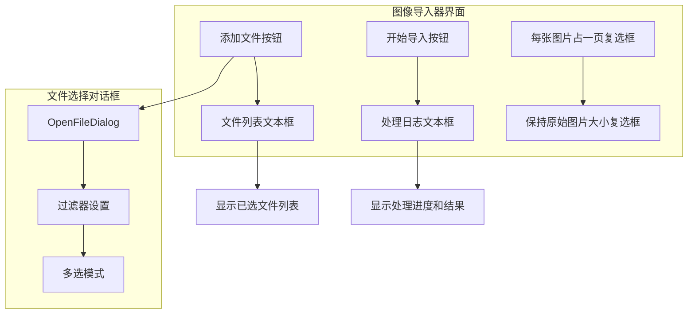
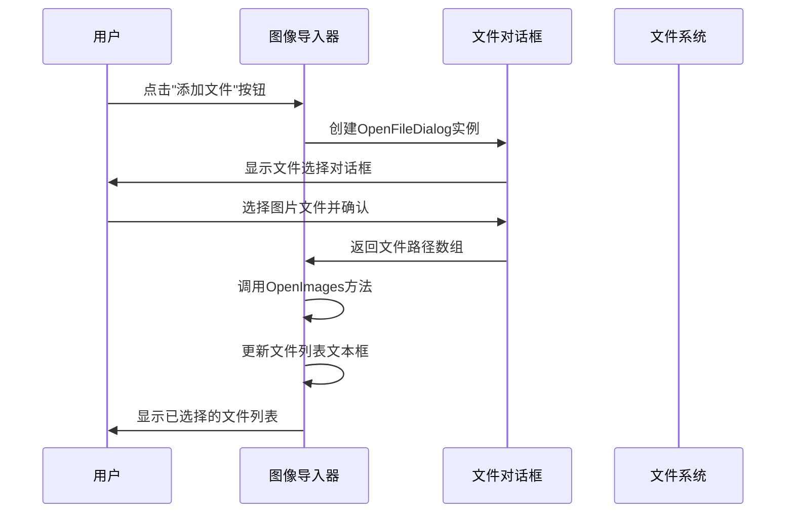
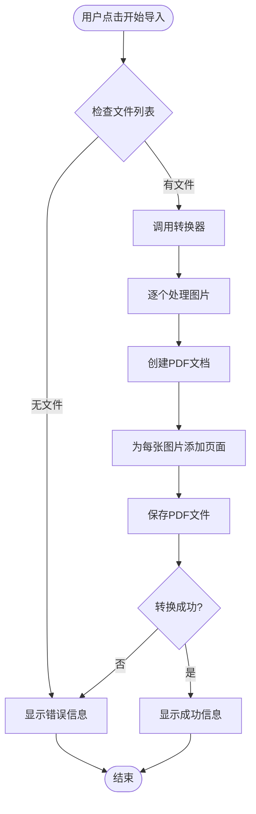
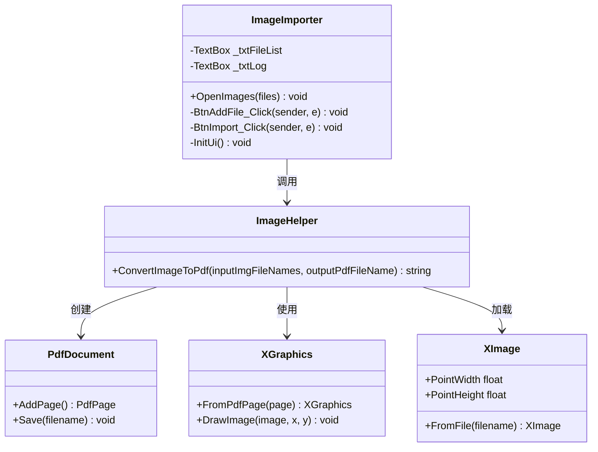

# 图像导入PDF功能使用说明

<cite>
**本文档引用的文件**
- [ImageImporter.cs](file://PdfTool/ImageImporter.cs)
- [ImageImporter.Designer.cs](file://PdfTool/ImageImporter.Designer.cs)
- [MainForm.cs](file://PdfTool/MainForm.cs)
- [MainForm.Designer.cs](file://PdfTool/MainForm.Designer.cs)
- [Config.cs](file://PdfTool/Config.cs)
- [ImageHelper.cs](file://PdfHelperLibrary/ImageHelper.cs)
</cite>

## 目录
1. [功能概述](#功能概述)
2. [界面组件说明](#界面组件说明)
3. [使用流程详解](#使用流程详解)
4. [技术实现原理](#技术实现原理)
5. [实际应用场景](#实际应用场景)
6. [配置选项说明](#配置选项说明)
7. [故障排除指南](#故障排除指南)
8. [总结](#总结)

## 功能概述

图像导入PDF功能是PDF工具套件中的一个重要模块，允许用户将多种格式的图片文件（JPG、PNG、TIFF、BMP等）转换为PDF文档。该功能采用直观的图形界面设计，支持批量文件选择和自动布局，为用户提供便捷的文档归档解决方案。

### 核心特性
- **多格式支持**：支持JPG、PNG、TIFF、BMP等多种常见图片格式
- **批量处理**：可同时选择多个图片文件进行批量转换
- **自动布局**：每张图片自动生成独立页面，保持原始尺寸
- **拖放支持**：支持直接拖拽图片文件到界面进行快速导入
- **实时反馈**：提供详细的处理日志和状态信息

## 界面组件说明

图像导入PDF功能的界面由以下核心组件构成：

**图表来源**
- [ImageImporter.cs](file://PdfTool/ImageImporter.cs#L62-L125)

### 主要界面元素

| 组件名称 | 功能描述 | 默认状态 | 可用性 |
|---------|---------|---------|--------|
| 添加文件按钮 | 打开文件选择对话框，支持多选 | 启用 | 始终可用 |
| 开始导入按钮 | 触发图片到PDF的转换过程 | 启用 | 需要至少一个文件时可用 |
| 文件列表文本框 | 显示用户已选择的图片文件列表 | 只读 | 自动更新 |
| 处理日志文本框 | 显示转换过程中的状态信息和错误提示 | 只读 | 实时更新 |
| 每张图片占一页复选框 | 当前存在但被禁用的功能选项 | 已勾选 | 禁用状态 |
| 保持原始图片大小复选框 | 当前存在但被禁用的功能选项 | 已勾选 | 禁用状态 |

**章节来源**
- [ImageImporter.cs](file://PdfTool/ImageImporter.cs#L62-L125)

## 使用流程详解

### 步骤一：选择图片文件

1. **点击"添加文件"按钮**
   - 用户点击界面上的"添加文件"按钮
   - 系统弹出标准的Windows文件选择对话框

2. **文件过滤和选择**
   - 对话框预设图片文件过滤器：
     - 支持的格式：*.bmp;*.jpg;*.tif;*.png
     - 通用选项：所有文件 (*.*)  
   - 用户可以启用多选模式，同时选择多个图片文件

3. **文件加载到界面**
   - 选中的文件路径会自动添加到文件列表文本框中
   - 每个文件占据一行，便于用户查看已选择的文件

**图表来源**
- [ImageImporter.cs](file://PdfTool/ImageImporter.cs#L39-L44)

### 步骤二：开始转换操作

1. **验证输入文件**
   - 系统检查文件列表是否为空
   - 如果没有选择任何文件，显示错误提示："未添加需要导入的图片文件"

2. **调用转换引擎**
   - 调用PdfHelperLibrary.ImageHelper.ConvertImageToPdf方法
   - 传入文件列表和输出PDF文件名参数

3. **处理转换结果**
   - 如果转换成功，显示："导入完成: [生成的PDF文件路径]"
   - 如果发生错误，显示具体的错误信息

**图表来源**
- [ImageImporter.cs](file://PdfTool/ImageImporter.cs#L46-L58)

### 步骤三：查看处理结果

1. **实时日志更新**
   - 转换过程中，系统会实时更新处理日志
   - 显示当前处理的文件和进度信息

2. **最终结果通知**
   - 转换完成后，显示生成的PDF文件路径
   - 用户可以通过双击日志中的文件路径打开PDF

**章节来源**
- [ImageImporter.cs](file://PdfTool/ImageImporter.cs#L46-L58)

## 技术实现原理

### 核心转换机制

图像导入PDF功能基于PdfSharp库实现，采用以下技术架构：

**图表来源**
- [ImageImporter.cs](file://PdfTool/ImageImporter.cs#L1-L129)
- [ImageHelper.cs](file://PdfHelperLibrary/ImageHelper.cs#L1-L45)

### 关键实现细节

1. **文件选择逻辑**
   - 使用标准的OpenFileDialog控件
   - 设置适当的文件过滤器确保只选择图片文件
   - 启用多选模式支持批量操作

2. **转换算法**
   - 遍历所有选中的图片文件
   - 为每张图片创建新的PDF页面
   - 使用XImage.FromFile加载图片
   - 自动调整页面尺寸以适应图片分辨率
   - 使用XGraphics绘制图片到页面

3. **错误处理机制**
   - 异常捕获和错误信息返回
   - 用户友好的错误提示
   - 保持程序稳定性

**章节来源**
- [ImageImporter.cs](file://PdfTool/ImageImporter.cs#L39-L58)
- [ImageHelper.cs](file://PdfHelperLibrary/ImageHelper.cs#L12-L42)

## 实际应用场景

### 场景一：扫描文档归档

**使用场景**：企业需要将纸质扫描件转换为电子文档进行长期保存

**操作步骤**：
1. 使用扫描仪将纸质文档扫描为高分辨率图片
2. 将扫描得到的JPG或PNG文件添加到图像导入器
3. 点击"开始导入"生成统一格式的PDF文档
4. 将生成的PDF文档存储在公司文档管理系统中

**优势特点**：
- 保持扫描质量的同时减少存储空间
- 提供统一的文档格式便于管理
- 支持批量处理大量扫描文件

### 场景二：照片集整理

**使用场景**：个人用户希望将手机拍摄的照片整理成相册PDF

**操作步骤**：
1. 从手机导出照片到电脑
2. 选择需要整理的照片文件
3. 使用图像导入器创建相册PDF
4. 添加适当的标题和说明文字

**优势特点**：
- 方便携带和分享
- 可以添加元数据信息
- 支持多种图片格式

### 场景三：教学材料制作

**使用场景**：教师需要将讲义图片转换为PDF格式供学生下载

**操作步骤**：
1. 将手写笔记或板书拍照
2. 选择所有相关图片文件
3. 生成教学材料PDF
4. 分享给学生或上传到学习平台

**优势特点**：
- 保留原始书写痕迹
- 支持多种设备查看
- 便于版本管理和更新

## 配置选项说明

### 当前可用配置

| 配置项 | 默认值 | 描述 | 可用性 |
|-------|--------|------|--------|
| 控件边距 | 20像素 | 界面元素与容器边缘的距离 | 固定值 |
| 控件间距 | 12像素 | 界面元素之间的间隔距离 | 固定值 |

### 禁用的功能选项

尽管界面中包含以下配置项，但它们目前处于禁用状态，功能由底层逻辑固定：

| 复选框名称 | 默认状态 | 当前作用 | 未来规划 |
|-----------|---------|---------|---------|
| 每张图片占一页 | 已勾选 | 固定为每张图片生成单独页面 | 计划开放用户选择 |
| 保持原始图片大小 | 已勾选 | 固定保持图片原始尺寸 | 计划添加缩放选项 |

**章节来源**
- [ImageImporter.cs](file://PdfTool/ImageImporter.cs#L82-L101)
- [Config.cs](file://PdfTool/Config.cs#L1-L9)

## 故障排除指南

### 常见问题及解决方案

#### 问题1：无法选择某些图片文件
**症状**：在文件选择对话框中看不到某些图片文件
**原因**：文件可能损坏或格式不受支持
**解决方案**：
1. 检查文件是否确实为图片格式
2. 尝试使用其他图片查看器打开文件
3. 转换文件格式后重试

#### 问题2：转换过程中出现内存不足错误
**症状**：处理大尺寸图片时程序崩溃
**原因**：图片文件过大导致内存溢出
**解决方案**：
1. 减少同时选择的图片数量
2. 使用较低分辨率的图片
3. 关闭其他占用内存的应用程序

#### 问题3：生成的PDF文件无法打开
**症状**：转换后的PDF文件显示损坏或无法打开
**原因**：文件权限问题或磁盘空间不足
**解决方案**：
1. 检查目标目录的写入权限
2. 确保有足够的磁盘空间
3. 尝试将文件保存到不同的位置

#### 问题4：拖放功能不工作
**症状**：直接拖拽图片文件到界面没有响应
**原因**：主窗体的拖放事件处理逻辑限制
**解决方案**：
1. 确保当前选中的标签页是"图片导入PDF"
2. 检查文件扩展名是否为支持的图片格式
3. 使用"添加文件"按钮作为替代方案

**章节来源**
- [MainForm.cs](file://PdfTool/MainForm.cs#L33-L58)
- [ImageImporter.cs](file://PdfTool/ImageImporter.cs#L46-L58)

## 总结

图像导入PDF功能是一个设计精良的文档处理工具，具有以下突出特点：

### 主要优势
- **用户友好**：直观的界面设计和清晰的操作流程
- **功能完整**：支持多种图片格式和批量处理
- **技术可靠**：基于成熟的PdfSharp库实现
- **扩展性强**：预留了未来功能扩展的空间

### 应用价值
该功能特别适用于需要将图片资料转换为标准化PDF格式的场景，如文档归档、教学材料制作、个人照片整理等。其自动化程度高，能够显著提高工作效率。

### 发展方向
随着用户需求的不断增长，该功能可以在以下方面进一步完善：
- 增加图片预处理功能（如裁剪、旋转）
- 提供更多的PDF生成选项
- 支持图片水印添加
- 优化大文件处理性能

通过持续的功能改进和技术优化，图像导入PDF功能将继续为用户提供更加优质的文档处理体验。