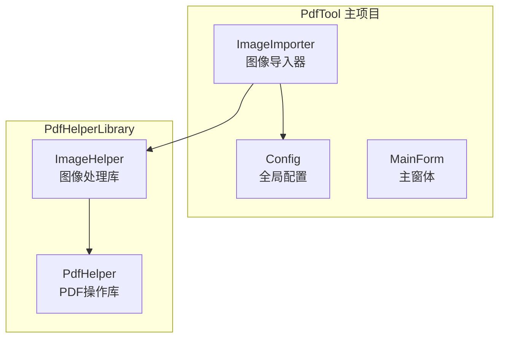
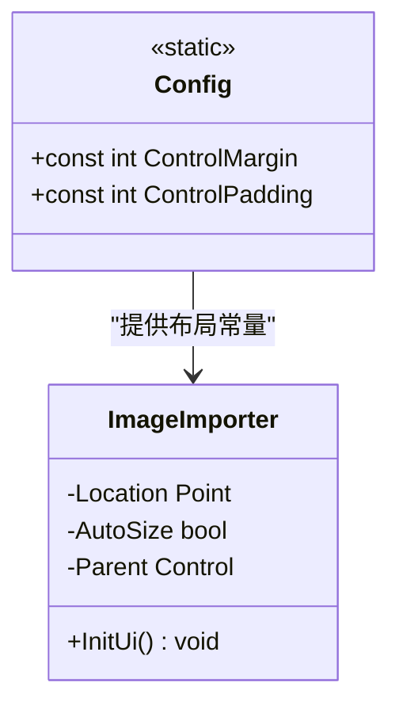
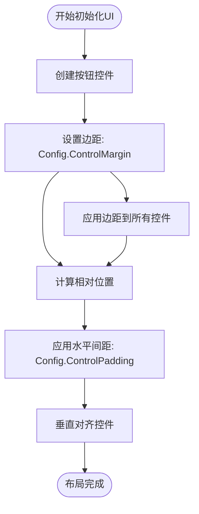
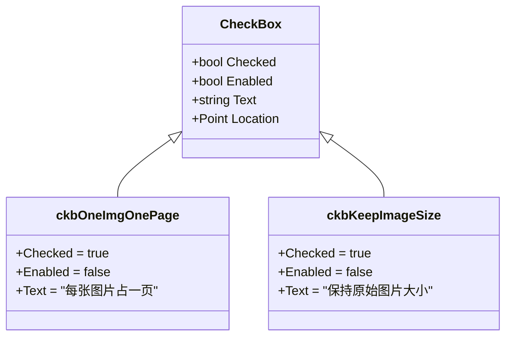
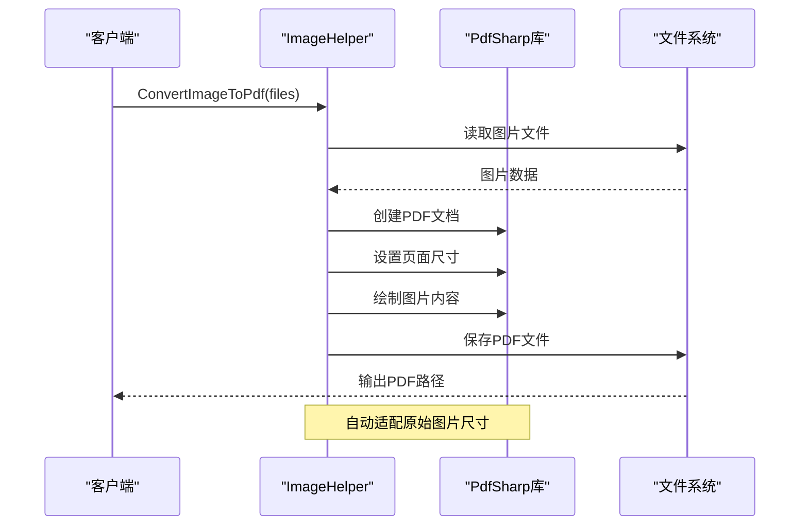

# 参数配置

<cite>
**本文档中引用的文件**
- [ImageImporter.cs](file://PdfTool/ImageImporter.cs)
- [Config.cs](file://PdfTool/Config.cs)
- [ImageHelper.cs](file://PdfHelperLibrary/ImageHelper.cs)
- [ImageImporter.Designer.cs](file://PdfTool/ImageImporter.Designer.cs)
</cite>

## 目录
1. [简介](#简介)
2. [项目结构概述](#项目结构概述)
3. [核心配置常量](#核心配置常量)
4. [UI布局系统](#ui布局系统)
5. [图像导入功能分析](#图像导入功能分析)
6. [默认参数配置](#默认参数配置)
7. [设计意图与最佳实践](#设计意图与最佳实践)
8. [总结](#总结)

## 简介

本文档详细分析了PdfTool项目中图像导入功能的参数配置系统。该系统通过统一的配置常量管理UI布局，并在图像到PDF转换过程中使用默认参数优化用户体验。重点解析了Config.ControlMargin、Config.ControlPadding等UI布局常量的实现方式，以及图像导入界面中复选框的设计意图。

## 项目结构概述

PdfTool项目采用模块化架构，主要包含以下核心组件：

**图表来源**
- [ImageImporter.cs](file://PdfTool/ImageImporter.cs#L1-L129)
- [Config.cs](file://PdfTool/Config.cs#L1-L9)

## 核心配置常量

### Config类结构

Config类作为全局配置中心，定义了所有UI布局相关的常量：

**图表来源**
- [Config.cs](file://PdfTool/Config.cs#L3-L8)
- [ImageImporter.cs](file://PdfTool/ImageImporter.cs#L62-L125)

### 配置常量定义

| 常量名称 | 类型 | 值 | 用途 |
|---------|------|----|----- |
| ControlMargin | int | 20 | 控件与容器边缘的间距 |
| ControlPadding | int | 12 | 控件之间的水平间距 |

**节来源**
- [Config.cs](file://PdfTool/Config.cs#L5-L6)

## UI布局系统

### 动态位置计算

ImageImporter类通过Config常量实现精确的控件布局：

**图表来源**
- [ImageImporter.cs](file://PdfTool/ImageImporter.cs#L64-L125)

### 控件位置算法

控件位置计算遵循以下模式：

1. **基础控件定位**：使用`Config.ControlMargin`作为起始边距
2. **相对定位**：基于前一个控件的边界计算新控件位置
3. **垂直对齐**：通过高度差值实现精确的垂直居中对齐

**节来源**
- [ImageImporter.cs](file://PdfTool/ImageImporter.cs#L66-L101)

## 图像导入功能分析

### 复选框状态分析

图像导入界面包含两个特殊复选框，它们具有特定的设计状态：

**图表来源**
- [ImageImporter.cs](file://PdfTool/ImageImporter.cs#L82-L101)

### 复选框特性

| 复选框 | 初始状态 | 可用性 | 设计意图 |
|--------|----------|--------|----------|
| ckbOneImgOnePage | Checked=true | Enabled=false | 强制每张图片单独成页 |
| ckbKeepImageSize | Checked=true | Enabled=false | 保持原始图片分辨率 |

**节来源**
- [ImageImporter.cs](file://PdfTool/ImageImporter.cs#L85-L101)

## 默认参数配置

### 图像到PDF转换流程

PdfHelperLibrary.ImageHelper.ConvertImageToPdf方法实现了智能的默认参数处理：

**图表来源**
- [ImageHelper.cs](file://PdfHelperLibrary/ImageHelper.cs#L15-L45)

### 默认参数行为

1. **页面尺寸适配**：自动设置页面宽度和高度等于图片的点数宽度和高度
2. **无缩放处理**：直接绘制原始尺寸的图片
3. **批量处理**：支持多张图片合并到单个PDF文件

**节来源**
- [ImageHelper.cs](file://PdfHelperLibrary/ImageHelper.cs#L28-L31)

## 设计意图与最佳实践

### 配置统一化原则

系统采用集中式配置管理，确保：
- **一致性**：所有模块共享相同的布局常量
- **可维护性**：修改一处即可影响全局布局
- **可扩展性**：新增控件时无需重复计算位置

### 用户体验优化

复选框的禁用状态设计体现了以下设计理念：
- **简化配置**：避免用户进行复杂的参数调整
- **性能优化**：减少不必要的计算开销
- **功能明确**：确保转换结果的一致性和可预测性

### 错误处理机制

系统实现了完善的异常处理：
- **文件验证**：检查输入文件的有效性
- **格式兼容**：支持多种图片格式（BMP、JPG、TIF、PNG）
- **错误反馈**：提供清晰的错误信息和日志记录

## 总结

PdfTool项目的图像导入功能展现了优秀的软件设计原则：

1. **配置管理**：通过Config类实现全局统一的UI布局配置
2. **用户体验**：通过预设的复选框状态简化用户操作
3. **技术实现**：利用PdfSharp库实现高质量的图像到PDF转换
4. **代码质量**：清晰的职责分离和良好的错误处理机制

这种设计不仅提高了开发效率，也为用户提供了直观易用的功能体验。通过合理的参数配置和默认行为，系统能够在满足基本需求的同时保持简洁性，体现了现代软件开发的最佳实践。