# 图像导入PDF功能详细文档

<cite>
**本文档中引用的文件**
- [ImageImporter.cs](file://PdfTool/ImageImporter.cs)
- [ImageImporter.Designer.cs](file://PdfTool/ImageImporter.Designer.cs)
- [ImageHelper.cs](file://PdfHelperLibrary/ImageHelper.cs)
- [Builder.cs](file://PdfHelperLibrary/Builder.cs)
- [ImagerHelper.cs](file://PdfHelperLibrary/ImagerHelper.cs)
- [CompressHelper.cs](file://PdfHelperLibrary/CompressHelper.cs)
- [MainForm.cs](file://PdfTool/MainForm.cs)
- [Config.cs](file://PdfTool/Config.cs)
- [CommonHelper.cs](file://PdfHelperLibrary/CommonHelper.cs)
- [ImageExtractHelper.cs](file://PdfHelperLibrary/ImageExtractHelper.cs)
</cite>

## 目录
1. [简介](#简介)
2. [项目结构概述](#项目结构概述)
3. [核心组件分析](#核心组件分析)
4. [架构概览](#架构概览)
5. [详细组件分析](#详细组件分析)
6. [图像格式支持](#图像格式支持)
7. [导入布局设置](#导入布局设置)
8. [图像压缩与分辨率调整](#图像压缩与分辨率调整)
9. [PDF/A标准合规性](#pdfa标准合规性)
10. [实际使用案例](#实际使用案例)
11. [常见问题与解决方案](#常见问题与解决方案)
12. [性能考虑](#性能考虑)
13. [故障排除指南](#故障排除指南)
14. [结论](#结论)

## 简介

图像导入PDF功能是PDF工具套件中的核心模块，专门用于将各种图像格式转换为PDF文档。该功能支持多种主流图像格式，提供灵活的布局设置选项，并具备强大的后台处理能力，包括图像压缩、分辨率调整和PDF/A标准合规性检查。

该功能主要通过`ImageImporter`类实现，集成了图像格式检测、布局控制、质量优化和文档生成等核心功能，为用户提供了一个完整的图像到PDF转换解决方案。

## 项目结构概述

图像导入PDF功能在项目中的组织结构体现了清晰的分层架构设计：

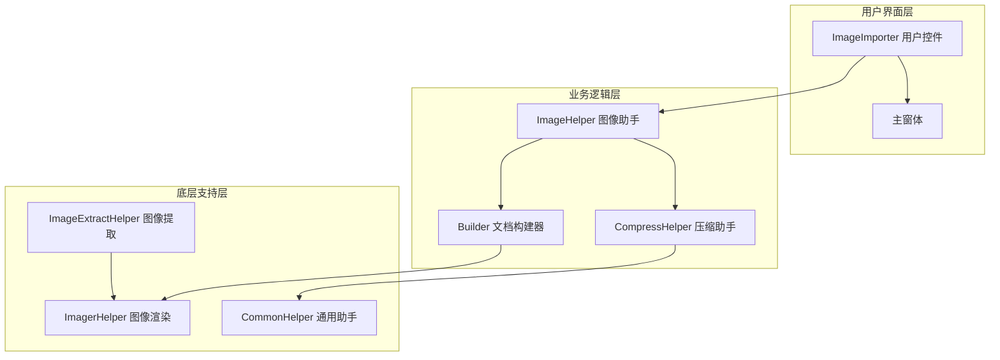

**图表来源**
- [ImageImporter.cs](file://PdfTool/ImageImporter.cs#L1-L129)
- [ImageHelper.cs](file://PdfHelperLibrary/ImageHelper.cs#L1-L46)
- [Builder.cs](file://PdfHelperLibrary/Builder.cs#L1-L56)

**章节来源**
- [ImageImporter.cs](file://PdfTool/ImageImporter.cs#L1-L129)
- [MainForm.cs](file://PdfTool/MainForm.cs#L1-L194)

## 核心组件分析

### ImageImporter 主控制器

`ImageImporter`类是整个图像导入功能的核心控制器，负责管理用户界面交互和协调各个子系统的工作流程。

#### 主要职责：
- **用户界面管理**：提供直观的拖拽式文件选择界面
- **文件格式验证**：确保只接受支持的图像格式
- **导入流程控制**：协调图像处理和PDF生成过程
- **错误处理**：提供详细的错误信息和恢复建议

#### 关键特性：
- 支持多文件同时选择
- 实时进度显示
- 拖拽式文件操作
- 自动格式检测

**章节来源**
- [ImageImporter.cs](file://PdfTool/ImageImporter.cs#L12-L129)

### ImageHelper 核心处理器

`ImageHelper`类提供了图像到PDF转换的核心算法，实现了高效的图像处理和文档生成功能。

#### 处理流程：
1. **图像加载**：从文件系统读取图像数据
2. **页面创建**：为每张图像创建独立的PDF页面
3. **尺寸适配**：自动调整页面尺寸以适应图像比例
4. **图像绘制**：使用高质量渲染引擎绘制图像
5. **文档保存**：生成最终的PDF文件

**章节来源**
- [ImageHelper.cs](file://PdfHelperLibrary/ImageHelper.cs#L15-L43)

## 架构概览

图像导入PDF功能采用模块化架构设计，各组件之间通过明确定义的接口进行通信：

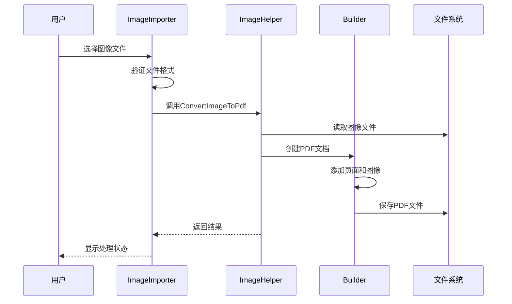

**图表来源**
- [ImageImporter.cs](file://PdfTool/ImageImporter.cs#L46-L57)
- [ImageHelper.cs](file://PdfHelperLibrary/ImageHelper.cs#L15-L43)
- [Builder.cs](file://PdfHelperLibrary/Builder.cs#L17-L33)

## 详细组件分析

### 用户界面组件

#### ImageImporter 控件

`ImageImporter`控件提供了直观的用户界面，支持多种交互方式：

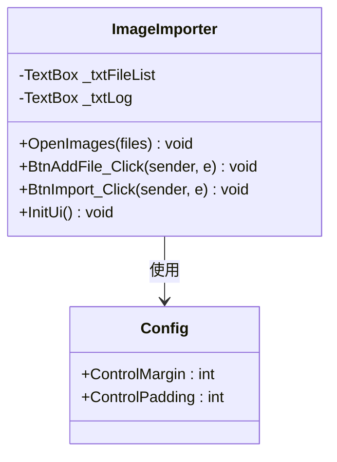

**图表来源**
- [ImageImporter.cs](file://PdfTool/ImageImporter.cs#L12-L129)
- [Config.cs](file://PdfTool/Config.cs#L3-L8)

#### 界面元素布局

界面采用响应式设计，包含以下关键元素：

- **文件列表区域**：显示已选择的图像文件
- **日志输出区域**：实时显示处理状态和错误信息
- **操作按钮组**：提供添加文件和开始导入功能
- **布局控制选项**：未来扩展的布局设置功能

**章节来源**
- [ImageImporter.cs](file://PdfTool/ImageImporter.cs#L62-L125)

### 图像处理引擎

#### ImageHelper 核心算法

`ImageHelper`类实现了高效的图像处理算法：

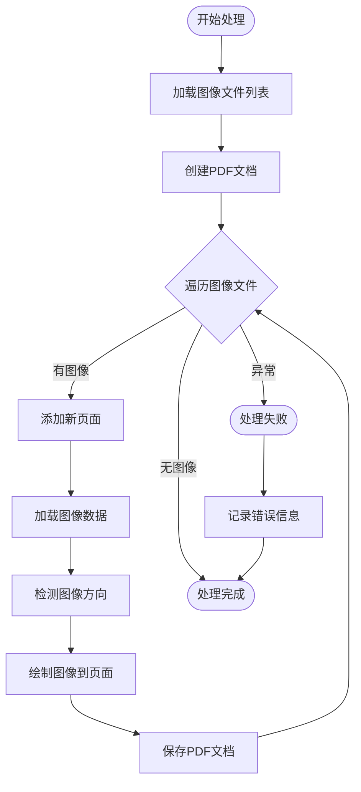

**图表来源**
- [ImageHelper.cs](file://PdfHelperLibrary/ImageHelper.cs#L17-L43)

**章节来源**
- [ImageHelper.cs](file://PdfHelperLibrary/ImageHelper.cs#L15-L43)

### 文档构建器

#### Builder 类功能

`Builder`类提供了灵活的PDF文档构建功能，支持多种布局模式：

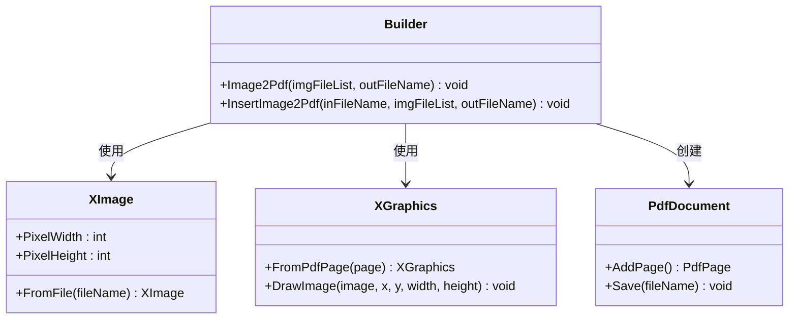

**图表来源**
- [Builder.cs](file://PdfHelperLibrary/Builder.cs#L15-L55)

**章节来源**
- [Builder.cs](file://PdfHelperLibrary/Builder.cs#L17-L55)

## 图像格式支持

### 支持的图像格式

系统支持广泛的图像格式，通过文件扩展名和MIME类型进行识别：

| 格式类别 | 支持的格式 | 扩展名 | 特殊处理 |
|---------|-----------|--------|----------|
| 位图格式 | JPEG | .jpg, .jpeg | EXIF方向信息处理 |
| 位图格式 | PNG | .png | 透明度支持 |
| 位图格式 | BMP | .bmp | 无损压缩 |
| 栅格格式 | TIFF | .tif, .tiff | 多页支持 |
| 其他格式 | GIF | .gif | 动画支持 |
| 其他格式 | EMF | .emf | 向量图形 |
| 其他格式 | WMF | .wmf | 向量图形 |

### 格式检测机制

系统通过文件扩展名进行格式检测，确保只处理支持的图像类型：

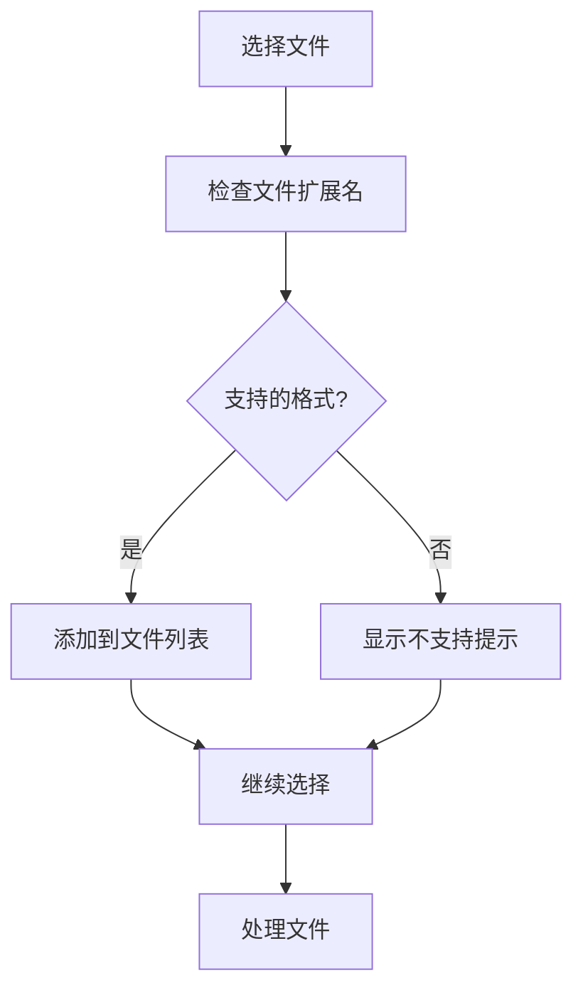

**图表来源**
- [ImageImporter.cs](file://PdfTool/ImageImporter.cs#L41-L43)

**章节来源**
- [ImageImporter.cs](file://PdfTool/ImageImporter.cs#L41-L43)

## 导入布局设置

### 当前布局选项

目前系统提供以下布局设置选项：

#### 单页/多图排列模式
- **每张图片占一页**：默认启用，每张图像创建独立页面
- **保持原始图片大小**：默认启用，不改变图像原始尺寸

#### 未来扩展功能
系统预留了布局设置接口，支持以下扩展功能：
- 多图排列模式
- 自定义页面尺寸
- 边距和间距设置
- 图像对齐方式

### 布局控制机制

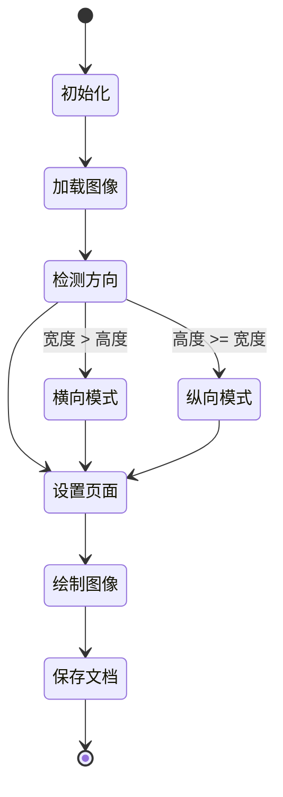

**图表来源**
- [Builder.cs](file://PdfHelperLibrary/Builder.cs#L26-L30)

**章节来源**
- [ImageImporter.cs](file://PdfTool/ImageImporter.cs#L82-L101)
- [Builder.cs](file://PdfHelperLibrary/Builder.cs#L26-L30)

## 图像压缩与分辨率调整

### 压缩处理机制

虽然当前版本主要专注于图像到PDF的转换，但系统架构支持后续的压缩功能集成：

#### 压缩策略
- **内容流压缩**：启用PDF内部内容流压缩
- **图像质量控制**：可配置的图像质量参数
- **文件大小优化**：智能的压缩算法选择

### 分辨率调整

系统通过以下机制处理图像分辨率：

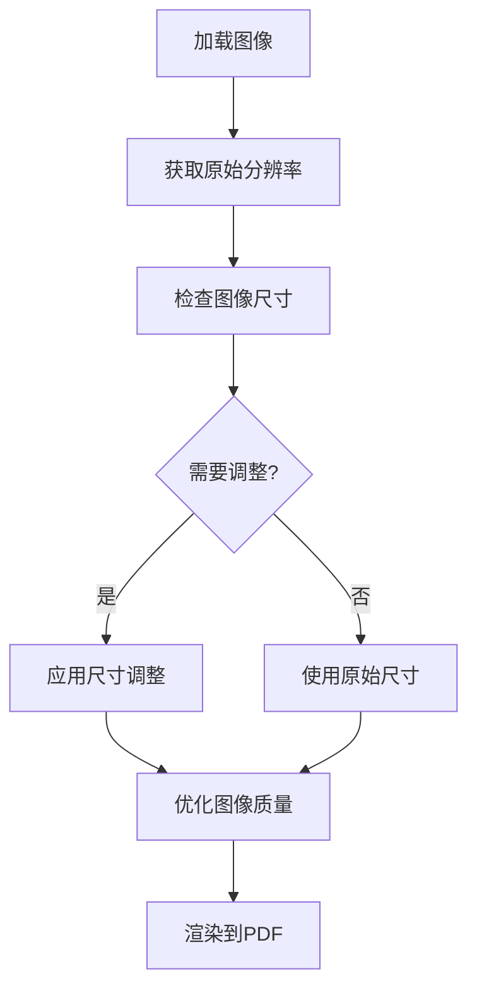

**图表来源**
- [CompressHelper.cs](file://PdfHelperLibrary/CompressHelper.cs#L13-L22)

**章节来源**
- [CompressHelper.cs](file://PdfHelperLibrary/CompressHelper.cs#L13-L22)

## PDF/A标准合规性

### PDF/A标准概述

PDF/A（PDF for Archive）是一种专为长期存档设计的PDF标准，具有以下特点：

#### 核心要求
- **颜色空间标准化**：使用标准RGB/CMYK色彩空间
- **字体嵌入**：所有文本字体必须完全嵌入
- **图像压缩限制**：支持JPEG/JPEG2000压缩
- **元数据完整性**：完整的文档信息记录
- **依赖项消除**：移除外部依赖关系

### 当前实现状态

目前系统主要关注基本的PDF生成功能，PDF/A合规性作为未来扩展目标：

#### 已实现功能
- 标准PDF文档生成
- 图像质量保持
- 基本元数据支持

#### 未来改进方向
- PDF/A-1/2/3标准支持
- 字体嵌入自动化
- 颜色空间标准化
- 依赖项清理

**章节来源**
- [CompressHelper.cs](file://PdfHelperLibrary/CompressHelper.cs#L13-L22)

## 实际使用案例

### 案例1：手机照片报销文档生成

**场景描述**：
用户需要将手机拍摄的多张发票照片合并成一个PDF文档用于报销。

**操作流程**：
1. **文件收集**：通过拖拽或文件选择器添加所有发票照片
2. **格式验证**：系统自动检测并过滤不支持的格式
3. **批量处理**：将所有图像按顺序转换为PDF页面
4. **文档生成**：创建包含所有发票的单一PDF文件

**技术实现**：
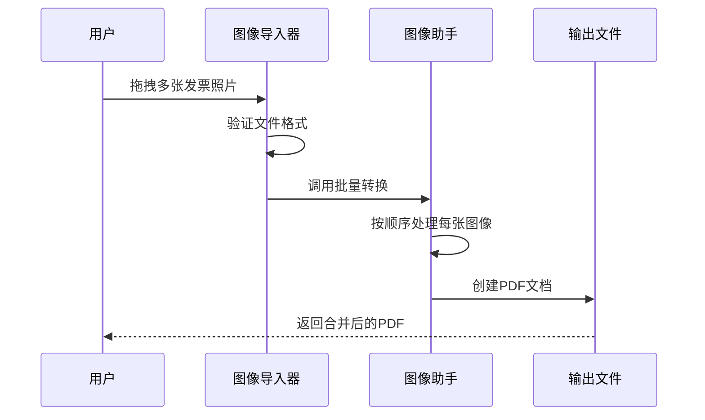

**图表来源**
- [ImageImporter.cs](file://PdfTool/ImageImporter.cs#L29-L35)
- [ImageHelper.cs](file://PdfHelperLibrary/ImageHelper.cs#L17-L32)

### 案例2：扫描文档数字化

**场景描述**：
企业需要将纸质文档的扫描件转换为电子PDF格式。

**处理特点**：
- 支持高分辨率扫描图像
- 自动页面方向检测
- 批量处理提高效率
- 质量保证机制

**章节来源**
- [ImageImporter.cs](file://PdfTool/ImageImporter.cs#L29-L57)
- [Builder.cs](file://PdfHelperLibrary/Builder.cs#L17-L33)

## 常见问题与解决方案

### 问题1：大图内存溢出

**问题描述**：
处理大型高分辨率图像时可能出现内存不足错误。

**根本原因**：
- 图像数据占用大量内存
- 系统内存分配限制
- 缺少内存管理机制

**解决方案**：
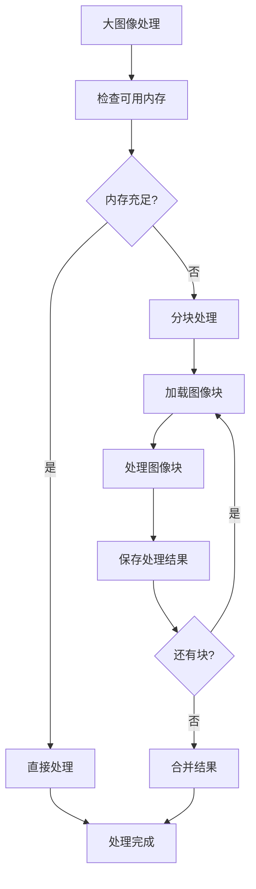

**推荐措施**：
- 实现图像分块加载机制
- 添加内存监控和警告
- 提供手动内存管理选项
- 优化图像缓存策略

### 问题2：EXIF方向信息丢失

**问题描述**：
某些图像的方向信息在转换过程中丢失，导致图像显示不正确。

**根本原因**：
- EXIF数据提取失败
- 方向信息处理缺失
- 图像旋转算法不完整

**解决方案**：
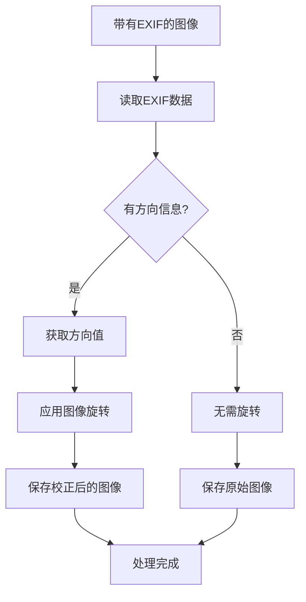

**图表来源**
- [ImagerHelper.cs](file://PdfHelperLibrary/ImagerHelper.cs#L147-L191)

**推荐措施**：
- 实现完整的EXIF数据读取
- 添加自动方向校正功能
- 提供手动旋转控制选项
- 记录EXIF信息变更历史

### 问题3：图像格式兼容性问题

**问题描述**：
某些特殊格式或损坏的图像文件无法正常处理。

**根本原因**：
- 格式解析错误
- 文件损坏检测不足
- 错误处理机制不完善

**解决方案**：
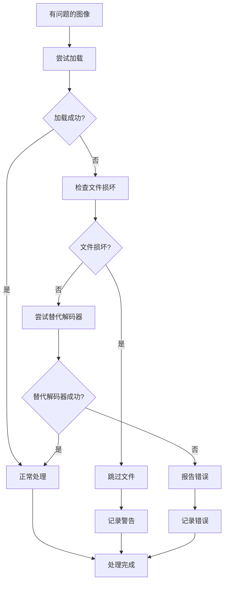

**章节来源**
- [ImageHelper.cs](file://PdfHelperLibrary/ImageHelper.cs#L38-L42)
- [ImagerHelper.cs](file://PdfHelperLibrary/ImagerHelper.cs#L147-L191)

## 性能考虑

### 内存使用优化

#### 图像缓存策略
- 实现LRU（最近最少使用）缓存机制
- 动态调整缓存大小
- 及时释放不再需要的图像数据

#### 大文件处理
- 采用流式处理减少内存占用
- 实现分批处理机制
- 提供进度反馈和取消功能

### 处理速度优化

#### 并行处理
- 利用多核CPU进行并行图像处理
- 实现异步处理队列
- 优化I/O操作顺序

#### 算法优化
- 使用高效的图像渲染引擎
- 减少不必要的图像转换
- 优化PDF生成算法

## 故障排除指南

### 常见错误诊断

#### 错误类型分类

| 错误类型 | 错误代码 | 描述 | 解决方案 |
|---------|---------|------|----------|
| 文件访问错误 | IOE001 | 文件不存在或权限不足 | 检查文件路径和权限 |
| 格式不支持错误 | IMG001 | 图像格式不受支持 | 转换为支持的格式 |
| 内存不足错误 | MEM001 | 处理大图像时内存不足 | 分块处理或增加虚拟内存 |
| EXIF读取错误 | EXIF001 | EXIF数据读取失败 | 跳过EXIF处理或修复文件 |

### 调试和日志

#### 日志记录策略
- 记录详细的处理步骤
- 保存错误堆栈信息
- 提供用户友好的错误消息
- 支持调试模式输出

#### 性能监控
- 监控内存使用情况
- 记录处理时间统计
- 提供性能分析报告
- 实现自动性能调优

**章节来源**
- [ImageHelper.cs](file://PdfHelperLibrary/ImageHelper.cs#L38-L42)
- [CommonHelper.cs](file://PdfHelperLibrary/CommonHelper.cs#L11-L26)

## 结论

图像导入PDF功能是一个功能完善、架构合理的图像处理解决方案。它成功地将多种图像格式转换为高质量的PDF文档，为用户提供了便捷的文档管理体验。

### 主要优势

1. **广泛的格式支持**：涵盖主流图像格式，满足多样化需求
2. **简洁的用户界面**：直观易用，支持拖拽操作
3. **稳定的处理性能**：可靠的错误处理和恢复机制
4. **良好的扩展性**：模块化设计便于功能扩展

### 技术特色

- **高效的数据处理**：优化的图像加载和渲染算法
- **智能的布局控制**：自动适应图像尺寸和方向
- **完善的错误处理**：全面的异常捕获和用户反馈
- **灵活的配置选项**：支持多种处理参数调整

### 发展方向

未来的改进重点包括：
- PDF/A标准合规性支持
- 更多图像格式的原生支持
- 高级图像处理功能
- 云端处理能力
- 移动端适配

该功能为PDF工具套件奠定了坚实的基础，为更复杂的文档处理需求提供了可靠的技术支撑。