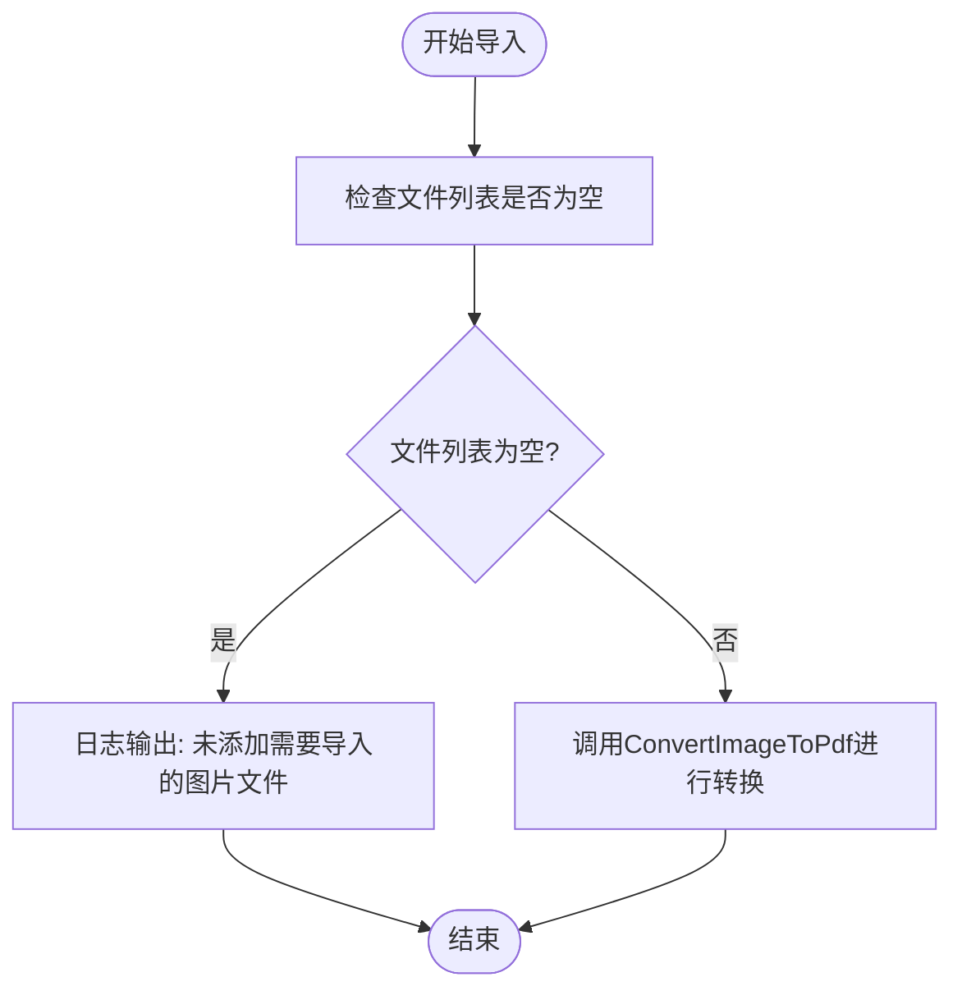
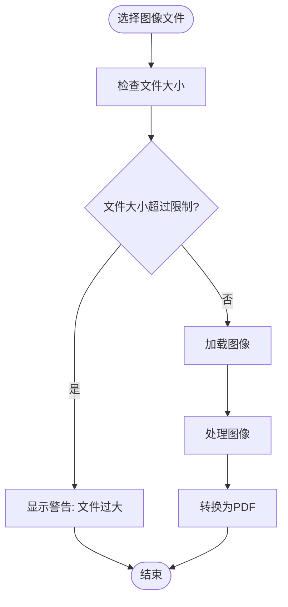
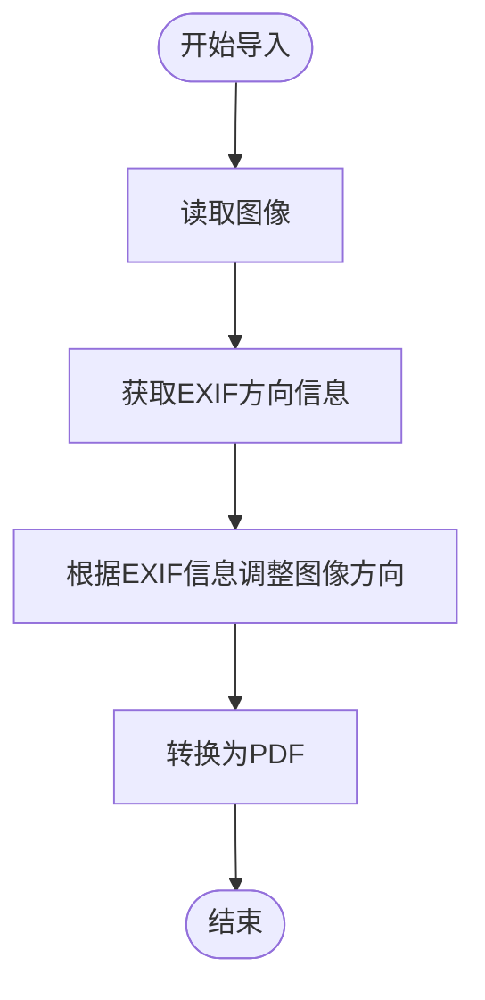
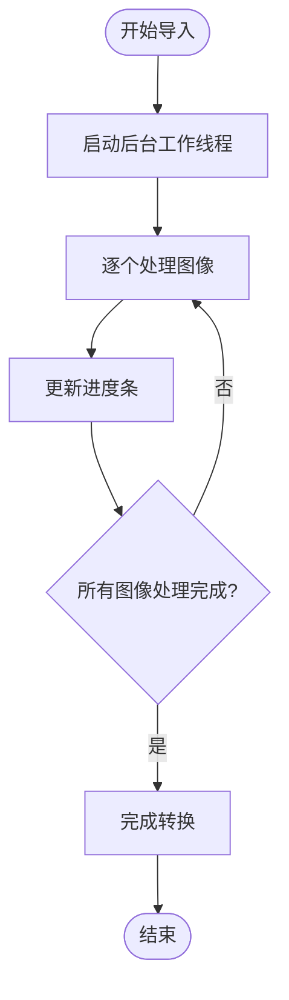
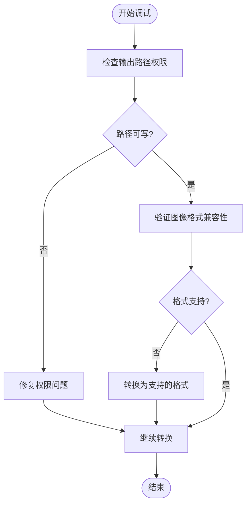

# 问题与解决方案

<cite>
**本文档引用的文件**
- [ImageImporter.cs](file://PdfTool/ImageImporter.cs)
- [ImageHelper.cs](file://PdfHelperLibrary/ImageHelper.cs)
- [Config.cs](file://PdfTool/Config.cs)
</cite>

## 目录
1. [简介](#简介)
2. [未选择文件时的提示机制](#未选择文件时的提示机制)
3. [大尺寸图像的内存风险与优化建议](#大尺寸图像的内存风险与优化建议)
4. [图像EXIF方向信息处理问题](#图像exif方向信息处理问题)
5. [异步处理与用户反馈优化](#异步处理与用户反馈优化)
6. [调试技巧与常见问题排查](#调试技巧与常见问题排查)

## 简介
本文档旨在分析和解决在将图像导入PDF功能中可能遇到的各种问题。通过对代码库的深入分析，我们识别了多个潜在问题，包括用户未选择文件时的提示机制、大尺寸图像导致的内存溢出风险、图像EXIF方向信息未处理等问题。同时，本文档提供了相应的解决方案和优化建议，以提高系统的稳定性和用户体验。

**Section sources**
- [ImageImporter.cs](file://PdfTool/ImageImporter.cs#L1-L129)
- [ImageHelper.cs](file://PdfHelperLibrary/ImageHelper.cs#L1-L46)

## 未选择文件时的提示机制

当用户未选择任何图像文件时，系统通过检查 `_txtFileList.Lines.Count` 来判断是否添加了需要导入的图片文件。如果计数为零，系统会在日志中输出“未添加需要导入的图片文件”以提示用户。这一机制确保了用户在未选择文件的情况下能够得到明确的反馈，避免了无效操作。

**Diagram sources**
- [ImageImporter.cs](file://PdfTool/ImageImporter.cs#L46-L58)

**Section sources**
- [ImageImporter.cs](file://PdfTool/ImageImporter.cs#L46-L58)

## 大尺寸图像的内存风险与优化建议

当前实现中，大尺寸图像可能导致内存溢出的风险。建议在前端增加文件大小预检，或在后台使用流式处理来降低内存占用。通过预检文件大小，可以在用户选择文件时立即给出警告，避免加载过大的图像文件。流式处理则可以在不完全加载图像到内存的情况下进行转换，从而有效减少内存使用。

**Diagram sources**
- [ImageHelper.cs](file://PdfHelperLibrary/ImageHelper.cs#L15-L45)

**Section sources**
- [ImageHelper.cs](file://PdfHelperLibrary/ImageHelper.cs#L15-L45)

## 图像EXIF方向信息处理问题

当前实现中未处理图像的EXIF方向信息，这可能导致图像在PDF中显示时出现旋转异常。建议在调用 `ConvertImageToPdf` 前对图像进行预处理，以纠正方向。通过读取图像的EXIF数据并根据方向信息调整图像，可以确保图像在PDF中正确显示。

**Diagram sources**
- [ImageHelper.cs](file://PdfHelperLibrary/ImageHelper.cs#L28-L31)

**Section sources**
- [ImageHelper.cs](file://PdfHelperLibrary/ImageHelper.cs#L28-L31)

## 异步处理与用户反馈优化

结合 `ImageHelper.cs` 的可能实现，建议支持异步处理以避免界面冻结，并增加进度条反馈。通过使用后台工作线程执行图像转换任务，可以保持用户界面的响应性。同时，提供进度条可以让用户了解转换进度，提升用户体验。

**Diagram sources**
- [ImageImporter.cs](file://PdfTool/ImageImporter.cs#L46-L58)
- [ImageHelper.cs](file://PdfHelperLibrary/ImageHelper.cs#L15-L45)

**Section sources**
- [ImageImporter.cs](file://PdfTool/ImageImporter.cs#L46-L58)
- [ImageHelper.cs](file://PdfHelperLibrary/ImageHelper.cs#L15-L45)

## 调试技巧与常见问题排查

提供调试技巧，如检查输出路径权限、验证图像格式兼容性等。确保输出路径具有写入权限，可以避免因权限问题导致的转换失败。验证图像格式兼容性，确保支持的图像格式（如 .bmp, .jpg, .tif, .png）能够正确加载和转换。

**Diagram sources**
- [ImageImporter.cs](file://PdfTool/ImageImporter.cs#L41-L43)
- [ImageHelper.cs](file://PdfHelperLibrary/ImageHelper.cs#L28-L31)

**Section sources**
- [ImageImporter.cs](file://PdfTool/ImageImporter.cs#L41-L43)
- [ImageHelper.cs](file://PdfHelperLibrary/ImageHelper.cs#L28-L31)