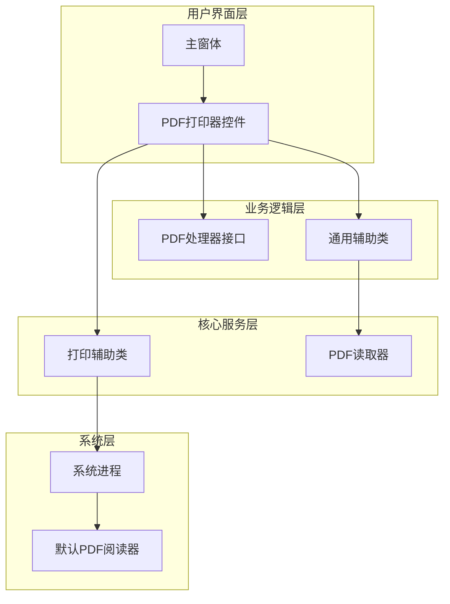
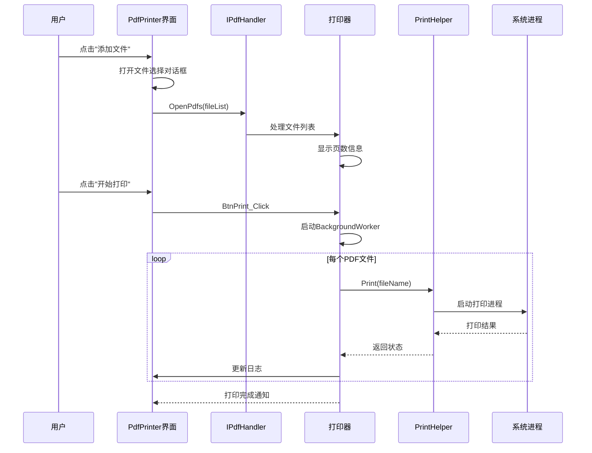
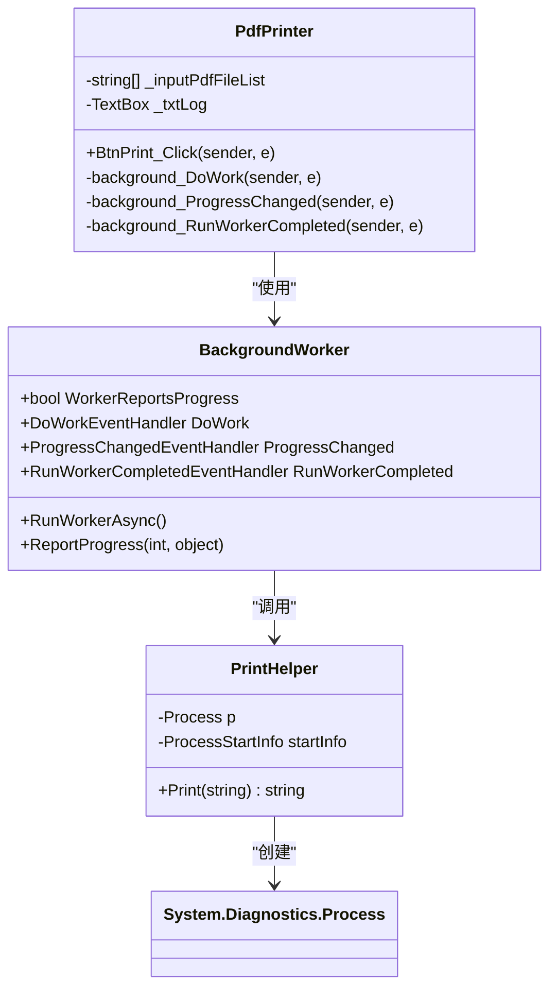
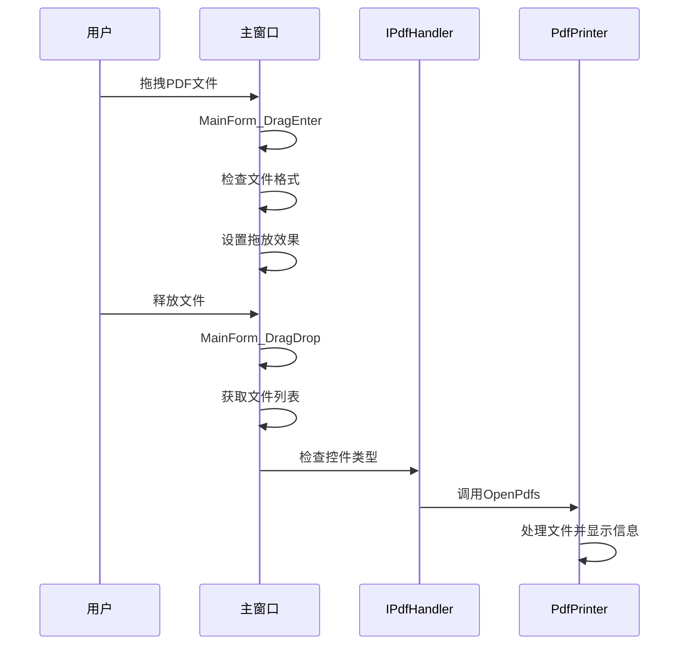
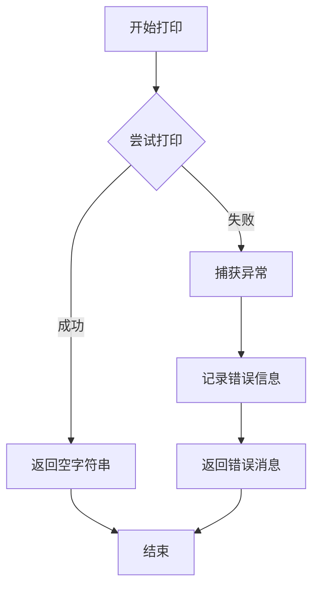

# 基本打印操作

<cite>
**本文档中引用的文件**
- [PdfPrinter.cs](file://PdfTool/PdfPrinter.cs)
- [PdfPrinter.Designer.cs](file://PdfTool/PdfPrinter.Designer.cs)
- [PrintHelper.cs](file://PdfHelperLibrary/PrintHelper.cs)
- [CommonHelper.cs](file://PdfHelperLibrary/CommonHelper.cs)
- [MainForm.cs](file://PdfTool/MainForm.cs)
- [Common.cs](file://PdfTool/Common.cs)
- [Config.cs](file://PdfTool/Config.cs)
</cite>

## 目录
1. [简介](#简介)
2. [项目结构概述](#项目结构概述)
3. [核心组件分析](#核心组件分析)
4. [架构概览](#架构概览)
5. [详细组件分析](#详细组件分析)
6. [操作流程详解](#操作流程详解)
7. [技术实现细节](#技术实现细节)
8. [配置和依赖要求](#配置和依赖要求)
9. [故障排除指南](#故障排除指南)
10. [总结](#总结)

## 简介

PDF批量打印功能是PdfTool项目中的一个重要模块，它允许用户通过图形界面添加多个PDF文件，查看文件页数信息，并启动后台打印任务。该功能基于Windows系统的PDF关联程序，通过调用系统默认PDF阅读器的静默打印功能实现跨应用程序的打印集成。

## 项目结构概述

PdfTool项目采用模块化架构设计，主要包含以下核心组件：



**图表来源**
- [MainForm.cs](file://PdfTool/MainForm.cs#L159)
- [PdfPrinter.cs](file://PdfTool/PdfPrinter.cs#L13)
- [PrintHelper.cs](file://PdfHelperLibrary/PrintHelper.cs#L11)

**章节来源**
- [MainForm.cs](file://PdfTool/MainForm.cs#L130-L167)
- [PdfPrinter.cs](file://PdfTool/PdfPrinter.cs#L1-L110)

## 核心组件分析

### PdfPrinter 控制器

PdfPrinter是批量打印功能的核心控制器，继承自UserControl并实现了IPdfHandler接口。它负责管理用户界面交互、文件处理和打印任务调度。

主要职责包括：
- 提供文件添加界面（按钮和拖放支持）
- 显示PDF文件页数统计信息
- 协调后台打印任务执行
- 记录打印过程日志

### PrintHelper 打印辅助类

PrintHelper是一个静态类，封装了系统级的打印功能。它通过System.Diagnostics.Process类调用系统默认PDF阅读器的打印功能。

核心特性：
- 静默打印模式（CreateNoWindow = true）
- 支持Windows打印动词（Verb = "print"）
- 异常处理和错误消息返回
- 跨应用程序打印集成

### IPdfHandler 接口

IPdfHandler接口定义了PDF处理的标准契约，确保不同模块间的一致性交互。

**章节来源**
- [PdfPrinter.cs](file://PdfTool/PdfPrinter.cs#L13-L16)
- [PrintHelper.cs](file://PdfHelperLibrary/PrintHelper.cs#L9-L33)
- [Common.cs](file://PdfTool/Common.cs#L13-L16)

## 架构概览

批量打印功能采用分层架构设计，从用户界面到系统底层形成清晰的职责分离：



**图表来源**
- [PdfPrinter.cs](file://PdfTool/PdfPrinter.cs#L43-L70)
- [PrintHelper.cs](file://PdfHelperLibrary/PrintHelper.cs#L11-L33)

## 详细组件分析

### 文件添加和页数统计功能

PdfPrinter的文件添加功能通过BtnAddFile_Click事件处理，支持多选PDF文件：

```mermaid
flowchart TD
Start([用户点击"添加文件"]) --> OpenDialog[打开文件选择对话框]
OpenDialog --> CheckResult{用户确认?}
CheckResult --> |否| End([结束])
CheckResult --> |是| CallOpenPdfs[调用OpenPdfs方法]
CallOpenPdfs --> ClearList[清空当前文件列表]
ClearList --> AddFiles[添加新文件到列表]
AddFiles --> LoopFiles[遍历每个文件]
LoopFiles --> GetPageCount[获取文件页数]
GetPageCount --> DisplayInfo[显示页数和文件名]
DisplayInfo --> MoreFiles{还有文件?}
MoreFiles --> |是| LoopFiles
MoreFiles --> |否| End
```

**图表来源**
- [PdfPrinter.cs](file://PdfTool/PdfPrinter.cs#L43-L48)
- [PdfPrinter.cs](file://PdfTool/PdfPrinter.cs#L30-L39)

OpenPdfs方法的核心实现展示了如何加载PDF文件并显示页数统计：

**章节来源**
- [PdfPrinter.cs](file://PdfTool/PdfPrinter.cs#L30-L39)

### 后台打印任务处理

打印功能采用BackgroundWorker实现异步处理，避免阻塞用户界面：



**图表来源**
- [PdfPrinter.cs](file://PdfTool/PdfPrinter.cs#L57-L70)
- [PrintHelper.cs](file://PdfHelperLibrary/PrintHelper.cs#L15-L33)

**章节来源**
- [PdfPrinter.cs](file://PdfTool/PdfPrinter.cs#L50-L70)

### 系统打印集成机制

PrintHelper类通过System.Diagnostics.Process实现与系统PDF阅读器的集成：

```mermaid
flowchart LR
Input[PDF文件路径] --> Process[创建Process对象]
Process --> StartInfo[配置ProcessStartInfo]
StartInfo --> Verb[设置Verb为"print"]
StartInfo --> FileName[指定PDF文件路径]
StartInfo --> CreateNoWindow[隐藏窗口]
Verb --> Launch[启动打印进程]
FileName --> Launch
CreateNoWindow --> Launch
Launch --> SystemPrinter[系统默认打印机]
SystemPrinter --> PrintResult[打印结果]
```

**图表来源**
- [PrintHelper.cs](file://PdfHelperLibrary/PrintHelper.cs#L15-L25)

**章节来源**
- [PrintHelper.cs](file://PdfHelperLibrary/PrintHelper.cs#L11-L33)

## 操作流程详解

### 基本操作步骤

1. **启动应用程序**：运行PdfTool.exe，自动创建主窗体并初始化标签页
2. **切换到打印标签页**：在标签栏中选择"批量打印"选项卡
3. **添加PDF文件**：
   - 点击"添加文件"按钮
   - 在文件对话框中选择多个PDF文件
   - 或者直接拖拽PDF文件到窗口
4. **查看文件信息**：系统自动显示每个文件的页数统计
5. **启动打印任务**：
   - 确认文件列表无误
   - 点击"开始打印"按钮
   - 查看实时打印进度日志
6. **监控打印状态**：通过日志窗口跟踪每个文件的打印状态

### 拖放功能支持

系统提供了便捷的拖放功能，用户可以直接将PDF文件拖放到窗口中：



**图表来源**
- [MainForm.cs](file://PdfTool/MainForm.cs#L33-L59)

**章节来源**
- [MainForm.cs](file://PdfTool/MainForm.cs#L33-L59)

## 技术实现细节

### 文件页数获取机制

PdfPrinter通过CommonHelper.GetPageCount方法获取PDF文件的页数信息：

| 方法参数 | 类型 | 描述 |
|---------|------|------|
| inputPdfFileName | string | PDF文件的完整路径 |

| 返回值 | 类型 | 描述 |
|--------|------|------|
| 页面总数 | int | PDF文档的总页数 |

| 异常情况 | 处理方式 |
|----------|----------|
| 文件不存在 | 抛出FileNotFoundException |
| 文件不是有效PDF | 抛出PdfReaderException |
| 其他异常 | 抛出通用Exception |

### 打印状态跟踪

打印过程中通过多级回调机制跟踪状态变化：

| 回调阶段 | 触发时机 | 输出内容 |
|----------|----------|----------|
| DoWork | 开始处理每个文件 | 文件名和打印状态 |
| ProgressChanged | 进度更新时 | 实时日志消息 |
| RunWorkerCompleted | 所有文件处理完毕 | 完成通知 |

### 错误处理策略

系统实现了多层次的错误处理机制：



**图表来源**
- [PrintHelper.cs](file://PdfHelperLibrary/PrintHelper.cs#L27-L30)

**章节来源**
- [PrintHelper.cs](file://PdfHelperLibrary/PrintHelper.cs#L11-L33)

## 配置和依赖要求

### 系统要求

1. **操作系统**：Windows 7或更高版本
2. **.NET Framework**：4.6.1或更高版本
3. **PDF关联程序**：系统默认PDF阅读器必须支持"print"动词命令

### 默认程序配置

为了确保打印功能正常工作，需要正确配置PDF文件的默认打开程序：

| 步骤 | 操作 | 说明 |
|------|------|------|
| 1 | 右键点击PDF文件 | 选择"打开方式" > "选择其他应用" |
| 2 | 选择PDF阅读器 | 如Adobe Reader、Foxit Reader等 |
| 3 | 勾选"始终使用此应用打开.pdf文件" |
| 4 | 点击"确定"保存设置 |

### 打印队列验证

建议在首次使用前验证打印队列状态：

1. 打开控制面板 > 设备和打印机
2. 确认默认打印机状态正常
3. 检查打印队列无堵塞
4. 测试简单文档打印功能

**章节来源**
- [Config.cs](file://PdfTool/Config.cs#L1-L8)

## 故障排除指南

### 常见问题及解决方案

| 问题描述 | 可能原因 | 解决方案 |
|----------|----------|----------|
| 添加文件后无响应 | PDF文件损坏或格式不支持 | 检查文件完整性，转换为标准PDF格式 |
| 打印任务失败 | 默认PDF阅读器不支持打印 | 更换支持打印功能的PDF阅读器 |
| 打印队列无反应 | 系统打印服务异常 | 重启打印服务或检查打印机连接 |
| 日志显示错误信息 | 权限不足或文件被占用 | 以管理员身份运行或关闭文件占用程序 |

### 调试和诊断

当遇到打印问题时，可以通过以下方式诊断：

1. **检查文件权限**：确保PDF文件可读且未被其他程序锁定
2. **验证默认程序**：确认系统默认PDF阅读器支持打印功能
3. **查看系统日志**：检查Windows事件日志中的打印相关错误
4. **测试单个文件**：逐一测试PDF文件的打印功能

### 性能优化建议

1. **文件大小控制**：避免同时处理过大的PDF文件
2. **内存管理**：及时清理不再需要的文件引用
3. **并发控制**：合理设置后台任务数量
4. **异常恢复**：实现断点续传机制处理失败任务

**章节来源**
- [PdfPrinter.cs](file://PdfTool/PdfPrinter.cs#L52-L56)
- [PrintHelper.cs](file://PdfHelperLibrary/PrintHelper.cs#L27-L30)

## 总结

PDF批量打印功能通过精心设计的分层架构，实现了用户友好的批量处理体验。该功能的核心优势包括：

1. **直观的操作界面**：通过按钮和拖放功能简化文件添加过程
2. **实时状态反馈**：详细的日志系统让用户随时了解打印进度
3. **系统深度集成**：充分利用Windows系统的PDF关联机制
4. **可靠的错误处理**：完善的异常捕获和用户反馈机制
5. **异步处理能力**：避免阻塞用户界面，提升用户体验

该实现不仅满足了基本的批量打印需求，还为未来的功能扩展奠定了良好的基础。通过模块化的设计和清晰的接口定义，系统具备了良好的可维护性和可扩展性。

对于开发者而言，理解这些核心组件的工作原理有助于更好地维护和扩展功能。对于最终用户而言，掌握正确的配置方法和使用技巧能够充分发挥该功能的价值。