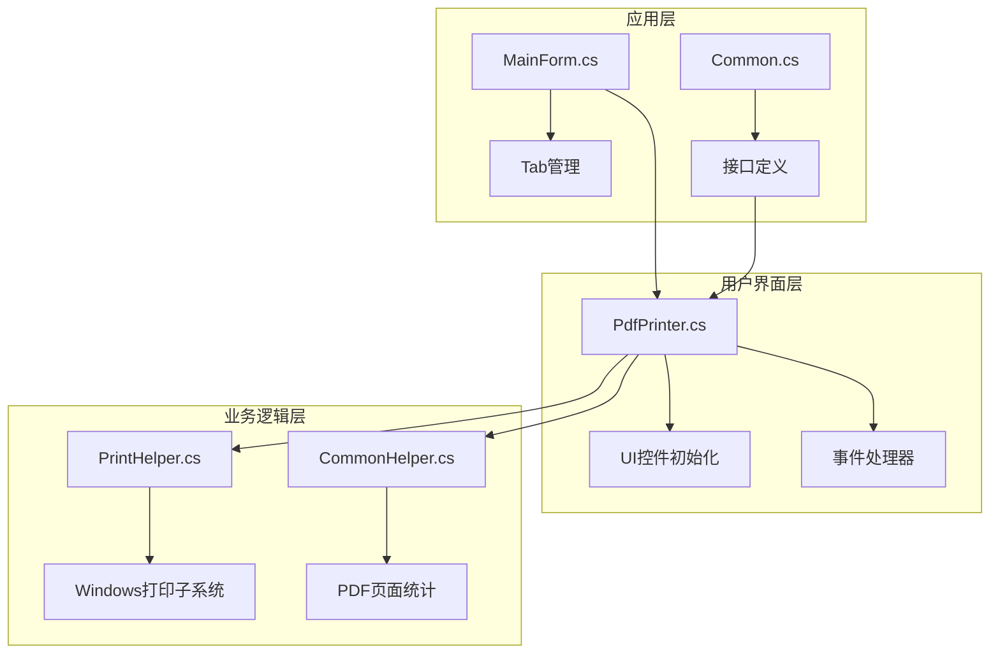
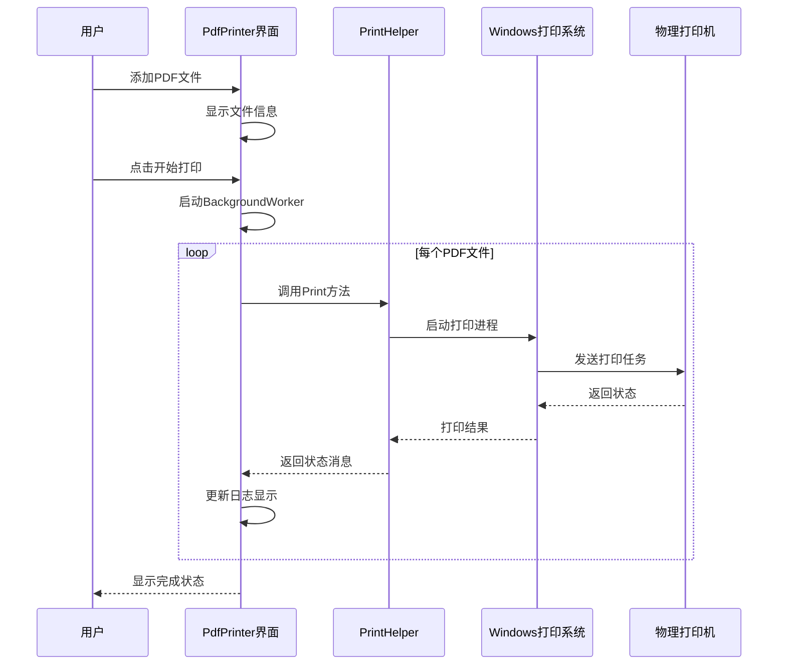
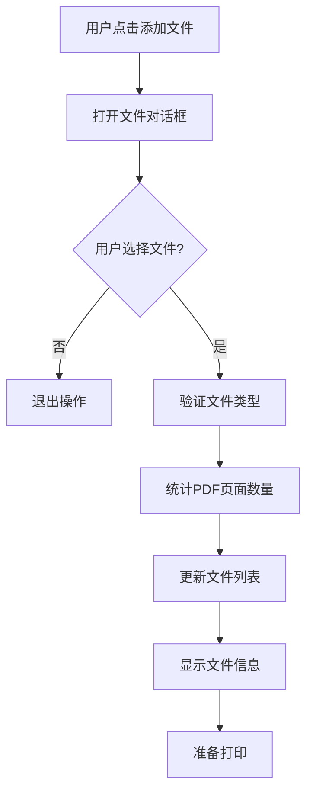
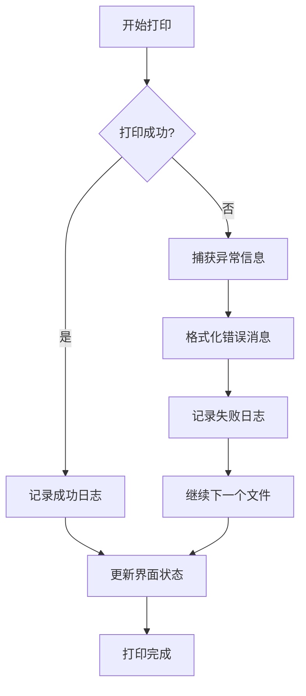
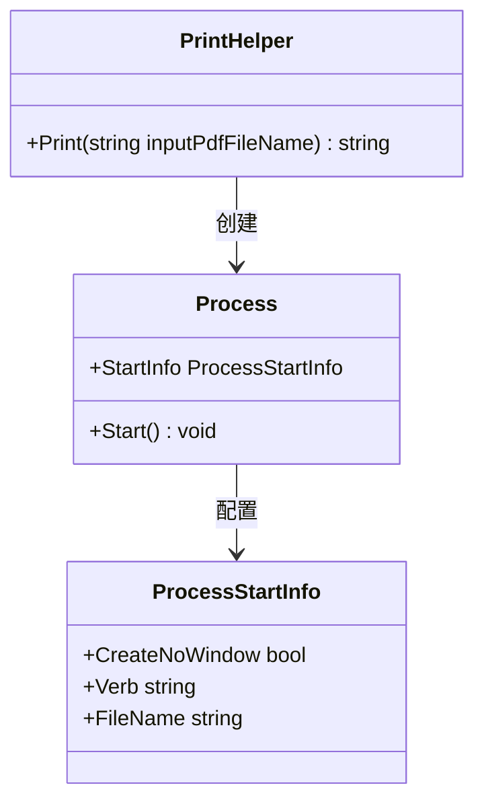
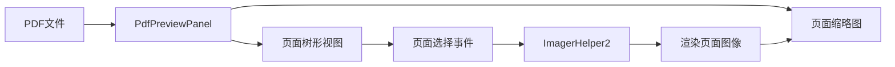
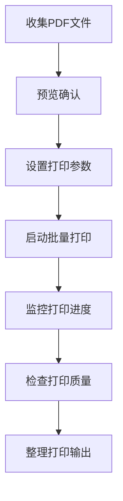

# 批量打印机功能实现详解

<cite>
**本文档引用的文件**
- [PdfPrinter.cs](file://PdfTool/PdfPrinter.cs)
- [PrintHelper.cs](file://PdfHelperLibrary/PrintHelper.cs)
- [CommonHelper.cs](file://PdfHelperLibrary/CommonHelper.cs)
- [MainForm.cs](file://PdfTool/MainForm.cs)
- [Config.cs](file://PdfTool/Config.cs)
- [Common.cs](file://PdfTool/Common.cs)
- [PdfPreviewPanel.cs](file://PdfTool/PdfPreviewPanel.cs)
- [PdfPreviewer.cs](file://PdfTool/PdfPreviewer.cs)
</cite>

## 目录
1. [简介](#简介)
2. [项目结构概览](#项目结构概览)
3. [核心组件分析](#核心组件分析)
4. [架构设计](#架构设计)
5. [详细功能实现](#详细功能实现)
6. [用户界面逻辑](#用户界面逻辑)
7. [打印子系统集成](#打印子系统集成)
8. [打印预览功能](#打印预览功能)
9. [典型应用场景](#典型应用场景)
10. [常见问题与解决方案](#常见问题与解决方案)
11. [总结](#总结)

## 简介

PDF批量打印机是PDF工具套件中的核心功能模块，提供了高效、便捷的PDF文件批量打印解决方案。该功能通过集成Windows打印子系统，实现了对多个PDF文件的自动化打印处理，支持打印队列管理、进度监控和错误处理等企业级特性。

## 项目结构概览

批量打印功能主要分布在以下关键模块中：

**图表来源**
- [PdfPrinter.cs](file://PdfTool/PdfPrinter.cs#L1-L110)
- [PrintHelper.cs](file://PdfHelperLibrary/PrintHelper.cs#L1-L34)
- [CommonHelper.cs](file://PdfHelperLibrary/CommonHelper.cs#L1-L29)

**章节来源**
- [PdfPrinter.cs](file://PdfTool/PdfPrinter.cs#L1-L110)
- [MainForm.cs](file://PdfTool/MainForm.cs#L1-L194)

## 核心组件分析

### PdfPrinter类 - 主要业务控制器

PdfPrinter类是批量打印功能的核心控制器，实现了以下关键职责：

- **文件管理**：维护待打印PDF文件列表
- **UI交互**：提供直观的用户界面
- **打印调度**：协调打印任务执行
- **进度监控**：实时显示打印状态

### PrintHelper类 - 打印引擎

PrintHelper类封装了Windows打印子系统的调用逻辑，提供简洁的打印接口：

- **进程启动**：通过Process对象启动打印进程
- **错误处理**：捕获并报告打印异常
- **默认打印机**：利用系统默认打印机设置

**章节来源**
- [PdfPrinter.cs](file://PdfTool/PdfPrinter.cs#L10-L110)
- [PrintHelper.cs](file://PdfHelperLibrary/PrintHelper.cs#L1-L34)

## 架构设计

批量打印功能采用分层架构设计，确保了良好的可维护性和扩展性：

**图表来源**
- [PdfPrinter.cs](file://PdfTool/PdfPrinter.cs#L50-L70)
- [PrintHelper.cs](file://PdfHelperLibrary/PrintHelper.cs#L11-L32)

## 详细功能实现

### 文件选择与验证

PdfPrinter提供了灵活的文件选择机制：

**图表来源**
- [PdfPrinter.cs](file://PdfTool/PdfPrinter.cs#L43-L48)
- [CommonHelper.cs](file://PdfHelperLibrary/CommonHelper.cs#L11-L26)

### 打印队列管理

系统采用BackgroundWorker模式实现异步打印，确保用户界面的响应性：

- **并发控制**：每次只处理一个文件，避免打印队列混乱
- **进度报告**：实时更新打印状态和进度信息
- **错误隔离**：单个文件打印失败不影响其他文件

### 错误处理机制

**图表来源**
- [PrintHelper.cs](file://PdfHelperLibrary/PrintHelper.cs#L13-L31)
- [PdfPrinter.cs](file://PdfTool/PdfPrinter.cs#L58-L67)

**章节来源**
- [PdfPrinter.cs](file://PdfTool/PdfPrinter.cs#L43-L70)
- [PrintHelper.cs](file://PdfHelperLibrary/PrintHelper.cs#L11-L32)

## 用户界面逻辑

### 控件布局与交互

PdfPrinter采用简洁直观的界面设计：

| 控件类型 | 功能描述 | 位置坐标 | 属性配置 |
|---------|---------|---------|---------|
| 添加文件按钮 | 选择PDF文件 | (20, 20) | 自动大小，多选支持 |
| 开始打印按钮 | 触发批量打印 | (添加按钮右侧+12px) | 自动大小，禁用状态 |
| 日志显示区域 | 显示打印状态 | 填充剩余空间 | 只读，滚动条，多行 |

### 状态管理

界面通过以下机制管理打印状态：
- **文件列表状态**：跟踪已添加的PDF文件
- **打印进度状态**：实时更新打印进度
- **错误状态**：显示具体的错误信息

**章节来源**
- [PdfPrinter.cs](file://PdfTool/PdfPrinter.cs#L75-L109)
- [Config.cs](file://PdfTool/Config.cs#L1-L9)

## 打印子系统集成

### Windows打印子系统调用

PrintHelper通过Process类直接调用Windows打印子系统：

**图表来源**
- [PrintHelper.cs](file://PdfHelperLibrary/PrintHelper.cs#L15-L23)

### 打印参数配置

系统通过以下方式配置打印行为：
- **CreateNoWindow**：隐藏打印过程中的窗口
- **Verb**："print" - 指定打印操作
- **FileName**：目标PDF文件路径

### 错误重试机制

虽然当前版本没有实现自动重试，但系统提供了完善的错误报告机制，便于后续扩展重试功能。

**章节来源**
- [PrintHelper.cs](file://PdfHelperLibrary/PrintHelper.cs#L11-L32)

## 打印预览功能

### 预览系统架构

系统集成了独立的PDF预览功能，为批量打印提供前置验证：

**图表来源**
- [PdfPreviewPanel.cs](file://PdfTool/PdfPreviewPanel.cs#L20-L35)

### 页面预览实现

预览功能通过以下步骤实现：
1. **文件加载**：统计PDF总页数
2. **页面树构建**：创建页面导航树
3. **图像渲染**：按需渲染页面缩略图
4. **交互响应**：支持页面切换和放大

**章节来源**
- [PdfPreviewPanel.cs](file://PdfTool/PdfPreviewPanel.cs#L1-L49)
- [PdfPreviewer.cs](file://PdfTool/PdfPreviewer.cs#L1-L45)

## 典型应用场景

### 批量打印工资单

对于人力资源部门，批量打印工资单是一个典型的应用场景：

| 应用场景 | 输入文件 | 输出要求 | 注意事项 |
|---------|---------|---------|---------|
| 工资单批量打印 | 多个员工工资单PDF | 单面打印，按员工编号排序 | 确保隐私保护 |
| 发票批量打印 | 客户发票集合 | 双面打印，装订成册 | 检查发票完整性 |
| 报告批量打印 | 季度/年度报告 | 彩色打印，封面装订 | 校对报告准确性 |

### 批量打印流程

## 常见问题与解决方案

### 驱动兼容性问题

**问题症状**：
- 打印机无法识别PDF文件
- 打印质量异常（模糊、颜色偏差）
- 打印速度过慢

**诊断方法**：
1. 检查打印机驱动程序版本
2. 验证PDF文件格式兼容性
3. 测试单一文件打印

**解决方案**：
- 更新打印机驱动程序
- 使用标准PDF格式
- 调整打印分辨率设置

### 打印任务卡住问题

**问题症状**：
- 打印队列停滞不前
- 系统资源占用过高
- 打印服务无响应

**诊断方法**：
1. 查看系统打印日志
2. 检查打印服务状态
3. 监控系统资源使用

**解决方案**：
1. 重启打印服务
2. 清空打印队列
3. 重新安装打印驱动

### 内存泄漏风险

**预防措施**：
- 及时释放PDF文件句柄
- 限制同时处理的文件数量
- 实现超时机制

**监控指标**：
- 内存使用率
- 文件句柄数量
- 打印队列长度

### 性能优化建议

| 优化策略 | 实施方法 | 预期效果 |
|---------|---------|---------|
| 异步处理 | BackgroundWorker模式 | 提升界面响应性 |
| 内存管理 | 及时释放资源 | 减少内存占用 |
| 批量限制 | 设置最大文件数 | 避免系统过载 |
| 错误恢复 | 实现断点续传 | 提高成功率 |

**章节来源**
- [PdfPrinter.cs](file://PdfTool/PdfPrinter.cs#L50-L70)

## 总结

PDF批量打印机功能通过精心设计的架构，实现了高效、可靠的PDF文件批量打印解决方案。该功能具有以下特点：

### 技术优势
- **架构清晰**：分层设计确保了良好的可维护性
- **性能优异**：异步处理保证了用户界面的响应性
- **错误处理完善**：提供了详细的错误信息和状态反馈
- **扩展性强**：基于接口的设计便于功能扩展

### 应用价值
- **提高效率**：大幅减少人工操作时间
- **降低成本**：减少纸张和墨水消耗
- **提升质量**：标准化打印流程
- **增强体验**：提供直观的操作界面

### 发展方向
- **智能排程**：根据打印机状态自动调整打印顺序
- **云端打印**：支持网络打印机和云打印服务
- **智能检测**：自动检测文件质量和打印参数
- **批量优化**：智能合并相邻打印任务

该批量打印功能为企业级应用提供了坚实的技术基础，能够满足各种复杂的打印需求，是PDF工具套件中的重要组成部分。