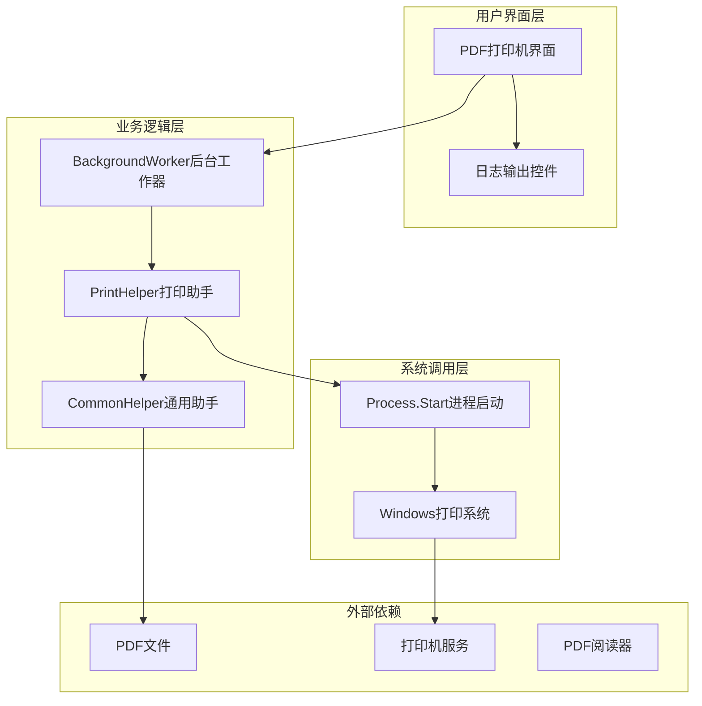
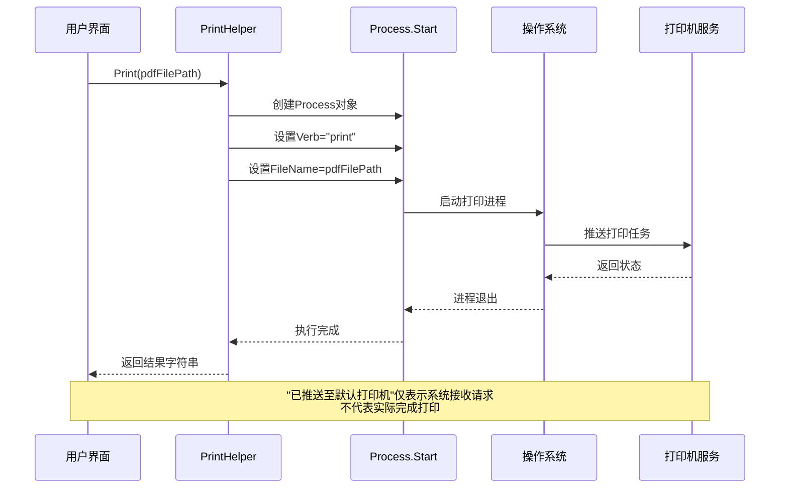
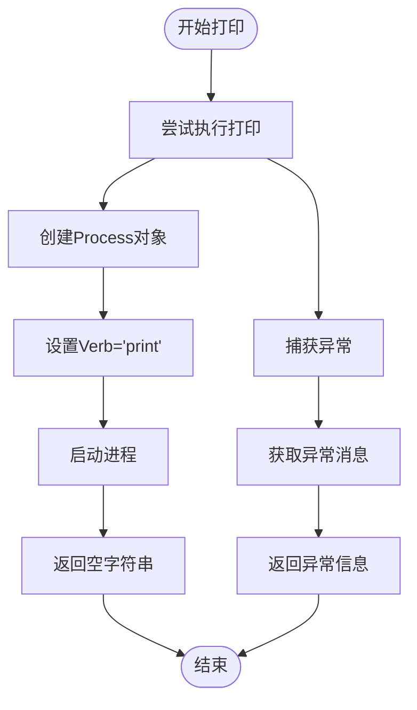

# 故障排除与常见问题

<cite>
**本文档引用的文件**
- [PrintHelper.cs](file://PdfHelperLibrary/PrintHelper.cs)
- [PdfPrinter.cs](file://PdfTool/PdfPrinter.cs)
- [CommonHelper.cs](file://PdfHelperLibrary/CommonHelper.cs)
- [MainForm.cs](file://PdfTool/MainForm.cs)
- [Config.cs](file://PdfTool/Config.cs)
</cite>

## 目录
1. [简介](#简介)
2. [系统架构概述](#系统架构概述)
3. [PrintHelper异常分析](#printhelper异常分析)
4. [常见问题及解决方案](#常见问题及解决方案)
5. [诊断工具与方法](#诊断工具与方法)
6. [错误消息对照表](#错误消息对照表)
7. [最佳实践建议](#最佳实践建议)
8. [总结](#总结)

## 简介

本文档系统性地整理了PDF批量打印功能的常见问题及其解决方案。通过深入分析PrintHelper类的实现原理，结合实际应用场景，为用户提供全面的问题诊断和解决指南。

## 系统架构概述

PDF批量打印功能采用分层架构设计，主要包含以下核心组件：



**图表来源**
- [PdfPrinter.cs](file://PdfTool/PdfPrinter.cs#L50-L70)
- [PrintHelper.cs](file://PdfHelperLibrary/PrintHelper.cs#L11-L30)

**章节来源**
- [PdfPrinter.cs](file://PdfTool/PdfPrinter.cs#L1-L110)
- [PrintHelper.cs](file://PdfHelperLibrary/PrintHelper.cs#L1-L34)

## PrintHelper异常分析

### 核心实现原理

PrintHelper类采用Windows系统级打印机制，通过Process.Start方法调用操作系统的"print" verb来执行打印任务：



**图表来源**
- [PrintHelper.cs](file://PdfHelperLibrary/PrintHelper.cs#L15-L25)
- [PdfPrinter.cs](file://PdfTool/PdfPrinter.cs#L61-L63)

### 异常处理机制

PrintHelper采用简单的异常捕获策略，将所有异常信息转换为可读的消息字符串：



**图表来源**
- [PrintHelper.cs](file://PdfHelperLibrary/PrintHelper.cs#L13-L29)

**章节来源**
- [PrintHelper.cs](file://PdfHelperLibrary/PrintHelper.cs#L11-L30)

## 常见问题及解决方案

### 1. PDF文件被占用问题

**问题描述**: 当PDF文件正在被其他程序使用时，打印操作会失败。

**可能原因**:
- 文件被PDF阅读器打开
- 文件被防病毒软件扫描
- 文件被其他PDF工具锁定

**解决方案**:
1. 关闭所有可能占用PDF文件的程序
2. 检查文件是否处于只读状态
3. 尝试复制文件到临时目录后再进行打印
4. 使用文件监控工具检测文件占用情况

**预防措施**:
- 在打印前验证文件访问权限
- 实现文件锁定检测机制
- 提供文件状态检查功能

### 2. 缺少默认PDF阅读器

**问题描述**: 系统没有设置默认的PDF阅读器，导致打印失败。

**诊断步骤**:
1. 检查系统PDF关联设置
2. 验证PDF阅读器是否正确安装
3. 测试手动打开PDF文件的功能

**解决方案**:
1. **重新关联PDF程序**:
   ```powershell
   # PowerShell命令示例
   $extension = ".pdf"
   $progId = "AcroExch.Document.DC"  # Adobe Reader ProgID
   reg add "HKEY_CURRENT_USER\Software\Classes\$extension" /v "Content Type" /t REG_SZ /d "application/pdf" /f
   reg add "HKEY_CURRENT_USER\Software\Classes\$extension" /v "" /t REG_SZ /d "$progId" /f
   ```

2. **安装推荐的PDF阅读器**:
   - Adobe Reader DC (推荐)
   - Foxit Reader
   - SumatraPDF

### 3. 打印机服务未启动

**问题描述**: Windows打印后台处理程序(Spooler)服务未运行。

**诊断方法**:
1. 检查服务状态:
   ```cmd
   sc query Spooler
   ```
2. 查看Windows事件查看器中的打印相关日志

**解决方案**:
1. **重启打印后台处理程序服务**:
   ```cmd
   net stop spooler
   net start spooler
   ```

2. **清理打印队列**:
   ```cmd
   del %SystemRoot%\System32\spool\PRINTERS\*.*
   net start spooler
   ```

### 4. 驱动兼容性问题

**问题描述**: 打印机驱动程序版本过旧或不兼容。

**诊断步骤**:
1. 检查打印机属性中的驱动程序版本
2. 查看Windows事件查看器中的驱动程序错误
3. 测试不同PDF阅读器的打印效果

**解决方案**:
1. **更新打印机驱动程序**:
   - 访问打印机制造商官网
   - 下载并安装最新驱动程序
   - 重启计算机

2. **更换PDF阅读器**:
   - Adobe Reader: 支持最稳定的命令行打印
   - Foxit Reader: 良好的兼容性和性能
   - SumatraPDF: 轻量级且稳定

### 5. 权限不足问题

**问题描述**: 当前用户账户没有足够的权限执行打印操作。

**解决方案**:
1. 以管理员身份运行应用程序
2. 检查文件和目录的访问权限
3. 验证用户在打印服务器上的权限

**章节来源**
- [PrintHelper.cs](file://PdfHelperLibrary/PrintHelper.cs#L27-L29)
- [PdfPrinter.cs](file://PdfTool/PdfPrinter.cs#L52-L70)

## 诊断工具与方法

### 1. Windows事件查看器

**打印日志位置**: Windows事件查看器 > 应用程序和服务日志 > Microsoft > Windows > PrintService > Admin

**关键日志类型**:
- 打印作业状态变化
- 打印机连接问题
- 驱动程序错误

### 2. printui.dll调试工具

**使用方法**:
```cmd
rundll32 printui.dll,PrintUIEntry /y /n "打印机名称"
```

**功能**:
- 重新安装打印机
- 重置打印队列
- 检查打印机状态

### 3. PowerShell诊断脚本

**打印机状态查询**:
```powershell
# 获取所有打印机状态
Get-Printer | Select-Object Name, DriverName, PortName, PrinterStatus, IsOffline

# 检查打印队列
Get-PrintJob | Select-Object JobName, Status, PagesPrinted, TotalPages
```

**PDF文件权限检查**:
```powershell
# 检查文件权限
$acl = Get-Acl "C:\path\to\pdf\file.pdf"
$acl.Access | Where-Object {$_.IdentityReference -match "当前用户"}
```

### 4. 系统资源监控

**关键指标**:
- 内存使用率
- CPU占用率
- 磁盘I/O
- 打印队列长度

**监控命令**:
```cmd
tasklist /fi "imagename eq spoolsv.exe"
wmic printer get name,status
```

**章节来源**
- [PdfPrinter.cs](file://PdfTool/PdfPrinter.cs#L61-L63)

## 错误消息对照表

| 错误消息 | 可能原因 | 解决方案 |
|---------|---------|---------|
| "已推送至默认打印机" | 系统成功接收打印请求，但未完成 | 检查Windows事件查看器中的打印日志 |
| "拒绝访问" | 文件权限不足或文件被占用 | 检查文件权限，关闭占用程序 |
| "找不到指定的模块" | PDF阅读器未正确安装 | 重新安装或更换PDF阅读器 |
| "打印机未响应" | 打印机服务或硬件问题 | 重启打印服务，检查打印机状态 |
| "参数错误" | 打印机配置错误 | 检查打印机设置和驱动程序 |
| "内存不足" | 系统资源不足 | 关闭其他程序，增加虚拟内存 |

### 典型错误场景

**场景1: 文件被占用**
- 错误消息: "拒绝访问"
- 解决: 关闭所有PDF阅读器窗口，检查任务管理器

**场景2: 打印机未就绪**
- 错误消息: "打印机未响应"
- 解决: 检查打印机电源状态，重启打印服务

**场景3: 驱动程序问题**
- 错误消息: "参数错误"
- 解决: 更新打印机驱动程序

**章节来源**
- [PrintHelper.cs](file://PdfHelperLibrary/PrintHelper.cs#L27-L29)
- [PdfPrinter.cs](file://PdfTool/PdfPrinter.cs#L62)

## 最佳实践建议

### 1. 打印前检查清单

**文件准备**:
- [ ] 确认PDF文件完整无损
- [ ] 检查文件大小是否合理
- [ ] 验证文件路径有效性

**系统环境**:
- [ ] 确认默认PDF阅读器设置
- [ ] 检查打印机服务状态
- [ ] 验证网络连接（网络打印机）

**权限设置**:
- [ ] 确认用户具有打印权限
- [ ] 检查文件访问权限
- [ ] 验证临时文件夹写入权限

### 2. 性能优化建议

**批量打印策略**:
- 分批处理大量文件
- 设置适当的等待时间
- 监控系统资源使用

**资源管理**:
- 及时清理临时文件
- 定期重启打印服务
- 监控磁盘空间

### 3. 故障预防措施

**定期维护**:
- 每周检查打印机状态
- 每月更新驱动程序
- 每季度清理打印队列

**监控告警**:
- 设置打印失败告警
- 监控打印速度异常
- 跟踪纸张和墨粉消耗

**章节来源**
- [PdfPrinter.cs](file://PdfTool/PdfPrinter.cs#L30-L40)
- [CommonHelper.cs](file://PdfHelperLibrary/CommonHelper.cs#L11-L26)

## 总结

PDF批量打印功能虽然简单，但在实际应用中可能遇到多种复杂问题。通过本文档提供的系统性分析和解决方案，用户可以：

1. **快速定位问题**: 通过异常消息和诊断工具准确定位问题根源
2. **有效解决问题**: 采用分层次的解决方案，从简单到复杂逐步排查
3. **预防潜在问题**: 建立完善的检查清单和维护流程
4. **提高系统稳定性**: 通过最佳实践确保打印功能的可靠运行

建议用户在日常使用中建立定期检查机制，及时更新系统和驱动程序，保持良好的打印环境，从而获得最佳的使用体验。