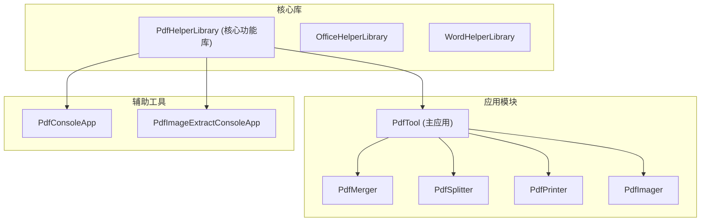
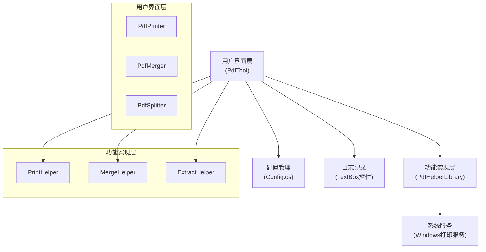
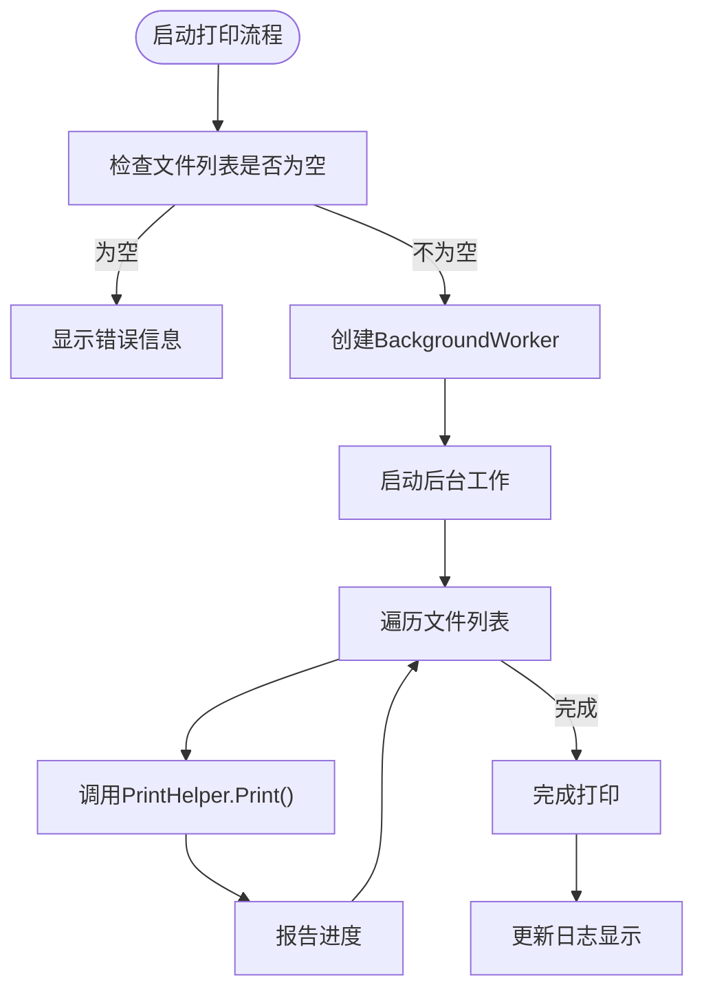
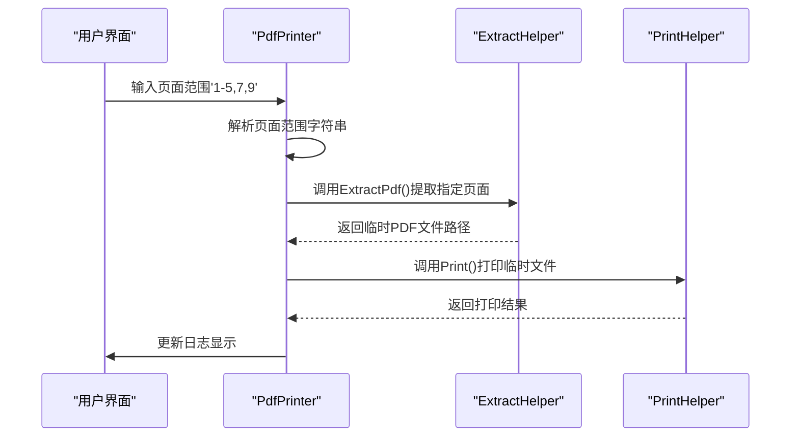
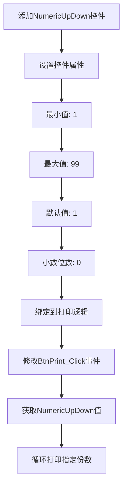
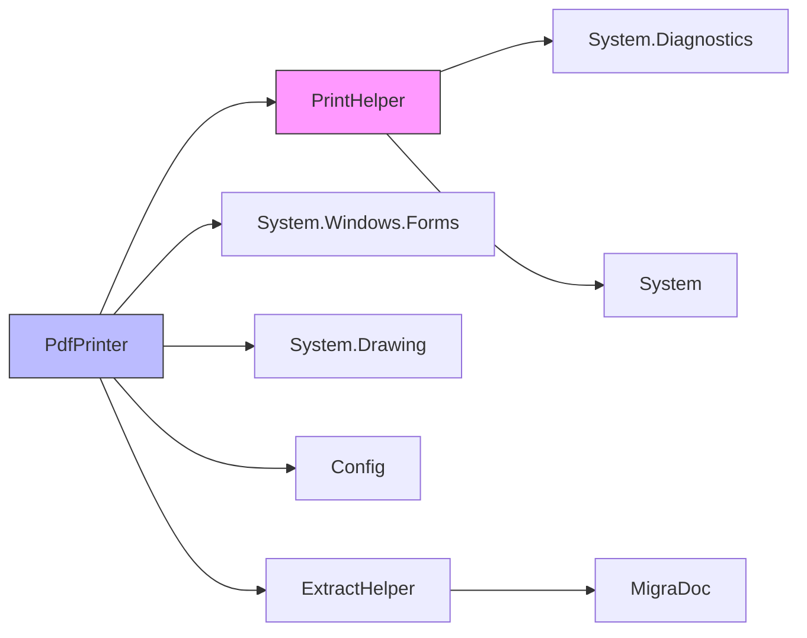

# 高级打印设置

<cite>
**本文档引用的文件**   
- [PrintHelper.cs](file://PdfHelperLibrary/PrintHelper.cs)
- [PdfPrinter.cs](file://PdfTool/PdfPrinter.cs)
- [ExtractHelper.cs](file://PdfHelperLibrary/ExtractHelper.cs)
- [Config.cs](file://PdfTool/Config.cs)
- [MainForm.cs](file://PdfTool/MainForm.cs)
</cite>

## 目录
1. [简介](#简介)
2. [项目结构](#项目结构)
3. [核心组件](#核心组件)
4. [架构概述](#架构概述)
5. [详细组件分析](#详细组件分析)
6. [依赖分析](#依赖分析)
7. [性能考虑](#性能考虑)
8. [故障排除指南](#故障排除指南)
9. [结论](#结论)

## 简介
本文档深入探讨当前批量打印功能的潜在扩展能力，分析基于现有架构如何实现高级打印选项。文档将说明如何通过扩展PrintHelper类以支持指定打印机名称、双面打印、纸张来源选择等参数，需调用Windows API（如PrintDocument类）替代简单的Process启动方式。同时讨论页面范围过滤功能的实现路径，例如解析用户输入的'1-5,7,9'格式字符串并结合PDF文档切割技术预处理文件。提出打印份数控制的UI增强方案，在界面添加NumericUpDown控件并将值传递至打印逻辑。强调当前版本使用系统默认行为的局限性，并给出向高级打印控制迁移的技术路线图。

## 项目结构
项目采用模块化设计，将不同功能分离到独立的库和工具中。PDF相关功能主要集中在PdfHelperLibrary和PdfTool两个项目中，其中PdfHelperLibrary提供基础功能库，PdfTool则实现用户界面和具体功能模块。



**Diagram sources**
- [PdfHelperLibrary.csproj](file://PdfHelperLibrary/PdfHelperLibrary.csproj)
- [PdfTool.csproj](file://PdfTool/PdfTool.csproj)

**Section sources**
- [PdfHelperLibrary](file://PdfHelperLibrary)
- [PdfTool](file://PdfTool)

## 核心组件
系统的核心打印功能由PrintHelper类和PdfPrinter类组成。PrintHelper提供基础打印功能，而PdfPrinter则负责用户界面和批量打印逻辑。当前实现使用Process类调用系统默认打印功能，这种方式简单但功能有限，无法支持高级打印选项。

**Section sources**
- [PrintHelper.cs](file://PdfHelperLibrary/PrintHelper.cs#L1-L33)
- [PdfPrinter.cs](file://PdfTool/PdfPrinter.cs#L1-L110)

## 架构概述
系统采用分层架构设计，将功能实现与用户界面分离。PdfHelperLibrary作为底层功能库，提供各种PDF处理功能，包括打印、合并、拆分等。PdfTool作为上层应用，通过引用PdfHelperLibrary来实现具体功能模块。



**Diagram sources**
- [PrintHelper.cs](file://PdfHelperLibrary/PrintHelper.cs#L1-L33)
- [PdfPrinter.cs](file://PdfTool/PdfPrinter.cs#L1-L110)
- [Config.cs](file://PdfTool/Config.cs#L1-L8)

## 详细组件分析

### 打印功能分析
当前打印功能实现较为基础，通过Process类调用系统默认打印功能，缺乏对打印参数的精细控制。

#### PrintHelper类分析
```mermaid
classDiagram
class PrintHelper {
+static string Print(string inputPdfFileName)
}
note right of PrintHelper
当前实现使用Process启动
系统默认打印功能
无法控制打印参数
end note
```

**Diagram sources**
- [PrintHelper.cs](file://PdfHelperLibrary/PrintHelper.cs#L1-L33)

#### PdfPrinter界面分析


**Diagram sources**
- [PdfPrinter.cs](file://PdfTool/PdfPrinter.cs#L46-L79)
- [PdfPrinter.cs](file://PdfTool/PdfPrinter.cs#L75-L109)

### 页面范围过滤实现路径
基于现有架构，页面范围过滤功能可以通过扩展ExtractHelper类来实现，先预处理PDF文件再进行打印。



**Diagram sources**
- [ExtractHelper.cs](file://PdfHelperLibrary/ExtractHelper.cs#L33-L61)
- [PdfPrinter.cs](file://PdfTool/PdfPrinter.cs#L58-L68)

### 打印份数控制UI增强方案
建议在界面添加NumericUpDown控件来控制打印份数，提升用户体验。



**Diagram sources**
- [PdfPrinter.cs](file://PdfTool/PdfPrinter.cs#L75-L109)
- [Config.cs](file://PdfTool/Config.cs#L1-L8)

## 依赖分析
系统各组件之间的依赖关系清晰，采用松耦合设计，便于功能扩展和维护。



**Diagram sources**
- [PrintHelper.cs](file://PdfHelperLibrary/PrintHelper.cs#L1-L33)
- [PdfPrinter.cs](file://PdfTool/PdfPrinter.cs#L1-L110)
- [ExtractHelper.cs](file://PdfHelperLibrary/ExtractHelper.cs#L1-L76)

## 性能考虑
当前打印实现采用后台线程处理，避免了界面冻结问题，但在处理大量文件时仍需注意资源管理。

- **内存使用**：每个打印任务都会创建新的Process实例，大量文件同时打印可能导致内存占用过高
- **线程管理**：BackgroundWorker实现简单，但缺乏对并发打印任务的精细控制
- **错误处理**：异常捕获机制完善，但缺少重试机制和错误分类
- **资源释放**：Process实例的资源释放依赖于.NET垃圾回收机制，可能存在延迟

## 故障排除指南
常见问题及解决方案：

1. **文件无法打印**
   - 检查PDF文件路径是否正确
   - 确认系统默认打印机已设置
   - 验证文件是否被其他程序占用

2. **打印队列堵塞**
   - 重启打印服务
   - 清理打印队列
   - 检查打印机连接状态

3. **界面无响应**
   - 等待后台任务完成
   - 重启应用程序
   - 检查系统资源使用情况

4. **特殊字符文件名问题**
   - 避免使用特殊字符作为文件名
   - 使用英文命名文件
   - 检查文件路径编码

**Section sources**
- [PrintHelper.cs](file://PdfHelperLibrary/PrintHelper.cs#L27-L30)
- [PdfPrinter.cs](file://PdfTool/PdfPrinter.cs#L52-L56)

## 结论
当前批量打印功能实现了基本的打印需求，但存在功能局限性。通过扩展PrintHelper类并引入System.Drawing.Printing命名空间，可以实现更高级的打印控制功能。建议的技术路线图包括：

1. **替换打印机制**：使用PrintDocument类替代Process启动方式
2. **扩展打印参数**：支持指定打印机、双面打印、纸张来源等选项
3. **增强UI交互**：添加NumericUpDown控件控制打印份数
4. **实现页面过滤**：解析'1-5,7,9'格式字符串并预处理PDF文件
5. **优化错误处理**：提供更详细的错误信息和恢复选项

这些改进将显著提升打印功能的灵活性和用户体验，使应用程序能够满足更复杂的打印需求。