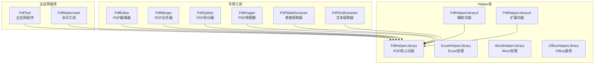
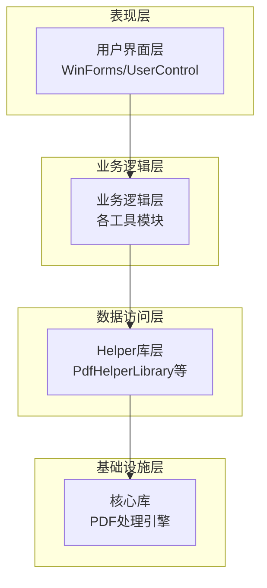
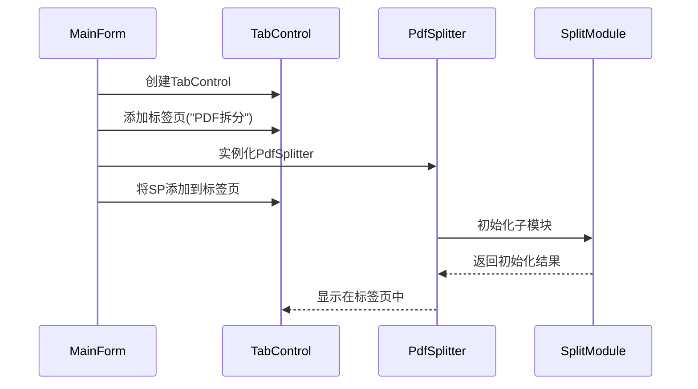
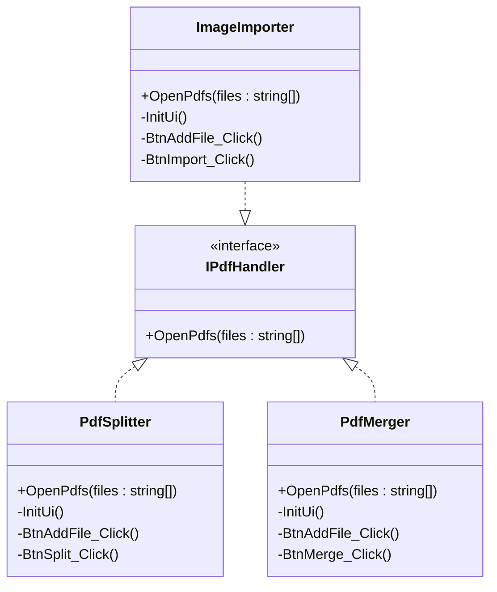
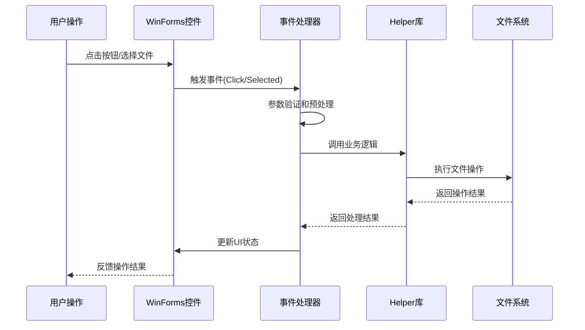
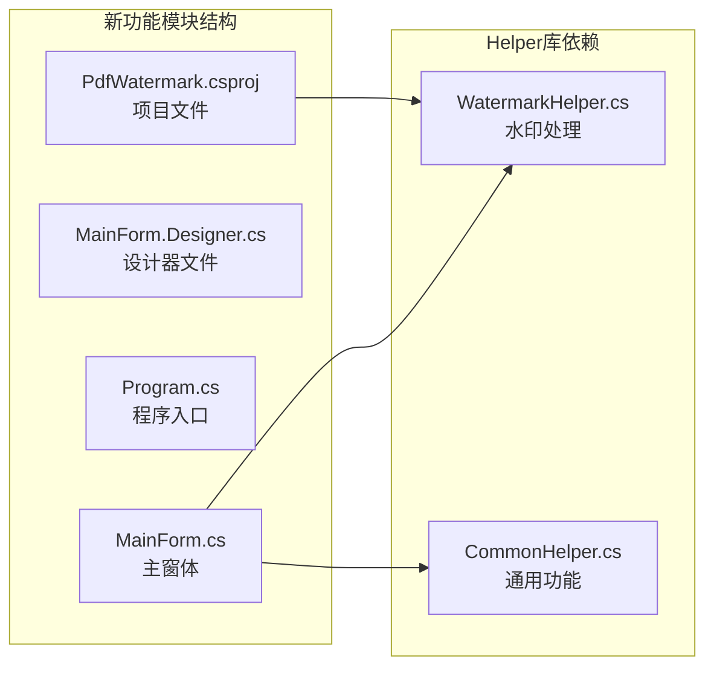
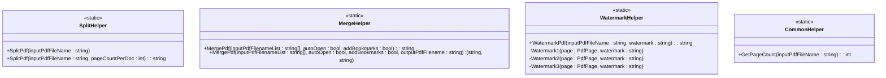
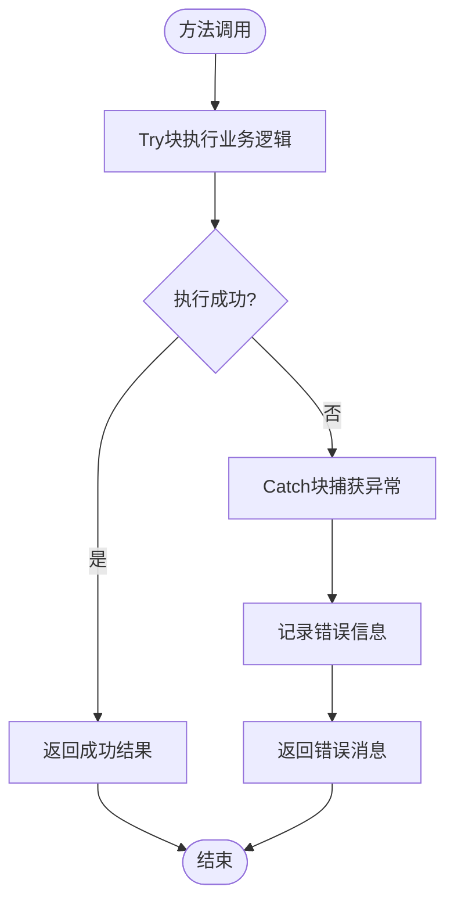
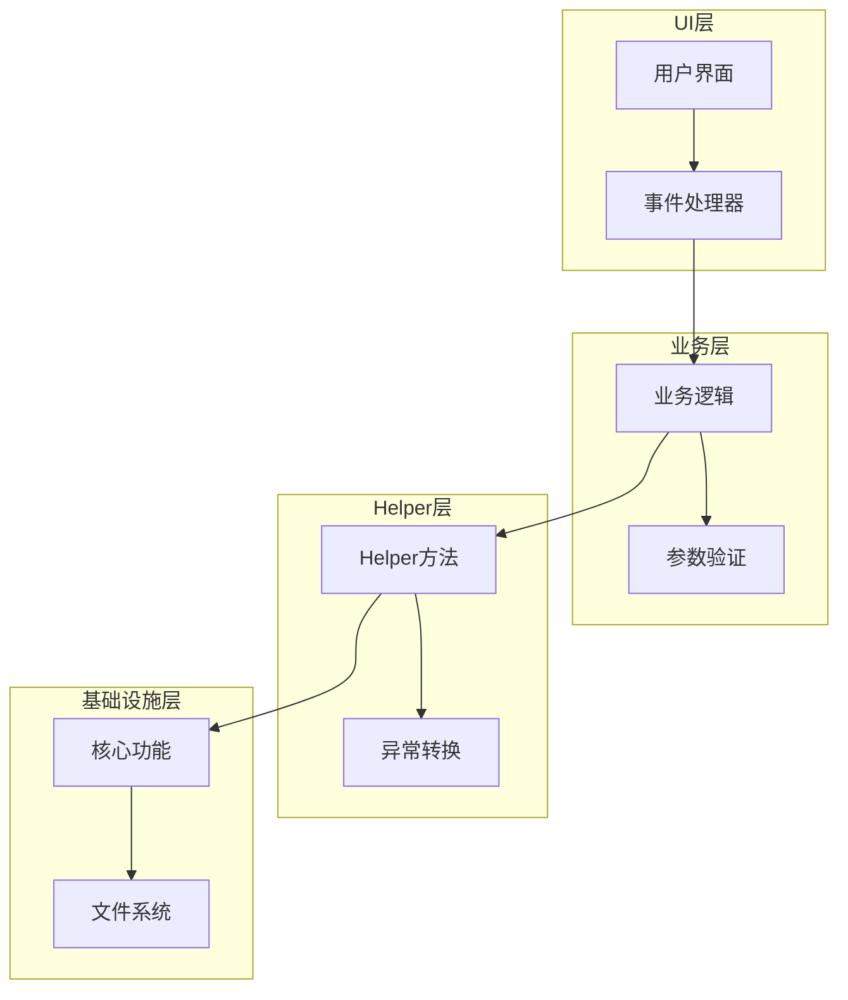
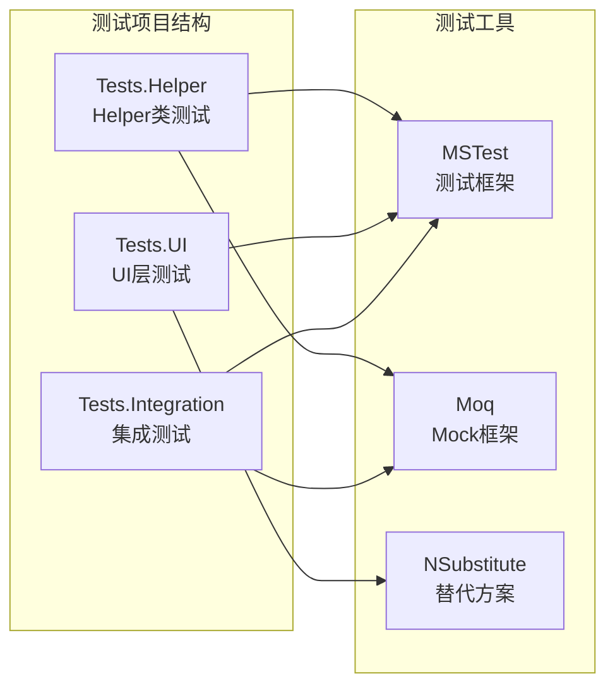

# 开发者指南

<cite>
**本文档中引用的文件**
- [MainForm.cs](file://PdfTool/MainForm.cs)
- [PdfSplitter.cs](file://PdfTool/PdfSplitter.cs)
- [PdfMerger.cs](file://PdfTool/PdfMerger.cs)
- [ImageImporter.cs](file://PdfTool/ImageImporter.cs)
- [Common.cs](file://PdfTool/Common.cs)
- [Config.cs](file://PdfTool/Config.cs)
- [WatermarkHelper.cs](file://PdfHelperLibrary/WatermarkHelper.cs)
- [SplitHelper.cs](file://PdfHelperLibrary/SplitHelper.cs)
- [MergeHelper.cs](file://PdfHelperLibrary/MergeHelper.cs)
- [CommonHelper.cs](file://PdfHelperLibrary/CommonHelper.cs)
- [PdfWatermark_MainForm.cs](file://PdfWatermark/MainForm.cs)
- [PdfWatermark_csproj](file://PdfWatermark/PdfWatermark.csproj)
- [PdfTool_csproj](file://PdfTool/PdfTool.csproj)
</cite>

## 目录
1. [项目概述](#项目概述)
2. [整体架构](#整体架构)
3. [核心组件分析](#核心组件分析)
4. [WinForms事件驱动模型](#winforms事件驱动模型)
5. [添加新功能模块](#添加新功能模块)
6. [Helper库设计模式](#helper库设计模式)
7. [调试技巧](#调试技巧)
8. [编码规范与最佳实践](#编码规范与最佳实践)
9. [单元测试建议](#单元测试建议)
10. [故障排除指南](#故障排除指南)

## 项目概述

本项目是一个基于.NET Framework 4.7.2的PDF工具集合，采用模块化架构设计，包含多个独立的工具项目共享基础库。项目主要分为以下几个部分：

### 项目结构概览



**图表来源**
- [PdfTool_csproj](file://PdfTool/PdfTool.csproj#L187-L190)
- [PdfWatermark_csproj](file://PdfWatermark/PdfWatermark.csproj#L84-L86)

## 整体架构

### 多项目共享基础库模式

项目采用多项目共享基础库的设计模式，这种架构具有以下优势：

1. **代码复用性**：多个工具项目共享同一个Helper库
2. **维护性**：核心功能集中在Helper库中，便于统一维护
3. **扩展性**：新增功能只需在Helper库中实现，其他项目自动受益
4. **模块化**：每个工具项目专注于特定功能领域

### 架构层次



**节来源**
- [MainForm.cs](file://PdfTool/MainForm.cs#L12-L194)
- [PdfTool_csproj](file://PdfTool/PdfTool.csproj#L187-L190)

## 核心组件分析

### MainForm - 主窗体控制器

MainForm作为整个应用程序的主控制器，负责管理多个功能模块的生命周期和交互。

#### 主要职责：
- **TabControl管理**：动态创建和管理功能标签页
- **拖拽文件处理**：支持拖拽PDF文件到对应功能模块
- **UI初始化**：创建和配置所有子控件
- **事件路由**：处理跨模块的事件通信

#### 标签页注册机制



**图表来源**
- [MainForm.cs](file://PdfTool/MainForm.cs#L134-L163)

**节来源**
- [MainForm.cs](file://PdfTool/MainForm.cs#L12-L194)

### IPdfHandler接口 - 统一文件处理契约

IPdfHandler接口定义了所有PDF处理模块必须实现的标准契约。

#### 接口定义特点：
- **单一职责**：只定义`OpenPdfs`方法
- **类型安全**：参数为强类型List<string>
- **扩展性**：支持多种文件处理场景

#### 实现模式



**图表来源**
- [Common.cs](file://PdfTool/Common.cs#L13-L16)
- [PdfSplitter.cs](file://PdfTool/PdfSplitter.cs#L12)
- [PdfMerger.cs](file://PdfTool/PdfMerger.cs#L12)
- [ImageImporter.cs](file://PdfTool/ImageImporter.cs#L12)

**节来源**
- [Common.cs](file://PdfTool/Common.cs#L13-L16)

## WinForms事件驱动模型

### 事件处理架构

项目采用标准的WinForms事件驱动架构，具有以下特征：

#### 事件流模式



#### 典型事件处理流程

以PDF拆分功能为例：

```mermaid
flowchart TD
Start([用户点击"添加文件"]) --> OpenDialog[打开文件选择对话框]
OpenDialog --> ValidateFiles{验证文件格式}
ValidateFiles --> |有效| UpdateUI[更新文件列表显示]
ValidateFiles --> |无效| ShowError[显示错误信息]
UpdateUI --> Ready[准备就绪]
ShowError --> Ready
Ready --> UserAction{用户操作}
UserAction --> |点击"开始拆分"| CallHelper[调用SplitHelper]
UserAction --> |取消| End([结束])
CallHelper --> ProcessFiles[处理PDF文件]
ProcessFiles --> UpdateLog[更新操作日志]
UpdateLog --> End
```

**图表来源**
- [PdfSplitter.cs](file://PdfTool/PdfSplitter.cs#L46-L66)

**节来源**
- [PdfSplitter.cs](file://PdfTool/PdfSplitter.cs#L46-L82)
- [PdfMerger.cs](file://PdfTool/PdfMerger.cs#L44-L69)

## 添加新功能模块

### 完整的新增功能示例：PDF水印功能

以下是添加PDF水印功能的完整步骤，展示如何遵循项目的设计模式。

#### 第一步：创建新的工具项目

参考PdfWatermark项目的结构，创建新的功能模块：



**图表来源**
- [PdfWatermark_MainForm.cs](file://PdfWatermark/MainForm.cs#L1-L137)
- [PdfWatermark_csproj](file://PdfWatermark/PdfWatermark.csproj#L1-L90)

#### 第二步：在MainForm中注册新标签页

按照现有模式，在MainForm中添加新的标签页：

```csharp
// 在tabControl.TabPages.AddRange中添加新标签页
new TabPage("PDF水印") { BorderStyle = BorderStyle.None, Name = "tpPdfWatermarker" },

// 在tabControl.TabPages["tpPdfWatermarker"].Controls.Add中添加新控件
tabControl.TabPages["tpPdfWatermarker"].Controls.Add(new PdfWatermarker { Dock = DockStyle.Fill });
```

#### 第三步：创建对应的UserControl

创建PdfWatermarker.cs UserControl，继承自UserControl并实现IPdfHandler接口：

```csharp
public partial class PdfWatermarker : UserControl, IPdfHandler
{
    public void OpenPdfs(List<string> files)
    {
        // 实现文件处理逻辑
    }
}
```

#### 第四步：调用Helper库接口

在事件处理器中调用Helper库的功能：

```csharp
private void BtnAddWatermark_Click(object sender, EventArgs e)
{
    foreach (var file in inputPdfFilenameList)
    {
        var result = PdfHelperLibrary.WatermarkHelper.WatermarkPdf(file, watermarkText);
        // 处理结果
    }
}
```

**节来源**
- [MainForm.cs](file://PdfTool/MainForm.cs#L136-L148)
- [PdfWatermark_MainForm.cs](file://PdfWatermark/MainForm.cs#L30-L57)
- [WatermarkHelper.cs](file://PdfHelperLibrary/WatermarkHelper.cs#L25-L46)

## Helper库设计模式

### Helper类设计原则

Helper库采用静态类设计，具有以下特点：

#### 单一职责原则
每个Helper类专注于特定功能领域：



**图表来源**
- [SplitHelper.cs](file://PdfHelperLibrary/SplitHelper.cs#L11-L69)
- [MergeHelper.cs](file://PdfHelperLibrary/MergeHelper.cs#L14-L74)
- [WatermarkHelper.cs](file://PdfHelperLibrary/WatermarkHelper.cs#L20-L159)
- [CommonHelper.cs](file://PdfHelperLibrary/CommonHelper.cs#L9-L28)

#### 异常处理模式

Helper类采用统一的异常处理模式：



**图表来源**
- [WatermarkHelper.cs](file://PdfHelperLibrary/WatermarkHelper.cs#L47-L50)
- [CommonHelper.cs](file://PdfHelperLibrary/CommonHelper.cs#L13-L25)

**节来源**
- [SplitHelper.cs](file://PdfHelperLibrary/SplitHelper.cs#L37-L61)
- [MergeHelper.cs](file://PdfHelperLibrary/MergeHelper.cs#L16-L41)
- [WatermarkHelper.cs](file://PdfHelperLibrary/WatermarkHelper.cs#L25-L46)

## 调试技巧

### 断点调试策略

#### 1. PDF解析过程调试

在Helper库中设置断点观察PDF处理过程：

```csharp
// 在WatermarkHelper.cs中
public static string WatermarkPdf(string inputPdfFileName, string watermark)
{
    try
    {
        // 设置断点：检查输入文件是否存在
        if (!File.Exists(inputPdfFileName))
        {
            return "文件不存在";
        }
        
        // 设置断点：检查文件复制过程
        var outputPdfFileName = CopyAndPrepareFile(inputPdfFileName);
        
        // 设置断点：检查PDF文档加载
        var inputDocument = PdfReader.Open(outputPdfFileName);
        
        // 设置断点：检查页面遍历
        foreach (var page in inputDocument.Pages)
        {
            // 设置断点：检查水印绘制
            Watermark1(page, watermark);
        }
        
        // 设置断点：检查保存过程
        inputDocument.Save(outputPdfFileName);
        
        return "";
    }
    catch (Exception ex)
    {
        // 设置断点：检查异常处理
        return $"水印添加失败，原因：{ex.Message}";
    }
}
```

#### 2. 日志输出中间状态

在关键节点添加日志输出：

```csharp
// 在PdfSplitter.cs中
private void BtnSplit_Click(object sender, EventArgs e)
{
    _txtLog.AppendText("开始拆分PDF文件...\r\n");
    
    foreach (var fileName in _inputPdfFileList)
    {
        _txtLog.AppendText($"处理文件: {fileName}\r\n");
        
        var pageCount = PdfHelperLibrary.CommonHelper.GetPageCount(fileName);
        _txtLog.AppendText($"文件页数: {pageCount}\r\n");
        
        var result = PdfHelperLibrary.SplitHelper.SplitPdf(fileName, (int)_numPagePerDoc.Value);
        
        if (string.IsNullOrWhiteSpace(result))
        {
            _txtLog.AppendText($"{fileName} 拆分完成\r\n");
        }
        else
        {
            _txtLog.AppendText($"{fileName} {result}\r\n");
        }
    }
    
    _txtLog.AppendText("拆分完成\r\n");
}
```

#### 3. 性能监控

添加性能监控代码：

```csharp
private void ProcessWithTiming(Action action)
{
    var stopwatch = Stopwatch.StartNew();
    try
    {
        action();
    }
    finally
    {
        stopwatch.Stop();
        _txtLog.AppendText($"操作耗时: {stopwatch.ElapsedMilliseconds}ms\r\n");
    }
}
```

**节来源**
- [WatermarkHelper.cs](file://PdfHelperLibrary/WatermarkHelper.cs#L27-L46)
- [PdfSplitter.cs](file://PdfTool/PdfSplitter.cs#L54-L66)

## 编码规范与最佳实践

### 命名约定

#### 类命名规范
- **Helper类**：使用动词+Helper模式，如`SplitHelper`、`MergeHelper`
- **工具类**：使用名词+Tool模式，如`PdfTool`、`ImageTool`
- **用户控件**：使用名词+Processor/Editor模式，如`PdfSplitter`、`PdfMerger`

#### 方法命名规范
- **私有方法**：使用PascalCase，前缀`InitUi`、`ProcessFiles`
- **事件处理器**：使用PascalCase，后缀`_Click`、`_Selected`
- **公共方法**：使用PascalCase，描述具体功能

### 异常处理最佳实践

#### 分层异常处理



#### 异常处理模板

```csharp
public static string ProcessPdf(string inputPdfFileName)
{
    try
    {
        // 参数验证
        if (string.IsNullOrWhiteSpace(inputPdfFileName))
        {
            throw new ArgumentException("输入文件路径不能为空", nameof(inputPdfFileName));
        }
        
        if (!File.Exists(inputPdfFileName))
        {
            throw new FileNotFoundException("指定的PDF文件不存在", inputPdfFileName);
        }
        
        // 业务逻辑处理
        var result = PerformProcessing(inputPdfFileName);
        
        return result;
    }
    catch (ArgumentException ex)
    {
        // 记录参数错误
        Logger.LogError(ex, "参数验证失败");
        return $"参数错误: {ex.Message}";
    }
    catch (FileNotFoundException ex)
    {
        // 记录文件未找到错误
        Logger.LogError(ex, "文件处理失败");
        return $"文件错误: {ex.Message}";
    }
    catch (Exception ex)
    {
        // 记录未知错误
        Logger.LogError(ex, "处理过程中发生未知错误");
        return $"处理失败: {ex.Message}";
    }
}
```

### 配置管理

#### 配置常量设计

```csharp
internal static class Config
{
    internal const int ControlMargin = 20;
    internal const int ControlPadding = 12;
    internal const string DefaultOutputPattern = "{0}-Processed-{1:yyyyMMddHHmmssfff}.pdf";
    internal const int MaxConcurrentOperations = 5;
    internal const int TimeoutSeconds = 30;
}
```

**节来源**
- [Config.cs](file://PdfTool/Config.cs#L4-L8)
- [WatermarkHelper.cs](file://PdfHelperLibrary/WatermarkHelper.cs#L25-L46)

## 单元测试建议

### 测试策略

虽然当前项目缺乏单元测试，但建议采用以下测试策略：

#### 1. Mock对象测试文件I/O操作

```csharp
[TestClass]
public class WatermarkHelperTests
{
    [TestMethod]
    public void WatermarkPdf_ValidInput_ReturnsEmptyString()
    {
        // Arrange
        var mockFileSystem = new Mock<IFileSystem>();
        var mockPdfDocument = new Mock<PdfDocument>();
        
        mockFileSystem.Setup(fs => fs.FileExists(It.IsAny<string>())).Returns(true);
        mockFileSystem.Setup(fs => fs.CopyFile(It.IsAny<string>(), It.IsAny<string>(), It.IsAny<bool>()));
        
        // Act
        var result = WatermarkHelper.WatermarkPdf("test.pdf", "水印文本");
        
        // Assert
        Assert.AreEqual("", result);
    }
    
    [TestMethod]
    public void WatermarkPdf_FileNotFound_ReturnsErrorMessage()
    {
        // Arrange
        var mockFileSystem = new Mock<IFileSystem>();
        mockFileSystem.Setup(fs => fs.FileExists(It.IsAny<string>())).Returns(false);
        
        // Act
        var result = WatermarkHelper.WatermarkPdf("nonexistent.pdf", "水印文本");
        
        // Assert
        Assert.IsTrue(result.Contains("文件不存在"));
    }
}
```

#### 2. Helper类边界测试

```csharp
[TestMethod]
public void SplitHelper_SplitPdf_NullInput_ThrowsArgumentNullException()
{
    // Act & Assert
    Assert.ThrowsException<ArgumentNullException>(() => 
        SplitHelper.SplitPdf(null, 1));
}

[TestMethod]
public void SplitHelper_SplitPdf_InvalidPageCount_ThrowsArgumentOutOfRangeException()
{
    // Arrange
    var tempFile = Path.GetTempFileName();
    
    try
    {
        // Act & Assert
        Assert.ThrowsException<ArgumentOutOfRangeException>(() => 
            SplitHelper.SplitPdf(tempFile, 0));
    }
    finally
    {
        File.Delete(tempFile);
    }
}
```

#### 3. 集成测试

```csharp
[TestMethod]
public async Task FullWorkflow_WatermarkPdf_Success()
{
    // Arrange
    var inputPdf = await CreateTestPdfAsync();
    var watermarkText = "测试水印";
    
    // Act
    var result = WatermarkHelper.WatermarkPdf(inputPdf, watermarkText);
    
    // Assert
    Assert.AreEqual("", result);
    Assert.IsTrue(File.Exists(inputPdf.Replace(".pdf", "-WatermarkFile - *.pdf")));
    
    // Cleanup
    Directory.Delete(Path.GetDirectoryName(inputPdf), true);
}
```

### 测试环境配置

#### 测试项目结构



## 故障排除指南

### 常见问题及解决方案

#### 1. PDF文件处理失败

**问题症状**：水印添加失败，提示"文件无法访问"

**排查步骤**：
```csharp
// 检查文件是否被占用
private bool IsFileLocked(string filePath)
{
    try
    {
        using (FileStream stream = File.Open(filePath, FileMode.Open, FileAccess.ReadWrite, FileShare.None))
        {
            stream.Close();
        }
        return false;
    }
    catch (IOException)
    {
        return true;
    }
}
```

**解决方案**：
- 确保目标文件没有被其他程序占用
- 检查文件权限设置
- 使用文件复制避免直接修改原文件

#### 2. 内存泄漏问题

**问题症状**：长时间运行后内存占用持续增长

**解决方案**：
```csharp
// 正确释放PDF文档资源
public static void ProcessPdfSafely(string inputPdfFileName)
{
    PdfDocument document = null;
    try
    {
        document = PdfReader.Open(inputPdfFileName);
        // 处理逻辑
    }
    finally
    {
        document?.Dispose();
    }
}
```

#### 3. 多线程安全问题

**问题症状**：并发处理时出现异常

**解决方案**：
```csharp
// 使用线程安全的集合
private static readonly ConcurrentQueue<string> _processingQueue = new ConcurrentQueue<string>();

// 使用锁保护共享资源
private static readonly object _lockObject = new object();

public static void SafeOperation()
{
    lock (_lockObject)
    {
        // 执行需要同步的操作
    }
}
```

### 性能优化建议

#### 1. 批量处理优化

```csharp
// 使用并行处理提高效率
public static void ProcessMultipleFilesParallel(List<string> files)
{
    Parallel.ForEach(files, file =>
    {
        try
        {
            ProcessSingleFile(file);
        }
        catch (Exception ex)
        {
            Logger.LogWarning(ex, "处理文件时发生错误: {FilePath}", file);
        }
    });
}
```

#### 2. 内存管理优化

```csharp
// 使用using语句确保资源及时释放
public static void OptimizeMemoryUsage()
{
    using (var memoryStream = new MemoryStream())
    {
        // 处理大文件
        using (var document = PdfReader.Open(memoryStream))
        {
            // 处理逻辑
        }
    }
}
```

**节来源**
- [WatermarkHelper.cs](file://PdfHelperLibrary/WatermarkHelper.cs#L27-L46)
- [CommonHelper.cs](file://PdfHelperLibrary/CommonHelper.cs#L13-L25)

## 结论

本指南详细介绍了PDF工具项目的架构设计、开发模式和最佳实践。通过遵循这些指导原则，开发者可以：

1. **理解项目架构**：掌握多项目共享基础库的设计理念
2. **快速添加功能**：按照既定模式开发新功能模块
3. **保证代码质量**：遵循编码规范和异常处理最佳实践
4. **有效调试问题**：运用调试技巧快速定位和解决问题
5. **准备单元测试**：为未来测试驱动开发做好准备

项目的模块化设计和清晰的职责分离使得二次开发变得简单而高效。无论是添加新的PDF处理功能还是扩展现有模块，都可以按照本指南提供的模式进行开发。