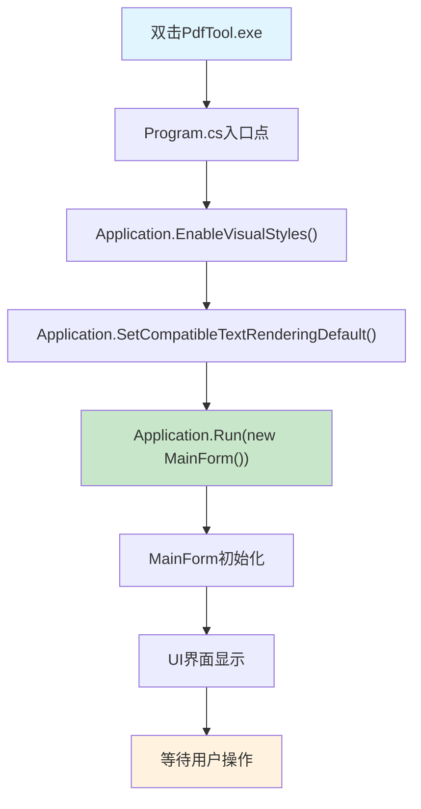
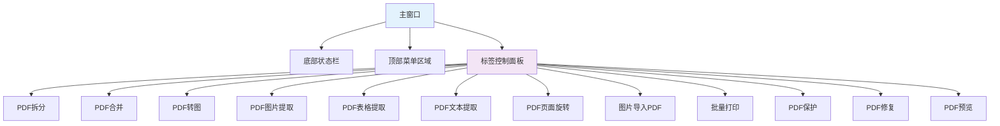
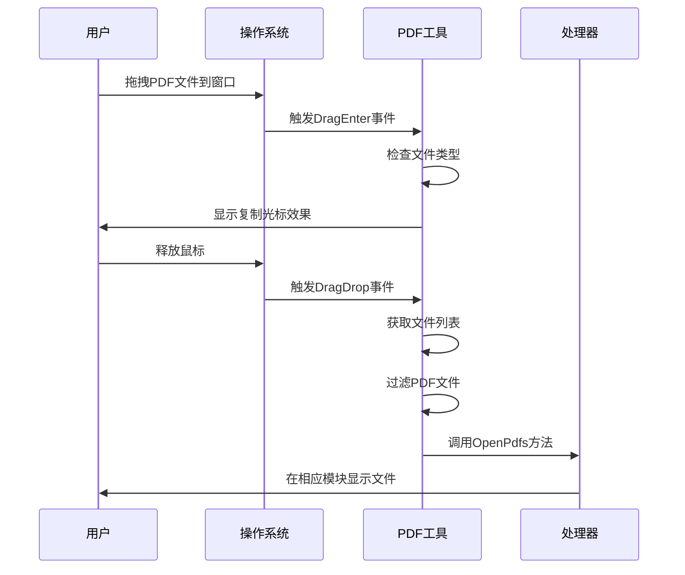

# PDF工具快速入门指南

<cite>
**本文档中引用的文件**
- [Program.cs](file://PdfTool/Program.cs)
- [MainForm.cs](file://PdfTool/MainForm.cs)
- [MainForm.Designer.cs](file://PdfTool/MainForm.Designer.cs)
- [PdfMerger.cs](file://PdfTool/PdfMerger.cs)
- [PdfMerger.Designer.cs](file://PdfTool/PdfMerger.Designer.cs)
- [PdfSplitter.cs](file://PdfTool/PdfSplitter.cs)
- [PdfImager.cs](file://PdfTool/PdfImager.cs)
- [Common.cs](file://PdfTool/Common.cs)
- [Config.cs](file://PdfTool/Config.cs)
</cite>

## 目录
1. [简介](#简介)
2. [系统要求](#系统要求)
3. [安装步骤](#安装步骤)
4. [启动应用程序](#启动应用程序)
5. [主界面布局](#主界面布局)
6. [基本交互模式](#基本交互模式)
7. [操作示例：合并两个PDF文件](#操作示例合并两个pdf文件)
8. [其他常用功能](#其他常用功能)
9. [故障排除](#故障排除)
10. [总结](#总结)

## 简介

PDF工具是一个功能强大的桌面应用程序，专为处理PDF文件而设计。它提供了多种PDF操作功能，包括合并、拆分、转换、提取等。本指南将帮助您在5分钟内学会如何使用这个工具完成基本的PDF操作。

## 系统要求

- **操作系统**: Windows 7 或更高版本
- **.NET Framework**: 4.7.2 或更高版本
- **内存**: 至少 512MB 可用内存
- **磁盘空间**: 至少 100MB 可用空间

## 安装步骤

1. **下载应用程序**
   - 从官方网站或GitHub仓库下载最新版本的PDF工具
   - 解压下载的压缩包到您希望安装的位置

2. **首次运行**
   - 找到解压后的文件夹
   - 双击运行 `PdfTool.exe` 文件

3. **权限设置**
   - 如果出现安全警告，请允许应用程序运行
   - 首次运行可能需要几分钟时间加载依赖项

## 启动应用程序

### 启动流程详解

应用程序的启动过程遵循标准的Windows Forms应用程序模式：

**图表来源**
- [Program.cs](file://PdfTool/Program.cs#L15-L19)

**章节来源**
- [Program.cs](file://PdfTool/Program.cs#L1-L23)

## 主界面布局

### 整体架构

PDF工具采用标签页式界面设计，每个功能模块都独立在一个标签页中：

**图表来源**
- [MainForm.cs](file://PdfTool/MainForm.cs#L128-L148)

### 标签页功能分布

| 标签页名称 | 功能描述 | 主要用途 |
|-----------|----------|----------|
| PDF拆分 | 将单个PDF文件拆分为多个小文件 | 分割长文档，便于管理 |
| PDF合并 | 将多个PDF文件合并为一个文件 | 组织分散的文档 |
| PDF转图 | 将PDF页面转换为图像文件 | 图像处理，OCR识别 |
| PDF图片提取 | 从PDF中提取嵌入的图片 | 收集文档中的图片 |
| PDF表格提取 | 从PDF中提取表格数据 | 数据分析，信息提取 |
| PDF文本提取 | 从PDF中提取纯文本内容 | 文本分析，搜索 |
| PDF页面旋转 | 旋转PDF页面方向 | 校正扫描文档方向 |
| 图片导入PDF | 将图片转换为PDF文件 | 创建电子文档 |
| 批量打印 | 打印多个PDF文件 | 批量办公任务 |
| PDF保护 | 设置PDF密码保护 | 文档安全保护 |
| PDF修复 | 修复损坏的PDF文件 | 恢复无法打开的文件 |
| PDF预览 | 预览PDF文件内容 | 查看文档内容 |

**章节来源**
- [MainForm.cs](file://PdfTool/MainForm.cs#L128-L148)

## 基本交互模式

### 拖拽操作

PDF工具支持直观的拖拽操作，这是最便捷的文件添加方式：

**图表来源**
- [MainForm.cs](file://PdfTool/MainForm.cs#L33-L59)

### 文件验证机制

应用程序会自动验证拖拽的文件类型：

- **支持的PDF文件**: `.pdf` 扩展名的文件
- **支持的图片文件**: `.bmp`, `.jpg`, `.tif`, `.png` 扩展名的文件
- **自动过滤**: 只接受有效的PDF文件，忽略其他类型文件

**章节来源**
- [MainForm.cs](file://PdfTool/MainForm.cs#L33-L59)

## 操作示例：合并两个PDF文件

### 完整操作流程

让我们通过一个具体的例子来演示如何合并两个PDF文件：

#### 步骤1：启动应用程序并选择功能

1. 双击运行 `PdfTool.exe`
2. 等待应用程序完全启动
3. 在主界面中找到并点击 **"PDF合并"** 标签页

#### 步骤2：添加PDF文件

有三种方式添加文件：

**方法一：拖拽添加**
- 准备两个想要合并的PDF文件
- 直接将文件拖拽到PDF合并界面
- 系统会自动识别并添加PDF文件

**方法二：按钮添加**
1. 点击界面上的 **"添加文件"** 按钮
2. 在弹出的文件选择对话框中
3. 按住Ctrl键选择多个PDF文件
4. 点击 **"打开"** 按钮

**方法三：右键菜单**
- 右键点击PDF文件
- 选择 **"发送到" > "PDF工具"**
- 文件会自动添加到当前标签页

#### 步骤3：查看文件信息

添加文件后，系统会在日志区域显示：
- 文件名称
- 文件包含的页数
- 添加顺序信息

#### 步骤4：配置合并选项

在合并之前，您可以配置以下选项：

| 选项 | 功能描述 | 默认值 |
|------|----------|--------|
| 自动打开 | 合并完成后是否自动打开结果文件 | 未勾选 |
| 添加书签 | 是否将每个文件名作为书签添加 | 未勾选 |

**建议设置**:
- 如果需要快速查看结果，可以勾选 **"合并后自动打开"**
- 如果合并的是不同章节的文档，建议勾选 **"将每个文件名添加至书签"**

#### 步骤5：自定义输出文件名（可选）

1. 点击 **"修改"** 按钮
2. 在保存对话框中选择保存位置
3. 输入自定义文件名
4. 点击 **"保存"** 按钮

如果不修改，默认文件名为：`MergedFile - 时间戳.pdf`

#### 步骤6：执行合并操作

1. 确认所有设置正确
2. 点击 **"开始合并"** 按钮
3. 等待进度指示
4. 查看日志区域确认合并结果

#### 步骤7：验证结果

合并完成后：
- 如果选择了 **"合并后自动打开"**，新文件会自动用默认PDF阅读器打开
- 否则，可以在日志中看到输出文件的路径
- 检查新文件是否包含所有原始文件的内容

### 实际操作截图说明

**图表来源**
- [PdfMerger.cs](file://PdfTool/PdfMerger.cs#L33-L69)

**章节来源**
- [PdfMerger.cs](file://PdfTool/PdfMerger.cs#L1-L154)

## 其他常用功能

### PDF拆分功能

用于将一个大的PDF文件拆分为多个小文件：

1. **常规拆分**: 按固定页数拆分
2. **指定页提取**: 提取特定范围的页面
3. **指定页删除**: 删除不需要的页面

### PDF转图功能

将PDF页面转换为高质量图像：

1. 选择DPI质量（100-1200）
2. 选择输出格式（PNG、JPG、BMP）
3. 选择处理全部页面或部分页面
4. 开始转换

### PDF文本提取功能

从PDF中提取纯文本内容：

1. 支持多种PDF格式
2. 保留基本的文本结构
3. 导出为TXT文件

## 故障排除

### 常见问题及解决方案

#### 问题1：应用程序启动缓慢
**原因**: 首次启动时需要加载大量依赖项
**解决**: 等待1-3分钟，不要关闭程序

#### 问题2：拖拽文件不响应
**检查**:
1. 确保拖拽的是PDF文件
2. 检查文件是否损坏
3. 确认应用程序已完全启动

#### 问题3：合并失败
**检查**:
1. 确保有足够的磁盘空间
2. 检查PDF文件是否受保护
3. 确认输出路径可写

#### 问题4：转换速度慢
**优化**:
1. 降低DPI设置
2. 选择较少的页面
3. 关闭其他占用CPU的应用程序

### 性能优化建议

1. **内存使用**: 关闭不必要的标签页
2. **磁盘空间**: 定期清理临时文件
3. **文件大小**: 合并前先压缩大文件

## 总结

通过本快速入门指南，您已经学会了：

1. **应用程序的基本启动流程** - 从Program.cs到MainForm的完整启动过程
2. **主界面的操作布局** - 12个功能标签页的分布和作用
3. **拖拽操作的使用** - 直观的文件添加方式
4. **PDF合并的具体操作** - 从准备文件到查看结果的完整流程
5. **基本的故障排除** - 常见问题的识别和解决方法

### 下一步学习建议

- 探索其他PDF操作功能
- 学习批量处理技巧
- 了解高级配置选项
- 掌握命令行版本的使用

### 技术支持

如果您遇到任何问题：
- 访问官方使用说明文档
- 查看在线帮助链接
- 反馈问题和需求

记住，PDF工具的设计理念是简单易用，大多数操作都可以通过直观的图形界面完成。祝您使用愉快！