# 依赖与配置管理

<cite>
**本文档中引用的文件**
- [PdfTool/Config.cs](file://PdfTool/Config.cs)
- [PdfTool/PdfTool.csproj](file://PdfTool/PdfTool.csproj)
- [PdfHelperLibrary/PdfHelperLibrary.csproj](file://PdfHelperLibrary/PdfHelperLibrary.csproj)
- [PdfHelperLibrary/SplitHelper.cs](file://PdfHelperLibrary/SplitHelper.cs)
- [PdfHelperLibrary/MergeHelper.cs](file://PdfHelperLibrary/MergeHelper.cs)
- [PdfHelperLibrary/CommonHelper.cs](file://PdfHelperLibrary/CommonHelper.cs)
- [PdfHelperLibrary/TableExtractHelper.cs](file://PdfHelperLibrary/TableExtractHelper.cs)
- [PdfHelperLibrary/TextExtractHelper.cs](file://PdfHelperLibrary/TextExtractHelper.cs)
- [PdfHelperLibrary/ImageExtractHelper.cs](file://PdfHelperLibrary/ImageExtractHelper.cs)
- [PdfHelperLibrary/Builder.cs](file://PdfHelperLibrary/Builder.cs)
- [PdfHelperLibrary2/RepairHelper.cs](file://PdfHelperLibrary2/RepairHelper.cs)
- [PdfHelperLibrary3/TableHelper.cs](file://PdfHelperLibrary3/TableHelper.cs)
- [PdfHelperLibraryX/PdfHelperLibraryX.csproj](file://PdfHelperLibraryX/PdfHelperLibraryX.csproj)
- [PdfTool/MainForm.cs](file://PdfTool/MainForm.cs)
- [PdfTool/FodyWeavers.xml](file://PdfTool/FodyWeavers.xml)
</cite>

## 目录
1. [项目概述](#项目概述)
2. [架构设计](#架构设计)
3. [核心组件分析](#核心组件分析)
4. [依赖关系管理](#依赖关系管理)
5. [配置管理系统](#配置管理系统)
6. [第三方库集成](#第三方库集成)
7. [NuGet包管理策略](#nuget包管理策略)
8. [版本兼容性考虑](#版本兼容性考虑)
9. [依赖治理方案](#依赖治理方案)
10. [最佳实践建议](#最佳实践建议)

## 项目概述

PdfTool是一个基于.NET Framework的PDF处理工具集，采用模块化架构设计，通过多个专用的Helper库提供不同的PDF处理功能。该项目展现了良好的依赖管理和配置控制实践，为开发者提供了清晰的代码组织和扩展机制。

### 主要特性
- **模块化设计**：将不同功能分离到独立的Helper库中
- **多版本支持**：同时维护多个版本的Helper库以适应不同的技术栈
- **第三方库集成**：深度集成多种PDF处理库，提供丰富的功能
- **配置驱动**：通过常量配置实现UI布局的一致性管理

## 架构设计

PdfTool采用了分层架构模式，通过项目引用实现功能模块的解耦和复用。

**图表来源**
- [PdfTool/PdfTool.csproj](file://PdfTool/PdfTool.csproj#L179-L189)
- [PdfHelperLibrary/PdfHelperLibrary.csproj](file://PdfHelperLibrary/PdfHelperLibrary.csproj#L35-L95)

**章节来源**
- [PdfTool/PdfTool.csproj](file://PdfTool/PdfTool.csproj#L1-L204)
- [PdfHelperLibrary/PdfHelperLibrary.csproj](file://PdfHelperLibrary/PdfHelperLibrary.csproj#L1-L127)

## 核心组件分析

### PdfHelperLibrary核心架构

PdfHelperLibrary作为核心PDF处理库，包含了多个专门的Helper类，每个类负责特定的PDF处理功能。

```mermaid
classDiagram
class SplitHelper {
+SplitPdf(inputPdfFileName) void
+SplitPdf(inputPdfFileName, pageCountPerDoc) string
}
class MergeHelper {
+MergePdf(inputPdfFilenameList, autoOpen, addBookmarks) string
+MergePdf(inputPdfFilenameList, autoOpen, addBookmarks, outputPdfFilename) tuple
}
class CommonHelper {
+GetPageCount(inputPdfFileName) int
}
class TableExtractHelper {
+ExtractTable(inputPdfStrean) tuple
+ExtractTable(inputPdfFileName) tuple
+ExtractTableRows(inputPdfStrean) tuple
+ExtractTableRows(inputPdfFileName) tuple
-ExtractTable(document) PdfExtractTable[]
-ExtractTableRows(document) PdfExtractRow[]
}
class TextExtractHelper {
+ExtractText(inputPdfFileName) string[]
}
class ImageExtractHelper {
+ExportImage(inputPdfFileName) string
+ExportImages(fileNames) string[]
-ExportImage(image, fileNameWithoutExt, count) string
-ExportJpegImage(image, fileNameWithoutExt, count) string
-ExportCompressedJpegImage(image, fileNameWithoutExt, count) string
-ExportCcittFaxImage(image, fileNameWithoutExt, count) string
}
class Builder {
+Image2Pdf(imgFileList, outFileName) void
+InsertImage2Pdf(inFileName, imgFileList, outFileName) void
}
SplitHelper --> PdfSharp : "使用"
MergeHelper --> PdfSharp : "使用"
CommonHelper --> PdfSharp : "使用"
TableExtractHelper --> Tabula : "使用"
TableExtractHelper --> UglyToad.PdfPig : "使用"
TextExtractHelper --> UglyToad.PdfPig : "使用"
ImageExtractHelper --> PdfSharp : "使用"
Builder --> PdfSharp : "使用"
```

**图表来源**
- [PdfHelperLibrary/SplitHelper.cs](file://PdfHelperLibrary/SplitHelper.cs#L11-L70)
- [PdfHelperLibrary/MergeHelper.cs](file://PdfHelperLibrary/MergeHelper.cs#L14-L75)
- [PdfHelperLibrary/CommonHelper.cs](file://PdfHelperLibrary/CommonHelper.cs#L9-L29)
- [PdfHelperLibrary/TableExtractHelper.cs](file://PdfHelperLibrary/TableExtractHelper.cs#L13-L106)
- [PdfHelperLibrary/TextExtractHelper.cs](file://PdfHelperLibrary/TextExtractHelper.cs#L9-L35)
- [PdfHelperLibrary/ImageExtractHelper.cs](file://PdfHelperLibrary/ImageExtractHelper.cs#L15-L182)
- [PdfHelperLibrary/Builder.cs](file://PdfHelperLibrary/Builder.cs#L15-L56)

### 功能职责划分

| Helper类 | 主要职责 | 使用的第三方库 | 核心方法 |
|---------|---------|---------------|----------|
| SplitHelper | PDF文档拆分 | PDFsharp | SplitPdf |
| MergeHelper | PDF文档合并 | PDFsharp | MergePdf |
| CommonHelper | 通用辅助功能 | PDFsharp | GetPageCount |
| TableExtractHelper | 表格数据提取 | Tabula, UglyToad.PdfPig | ExtractTable, ExtractTableRows |
| TextExtractHelper | 文本内容提取 | UglyToad.PdfPig | ExtractText |
| ImageExtractHelper | 图像资源提取 | PDFsharp | ExportImage, ExportImages |
| Builder | PDF生成构建 | PDFsharp | Image2Pdf, InsertImage2Pdf |

**章节来源**
- [PdfHelperLibrary/SplitHelper.cs](file://PdfHelperLibrary/SplitHelper.cs#L1-L70)
- [PdfHelperLibrary/MergeHelper.cs](file://PdfHelperLibrary/MergeHelper.cs#L1-L75)
- [PdfHelperLibrary/CommonHelper.cs](file://PdfHelperLibrary/CommonHelper.cs#L1-L29)
- [PdfHelperLibrary/TableExtractHelper.cs](file://PdfHelperLibrary/TableExtractHelper.cs#L1-L106)
- [PdfHelperLibrary/TextExtractHelper.cs](file://PdfHelperLibrary/TextExtractHelper.cs#L1-L35)
- [PdfHelperLibrary/ImageExtractHelper.cs](file://PdfHelperLibrary/ImageExtractHelper.cs#L1-L182)
- [PdfHelperLibrary/Builder.cs](file://PdfHelperLibrary/Builder.cs#L1-L56)

## 依赖关系管理

### 项目引用结构

PdfTool通过明确的项目引用建立了清晰的依赖层次结构：

**图表来源**
- [PdfTool/PdfTool.csproj](file://PdfTool/PdfTool.csproj#L179-L189)
- [PdfConsoleApp/PdfConsoleApp.csproj](file://PdfConsoleApp/PdfConsoleApp.csproj#L50-L55)

### 依赖注入与模块化

PdfTool采用了基于接口的依赖注入模式，通过MainForm中的统一入口管理所有功能模块：

**图表来源**
- [PdfTool/MainForm.cs](file://PdfTool/MainForm.cs#L41-L58)

**章节来源**
- [PdfTool/PdfTool.csproj](file://PdfTool/PdfTool.csproj#L179-L189)
- [PdfTool/MainForm.cs](file://PdfTool/MainForm.cs#L1-L194)

## 配置管理系统

### 常量配置设计

PdfTool采用了简洁而有效的常量配置系统，通过静态类Config集中管理UI布局相关的常量值。

**图表来源**
- [PdfTool/Config.cs](file://PdfTool/Config.cs#L3-L8)

### 配置的应用场景

Config类中的常量被广泛应用于各个用户控件的布局设计中：

| 常量名称 | 数值 | 应用场景 |
|---------|------|----------|
| ControlMargin | 20 | 控件之间的外边距 |
| ControlPadding | 12 | 控件内部的内边距 |

这种配置方式的优势：
- **一致性保证**：所有界面元素使用相同的间距标准
- **易于维护**：修改全局样式只需调整常量值
- **可读性强**：语义化的常量命名便于理解

**章节来源**
- [PdfTool/Config.cs](file://PdfTool/Config.cs#L1-L9)

## 第三方库集成

### 核心第三方库概览

PdfTool集成了多个专业的PDF处理库，每个库都有其特定的应用场景：

**图表来源**
- [PdfHelperLibrary/PdfHelperLibrary.csproj](file://PdfHelperLibrary/PdfHelperLibrary.csproj#L39-L94)

### 库选择策略

| 库名称 | 版本 | 主要用途 | 技术特点 |
|--------|------|----------|----------|
| PDFsharp | 1.50.5147 | 文档创建、编辑、页面操作 | 成熟稳定，社区支持良好 |
| Tabula | 0.1.3 | 表格数据提取 | 基于Java的Tabula算法移植 |
| UglyToad.PdfPig | 0.1.8 | PDF文档解析 | 现代C#实现，性能优异 |
| iTextSharp | 内置于PDFsharp | PDF修复、优化 | 商业级功能，稳定性高 |
| O2S.Components.PDFRender4NET | 4.7.3.0 | PDF渲染 | 高质量的PDF显示功能 |

### 现代化版本对比

项目还维护了一个基于.NET 8.0的现代化版本：

**图表来源**
- [PdfHelperLibraryX/PdfHelperLibraryX.csproj](file://PdfHelperLibraryX/PdfHelperLibraryX.csproj#L11-L15)

**章节来源**
- [PdfHelperLibrary/PdfHelperLibrary.csproj](file://PdfHelperLibrary/PdfHelperLibrary.csproj#L35-L95)
- [PdfHelperLibraryX/PdfHelperLibraryX.csproj](file://PdfHelperLibraryX/PdfHelperLibraryX.csproj#L1-L18)

## NuGet包管理策略

### 包管理架构

PdfTool采用了多层次的NuGet包管理策略，既保证了功能完整性，又实现了版本控制的灵活性。

### 包依赖关系表

| 包名称 | 版本要求 | 用途 | 引用位置 |
|--------|----------|------|----------|
| Microsoft.Bcl.HashCode | 6.0.0 | 哈希计算优化 | PdfHelperLibrary |
| System.Buffers | 4.6.1 | 内存缓冲区优化 | PdfHelperLibrary |
| System.Memory | 4.6.3 | 内存管理优化 | PdfHelperLibrary |
| System.Numerics.Vectors | 4.6.1 | 向量运算支持 | PdfHelperLibrary |
| System.Runtime.CompilerServices.Unsafe | 6.1.2 | 安全的内存操作 | PdfHelperLibrary |
| System.ValueTuple | 4.6.1 | 元组类型支持 | 多个项目 |

### 包还原机制

项目通过MSBuild目标实现了自动包还原机制：

**章节来源**
- [PdfHelperLibrary/PdfHelperLibrary.csproj](file://PdfHelperLibrary/PdfHelperLibrary.csproj#L116-L126)
- [PdfTool/PdfTool.csproj](file://PdfTool/PdfTool.csproj#L164-L173)

## 版本兼容性考虑

### 多版本并存策略

PdfTool通过维护多个Helper库版本来满足不同技术栈的需求：

### 版本兼容性矩阵

| 组件 | v4.7.2版本 | net8.0版本 | 兼容性说明 |
|------|------------|------------|------------|
| Target Framework | .NET Framework 4.7.2 | net8.0 | 需要分别编译 |
| PDFsharp | v1.50.5147 | v6.2.2 | API有重大变化 |
| ImageSharp | 不包含 | v3.1.11 | 替代O2S组件 |
| 编译器 | C# 7.3 | C# 12.0 | 语法差异 |

### 升级策略

对于从传统版本迁移到现代化版本的建议：

1. **渐进式迁移**：先升级核心Helper库，再逐步替换其他组件
2. **API适配**：注意新旧版本API的差异，编写适配层
3. **测试验证**：确保功能在新版本下正常工作
4. **性能优化**：利用新版本的性能改进

**章节来源**
- [PdfHelperLibraryX/PdfHelperLibraryX.csproj](file://PdfHelperLibraryX/PdfHelperLibraryX.csproj#L1-L18)
- [PdfHelperLibrary/PdfHelperLibrary.csproj](file://PdfHelperLibrary/PdfHelperLibrary.csproj#L11-L13)

## 依赖治理方案

### 依赖隔离设计

PdfTool采用了严格的依赖隔离策略，确保各模块间的松耦合关系：

### 第三方库隔离策略

| 隔离层面 | 实现方式 | 优势 |
|---------|----------|------|
| 命名空间隔离 | 不同Helper类使用独立命名空间 | 避免命名冲突 |
| 类型隔离 | 每个库提供独立的API接口 | 封装内部实现 |
| 版本隔离 | 各库维护独立的版本号 | 支持并存和独立升级 |
| 功能隔离 | 按功能领域划分库 | 提高可维护性 |

### 依赖监控机制

**章节来源**
- [PdfHelperLibrary/SplitHelper.cs](file://PdfHelperLibrary/SplitHelper.cs#L1-L70)
- [PdfHelperLibrary/MergeHelper.cs](file://PdfHelperLibrary/MergeHelper.cs#L1-L75)

## 最佳实践建议

### 依赖管理最佳实践

1. **明确的职责划分**
   - 每个Helper库专注于特定的PDF处理功能
   - 避免功能重叠和重复开发

2. **版本控制策略**
   - 采用语义化版本号
   - 保持向后兼容性直到主要版本更新
   - 提供详细的变更日志

3. **第三方库选择原则**
   - 优先选择活跃维护的开源项目
   - 考虑社区支持和文档质量
   - 评估许可证兼容性

4. **依赖更新策略**
   - 定期审查和更新依赖库
   - 在测试环境中验证更新
   - 制定回滚计划

### 配置管理最佳实践

1. **集中化配置**
   - 使用静态类管理常量配置
   - 确保配置值的一致性

2. **环境适配**
   - 支持不同环境下的配置切换
   - 提供默认配置值

3. **配置验证**
   - 在应用启动时验证配置有效性
   - 提供清晰的错误提示

### 性能优化建议

1. **资源管理**
   - 及时释放PDF文档对象
   - 使用using语句确保资源正确释放

2. **并发处理**
   - 对于大量文件处理，考虑异步处理
   - 合理使用线程池

3. **内存优化**
   - 避免大文件的重复加载
   - 使用流式处理减少内存占用

### 测试策略

1. **单元测试**
   - 为每个Helper类编写单元测试
   - 使用模拟对象隔离外部依赖

2. **集成测试**
   - 测试不同Helper库间的协作
   - 验证完整的PDF处理流程

3. **性能测试**
   - 监控大型PDF文件的处理性能
   - 识别和解决性能瓶颈

通过遵循这些最佳实践，PdfTool项目展示了如何建立一个健壮、可维护且易于扩展的PDF处理系统。这种依赖与配置管理的成熟度为项目的长期发展奠定了坚实的基础。