# 异步处理设计

<cite>
**本文档中引用的文件**
- [MainForm.cs](file://PdfTool/MainForm.cs)
- [PdfSplitter.cs](file://PdfTool/PdfSplitter.cs)
- [PdfMerger.cs](file://PdfTool/PdfMerger.cs)
- [PdfImager.cs](file://PdfTool/PdfImager.cs)
- [PdfImageExtracter.cs](file://PdfTool/PdfImageExtracter.cs)
- [PdfTableExtracter.cs](file://PdfTool/PdfTableExtracter.cs)
- [PdfTextExtracter.cs](file://PdfTool/PdfTextExtracter.cs)
- [PdfRepairer.cs](file://PdfTool/PdfRepairer.cs)
- [Common.cs](file://PdfTool/Common.cs)
- [Config.cs](file://PdfTool/Config.cs)
</cite>

## 目录
1. [概述](#概述)
2. [项目架构](#项目架构)
3. [BackgroundWorker核心组件](#backgroundworker核心组件)
4. [异步处理模式分析](#异步处理模式分析)
5. [具体功能模块实现](#具体功能模块实现)
6. [事件处理机制](#事件处理机制)
7. [异常处理策略](#异常处理策略)
8. [性能优化考虑](#性能优化考虑)
9. [最佳实践指南](#最佳实践指南)
10. [总结](#总结)

## 概述

PdfTool项目采用Windows Forms应用程序架构，通过BackgroundWorker组件实现了高效的异步处理机制。该设计模式确保了长时间PDF操作不会阻塞用户界面，提供了流畅的用户体验。项目涵盖了PDF拆分、合并、转换、提取等多种功能，每种功能都采用了统一的异步处理框架。

## 项目架构

PdfTool采用模块化设计，主窗体(MainForm)作为中央控制器，管理多个功能模块。每个PDF处理功能都实现了IPdfHandler接口，确保了一致的异步处理模式。

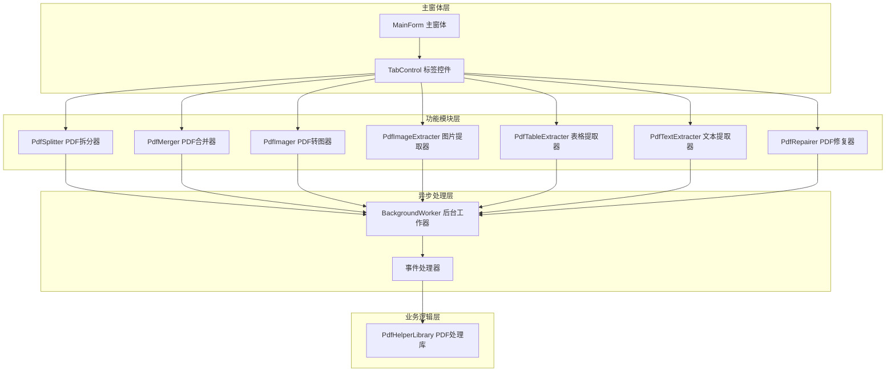

**图表来源**
- [MainForm.cs](file://PdfTool/MainForm.cs#L129-L163)
- [PdfSplitter.cs](file://PdfTool/PdfSplitter.cs#L12-L13)
- [PdfMerger.cs](file://PdfTool/PdfMerger.cs#L12-L13)

**章节来源**
- [MainForm.cs](file://PdfTool/MainForm.cs#L129-L163)
- [Common.cs](file://PdfTool/Common.cs#L12-L16)

## BackgroundWorker核心组件

### 组件特性

BackgroundWorker是Windows Forms中用于执行长时间运行操作的组件，具有以下关键特性：

1. **异步执行**：在单独的线程上执行耗时操作
2. **进度报告**：支持实时进度更新
3. **取消支持**：允许用户中断操作
4. **线程安全**：自动处理UI线程同步

### 配置参数

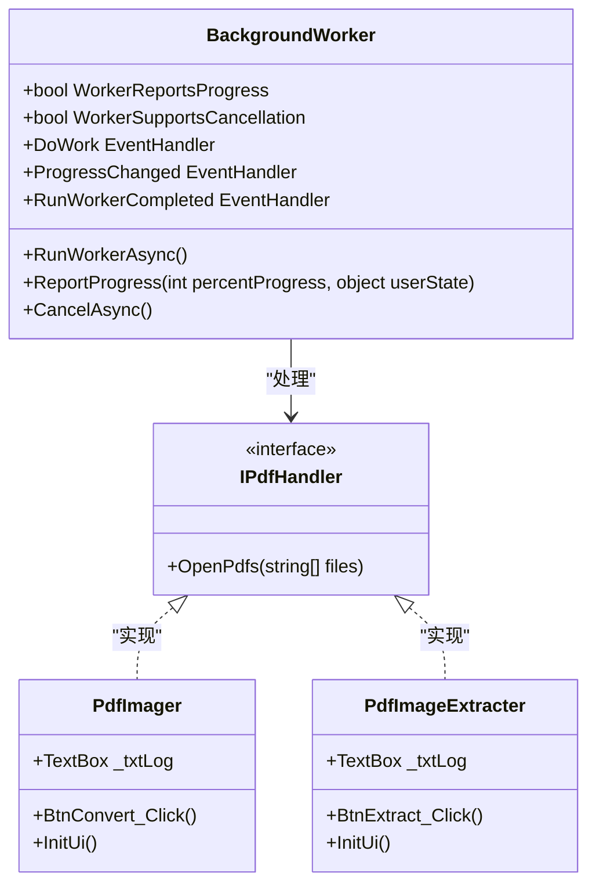

**图表来源**
- [PdfImager.cs](file://PdfTool/PdfImager.cs#L66-L100)
- [PdfImageExtracter.cs](file://PdfTool/PdfImageExtracter.cs#L57-L78)
- [Common.cs](file://PdfTool/Common.cs#L12-L16)

**章节来源**
- [PdfImager.cs](file://PdfTool/PdfImager.cs#L66-L100)
- [PdfImageExtracter.cs](file://PdfTool/PdfImageExtracter.cs#L57-L78)

## 异步处理模式分析

### 标准异步处理流程

所有PDF处理功能都遵循相同的异步处理模式：

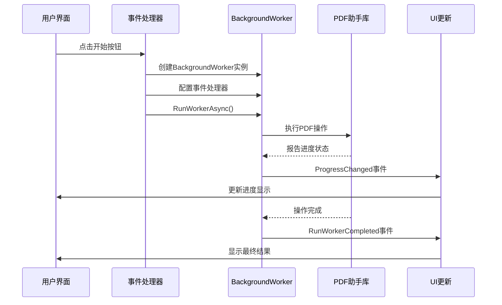

**图表来源**
- [PdfImager.cs](file://PdfTool/PdfImager.cs#L66-L100)
- [PdfImageExtracter.cs](file://PdfTool/PdfImageExtracter.cs#L57-L78)

### 参数传递机制

异步操作通过以下方式传递参数：

1. **实例字段存储**：将用户输入参数存储在控件实例字段中
2. **Lambda表达式捕获**：在事件处理器中捕获当前状态
3. **辅助方法调用**：通过委托函数传递复杂参数

**章节来源**
- [PdfImager.cs](file://PdfTool/PdfImager.cs#L66-L100)
- [PdfImageExtracter.cs](file://PdfTool/PdfImageExtracter.cs#L57-L78)

## 具体功能模块实现

### PDF转图器 (PdfImager)

PDF转图器展示了完整的异步处理实现：

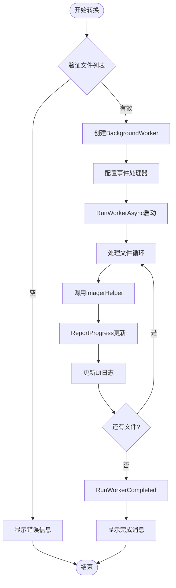

**图表来源**
- [PdfImager.cs](file://PdfTool/PdfImager.cs#L66-L100)

### 图片提取器 (PdfImageExtracter)

图片提取器采用简化的异步模式：

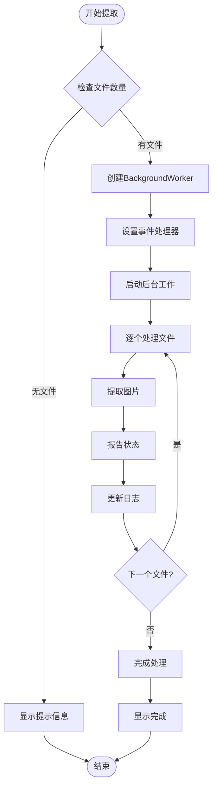

**图表来源**
- [PdfImageExtracter.cs](file://PdfTool/PdfImageExtracter.cs#L57-L78)

### 表格提取器 (PdfTableExtracter)

表格提取器展示了复杂的数据处理和结果导出：

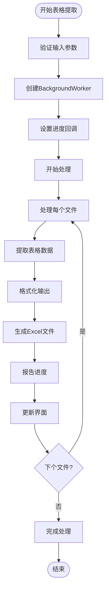

**图表来源**
- [PdfTableExtracter.cs](file://PdfTool/PdfTableExtracter.cs#L58-L85)

**章节来源**
- [PdfImager.cs](file://PdfTool/PdfImager.cs#L66-L100)
- [PdfImageExtracter.cs](file://PdfTool/PdfImageExtracter.cs#L57-L78)
- [PdfTableExtracter.cs](file://PdfTool/PdfTableExtracter.cs#L58-L85)

## 事件处理机制

### DoWork事件处理

DoWork事件是异步操作的核心，负责执行实际的PDF处理逻辑：

| 功能模块 | 处理特点 | 进度报告频率 | 错误处理 |
|---------|---------|------------|---------|
| PdfImager | 单文件处理 | 每个文件完成后 | 文件级别错误处理 |
| PdfImageExtracter | 批量处理 | 每个文件 | 快速失败机制 |
| PdfTableExtracter | 复杂数据处理 | 多阶段进度 | 数据完整性检查 |
| PdfTextExtracter | 简单文本提取 | 整体进度 | 基础异常捕获 |

### ProgressChanged事件处理

ProgressChanged事件确保UI响应性：

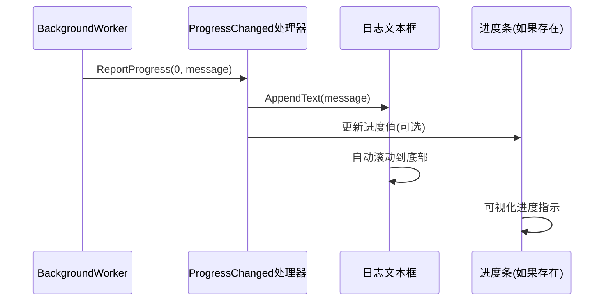

**图表来源**
- [PdfImager.cs](file://PdfTool/PdfImager.cs#L89-L95)
- [PdfImageExtracter.cs](file://PdfTool/PdfImageExtracter.cs#L67-L73)

### RunWorkerCompleted事件处理

完成事件处理确保资源正确释放和最终状态更新：

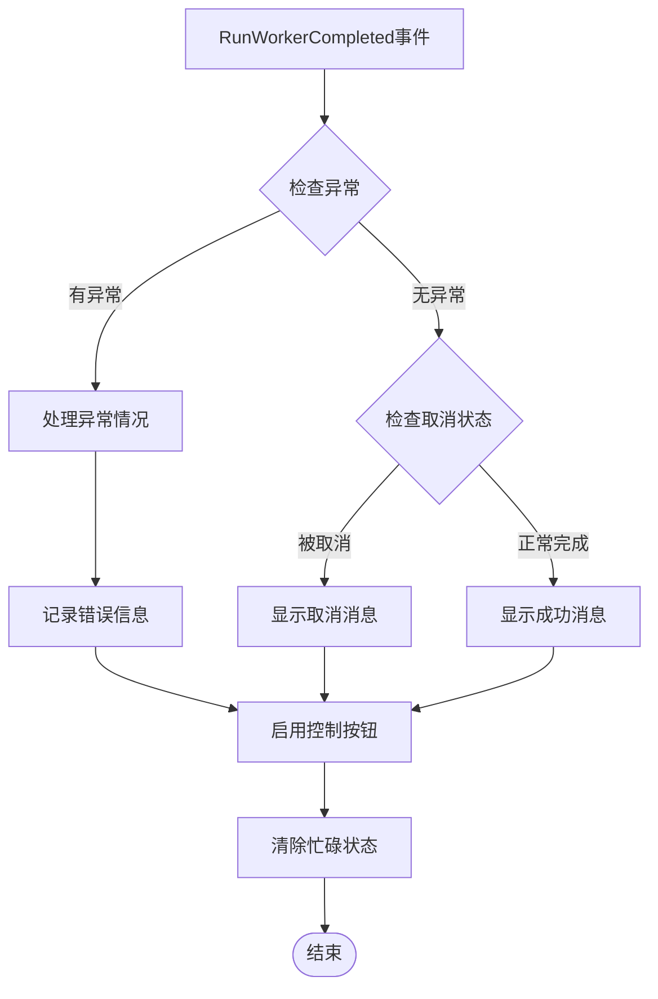

**图表来源**
- [PdfImager.cs](file://PdfTool/PdfImager.cs#L96-L99)
- [PdfImageExtracter.cs](file://PdfTool/PdfImageExtracter.cs#L74-L77)

**章节来源**
- [PdfImager.cs](file://PdfTool/PdfImager.cs#L89-L99)
- [PdfImageExtracter.cs](file://PdfTool/PdfImageExtracter.cs#L67-L77)
- [PdfTableExtracter.cs](file://PdfTool/PdfTableExtracter.cs#L87-L88)

## 异常处理策略

### 多层次异常处理

PdfTool采用多层次的异常处理策略：

1. **操作级异常处理**：在PDF处理库层面捕获特定异常
2. **工作器级异常处理**：在BackgroundWorker事件处理器中处理通用异常
3. **UI级异常处理**：在RunWorkerCompleted事件中处理最终异常

### 资源释放机制

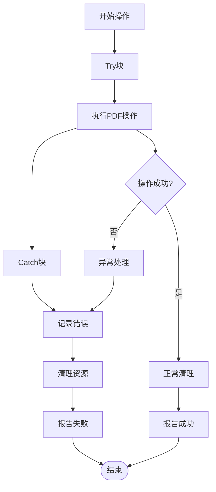

### 取消操作实现

虽然当前版本主要使用BackgroundWorker的基本异步模式，但设计中预留了取消操作的支持：

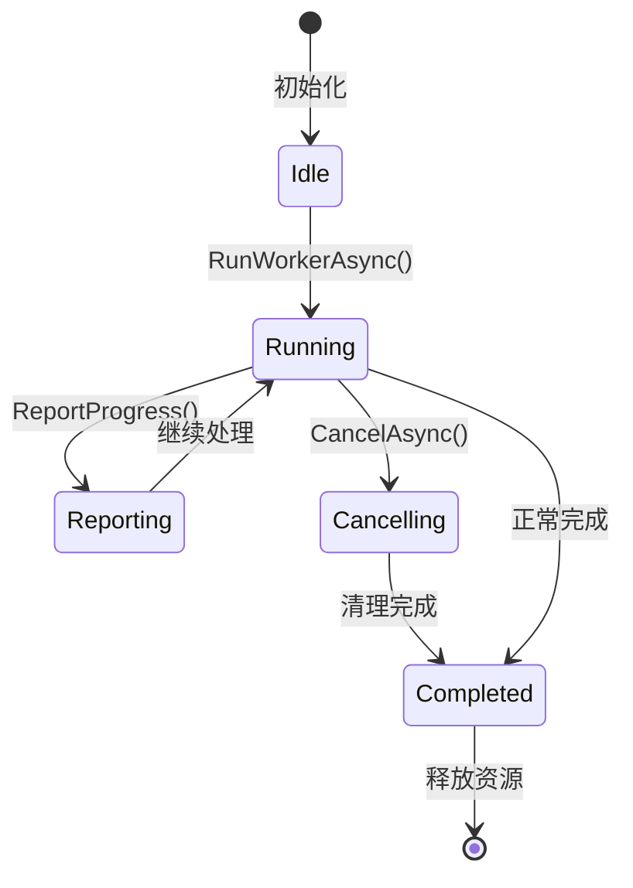

**章节来源**
- [PdfImager.cs](file://PdfTool/PdfImager.cs#L66-L100)
- [PdfImageExtracter.cs](file://PdfTool/PdfImageExtracter.cs#L57-L78)

## 性能优化考虑

### 内存管理

1. **及时释放资源**：使用using语句确保PDF文档对象正确释放
2. **避免内存泄漏**：在事件处理器中正确处理大对象引用
3. **批量处理优化**：对大量文件采用分批处理策略

### 线程安全

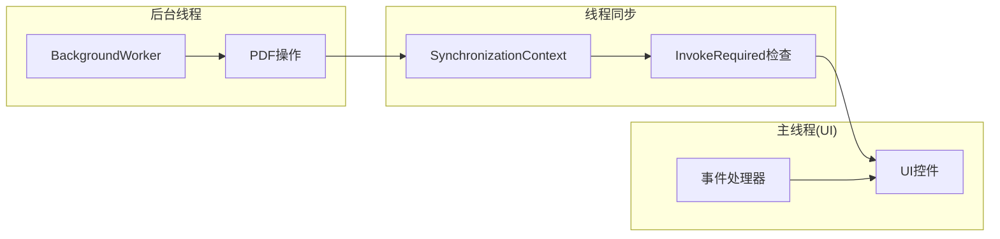

### 用户体验优化

1. **即时反馈**：操作开始时立即显示状态信息
2. **进度指示**：提供清晰的操作进度反馈
3. **取消能力**：允许用户中断长时间操作
4. **错误恢复**：提供友好的错误处理和重试机制

## 最佳实践指南

### 开发者指导原则

1. **统一接口设计**：所有PDF处理模块都实现IPdfHandler接口
2. **一致的异步模式**：遵循标准的BackgroundWorker使用模式
3. **完善的错误处理**：在每个层级都提供适当的异常处理
4. **资源管理**：确保所有外部资源得到正确释放

### 代码组织建议

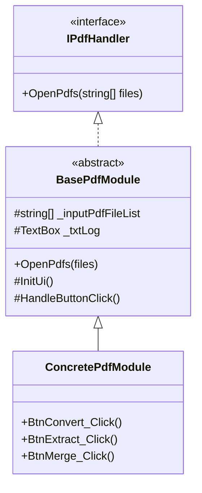

**图表来源**
- [Common.cs](file://PdfTool/Common.cs#L12-L16)
- [PdfImager.cs](file://PdfTool/PdfImager.cs#L12-L13)

### 测试策略

1. **单元测试**：测试PDF处理逻辑的正确性
2. **集成测试**：验证异步处理流程的完整性
3. **性能测试**：评估长时间操作的性能表现
4. **并发测试**：确保多线程环境下的稳定性

**章节来源**
- [Common.cs](file://PdfTool/Common.cs#L12-L16)
- [PdfImager.cs](file://PdfTool/PdfImager.cs#L12-L13)
- [PdfImageExtracter.cs](file://PdfTool/PdfImageExtracter.cs#L12-L13)

## 总结

PdfTool项目的异步处理设计展现了Windows Forms应用程序中BackgroundWorker的有效应用。通过统一的异步处理模式，项目成功地解决了长时间PDF操作导致的界面冻结问题，同时保持了良好的用户体验。

### 关键优势

1. **界面响应性**：BackgroundWorker确保UI始终保持响应
2. **代码一致性**：所有PDF处理模块采用相同的设计模式
3. **易于维护**：清晰的职责分离和标准化的事件处理
4. **扩展性强**：新的PDF处理功能可以轻松集成现有模式

### 改进建议

1. **现代化升级**：考虑迁移到Task Parallel Library (TPL)
2. **进度报告细化**：增加更详细的进度信息
3. **取消操作完善**：实现真正的异步取消机制
4. **错误恢复增强**：提供更多的错误恢复选项

这种异步处理设计为开发者提供了一个可靠、可扩展的框架，适用于各种需要长时间处理的Windows Forms应用程序。