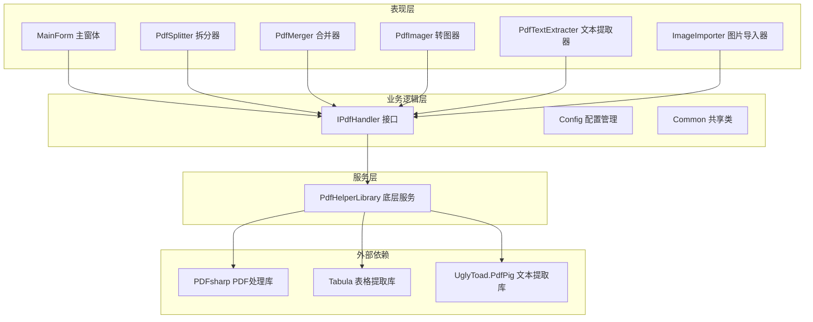
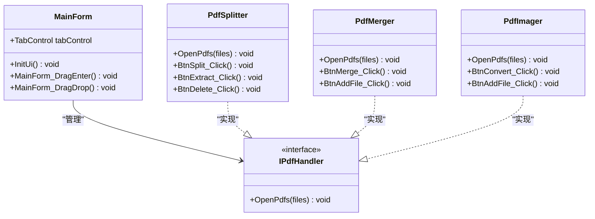
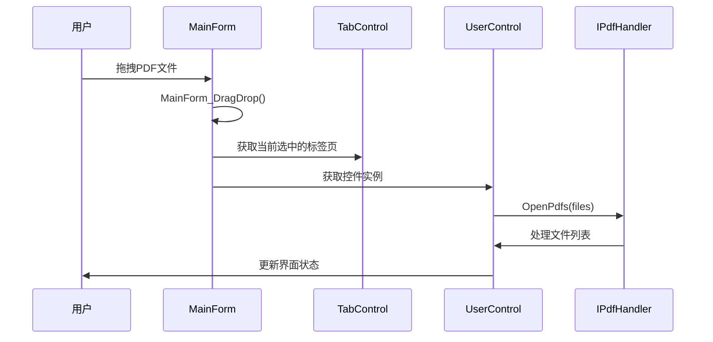
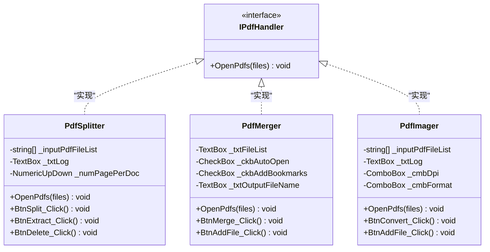
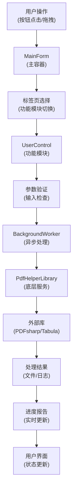
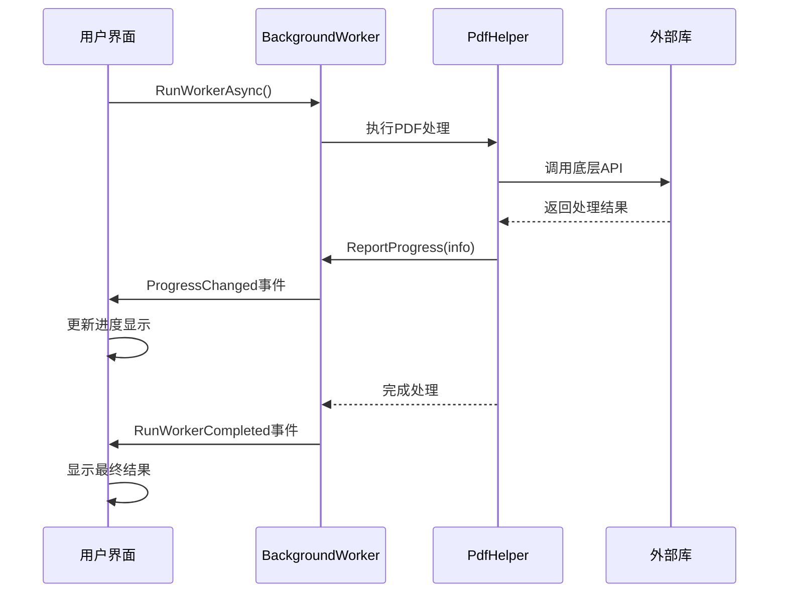
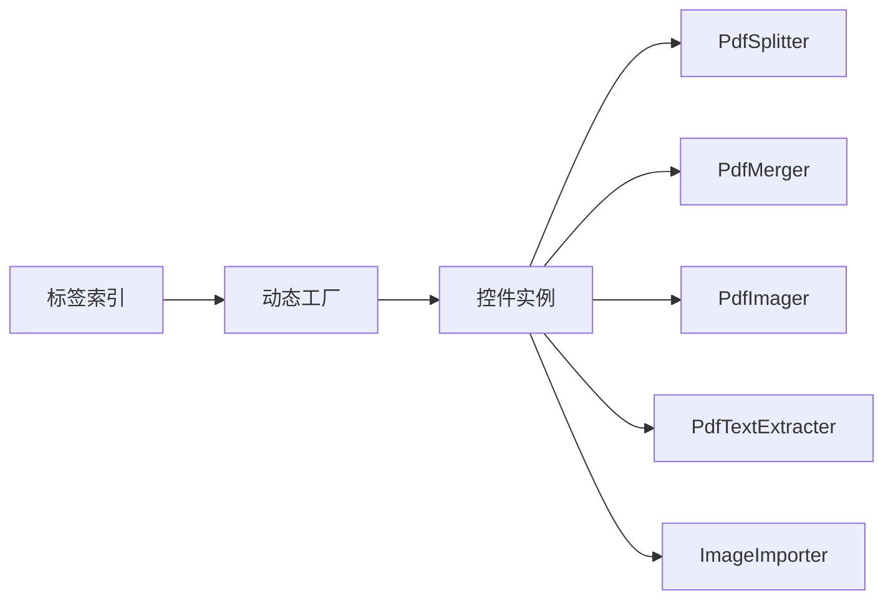

# PdfTool 技术架构文档

<cite>
**本文档中引用的文件**
- [Common.cs](file://PdfTool/Common.cs)
- [MainForm.cs](file://PdfTool/MainForm.cs)
- [Config.cs](file://PdfTool/Config.cs)
- [PdfSplitter.cs](file://PdfTool/PdfSplitter.cs)
- [PdfMerger.cs](file://PdfTool/PdfMerger.cs)
- [PdfImager.cs](file://PdfTool/PdfImager.cs)
- [PdfTextExtracter.cs](file://PdfTool/PdfTextExtracter.cs)
- [ImageImporter.cs](file://PdfTool/ImageImporter.cs)
- [Program.cs](file://PdfTool/Program.cs)
- [SplitHelper.cs](file://PdfHelperLibrary/SplitHelper.cs)
- [MergeHelper.cs](file://PdfHelperLibrary/MergeHelper.cs)
- [CommonHelper.cs](file://PdfHelperLibrary/CommonHelper.cs)
- [PdfHelperLibrary.csproj](file://PdfHelperLibrary/PdfHelperLibrary.csproj)
</cite>

## 目录
1. [引言](#引言)
2. [项目结构概览](#项目结构概览)
3. [核心架构设计](#核心架构设计)
4. [模块化设计模式](#模块化设计模式)
5. [组件交互架构](#组件交互架构)
6. [事件驱动模型](#事件驱动模型)
7. [配置管理系统](#配置管理系统)
8. [PdfHelperLibrary底层服务](#pdfhelperlibrary底层服务)
9. [设计模式应用](#设计模式应用)
10. [性能考虑](#性能考虑)
11. [总结](#总结)

## 引言

PdfTool是一个基于.NET Framework的Windows桌面应用程序，采用模块化设计模式构建，提供了丰富的PDF处理功能。该系统通过清晰的分层架构和接口抽象，实现了高度的可扩展性和维护性。本文档深入分析其技术架构，重点阐述模块化设计模式、组件交互机制和事件驱动模型。

## 项目结构概览

PdfTool项目采用多层架构设计，主要包含以下核心模块：

**图表来源**
- [MainForm.cs](file://PdfTool/MainForm.cs#L12-L194)
- [Common.cs](file://PdfTool/Common.cs#L13-L16)
- [PdfHelperLibrary.csproj](file://PdfHelperLibrary/PdfHelperLibrary.csproj#L1-L127)

**章节来源**
- [MainForm.cs](file://PdfTool/MainForm.cs#L1-L194)
- [Common.cs](file://PdfTool/Common.cs#L1-L18)

## 核心架构设计

### 分层架构模式

PdfTool采用经典的三层架构模式：

1. **表现层（Presentation Layer）**：负责用户界面展示和用户交互
2. **业务逻辑层（Business Logic Layer）**：处理核心业务逻辑和流程控制
3. **服务层（Service Layer）**：提供底层PDF处理功能

**图表来源**
- [MainForm.cs](file://PdfTool/MainForm.cs#L12-L194)
- [Common.cs](file://PdfTool/Common.cs#L13-L16)
- [PdfSplitter.cs](file://PdfTool/PdfSplitter.cs#L12-L230)
- [PdfMerger.cs](file://PdfTool/PdfMerger.cs#L12-L154)
- [PdfImager.cs](file://PdfTool/PdfImager.cs#L13-L218)

### 主容器设计

MainForm作为系统的主容器，采用TabControl实现功能模块的组织：

- **动态控件加载**：根据标签页选择动态加载对应的UserControl
- **拖拽文件支持**：支持拖拽PDF文件到任意功能模块
- **统一接口管理**：通过IPdfHandler接口实现模块间的统一通信

**章节来源**
- [MainForm.cs](file://PdfTool/MainForm.cs#L1-L194)

## 模块化设计模式

### IPdfHandler接口设计

IPdfHandler接口是整个模块化架构的核心抽象，定义了所有PDF处理模块必须实现的标准接口：

**图表来源**
- [MainForm.cs](file://PdfTool/MainForm.cs#L41-L58)
- [Common.cs](file://PdfTool/Common.cs#L13-L16)

### 功能模块实现模式

每个功能模块都遵循相同的实现模式：

1. **继承UserControl**：确保与Windows Forms的兼容性
2. **实现IPdfHandler接口**：提供统一的文件处理能力
3. **封装具体业务逻辑**：将复杂的PDF处理逻辑封装在Helper类中

**图表来源**
- [PdfSplitter.cs](file://PdfTool/PdfSplitter.cs#L12-L230)
- [PdfMerger.cs](file://PdfTool/PdfMerger.cs#L12-L154)
- [PdfImager.cs](file://PdfTool/PdfImager.cs#L13-L218)

**章节来源**
- [PdfSplitter.cs](file://PdfTool/PdfSplitter.cs#L1-L230)
- [PdfMerger.cs](file://PdfTool/PdfMerger.cs#L1-L154)
- [PdfImager.cs](file://PdfTool/PdfImager.cs#L1-L218)

## 组件交互架构

### 数据流架构

PdfTool的数据流遵循单向流动原则，确保系统的稳定性和可预测性：

**图表来源**
- [MainForm.cs](file://PdfTool/MainForm.cs#L41-L58)
- [PdfImager.cs](file://PdfTool/PdfImager.cs#L67-L100)
- [PdfTextExtracter.cs](file://PdfTool/PdfTextExtracter.cs#L57-L80)

### 组件间通信机制

系统采用事件驱动和接口回调的方式实现组件间通信：

1. **事件驱动**：用户操作触发相应的事件处理器
2. **接口回调**：通过IPdfHandler接口实现模块间的解耦
3. **异步处理**：使用BackgroundWorker避免UI阻塞

**章节来源**
- [MainForm.cs](file://PdfTool/MainForm.cs#L33-L60)
- [PdfImager.cs](file://PdfTool/PdfImager.cs#L67-L100)

## 事件驱动模型

### BackgroundWorker使用模式

PdfTool广泛使用BackgroundWorker实现异步处理，确保UI响应性：

**图表来源**
- [PdfImager.cs](file://PdfTool/PdfImager.cs#L67-L100)
- [PdfTextExtracter.cs](file://PdfTool/PdfTextExtracter.cs#L57-L80)

### 事件处理流程

每个功能模块都遵循标准的事件处理流程：

1. **事件触发**：用户点击按钮或执行相关操作
2. **参数验证**：检查输入参数的有效性
3. **异步处理**：启动BackgroundWorker执行耗时操作
4. **进度报告**：定期更新处理进度
5. **结果处理**：处理完成后更新用户界面

**章节来源**
- [PdfImager.cs](file://PdfTool/PdfImager.cs#L56-L102)
- [PdfTextExtracter.cs](file://PdfTool/PdfTextExtracter.cs#L50-L80)

## 配置管理系统

### Config类设计

Config类采用静态常量设计，提供全局配置管理：

| 配置项 | 类型 | 值 | 用途 |
|--------|------|----|----- |
| ControlMargin | int | 20 | 控件边距间距 |
| ControlPadding | int | 12 | 控件内边距 |

这种设计确保了：
- **一致性**：所有界面元素使用统一的间距标准
- **可维护性**：配置集中管理，便于修改
- **可读性**：使用有意义的常量名称

**章节来源**
- [Config.cs](file://PdfTool/Config.cs#L1-L9)

## PdfHelperLibrary底层服务

### 架构设计

PdfHelperLibrary作为底层服务提供者，采用职责分离的设计原则：

```mermaid
graph TB
subgraph "PdfHelperLibrary"
CommonHelper[CommonHelper<br/>通用辅助功能]
SplitHelper[SplitHelper<br/>PDF拆分]
MergeHelper[MergeHelper<br/>PDF合并]
TextExtractHelper[TextExtractHelper<br/>文本提取]
ImageExtractHelper[ImageExtractHelper<br/>图片提取]
ImagerHelper[ImagerHelper<br/>图像转换]
TableExtractHelper[TableExtractHelper<br/>表格提取]
PageRotateHelper[PageRotateHelper<br/>页面旋转]
ProtectHelper[ProtectHelper<br/>文档保护]
WatermarkHelper[WatermarkHelper<br/>水印添加]
PrintHelper[PrintHelper<br/>打印功能]
SealHelper[SealHelper<br/>印章功能]
CompressHelper[CompressHelper<br/>压缩功能]
ExtractHelper[ExtractHelper<br/>通用提取]
end
subgraph "外部依赖"
PDFsharp[PDFsharp<br/>PDF文档处理]
Tabula[Tabula<br/>表格数据提取]
UglyToad[UglyToad.PdfPig<br/>PDF内容解析]
end
CommonHelper --> PDFsharp
SplitHelper --> PDFsharp
MergeHelper --> PDFsharp
TextExtractHelper --> UglyToad
ImageExtractHelper --> PDFsharp
ImagerHelper --> PDFsharp
TableExtractHelper --> Tabula
PageRotateHelper --> PDFsharp
ProtectHelper --> PDFsharp
WatermarkHelper --> PDFsharp
PrintHelper --> PDFsharp
SealHelper --> PDFsharp
CompressHelper --> PDFsharp
ExtractHelper --> PDFsharp
```

**图表来源**
- [PdfHelperLibrary.csproj](file://PdfHelperLibrary/PdfHelperLibrary.csproj#L97-L113)
- [CommonHelper.cs](file://PdfHelperLibrary/CommonHelper.cs#L1-L29)

### 核心功能模块

#### SplitHelper - PDF拆分功能
- 支持按页数拆分
- 支持指定范围提取
- 支持指定页码删除

#### MergeHelper - PDF合并功能
- 支持多文件合并
- 支持自动打开选项
- 支持书签添加

#### TextExtractHelper - 文本提取功能
- 使用UglyToad.PdfPig库
- 支持纯文本提取
- 保持文本结构

**章节来源**
- [SplitHelper.cs](file://PdfHelperLibrary/SplitHelper.cs#L1-L70)
- [MergeHelper.cs](file://PdfHelperLibrary/MergeHelper.cs#L1-L75)
- [CommonHelper.cs](file://PdfHelperLibrary/CommonHelper.cs#L1-L29)

## 设计模式应用

### 接口隔离模式

IPdfHandler接口体现了接口隔离原则，将通用的PDF处理能力抽象出来：

- **单一职责**：只定义OpenPdfs方法
- **最小接口**：避免过度设计
- **易于扩展**：新功能模块只需实现该接口

### 工厂模式应用

虽然没有显式的工厂类，但MainForm中的动态控件加载体现了工厂模式的思想：

### 观察者模式

事件驱动模型本质上是观察者模式的应用：

- **Subject**：BackgroundWorker
- **Observer**：UI事件处理器
- **通知机制**：ProgressChanged和RunWorkerCompleted事件

**章节来源**
- [Common.cs](file://PdfTool/Common.cs#L13-L16)
- [MainForm.cs](file://PdfTool/MainForm.cs#L151-L163)

## 性能考虑

### 异步处理策略

1. **BackgroundWorker**：避免UI线程阻塞
2. **进度报告**：及时反馈处理状态
3. **异常处理**：防止异常影响主线程

### 内存管理

1. **资源释放**：及时释放PDF文档对象
2. **垃圾回收**：合理使用GC.Collect()
3. **大文件处理**：分批处理避免内存溢出

### 并发控制

1. **单线程处理**：每个功能模块独立处理
2. **互斥访问**：防止同时操作同一文件
3. **状态同步**：确保UI状态与后台处理同步

## 总结

PdfTool的技术架构展现了优秀的软件设计原则：

1. **模块化设计**：通过IPdfHandler接口实现松耦合
2. **分层架构**：清晰的职责分离和层次划分
3. **事件驱动**：响应式用户界面设计
4. **可扩展性**：易于添加新的PDF处理功能
5. **可维护性**：清晰的代码结构和命名规范

该架构为开发者提供了一个良好的参考模板，展示了如何在Windows Forms应用中实现复杂的功能模块化设计。通过合理的接口抽象和职责分离，系统既保持了良好的性能，又具备了优秀的可扩展性和可维护性。