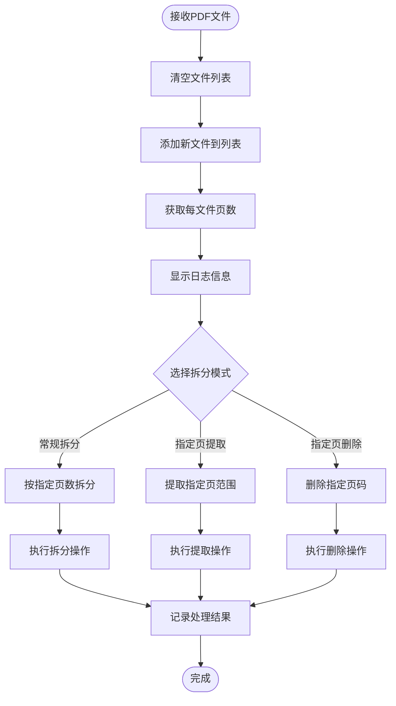

# 模块通信机制

<cite>
**本文档引用的文件**
- [MainForm.cs](file://PdfTool/MainForm.cs)
- [Common.cs](file://PdfTool/Common.cs)
- [PdfSplitter.cs](file://PdfTool/PdfSplitter.cs)
- [PdfMerger.cs](file://PdfTool/PdfMerger.cs)
- [PdfImager.cs](file://PdfTool/PdfImager.cs)
- [PdfImageExtracter.cs](file://PdfTool/PdfImageExtracter.cs)
- [PdfTableExtracter.cs](file://PdfTool/PdfTableExtracter.cs)
- [PdfTextExtracter.cs](file://PdfTool/PdfTextExtracter.cs)
- [PageRotator.cs](file://PdfTool/PageRotator.cs)
- [PdfPrinter.cs](file://PdfTool/PdfPrinter.cs)
- [PdfProtector.cs](file://PdfTool/PdfProtector.cs)
- [PdfRepairer.cs](file://PdfTool/PdfRepairer.cs)
- [PdfPreviewer.cs](file://PdfTool/PdfPreviewer.cs)
- [ImageImporter.cs](file://PdfTool/ImageImporter.cs)
</cite>

## 目录
1. [引言](#引言)
2. [项目结构概述](#项目结构概述)
3. [IPdfHandler接口设计](#ipdfhandler接口设计)
4. [MainForm拖放事件处理机制](#mainform拖放事件处理机制)
5. [功能模块实现分析](#功能模块实现分析)
6. [组件交互时序图](#组件交互时序图)
7. [松耦合架构优势](#松耦合架构优势)
8. [异常处理策略](#异常处理策略)
9. [扩展性分析](#扩展性分析)
10. [总结](#总结)

## 引言

PdfTool项目采用了一种基于接口抽象的模块通信机制，通过IPdfHandler接口作为MainForm与各个功能UserControl之间的桥梁，实现了高度的模块化和可扩展性。这种设计模式不仅简化了组件间的交互，还为未来的功能扩展提供了良好的基础架构。

## 项目结构概述

PdfTool项目采用了多模块化的架构设计，主要包含以下核心组件：

**图表来源**
- [MainForm.cs](file://PdfTool/MainForm.cs#L12-L194)
- [Common.cs](file://PdfTool/Common.cs#L12-L16)

## IPdfHandler接口设计

IPdfHandler接口是整个模块通信机制的核心抽象，它定义了一个统一的方法签名，使得不同功能模块能够以一致的方式处理PDF文件列表。

### 接口定义

**图表来源**
- [Common.cs](file://PdfTool/Common.cs#L12-L16)
- [PdfSplitter.cs](file://PdfTool/PdfSplitter.cs#L12)
- [PdfMerger.cs](file://PdfTool/PdfMerger.cs#L12)
- [PdfImager.cs](file://PdfTool/PdfImager.cs#L13)
- [ImageImporter.cs](file://PdfTool/ImageImporter.cs#L12)

### 接口特性分析

IPdfHandler接口具有以下关键特性：

1. **单一职责原则**：只定义了一个OpenPdfs方法，专注于处理PDF文件列表
2. **类型安全**：使用泛型List<string>确保文件路径的类型安全性
3. **一致性**：所有实现类都遵循相同的接口契约
4. **可扩展性**：接口设计允许未来添加新的方法而不会破坏现有实现

**章节来源**
- [Common.cs](file://PdfTool/Common.cs#L12-L16)

## MainForm拖放事件处理机制

MainForm作为整个应用程序的协调中心，负责处理用户通过拖放操作传递的PDF文件，并将其路由到相应的功能模块。

### 拖放事件流程

**图表来源**
- [MainForm.cs](file://PdfTool/MainForm.cs#L33-L60)

### 关键实现细节

MainForm的拖放处理逻辑包含以下关键步骤：

1. **事件注册**：在构造函数中注册DragEnter和DragDrop事件
2. **数据验证**：检查拖放的数据是否包含文件路径
3. **文件过滤**：从拖放的文件中筛选出PDF文件
4. **目标识别**：通过类型检查确定目标控件
5. **方法调用**：根据控件类型调用相应的方法

**章节来源**
- [MainForm.cs](file://PdfTool/MainForm.cs#L15-L23)
- [MainForm.cs](file://PdfTool/MainForm.cs#L33-L60)

## 功能模块实现分析

### PDF拆分器(PdfSplitter)

PdfSplitter是最复杂的PDF处理模块之一，支持多种拆分模式：

**图表来源**
- [PdfSplitter.cs](file://PdfTool/PdfSplitter.cs#L33-L42)

### PDF合并器(PdfMerger)

PdfMerger专注于PDF文件的合并操作：

**图表来源**
- [PdfMerger.cs](file://PdfTool/PdfMerger.cs#L33-L39)

### 图片导入器(ImageImporter)

ImageImporter专门处理图片到PDF的转换：

**图表来源**
- [ImageImporter.cs](file://PdfTool/ImageImporter.cs#L29-L35)

**章节来源**
- [PdfSplitter.cs](file://PdfTool/PdfSplitter.cs#L33-L42)
- [PdfMerger.cs](file://PdfTool/PdfMerger.cs#L33-L39)
- [ImageImporter.cs](file://PdfTool/ImageImporter.cs#L29-L35)

## 组件交互时序图

以下是MainForm与各个功能模块之间的典型交互时序：

**图表来源**
- [MainForm.cs](file://PdfTool/MainForm.cs#L41-L52)
- [PdfSplitter.cs](file://PdfTool/PdfSplitter.cs#L33-L42)

## 松耦合架构优势

### 设计优势分析

1. **接口抽象**：IPdfHandler接口将MainForm与具体实现分离
2. **类型安全**：编译时类型检查确保方法调用的安全性
3. **运行时多态**：通过类型检查实现动态方法调用
4. **模块独立性**：各功能模块可以独立开发和测试

### 架构层次分析

**图表来源**
- [MainForm.cs](file://PdfTool/MainForm.cs#L41-L52)
- [Common.cs](file://PdfTool/Common.cs#L12-L16)

**章节来源**
- [MainForm.cs](file://PdfTool/MainForm.cs#L41-L52)
- [Common.cs](file://PdfTool/Common.cs#L12-L16)

## 异常处理策略

### 类型转换安全性

MainForm在处理控件类型时采用了安全的类型检查机制：

**图表来源**
- [MainForm.cs](file://PdfTool/MainForm.cs#L49-L58)

### 错误处理机制

1. **类型安全检查**：使用is运算符确保类型转换的安全性
2. **异常捕获**：各功能模块内部实现异常处理
3. **用户反馈**：通过日志系统向用户反馈处理结果
4. **优雅降级**：当某个模块处理失败时不影响其他模块

**章节来源**
- [MainForm.cs](file://PdfTool/MainForm.cs#L49-L58)

## 扩展性分析

### 新功能模块的添加

基于现有的接口抽象，添加新的功能模块非常简单：

### 扩展性优势

1. **零侵入式扩展**：新模块只需实现IPdfHandler接口
2. **配置驱动**：通过TabControl配置即可添加新功能
3. **向后兼容**：新增模块不会影响现有功能
4. **易于维护**：清晰的接口定义便于代码维护

### 未来扩展方向

1. **更多PDF处理功能**：如水印添加、批处理等
2. **云存储集成**：支持云端PDF文件处理
3. **批量处理优化**：提高大量文件处理的性能
4. **插件系统**：支持第三方功能模块的动态加载

**章节来源**
- [MainForm.cs](file://PdfTool/MainForm.cs#L135-L163)
- [Common.cs](file://PdfTool/Common.cs#L12-L16)

## 总结

PdfTool项目的模块通信机制展现了优秀的软件架构设计：

1. **接口抽象**：IPdfHandler接口提供了清晰的功能边界
2. **松耦合设计**：MainForm与功能模块之间实现了高度解耦
3. **类型安全**：通过强类型检查确保运行时安全性
4. **可扩展性**：架构设计支持功能的无缝扩展
5. **用户体验**：拖放操作简化了用户交互流程

这种设计模式不仅提高了代码的可维护性和可测试性，还为项目的长期发展奠定了坚实的基础。通过持续的重构和优化，PdfTool项目能够适应不断变化的需求和技术发展趋势。