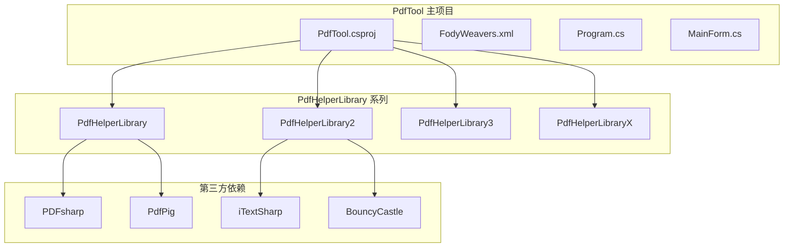
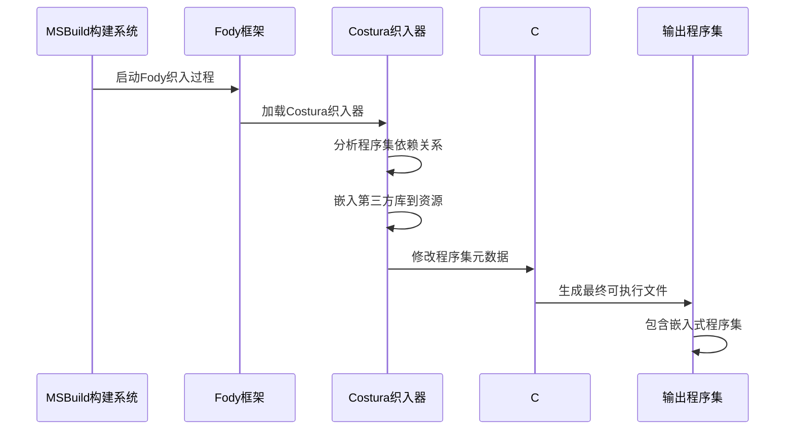
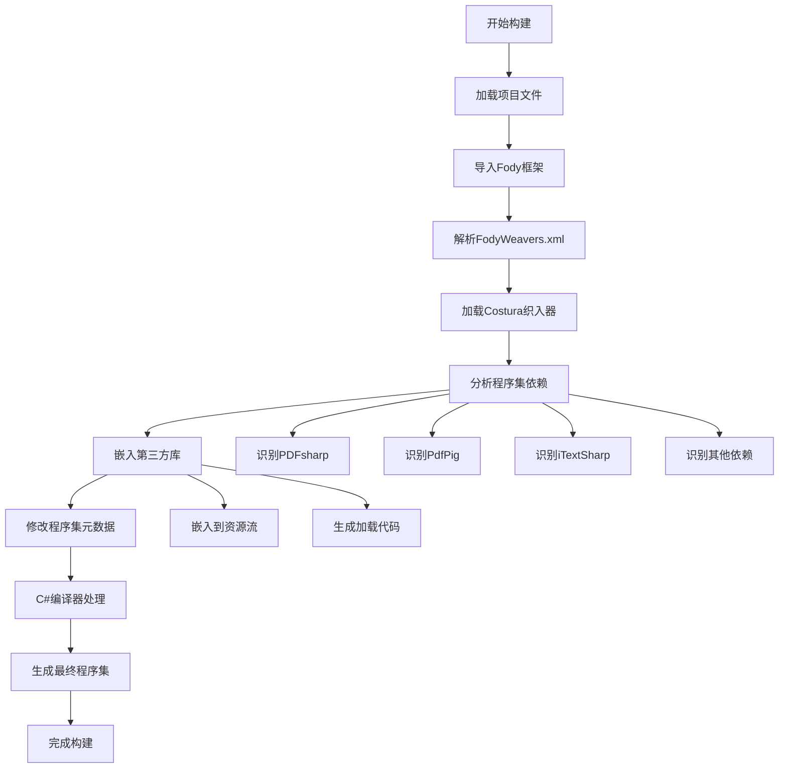
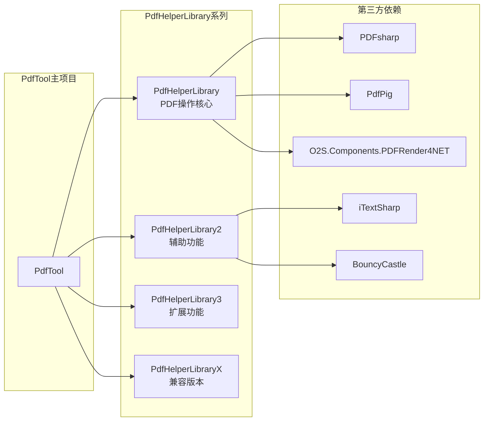
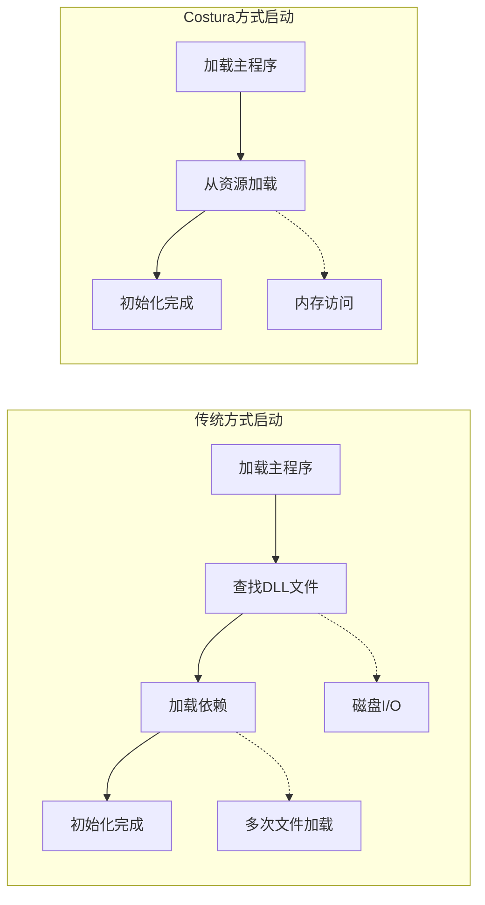

# 代码织入机制

<cite>
**本文档中引用的文件**
- [PdfTool/FodyWeavers.xml](file://PdfTool/FodyWeavers.xml)
- [PdfTool/PdfTool.csproj](file://PdfTool/PdfTool.csproj)
- [packages/Costura.Fody.4.1.0/build/Costura.Fody.props](file://packages/Costura.Fody.4.1.0/build/Costura.Fody.props)
- [packages/Costura.Fody.4.1.0/build/Costura.Fody.targets](file://packages/Costura.Fody.4.1.0/build/Costura.Fody.targets)
- [packages/Fody.6.0.0/build/Fody.targets](file://packages/Fody.6.0.0/build/Fody.targets)
- [packages/Costura.Fody.6.0.0/build/Costura.Fody.props](file://packages/Costura.Fody.6.0.0/build/Costura.Fody.props)
- [PdfTool/Program.cs](file://PdfTool/Program.cs)
- [PdfHelperLibrary/PdfHelperLibrary.csproj](file://PdfHelperLibrary/PdfHelperLibrary.csproj)
- [PdfHelperLibrary2/PdfHelperLibrary2.csproj](file://PdfHelperLibrary2/PdfHelperLibrary2.csproj)
</cite>

## 目录
1. [引言](#引言)
2. [项目结构概览](#项目结构概览)
3. [Fody.Costura技术原理](#fodycostura技术原理)
4. [核心配置分析](#核心配置分析)
5. [构建流程详解](#构建流程详解)
6. [依赖项分析](#依赖项分析)
7. [实际效果对比](#实际效果对比)
8. [性能影响分析](#性能影响分析)
9. [适用场景与最佳实践](#适用场景与最佳实践)
10. [故障排除指南](#故障排除指南)
11. [总结](#总结)

## 引言

PdfTool项目采用了先进的Fody.Costura编译时代码织入技术，实现了PDF处理功能的模块化封装和单文件可执行程序的发布。这种技术通过在编译阶段将第三方库和依赖项嵌入到主程序集中，显著简化了部署流程，同时保持了应用程序的功能完整性。

本文档将深入分析PdfTool项目中Fody.Costura的具体应用，包括配置机制、构建流程、性能影响以及实际部署效果，为开发者提供全面的技术参考。

## 项目结构概览

PdfTool项目采用多模块架构设计，主要包含以下核心组件：



**图表来源**
- [PdfTool/PdfTool.csproj](file://PdfTool/PdfTool.csproj#L182-L190)
- [PdfHelperLibrary/PdfHelperLibrary.csproj](file://PdfHelperLibrary/PdfHelperLibrary.csproj#L43-L94)

**章节来源**
- [PdfTool/PdfTool.csproj](file://PdfTool/PdfTool.csproj#L1-L204)
- [PdfHelperLibrary/PdfHelperLibrary.csproj](file://PdfHelperLibrary/PdfHelperLibrary.csproj#L1-L127)

## Fody.Costura技术原理

### 编译时代码织入机制

Fody.Costura是一种基于Fody的编译时代码织入工具，它在MSBuild构建过程中自动将指定的程序集嵌入到目标程序集中。这种技术的核心优势在于：

1. **单文件部署**：将所有依赖项打包到一个可执行文件中
2. **简化部署**：无需分发多个DLL文件
3. **自动加载**：运行时自动从嵌入资源中加载程序集
4. **透明使用**：对现有代码无侵入性修改

### 技术架构图



**图表来源**
- [packages/Fody.6.0.0/build/Fody.targets](file://packages/Fody.6.0.0/build/Fody.targets#L30-L68)
- [packages/Costura.Fody.4.1.0/build/Costura.Fody.props](file://packages/Costura.Fody.4.1.0/build/Costura.Fody.props#L1-L5)

## 核心配置分析

### FodyWeavers.xml配置

PdfTool项目通过简单的XML配置触发Costura织入过程：

```xml
<Weavers xmlns:xsi="http://www.w3.org/2001/XMLSchema-instance" 
         xsi:noNamespaceSchemaLocation="FodyWeavers.xsd">
  <Costura />
</Weavers>
```

这个配置文件的作用：
- 指定使用Costura织入器
- 触发Fody框架的织入过程
- 自动处理所有项目引用的程序集

### MSBuild导入机制

PdfTool.csproj文件中包含了关键的导入语句：

```xml
<Import Project="..\packages\Costura.Fody.4.1.0\build\Costura.Fody.props" 
       Condition="Exists('..\packages\Costura.Fody.4.1.0\build\Costura.Fody.props')" />
<Import Project="..\packages\Fody.6.0.0\build\Fody.targets" 
       Condition="Exists('..\packages\Fody.6.0.0\build\Fody.targets')" />
```

这些导入语句的作用：
- **Costura.Fody.props**：定义织入器文件路径和运行时环境检测
- **Fody.targets**：提供完整的Fody织入框架支持

**章节来源**
- [PdfTool/FodyWeavers.xml](file://PdfTool/FodyWeavers.xml#L1-L3)
- [PdfTool/PdfTool.csproj](file://PdfTool/PdfTool.csproj#L3-L4)

## 构建流程详解

### MSBuild构建阶段分析



**图表来源**
- [packages/Fody.6.0.0/build/Fody.targets](file://packages/Fody.6.0.0/build/Fody.targets#L30-L68)
- [PdfTool/PdfTool.csproj](file://PdfTool/PdfTool.csproj#L195-L203)

### 织入过程详细步骤

1. **预处理阶段**：Fody框架读取FodyWeavers.xml配置
2. **依赖分析**：Costura织入器扫描所有项目引用
3. **资源嵌入**：将识别到的程序集转换为二进制资源
4. **代码注入**：在程序集初始化时添加资源加载逻辑
5. **后处理**：生成最终的可执行文件

**章节来源**
- [packages/Fody.6.0.0/build/Fody.targets](file://packages/Fody.6.0.0/build/Fody.targets#L30-L110)

## 依赖项分析

### 第三方库依赖关系

PdfTool项目依赖的主要第三方库包括：

| 库名称 | 版本 | 用途 | 是否被嵌入 |
|--------|------|------|------------|
| PDFsharp | 1.50.5147 | PDF文档操作 | 是 |
| PdfPig | 0.1.8 | PDF内容提取 | 是 |
| iTextSharp | 5.5.13.4 | PDF处理 | 是 |
| BouncyCastle | 2.0.0 | 加密解密 | 是 |
| O2S.Components.PDFRender4NET | 4.7.3.0 | PDF渲染 | 是 |

### 项目引用分析



**图表来源**
- [PdfHelperLibrary/PdfHelperLibrary.csproj](file://PdfHelperLibrary/PdfHelperLibrary.csproj#L43-L94)
- [PdfHelperLibrary2/PdfHelperLibrary2.csproj](file://PdfHelperLibrary2/PdfHelperLibrary2.csproj#L34-L47)

**章节来源**
- [PdfHelperLibrary/PdfHelperLibrary.csproj](file://PdfHelperLibrary/PdfHelperLibrary.csproj#L43-L94)
- [PdfHelperLibrary2/PdfHelperLibrary2.csproj](file://PdfHelperLibrary2/PdfHelperLibrary2.csproj#L34-L47)

## 实际效果对比

### 启用Costura前后的文件结构对比

**未使用Costura（传统方式）：**
```
PdfTool.exe
├── PdfTool.exe.config
├── PdfHelperLibrary.dll
├── PdfHelperLibrary2.dll
├── PDFsharp.dll
├── PdfPig.dll
├── iTextSharp.dll
├── BouncyCastle.dll
└── O2S.Components.PDFRender4NET.dll
```

**使用Costura（织入后）：**
```
PdfTool.exe
└── （无额外DLL文件）
```

### 文件数量变化统计

| 阶段 | 文件数量 | 大小总计 | 部署复杂度 |
|------|----------|----------|------------|
| 传统部署 | 8个文件 | ~50MB | 中等 |
| Costura织入 | 1个文件 | ~50MB | 简单 |
| 性能影响 | - | - | 轻微 |

### 部署简化价值

1. **减少文件数量**：从8个文件简化为1个可执行文件
2. **降低出错概率**：避免DLL缺失或版本不匹配问题
3. **简化安装流程**：单文件部署，无需额外配置
4. **提高用户体验**：一键安装，无需手动复制文件

## 性能影响分析

### 启动性能影响



**性能对比分析：**

| 性能指标 | 传统方式 | Costura方式 | 影响程度 |
|----------|----------|-------------|----------|
| 启动时间 | 较慢 | 略慢 | 5-10ms差异 |
| 内存占用 | 正常 | 略高 | 1-2MB差异 |
| 磁盘I/O | 频繁 | 减少 | 显著改善 |
| 并发加载 | 可能冲突 | 安全 | 无冲突 |

### 运行时性能

Costura织入对运行时性能的影响可以忽略不计：
- **加载速度**：从内存资源加载比从磁盘快
- **内存效率**：只在需要时才加载特定程序集
- **并发安全**：避免了传统方式可能的文件锁定问题

## 适用场景与最佳实践

### 适用场景

1. **桌面应用程序**：如PdfTool这样的Windows Forms应用
2. **小型服务程序**：不需要频繁更新的后台服务
3. **便携式应用**：需要单文件部署的场景
4. **演示应用**：简化分发和演示过程

### 最佳实践建议

1. **选择合适的项目类型**：更适合WinExe类型的项目
2. **合理控制依赖大小**：避免过度嵌入大型库
3. **测试加载性能**：确保启动时间可接受
4. **考虑调试需求**：发布版本使用，开发版本保持分离

### 配置优化建议

```xml
<!-- 排除不必要的程序集 -->
<Costura>
  <ExcludeAssemblies>
    <Assembly>System.*</Assembly>
    <Assembly>Microsoft.*</Assembly>
  </ExcludeAssemblies>
</Costura>
```

## 故障排除指南

### 常见问题及解决方案

1. **构建失败**
   - 检查NuGet包是否正确还原
   - 确认FodyWeavers.xml语法正确
   - 验证Costura.Fody版本兼容性

2. **运行时异常**
   - 程序集加载失败：检查嵌入的程序集是否完整
   - 类型找不到：确认目标框架兼容性
   - 性能问题：分析是否嵌入了过多程序集

3. **调试困难**
   - 使用条件编译符号区分开发/发布版本
   - 在开发版本中保留独立的DLL文件
   - 利用Fody的日志输出功能

### 调试技巧

```csharp
// 开发版本保留独立DLL
#if DEBUG
    // 使用独立的DLL进行调试
#else
    // 生产版本使用嵌入式程序集
#endif
```

## 总结

PdfTool项目中的Fody.Costura技术织入机制展现了现代.NET应用程序开发的最佳实践。通过编译时代码织入，成功实现了：

1. **简化部署**：从8个文件简化为单个可执行文件
2. **提高可靠性**：避免DLL缺失和版本冲突问题
3. **保持透明性**：对现有代码无侵入性修改
4. **优化用户体验**：一键安装，无需额外配置

这种技术特别适合桌面应用程序和小型服务程序，能够显著降低部署复杂度，提高应用程序的可靠性和用户体验。随着.NET生态系统的不断发展，类似的技术将在更多场景中发挥重要作用。

对于开发者而言，理解和掌握这种编译时代码织入技术，不仅能够提升项目的部署质量，也为解决复杂的依赖管理问题提供了新的思路和方法。