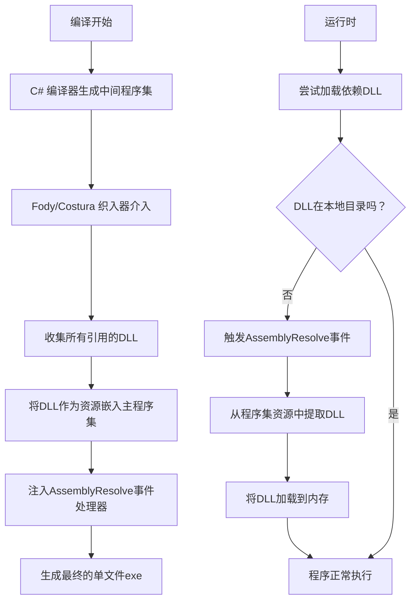
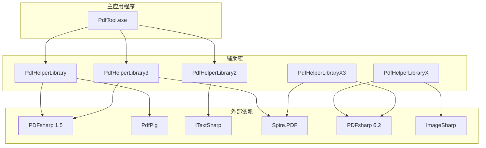

# 依赖管理

<cite>
**本文档中引用的文件**  
- [PdfTool.csproj](file://PdfTool/PdfTool.csproj)
- [FodyWeavers.xml](file://PdfTool/FodyWeavers.xml)
- [packages.config](file://PdfTool/packages.config)
- [PdfHelperLibrary.csproj](file://PdfHelperLibrary/PdfHelperLibrary.csproj)
- [packages.config](file://PdfHelperLibrary/packages.config)
- [PdfHelperLibrary2.csproj](file://PdfHelperLibrary2/PdfHelperLibrary2.csproj)
- [packages.config](file://PdfHelperLibrary2/packages.config)
- [PdfHelperLibrary3.csproj](file://PdfHelperLibrary3/PdfHelperLibrary3.csproj)
- [packages.config](file://PdfHelperLibrary3/packages.config)
- [PdfHelperLibraryX.csproj](file://PdfHelperLibraryX/PdfHelperLibraryX.csproj)
- [PdfHelperLibraryX3.csproj](file://PdfHelperLibraryX3/PdfHelperLibraryX3.csproj)
- [Common.cs](file://PdfTool/Common.cs)
</cite>

## 更新摘要
**已做更改**  
- 更新了“依赖冲突与版本升级策略”部分，新增关于 Microsoft 相关 NuGet 包从 9.x 升级至 10.0.0 的版本升级说明
- 在“核心依赖库分析”中补充了对 Microsoft.Bcl.HashCode 等基础包的依赖说明
- 更新了“依赖管理架构”部分，强调多项目中统一升级 Microsoft 包的策略
- 所有受影响的 section sources 已更新以反映实际文件引用

## 目录
1. [引言](#引言)
2. [依赖管理架构](#依赖管理架构)
3. [Costura 织入器与单文件发布](#costura-织入器与单文件发布)
4. [核心依赖库分析](#核心依赖库分析)
5. [项目依赖图谱](#项目依赖图谱)
6. [多版本辅助库的设计意图](#多版本辅助库的设计意图)
7. [依赖冲突与版本升级策略](#依赖冲突与版本升级策略)
8. [结论](#结论)

## 引言
PdfTool 是一个功能丰富的 PDF 处理工具，其依赖管理采用编译时代码织入技术，结合多个专用辅助库，实现了高度模块化和部署便捷性。本文档全面分析其依赖结构，重点阐述 Costura 织入器如何将所有第三方依赖嵌入主程序集，实现单文件发布，并解析多个 PdfHelperLibrary 变体的设计逻辑与协同机制。

## 依赖管理架构
PdfTool 的依赖管理采用分层设计：
- **应用层 (PdfTool)**：主应用程序，直接引用多个 PdfHelperLibrary 变体。
- **服务层 (PdfHelperLibrary*)**：多个独立的库项目，各自封装特定的 PDF 处理能力，并依赖不同的第三方库。
- **外部依赖层**：包括 PDFsharp、iTextSharp、Spire.PDF、PdfPig 等第三方 PDF 处理库。

这种架构通过将功能和依赖解耦，实现了技术栈的隔离和功能的灵活组合。近期，多个项目中的 Microsoft 相关 NuGet 包（如 `Microsoft.Bcl.HashCode`、`System.Memory`、`System.Buffers`）已从 9.x 版本统一升级至 10.0.0 版本，以提升性能并保持与现代 .NET 生态的兼容性。

**Section sources**
- [PdfTool.csproj](file://PdfTool/PdfTool.csproj#L179-L190)
- [PdfHelperLibrary.csproj](file://PdfHelperLibrary/PdfHelperLibrary.csproj#L35-L95)
- [PdfHelperLibrary2.csproj](file://PdfHelperLibrary2/PdfHelperLibrary2.csproj#L33-L48)

## Costura 织入器与单文件发布

### 工作原理
Costura 是一个 Fody 插件，它在编译后、程序集生成前的 MSBuild 目标阶段运行。其工作原理如下：
1.  **依赖收集**：Costura 分析项目的所有引用（包括直接和间接引用）。
2.  **资源嵌入**：将所有依赖的 DLL 文件作为 `Embedded Resource` 嵌入到主程序集（PdfTool.exe）中。
3.  **程序集解析**：织入器向主程序集注入一个 `AssemblyResolve` 事件处理器。当 .NET 运行时尝试加载一个未在 GAC 或应用程序目录中找到的程序集时，该处理器会被触发。
4.  **动态加载**：处理器从主程序集的资源中提取对应的 DLL 文件，并将其加载到内存中。

### 对部署简化的作用
通过 Costura，PdfTool 的发布不再需要分发一个包含主程序和多个 DLL 文件的文件夹。所有依赖都被打包进一个独立的 `.exe` 文件中，极大地简化了部署流程，避免了“DLL 地狱”问题，提高了软件的可移植性和用户体验。

**Diagram sources**
- [FodyWeavers.xml](file://PdfTool/FodyWeavers.xml#L1-L3)
- [PdfTool.csproj](file://PdfTool/PdfTool.csproj#L3-L4)
- [PdfTool.csproj](file://PdfTool/PdfTool.csproj#L196-L203)

**Section sources**
- [FodyWeavers.xml](file://PdfTool/FodyWeavers.xml#L1-L3)
- [PdfTool.csproj](file://PdfTool/PdfTool.csproj#L3-L4)
- [PdfTool.csproj](file://PdfTool/PdfTool.csproj#L196-L203)
- [packages.config](file://PdfTool/packages.config#L3-L4)

## 核心依赖库分析

### PdfHelperLibrary
这是最核心的辅助库，基于 **PDFsharp 1.50.5147** 和 **PdfPig 0.1.8** 构建。它提供了广泛的 PDF 操作功能，包括：
- **PDFsharp**：用于创建、修改、合并、拆分、添加水印和密封等操作。
- **PdfPig**：用于高精度的文本和表格提取。
该库还依赖多个 Microsoft 基础包，如 `Microsoft.Bcl.HashCode`、`System.Memory`、`System.Buffers` 和 `System.Runtime.CompilerServices.Unsafe`。这些包已从 9.x 版本升级至 10.0.0，以提升底层性能和安全性。

**Section sources**
- [PdfHelperLibrary.csproj](file://PdfHelperLibrary/PdfHelperLibrary.csproj#L36-L95)
- [packages.config](file://PdfHelperLibrary/packages.config#L3-L12)

### PdfHelperLibrary2
此库与 `PdfHelperLibrary` 并行存在，基于 **iTextSharp 5.5.13.4** 构建。其主要功能是 **PDF 修复**（RepairHelper）。iTextSharp 在处理损坏或非标准 PDF 文件方面有其独特优势，因此将其隔离在独立的库中，可以避免与主库的依赖发生冲突。

**Section sources**
- [PdfHelperLibrary2.csproj](file://PdfHelperLibrary2/PdfHelperLibrary2.csproj#L34-L39)
- [packages.config](file://PdfHelperLibrary2/packages.config#L3-L4)

### PdfHelperLibrary3
此库引入了商业库 **Spire.PDF 11.10.4**，主要用于高级的 **表格和文本处理**（TableHelper, TextHelper）。Spire.PDF 在表格识别和布局分析方面功能强大，但其许可证和依赖与开源库不同，因此通过独立的库进行隔离。

**Section sources**
- [PdfHelperLibrary3.csproj](file://PdfHelperLibrary3/PdfHelperLibrary3.csproj#L33-L42)
- [packages.config](file://PdfHelperLibrary3/packages.config#L3-L4)

### PdfHelperLibraryX 与 PdfHelperLibraryX3
这两个库代表了项目向现代 .NET 技术栈的演进：
- **PdfHelperLibraryX**：基于 **.NET 8.0**，使用新版 **PDFsharp 6.2.2**，并引入了 **ImageSharp** 用于图像处理。这表明项目在探索更高性能和现代化的图像处理能力。
- **PdfHelperLibraryX3**：同样基于 **.NET 8.0**，但同时引用了 **PDFsharp 6.2.2** 和 **Spire.PDF**，可能用于功能对比或集成测试。

**Section sources**
- [PdfHelperLibraryX.csproj](file://PdfHelperLibraryX/PdfHelperLibraryX.csproj#L1-L18)
- [PdfHelperLibraryX3.csproj](file://PdfHelperLibraryX3/PdfHelperLibraryX3.csproj#L1-L15)

## 项目依赖图谱

**Diagram sources**
- [PdfTool.csproj](file://PdfTool/PdfTool.csproj#L179-L190)
- [PdfHelperLibrary.csproj](file://PdfHelperLibrary/PdfHelperLibrary.csproj#L36-L95)
- [PdfHelperLibrary2.csproj](file://PdfHelperLibrary2/PdfHelperLibrary2.csproj#L34-L39)
- [PdfHelperLibrary3.csproj](file://PdfHelperLibrary3/PdfHelperLibrary3.csproj#L33-L42)
- [PdfHelperLibraryX.csproj](file://PdfHelperLibraryX/PdfHelperLibraryX.csproj#L1-L18)
- [PdfHelperLibraryX3.csproj](file://PdfHelperLibraryX3/PdfHelperLibraryX3.csproj#L1-L15)

## 多版本辅助库的设计意图
项目中存在 `PdfHelperLibrary`、`PdfHelperLibrary2`、`PdfHelperLibrary3`、`PdfHelperLibraryX` 等多个相似库，其设计意图是清晰的：
1.  **技术栈隔离**：不同的第三方库（PDFsharp, iTextSharp, Spire.PDF）有不同的许可证、性能特征和 API。将它们隔离在独立的库中，可以防止依赖冲突，便于独立升级和维护。
2.  **功能迭代与实验**：`PdfHelperLibraryX` 和 `PdfHelperLibraryX3` 明确指向了对 .NET 8.0 和新版 PDFsharp 的技术验证，是功能迭代的实验场。
3.  **模块化与可维护性**：每个库职责单一，代码库更小，更易于理解和测试。主程序 `PdfTool` 可以根据需要选择性地引用这些库，而无需承担所有库的依赖负担。
4.  **风险控制**：引入新的、不稳定的或商业库时，通过独立的库进行封装，可以将潜在的风险（如许可证问题、性能瓶颈）限制在局部，避免影响整个项目。

## 依赖冲突与版本升级策略

### 依赖冲突解决策略
- **物理隔离**：核心策略是使用独立的类库项目（如 `PdfHelperLibrary2`）来封装有冲突的依赖。由于每个库是独立编译的，它们的依赖不会在编译时直接冲突。
- **运行时隔离**：虽然 Costura 将所有 DLL 嵌入，但 .NET 的程序集加载器会根据版本号和强名称来区分不同的程序集。只要不同库引用的依赖版本不完全相同，通常可以共存。
- **统一升级**：对于同一技术栈（如 PDFsharp），应尽量统一版本。例如，`PdfHelperLibrary` 和 `PdfHelperLibrary3` 都使用了 `PDFsharp 1.50.5147`，这避免了同一库的版本冲突。

### 版本升级指南
1.  **评估影响**：升级任何第三方库前，必须在对应的 `PdfHelperLibrary*` 项目中进行充分测试，确保所有功能正常。
2.  **独立升级**：优先在实验性库（如 `PdfHelperLibraryX`）中尝试新版本，验证无误后再考虑迁移到主库。
3.  **更新配置**：修改 `.csproj` 文件中的 `PackageReference` 或 `packages.config` 文件中的版本号。
4.  **重新编译**：重新编译被修改的辅助库项目。
5.  **集成测试**：在 `PdfTool` 主项目中引用更新后的辅助库，并进行全面的功能测试。
6.  **文档记录**：记录版本变更和升级原因。
7.  **Microsoft 包统一升级**：对于 `Microsoft.Bcl.HashCode`、`System.Memory`、`System.Buffers` 等跨多个项目的 Microsoft 基础包，应统一从 9.x 升级至 10.0.0 版本，确保所有项目依赖一致性，避免潜在的运行时冲突。升级时需确保目标框架（如 .NET Framework 4.7.2）兼容新版本。

**Section sources**
- [PdfHelperLibrary.csproj](file://PdfHelperLibrary/PdfHelperLibrary.csproj#L36-L95)
- [PdfHelperLibrary2.csproj](file://PdfHelperLibrary2/PdfHelperLibrary2.csproj#L34-L39)
- [PdfHelperLibraryX.csproj](file://PdfHelperLibraryX/PdfHelperLibraryX.csproj#L1-L18)
- [packages.config](file://PdfHelperLibrary/packages.config#L3)
- [packages.config](file://ExcelTool/packages.config#L3)
- [packages.config](file://InvoiceExtractor/packages.config#L3)

## 结论
PdfTool 的依赖管理是一个精心设计的系统。通过 **Costura 织入器**，它实现了完美的单文件发布体验。通过构建多个 **专用的 PdfHelperLibrary 变体**，它成功地将不同的技术栈和功能模块进行了解耦和隔离，既保证了功能的丰富性，又维护了系统的稳定性和可维护性。近期对 Microsoft 相关 NuGet 包的统一升级至 10.0.0 版本，进一步增强了基础依赖的性能与安全性。这种架构为未来的功能扩展和技术升级提供了坚实的基础。建议在未来的开发中，继续遵循这种模块化的设计原则，并建立规范的依赖升级流程。