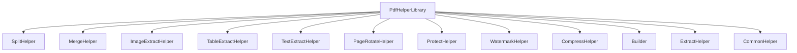
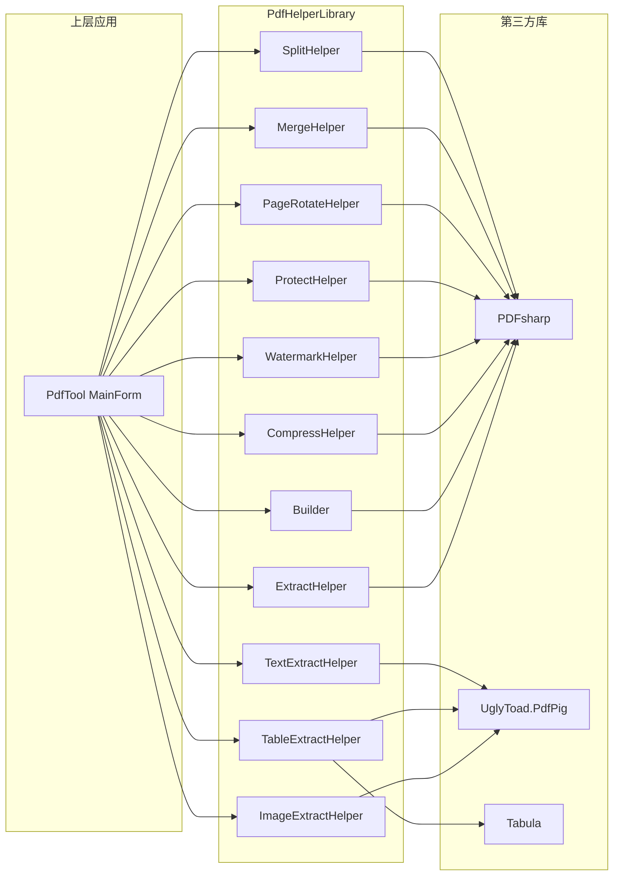
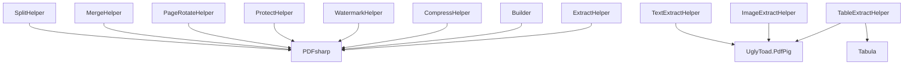

# PdfHelperLibrary 核心库

<cite>
**本文档中引用的文件**  
- [PdfHelperLibrary.csproj](file://PdfHelperLibrary/PdfHelperLibrary.csproj)
- [CommonHelper.cs](file://PdfHelperLibrary/CommonHelper.cs)
- [SplitHelper.cs](file://PdfHelperLibrary/SplitHelper.cs)
- [MergeHelper.cs](file://PdfHelperLibrary/MergeHelper.cs)
- [ImageExtractHelper.cs](file://PdfHelperLibrary/ImageExtractHelper.cs)
- [TableExtractHelper.cs](file://PdfHelperLibrary/TableExtractHelper.cs)
- [TextExtractHelper.cs](file://PdfHelperLibrary/TextExtractHelper.cs)
- [PageRotateHelper.cs](file://PdfHelperLibrary/PageRotateHelper.cs)
- [ProtectHelper.cs](file://PdfHelperLibrary/ProtectHelper.cs)
- [WatermarkHelper.cs](file://PdfHelperLibrary/WatermarkHelper.cs)
- [CompressHelper.cs](file://PdfHelperLibrary/CompressHelper.cs)
- [Builder.cs](file://PdfHelperLibrary/Builder.cs)
- [ExtractHelper.cs](file://PdfHelperLibrary/ExtractHelper.cs)
- [MainForm.cs](file://PdfTool/MainForm.cs)
- [Program.cs](file://PdfConsoleApp/Program.cs)
</cite>

## 目录
1. [简介](#简介)
2. [项目结构](#项目结构)
3. [核心功能与依赖](#核心功能与依赖)
4. [核心组件分析](#核心组件分析)
5. [架构概览](#架构概览)
6. [详细组件分析](#详细组件分析)
7. [依赖分析](#依赖分析)
8. [性能考虑](#性能考虑)
9. [故障排除指南](#故障排除指南)
10. [结论](#结论)

## 简介
PdfHelperLibrary 是一个基于 .NET Framework 4.7.2 构建的核心库，作为 PdfTool 主程序的主要依赖，提供了一系列针对 PDF 文档的处理功能。该库通过封装复杂的底层操作，为上层应用提供了简洁、易用的静态方法接口。其核心功能包括 PDF 拆分、合并、图像提取、表格提取、文本提取、页面旋转和文档保护等。本文档将深入分析其实现机制、依赖关系、职责划分以及在实际业务中的集成方式。

## 项目结构
PdfHelperLibrary 项目位于 `PdfHelperLibrary` 目录下，采用模块化的类库设计。其结构清晰，每个功能模块由一个独立的 Helper 类负责，所有 Helper 类均声明为静态类，通过静态方法对外提供服务。这种设计模式简化了调用方的使用，无需实例化即可直接调用所需功能。

**图示来源**
- [PdfHelperLibrary.csproj](file://PdfHelperLibrary/PdfHelperLibrary.csproj#L97-L113)

**本节来源**
- [PdfHelperLibrary.csproj](file://PdfHelperLibrary/PdfHelperLibrary.csproj#L1-L127)

## 核心功能与依赖
PdfHelperLibrary 的功能实现依赖于多个第三方库，这些库各司其职，共同完成了对 PDF 文档的解析与操作。

### 核心第三方依赖
1.  **PDFsharp 1.5**: 用于 PDF 文档的创建、修改和基本操作。该库提供了 `PdfDocument`、`PdfPage` 等核心类，是实现 PDF 拆分、合并、旋转、水印、压缩等修改类功能的基础。
2.  **UglyToad.PdfPig**: 用于高精度的 PDF 内容解析。该库能够准确地提取 PDF 中的文本内容和布局信息，是 `TextExtractHelper` 和 `TableExtractHelper` 的核心依赖。
3.  **Tabula**: 专门用于从 PDF 中提取表格数据。它与 UglyToad.PdfPig 配合使用，利用其解析出的布局信息，通过特定的算法（如 `SpreadsheetExtractionAlgorithm`）来识别和重构表格结构。

这些依赖在 `PdfHelperLibrary.csproj` 文件中被明确引用，确保了库的功能完整性。

**本节来源**
- [PdfHelperLibrary.csproj](file://PdfHelperLibrary/PdfHelperLibrary.csproj#L43-L94)

## 核心组件分析
PdfHelperLibrary 将不同的 PDF 操作职责划分到多个 Helper 类中，每个类专注于一个特定的功能领域，体现了高内聚、低耦合的设计原则。

**本节来源**
- [CommonHelper.cs](file://PdfHelperLibrary/CommonHelper.cs#L9-L27)
- [SplitHelper.cs](file://PdfHelperLibrary/SplitHelper.cs#L11-L69)
- [MergeHelper.cs](file://PdfHelperLibrary/MergeHelper.cs#L14-L74)
- [ImageExtractHelper.cs](file://PdfHelperLibrary/ImageExtractHelper.cs#L15-L181)
- [TableExtractHelper.cs](file://PdfHelperLibrary/TableExtractHelper.cs#L13-L105)
- [TextExtractHelper.cs](file://PdfHelperLibrary/TextExtractHelper.cs#L9-L34)
- [PageRotateHelper.cs](file://PdfHelperLibrary/PageRotateHelper.cs#L12-L94)
- [ProtectHelper.cs](file://PdfHelperLibrary/ProtectHelper.cs#L10-L68)
- [WatermarkHelper.cs](file://PdfHelperLibrary/WatermarkHelper.cs#L20-L159)
- [CompressHelper.cs](file://PdfHelperLibrary/CompressHelper.cs#L13-L32)
- [Builder.cs](file://PdfHelperLibrary/Builder.cs#L15-L55)
- [ExtractHelper.cs](file://PdfHelperLibrary/ExtractHelper.cs#L12-L76)

## 架构概览
PdfHelperLibrary 的整体架构是一个典型的静态工具库模式。上层应用（如 PdfTool）通过直接调用 Helper 类的静态方法来执行 PDF 操作。这些方法内部协调使用 PDFsharp、UglyToad.PdfPig 和 Tabula 等第三方库来完成具体任务。

**图示来源**
- [PdfHelperLibrary.csproj](file://PdfHelperLibrary/PdfHelperLibrary.csproj#L43-L94)
- [SplitHelper.cs](file://PdfHelperLibrary/SplitHelper.cs#L13-L30)
- [TextExtractHelper.cs](file://PdfHelperLibrary/TextExtractHelper.cs#L11-L32)

## 详细组件分析
本节将对各个核心 Helper 类进行深入分析，阐述其具体职责和实现方式。

### 功能职责划分
PdfHelperLibrary 通过多个 Helper 类实现了功能的清晰划分：

-   **SplitHelper**: 负责 PDF 拆分，支持按单页拆分和按指定页数拆分。
-   **MergeHelper**: 负责 PDF 合并，支持将多个 PDF 文件合并为一个，并可选择性地添加书签。
-   **ImageExtractHelper**: 负责从 PDF 中提取嵌入的图像，支持 JPEG、PNG、CCITT Fax 等多种格式。
-   **TableExtractHelper**: 负责从 PDF 中提取表格数据，利用 Tabula 库进行表格识别和结构化输出。
-   **TextExtractHelper**: 负责从 PDF 中提取纯文本内容，利用 UglyToad.PdfPig 进行高精度文本解析。
-   **PageRotateHelper**: 负责 PDF 页面的旋转，支持对所有页面或指定页面进行旋转。
-   **ProtectHelper**: 负责 PDF 文档的保护与解密，可以设置密码和访问权限。
-   **WatermarkHelper**: 负责为 PDF 添加文本水印。
-   **CompressHelper**: 负责压缩 PDF 文件大小。
-   **Builder**: 负责从图像文件创建 PDF，或向现有 PDF 中插入图像。
-   **ExtractHelper**: 负责提取 PDF 的指定页面范围或删除指定页面。
-   **CommonHelper**: 提供通用功能，如获取 PDF 的页数。

这种职责划分使得代码易于维护和扩展。

**本节来源**
- [SplitHelper.cs](file://PdfHelperLibrary/SplitHelper.cs#L11-L69)
- [MergeHelper.cs](file://PdfHelperLibrary/MergeHelper.cs#L14-L74)
- [ImageExtractHelper.cs](file://PdfHelperLibrary/ImageExtractHelper.cs#L15-L181)
- [TableExtractHelper.cs](file://PdfHelperLibrary/TableExtractHelper.cs#L13-L105)
- [TextExtractHelper.cs](file://PdfHelperLibrary/TextExtractHelper.cs#L9-L34)
- [PageRotateHelper.cs](file://PdfHelperLibrary/PageRotateHelper.cs#L12-L94)
- [ProtectHelper.cs](file://PdfHelperLibrary/ProtectHelper.cs#L10-L68)
- [WatermarkHelper.cs](file://PdfHelperLibrary/WatermarkHelper.cs#L20-L159)
- [CompressHelper.cs](file://PdfHelperLibrary/CompressHelper.cs#L13-L32)
- [Builder.cs](file://PdfHelperLibrary/Builder.cs#L15-L55)
- [ExtractHelper.cs](file://PdfHelperLibrary/ExtractHelper.cs#L12-L76)
- [CommonHelper.cs](file://PdfHelperLibrary/CommonHelper.cs#L9-L27)

### 静态方法封装
所有 Helper 类均采用 `static` 关键字定义，其方法也均为静态方法。这种设计模式有以下优点：
1.  **简化调用**: 调用方无需创建实例，可以直接通过 `类名.方法名()` 的方式调用，例如 `SplitHelper.SplitPdf("input.pdf")`。
2.  **无状态**: 静态方法通常不维护内部状态，每次调用都是独立的，这使得它们是线程安全的（前提是不操作共享的静态字段）。
3.  **工具类定位**: 明确了这些类作为“工具”的定位，它们提供的是可复用的功能，而不是代表某个实体对象。

```mermaid
classDiagram
class SplitHelper {
+static void SplitPdf(string inputPdfFileName)
+static string SplitPdf(string inputPdfFileName, int pageCountPerDoc)
}
class MergeHelper {
+static string MergePdf(List<string> inputPdfFilenameList, bool autoOpen, bool addBookmarks, out string outputPdfFilename)
+static (string, string) MergePdf(List<string> inputPdfFilenameList, bool autoOpen, bool addBookmarks, string outputPdfFilename)
}
class TextExtractHelper {
+static List<string> ExtractText(string inputPdfFileName)
}
class PageRotateHelper {
+static string RotatePdf(string inputFilePath, out string outputFilePath, int rotationAngle)
+static string RotatePdf(string inputFilePath, out string outputFilePath, int rotationAngle, List<int> pageNums)
+static string RotatePdf(string inputFilePath, string outputFilePath, Dictionary<int, int> pageRotateDict)
}
class ProtectHelper {
+static string Protect(string inputPdfFileName, string outputPdfFileName, string password)
+static string Unprotect(string inputPdfFileName, string outputPdfFileName, string password)
}
SplitHelper --> "uses" PdfSharp
MergeHelper --> "uses" PdfSharp
TextExtractHelper --> "uses" UglyToad.PdfPig
PageRotateHelper --> "uses" PdfSharp
ProtectHelper --> "uses" PdfSharp
```

**图示来源**
- [SplitHelper.cs](file://PdfHelperLibrary/SplitHelper.cs#L11-L69)
- [MergeHelper.cs](file://PdfHelperLibrary/MergeHelper.cs#L14-L74)
- [TextExtractHelper.cs](file://PdfHelperLibrary/TextExtractHelper.cs#L9-L34)
- [PageRotateHelper.cs](file://PdfHelperLibrary/PageRotateHelper.cs#L12-L94)
- [ProtectHelper.cs](file://PdfHelperLibrary/ProtectHelper.cs#L10-L68)

## 依赖分析
PdfHelperLibrary 的内部组件之间耦合度较低，主要通过 .NET Framework 的基础类型（如 `string`, `List<T>`, `Dictionary<K,V>`）进行数据交换。其主要的依赖关系体现在对第三方库的使用上。

**图示来源**
- [PdfHelperLibrary.csproj](file://PdfHelperLibrary/PdfHelperLibrary.csproj#L43-L94)
- [SplitHelper.cs](file://PdfHelperLibrary/SplitHelper.cs#L1-L69)
- [TextExtractHelper.cs](file://PdfHelperLibrary/TextExtractHelper.cs#L1-L34)
- [TableExtractHelper.cs](file://PdfHelperLibrary/TableExtractHelper.cs#L1-L105)

**本节来源**
- [PdfHelperLibrary.csproj](file://PdfHelperLibrary/PdfHelperLibrary.csproj#L36-L94)

## 性能考虑
在使用 PdfHelperLibrary 时，应注意以下性能方面的考虑：
1.  **大文件处理**: 对于非常大的 PDF 文件，内存消耗可能会很高，尤其是在合并或提取大量内容时。建议在处理前评估文件大小，并在必要时考虑分批处理。
2.  **资源释放**: 库内部使用了 `using` 语句来确保 `PdfDocument` 等非托管资源被及时释放，这是良好的实践。调用方也应确保传入的文件路径有效，并在操作完成后释放相关资源。
3.  **I/O 操作**: 所有操作都涉及文件读写，磁盘 I/O 是主要的性能瓶颈。使用高速 SSD 可以显著提升处理速度。
4.  **第三方库性能**: 表格提取（Tabula）和文本提取（UglyToad.PdfPig）的性能取决于 PDF 的复杂程度。复杂的布局和大量的文本会增加解析时间。

## 故障排除指南
PdfHelperLibrary 在设计时考虑了异常处理，大多数方法都采用了 `try-catch` 块来捕获潜在的异常，并返回描述性的错误信息字符串。

-   **文件访问错误**: 确保输入文件路径正确，文件未被其他程序占用，且调用程序具有读写权限。
-   **PDF 格式错误**: 如果 PDF 文件已损坏，`PdfReader.Open()` 方法会抛出 `PdfReaderException`。`CommonHelper.GetPageCount()` 方法对此进行了封装。
-   **内存不足**: 处理超大文件时可能会出现 `OutOfMemoryException`。应监控系统内存使用情况。
-   **第三方库兼容性**: 确保 `packages.config` 中指定的第三方库版本与项目兼容，并已正确安装。

**本节来源**
- [CommonHelper.cs](file://PdfHelperLibrary/CommonHelper.cs#L13-L25)
- [SplitHelper.cs](file://PdfHelperLibrary/SplitHelper.cs#L39-L66)
- [MergeHelper.cs](file://PdfHelperLibrary/MergeHelper.cs#L37-L41)
- [ImageExtractHelper.cs](file://PdfHelperLibrary/ImageExtractHelper.cs#L42-L45)

## 结论
PdfHelperLibrary 是一个设计良好、功能全面的 PDF 处理库。它通过清晰的职责划分和静态方法封装，为上层应用提供了简洁而强大的 API。其对 PDFsharp、UglyToad.PdfPig 和 Tabula 等成熟第三方库的有效整合，确保了核心功能的稳定性和准确性。在实际应用中，如 PdfTool 项目所示，开发者可以轻松地集成该库，快速实现复杂的 PDF 操作需求。遵循其设计模式和异常处理策略，可以构建出健壮且高效的 PDF 处理应用程序。