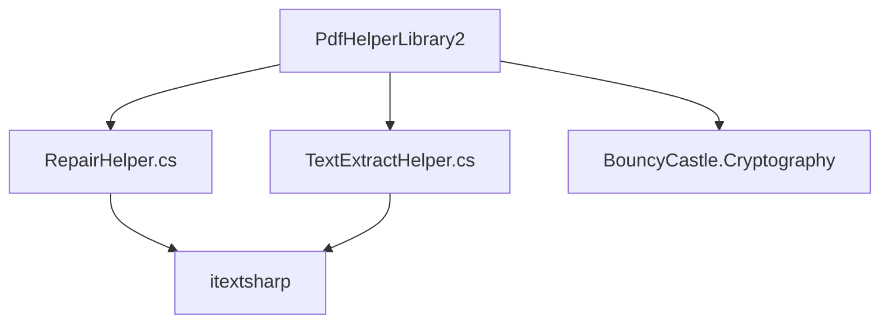
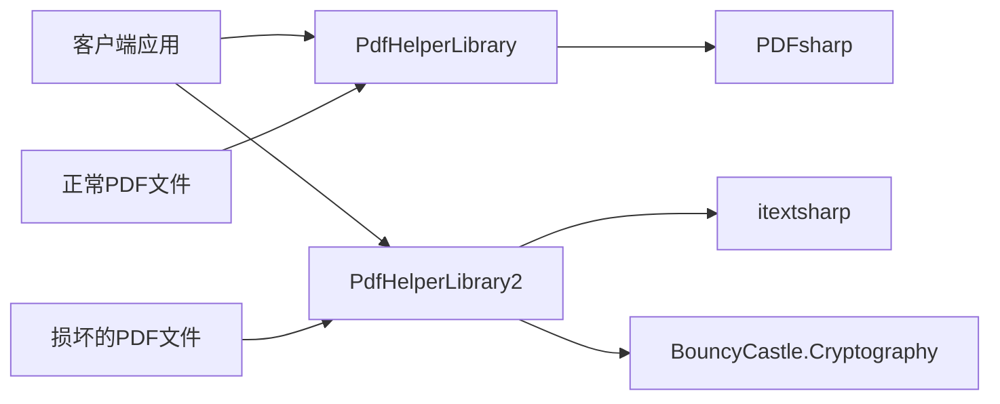
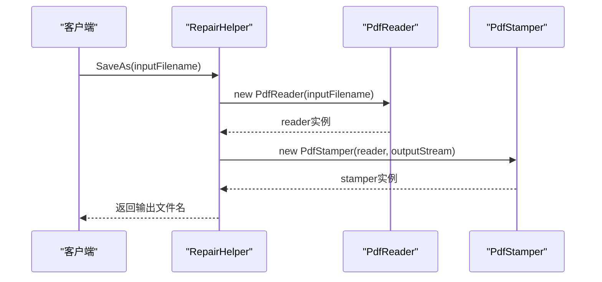
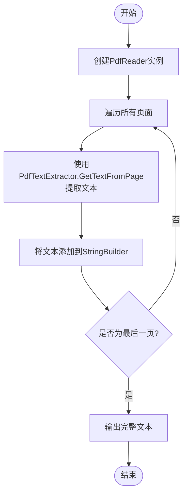
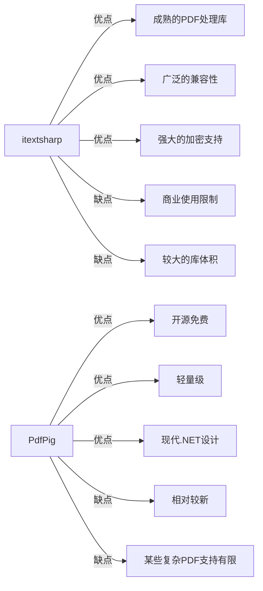
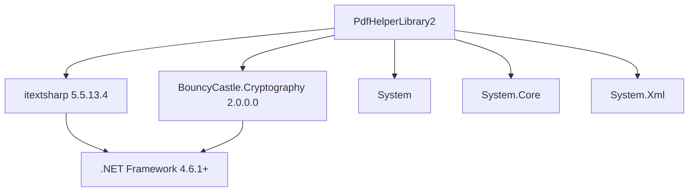

# PdfHelperLibrary2 专用库

<cite>
**本文档引用的文件**
- [PdfHelperLibrary2.csproj](file://PdfHelperLibrary2/PdfHelperLibrary2.csproj)
- [RepairHelper.cs](file://PdfHelperLibrary2/RepairHelper.cs)
- [TextExtractHelper.cs](file://PdfHelperLibrary2/TextExtractHelper.cs)
- [PdfHelperLibrary.csproj](file://PdfHelperLibrary/PdfHelperLibrary.csproj)
- [TextExtractHelper.cs](file://PdfHelperLibrary/TextExtractHelper.cs)
- [PdfHelperLibraryX.csproj](file://PdfHelperLibraryX/PdfHelperLibraryX.csproj)
- [TextExtractHelper.cs](file://PdfHelperLibraryX/TextExtractHelper.cs)
- [PdfRepairer.cs](file://PdfTool/PdfRepairer.cs)
</cite>

## 目录
1. [简介](#简介)
2. [项目结构](#项目结构)
3. [核心组件](#核心组件)
4. [架构概述](#架构概述)
5. [详细组件分析](#详细组件分析)
6. [依赖分析](#依赖分析)
7. [性能考虑](#性能考虑)
8. [故障排除指南](#故障排除指南)
9. [结论](#结论)

## 简介
PdfHelperLibrary2 是一个专门针对PDF文件修复和特定场景文本提取的专用库。该库基于.NET Framework 4.7.2，采用itextsharp和BouncyCastle.Cryptography作为核心技术栈，旨在解决主库PdfHelperLibrary在处理损坏PDF文件和特定文本提取场景时的局限性。通过隔离高风险操作和避免主库依赖污染，PdfHelperLibrary2为特定客户环境提供了更好的兼容性支持。

## 项目结构
PdfHelperLibrary2项目结构简洁明了，专注于PDF修复和文本提取两大核心功能。项目包含两个主要功能文件：RepairHelper.cs用于PDF文件修复，TextExtractHelper.cs用于文本提取。该库通过引用itextsharp和BouncyCastle.Cryptography实现了对PDF底层结构的操作能力。

**图示来源**
- [PdfHelperLibrary2.csproj](file://PdfHelperLibrary2/PdfHelperLibrary2.csproj#L33-L39)
- [RepairHelper.cs](file://PdfHelperLibrary2/RepairHelper.cs#L1-L40)
- [TextExtractHelper.cs](file://PdfHelperLibrary2/TextExtractHelper.cs#L1-L31)

**本节来源**
- [PdfHelperLibrary2.csproj](file://PdfHelperLibrary2/PdfHelperLibrary2.csproj#L1-L58)
- [RepairHelper.cs](file://PdfHelperLibrary2/RepairHelper.cs#L1-L40)
- [TextExtractHelper.cs](file://PdfHelperLibrary2/TextExtractHelper.cs#L1-L31)

## 核心组件
PdfHelperLibrary2的核心组件包括RepairHelper和TextExtractHelper两个静态类，分别负责PDF文件修复和文本提取功能。RepairHelper利用itextsharp的底层API对损坏的PDF文件进行结构修复，而TextExtractHelper则专注于特定场景下的文本提取需求。

**本节来源**
- [RepairHelper.cs](file://PdfHelperLibrary2/RepairHelper.cs#L1-L40)
- [TextExtractHelper.cs](file://PdfHelperLibrary2/TextExtractHelper.cs#L1-L31)

## 架构概述
PdfHelperLibrary2的架构设计体现了单一职责原则，将高风险的PDF修复操作与主库分离。该库基于itextsharp构建，充分利用了其对PDF底层结构的强大操作能力，同时通过BouncyCastle.Cryptography支持加密PDF文件的处理。这种架构设计使得主库PdfHelperLibrary能够保持稳定，而特定的修复和提取需求则由专用库处理。

**图示来源**
- [PdfHelperLibrary2.csproj](file://PdfHelperLibrary2/PdfHelperLibrary2.csproj#L33-L39)
- [PdfHelperLibrary.csproj](file://PdfHelperLibrary/PdfHelperLibrary.csproj#L33-L48)

## 详细组件分析

### RepairHelper 分析
RepairHelper类提供了对损坏PDF文件的修复功能。通过使用itextsharp的PdfReader和PdfStamper类，该组件能够读取损坏的PDF文件并创建一个新的、结构完整的PDF文件。这种方法可以修复由于文件传输中断、存储介质损坏等原因导致的PDF文件结构问题。

**图示来源**
- [RepairHelper.cs](file://PdfHelperLibrary2/RepairHelper.cs#L12-L37)

**本节来源**
- [RepairHelper.cs](file://PdfHelperLibrary2/RepairHelper.cs#L1-L40)

### TextExtractHelper 分析
TextExtractHelper类提供了基于itextsharp的文本提取功能。与主库中使用PdfPig引擎的TextExtractHelper相比，该实现利用了itextsharp的文本提取能力，可能在某些特定场景下提供更好的文本抽取精度。

**图示来源**
- [TextExtractHelper.cs](file://PdfHelperLibrary2/TextExtractHelper.cs#L16-L28)

**本节来源**
- [TextExtractHelper.cs](file://PdfHelperLibrary2/TextExtractHelper.cs#L1-L31)

### TextExtractHelper 实现差异对比
PdfHelperLibrary2中的TextExtractHelper与主库PdfHelperLibrary中的同名类存在显著差异，主要体现在所使用的PDF解析引擎上。PdfHelperLibrary2使用itextsharp，而主库使用PdfPig。这种差异导致了在文本抽取精度、性能和兼容性方面的不同权衡。

**图示来源**
- [TextExtractHelper.cs](file://PdfHelperLibrary2/TextExtractHelper.cs#L1-L31)
- [TextExtractHelper.cs](file://PdfHelperLibrary/TextExtractHelper.cs#L1-L35)
- [TextExtractHelper.cs](file://PdfHelperLibraryX/TextExtractHelper.cs#L1-L34)

**本节来源**
- [TextExtractHelper.cs](file://PdfHelperLibrary2/TextExtractHelper.cs#L1-L31)
- [TextExtractHelper.cs](file://PdfHelperLibrary/TextExtractHelper.cs#L1-L35)

## 依赖分析
PdfHelperLibrary2的依赖关系清晰明确，主要依赖itextsharp和BouncyCastle.Cryptography两个核心库。这种精简的依赖结构有助于减少依赖冲突，提高库的稳定性和可维护性。

**图示来源**
- [PdfHelperLibrary2.csproj](file://PdfHelperLibrary2/PdfHelperLibrary2.csproj#L33-L47)

**本节来源**
- [PdfHelperLibrary2.csproj](file://PdfHelperLibrary2/PdfHelperLibrary2.csproj#L1-L58)

## 性能考虑
PdfHelperLibrary2在性能方面需要考虑几个关键因素。首先，itextsharp作为成熟的PDF处理库，在处理复杂PDF文件时表现出良好的性能，但其较大的库体积可能影响应用程序的启动时间。其次，PDF修复操作涉及完整的文件读写过程，对于大型PDF文件可能需要较长时间。最后，文本提取的性能取决于PDF文件的复杂程度和页面数量。

## 故障排除指南
当使用PdfHelperLibrary2遇到问题时，可以参考以下常见问题的解决方案：

**本节来源**
- [RepairHelper.cs](file://PdfHelperLibrary2/RepairHelper.cs#L33-L36)
- [PdfRepairer.cs](file://PdfTool/PdfRepairer.cs#L40-L43)

## 结论
PdfHelperLibrary2作为一个专用库，成功实现了将高风险的PDF修复操作与主库分离的设计目标。通过采用itextsharp和BouncyCastle.Cryptography技术栈，该库在处理损坏PDF文件和特定文本提取场景方面表现出色。其独立的组件设计不仅隔离了潜在的风险，避免了主库的依赖污染，还为特定客户环境提供了更好的兼容性支持。与主库中使用PdfPig引擎的实现相比，itextsharp在某些场景下可能提供更好的文本抽取精度和兼容性，尽管需要考虑其商业使用限制。总体而言，PdfHelperLibrary2的设计体现了良好的架构分离原则，为复杂的PDF处理需求提供了可靠的解决方案。