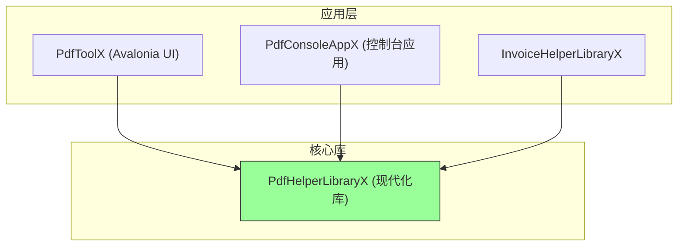
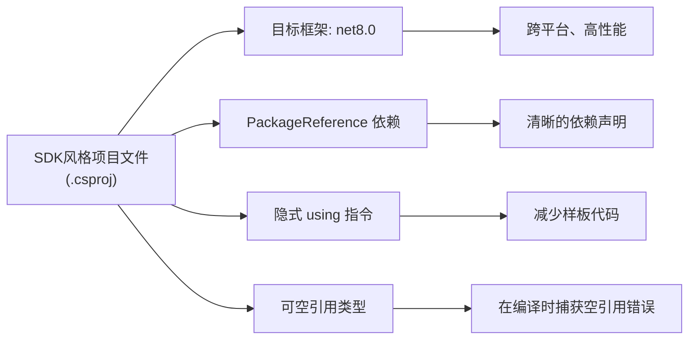
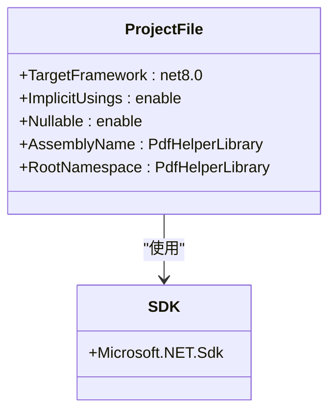
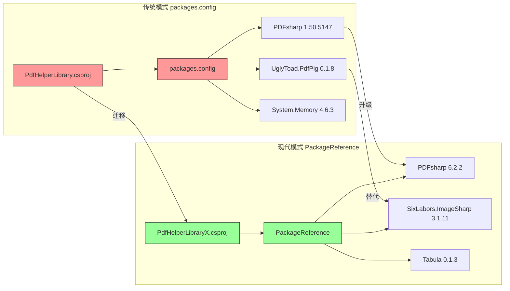
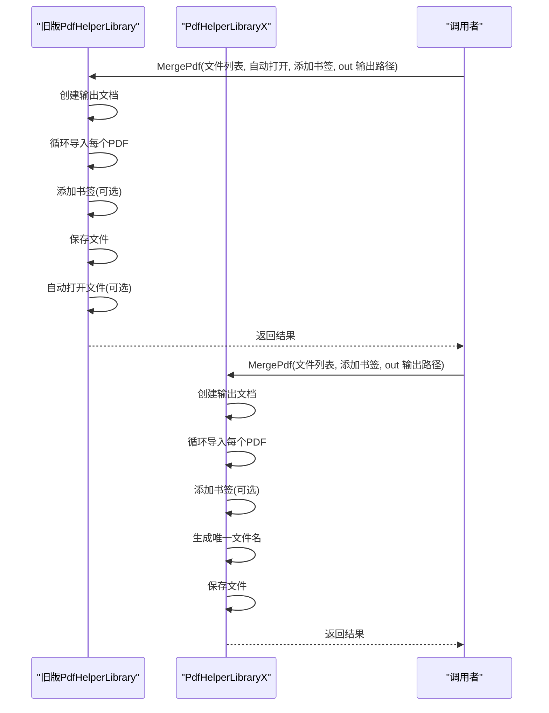
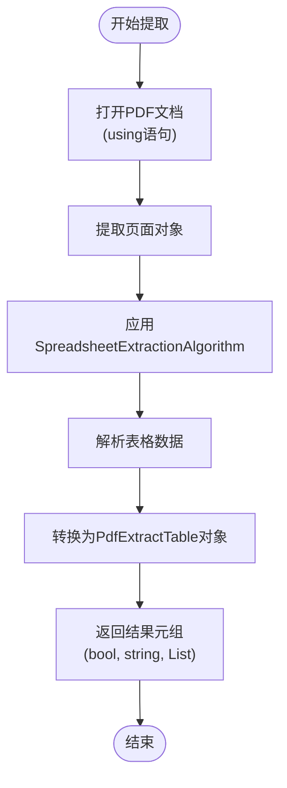
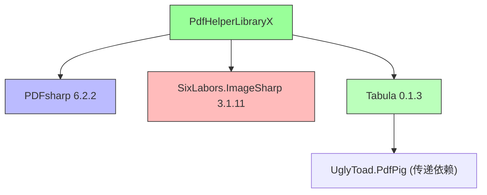

# PdfHelperLibraryX 现代化库

<cite>
**本文档引用的文件**  
- [PdfHelperLibraryX.csproj](file://PdfHelperLibraryX/PdfHelperLibraryX.csproj)
- [PdfHelperLibrary.csproj](file://PdfHelperLibrary/PdfHelperLibrary.csproj)
- [PdfToolX.csproj](file://PdfToolX/PdfToolX.csproj)
- [PdfConsoleAppX.csproj](file://PdfConsoleAppX/PdfConsoleAppX.csproj)
- [CommonHelper.cs](file://PdfHelperLibraryX/CommonHelper.cs)
- [ImageHelper.cs](file://PdfHelperLibraryX/ImageHelper.cs)
- [MergeHelper.cs](file://PdfHelperLibraryX/MergeHelper.cs)
- [TableExtractHelper.cs](file://PdfHelperLibraryX/TableExtractHelper.cs)
</cite>

## 目录
1. [引言](#引言)
2. [项目结构](#项目结构)
3. [核心组件](#核心组件)
4. [架构概述](#架构概述)
5. [详细组件分析](#详细组件分析)
6. [依赖分析](#依赖分析)
7. [性能考量](#性能考量)
8. [故障排除指南](#故障排除指南)
9. [结论](#结论)

## 引言
PdfHelperLibraryX 是项目现代化演进中的关键组件，标志着从传统 .NET Framework 向现代 .NET 8.0 平台迁移的战略方向。该库采用 SDK 风格的 csproj 文件和 PackageReference 依赖管理模式，体现了项目在依赖管理、构建效率和代码质量方面的全面提升。通过引入 PDFsharp 6.2.2 和 SixLabors.ImageSharp 等现代化库，PdfHelperLibraryX 在性能、安全性和功能上相较于旧版库有显著提升。本文档将系统阐述其技术优势、架构特点以及作为未来主库替代者的潜力。

## 项目结构
PdfHelperLibraryX 项目位于仓库根目录下，是多个工具项目（如 PdfToolX、PdfConsoleAppX）的核心依赖。其结构简洁，专注于提供 PDF 处理的核心功能，不包含任何用户界面或配置文件，体现了高内聚、低耦合的设计原则。

**图示来源**  
- [PdfHelperLibraryX.csproj](file://PdfHelperLibraryX/PdfHelperLibraryX.csproj)
- [PdfToolX.csproj](file://PdfToolX/PdfToolX.csproj)
- [PdfConsoleAppX.csproj](file://PdfConsoleAppX/PdfConsoleAppX.csproj)

**本节来源**  
- [PdfHelperLibraryX](file://PdfHelperLibraryX)
- [PdfToolX](file://PdfToolX)
- [PdfConsoleAppX](file://PdfConsoleAppX)

## 核心组件
PdfHelperLibraryX 的核心组件包括 `CommonHelper`、`ImageHelper`、`MergeHelper` 和 `TableExtractHelper` 等静态工具类，提供了获取页数、合并 PDF、提取表格等关键功能。与旧版库相比，其代码更加简洁，错误处理逻辑更清晰，并且通过现代化的 .NET 特性提升了代码的健壮性。

**本节来源**  
- [CommonHelper.cs](file://PdfHelperLibraryX/CommonHelper.cs)
- [ImageHelper.cs](file://PdfHelperLibraryX/ImageHelper.cs)
- [MergeHelper.cs](file://PdfHelperLibraryX/MergeHelper.cs)
- [TableExtractHelper.cs](file://PdfHelperLibraryX/TableExtractHelper.cs)

## 架构概述
PdfHelperLibraryX 采用现代化的 .NET 库架构，其核心特征是使用 SDK 风格的项目文件（`.csproj`），这与旧版库使用的传统项目文件格式形成鲜明对比。这种架构简化了项目配置，将大部分默认设置封装在 SDK 内部，开发者只需关注关键属性。

**图示来源**  
- [PdfHelperLibraryX.csproj](file://PdfHelperLibraryX/PdfHelperLibraryX.csproj)

## 详细组件分析

### 核心特性分析
PdfHelperLibraryX 的现代化特性主要体现在其项目配置和依赖管理上。

#### 项目文件与目标框架

**图示来源**  
- [PdfHelperLibraryX.csproj](file://PdfHelperLibraryX/PdfHelperLibraryX.csproj#L1-L9)

#### 依赖管理对比

**图示来源**  
- [PdfHelperLibrary.csproj](file://PdfHelperLibrary/PdfHelperLibrary.csproj#L36-L95)
- [PdfHelperLibraryX.csproj](file://PdfHelperLibraryX/PdfHelperLibraryX.csproj#L11-L15)

### 功能模块分析
#### 合并功能对比

**图示来源**  
- [MergeHelper.cs](file://PdfHelperLibrary/MergeHelper.cs#L16-L74)
- [MergeHelper.cs](file://PdfHelperLibraryX/MergeHelper.cs#L11-L38)

#### 表格提取功能

**图示来源**  
- [TableExtractHelper.cs](file://PdfHelperLibraryX/TableExtractHelper.cs#L12-L84)

**本节来源**  
- [PdfHelperLibraryX.csproj](file://PdfHelperLibraryX/PdfHelperLibraryX.csproj)
- [MergeHelper.cs](file://PdfHelperLibraryX/MergeHelper.cs)
- [TableExtractHelper.cs](file://PdfHelperLibraryX/TableExtractHelper.cs)
- [PdfHelperLibrary.csproj](file://PdfHelperLibrary/PdfHelperLibrary.csproj)
- [MergeHelper.cs](file://PdfHelperLibrary/MergeHelper.cs)

## 依赖分析
PdfHelperLibraryX 的依赖关系清晰且现代化。它直接通过 `PackageReference` 声明了对 `PDFsharp`、`SixLabors.ImageSharp` 和 `Tabula` 的依赖。这种模式相较于旧版库中通过 `packages.config` 和大量 `<Reference>` 标签管理依赖的方式，具有显著优势：依赖声明集中、版本控制更精确、包还原更高效，并且避免了“DLL地狱”问题。

**图示来源**  
- [PdfHelperLibraryX.csproj](file://PdfHelperLibraryX/PdfHelperLibraryX.csproj#L11-L15)

**本节来源**  
- [PdfHelperLibraryX.csproj](file://PdfHelperLibraryX/PdfHelperLibraryX.csproj)

## 性能考量
采用 .NET 8.0 目标框架为 PdfHelperLibraryX 带来了显著的性能优势。.NET 8.0 作为长期支持（LTS）版本，包含了最新的运行时优化、JIT 编译器改进和垃圾回收器增强，能够提供更快的执行速度和更低的内存占用。此外，依赖的 PDFsharp 6.2.2 版本相较于旧版 1.50.5147，在 PDF 渲染、文本提取和内存管理方面进行了大量优化，进一步提升了处理大型 PDF 文件时的性能和稳定性。

## 故障排除指南
当使用 PdfHelperLibraryX 遇到问题时，应首先检查项目是否正确引用了该库。对于构建错误，确保 `PackageReference` 中的包 ID 和版本号正确无误。对于运行时异常，如 `PdfReaderException`，通常由损坏的 PDF 文件引起，应在调用前验证文件完整性。启用可空引用类型（Nullable）有助于在编译阶段发现潜在的空值问题，减少运行时错误。

**本节来源**  
- [CommonHelper.cs](file://PdfHelperLibraryX/CommonHelper.cs#L17-L24)
- [PdfHelperLibraryX.csproj](file://PdfHelperLibraryX/PdfHelperLibraryX.csproj#L6)

## 结论
PdfHelperLibraryX 作为项目现代化战略的核心，成功地将技术栈升级至 .NET 8.0，并采用了 SDK 风格项目文件和 PackageReference 依赖管理模式。这不仅带来了性能和安全性的提升，也极大地改善了开发体验和代码质量。其简洁的 API 设计和现代化的依赖（如 SixLabors.ImageSharp）使其成为旧版 PdfHelperLibrary 的理想替代者。目前，通过 PdfToolX 等新项目与旧版 PdfTool 并存的过渡策略，团队可以平稳地完成迁移，为未来的功能扩展和维护奠定了坚实的基础。