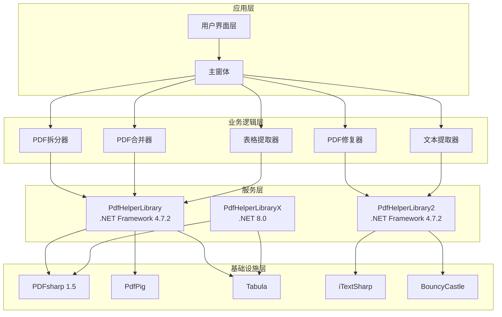
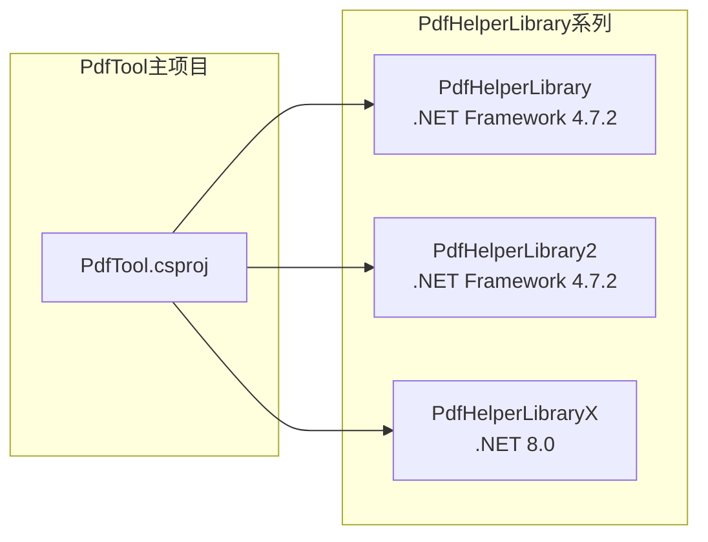
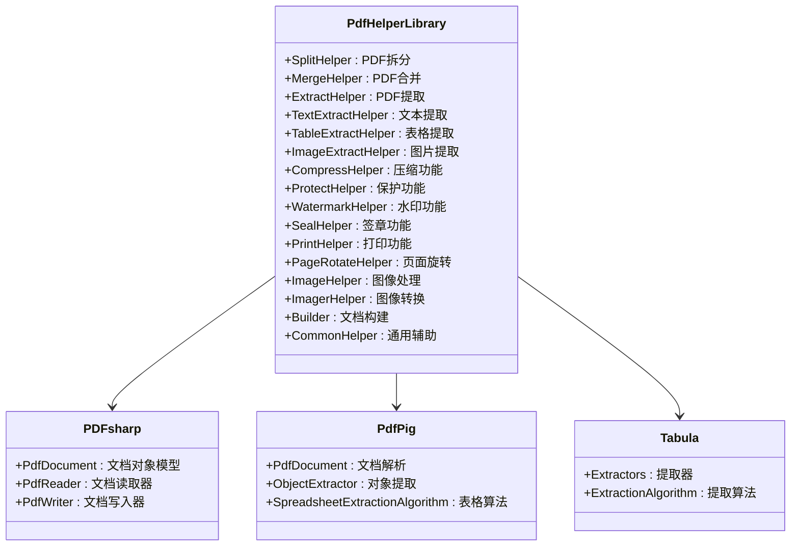
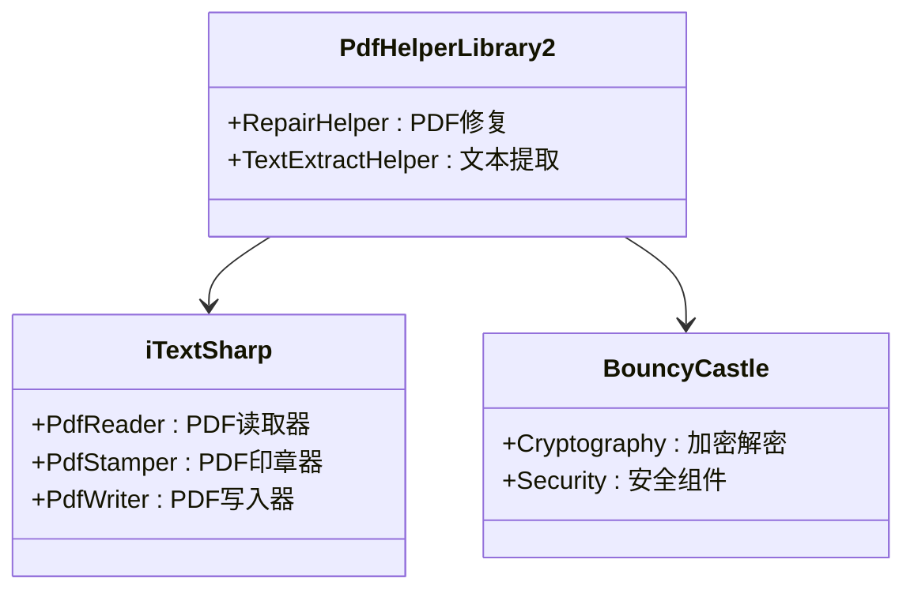
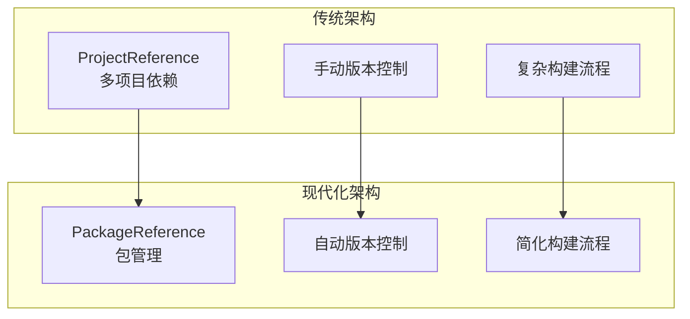
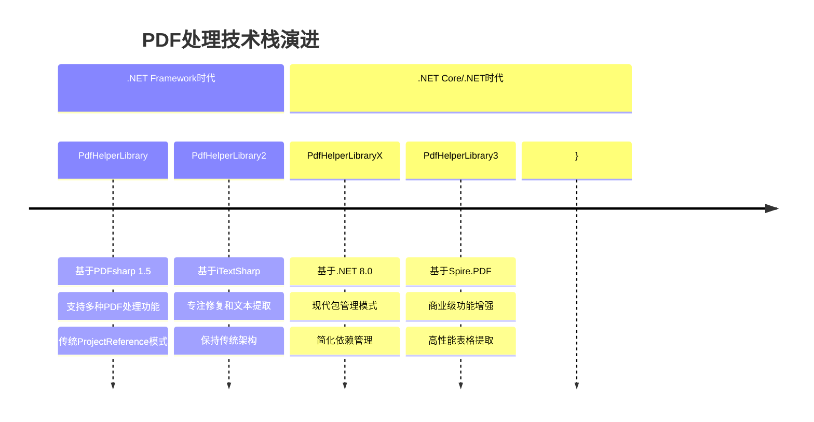
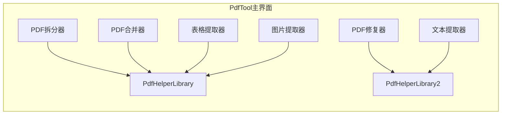
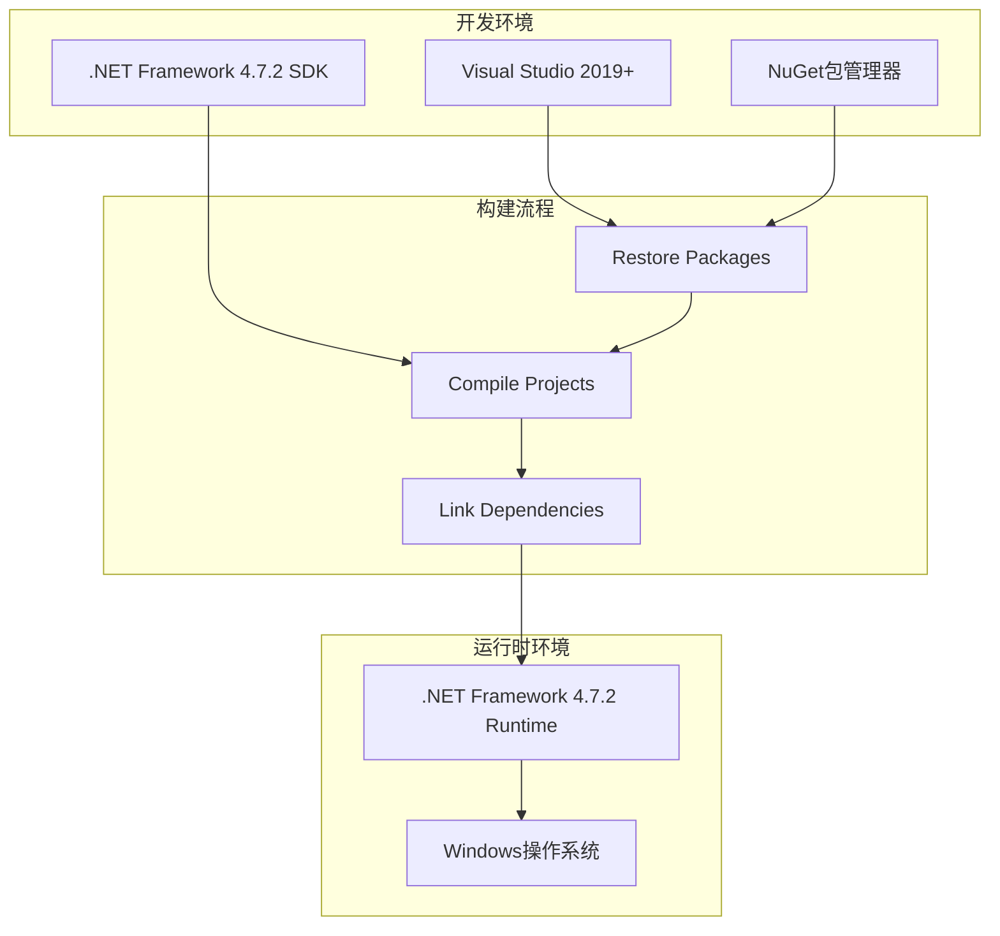

# 项目依赖图谱

<cite>
**本文档中引用的文件**
- [PdfTool.csproj](file://PdfTool/PdfTool.csproj)
- [PdfHelperLibrary.csproj](file://PdfHelperLibrary/PdfHelperLibrary.csproj)
- [PdfHelperLibrary2.csproj](file://PdfHelperLibrary2/PdfHelperLibrary2.csproj)
- [PdfHelperLibraryX.csproj](file://PdfHelperLibraryX/PdfHelperLibraryX.csproj)
- [MainForm.cs](file://PdfTool/MainForm.cs)
- [SplitHelper.cs](file://PdfHelperLibrary/SplitHelper.cs)
- [MergeHelper.cs](file://PdfHelperLibrary/MergeHelper.cs)
- [RepairHelper.cs](file://PdfHelperLibrary2/RepairHelper.cs)
- [TextExtractHelper.cs](file://PdfHelperLibrary2/TextExtractHelper.cs)
- [TableExtractHelper.cs](file://PdfHelperLibrary/TableExtractHelper.cs)
- [PdfSplitter.cs](file://PdfTool/PdfSplitter.cs)
- [PdfRepairer.cs](file://PdfTool/PdfRepairer.cs)
- [CommonHelper.cs](file://PdfHelperLibraryX/CommonHelper.cs)
- [packages.config](file://PdfTool/packages.config)
</cite>

## 目录
1. [项目概述](#项目概述)
2. [核心架构](#核心架构)
3. [依赖关系分析](#依赖关系分析)
4. [PdfHelperLibrary系列对比](#pdfhelperlibrary系列对比)
5. [技术栈演进](#技术栈演进)
6. [功能模块映射](#功能模块映射)
7. [部署策略](#部署策略)
8. [总结](#总结)

## 项目概述

PdfTool是一个综合性的PDF处理工具，采用模块化架构设计，通过多个PdfHelperLibrary变体提供不同的PDF处理能力。该项目展现了从传统.NET Framework向现代.NET生态系统的演进过程。

## 核心架构

PdfTool项目采用分层架构模式，主要包含以下层次：

**图表来源**
- [PdfTool.csproj](file://PdfTool/PdfTool.csproj#L179-L189)
- [MainForm.cs](file://PdfTool/MainForm.cs#L135-L148)

**章节来源**
- [PdfTool.csproj](file://PdfTool/PdfTool.csproj#L1-L204)
- [MainForm.cs](file://PdfTool/MainForm.cs#L1-L194)

## 依赖关系分析

### 主项目依赖结构

PdfTool主项目通过ProjectReference方式引入三个PdfHelperLibrary变体：

**图表来源**
- [PdfTool.csproj](file://PdfTool/PdfTool.csproj#L179-L189)

### 依赖关系详细分析

| 依赖项 | 引用类型 | 版本目标 | 功能定位 |
|--------|----------|----------|----------|
| PdfHelperLibrary | ProjectReference | .NET Framework 4.7.2 | 核心PDF功能 |
| PdfHelperLibrary2 | ProjectReference | .NET Framework 4.7.2 | PDF修复和文本提取 |
| PdfHelperLibraryX | PackageReference | .NET 8.0 | 现代化演进版本 |

**章节来源**
- [PdfTool.csproj](file://PdfTool/PdfTool.csproj#L179-L189)

## PdfHelperLibrary系列对比

### PdfHelperLibrary（核心功能库）

#### 技术栈特征
- **目标框架**: .NET Framework 4.7.2
- **核心依赖**: PDFsharp 1.5、PdfPig、Tabula
- **架构特点**: 传统ProjectReference模式

#### 功能模块分布

**图表来源**
- [PdfHelperLibrary.csproj](file://PdfHelperLibrary/PdfHelperLibrary.csproj#L35-L94)
- [SplitHelper.cs](file://PdfHelperLibrary/SplitHelper.cs#L1-L70)
- [MergeHelper.cs](file://PdfHelperLibrary/MergeHelper.cs#L1-L75)

#### 核心功能特性

| 功能模块 | 技术实现 | 应用场景 |
|----------|----------|----------|
| PDF拆分 | PDFsharp文档对象模型 | 单页或多页拆分 |
| PDF合并 | 流式处理和内存管理 | 大文件合并优化 |
| 表格提取 | PdfPig + Tabula组合 | 复杂表格识别 |
| 文本提取 | 多引擎支持 | 高精度文本提取 |
| 图片提取 | 多格式支持 | 图像资源提取 |

**章节来源**
- [PdfHelperLibrary.csproj](file://PdfHelperLibrary/PdfHelperLibrary.csproj#L1-L127)
- [SplitHelper.cs](file://PdfHelperLibrary/SplitHelper.cs#L1-L70)
- [MergeHelper.cs](file://PdfHelperLibrary/MergeHelper.cs#L1-L75)
- [TableExtractHelper.cs](file://PdfHelperLibrary/TableExtractHelper.cs#L1-L106)

### PdfHelperLibrary2（专用修复库）

#### 技术栈特征
- **目标框架**: .NET Framework 4.7.2
- **核心依赖**: iTextSharp、BouncyCastle
- **架构特点**: 专注于PDF修复和文本提取

#### 功能模块分布

**图表来源**
- [PdfHelperLibrary2.csproj](file://PdfHelperLibrary2/PdfHelperLibrary2.csproj#L34-L39)
- [RepairHelper.cs](file://PdfHelperLibrary2/RepairHelper.cs#L1-L40)
- [TextExtractHelper.cs](file://PdfHelperLibrary2/TextExtractHelper.cs#L1-L31)

#### 技术栈对比分析

| 技术栈维度 | PdfHelperLibrary | PdfHelperLibrary2 |
|------------|------------------|-------------------|
| **PDF处理引擎** | PDFsharp 1.5 | iTextSharp 5.5.13.4 |
| **加密支持** | 内置支持 | BouncyCastle |
| **表格提取** | PdfPig + Tabula | 基础文本提取 |
| **修复能力** | 基础修复 | 高级修复 |
| **性能特征** | 平衡性能 | 高效修复 |

**章节来源**
- [PdfHelperLibrary2.csproj](file://PdfHelperLibrary2/PdfHelperLibrary2.csproj#L1-L58)
- [RepairHelper.cs](file://PdfHelperLibrary2/RepairHelper.cs#L1-L40)
- [TextExtractHelper.cs](file://PdfHelperLibrary2/TextExtractHelper.cs#L1-L31)

### PdfHelperLibraryX（现代化演进版）

#### 技术栈特征
- **目标框架**: .NET 8.0
- **包管理模式**: PackageReference
- **核心依赖**: PDFsharp 6.2.2、SixLabors.ImageSharp、Tabula

#### 架构演进特点

**图表来源**
- [PdfHelperLibraryX.csproj](file://PdfHelperLibraryX/PdfHelperLibraryX.csproj#L1-L18)
- [CommonHelper.cs](file://PdfHelperLibraryX/CommonHelper.cs#L1-L28)

**章节来源**
- [PdfHelperLibraryX.csproj](file://PdfHelperLibraryX/PdfHelperLibraryX.csproj#L1-L18)
- [CommonHelper.cs](file://PdfHelperLibraryX/CommonHelper.cs#L1-L28)

## 技术栈演进

### 演进路径分析

### 技术栈对比矩阵

| 特征维度 | PdfHelperLibrary | PdfHelperLibrary2 | PdfHelperLibraryX | PdfHelperLibrary3 |
|----------|------------------|-------------------|-------------------|-------------------|
| **目标框架** | .NET Framework 4.7.2 | .NET Framework 4.7.2 | .NET 8.0 | .NET Framework 4.7.2 |
| **包管理** | ProjectReference | ProjectReference | PackageReference | ProjectReference |
| **PDF引擎** | PDFsharp 1.5 | iTextSharp 5.5.13.4 | PDFsharp 6.2.2 | Spire.PDF |
| **图像处理** | 基础支持 | 基础支持 | SixLabors.ImageSharp | Spire.PDF内置 |
| **表格提取** | PdfPig + Tabula | 基础文本 | PDFsharp + Tabula | Spire.PDF |
| **维护成本** | 中等 | 较低 | 最低 | 较高 |
| **性能表现** | 良好 | 优秀 | 优秀 | 最佳 |

## 功能模块映射

### PdfTool主界面功能映射

**图表来源**
- [PdfTool.csproj](file://PdfTool/PdfTool.csproj#L179-L189)
- [PdfSplitter.cs](file://PdfTool/PdfSplitter.cs#L1-L200)
- [PdfRepairer.cs](file://PdfTool/PdfRepairer.cs#L1-L111)

### 功能对应关系表

| PdfTool功能模块 | 使用的PdfHelperLibrary | 核心方法 | 技术实现 |
|-----------------|------------------------|----------|----------|
| PDF拆分 | PdfHelperLibrary | SplitHelper.SplitPdf | PDFsharp文档对象模型 |
| PDF合并 | PdfHelperLibrary | MergeHelper.MergePdf | 流式处理优化 |
| PDF修复 | PdfHelperLibrary2 | RepairHelper.SaveAs | iTextSharp修复算法 |
| 文本提取 | PdfHelperLibrary2 | TextExtractHelper.Test | iTextSharp文本提取 |
| 表格提取 | PdfHelperLibrary | TableExtractHelper.ExtractTable | PdfPig + Tabula组合 |
| 图片提取 | PdfHelperLibrary | ImageExtractHelper.Extract | 多格式图像处理 |

**章节来源**
- [PdfTool.csproj](file://PdfTool/PdfTool.csproj#L179-L189)
- [PdfSplitter.cs](file://PdfTool/PdfSplitter.cs#L1-L200)
- [PdfRepairer.cs](file://PdfTool/PdfRepairer.cs#L1-L111)

## 部署策略

### 当前部署架构

### 部署配置分析

#### 包依赖管理
- **PdfTool**: 通过packages.config管理第三方依赖
- **PdfHelperLibrary系列**: 采用ProjectReference模式
- **现代化演进**: 迁移到PackageReference模式

#### 版本兼容性
- **向后兼容**: PdfHelperLibrary保持现有功能
- **功能隔离**: PdfHelperLibrary2专注于修复功能
- **技术验证**: PdfHelperLibraryX验证新技术栈

**章节来源**
- [packages.config](file://PdfTool/packages.config#L1-L5)

## 总结

PdfTool项目的依赖关系展现了PDF处理技术的完整演进历程：

1. **架构设计理念**: 采用模块化设计，通过ProjectReference实现功能分离
2. **技术栈演进**: 从传统的PDFsharp到现代化的.NET 8.0生态
3. **功能专业化**: 不同库专注于特定功能领域，实现功能隔离
4. **部署策略**: 从复杂的ProjectReference到简化的PackageReference
5. **技术验证**: PdfHelperLibraryX作为新技术栈的验证平台

这种设计不仅保证了功能的完整性，还为未来的技术升级奠定了坚实基础。通过合理的技术栈选择和功能分工，项目实现了从传统到现代的平滑过渡，体现了良好的软件工程实践。