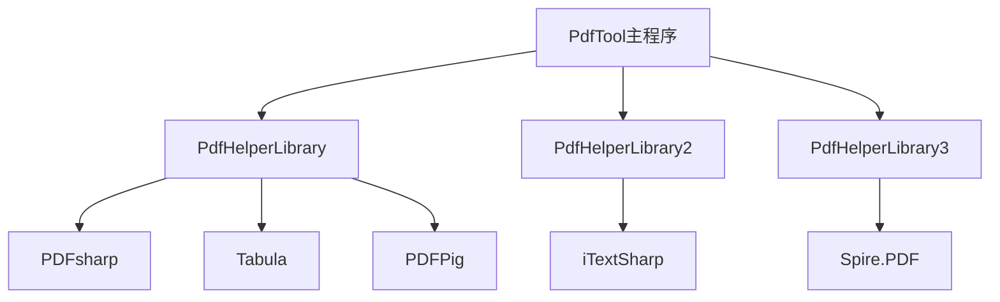
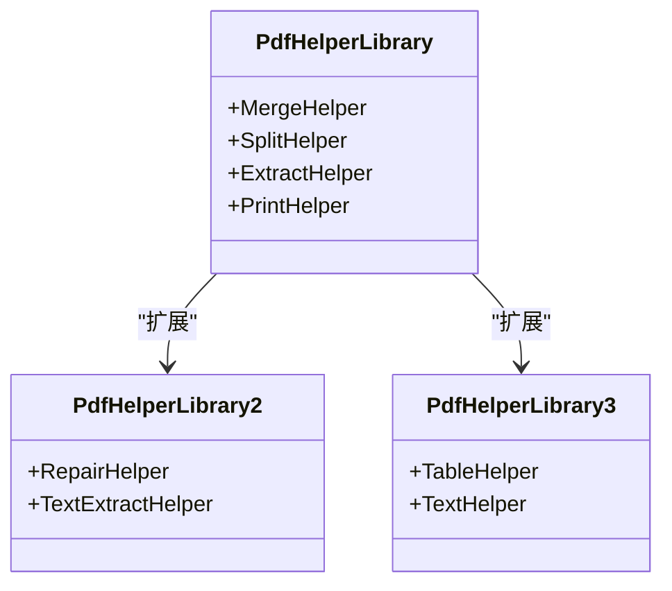
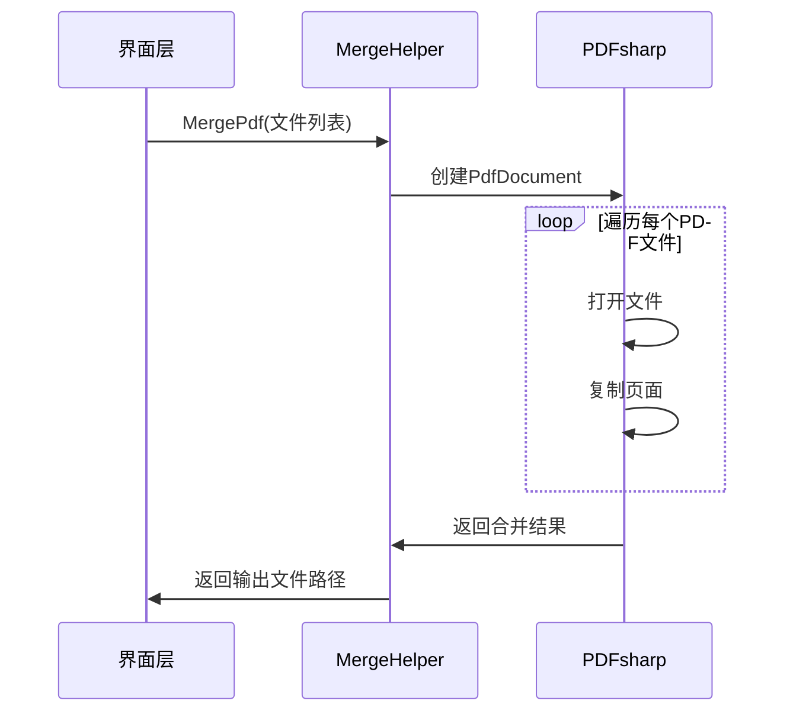
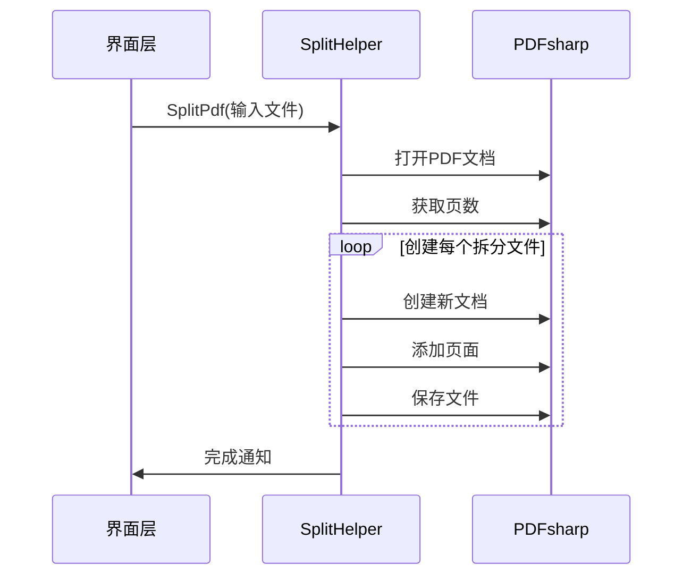
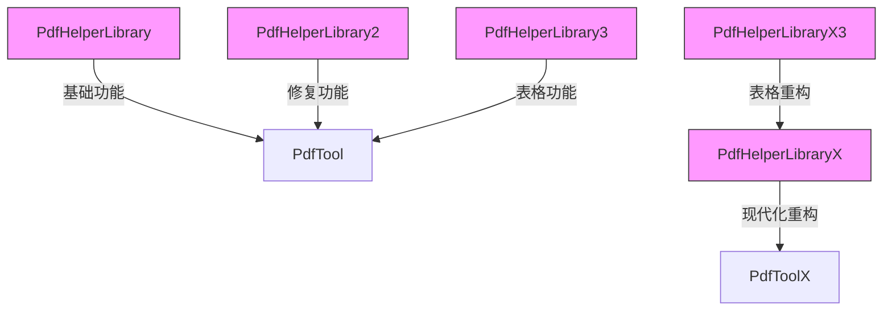
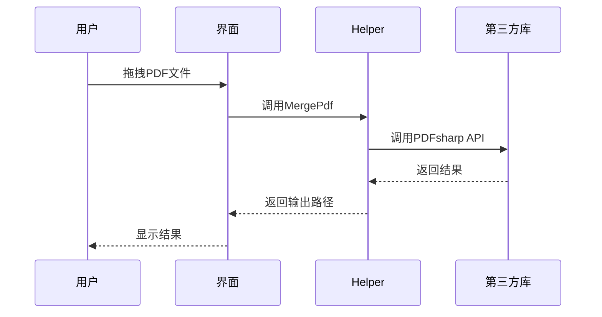
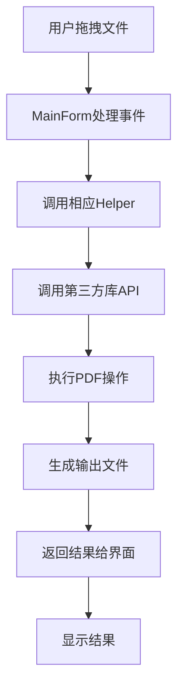

# 技术架构设计

<cite>
**本文档引用文件**  
- [PdfTool.csproj](file://PdfTool/PdfTool.csproj)
- [Config.cs](file://PdfTool/Config.cs)
- [MainForm.cs](file://PdfTool/MainForm.cs)
- [FodyWeavers.xml](file://PdfTool/FodyWeavers.xml)
- [PdfHelperLibrary.csproj](file://PdfHelperLibrary/PdfHelperLibrary.csproj)
- [MergeHelper.cs](file://PdfHelperLibrary/MergeHelper.cs)
- [SplitHelper.cs](file://PdfHelperLibrary/SplitHelper.cs)
- [CommonHelper.cs](file://PdfHelperLibrary/CommonHelper.cs)
- [PrintHelper.cs](file://PdfHelperLibrary/PrintHelper.cs)
- [PdfHelperLibrary2.csproj](file://PdfHelperLibrary2/PdfHelperLibrary2.csproj)
- [PdfHelperLibrary3.csproj](file://PdfHelperLibrary3/PdfHelperLibrary3.csproj)
- [PdfHelperLibraryX.csproj](file://PdfHelperLibraryX/PdfHelperLibraryX.csproj)
- [RepairHelper.cs](file://PdfHelperLibrary2/RepairHelper.cs)
- [TextExtractHelper.cs](file://PdfHelperLibrary2/TextExtractHelper.cs)
- [TableHelper.cs](file://PdfHelperLibrary3/TableHelper.cs)
- [TextHelper.cs](file://PdfHelperLibrary3/TextHelper.cs)
</cite>

## 目录
1. [引言](#引言)
2. [项目结构分析](#项目结构分析)
3. [三层架构设计](#三层架构设计)
4. [设计模式应用](#设计模式应用)
5. [项目依赖关系图谱](#项目依赖关系图谱)
6. [编译时代码织入](#编译时代码织入)
7. [系统上下文与组件交互](#系统上下文与组件交互)
8. [数据流分析](#数据流分析)
9. [架构优势与改进点](#架构优势与改进点)
10. [结论](#结论)

## 引言
PdfTool 是一个功能丰富的PDF处理工具集，采用分层架构设计，实现了PDF文件的拆分、合并、转换、提取等多种功能。本技术架构文档深入分析其组件分层结构与设计模式应用，重点阐述界面层、业务逻辑层和第三方库依赖层的协同工作机制。

## 项目结构分析
PdfTool项目采用模块化设计，包含多个独立工具和共享库。核心结构包括：
- **PdfTool**: 主程序，提供图形化界面
- **PdfHelperLibrary系列**: 业务逻辑层，封装PDF操作
- **第三方库**: PDFsharp, PdfPig, iTextSharp等，提供底层PDF处理能力



**图源**  
- [PdfTool.csproj](file://PdfTool/PdfTool.csproj)
- [PdfHelperLibrary.csproj](file://PdfHelperLibrary/PdfHelperLibrary.csproj)
- [PdfHelperLibrary2.csproj](file://PdfHelperLibrary2/PdfHelperLibrary2.csproj)
- [PdfHelperLibrary3.csproj](file://PdfHelperLibrary3/PdfHelperLibrary3.csproj)

## 三层架构设计

### 界面层（PdfTool主程序）
界面层采用WinForms技术构建，通过`MainForm.cs`实现主窗口和多个功能模块的集成。每个功能模块（如PDF拆分、合并等）以UserControl形式存在，通过TabControl进行管理。

**节源**  
- [MainForm.cs](file://PdfTool/MainForm.cs)
- [PdfTool.csproj](file://PdfTool/PdfTool.csproj)

### 业务逻辑层（PdfHelperLibrary系列库）
业务逻辑层由多个Helper库组成，每个库专注于特定功能集：
- **PdfHelperLibrary**: 基础PDF操作，基于PDFsharp
- **PdfHelperLibrary2**: 高级功能，基于iTextSharp
- **PdfHelperLibrary3**: 表格处理，基于Spire.PDF



**图源**  
- [PdfHelperLibrary.csproj](file://PdfHelperLibrary/PdfHelperLibrary.csproj)
- [PdfHelperLibrary2.csproj](file://PdfHelperLibrary2/PdfHelperLibrary2.csproj)
- [PdfHelperLibrary3.csproj](file://PdfHelperLibrary3/PdfHelperLibrary3.csproj)

### 第三方库依赖层
第三方库依赖层整合了多种PDF处理引擎：
- **PDFsharp**: 开源PDF库，用于基础PDF操作
- **PDFPig**: 开源PDF解析库，用于文本和表格提取
- **iTextSharp**: 功能强大的PDF库，用于高级文档处理
- **Spire.PDF**: 商业PDF库，用于复杂表格处理

**节源**  
- [PdfHelperLibrary.csproj](file://PdfHelperLibrary/PdfHelperLibrary.csproj)
- [PdfHelperLibrary2.csproj](file://PdfHelperLibrary2/PdfHelperLibrary2.csproj)
- [PdfHelperLibrary3.csproj](file://PdfHelperLibrary3/PdfHelperLibrary3.csproj)

## 设计模式应用

### 门面模式在Helper类中的体现
门面模式通过Helper类封装复杂的PDF操作，为界面层提供简洁的API接口。

#### MergeHelper门面实现


**图源**  
- [MergeHelper.cs](file://PdfHelperLibrary/MergeHelper.cs)

#### SplitHelper门面实现


**图源**  
- [SplitHelper.cs](file://PdfHelperLibrary/SplitHelper.cs)

### 单例模式在Config类中的实现
Config类采用静态类实现单例模式，提供全局配置常量。

```csharp
internal static class Config
{
    internal const int ControlMargin = 20;
    internal const int ControlPadding = 12;
}
```

**节源**  
- [Config.cs](file://PdfTool/Config.cs)

## 项目依赖关系图谱
项目存在多个PdfHelperLibrary变体，体现了功能迭代和隔离的设计思想。



**图源**  
- [PdfHelperLibrary.csproj](file://PdfHelperLibrary/PdfHelperLibrary.csproj)
- [PdfHelperLibrary2.csproj](file://PdfHelperLibrary2/PdfHelperLibrary2.csproj)
- [PdfHelperLibrary3.csproj](file://PdfHelperLibrary3/PdfHelperLibrary3.csproj)
- [PdfHelperLibraryX.csproj](file://PdfHelperLibraryX/PdfHelperLibraryX.csproj)
- [PdfHelperLibraryX3.csproj](file://PdfHelperLibraryX3/PdfHelperLibraryX3.csproj)

### 变体存在的原因分析
1. **版本迭代**: PdfHelperLibraryX代表.NET 8现代化重构
2. **功能隔离**: 不同Helper库专注于特定功能领域
3. **技术栈隔离**: 不同第三方库的封装隔离
4. **向后兼容**: 保持旧版本API的兼容性

**节源**  
- [PdfHelperLibrary.csproj](file://PdfHelperLibrary/PdfHelperLibrary.csproj)
- [PdfHelperLibraryX.csproj](file://PdfHelperLibraryX/PdfHelperLibraryX.csproj)

## 编译时代码织入
通过FodyWeavers.xml配置，实现编译时代码织入，主要用于程序集嵌入。

```xml
<Weavers xmlns:xsi="http://www.w3.org/2001/XMLSchema-instance" xsi:noNamespaceSchemaLocation="FodyWeavers.xsd">
  <Costura />
</Weavers>
```

### 应用场景分析
1. **程序集嵌入**: 使用Costura将依赖库嵌入主程序集
2. **减少部署复杂性**: 单文件部署，无需额外DLL
3. **防止版本冲突**: 隔离依赖库版本

**节源**  
- [FodyWeavers.xml](file://PdfTool/FodyWeavers.xml)

## 系统上下文与组件交互

### 系统上下文图
```mermaid
contextDiagram
actor 用户
rectangle "PdfTool" {
component 界面层
component 业务逻辑层
component 依赖层
}
用户 --> 界面层
界面层 --> 业务逻辑层
业务逻辑层 --> 依赖层
```

**图源**  
- [MainForm.cs](file://PdfTool/MainForm.cs)
- [PdfHelperLibrary.csproj](file://PdfHelperLibrary/PdfHelperLibrary.csproj)

### 组件交互图


**图源**  
- [MainForm.cs](file://PdfTool/MainForm.cs)
- [MergeHelper.cs](file://PdfHelperLibrary/MergeHelper.cs)

## 数据流分析
从用户操作到最终文件输出的完整数据流路径。



**图源**  
- [MainForm.cs](file://PdfTool/MainForm.cs)
- [MergeHelper.cs](file://PdfHelperLibrary/MergeHelper.cs)
- [SplitHelper.cs](file://PdfHelperLibrary/SplitHelper.cs)

## 架构优势与改进点

### 架构优势
1. **可维护性**: 清晰的分层结构，便于维护和扩展
2. **模块化**: 功能模块化，可独立开发和测试
3. **技术多样性**: 支持多种PDF处理引擎
4. **向后兼容**: 多版本Helper库共存

### 潜在改进点
1. **依赖管理**: 多个Helper库可能导致依赖冲突
2. **代码重复**: 部分功能在不同Helper库中重复实现
3. **性能优化**: 大文件处理时的内存管理
4. **现代化**: 迁移到.NET Core/.NET 5+

**节源**  
- [PdfHelperLibrary.csproj](file://PdfHelperLibrary/PdfHelperLibrary.csproj)
- [PdfHelperLibrary2.csproj](file://PdfHelperLibrary2/PdfHelperLibrary2.csproj)
- [PdfHelperLibrary3.csproj](file://PdfHelperLibrary3/PdfHelperLibrary3.csproj)

## 结论
PdfTool的技术架构体现了良好的分层设计和设计模式应用。通过门面模式封装复杂操作，单例模式管理配置，实现了清晰的职责分离。多版本Helper库的设计既保证了功能扩展性，又维护了向后兼容性。未来可考虑进一步优化依赖管理和推进现代化重构。