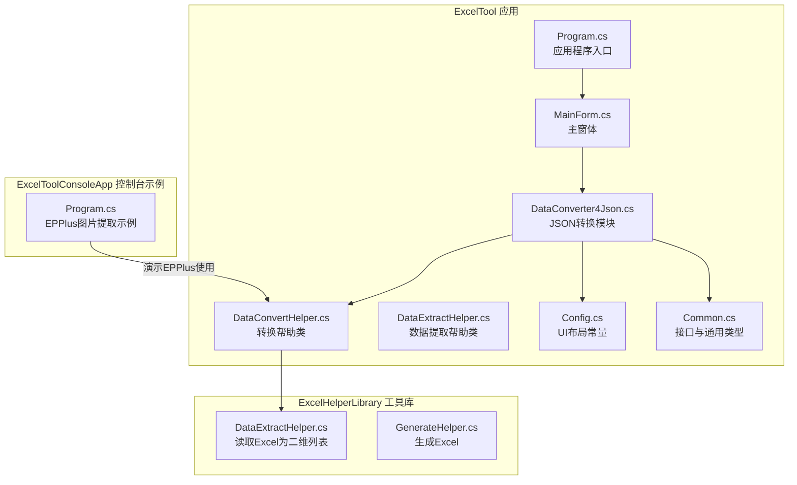
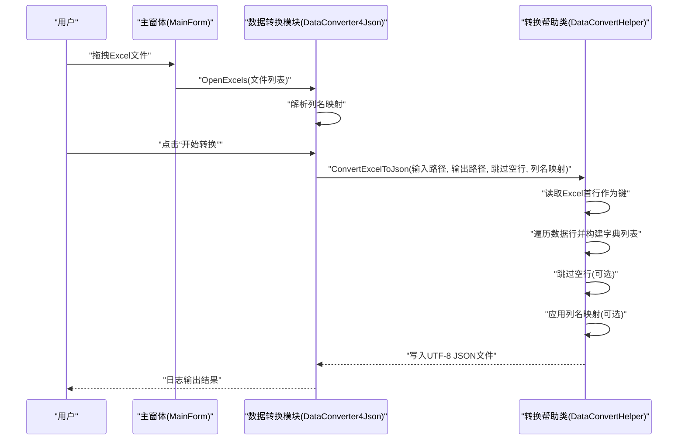
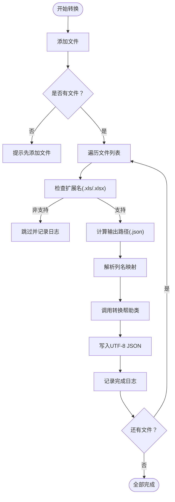
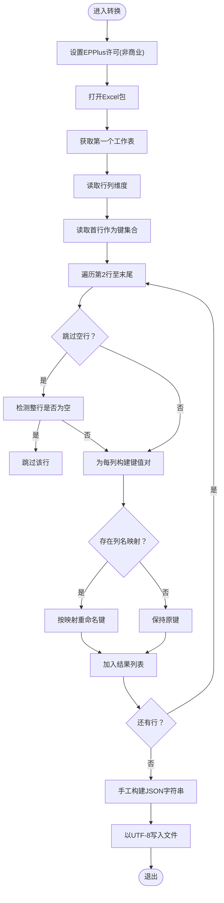
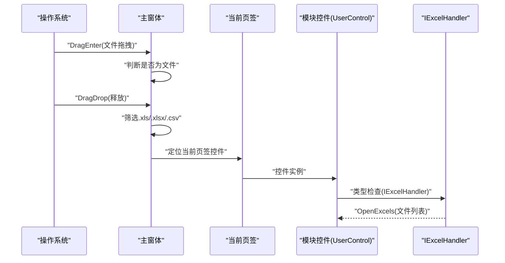
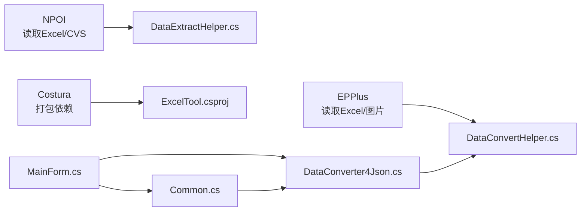

# Excel转JSON转换器

<cite>
**本文引用的文件**
- [ExcelTool/ExcelTool.csproj](file://ExcelTool/ExcelTool.csproj)
- [ExcelTool/Program.cs](file://ExcelTool/Program.cs)
- [ExcelTool/MainForm.cs](file://ExcelTool/MainForm.cs)
- [ExcelTool/Common.cs](file://ExcelTool/Common.cs)
- [ExcelTool/Config.cs](file://ExcelTool/Config.cs)
- [ExcelTool/Modules/DataConverter4Json.cs](file://ExcelTool/Modules/DataConverter4Json.cs)
- [ExcelTool/Modules/DataConverter4Json.Designer.cs](file://ExcelTool/Modules/DataConverter4Json.Designer.cs)
- [ExcelTool/Helpers/DataConvertHelper.cs](file://ExcelTool/Helpers/DataConvertHelper.cs)
- [ExcelTool/Helpers/DataExtractHelper.cs](file://ExcelTool/Helpers/DataExtractHelper.cs)
- [ExcelHelperLibrary/DataExtractHelper.cs](file://ExcelHelperLibrary/DataExtractHelper.cs)
- [ExcelHelperLibrary/GenerateHelper.cs](file://ExcelHelperLibrary/GenerateHelper.cs)
- [ExcelToolConsoleApp/Program.cs](file://ExcelToolConsoleApp/Program.cs)
</cite>

## 目录
1. [简介](#简介)
2. [项目结构](#项目结构)
3. [核心组件](#核心组件)
4. [架构总览](#架构总览)
5. [详细组件分析](#详细组件分析)
6. [依赖关系分析](#依赖关系分析)
7. [性能考虑](#性能考虑)
8. [故障排查指南](#故障排查指南)
9. [结论](#结论)
10. [附录](#附录)

## 简介
本项目提供一个基于Windows Forms的Excel转JSON转换器，支持拖拽或选择Excel文件（.xls/.xlsx），将第一张工作表的首行作为字段名，从第二行起逐行转换为JSON数组对象，并可配置跳过空行与列名映射。转换逻辑由专用的帮助类实现，UI模块负责交互与日志记录，主窗体承载多个功能页签，便于在单一应用中完成多种Excel处理任务。

## 项目结构
- 应用程序入口位于ExcelTool工程，包含主窗体、模块与辅助工具类。
- 转换功能集中在“数据转换JSON”模块，调用通用转换帮助类执行实际转换。
- 工具库ExcelHelperLibrary提供基础的Excel读取与生成能力，供其他模块复用。
- ExcelToolConsoleApp演示了如何直接使用EPPlus读取Excel中的图片等资源，体现对EPPlus的集成方式。

图表来源
- [ExcelTool/Program.cs](file://ExcelTool/Program.cs#L1-L23)
- [ExcelTool/MainForm.cs](file://ExcelTool/MainForm.cs#L1-L180)
- [ExcelTool/Modules/DataConverter4Json.cs](file://ExcelTool/Modules/DataConverter4Json.cs#L1-L227)
- [ExcelTool/Helpers/DataConvertHelper.cs](file://ExcelTool/Helpers/DataConvertHelper.cs#L1-L156)
- [ExcelTool/Helpers/DataExtractHelper.cs](file://ExcelTool/Helpers/DataExtractHelper.cs#L1-L127)
- [ExcelHelperLibrary/DataExtractHelper.cs](file://ExcelHelperLibrary/DataExtractHelper.cs#L1-L46)
- [ExcelHelperLibrary/GenerateHelper.cs](file://ExcelHelperLibrary/GenerateHelper.cs#L1-L48)
- [ExcelToolConsoleApp/Program.cs](file://ExcelToolConsoleApp/Program.cs#L1-L66)

章节来源
- [ExcelTool/ExcelTool.csproj](file://ExcelTool/ExcelTool.csproj#L1-L251)
- [ExcelTool/Program.cs](file://ExcelTool/Program.cs#L1-L23)
- [ExcelTool/MainForm.cs](file://ExcelTool/MainForm.cs#L1-L180)

## 核心组件
- 主窗体与模块容器
  - 主窗体负责创建多页签界面，将各功能模块（图片提取、数据提取、数据预览、表格拆分、数据转换JSON）作为子控件加载。
  - 支持拖拽文件到窗体，自动识别Excel/CVS文件并转发给当前选中的模块处理器。
- 数据转换模块
  - 提供“添加文件”、“开始转换”按钮，以及“跳过空行”选项与“列名映射”输入框。
  - 将每个选中的Excel文件转换为同目录下的同名.json文件。
- 转换帮助类
  - 使用EPPlus读取Excel，以首行作为键，从第二行开始逐行构建字典列表，最终输出标准JSON字符串。
  - 支持跳过整行为空的行，支持列名映射，支持转义特殊字符。
- 通用接口与配置
  - 定义IExcelHandler接口，统一模块对文件集合的处理入口。
  - Config提供UI控件间距常量，保证界面布局一致性。

章节来源
- [ExcelTool/MainForm.cs](file://ExcelTool/MainForm.cs#L1-L180)
- [ExcelTool/Modules/DataConverter4Json.cs](file://ExcelTool/Modules/DataConverter4Json.cs#L1-L227)
- [ExcelTool/Helpers/DataConvertHelper.cs](file://ExcelTool/Helpers/DataConvertHelper.cs#L1-L156)
- [ExcelTool/Common.cs](file://ExcelTool/Common.cs#L1-L14)
- [ExcelTool/Config.cs](file://ExcelTool/Config.cs#L1-L15)

## 架构总览
下图展示从用户操作到文件转换的端到端流程，包括UI事件、模块处理与底层转换逻辑之间的调用关系。

图表来源
- [ExcelTool/MainForm.cs](file://ExcelTool/MainForm.cs#L1-L180)
- [ExcelTool/Modules/DataConverter4Json.cs](file://ExcelTool/Modules/DataConverter4Json.cs#L1-L227)
- [ExcelTool/Helpers/DataConvertHelper.cs](file://ExcelTool/Helpers/DataConvertHelper.cs#L1-L156)

## 详细组件分析

### 数据转换模块（DataConverter4Json）
- 功能职责
  - 接收文件列表，显示日志，支持批量转换。
  - 解析列名映射文本，生成字典用于键重命名。
  - 异步执行转换，避免UI阻塞。
- 关键行为
  - 文件过滤：仅接受.xls与.xlsx扩展名。
  - 输出路径：与输入同目录，同名.json。
  - 日志线程安全：通过Invoke确保跨线程更新UI。
- 用户交互
  - “添加文件”：打开多选对话框，支持拖拽。
  - “开始转换”：遍历文件列表逐一处理。
  - “跳过空行”：默认勾选。
  - “列名映射”：形如“原列名1=新key1;原列名2=新key2”，可选。

图表来源
- [ExcelTool/Modules/DataConverter4Json.cs](file://ExcelTool/Modules/DataConverter4Json.cs#L1-L227)

章节来源
- [ExcelTool/Modules/DataConverter4Json.cs](file://ExcelTool/Modules/DataConverter4Json.cs#L1-L227)
- [ExcelTool/Modules/DataConverter4Json.Designer.cs](file://ExcelTool/Modules/DataConverter4Json.Designer.cs#L1-L37)

### 转换帮助类（DataConvertHelper）
- 功能职责
  - 使用EPPlus读取Excel工作簿，取第一张工作表。
  - 以首行作为键集合，从第二行开始逐行读取，构建字典列表。
  - 可选跳过整行为空的行，可选按映射字典重命名键。
  - 手工拼接JSON字符串并以UTF-8写入文件。
- 错误处理
  - 捕获异常并通过消息框提示，避免崩溃。
- 性能与复杂度
  - 时间复杂度：O(R*C)，R为数据行数，C为列数。
  - 内存占用：按行构建字典，整体线性增长。
  - 字符串转义：对引号、换行、回车、制表符进行转义，保证JSON合法性。

图表来源
- [ExcelTool/Helpers/DataConvertHelper.cs](file://ExcelTool/Helpers/DataConvertHelper.cs#L1-L156)

章节来源
- [ExcelTool/Helpers/DataConvertHelper.cs](file://ExcelTool/Helpers/DataConvertHelper.cs#L1-L156)

### 主窗体与拖拽交互（MainForm）
- 功能职责
  - 初始化多页签，将各模块控件注入对应页签。
  - 处理拖拽事件，筛选Excel/CVS文件并转发给当前选中的模块处理器。
  - 提供底部链接与赞赏图标，便于反馈与使用说明。
- 交互细节
  - 通过IExcelHandler接口统一接收文件列表，增强模块解耦。
  - 在DEBUG模式下支持双击重载页签内容，便于开发调试。

图表来源
- [ExcelTool/MainForm.cs](file://ExcelTool/MainForm.cs#L1-L180)
- [ExcelTool/Common.cs](file://ExcelTool/Common.cs#L1-L14)

章节来源
- [ExcelTool/MainForm.cs](file://ExcelTool/MainForm.cs#L1-L180)
- [ExcelTool/Common.cs](file://ExcelTool/Common.cs#L1-L14)

### 工具库与控制台示例
- ExcelHelperLibrary
  - DataExtractHelper：将Excel读取为二维字符串列表，便于通用表格处理。
  - GenerateHelper：根据通用表格模型生成Excel文件，便于导出。
- ExcelToolConsoleApp
  - 展示如何使用EPPlus读取工作簿中的图片并保存，体现对EPPlus的直接使用方式。

章节来源
- [ExcelHelperLibrary/DataExtractHelper.cs](file://ExcelHelperLibrary/DataExtractHelper.cs#L1-L46)
- [ExcelHelperLibrary/GenerateHelper.cs](file://ExcelHelperLibrary/GenerateHelper.cs#L1-L48)
- [ExcelToolConsoleApp/Program.cs](file://ExcelToolConsoleApp/Program.cs#L1-L66)

## 依赖关系分析
- 外部库
  - EPPlus：读取Excel工作簿与图片资源。
  - NPOI：用于部分场景的Excel/CVS读取（在其他模块中使用）。
  - Costura：用于打包嵌入依赖（在ExcelTool.csproj中可见）。
- 内部模块耦合
  - DataConverter4Json依赖DataConvertHelper进行实际转换。
  - DataConvertHelper内部使用EPPlus，不直接依赖UI层。
  - MainForm通过接口IExcelHandler与各模块解耦，提高扩展性。

图表来源
- [ExcelTool/ExcelTool.csproj](file://ExcelTool/ExcelTool.csproj#L1-L251)
- [ExcelTool/Helpers/DataConvertHelper.cs](file://ExcelTool/Helpers/DataConvertHelper.cs#L1-L156)
- [ExcelTool/Helpers/DataExtractHelper.cs](file://ExcelTool/Helpers/DataExtractHelper.cs#L1-L127)
- [ExcelTool/MainForm.cs](file://ExcelTool/MainForm.cs#L1-L180)
- [ExcelTool/Common.cs](file://ExcelTool/Common.cs#L1-L14)

章节来源
- [ExcelTool/ExcelTool.csproj](file://ExcelTool/ExcelTool.csproj#L1-L251)

## 性能考虑
- 数据规模
  - 转换算法为O(R*C)，适合中等规模表格；超大表格建议分批处理或优化为流式写入。
- IO与内存
  - 逐行构建字典，内存随行数线性增长；建议在UI层限制单次批量大小。
- 编码与转义
  - UTF-8写入与字符串转义开销较小，但大量长文本会增加序列化成本。
- 并发
  - 当前采用Task.Run并行处理文件列表，但未做并发写文件保护，建议在多文件场景下加锁或分批写入。

[本节为通用指导，无需列出具体文件来源]

## 故障排查指南
- 常见问题
  - 文件扩展名不支持：仅接受.xls与.xlsx，其他类型会被跳过并记录日志。
  - 空行跳过：若勾选“跳过空行”，整行为空的行将不会出现在输出中。
  - 列名映射无效：映射文本格式不正确或键不存在时，将使用原列名。
  - 转换异常：捕获异常后弹出错误提示，可在日志中查看具体错误信息。
- 调试建议
  - 使用DEBUG模式下的双击重载机制快速切换页签控件。
  - 在控制台示例中验证EPPlus可用性与图片读取流程。

章节来源
- [ExcelTool/Modules/DataConverter4Json.cs](file://ExcelTool/Modules/DataConverter4Json.cs#L1-L227)
- [ExcelTool/Helpers/DataConvertHelper.cs](file://ExcelTool/Helpers/DataConvertHelper.cs#L1-L156)
- [ExcelTool/MainForm.cs](file://ExcelTool/MainForm.cs#L1-L180)

## 结论
本项目以清晰的模块划分实现了Excel到JSON的转换功能：UI层负责交互与日志，模块层负责业务编排，帮助类负责核心算法与外部库集成。通过接口解耦与可配置项（跳过空行、列名映射），满足常见数据处理需求。建议后续可引入异步写入、批量限流与更丰富的列类型处理，以进一步提升稳定性与性能。

[本节为总结性内容，无需列出具体文件来源]

## 附录
- 使用说明
  - 在“数据转换JSON”页签中添加Excel文件，配置“跳过空行”与“列名映射”，点击“开始转换”即可生成同目录下的.json文件。
- 开发参考
  - 若需扩展其他格式（如CSV），可参考DataExtractHelper的读取模式。
  - 如需生成Excel，可参考GenerateHelper的通用表格模型。

[本节为补充说明，无需列出具体文件来源]