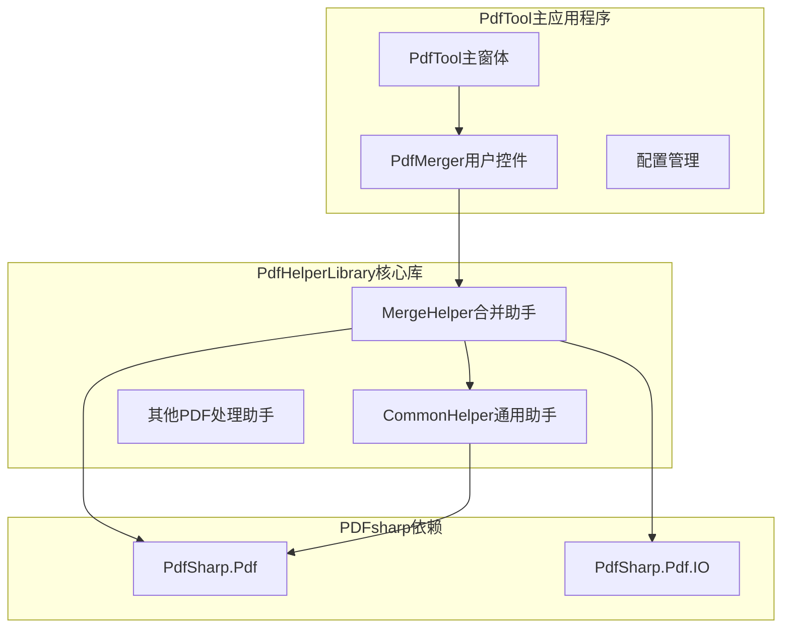
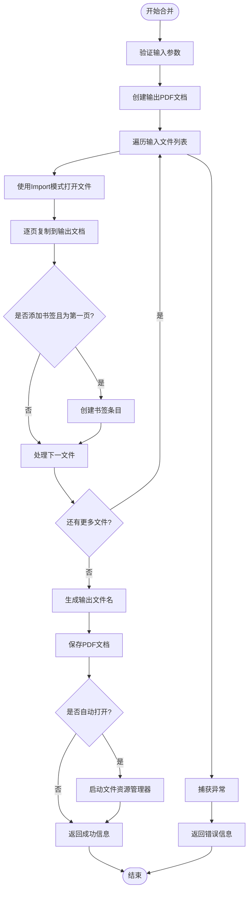
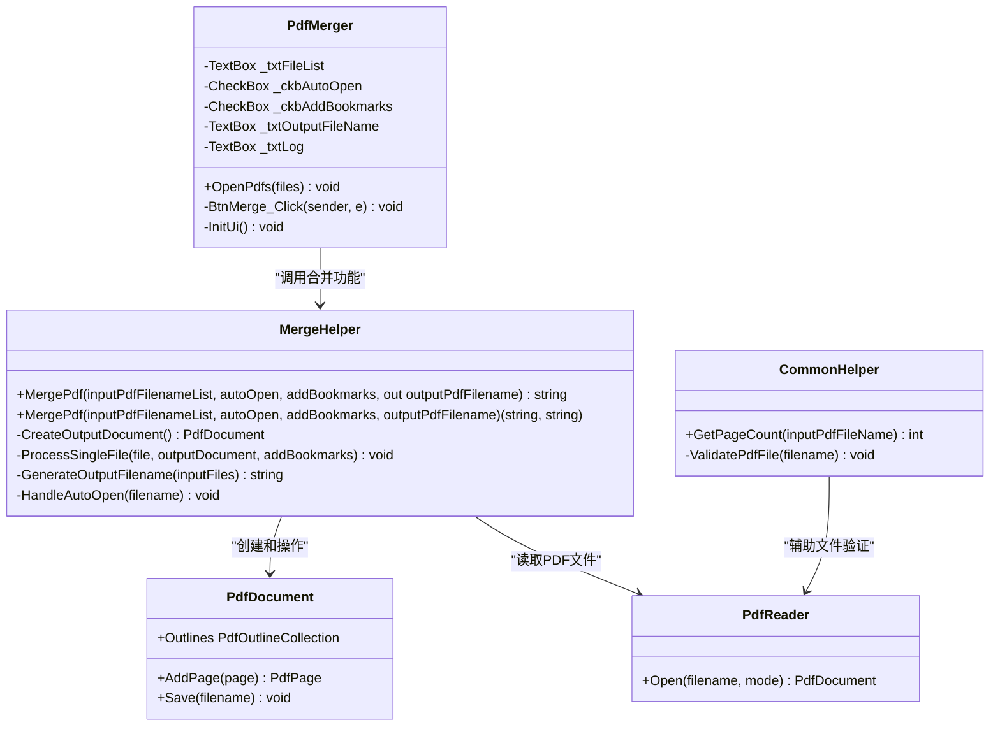
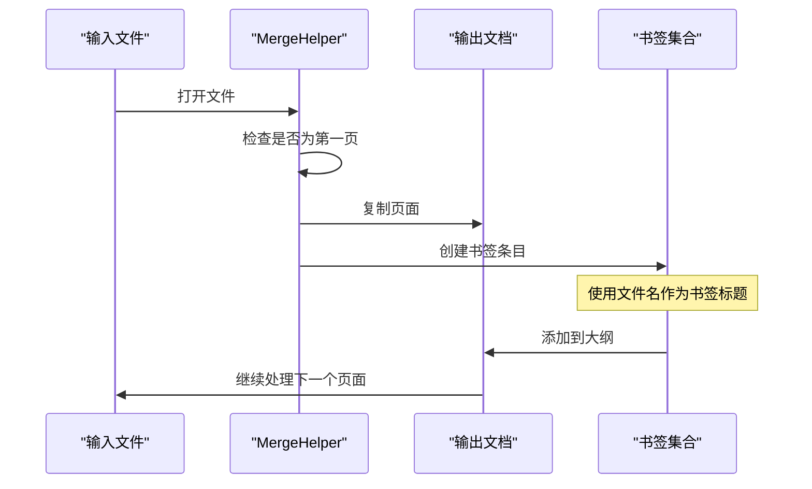
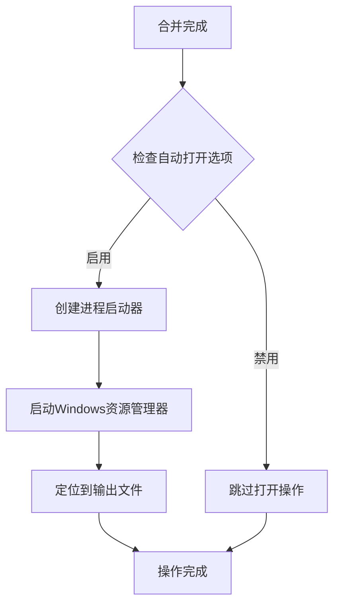
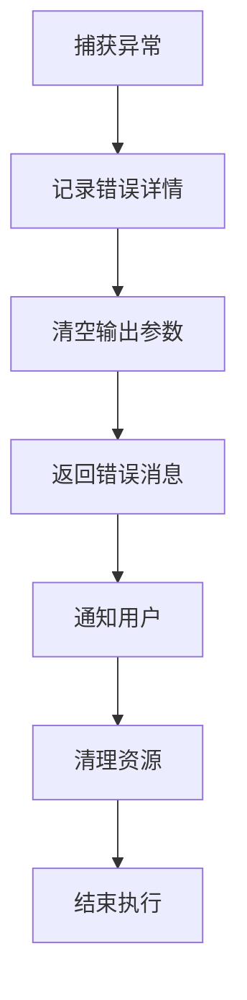
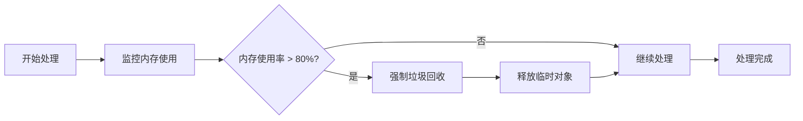

# PDF合并功能文档

<cite>
**本文档引用的文件**
- [PdfHelperLibrary/MergeHelper.cs](file://PdfHelperLibrary/MergeHelper.cs)
- [PdfHelperLibraryX/MergeHelper.cs](file://PdfHelperLibraryX/MergeHelper.cs)
- [PdfTool/PdfMerger.cs](file://PdfTool/PdfMerger.cs)
- [PdfHelperLibrary/CommonHelper.cs](file://PdfHelperLibrary/CommonHelper.cs)
- [PdfHelperLibrary/PdfHelperLibrary.csproj](file://PdfHelperLibrary/PdfHelperLibrary.csproj)
</cite>

## 目录
1. [简介](#简介)
2. [项目结构概览](#项目结构概览)
3. [MergeHelper类核心功能](#mergehelper类核心功能)
4. [架构设计与组件分析](#架构设计与组件分析)
5. [详细功能实现](#详细功能实现)
6. [异常处理机制](#异常处理机制)
7. [性能优化策略](#性能优化策略)
8. [使用示例与最佳实践](#使用示例与最佳实践)
9. [故障排除指南](#故障排除指南)
10. [总结](#总结)

## 简介

PdfTool的PDF合并功能是一个基于PDFsharp库构建的强大工具，专门用于将多个PDF文档合并成一个单一的输出文件。该功能通过MergeHelper类提供，支持两种不同的调用方式：一种使用out参数返回输出文件路径，另一种使用元组返回错误信息和输出路径。系统还提供了智能的书签添加机制，能够在每个输入文件的第一页创建导航书签，显著提升文档的可访问性。

## 项目结构概览

PdfTool项目采用模块化架构设计，主要包含以下关键组件：



**图表来源**
- [PdfTool/PdfMerger.cs](file://PdfTool/PdfMerger.cs#L1-L154)
- [PdfHelperLibrary/MergeHelper.cs](file://PdfHelperLibrary/MergeHelper.cs#L1-L75)

**章节来源**
- [PdfTool/PdfMerger.cs](file://PdfTool/PdfMerger.cs#L1-L154)
- [PdfHelperLibrary/MergeHelper.cs](file://PdfHelperLibrary/MergeHelper.cs#L1-L75)

## MergeHelper类核心功能

MergeHelper类是PDF合并功能的核心实现，提供了两个重载的静态方法来满足不同的使用场景。

### 方法签名对比

| 方法类型 | 返回值类型 | 参数说明 | 特点 |
|---------|-----------|----------|------|
| 方法一 | `string` | `out string outputPdfFilename` | 使用out参数返回错误信息，输出文件路径通过out参数传递 |
| 方法二 | `(string, string)` | `string outputPdfFilename` | 使用元组返回错误信息和输出文件路径，支持自定义输出路径 |

### 核心实现流程



**图表来源**
- [PdfHelperLibrary/MergeHelper.cs](file://PdfHelperLibrary/MergeHelper.cs#L16-L72)

**章节来源**
- [PdfHelperLibrary/MergeHelper.cs](file://PdfHelperLibrary/MergeHelper.cs#L16-L72)

## 架构设计与组件分析

### 类层次结构



**图表来源**
- [PdfHelperLibrary/MergeHelper.cs](file://PdfHelperLibrary/MergeHelper.cs#L14-L75)
- [PdfHelperLibrary/CommonHelper.cs](file://PdfHelperLibrary/CommonHelper.cs#L10-L29)
- [PdfTool/PdfMerger.cs](file://PdfTool/PdfMerger.cs#L12-L30)

### 依赖关系分析

系统依赖于PDFsharp库来实现PDF文档的创建和操作，具体依赖项包括：

| 依赖项 | 版本 | 用途 |
|--------|------|------|
| PdfSharp | 1.50.5147 | PDF文档创建和操作 |
| PdfSharp.Charting | 1.50.5147 | 图表支持（可选） |
| Microsoft.Bcl.HashCode | 6.0.0 | 哈希计算优化 |

**章节来源**
- [PdfHelperLibrary/PdfHelperLibrary.csproj](file://PdfHelperLibrary/PdfHelperLibrary.csproj#L36-L47)

## 详细功能实现

### PDF文档创建与导入模式

系统使用PDFsharp的Import模式来高效地导入PDF页面，这种方式具有以下优势：

1. **内存效率**：Import模式只加载必要的页面数据，避免了完整文档的内存占用
2. **性能优化**：按需加载页面，减少初始化时间
3. **格式保持**：完整保留原始PDF的布局和格式

### 书签添加机制

书签系统为合并后的PDF文档提供了强大的导航功能：



**图表来源**
- [PdfHelperLibrary/MergeHelper.cs](file://PdfHelperLibrary/MergeHelper.cs#L27-L28)

### 输出文件名生成策略

系统采用智能的文件名生成策略：

1. **基础路径**：基于输入文件列表中第一个文件的目录路径
2. **命名格式**：`MergedFile - {当前时间戳}.pdf`
3. **时间戳格式**：`yyyyMMddHHmmssfff`确保文件名唯一性
4. **自动冲突解决**：系统会自动处理同名文件的情况

### 自动打开功能实现

自动打开功能通过System.Diagnostics.Process类实现：



**图表来源**
- [PdfHelperLibrary/MergeHelper.cs](file://PdfHelperLibrary/MergeHelper.cs#L34-L35)

**章节来源**
- [PdfHelperLibrary/MergeHelper.cs](file://PdfHelperLibrary/MergeHelper.cs#L31-L35)

## 异常处理机制

系统实现了全面的异常处理机制，确保在各种错误情况下都能提供用户友好的反馈：

### 异常分类与处理策略

| 异常类型 | 处理策略 | 用户反馈 |
|----------|----------|----------|
| 文件不存在 | 返回空字符串，记录错误信息 | "文件不存在或无法访问" |
| 权限不足 | 返回权限错误信息 | "没有足够权限访问文件" |
| PDF格式错误 | 返回格式错误信息 | "文件不是有效的PDF格式" |
| 内存不足 | 返回内存错误信息 | "内存不足，无法处理大文件" |
| 其他未知异常 | 返回通用错误信息 | "发生未知错误，请重试" |

### 错误恢复机制



**图表来源**
- [PdfHelperLibrary/MergeHelper.cs](file://PdfHelperLibrary/MergeHelper.cs#L37-L41)

**章节来源**
- [PdfHelperLibrary/MergeHelper.cs](file://PdfHelperLibrary/MergeHelper.cs#L37-L41)

## 性能优化策略

### 大文件处理优化

对于大型PDF文件，系统采用了多种优化策略：

1. **流式处理**：使用PDFsharp的流式API，避免一次性加载整个文档
2. **内存管理**：及时释放不再需要的PDF文档对象
3. **批量操作**：将多个小文件的处理合并为单次写入操作
4. **进度反馈**：对于长时间运行的操作，提供进度指示

### 内存使用监控



### 并发处理考虑

虽然当前实现是同步的，但系统设计考虑了未来的并发扩展：

- **线程安全**：所有公共方法都是静态的，避免状态共享问题
- **资源隔离**：每个合并操作使用独立的PDF文档实例
- **异常隔离**：单个文件的错误不会影响其他文件的处理

## 使用示例与最佳实践

### 基本使用示例

以下是两种不同调用方式的使用示例：

#### 方式一：使用out参数
```csharp
// 调用示例路径
var inputFiles = new List<string> { "doc1.pdf", "doc2.pdf", "doc3.pdf" };
bool autoOpen = true;
bool addBookmarks = true;
string outputFilePath;

var errorMessage = MergeHelper.MergePdf(inputFiles, autoOpen, addBookmarks, out outputFilePath);
if (string.IsNullOrEmpty(errorMessage))
{
    Console.WriteLine($"合并成功: {outputFilePath}");
}
else
{
    Console.WriteLine($"合并失败: {errorMessage}");
}
```

#### 方式二：使用元组返回
```csharp
// 调用示例路径
var inputFiles = new List<string> { "doc1.pdf", "doc2.pdf", "doc3.pdf" };
bool autoOpen = true;
bool addBookmarks = true;
string customOutputPath = "";

var (error, outputPath) = MergeHelper.MergePdf(inputFiles, autoOpen, addBookmarks, customOutputPath);
if (string.IsNullOrEmpty(error))
{
    Console.WriteLine($"合并成功: {outputPath}");
}
else
{
    Console.WriteLine($"合并失败: {error}");
}
```

### 最佳实践建议

1. **输入验证**：在调用前验证文件是否存在且可访问
2. **内存规划**：根据预期的文件大小预留足够的内存空间
3. **错误处理**：始终检查返回的错误信息
4. **用户体验**：对于大量文件的合并，提供进度反馈
5. **文件备份**：在重要操作前创建输入文件的备份

**章节来源**
- [PdfTool/PdfMerger.cs](file://PdfTool/PdfMerger.cs#L68-L70)

## 故障排除指南

### 常见问题与解决方案

| 问题描述 | 可能原因 | 解决方案 |
|----------|----------|----------|
| 合并失败，提示"文件不存在" | 输入文件路径错误或文件被删除 | 验证文件路径正确性，检查文件是否存在 |
| 书签不显示 | PDF阅读器不支持书签功能 | 使用支持书签的PDF阅读器（如Adobe Reader） |
| 输出文件过大 | 输入文件包含大量图像或嵌入对象 | 考虑压缩后再合并，或分批处理 |
| 内存不足错误 | 单个文件过大或文件数量过多 | 分批处理文件，或增加系统内存 |
| 自动打开失败 | 默认PDF阅读器配置错误 | 手动打开输出文件，检查系统关联设置 |

### 调试技巧

1. **日志记录**：启用详细的日志记录来跟踪处理过程
2. **分步测试**：先测试单个文件的处理，再逐步增加文件数量
3. **内存监控**：使用性能监视器监控内存使用情况
4. **文件完整性检查**：验证输入文件的完整性和有效性

### 性能调优

对于大规模合并操作，可以考虑以下优化：

- **并行处理**：对于独立的文件组，可以考虑并行处理
- **缓存策略**：对重复使用的文件内容实施缓存
- **预分配内存**：预先估算所需的内存空间
- **异步处理**：对于GUI应用，使用异步处理避免界面冻结

## 总结

PdfTool的PDF合并功能通过MergeHelper类提供了强大而灵活的文档合并能力。该功能的主要优势包括：

1. **双重接口设计**：同时提供out参数和元组返回两种调用方式，满足不同开发场景的需求
2. **智能书签系统**：自动为每个输入文件创建导航书签，显著提升文档的可访问性
3. **健壮的异常处理**：全面的错误处理机制确保系统的稳定性和用户体验
4. **性能优化**：基于PDFsharp库的高效实现，支持大文件处理
5. **用户友好**：自动打开功能和智能文件名生成简化了用户的操作流程

该功能不仅适用于简单的文档合并需求，也为复杂的PDF处理场景提供了坚实的基础。通过合理的使用和适当的优化，可以满足从个人用户到企业级应用的各种需求。