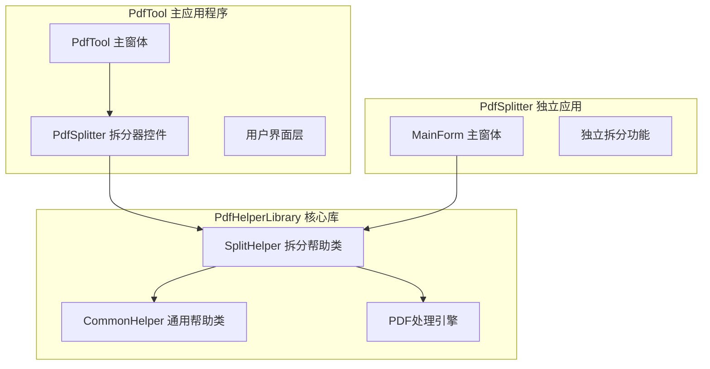
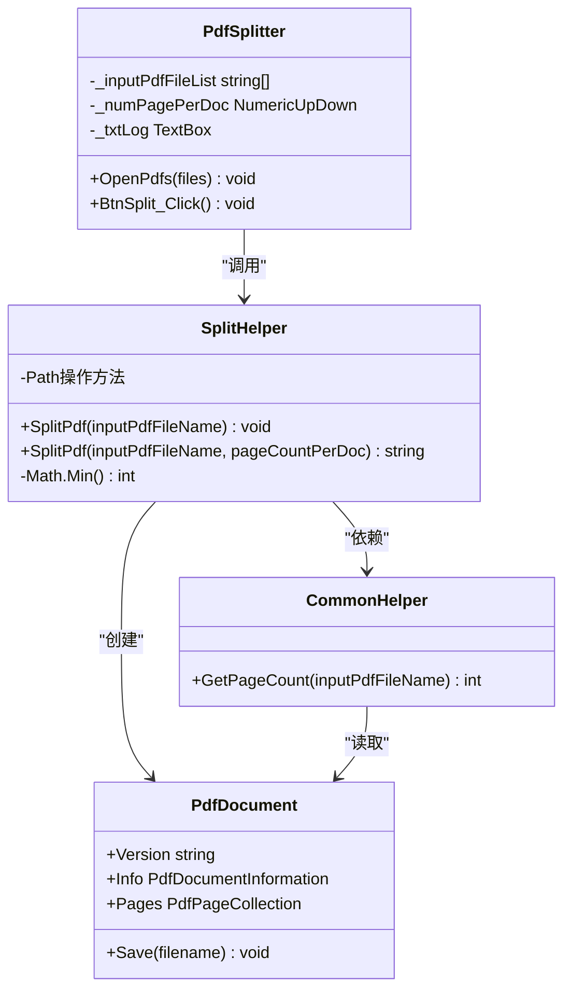
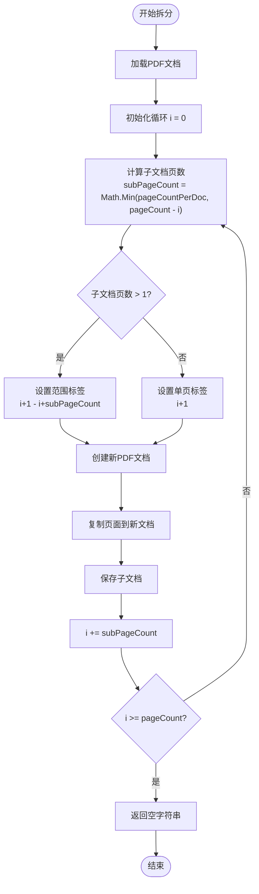
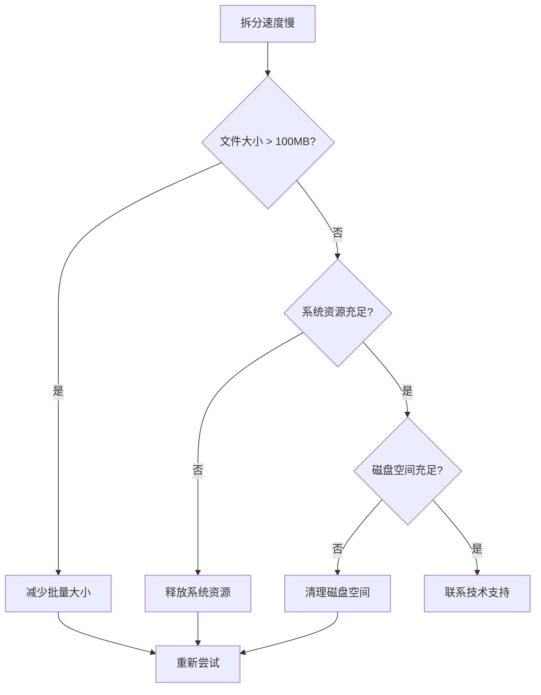

# PDF拆分功能详细文档

<cite>
**本文档中引用的文件**
- [SplitHelper.cs](file://PdfHelperLibrary/SplitHelper.cs)
- [PdfSplitter.cs](file://PdfTool/PdfSplitter.cs)
- [CommonHelper.cs](file://PdfHelperLibrary/CommonHelper.cs)
- [SplitHelper.cs](file://PdfHelperLibraryX/SplitHelper.cs)
- [MainForm.cs](file://PdfSplitter/MainForm.cs)
</cite>

## 目录
1. [简介](#简介)
2. [项目结构概览](#项目结构概览)
3. [核心组件分析](#核心组件分析)
4. [架构设计](#架构设计)
5. [详细功能分析](#详细功能分析)
6. [算法实现深度解析](#算法实现深度解析)
7. [异常处理机制](#异常处理机制)
8. [性能优化建议](#性能优化建议)
9. [使用指南](#使用指南)
10. [故障排除](#故障排除)
11. [总结](#总结)

## 简介

PdfTool是一个功能强大的PDF处理工具，其中的PDF拆分功能是其核心特性之一。该功能主要由SplitHelper类实现，提供了两种智能的PDF拆分模式：单页拆分和批量拆分。通过精心设计的算法和异常安全机制，确保了PDF拆分操作的可靠性和高效性。

## 项目结构概览

PdfTool项目采用模块化架构设计，PDF拆分功能分布在多个组件中：



**图表来源**
- [PdfSplitter.cs](file://PdfTool/PdfSplitter.cs#L1-L230)
- [SplitHelper.cs](file://PdfHelperLibrary/SplitHelper.cs#L1-L70)

**章节来源**
- [PdfSplitter.cs](file://PdfTool/PdfSplitter.cs#L1-L50)
- [SplitHelper.cs](file://PdfHelperLibrary/SplitHelper.cs#L1-L70)

## 核心组件分析

### SplitHelper 类设计

SplitHelper类是PDF拆分功能的核心实现，采用了静态类设计模式，提供了两个主要的拆分方法：

#### 单页拆分方法
- **方法签名**: `public static void SplitPdf(string inputPdfFileName)`
- **功能**: 将输入PDF的每一页保存为独立的PDF文件
- **文件命名**: 原文件名 - Page X.pdf
- **特点**: 简单直接，适用于需要单独处理每页的场景

#### 批量拆分方法  
- **方法签名**: `public static string SplitPdf(string inputPdfFileName, int pageCountPerDoc)`
- **功能**: 根据指定的每文档页数进行批量拆分
- **异常安全**: 返回详细的错误信息字符串
- **智能命名**: 支持单页和多页范围的智能命名策略

**章节来源**
- [SplitHelper.cs](file://PdfHelperLibrary/SplitHelper.cs#L13-L70)

## 架构设计

PDF拆分功能的整体架构体现了清晰的分层设计：



**图表来源**
- [SplitHelper.cs](file://PdfHelperLibrary/SplitHelper.cs#L11-L70)
- [PdfSplitter.cs](file://PdfTool/PdfSplitter.cs#L12-L30)
- [CommonHelper.cs](file://PdfHelperLibrary/CommonHelper.cs#L9-L28)

## 详细功能分析

### 单页拆分功能详解

单页拆分方法实现了最基础的PDF拆分需求：

#### 实现流程
1. **文档加载**: 使用PdfReader.Open加载输入PDF
2. **页面遍历**: 遍历文档的所有页面
3. **独立文档创建**: 为每页创建新的PDF文档
4. **元数据设置**: 复制原始文档的版本和创建者信息
5. **页面复制**: 将当前页面添加到新文档
6. **文件保存**: 保存为独立的PDF文件

#### 文件命名策略
- **格式**: `{原文件名} - Page {页码}.pdf`
- **示例**: `document.pdf` → `document - Page 1.pdf`
- **优势**: 清晰直观，便于识别和管理

**章节来源**
- [SplitHelper.cs](file://PdfHelperLibrary/SplitHelper.cs#L13-L29)

### 批量拆分功能详解

批量拆分方法是功能最复杂的拆分模式，具有以下特点：

#### 核心算法逻辑



**图表来源**
- [SplitHelper.cs](file://PdfHelperLibrary/SplitHelper.cs#L46-L59)

#### 智能命名机制

批量拆分采用了智能的文件命名策略：

| 页面数量 | 命名格式 | 示例 |
|---------|---------|------|
| 单页 | `Page X` | `Page 1.pdf` |
| 多页 | `Page X-Y` | `Page 1-5.pdf` |

这种命名策略的优势：
- **单页文档**: 明确标识单一页面内容
- **多页文档**: 清楚显示页面范围，便于批量处理
- **一致性**: 与单页拆分保持命名风格一致

**章节来源**
- [SplitHelper.cs](file://PdfHelperLibrary/SplitHelper.cs#L48-L51)

## 算法实现深度解析

### Math.Min算法的关键作用

在批量拆分算法中，Math.Min函数的使用是确保算法正确性的关键：

#### 越界保护机制
```csharp
// 计算实际子文档页数，避免数组越界
var subPageCount = Math.Min(pageCountPerDoc, pageCount - i);
```

这个算法的设计考虑了以下边界情况：
- **正常情况**: `pageCountPerDoc <= pageCount - i`
- **最后一批**: `pageCountPerDoc > pageCount - i`（最后一组可能不足指定页数）
- **越界保护**: 确保不会访问超出数组范围的页面

#### 循环控制策略

```mermaid
sequenceDiagram
participant Loop as "循环控制"
participant MathMin as "Math.Min算法"
participant Pages as "页面集合"
participant Output as "输出文档"
Loop->>MathMin : 计算剩余页面数
MathMin->>MathMin : Math.Min(pageCountPerDoc, pageCount - i)
MathMin-->>Loop : 返回实际子文档页数
Loop->>Pages : 获取指定数量的页面
Pages-->>Loop : 返回页面集合
Loop->>Output : 创建并保存子文档
Output-->>Loop : 完成保存
Loop->>Loop : i += subPageCount
```

**图表来源**
- [SplitHelper.cs](file://PdfHelperLibrary/SplitHelper.cs#L46-L59)

### 元数据处理机制

拆分过程中的元数据处理体现了对原始文档完整性的尊重：

#### 版本信息保持
- **源文档版本**: `inputDocument.Version`
- **目标文档版本**: 保持与源文档一致
- **兼容性保证**: 确保拆分后的文档能在相同环境中打开

#### 元数据复制策略
- **标题信息**: 添加"Page X of 原标题"格式
- **创建者信息**: 完全复制原始文档的创建者信息
- **时间戳**: 保留原始文档的时间戳信息

**章节来源**
- [SplitHelper.cs](file://PdfHelperLibrary/SplitHelper.cs#L52-L55)

## 异常处理机制

### 异常安全设计

批量拆分方法采用了完善的异常处理机制：

#### 异常捕获策略
```csharp
try
{
    // 主要业务逻辑
    return "";
}
catch (Exception ex)
{
    return $"拆分失败，原因：{ex.Message}";
}
```

#### 异常类型覆盖
- **系统异常**: 捕获所有类型的Exception
- **具体异常**: 包括PDF读取异常等特定情况
- **友好提示**: 返回用户友好的错误信息

#### 错误信息设计原则
- **明确性**: 清楚说明失败原因
- **可追溯性**: 包含具体的错误消息
- **指导性**: 为用户提供问题解决方向

**章节来源**
- [SplitHelper.cs](file://PdfHelperLibrary/SplitHelper.cs#L39-L66)

### 用户界面集成

PdfSplitter控件与SplitHelper的异常处理完美集成：

#### 日志记录机制
- **成功状态**: 显示"文件名 拆分完成"
- **失败状态**: 显示"文件名 拆分失败，原因：错误详情"
- **实时反馈**: 操作过程中实时更新日志

#### 用户体验优化
- **批量处理**: 支持同时处理多个文件
- **进度可见**: 通过日志窗口显示处理进度
- **错误隔离**: 单个文件失败不影响其他文件处理

**章节来源**
- [PdfSplitter.cs](file://PdfTool/PdfSplitter.cs#L54-L66)

## 性能优化建议

### 参数优化策略

#### 合理设置pageCountPerDoc参数

| 场景类型 | 推荐值 | 原因 |
|---------|--------|------|
| 小型文档 | 1-5页 | 减少内存占用 |
| 中型文档 | 5-20页 | 平衡文件数量和处理速度 |
| 大型文档 | 20-50页 | 避免产生过多小文件 |
| 特殊用途 | 1页 | 便于单独处理 |

#### 内存使用优化
- **流式处理**: 使用PdfReader的流式读取模式
- **及时释放**: 处理完成后及时释放PDF对象
- **批量大小**: 根据系统内存调整批量大小

### 处理效率提升

#### 并发处理考虑
虽然当前实现是同步的，但可以考虑以下优化：
- **异步处理**: 使用async/await模式提高响应性
- **多线程**: 对多个文件并行处理
- **进度回调**: 提供处理进度通知机制

#### 文件系统优化
- **临时目录**: 使用系统临时目录减少I/O压力
- **批量写入**: 减少文件系统调用次数
- **缓存策略**: 缓存频繁访问的文档信息

## 使用指南

### 基本使用步骤

#### 单页拆分使用
1. **选择文件**: 在PdfSplitter界面点击"添加文件"
2. **确认页数**: 查看文档页数信息
3. **执行拆分**: 点击"开始拆分"按钮
4. **查看结果**: 在日志窗口确认拆分状态

#### 批量拆分使用
1. **选择文件**: 添加需要拆分的PDF文件
2. **设置参数**: 在"页/文档"输入框设置每文档页数
3. **执行拆分**: 点击"开始拆分"按钮
4. **监控进度**: 通过日志窗口监控处理进度

### 最佳实践建议

#### 文件组织建议
- **备份原文件**: 拆分前备份原始PDF文件
- **统一命名**: 使用有意义的文件名便于管理
- **分类存储**: 按文档类型或日期分类存储拆分结果

#### 性能优化建议
- **文件大小**: 单个PDF文件不要超过100MB
- **页面数量**: 单个文档页面数建议不超过100页
- **系统资源**: 确保有足够的磁盘空间和内存

**章节来源**
- [PdfSplitter.cs](file://PdfTool/PdfSplitter.cs#L46-L66)
- [MainForm.cs](file://PdfSplitter/MainForm.cs#L34-L47)

## 故障排除

### 常见问题及解决方案

#### 拆分失败问题

| 错误类型 | 可能原因 | 解决方案 |
|---------|---------|---------|
| 文件不存在 | 指定的PDF文件被移动或删除 | 检查文件路径，重新选择文件 |
| 权限不足 | 当前用户没有文件读写权限 | 以管理员身份运行程序 |
| 文件损坏 | PDF文件本身存在损坏 | 使用PDF修复工具修复文件 |
| 内存不足 | 系统内存不足以处理大文件 | 关闭其他程序释放内存 |

#### 性能问题诊断



#### 调试技巧
- **启用详细日志**: 在调试模式下查看详细错误信息
- **分批处理**: 将大文件分成小批次处理
- **系统监控**: 监控CPU、内存、磁盘使用情况

### 技术支持资源

- **官方文档**: 查阅PdfHelperLibrary的详细API文档
- **社区论坛**: 在相关技术社区寻求帮助
- **源码分析**: 深入研究源代码了解实现细节

## 总结

PdfTool的PDF拆分功能展现了优秀的软件设计原则：

### 技术亮点
- **双模式设计**: 同时提供单页和批量拆分功能，满足不同需求
- **智能算法**: 使用Math.Min确保算法的健壮性和正确性
- **异常安全**: 完善的异常处理机制保证系统稳定性
- **用户体验**: 友好的用户界面和实时反馈机制

### 设计优势
- **模块化架构**: 清晰的职责分离和良好的可维护性
- **扩展性强**: 易于添加新的拆分模式和功能
- **性能优化**: 考虑了内存使用和处理效率
- **兼容性好**: 支持多种PDF版本和格式

### 应用价值
PDF拆分功能在实际应用场景中具有重要价值：
- **文档管理**: 便于组织和管理大型PDF文档
- **内容提取**: 支持基于页面的内容提取和处理
- **工作流程**: 作为PDF处理流水线的重要环节
- **个性化定制**: 满足不同用户的特殊需求

通过深入理解SplitHelper类的设计理念和实现细节，开发者可以更好地利用这一功能，并在此基础上进行二次开发和功能扩展。该功能的成功实现为整个PdfTool项目奠定了坚实的技术基础，展现了高质量软件工程的标准。