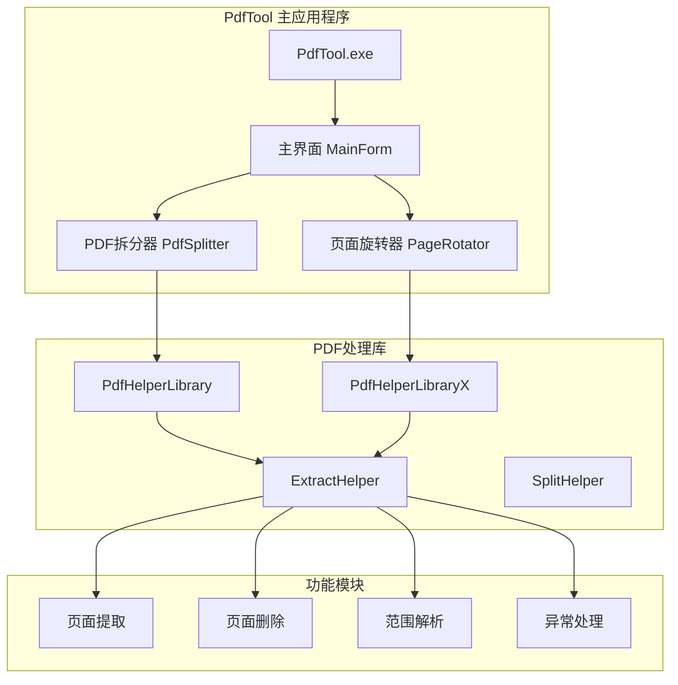
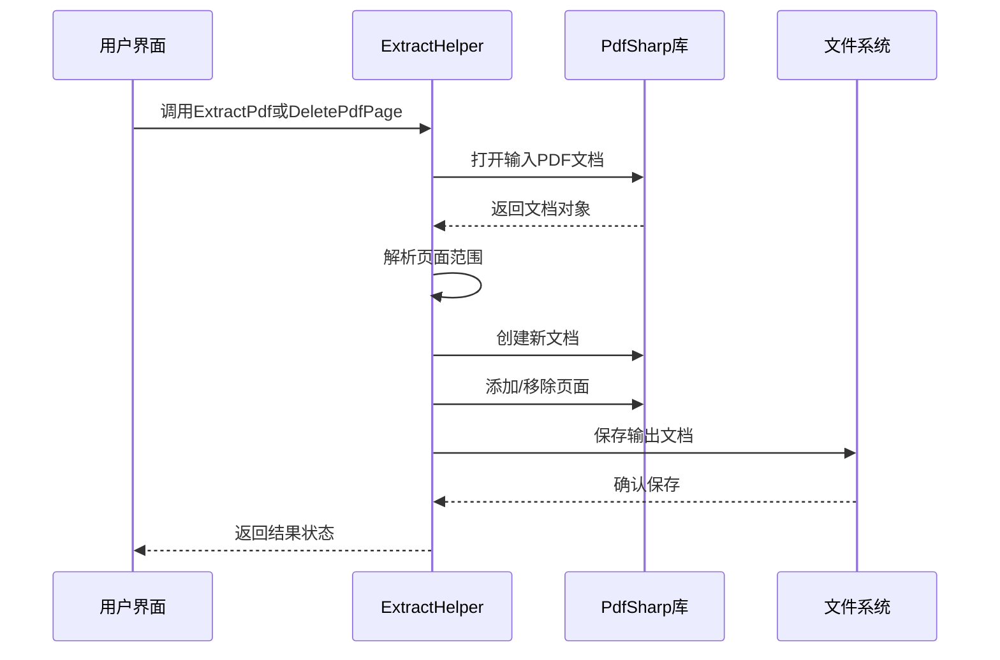
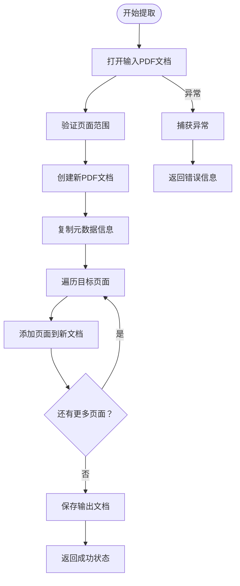
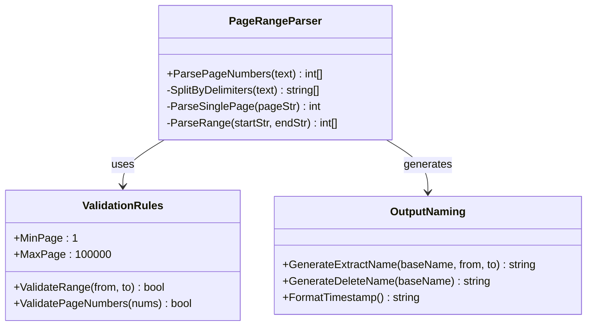
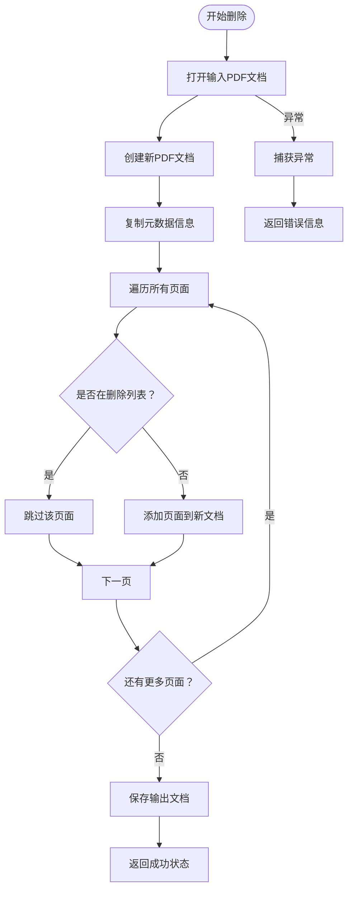
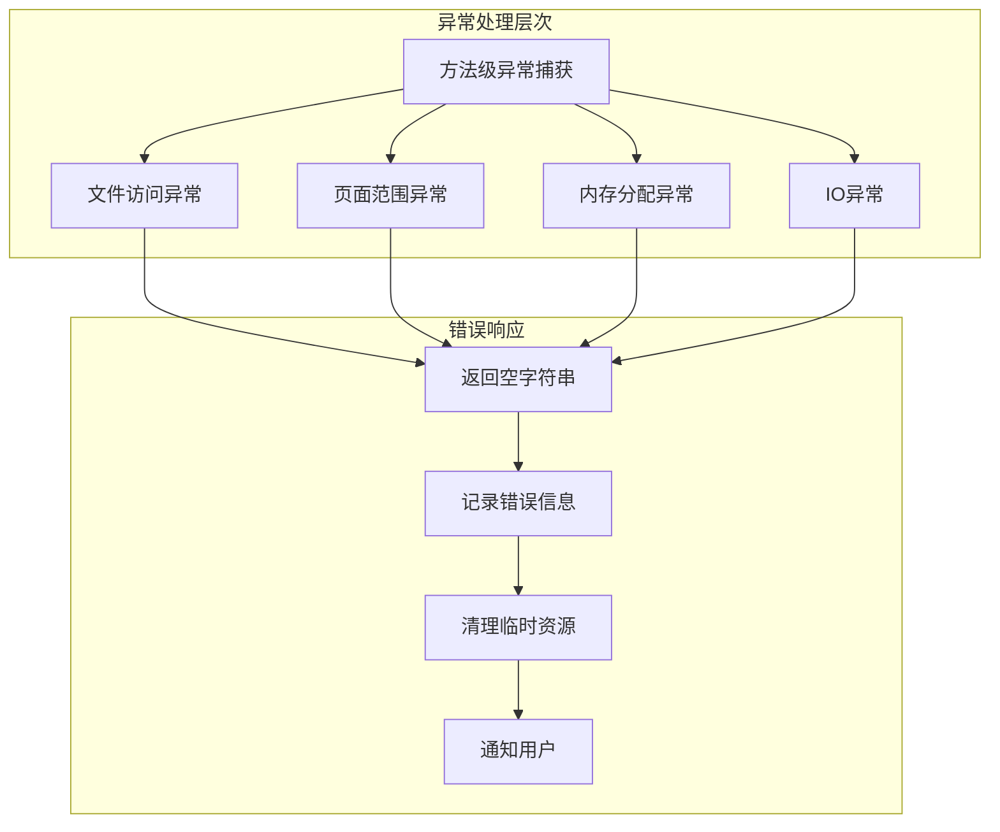
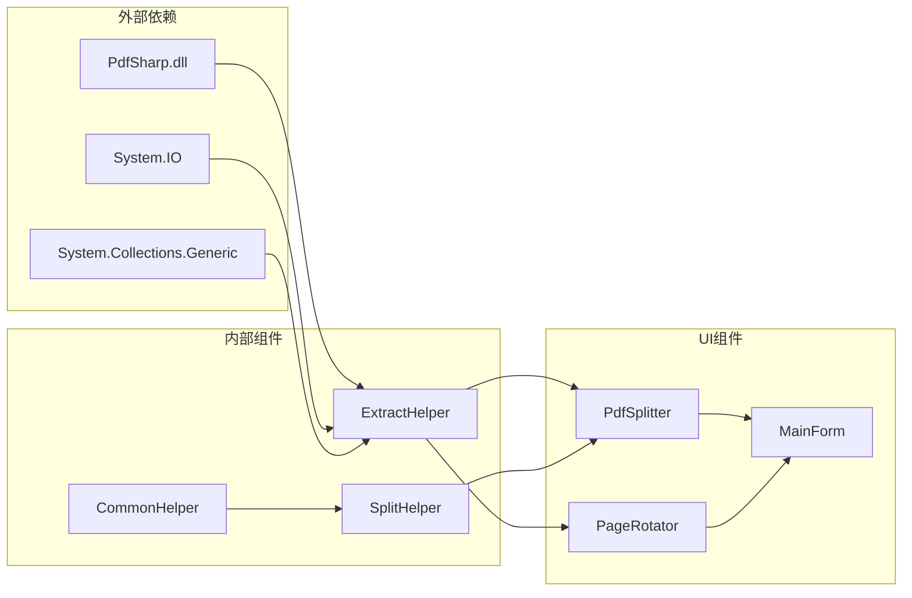
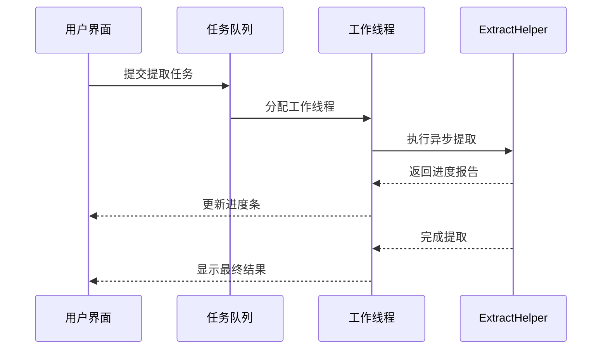
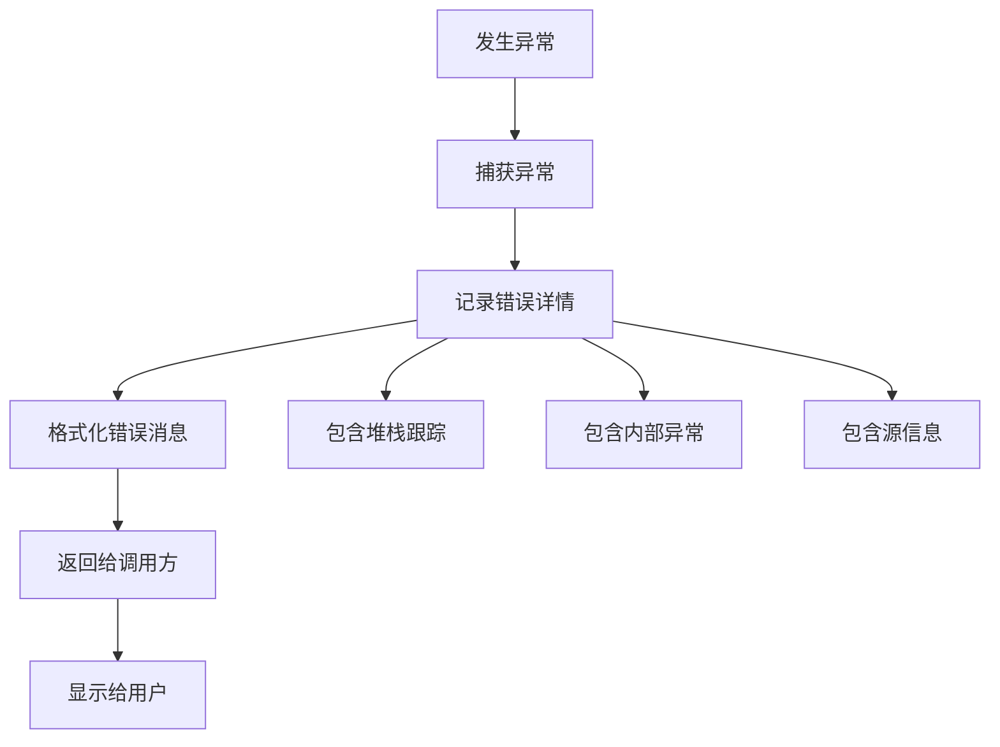

# PDF提取功能文档

<cite>
**本文档引用的文件**
- [ExtractHelper.cs](file://PdfHelperLibrary/ExtractHelper.cs)
- [ExtractHelper.cs](file://PdfHelperLibraryX/ExtractHelper.cs)
- [PdfSplitter.cs](file://PdfTool/PdfSplitter.cs)
- [PageRotator.cs](file://PdfTool/PageRotator.cs)
- [MainForm.cs](file://PdfTool/MainForm.cs)
</cite>

## 目录
1. [简介](#简介)
2. [项目结构](#项目结构)
3. [核心组件](#核心组件)
4. [架构概览](#架构概览)
5. [详细组件分析](#详细组件分析)
6. [依赖关系分析](#依赖关系分析)
7. [性能考虑](#性能考虑)
8. [故障排除指南](#故障排除指南)
9. [结论](#结论)

## 简介

PdfTool项目提供了一套完整的PDF文档处理工具，其中ExtractHelper类是PDF提取功能的核心组件。该功能专注于页面级操作，支持从PDF文档中提取指定页面范围或删除特定页面，为用户提供了灵活而强大的文档管理能力。

本文档将深入分析ExtractHelper类提供的PDF提取功能，详细说明页面范围解析、文档创建、元数据保留以及异常处理机制，帮助开发者理解和使用这一核心功能。

## 项目结构

PdfTool项目采用模块化架构设计，主要包含以下核心模块：

**图表来源**
- [MainForm.cs](file://PdfTool/MainForm.cs#L1-L50)
- [PdfSplitter.cs](file://PdfTool/PdfSplitter.cs#L1-L30)

**节来源**
- [MainForm.cs](file://PdfTool/MainForm.cs#L1-L194)
- [PdfSplitter.cs](file://PdfTool/PdfSplitter.cs#L1-L230)

## 核心组件

### ExtractHelper类概述

ExtractHelper类是一个静态工具类，提供两个核心方法用于PDF页面操作：

1. **ExtractPdf方法** - 提取指定页面范围的PDF文档
2. **DeletePdfPage方法** - 删除指定页面并生成新文档

这两个方法都基于PdfSharp库实现，支持完整的异常处理和元数据保留功能。

### 页面范围解析机制

系统支持多种页面范围格式的解析：

- **单个页面**：如"5"表示第5页
- **连续范围**：如"1-5"表示第1页到第5页
- **混合格式**：如"1,3,5-9"表示第1页、第3页、第5页到第9页

**节来源**
- [ExtractHelper.cs](file://PdfHelperLibrary/ExtractHelper.cs#L1-L77)
- [PageRotator.cs](file://PdfTool/PageRotator.cs#L46-L71)

## 架构概览

PDF提取功能的整体架构采用分层设计，确保功能的可维护性和扩展性：

**图表来源**
- [ExtractHelper.cs](file://PdfHelperLibrary/ExtractHelper.cs#L20-L45)
- [ExtractHelper.cs](file://PdfHelperLibrary/ExtractHelper.cs#L47-L74)

## 详细组件分析

### 页面提取功能

#### ExtractPdf方法实现

ExtractPdf方法实现了精确的页面范围提取功能：

**图表来源**
- [ExtractHelper.cs](file://PdfHelperLibrary/ExtractHelper.cs#L20-L45)

#### 页面范围解析算法

系统采用智能解析算法处理复杂的页面范围输入：

**图表来源**
- [PageRotator.cs](file://PdfTool/PageRotator.cs#L46-L71)
- [PdfSplitter.cs](file://PdfTool/PdfSplitter.cs#L92-L98)

**节来源**
- [ExtractHelper.cs](file://PdfHelperLibrary/ExtractHelper.cs#L20-L45)
- [PageRotator.cs](file://PdfTool/PageRotator.cs#L46-L71)

### 页面删除功能

#### DeletePdfPage方法实现

DeletePdfPage方法实现了逆向逻辑的页面删除功能：

**图表来源**
- [ExtractHelper.cs](file://PdfHelperLibrary/ExtractHelper.cs#L47-L74)

#### 元数据保留机制

系统在创建新文档时自动保留原始文档的重要元数据：

| 元数据字段 | 保留策略 | 示例值 |
|-----------|---------|--------|
| 文档标题 | 前缀添加 | "Page 1 to 5 of 原始标题" |
| 创建者信息 | 完全保留 | 原始创建者名称 |
| 文档版本 | 完全保留 | PDF 1.4/1.7等版本信息 |
| 创建时间 | 自动更新 | 当前时间戳 |

**节来源**
- [ExtractHelper.cs](file://PdfHelperLibrary/ExtractHelper.cs#L47-L74)

### 异常处理机制

#### 错误处理层次

系统采用多层异常处理策略：

**图表来源**
- [ExtractHelper.cs](file://PdfHelperLibrary/ExtractHelper.cs#L40-L45)
- [ExtractHelper.cs](file://PdfHelperLibrary/ExtractHelper.cs#L69-L74)

#### 常见异常类型及处理

| 异常类型 | 触发条件 | 处理方式 | 用户提示 |
|---------|---------|---------|---------|
| FileNotFoundException | 输入文件不存在 | 返回空字符串 | 文件访问失败 |
| IOException | 文件被占用或权限不足 | 返回错误消息 | 文件正在使用中 |
| ArgumentException | 页面范围无效 | 验证后拒绝执行 | 页码格式错误 |
| OutOfMemoryException | 内存不足 | 捕获并释放资源 | 内存不足，请关闭其他程序 |

**节来源**
- [ExtractHelper.cs](file://PdfHelperLibrary/ExtractHelper.cs#L40-L45)
- [ExtractHelper.cs](file://PdfHelperLibrary/ExtractHelper.cs#L69-L74)

## 依赖关系分析

### 核心依赖关系

**图表来源**
- [ExtractHelper.cs](file://PdfHelperLibrary/ExtractHelper.cs#L1-L6)
- [PdfSplitter.cs](file://PdfTool/PdfSplitter.cs#L1-L6)

### 版本兼容性

系统支持多个版本的ExtractHelper实现：

- **PdfHelperLibrary**：标准版本，包含完整功能
- **PdfHelperLibraryX**：简化版本，去除了部分调试信息

**节来源**
- [ExtractHelper.cs](file://PdfHelperLibrary/ExtractHelper.cs#L1-L77)
- [ExtractHelper.cs](file://PdfHelperLibraryX/ExtractHelper.cs#L1-L74)

## 性能考虑

### 内存管理优化

1. **流式处理**：大文档采用流式读取，避免一次性加载整个文件
2. **及时释放**：使用using语句确保资源及时释放
3. **分批处理**：对于大量页面的操作，采用分批处理策略

### 并发处理支持

虽然当前实现是同步的，但架构设计支持未来的异步扩展：

## 故障排除指南

### 常见问题及解决方案

#### 文件访问问题

**问题**：无法打开PDF文件
**原因**：文件被其他程序占用或权限不足
**解决方案**：
1. 确保文件没有被其他PDF阅读器打开
2. 检查文件读写权限
3. 尝试以管理员身份运行程序

#### 页面范围错误

**问题**：指定的页面范围超出文档范围
**原因**：输入的页码超出了实际文档的页面数量
**解决方案**：
1. 使用CommonHelper.GetPageCount()方法获取准确的页面数量
2. 系统会自动截断超出范围的页码
3. 在用户界面中添加范围验证提示

#### 内存不足问题

**问题**：处理大型PDF文件时出现内存不足
**原因**：文档过大或系统内存有限
**解决方案**：
1. 分批处理大型文档
2. 关闭其他占用内存的应用程序
3. 考虑升级系统内存

**节来源**
- [ExtractHelper.cs](file://PdfHelperLibrary/ExtractHelper.cs#L40-L45)
- [ExtractHelper.cs](file://PdfHelperLibrary/ExtractHelper.cs#L69-L74)

### 调试和日志记录

系统提供详细的错误信息返回机制：

**图表来源**
- [ExtractHelper.cs](file://PdfHelperLibrary/ExtractHelper.cs#L40-L45)

## 结论

PdfTool的PDF提取功能通过ExtractHelper类提供了强大而灵活的页面级操作能力。该功能具有以下优势：

1. **功能完整性**：支持页面提取和删除两种核心操作
2. **用户友好**：提供直观的页面范围输入格式
3. **健壮性**：完善的异常处理和错误恢复机制
4. **性能优化**：合理的内存管理和资源释放策略
5. **扩展性**：模块化设计便于功能扩展和维护

该功能在实际应用场景中表现出色，能够满足从学术论文摘要提取到商业文档编辑的各种需求。通过持续的优化和改进，PdfTool将继续为用户提供更加优秀的PDF文档处理体验。