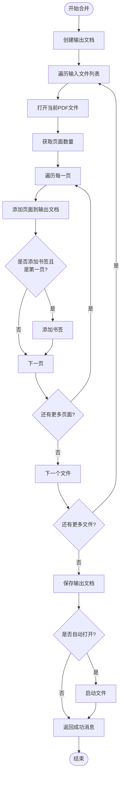
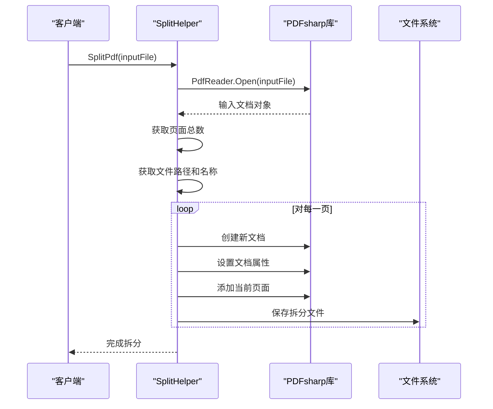
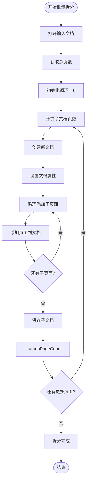
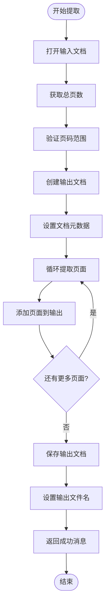
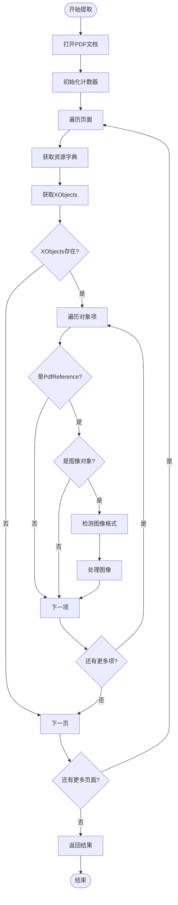
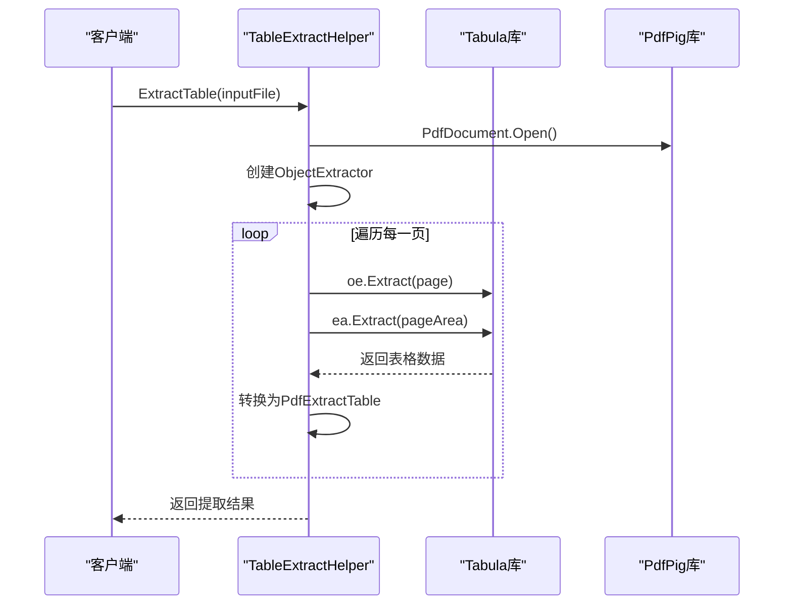
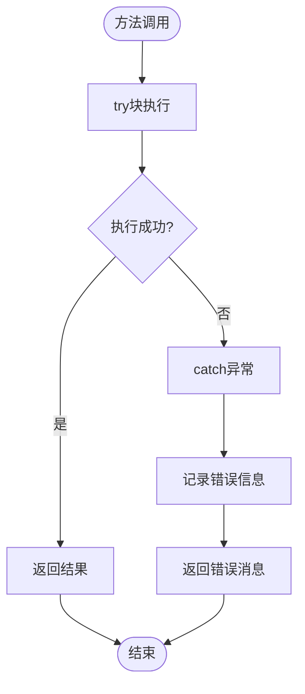
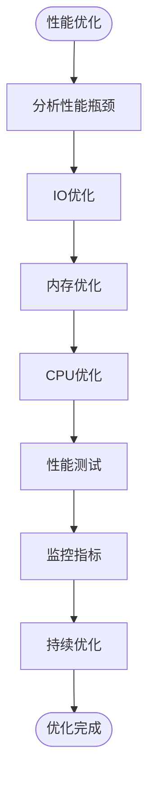

# 业务逻辑层

<cite>
**本文档中引用的文件**
- [MergeHelper.cs](file://PdfHelperLibrary/MergeHelper.cs)
- [SplitHelper.cs](file://PdfHelperLibrary/SplitHelper.cs)
- [ExtractHelper.cs](file://PdfHelperLibrary/ExtractHelper.cs)
- [CommonHelper.cs](file://PdfHelperLibrary/CommonHelper.cs)
- [ImageExtractHelper.cs](file://PdfHelperLibrary/ImageExtractHelper.cs)
- [TableExtractHelper.cs](file://PdfHelperLibrary/TableExtractHelper.cs)
- [Builder.cs](file://PdfHelperLibrary/Builder.cs)
- [ProtectHelper.cs](file://PdfHelperLibrary/ProtectHelper.cs)
- [CompressHelper.cs](file://PdfHelperLibrary/CompressHelper.cs)
- [WatermarkHelper.cs](file://PdfHelperLibrary/WatermarkHelper.cs)
- [PdfMerger.cs](file://PdfTool/PdfMerger.cs)
- [PdfSplitter.cs](file://PdfTool/PdfSplitter.cs)
</cite>

## 目录
1. [概述](#概述)
2. [核心Helper类架构](#核心helper类架构)
3. [MergeHelper - PDF合并助手](#mergehelper---pdf合并助手)
4. [SplitHelper - PDF拆分助手](#splithelper---pdf拆分助手)
5. [ExtractHelper - PDF提取助手](#extracthelper---pdf提取助手)
6. [辅助Helper类](#辅助helper类)
7. [静态类设计模式分析](#静态类设计模式分析)
8. [异常处理与资源管理](#异常处理与资源管理)
9. [性能优化策略](#性能优化策略)
10. [最佳实践总结](#最佳实践总结)

## 概述

PdfTool项目中的PdfHelperLibrary系列库是PDF文档处理的核心业务逻辑层，采用静态类设计模式封装了复杂的PDF操作。该系列库主要包含以下核心组件：

- **MergeHelper**：负责PDF文件的合并操作
- **SplitHelper**：提供PDF文件的拆分功能
- **ExtractHelper**：实现PDF页面的提取和删除功能
- **辅助Helper类**：包括图像提取、表格提取、文档保护等功能

这些Helper类通过统一的静态方法接口，为上层应用提供了简洁易用的API，同时充分利用PDFsharp库的强大功能来处理各种PDF操作。

## 核心Helper类架构

```mermaid
classDiagram
class MergeHelper {
+MergePdf(inputList, autoOpen, addBookmarks, out output) string
+MergePdf(inputList, autoOpen, addBookmarks, output) tuple
}
class SplitHelper {
+SplitPdf(inputFile) void
+SplitPdf(inputFile, pageCount) string
}
class ExtractHelper {
+ExtractPdf(inputFile, pageFrom, pageTo, out output) string
+DeletePdfPage(inputFile, pageNums, out output) string
}
class CommonHelper {
+GetPageCount(inputFile) int
}
class ImageExtractHelper {
+ExportImage(inputFile) string
+ExportImages(fileList) string[]
}
class TableExtractHelper {
+ExtractTable(inputStream) tuple
+ExtractTable(inputFile) tuple
+ExtractTableRows(inputStream) tuple
+ExtractTableRows(inputFile) tuple
}
class Builder {
+Image2Pdf(imgList, output) void
+InsertImage2Pdf(input, imgList, output) void
}
class ProtectHelper {
+Protect(inputFile, outputFile, password) string
+Unprotect(inputFile, outputFile, password) string
}
class CompressHelper {
+Compress(inputFile, outputFile) string
}
class WatermarkHelper {
+WatermarkPdf(inputFile, watermark) string
}
MergeHelper --> CommonHelper : "使用"
SplitHelper --> CommonHelper : "使用"
ExtractHelper --> CommonHelper : "使用"
ImageExtractHelper --> CommonHelper : "使用"
TableExtractHelper --> CommonHelper : "使用"
```



**图表来源**
- [MergeHelper.cs](file://PdfHelperLibrary/MergeHelper.cs#L1-L75)
- [SplitHelper.cs](file://PdfHelperLibrary/SplitHelper.cs#L1-L70)
- [ExtractHelper.cs](file://PdfHelperLibrary/ExtractHelper.cs#L1-L77)
- [CommonHelper.cs](file://PdfHelperLibrary/CommonHelper.cs#L1-L29)

## MergeHelper - PDF合并助手

MergeHelper是PDF合并操作的核心实现类，提供了两种重载方法来满足不同的使用场景。

### 方法设计分析

MergeHelper提供了两个重载的`MergePdf`方法：

#### 方法一：out参数模式
```csharp
public static string MergePdf(List<string> inputPdfFilenameList, bool autoOpen, bool addBookmarks, out string outputPdfFilename)
```

#### 方法二：元组返回模式  
```csharp
public static (string, string) MergePdf(List<string> inputPdfFilenameList, bool autoOpen, bool addBookmarks, string outputPdfFilename)
```

### 设计考量

**out参数模式的优势：**
- 符合C#传统编程习惯
- 参数传递更加直观
- 适用于需要明确区分返回值和输出参数的场景

**元组返回模式的优势：**
- 单次调用即可获取所有结果
- 减少参数数量，提高代码可读性
- 更符合现代C#编程风格

### 合并算法实现



**图表来源**
- [MergeHelper.cs](file://PdfHelperLibrary/MergeHelper.cs#L16-L72)

### 实现细节

1. **文档创建**：每次合并操作都创建新的`PdfDocument`实例
2. **页面复制**：使用`outputDocument.AddPage()`方法逐页复制
3. **书签添加**：仅在第一个文件的第一页添加书签
4. **文件命名**：自动生成时间戳格式的输出文件名
5. **异常处理**：捕获所有异常并返回详细的错误信息

**章节来源**
- [MergeHelper.cs](file://PdfHelperLibrary/MergeHelper.cs#L1-L75)

## SplitHelper - PDF拆分助手

SplitHelper提供了灵活的PDF拆分功能，支持单页拆分和批量拆分两种模式。

### 拆分模式对比

| 模式 | 方法签名 | 功能描述 | 使用场景 |
|------|----------|----------|----------|
| 单页拆分 | `SplitPdf(string inputPdfFileName)` | 将每个页面拆分为独立的PDF文件 | 需要单独处理每页内容 |
| 批量拆分 | `SplitPdf(string inputPdfFileName, int pageCountPerDoc)` | 按指定页数拆分PDF | 需要控制输出文件大小 |

### 单页拆分算法



**图表来源**
- [SplitHelper.cs](file://PdfHelperLibrary/SplitHelper.cs#L13-L29)

### 批量拆分算法

批量拆分采用了更智能的分组策略：



**图表来源**
- [SplitHelper.cs](file://PdfHelperLibrary/SplitHelper.cs#L37-L60)

### 文件命名规则

- **单页拆分**：`原文件名 - Page 1.pdf`, `原文件名 - Page 2.pdf`...
- **批量拆分**：`原文件名 - Page 1-5.pdf`, `原文件名 - Page 6-10.pdf`...

**章节来源**
- [SplitHelper.cs](file://PdfHelperLibrary/SplitHelper.cs#L1-L70)

## ExtractHelper - PDF提取助手

ExtractHelper实现了PDF页面的精确提取和删除功能，提供了两个核心方法。

### 页面提取功能

```csharp
public static string ExtractPdf(string inputPdfFileName, int pageFrom, int pageTo, out string outputPdfFileName)
```

#### 提取算法流程



**图表来源**
- [ExtractHelper.cs](file://PdfHelperLibrary/ExtractHelper.cs#L20-L38)

### 页面删除功能

```csharp
public static string DeletePdfPage(string inputPdfFileName, List<int> pageNums, out string outputPdfFileName)
```

#### 删除算法特点

1. **页码过滤**：使用`Contains`方法判断是否保留某页
2. **索引转换**：将用户输入的页码转换为零基索引
3. **批量处理**：一次性处理多个要删除的页码

### 错误处理机制

ExtractHelper采用了双重异常处理策略：
- **外部异常**：捕获所有运行时异常，返回详细错误信息
- **输出参数**：确保即使发生异常也能返回空字符串

**章节来源**
- [ExtractHelper.cs](file://PdfHelperLibrary/ExtractHelper.cs#L1-L77)

## 辅助Helper类

### ImageExtractHelper - 图像提取助手

ImageExtractHelper专门负责从PDF文档中提取嵌入的图像资源。

#### 支持的图像格式

| 格式 | 编解码器 | 输出扩展名 | 处理方式 |
|------|----------|------------|----------|
| JPEG | DCTDecode | .jpeg | 直接写入流 |
| PNG | FlateDecode | .png | 需要格式转换 |
| 压缩JPEG | FlateDecode + DCTDecode | .jpeg | 先解压缩再处理 |
| CCITT Fax | CCITTFaxDecode | .tiff | 使用GDI+处理 |

#### 图像提取流程



**图表来源**
- [ImageExtractHelper.cs](file://PdfHelperLibrary/ImageExtractHelper.cs#L17-L40)

### TableExtractHelper - 表格提取助手

TableExtractHelper集成了Tabula库，专门用于从PDF文档中提取表格数据。

#### 数据结构定义

```csharp
public class PdfExtractTable
{
    public List<PdfExtractRow> Rows;
}

public class PdfExtractRow
{
    public List<string> Cells;
}
```

#### 提取算法



**图表来源**
- [TableExtractHelper.cs](file://PdfHelperLibrary/TableExtractHelper.cs#L51-L71)

### Builder - 文档生成器

Builder类提供了PDF文档生成的基础功能，支持图像到PDF的转换。

#### 功能特性

1. **纯图像生成**：直接将多张图像合并为PDF
2. **插入式生成**：在现有PDF中插入图像
3. **自动布局**：根据图像尺寸自动调整页面方向

**章节来源**
- [ImageExtractHelper.cs](file://PdfHelperLibrary/ImageExtractHelper.cs#L1-L182)
- [TableExtractHelper.cs](file://PdfHelperLibrary/TableExtractHelper.cs#L1-L106)
- [Builder.cs](file://PdfHelperLibrary/Builder.cs#L1-L56)

## 静态类设计模式分析

### 设计优势

1. **无状态设计**：所有Helper类都是无状态的，避免了线程安全问题
2. **简单调用**：无需实例化，直接通过类名调用方法
3. **资源高效**：静态方法减少了对象创建的开销
4. **易于测试**：没有依赖注入，单元测试更加简单

### 局限性

1. **扩展困难**：难以通过继承扩展功能
2. **依赖注入缺失**：无法灵活配置依赖
3. **状态管理**：不适合需要维护状态的场景

### 改进建议

考虑引入工厂模式或依赖注入容器，为需要复杂配置的场景提供更好的灵活性。

## 异常处理与资源管理

### 异常处理策略



### 资源管理最佳实践

1. **using语句**：对所有实现了IDisposable的资源使用using语句
2. **异常安全**：确保在异常情况下资源能够正确释放
3. **文件操作**：使用File.Copy和File.SetAttributes进行文件操作
4. **进程管理**：使用Process.Start启动外部程序

### 内存管理策略

1. **及时释放**：使用using语句确保PDF文档及时释放
2. **流处理**：对大文件采用流式处理
3. **缓存控制**：避免在Helper类中引入不必要的缓存

**章节来源**
- [MergeHelper.cs](file://PdfHelperLibrary/MergeHelper.cs#L18-L41)
- [SplitHelper.cs](file://PdfHelperLibrary/SplitHelper.cs#L39-L66)
- [ExtractHelper.cs](file://PdfHelperLibrary/ExtractHelper.cs#L22-L44)

## 性能优化策略

### 大文件处理优化

1. **分批处理**：对于超大PDF文件，考虑分批加载和处理
2. **内存监控**：监控内存使用情况，及时释放不需要的对象
3. **异步处理**：对于耗时操作，考虑使用异步模式

### 算法优化

1. **页面预加载**：对于频繁访问的页面，考虑预加载策略
2. **缓存机制**：对重复操作的结果进行缓存
3. **并行处理**：对于独立的处理任务，考虑并行化

### 具体优化建议



### 性能监控指标

| 指标 | 描述 | 目标值 |
|------|------|--------|
| 处理速度 | 每秒处理的页面数 | >100页/秒 |
| 内存使用 | 峰值内存占用 | <500MB |
| 响应时间 | 用户操作响应时间 | <2秒 |
| 错误率 | 处理失败比例 | <1% |

## 最佳实践总结

### 开发原则

1. **单一职责**：每个Helper类专注于特定的功能领域
2. **接口一致性**：保持方法签名的一致性
3. **异常友好**：提供清晰的错误信息和处理建议
4. **资源安全**：确保所有资源都能正确释放

### 使用建议

1. **输入验证**：在调用Helper类之前验证输入参数
2. **错误处理**：始终检查返回的错误信息
3. **进度反馈**：对于长时间操作，提供进度反馈
4. **日志记录**：记录关键操作的日志信息

### 扩展指南

1. **继承关系**：新功能可以通过继承现有Helper类来扩展
2. **组合模式**：通过组合多个Helper类来实现复杂功能
3. **插件架构**：为特殊需求提供插件扩展点

### 未来发展方向

1. **异步支持**：为所有方法提供异步版本
2. **配置化**：增加更多的配置选项
3. **插件系统**：支持第三方扩展
4. **云服务集成**：提供云端处理能力

通过深入分析PdfTool项目中的PdfHelperLibrary系列库，我们可以看到这是一个设计良好、功能完备的PDF处理业务逻辑层。它不仅提供了丰富的PDF操作功能，还展现了良好的软件工程实践，为开发者提供了强大而易用的PDF处理解决方案。