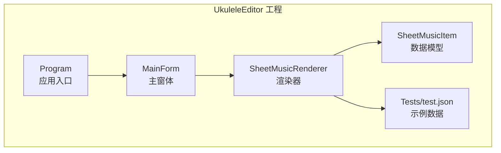
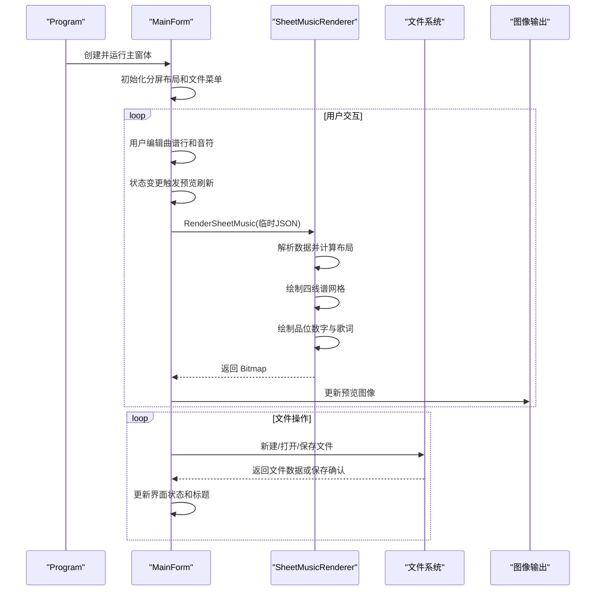
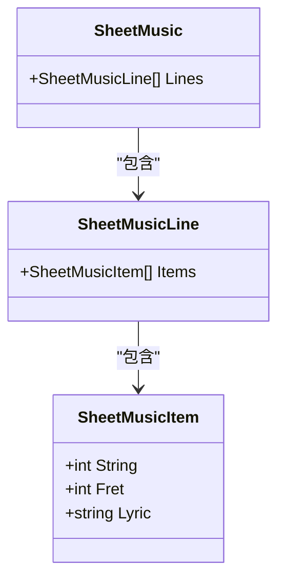
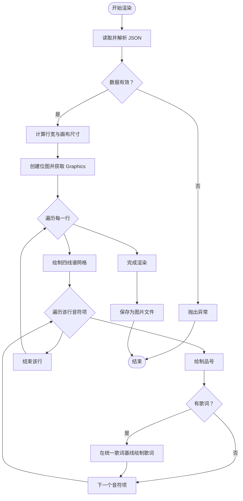
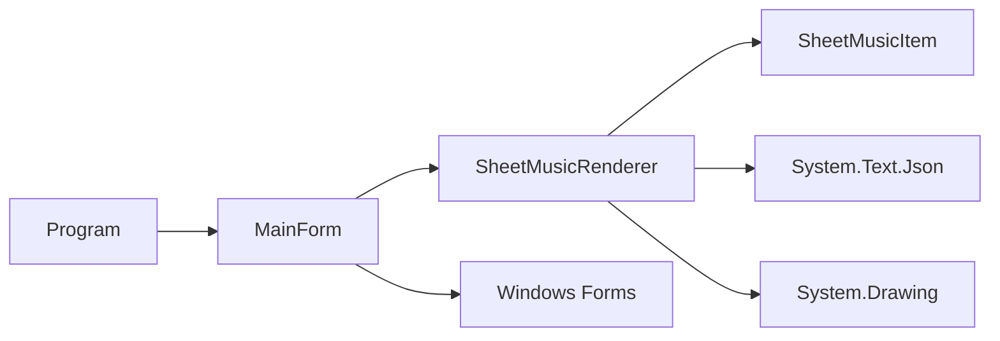

# 尤克里里乐谱编辑器

<cite>
**本文引用的文件**
- [MainForm.cs](file://UkuleleEditor/MainForm.cs)
- [MainForm.Designer.cs](file://UkuleleEditor/MainForm.Designer.cs)
- [Program.cs](file://UkuleleEditor/Program.cs)
- [SheetMusicItem.cs](file://UkuleleEditor/SheetMusicItem.cs)
- [SheetMusicRenderer.cs](file://UkuleleEditor/SheetMusicRenderer.cs)
- [UkuleleEditor.csproj](file://UkuleleEditor/UkuleleEditor.csproj)
- [test.json](file://UkuleleEditor/Tests/test.json)
</cite>

## 更新摘要
**变更内容**
- 将文档从仅描述渲染功能的静态说明，扩展为涵盖完整用户交互流程的综合性指南
- 新增了主界面布局、文件菜单系统、曲谱行管理、音符编辑器和预览区域的详细说明
- 更新了架构总览和详细组件分析以反映新的UI交互流程
- 重构了故障排除指南以包含新的用户交互场景

## 目录
1. [简介](#简介)
2. [项目结构](#项目结构)
3. [核心组件](#核心组件)
4. [架构总览](#架构总览)
5. [详细组件分析](#详细组件分析)
6. [依赖关系分析](#依赖关系分析)
7. [性能考虑](#性能考虑)
8. [故障排除指南](#故障排除指南)
9. [结论](#结论)
10. [附录](#附录)

## 简介
本项目是一个基于 Windows Forms 的尤克里里乐谱编辑器，核心功能是将 JSON 格式的乐谱数据渲染为图片输出。程序通过解析包含多行音符信息的 JSON 文件，每行由若干"音符项"组成，每个音符项包含弦号、品号与可选歌词；渲染器会根据这些数据绘制四线谱网格、品位数字以及统一的歌词基线，并最终保存为图像文件。项目已从基础实现阶段发展为具备完整图形化编辑界面的应用程序，支持用户通过分屏布局进行交互式编辑，包含曲谱行列表、音符编辑器和实时预览功能，并实现了完整的文件操作菜单系统。

## 项目结构
- UkuleleEditor：主应用工程，包含窗体入口、渲染器与数据模型。
- Tests：包含默认测试数据文件，演示如何组织乐谱行与音符项。
- 依赖：使用 .NET 8、Windows Forms、System.Text.Json 进行序列化与绘图。

图表来源
- [MainForm.cs](file://UkuleleEditor/MainForm.cs#L1-L472)
- [Program.cs](file://UkuleleEditor/Program.cs#L1-L17)
- [SheetMusicRenderer.cs](file://UkuleleEditor/SheetMusicRenderer.cs#L1-L142)
- [SheetMusicItem.cs](file://UkuleleEditor/SheetMusicItem.cs#L1-L44)
- [test.json](file://UkuleleEditor/Tests/test.json#L1-L112)

章节来源
- [UkuleleEditor.csproj](file://UkuleleEditor/UkuleleEditor.csproj#L1-L24)

## 核心组件
- 数据模型
  - SheetMusic：包含多行曲谱行集合。
  - SheetMusicLine：包含一组音符项。
  - SheetMusicItem：包含弦号、品号与可选歌词。
- 渲染器
  - SheetMusicRenderer：负责将 JSON 数据转换为位图图像，绘制四线谱网格、品位数字与统一歌词基线。
- 应用入口
  - Program：设置高 DPI 与默认字体后启动主窗体。
  - MainForm：实现分屏布局的主窗体，包含编辑面板（曲谱行列表和音符编辑器）和预览区域，以及文件菜单系统。

章节来源
- [SheetMusicItem.cs](file://UkuleleEditor/SheetMusicItem.cs#L1-L44)
- [SheetMusicRenderer.cs](file://UkuleleEditor/SheetMusicRenderer.cs#L1-L142)
- [Program.cs](file://UkuleleEditor/Program.cs#L1-L17)
- [MainForm.cs](file://UkuleleEditor/MainForm.cs#L1-L472)

## 架构总览
渲染流程自上而下的调用链如下：
- Program 启动应用并创建 MainForm。
- MainForm 初始化分屏布局的窗体，左侧为编辑面板（包含曲谱行列表和当前行音符编辑器），右侧为预览区域，并设置文件菜单系统。
- 用户通过曲谱行列表和音符编辑器进行交互，修改乐谱数据。
- 当用户触发刷新或数据发生变化时，调用 SheetMusicRenderer.RenderSheetMusic 将当前数据渲染为预览图像。
- 用户可通过文件菜单进行新建、打开、保存等操作，系统会跟踪修改状态并在关闭时提示保存。

图表来源
- [Program.cs](file://UkuleleEditor/Program.cs#L1-L17)
- [MainForm.cs](file://UkuleleEditor/MainForm.cs#L1-L472)
- [SheetMusicRenderer.cs](file://UkuleleEditor/SheetMusicRenderer.cs#L1-L142)
- [test.json](file://UkuleleEditor/Tests/test.json#L1-L112)

## 详细组件分析

### 数据模型：SheetMusicItem、SheetMusicLine、SheetMusic
- 设计要点
  - 使用内部类封装数据结构，避免对外暴露。
  - 采用列表容器承载行与音符项，便于扩展。
  - 字段包含弦号、品号与可选歌词，满足基本乐谱需求。
- 复杂度与性能
  - 结构简单，序列化/反序列化成本低。
  - 遍历渲染时按行与项线性处理，时间复杂度 O(N)（N 为音符总数）。
- 错误处理
  - 渲染器对空数据进行显式检查并抛出异常，避免无效输出。

图表来源
- [SheetMusicItem.cs](file://UkuleleEditor/SheetMusicItem.cs#L1-L44)

章节来源
- [SheetMusicItem.cs](file://UkuleleEditor/SheetMusicItem.cs#L1-L44)

### 渲染器：SheetMusicRenderer
- 功能职责
  - 读取 JSON 文件并反序列化为数据模型。
  - 计算画布尺寸：根据行内音符数量确定行宽，按行数与行间距确定总高度。
  - 绘制四线谱网格：每行固定 4 根弦，等间距排列。
  - 绘制品位数字：每个音符项在其对应弦的中心位置绘制品号。
  - 绘制统一歌词基线：所有歌词在同一行的统一基线下方绘制，按音符横向居中。
- 关键参数
  - 弦数、弦间距、品位单元宽度、整体边距、行间距、歌词偏移量等常量控制布局。
- 性能与优化
  - 使用抗锯齿与文本渲染提示提升视觉质量。
  - 逐行绘制，避免不必要的重绘。
  - 可进一步优化：缓存字体度量、批量绘制、延迟加载字体资源。
- 错误处理
  - 对空数据抛出异常，防止生成空白或错误图像。

图表来源
- [SheetMusicRenderer.cs](file://UkuleleEditor/SheetMusicRenderer.cs#L1-L142)

章节来源
- [SheetMusicRenderer.cs](file://UkuleleEditor/SheetMusicRenderer.cs#L1-L142)

### 应用入口：Program 与 MainForm
- Program
  - 设置应用配置并启动主窗体。
- MainForm
  - 实现分屏布局的主窗体，左侧为编辑面板，右侧为预览区域。
  - 编辑面板包含曲谱行列表和当前行音符编辑器，支持添加、删除和移动行与音符。
  - 预览区域显示实时渲染结果，支持刷新和导出为图片文件。
  - 实现完整的文件菜单系统（新建、打开、保存、另存为、退出），并跟踪修改状态。
  - 窗口标题显示版本信息、当前文件名和修改状态标记。

章节来源
- [Program.cs](file://UkuleleEditor/Program.cs#L1-L17)
- [MainForm.cs](file://UkuleleEditor/MainForm.cs#L1-L472)
- [MainForm.Designer.cs](file://UkuleleEditor/MainForm.Designer.cs#L1-L465)

## 依赖关系分析
- 内部依赖
  - SheetMusicRenderer 依赖 SheetMusicItem 数据模型。
  - MainForm 依赖 SheetMusicRenderer 以执行渲染。
- 外部依赖
  - System.Text.Json：用于 JSON 解析。
  - System.Drawing：用于绘图与位图操作。
  - Windows Forms：用于窗体与应用生命周期管理。
- 项目配置
  - 使用 Newtonsoft.Json 包引用，但当前渲染逻辑使用 System.Text.Json；存在潜在一致性问题，建议统一。

图表来源
- [UkuleleEditor.csproj](file://UkuleleEditor/UkuleleEditor.csproj#L1-L24)
- [MainForm.cs](file://UkuleleEditor/MainForm.cs#L1-L472)
- [SheetMusicRenderer.cs](file://UkuleleEditor/SheetMusicRenderer.cs#L1-L142)
- [SheetMusicItem.cs](file://UkuleleEditor/SheetMusicItem.cs#L1-L44)

章节来源
- [UkuleleEditor.csproj](file://UkuleleEditor/UkuleleEditor.csproj#L1-L24)

## 性能考虑
- 绘图质量
  - 抗锯齿与文本渲染提示已启用，保证输出清晰度。
- 绘制策略
  - 逐行绘制，避免重复计算；字号与字体资源可复用以减少开销。
- 数据规模
  - 当前实现按音符线性处理，适合中小规模乐谱；大规模乐谱建议分页或虚拟化渲染。
- I/O 与序列化
  - JSON 读取与反序列化为一次性操作；可考虑缓存与预热以降低首帧延迟。

## 故障排除指南
- 渲染失败或无输出
  - 检查测试 JSON 是否存在且格式正确。
  - 确认渲染器未抛出"谱面数据为空"的异常。
- 图片未生成
  - 确认渲染流程已执行并保存目标路径可写。
- 版本信息显示异常
  - 若程序集版本不可用，窗体会回退到产品版本；确保构建配置正确。
- 字体与字符显示问题
  - 默认字体可能在某些系统上缺失；可调整字体或提供字体资源。
- 文件操作失败
  - 检查文件路径是否存在且可访问。
  - 确认文件格式为有效的 JSON 结构。
  - 检查磁盘空间是否充足。
- 预览不更新
  - 确认数据变更后已触发刷新操作。
  - 检查临时文件创建和删除权限。
- 界面响应缓慢
  - 对于大型乐谱文件，考虑优化渲染频率或实现分页加载。

章节来源
- [MainForm.cs](file://UkuleleEditor/MainForm.cs#L1-L472)
- [SheetMusicRenderer.cs](file://UkuleleEditor/SheetMusicRenderer.cs#L1-L142)
- [test.json](file://UkuleleEditor/Tests/test.json#L1-L112)

## 结论
本项目实现了尤克里里乐谱的基础渲染能力：通过 JSON 描述乐谱行与音符项，渲染器绘制四线谱网格、品位数字与统一歌词基线，并输出为图片。当前版本已发展为具备完整图形化编辑界面的应用程序，支持用户通过分屏布局进行交互式编辑，包含曲谱行列表、音符编辑器和实时预览功能，并实现了完整的文件操作菜单系统。后续可扩展为支持更多视觉样式、导入导出多种格式、云同步等功能。

## 附录
- 测试数据说明
  - 示例 JSON 包含两行音符，每行包含多个音符项，每个音符项包含弦号、品号与可选歌词。
- 使用建议
  - 将自定义乐谱按示例 JSON 结构组织，放置于 Tests 目录以便调试。
  - 如需扩展功能，可在 MainForm 中增加用户交互控件，并将渲染结果绑定到可视化面板。