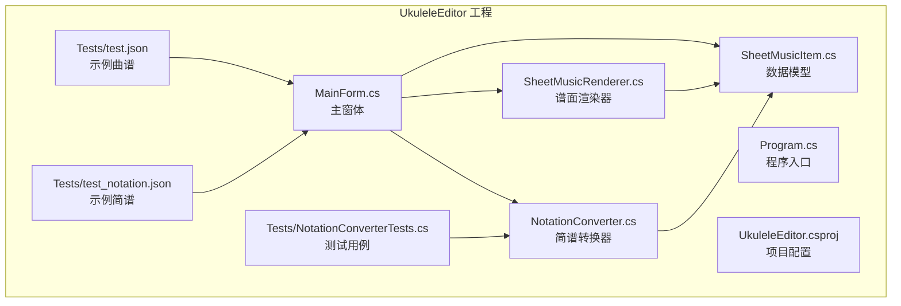
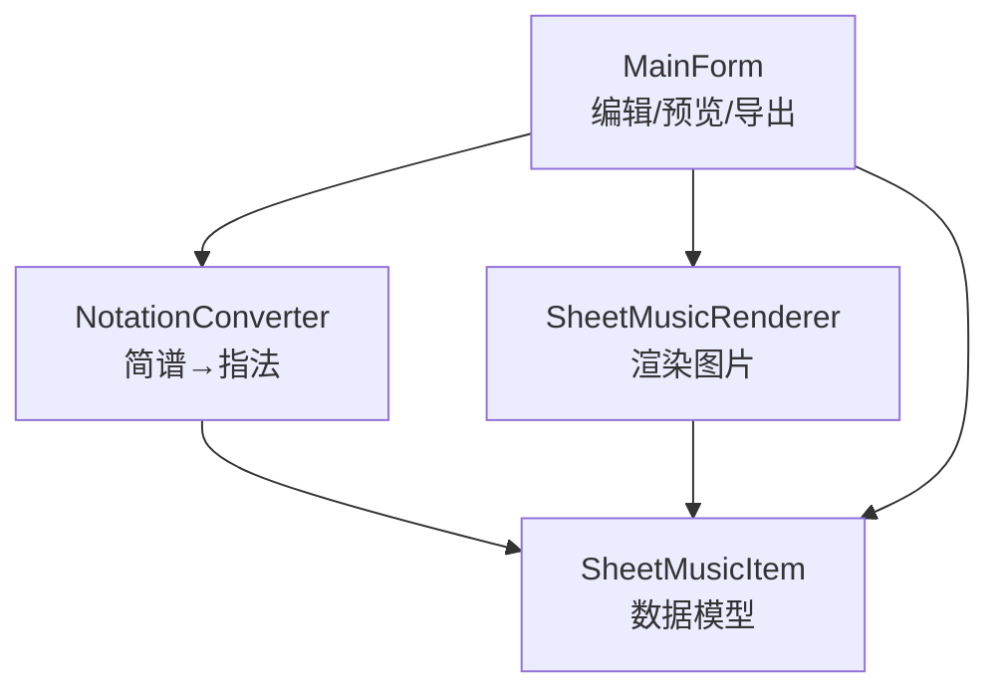
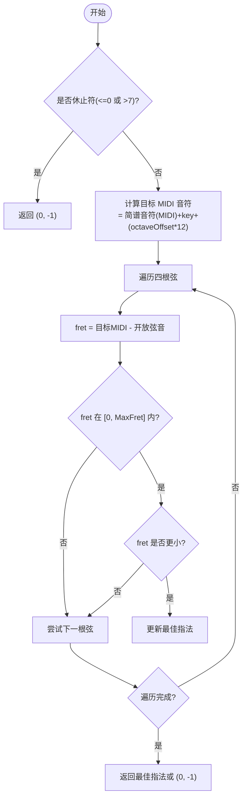
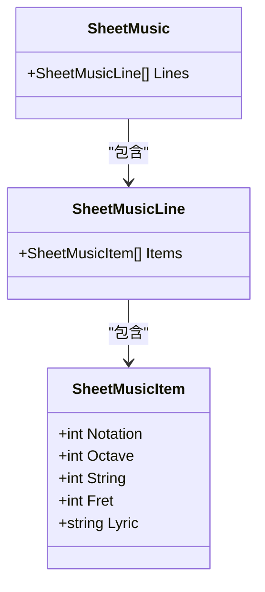
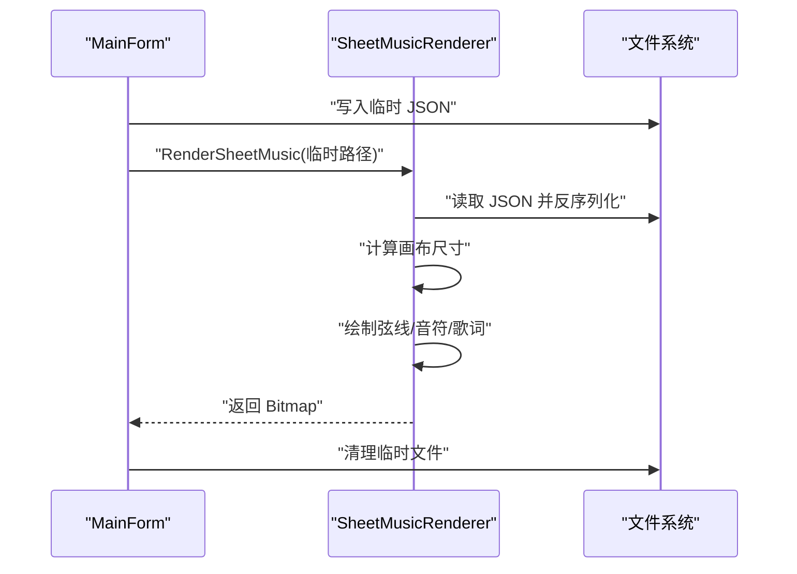
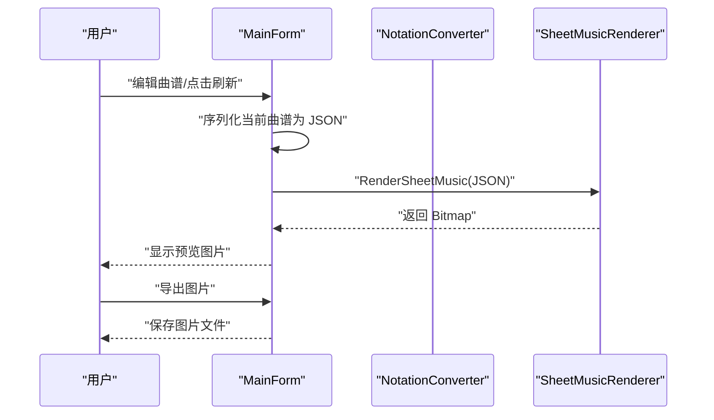
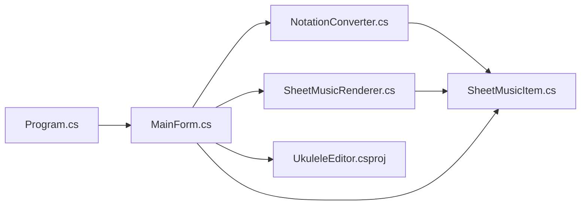

# 简谱转指法转换器

<cite>
**本文引用的文件**
- [UkuleleEditor/NotationConverter.cs](file://UkuleleEditor/NotationConverter.cs)
- [UkuleleEditor/SheetMusicItem.cs](file://UkuleleEditor/SheetMusicItem.cs)
- [UkuleleEditor/SheetMusicRenderer.cs](file://UkuleleEditor/SheetMusicRenderer.cs)
- [UkuleleEditor/MainForm.cs](file://UkuleleEditor/MainForm.cs)
- [UkuleleEditor/Program.cs](file://UkuleleEditor/Program.cs)
- [UkuleleEditor/UkuleleEditor.csproj](file://UkuleleEditor/UkuleleEditor.csproj)
- [UkuleleEditor/Tests/NotationConverterTests.cs](file://UkuleleEditor/Tests/NotationConverterTests.cs)
- [UkuleleEditor/Tests/test.json](file://UkuleleEditor/Tests/test.json)
- [UkuleleEditor/Tests/test_notation.json](file://UkuleleEditor/Tests/test_notation.json)
</cite>

## 更新摘要
**已更改内容**
- 更新了“数据模型（SheetMusicItem）”部分，以反映新增的Octave属性和UI列
- 更新了“简谱转换器（NotationConverter）”部分，以反映八度偏移计算和最大品数限制的变更
- 更新了“主窗体（MainForm）”部分，以反映_isUpdatingGrid标志和八度控制列的添加
- 更新了相关架构图和流程图以匹配最新实现

## 目录
1. [简介](#简介)
2. [项目结构](#项目结构)
3. [核心组件](#核心组件)
4. [架构总览](#架构总览)
5. [详细组件分析](#详细组件分析)
6. [依赖关系分析](#依赖关系分析)
7. [性能考量](#性能考量)
8. [故障排查指南](#故障排查指南)
9. [结论](#结论)
10. [附录](#附录)

## 简介
本项目提供“简谱转指法转换器”，目标是将传统简谱（1=C, 2=D, ..., 7=B，0=休止符）转换为尤克里里演奏所需的指法（弦号与品位）。系统包含以下能力：
- 将简谱音符转换为尤克里里指法（弦、品）
- 支持调式（key）与八度偏移（octaveOffset）
- 支持高/低八度标记（Octave属性）
- 提供批量转换（按行、按整首曲谱）
- 可视化渲染：将曲谱数据渲染为图片，便于导出与分享
- 桌面应用：提供图形界面进行曲谱编辑、预览与导出

## 项目结构
- 核心逻辑集中在 UkuleleEditor 工程：
  - 简谱转换器：负责将简谱音符映射到尤克里里指法
  - 数据模型：定义曲谱、曲谱行、音符项的结构，新增Octave属性
  - 渲染器：将曲谱数据渲染为图片
  - 主窗体：提供编辑、预览、导入/导出功能，新增八度控制列
  - 程序入口：WinForms 应用启动点
  - 测试与示例：提供测试用例与示例 JSON 数据

图表来源
- [UkuleleEditor/NotationConverter.cs](file://UkuleleEditor/NotationConverter.cs#L1-L119)
- [UkuleleEditor/SheetMusicItem.cs](file://UkuleleEditor/SheetMusicItem.cs#L1-L54)
- [UkuleleEditor/SheetMusicRenderer.cs](file://UkuleleEditor/SheetMusicRenderer.cs#L1-L142)
- [UkuleleEditor/MainForm.cs](file://UkuleleEditor/MainForm.cs#L1-L514)
- [UkuleleEditor/Program.cs](file://UkuleleEditor/Program.cs#L1-L17)
- [UkuleleEditor/UkuleleEditor.csproj](file://UkuleleEditor/UkuleleEditor.csproj#L1-L24)
- [UkuleleEditor/Tests/NotationConverterTests.cs](file://UkuleleEditor/Tests/NotationConverterTests.cs#L1-L85)
- [UkuleleEditor/Tests/test.json](file://UkuleleEditor/Tests/test.json#L1-L112)
- [UkuleleEditor/Tests/test_notation.json](file://UkuleleEditor/Tests/test_notation.json#L1-L97)

章节来源
- [UkuleleEditor/Program.cs](file://UkuleleEditor/Program.cs#L1-L17)
- [UkuleleEditor/UkuleleEditor.csproj](file://UkuleleEditor/UkuleleEditor.csproj#L1-L24)

## 核心组件
- 简谱转换器（NotationConverter）
  - 功能：将简谱音符（1-7，0=休止符）转换为尤克里里指法（弦、品），支持调式、八度偏移和音符级八度标记
  - 关键方法：
    - Convert(notation, key=0, octaveOffset=0)：单个音符转换
    - ConvertLine(line, key=0, octaveOffset=0)：批量转换一行
    - ConvertSheetMusic(sheetMusic, key=0, octaveOffset=0)：批量转换整首曲谱
- 数据模型（SheetMusicItem）
  - SheetMusicItem：包含简谱（Notation）、八度（Octave）、弦（String）、品（Fret）、歌词（Lyric）
  - SheetMusicLine：曲谱行，包含若干音符项
  - SheetMusic：曲谱，包含若干曲谱行
- 谱面渲染器（SheetMusicRenderer）
  - 功能：根据 JSON 数据渲染谱面图片，支持多行、多音符、歌词绘制
- 主窗体（MainForm）
  - 功能：编辑曲谱、预览、导入/导出 JSON、导出图片，支持八度控制
- 程序入口（Program）
  - 启动 WinForms 应用

章节来源
- [UkuleleEditor/NotationConverter.cs](file://UkuleleEditor/NotationConverter.cs#L1-L119)
- [UkuleleEditor/SheetMusicItem.cs](file://UkuleleEditor/SheetMusicItem.cs#L1-L54)
- [UkuleleEditor/SheetMusicRenderer.cs](file://UkuleleEditor/SheetMusicRenderer.cs#L1-L142)
- [UkuleleEditor/MainForm.cs](file://UkuleleEditor/MainForm.cs#L1-L514)
- [UkuleleEditor/Program.cs](file://UkuleleEditor/Program.cs#L1-L17)

## 架构总览
系统采用“数据模型 + 转换器 + 渲染器 + 界面”的分层架构：
- 数据模型：定义曲谱结构，承载转换结果，新增Octave属性
- 转换器：执行简谱到指法的映射，支持音符级八度控制
- 渲染器：将数据可视化为图片
- 界面：提供编辑、预览与导出能力，新增八度控制列

图表来源
- [UkuleleEditor/MainForm.cs](file://UkuleleEditor/MainForm.cs#L1-L514)
- [UkuleleEditor/NotationConverter.cs](file://UkuleleEditor/NotationConverter.cs#L1-L119)
- [UkuleleEditor/SheetMusicRenderer.cs](file://UkuleleEditor/SheetMusicRenderer.cs#L1-L142)
- [UkuleleEditor/SheetMusicItem.cs](file://UkuleleEditor/SheetMusicItem.cs#L1-L54)

## 详细组件分析

### 简谱转换器（NotationConverter）
- 设计要点
  - 开放弦音：以 MIDI 音符编号表示尤克里里四弦的开放音（从低到高：第4弦、第3弦、第2弦、第1弦）
  - 简谱到 MIDI：C调简谱对应 MIDI 音符（1=C, 2=D, ..., 7=B），0 表示休止符
  - 指法搜索：遍历四根弦，计算目标音符与开放音的差值作为所需品位；优先选择较低品位
  - 调式与八度：通过 key（半音偏移）与 octaveOffset（八度偏移）调整目标音高，支持音符级八度标记
  - 最大品数：限制为15品，以支持更广的音域
- 复杂度
  - 单音符转换：O(1)，常数时间遍历四根弦
  - 批量转换：O(N) 遍历每行或每首曲谱的所有音符
- 错误处理
  - 非法简谱输入（<=0 或 >7）返回 (0, -1)，表示无法转换
  - 品位超出上限（>MaxFret）时忽略该弦
- 性能建议
  - 若需要频繁转换，可缓存常用 key/octaveOffset 的映射表

图表来源
- [UkuleleEditor/NotationConverter.cs](file://UkuleleEditor/NotationConverter.cs#L1-L119)

章节来源
- [UkuleleEditor/NotationConverter.cs](file://UkuleleEditor/NotationConverter.cs#L1-L119)

### 数据模型（SheetMusicItem）
- SheetMusicItem：包含 Notation、Octave、String、Fret、Lyric
- SheetMusicLine：Items 列表
- SheetMusic：Lines 列表
- 作用：承载转换结果与渲染所需的数据，支持音符级八度控制

图表来源
- [UkuleleEditor/SheetMusicItem.cs](file://UkuleleEditor/SheetMusicItem.cs#L1-L54)

章节来源
- [UkuleleEditor/SheetMusicItem.cs](file://UkuleleEditor/SheetMusicItem.cs#L1-L54)

### 谱面渲染器（SheetMusicRenderer）
- 功能：根据 JSON 数据渲染谱面图片，绘制四根弦、品位数字与统一歌词基线
- 关键流程：读取 JSON → 反序列化 → 计算画布尺寸 → 绘制弦线 → 绘制音符与歌词 → 返回位图
- 导入/导出：通过 JSON 文件与图片文件进行数据交换

图表来源
- [UkuleleEditor/MainForm.cs](file://UkuleleEditor/MainForm.cs#L259-L325)
- [UkuleleEditor/SheetMusicRenderer.cs](file://UkuleleEditor/SheetMusicRenderer.cs#L1-L142)

章节来源
- [UkuleleEditor/SheetMusicRenderer.cs](file://UkuleleEditor/SheetMusicRenderer.cs#L1-L142)
- [UkuleleEditor/MainForm.cs](file://UkuleleEditor/MainForm.cs#L259-L325)

### 主窗体（MainForm）
- 编辑功能：新增/删除/移动曲谱行与音符项，支持歌词和八度编辑
- 预览功能：将当前曲谱序列化为 JSON，调用渲染器生成图片并显示
- 文件操作：新建、打开、保存（JSON）、导出图片
- 修改标记：检测数据变更并提示保存
- UI控制：使用_isUpdatingGrid标志防止递归更新，支持八度控制列

图表来源
- [UkuleleEditor/MainForm.cs](file://UkuleleEditor/MainForm.cs#L1-L514)
- [UkuleleEditor/NotationConverter.cs](file://UkuleleEditor/NotationConverter.cs#L1-L119)
- [UkuleleEditor/SheetMusicRenderer.cs](file://UkuleleEditor/SheetMusicRenderer.cs#L1-L142)

章节来源
- [UkuleleEditor/MainForm.cs](file://UkuleleEditor/MainForm.cs#L1-L514)

### 程序入口（Program）
- WinForms 应用入口，初始化并运行主窗体

章节来源
- [UkuleleEditor/Program.cs](file://UkuleleEditor/Program.cs#L1-L17)

## 依赖关系分析
- NotationConverter 依赖 SheetMusicItem（接收/写入 String/Fret/Octave）
- SheetMusicRenderer 依赖 SheetMusicItem（读取数据进行绘制）
- MainForm 依赖 NotationConverter 与 SheetMusicRenderer（转换与渲染）
- 项目使用 Newtonsoft.Json 进行 JSON 序列化/反序列化

图表来源
- [UkuleleEditor/Program.cs](file://UkuleleEditor/Program.cs#L1-L17)
- [UkuleleEditor/MainForm.cs](file://UkuleleEditor/MainForm.cs#L1-L514)
- [UkuleleEditor/NotationConverter.cs](file://UkuleleEditor/NotationConverter.cs#L1-L119)
- [UkuleleEditor/SheetMusicRenderer.cs](file://UkuleleEditor/SheetMusicRenderer.cs#L1-L142)
- [UkuleleEditor/SheetMusicItem.cs](file://UkuleleEditor/SheetMusicItem.cs#L1-L54)
- [UkuleleEditor/UkuleleEditor.csproj](file://UkuleleEditor/UkuleleEditor.csproj#L1-L24)

章节来源
- [UkuleleEditor/UkuleleEditor.csproj](file://UkuleleEditor/UkuleleEditor.csproj#L1-L24)

## 性能考量
- 转换复杂度：单音符 O(1)，批量 O(N)，适合实时预览
- 渲染复杂度：与音符数量与行数成正比，建议控制单页音符数量避免过大的画布
- I/O 优化：预览时使用临时文件，完成后及时清理
- UI 响应：使用_isUpdatingGrid标志防止递归更新，提升用户体验

## 故障排查指南
- 简谱无法转换
  - 检查 Notation 是否在 1-7 范围内；0 为休止符，不会转换
  - 检查 key 与 octaveOffset 是否导致目标音过高或过低
  - 参考路径：[UkuleleEditor/NotationConverter.cs](file://UkuleleEditor/NotationConverter.cs#L33-L80)
- 预览图片为空
  - 确认 Lines 存在且非空；检查 JSON 序列化/反序列化是否成功
  - 参考路径：[UkuleleEditor/MainForm.cs](file://UkuleleEditor/MainForm.cs#L259-L325)
- 导出失败
  - 检查图片对象是否存在；确认保存对话框返回 OK
  - 参考路径：[UkuleleEditor/MainForm.cs](file://UkuleleEditor/MainForm.cs#L298-L325)
- 示例数据
  - 使用测试 JSON 验证转换与渲染流程
  - 参考路径：[UkuleleEditor/Tests/test.json](file://UkuleleEditor/Tests/test.json#L1-L112)、[UkuleleEditor/Tests/test_notation.json](file://UkuleleEditor/Tests/test_notation.json#L1-L97)

章节来源
- [UkuleleEditor/NotationConverter.cs](file://UkuleleEditor/NotationConverter.cs#L33-L119)
- [UkuleleEditor/MainForm.cs](file://UkuleleEditor/MainForm.cs#L259-L325)
- [UkuleleEditor/Tests/test.json](file://UkuleleEditor/Tests/test.json#L1-L112)
- [UkuleleEditor/Tests/test_notation.json](file://UkuleleEditor/Tests/test_notation.json#L1-L97)

## 结论
本项目提供了完整的“简谱转指法转换器”解决方案，具备清晰的数据模型、高效的转换算法、直观的可视化渲染与便捷的桌面编辑界面。通过调式、八度偏移和音符级八度标记，用户可以灵活适配不同歌曲的音域需求；通过 JSON 数据交换，既支持手动编辑也支持自动化处理。新增的八度控制列和_isUpdatingGrid标志显著提升了用户体验和系统稳定性。

## 附录
- 使用建议
  - 先在测试数据上验证转换效果，再导入真实曲谱
  - 对于高音区歌曲，适当提高 octaveOffset 或选择更高品位的指法
  - 导出图片前先刷新预览，确保渲染正确
- 扩展方向
  - 支持更多调弦（如降B调）
  - 增加自动节拍与连线绘制
  - 提供命令行工具以集成到批处理流程