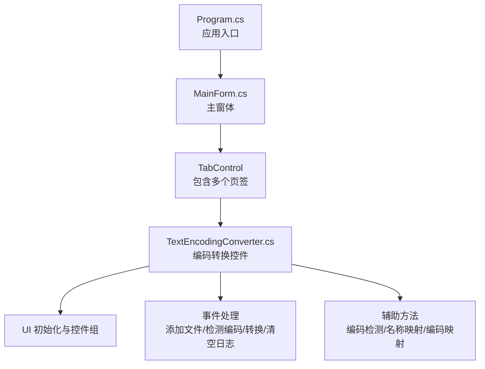
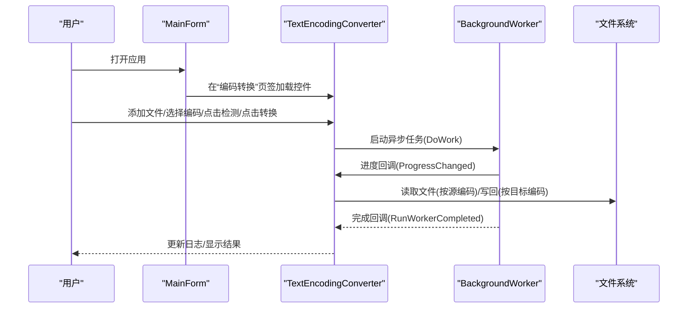
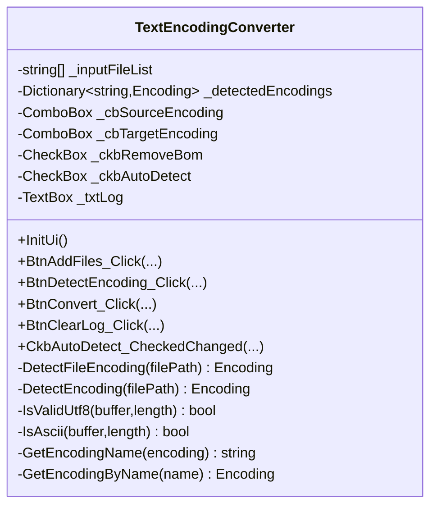
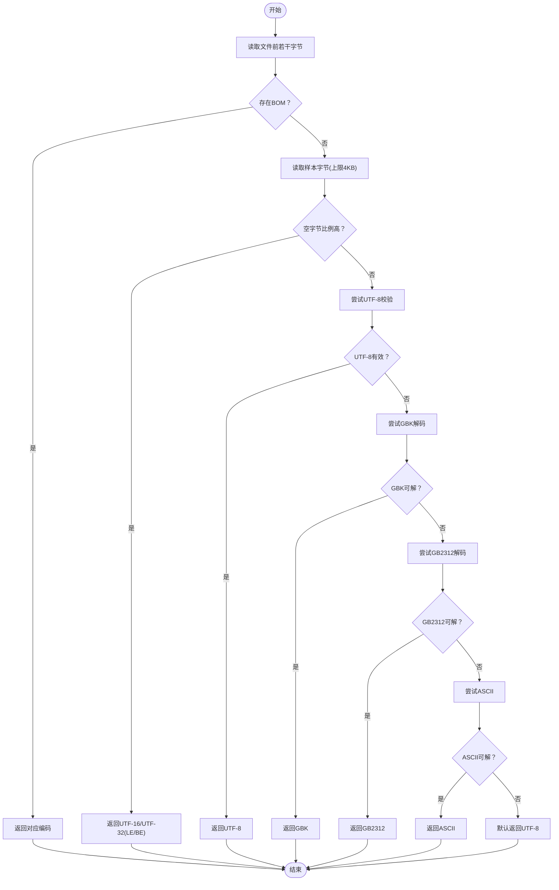
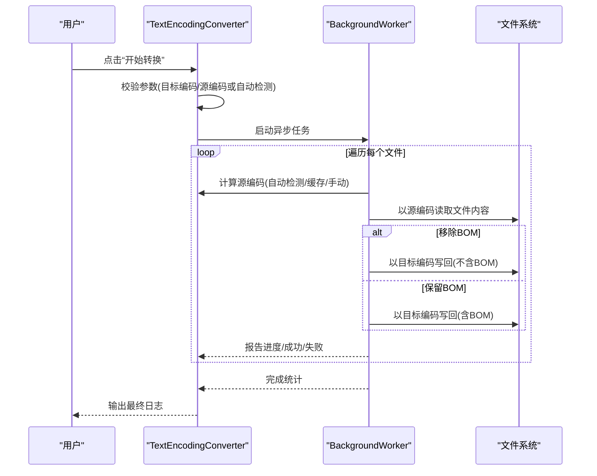
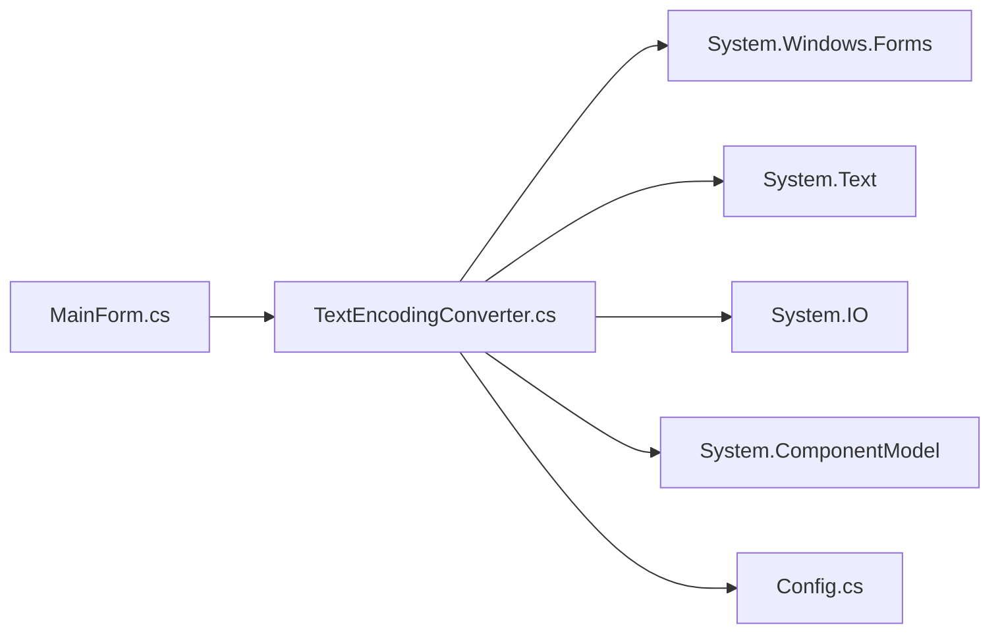

# 文本编码转换工具

<cite>
**本文引用的文件列表**
- [TextEncodingConverter.cs](file://FileTool/TextEncodingConverter.cs)
- [TextEncodingConverter.Designer.cs](file://FileTool/TextEncodingConverter.Designer.cs)
- [MainForm.cs](file://FileTool/MainForm.cs)
- [Config.cs](file://FileTool/Config.cs)
- [Program.cs](file://FileTool/Program.cs)
</cite>

## 目录
1. [简介](#简介)
2. [项目结构](#项目结构)
3. [核心组件](#核心组件)
4. [架构总览](#架构总览)
5. [详细组件分析](#详细组件分析)
6. [依赖关系分析](#依赖关系分析)
7. [性能考量](#性能考量)
8. [故障排查指南](#故障排查指南)
9. [结论](#结论)

## 简介
本工具为一个基于 Windows Forms 的文本文件编码转换器，提供以下能力：
- 批量添加待处理文本文件
- 自动检测文件编码（含 BOM 判断、UTF-8 校验、GBK/GB2312 尝试、ASCII 判定）
- 指定或自动确定源编码，选择目标编码进行转换
- 可选移除 BOM
- 带进度的日志输出，支持后台异步执行

该工具集成在“文件工具”主界面中，作为其中一个功能页签使用。

## 项目结构
与“文本编码转换工具”直接相关的文件组织如下：
- FileTool/TextEncodingConverter.cs：核心控件实现，包含 UI 初始化、事件处理、编码检测与转换逻辑
- FileTool/TextEncodingConverter.Designer.cs：设计器生成的空模板文件
- FileTool/MainForm.cs：主窗体，包含 Tab 控件，将 TextEncodingConverter 作为“编码转换”页签加载
- FileTool/Config.cs：UI 布局常量（边距、间距）
- FileTool/Program.cs：程序入口点

图表来源
- [Program.cs](file://FileTool/Program.cs)
- [MainForm.cs](file://FileTool/MainForm.cs)
- [TextEncodingConverter.cs](file://FileTool/TextEncodingConverter.cs)

章节来源
- [MainForm.cs](file://FileTool/MainForm.cs#L94-L114)
- [TextEncodingConverter.cs](file://FileTool/TextEncodingConverter.cs#L339-L476)
- [Config.cs](file://FileTool/Config.cs#L1-L9)

## 核心组件
- TextEncodingConverter 控件：负责用户交互、文件列表管理、编码检测与转换、日志输出
- MainForm 主窗体：承载 Tab 控件，并将 TextEncodingConverter 注入到“编码转换”页签
- Config 配置：提供统一的 UI 边距与间距常量

关键职责划分：
- UI 初始化与布局：在控件内部完成分组框、按钮、复选框、下拉框、日志文本框的创建与定位
- 文件管理：维护输入文件列表与检测结果缓存字典
- 编码检测：优先检查 BOM，其次进行 UTF-8 字节序校验、GBK/GB2312 尝试、ASCII 判定
- 转换流程：根据用户选择或自动检测的源编码读取内容，按目标编码写回（可选移除 BOM）

章节来源
- [TextEncodingConverter.cs](file://FileTool/TextEncodingConverter.cs#L1-L177)
- [TextEncodingConverter.cs](file://FileTool/TextEncodingConverter.cs#L180-L335)
- [TextEncodingConverter.cs](file://FileTool/TextEncodingConverter.cs#L339-L476)
- [MainForm.cs](file://FileTool/MainForm.cs#L94-L114)
- [Config.cs](file://FileTool/Config.cs#L1-L9)

## 架构总览
整体采用 WinForms 控件化设计，TextEncodingConverter 作为 UserControl 内嵌于 MainForm 的 Tab 中。转换过程通过 BackgroundWorker 异步执行，避免 UI 阻塞，并以进度条形式反馈当前处理状态。

图表来源
- [MainForm.cs](file://FileTool/MainForm.cs#L94-L114)
- [TextEncodingConverter.cs](file://FileTool/TextEncodingConverter.cs#L52-L91)
- [TextEncodingConverter.cs](file://FileTool/TextEncodingConverter.cs#L93-L166)

## 详细组件分析

### TextEncodingConverter 控件
- 角色：封装编码检测与转换的完整流程，提供直观的 UI 交互
- 关键属性：输入文件列表、检测结果缓存、源/目标编码下拉框、BOM 移除与自动检测复选框、日志文本框
- 事件处理：
  - 添加文件：弹出多选对话框，清空历史并更新日志
  - 检测编码：遍历文件列表，调用编码检测函数，记录结果并报告进度
  - 转换：根据是否启用自动检测决定源编码来源，读取内容后按目标编码写回（可选移除 BOM），统计成功数并报告进度
  - 清空日志：清空日志文本框
  - 自动检测切换：禁用/启用手动源编码选择
- 编码检测算法要点：
  - BOM 识别：优先判断 UTF-8、UTF-32、UTF-16 LE/BE 等常见 BOM
  - 空字节比例：若高比例为空字节，倾向于 Unicode
  - UTF-8 校验：逐字节验证 UTF-8 序列合法性
  - GBK/GB2312 尝试：尝试用 GBK 解码前若干字节，成功则返回 GBK；GB2312 对应 CodePage
  - ASCII 判定：若无高位字节，返回 ASCII
  - 默认：无法判定时返回 UTF-8
- 编码名称与映射：
  - 名称到 Encoding 的映射：支持 UTF-8、UTF-8(no BOM)、UTF-16 LE/BE、UTF-32 LE、ANSI(GBK)、ANSI(GB2312)、ASCII
  - Encoding 到名称的映射：用于日志展示
- UI 初始化：
  - 分组框内放置“添加文件”“自动检测源编码”“检测编码”“源编码”“目标编码”“开始转换”“移除BOM”“清除日志”
  - 日志文本框占满剩余区域，支持滚动与只读

图表来源
- [TextEncodingConverter.cs](file://FileTool/TextEncodingConverter.cs#L1-L177)
- [TextEncodingConverter.cs](file://FileTool/TextEncodingConverter.cs#L180-L335)
- [TextEncodingConverter.cs](file://FileTool/TextEncodingConverter.cs#L339-L476)

章节来源
- [TextEncodingConverter.cs](file://FileTool/TextEncodingConverter.cs#L37-L177)
- [TextEncodingConverter.cs](file://FileTool/TextEncodingConverter.cs#L180-L335)
- [TextEncodingConverter.cs](file://FileTool/TextEncodingConverter.cs#L339-L476)

### 编码检测流程（算法）

图表来源
- [TextEncodingConverter.cs](file://FileTool/TextEncodingConverter.cs#L180-L246)
- [TextEncodingConverter.cs](file://FileTool/TextEncodingConverter.cs#L248-L291)

章节来源
- [TextEncodingConverter.cs](file://FileTool/TextEncodingConverter.cs#L180-L246)
- [TextEncodingConverter.cs](file://FileTool/TextEncodingConverter.cs#L248-L291)

### 转换流程（序列）

图表来源
- [TextEncodingConverter.cs](file://FileTool/TextEncodingConverter.cs#L93-L166)

章节来源
- [TextEncodingConverter.cs](file://FileTool/TextEncodingConverter.cs#L93-L166)

## 依赖关系分析
- 控件依赖：
  - System.Windows.Forms：WinForms UI 与控件
  - System.Text：Encoding 类族与字符串编码
  - System.IO：文件读写与流操作
  - System.ComponentModel：BackgroundWorker 与进度报告
- 外部集成：
  - MainForm 通过 Tab 控件将 TextEncodingConverter 注入为“编码转换”页签
  - Config 提供统一的 UI 边距与间距常量，保证控件布局一致性

图表来源
- [TextEncodingConverter.cs](file://FileTool/TextEncodingConverter.cs#L1-L10)
- [MainForm.cs](file://FileTool/MainForm.cs#L94-L114)
- [Config.cs](file://FileTool/Config.cs#L1-L9)

章节来源
- [TextEncodingConverter.cs](file://FileTool/TextEncodingConverter.cs#L1-L10)
- [MainForm.cs](file://FileTool/MainForm.cs#L94-L114)
- [Config.cs](file://FileTool/Config.cs#L1-L9)

## 性能考量
- 异步执行：使用 BackgroundWorker 并开启进度报告，避免长时间阻塞 UI
- 采样策略：检测阶段仅读取少量字节（前 5 字节用于 BOM，随后最多 4KB），降低 I/O 开销
- 编码判定顺序：先 BOM，再空字节比例，最后 UTF-8 校验与字符集尝试，减少不必要的解码尝试
- 写回策略：按目标编码直接写回字节数组，避免额外中间对象
- 日志输出：逐条追加，便于观察进度但注意大量文件时日志增长

优化建议（通用）：
- 对超大文件，可考虑分块读取与增量写回，避免一次性占用内存
- 若需要更稳健的编码检测，可引入第三方库（如 DetectCharacterEncoding）进行综合判定
- 对频繁转换场景，可缓存检测结果并在 UI 层提示用户复用

## 故障排查指南
- 未添加文件即点击检测/转换
  - 现象：日志提示未添加文件
  - 排查：确认已通过“添加文件”按钮选择至少一个文件
  - 参考路径：[TextEncodingConverter.cs](file://FileTool/TextEncodingConverter.cs#L54-L58)、[TextEncodingConverter.cs](file://FileTool/TextEncodingConverter.cs#L95-L99)
- 未选择目标编码
  - 现象：日志提示未选择目标编码
  - 排查：在“目标编码”下拉框中选择目标编码
  - 参考路径：[TextEncodingConverter.cs](file://FileTool/TextEncodingConverter.cs#L100-L104)
- 未启用自动检测且未选择源编码
  - 现象：日志提示未选择源编码且未启用自动检测
  - 排查：勾选“自动检测源编码”，或在“源编码”下拉框中选择源编码
  - 参考路径：[TextEncodingConverter.cs](file://FileTool/TextEncodingConverter.cs#L106-L110)、[TextEncodingConverter.cs](file://FileTool/TextEncodingConverter.cs#L173-L176)
- 检测失败
  - 现象：进度回调中出现“检测失败：...”
  - 排查：检查文件是否可读、是否存在损坏；查看异常信息
  - 参考路径：[TextEncodingConverter.cs](file://FileTool/TextEncodingConverter.cs#L70-L79)
- 转换失败
  - 现象：进度回调中出现“转换失败：...”
  - 排查：确认目标编码兼容性、磁盘空间、文件权限；查看异常信息
  - 参考路径：[TextEncodingConverter.cs](file://FileTool/TextEncodingConverter.cs#L151-L154)
- 日志过多影响性能
  - 建议：定期点击“清除日志”按钮清理历史记录
  - 参考路径：[TextEncodingConverter.cs](file://FileTool/TextEncodingConverter.cs#L168-L171)

章节来源
- [TextEncodingConverter.cs](file://FileTool/TextEncodingConverter.cs#L52-L91)
- [TextEncodingConverter.cs](file://FileTool/TextEncodingConverter.cs#L93-L166)
- [TextEncodingConverter.cs](file://FileTool/TextEncodingConverter.cs#L168-L171)

## 结论
该文本编码转换工具以简洁的 UI 和稳健的编码检测算法为核心，满足批量文本文件编码转换与日志反馈的需求。其异步执行与采样策略兼顾了易用性与性能。对于更复杂的编码场景，可在现有基础上扩展第三方检测库或增加更多字符集支持。