# 核心组件

<cite>
**本文档引用的文件**  
- [MainForm.cs](file://PdfTool/MainForm.cs)
- [PdfMerger.cs](file://PdfTool/PdfMerger.cs)
- [MergeHelper.cs](file://PdfHelperLibrary/MergeHelper.cs)
- [SplitHelper.cs](file://PdfHelperLibrary/SplitHelper.cs)
- [ExtractHelper.cs](file://PdfHelperLibrary/ExtractHelper.cs)
- [ImageExtractHelper.cs](file://PdfHelperLibrary/ImageExtractHelper.cs)
- [TableExtractHelper.cs](file://PdfHelperLibrary/TableExtractHelper.cs)
- [TextExtractHelper.cs](file://PdfHelperLibrary/TextExtractHelper.cs)
- [CommonHelper.cs](file://PdfHelperLibrary/CommonHelper.cs)
- [Common.cs](file://PdfTool/Common.cs)
- [Config.cs](file://PdfTool/Config.cs)
- [PdfHelperLibrary.csproj](file://PdfHelperLibrary/PdfHelperLibrary.csproj)
- [PdfTool.csproj](file://PdfTool/PdfTool.csproj)
</cite>

## 目录
1. [引言](#引言)
2. [三层架构概述](#三层架构概述)
3. [界面层实现](#界面层实现)
4. [业务逻辑层实现](#业务逻辑层实现)
5. [第三方库依赖层](#第三方库依赖层)
6. [组件间调用关系](#组件间调用关系)
7. [依赖管理机制](#依赖管理机制)
8. [解耦设计与可维护性](#解耦设计与可维护性)
9. [性能优化建议](#性能优化建议)
10. [结论](#结论)

## 引言
PdfTool是一款功能丰富的PDF处理工具，采用清晰的三层架构设计，将用户界面、业务逻辑和底层数据处理分离。本文档深入分析其核心组件，重点关注界面层（PdfTool主程序）、业务逻辑层（PdfHelperLibrary系列库）和第三方库依赖层的实现细节，以及各层之间的交互机制。

## 三层架构概述
PdfTool采用典型的三层架构模式，各层职责分明：
- **界面层**：PdfTool主程序，负责用户交互和UI展示
- **业务逻辑层**：PdfHelperLibrary系列库，封装PDF操作的核心逻辑
- **第三方库依赖层**：PDFsharp、PdfPig、Tabula等库，提供底层PDF解析和生成能力

这种分层架构实现了关注点分离，提高了代码的可维护性和可扩展性。

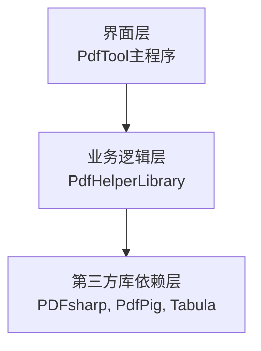

**图表来源**
- [MainForm.cs](file://PdfTool/MainForm.cs)
- [PdfHelperLibrary.csproj](file://PdfHelperLibrary/PdfHelperLibrary.csproj)

## 界面层实现
界面层以MainForm为核心，通过标签页导航集成所有功能模块，实现了统一的用户体验。

### 主窗体设计
MainForm作为应用程序的主窗口，采用TabControl实现多标签页导航，每个标签页对应一个特定的PDF处理功能。通过动态创建和添加UserControl实例，实现了模块化的设计。

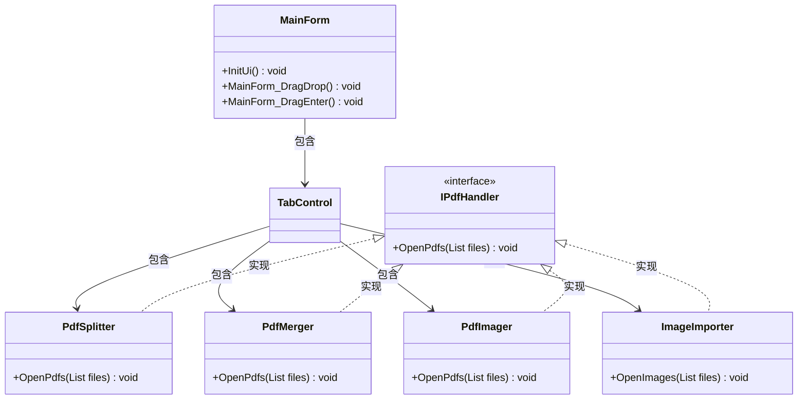

**图表来源**
- [MainForm.cs](file://PdfTool/MainForm.cs#L12-L193)
- [Common.cs](file://PdfTool/Common.cs#L13-L16)

### 拖拽区域实现
MainForm实现了文件拖拽功能，用户可以直接将PDF文件拖入应用程序窗口进行处理。通过处理DragEnter和DragDrop事件，实现了文件的自动识别和分发。

```csharp
private void MainForm_DragEnter(object sender, DragEventArgs e)
{
    if (e.Data.GetDataPresent(DataFormats.FileDrop))
    {
        e.Effect = DragDropEffects.Copy;
    }
}

private void MainForm_DragDrop(object sender, DragEventArgs e)
{
    if (e.Data.GetDataPresent(DataFormats.FileDrop))
    {
        var files = ((string[])e.Data.GetData(DataFormats.FileDrop)).ToList();
        var pdfFiles = files.Where(a => a.EndsWith(".pdf", StringComparison.OrdinalIgnoreCase)).ToList();
        var tabPage = Controls.OfType<TabControl>().FirstOrDefault().SelectedTab;
        var control = tabPage.Controls[0];
        if (control is IPdfHandler pdfHandler)
        {
            pdfHandler.OpenPdfs(pdfFiles);
        }
        else if (control is ImageImporter imageImporter)
        {
            var extList = new List<string> { ".bmp", ".jpg", ".tif", ".png" };
            var imgFiles = files.Where(a => extList.Contains(Path.GetExtension(a).ToLower())).ToList();
            imageImporter.OpenImages(imgFiles);
        }
    }
}
```

**图表来源**
- [MainForm.cs](file://PdfTool/MainForm.cs#L33-L60)

### 批量处理设计
通过IPdfHandler接口，实现了批量处理的统一入口。所有支持PDF处理的模块都必须实现该接口的OpenPdfs方法，确保了处理流程的一致性。

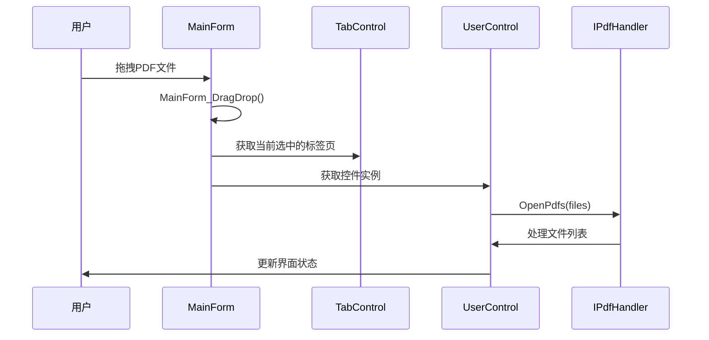

**图表来源**
- [MainForm.cs](file://PdfTool/MainForm.cs#L41-L58)
- [Common.cs](file://PdfTool/Common.cs#L13-L16)

## 业务逻辑层实现
业务逻辑层由PdfHelperLibrary系列库组成，封装了各种PDF操作的核心功能。

### Helper类职责划分
PdfHelperLibrary包含多个Helper类，每个类负责特定的PDF操作功能：

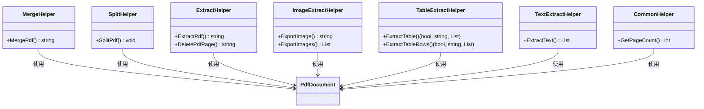

**图表来源**
- [MergeHelper.cs](file://PdfHelperLibrary/MergeHelper.cs)
- [SplitHelper.cs](file://PdfHelperLibrary/SplitHelper.cs)
- [ExtractHelper.cs](file://PdfHelperLibrary/ExtractHelper.cs)
- [ImageExtractHelper.cs](file://PdfHelperLibrary/ImageExtractHelper.cs)
- [TableExtractHelper.cs](file://PdfHelperLibrary/TableExtractHelper.cs)
- [TextExtractHelper.cs](file://PdfHelperLibrary/TextExtractHelper.cs)
- [CommonHelper.cs](file://PdfHelperLibrary/CommonHelper.cs)

### MergeHelper实现
MergeHelper类负责PDF文件的合并操作，提供了两种重载方法来满足不同的使用场景。

```csharp
public static string MergePdf(List<string> inputPdfFilenameList, bool autoOpen, bool addBookmarks, out string outputPdfFilename)
{
    try
    {
        var outputDocument = new PdfDocument();
        foreach (var file in inputPdfFilenameList)
        {
            var inputDocument = PdfReader.Open(file, PdfDocumentOpenMode.Import);
            var pageCount = inputDocument.PageCount;
            for (var i = 0; i < pageCount; i++)
            {
                var page = outputDocument.AddPage(inputDocument.Pages[i]);
                if (i == 0 && addBookmarks) outputDocument.Outlines.Add(Path.GetFileNameWithoutExtension(file), page);
            }
        }
        var path = Path.GetDirectoryName(inputPdfFilenameList.First());
        outputPdfFilename = Path.Combine(path, $"MergedFile - {DateTime.Now:yyyyMMddHHmmssfff}.pdf");
        outputDocument.Save(outputPdfFilename);
        if (autoOpen) Process.Start(outputPdfFilename);
        return "";
    }
    catch (Exception ex)
    {
        outputPdfFilename = "";
        return $"合并失败，原因：{ex.Message}";
    }
}
```

**图表来源**
- [MergeHelper.cs](file://PdfHelperLibrary/MergeHelper.cs#L16-L41)

### SplitHelper实现
SplitHelper类提供了多种PDF拆分方式，包括按页拆分和按指定页数拆分。

```csharp
public static void SplitPdf(string inputPdfFileName)
{
    var inputDocument = PdfReader.Open(inputPdfFileName, PdfDocumentOpenMode.Import);
    var pageCount = inputDocument.PageCount;
    var path = Path.GetDirectoryName(inputPdfFileName);
    var fileName = Path.GetFileNameWithoutExtension(inputPdfFileName);
    var prefixFileName = Path.Combine(path, fileName);
    for (var i = 0; i < pageCount; i++)
    {
        var outputDocument = new PdfDocument { Version = inputDocument.Version };
        outputDocument.Info.Title = $"Page {i + 1} of {inputDocument.Info.Title}";
        outputDocument.Info.Creator = inputDocument.Info.Creator;
        outputDocument.AddPage(inputDocument.Pages[i]);
        outputDocument.Save($"{prefixFileName} - Page {i + 1}.pdf");
    }
}
```

**图表来源**
- [SplitHelper.cs](file://PdfHelperLibrary/SplitHelper.cs#L13-L29)

### ExtractHelper实现
ExtractHelper类提供了PDF内容提取和页面删除功能。

```csharp
public static string ExtractPdf(string inputPdfFileName, int pageFrom, int pageTo, out string outputPdfFileName)
{
    try
    {
        var inputDocument = PdfReader.Open(inputPdfFileName, PdfDocumentOpenMode.Import);
        var pageCount = inputDocument.PageCount;
        var path = Path.GetDirectoryName(inputPdfFileName);
        var fileName = Path.GetFileNameWithoutExtension(inputPdfFileName);
        var prefixFileName = Path.Combine(path, fileName);
        var maxPageTo = Math.Min(pageTo, pageCount);
        var outputDocument = new PdfDocument { Version = inputDocument.Version };
        outputDocument.Info.Title = $"Page {pageFrom} to {maxPageTo} of {inputDocument.Info.Title}";
        outputDocument.Info.Creator = inputDocument.Info.Creator;
        for (var i = pageFrom - 1; i < maxPageTo; i++) outputDocument.AddPage(inputDocument.Pages[i]);
        outputPdfFileName = $"{prefixFileName} - Page {pageFrom} to {maxPageTo}.pdf";
        outputDocument.Save(outputPdfFileName);
        return "";
    }
    catch (Exception ex)
    {
        outputPdfFileName = "";
        return ex.Message;
    }
}
```

**图表来源**
- [ExtractHelper.cs](file://PdfHelperLibrary/ExtractHelper.cs#L20-L38)

## 第三方库依赖层
第三方库依赖层为PdfTool提供了强大的底层PDF处理能力。

### PDFsharp库
PDFsharp是主要的PDF生成和操作库，用于创建、修改和保存PDF文档。

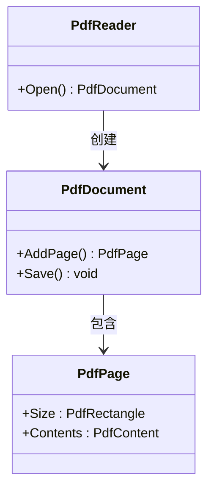

**图表来源**
- [PdfHelperLibrary.csproj](file://PdfHelperLibrary/PdfHelperLibrary.csproj)

### PdfPig库
PdfPig用于PDF文件的读取和文本内容提取，提供了比PDFsharp更强大的文本解析能力。

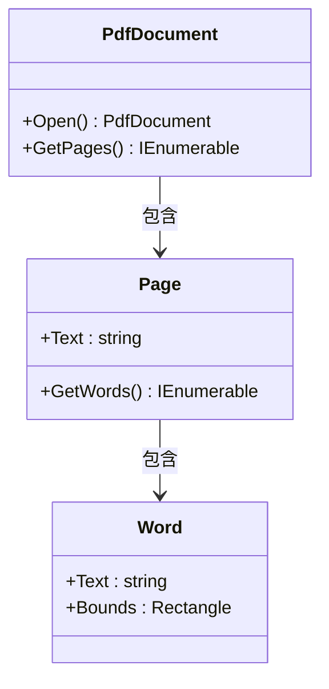

**图表来源**
- [PdfHelperLibrary.csproj](file://PdfHelperLibrary/PdfHelperLibrary.csproj)

### Tabula库
Tabula专门用于PDF表格的提取，能够识别和解析PDF中的表格结构。

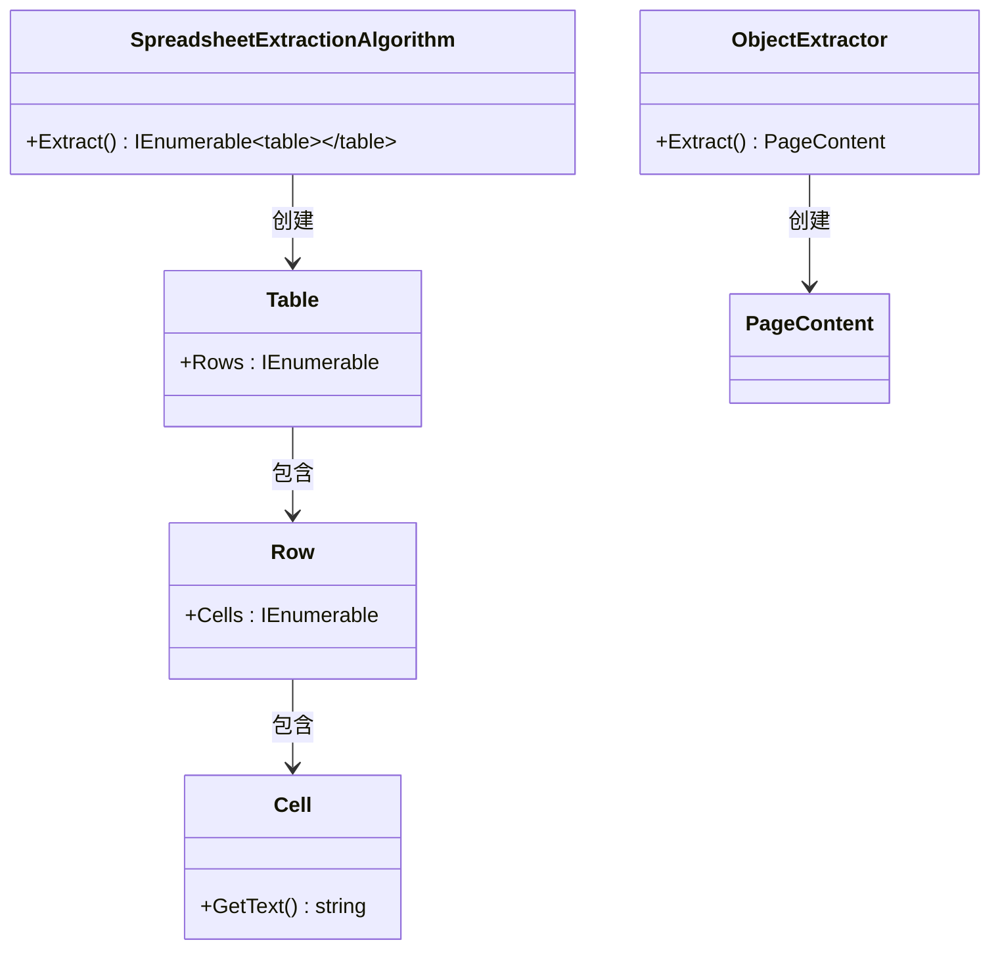

**图表来源**
- [PdfHelperLibrary.csproj](file://PdfHelperLibrary/PdfHelperLibrary.csproj)

## 组件间调用关系
各组件之间通过清晰的调用关系协同工作，实现完整的PDF处理功能。

### PdfMerger调用流程
PdfMerger模块通过调用MergeHelper执行PDF合并任务，展示了界面层与业务逻辑层的交互。

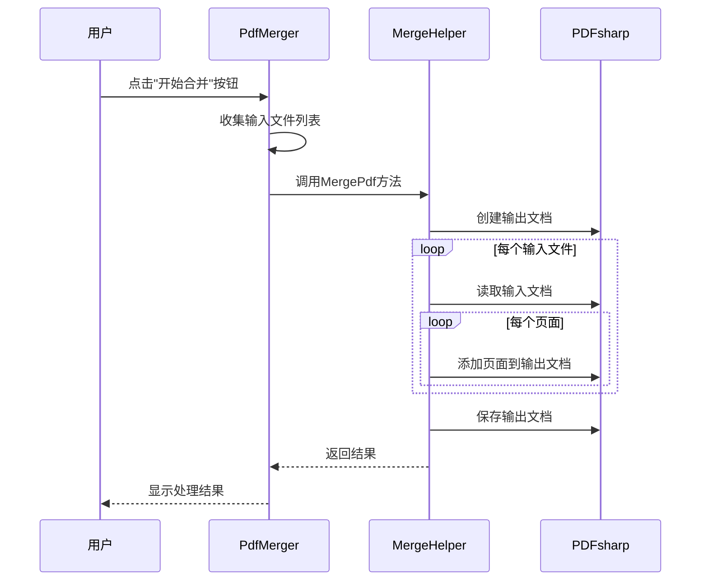

**图表来源**
- [PdfMerger.cs](file://PdfTool/PdfMerger.cs#L59-L71)
- [MergeHelper.cs](file://PdfHelperLibrary/MergeHelper.cs#L16-L41)

### 组件调用示例
以下代码展示了PdfMerger如何调用MergeHelper执行合并任务：

```csharp
private void BtnMerge_Click(object sender, EventArgs e)
{
    var inputPdfFilenameList = _txtFileList.Lines.ToList();
    inputPdfFilenameList.RemoveAll(string.IsNullOrWhiteSpace);
    if (inputPdfFilenameList.Count == 0)
    {
        _txtLog.AppendText("未添加需要合并的PDF文件\r\n");
        return;
    }
    var (msg, outputFileName) = PdfHelperLibrary.MergeHelper.MergePdf(inputPdfFilenameList, _ckbAutoOpen.Checked, _ckbAddBookmarks.Checked, _outputFileName);
    if (string.IsNullOrWhiteSpace(msg)) _txtLog.AppendText($"合并完成: {outputFileName}\r\n");
    else _txtLog.AppendText($"{msg}\r\n");
}
```

**图表来源**
- [PdfMerger.cs](file://PdfTool/PdfMerger.cs#L59-L71)

## 依赖管理机制
PdfTool通过项目引用和NuGet包管理来管理组件间的依赖关系。

### 项目引用
主程序通过项目引用方式直接引用PdfHelperLibrary，实现了紧密的集成。

```xml
<ProjectReference Include="..\PdfHelperLibrary\PdfHelperLibrary.csproj">
  <Project>{64485278-a143-453e-a1d6-2400d010ff61}</Project>
  <Name>PdfHelperLibrary</Name>
</ProjectReference>
```

**图表来源**
- [PdfTool.csproj](file://PdfTool/PdfTool.csproj#L187-L189)

### NuGet包管理
PdfHelperLibrary通过NuGet包管理第三方库依赖，确保了依赖版本的一致性。

```xml
<ItemGroup>
  <PackageReference Include="PDFsharp" Version="6.2.2" />
  <PackageReference Include="SixLabors.ImageSharp" Version="3.1.11" />
  <PackageReference Include="Tabula" Version="0.1.3" />
</ItemGroup>
```

**图表来源**
- [PdfHelperLibraryX.csproj](file://PdfHelperLibraryX/PdfHelperLibraryX.csproj#L11-L14)

## 解耦设计与可维护性
PdfTool的架构设计充分考虑了组件的解耦，提高了系统的可维护性和扩展性。

### 接口抽象
通过IPdfHandler接口抽象，实现了模块间的松耦合，使得新功能模块可以轻松集成。

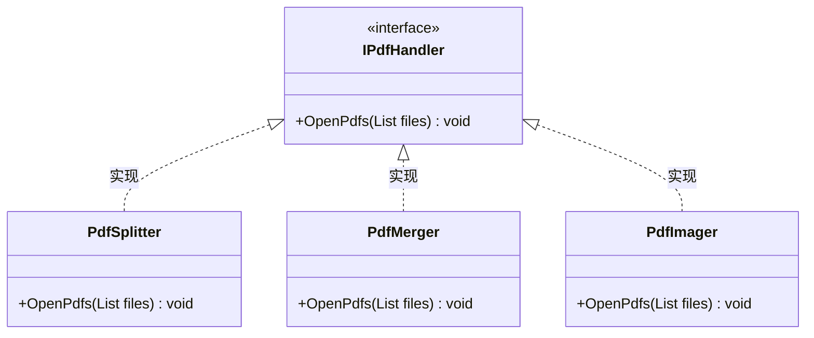

**图表来源**
- [Common.cs](file://PdfTool/Common.cs#L13-L16)

### 模块化设计
每个功能模块都是独立的UserControl，可以独立开发、测试和维护。

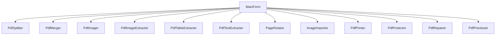

**图表来源**
- [MainForm.cs](file://PdfTool/MainForm.cs#L136-L148)

## 性能优化建议
基于当前架构，提出以下性能优化建议：

### 批量操作优化
对于批量处理操作，建议采用异步处理模式，避免UI线程阻塞。

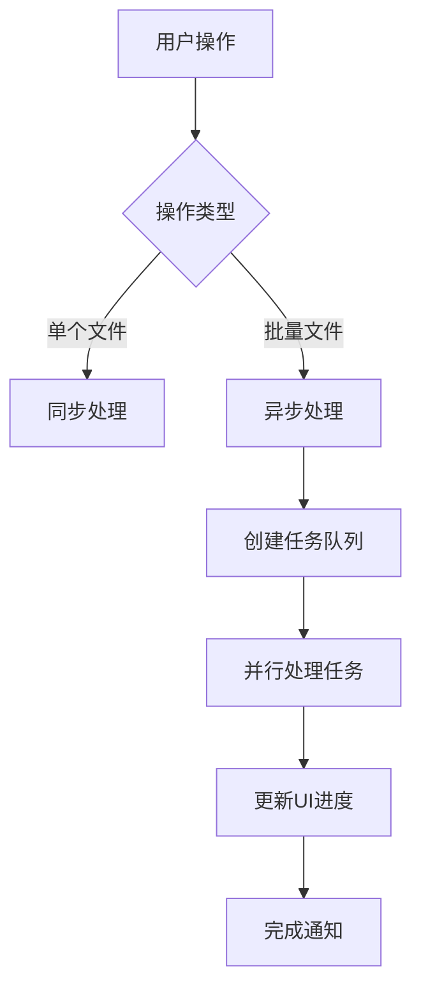

### 内存管理优化
在处理大型PDF文件时，应注意内存使用，及时释放不再需要的资源。

```csharp
using (var document = PdfDocument.Open(inputPdfFileName))
{
    // 处理文档
    // using语句确保文档资源被正确释放
}
```

### 缓存机制
对于频繁访问的数据，如页面数量等，可以考虑引入缓存机制。

```csharp
// 示例：缓存页面数量
private Dictionary<string, int> _pageCountCache = new Dictionary<string, int>();

public int GetPageCount(string fileName)
{
    if (_pageCountCache.ContainsKey(fileName))
    {
        return _pageCountCache[fileName];
    }
    
    var count = CommonHelper.GetPageCount(fileName);
    _pageCountCache[fileName] = count;
    return count;
}
```

## 结论
PdfTool通过清晰的三层架构设计，实现了界面、业务逻辑和底层数据处理的分离。界面层通过MainForm集成所有功能模块，采用标签页导航和拖拽区域提供友好的用户体验。业务逻辑层由PdfHelperLibrary系列库组成，通过MergeHelper、SplitHelper、ExtractHelper等Helper类封装了底层PDF操作。第三方库依赖层利用PDFsharp、PdfPig、Tabula等库提供了强大的PDF解析和生成能力。通过IPdfHandler接口实现的模块化设计，确保了组件间的松耦合，提高了系统的可维护性和扩展性。整体架构设计合理，具有良好的可扩展性和维护性。