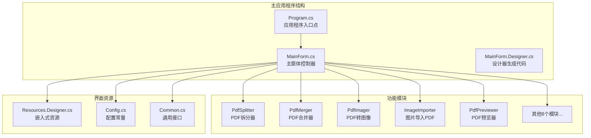
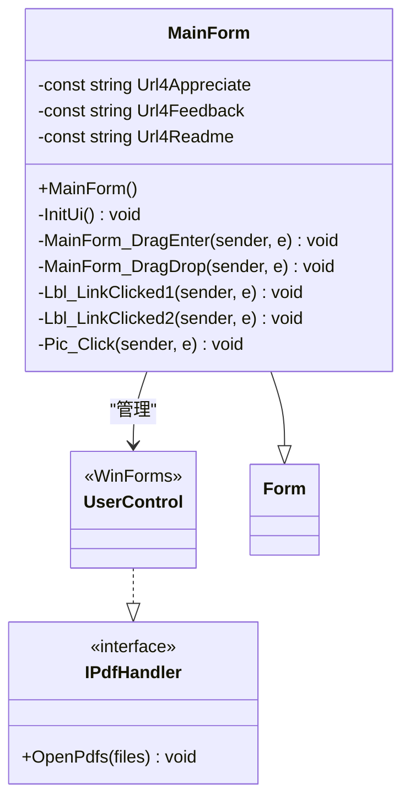
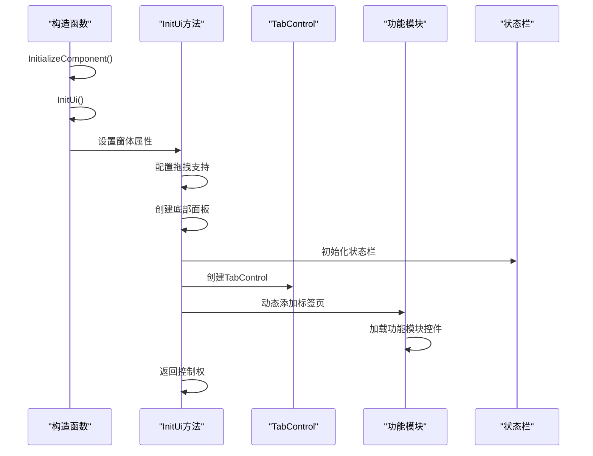
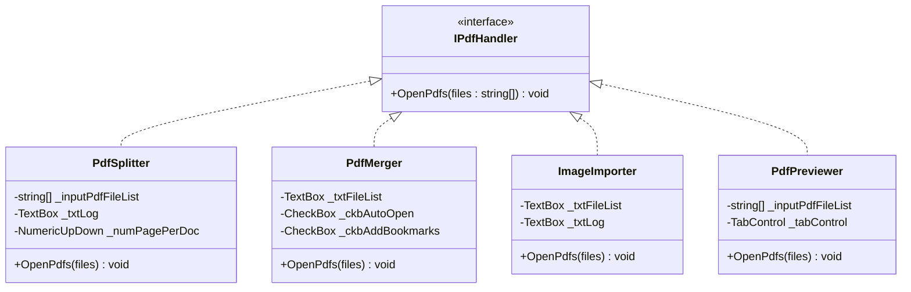
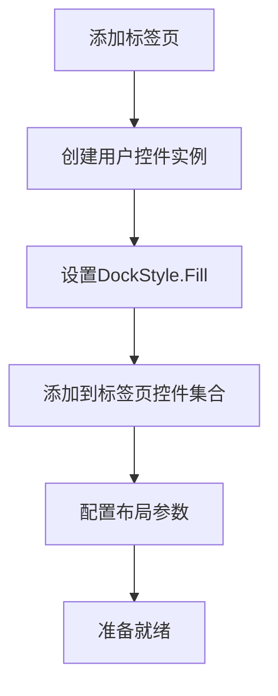
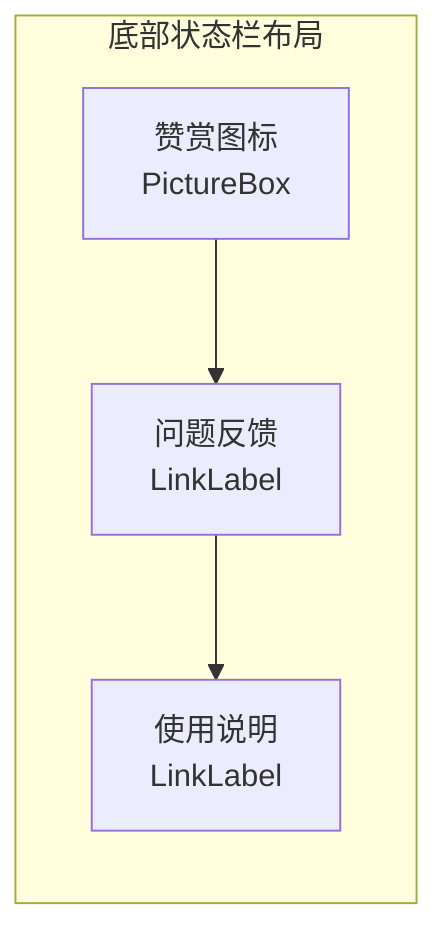
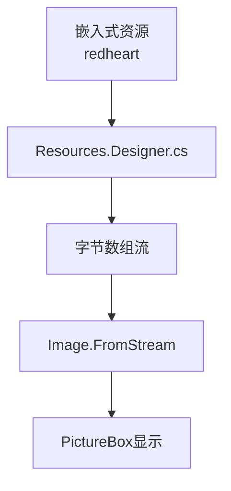
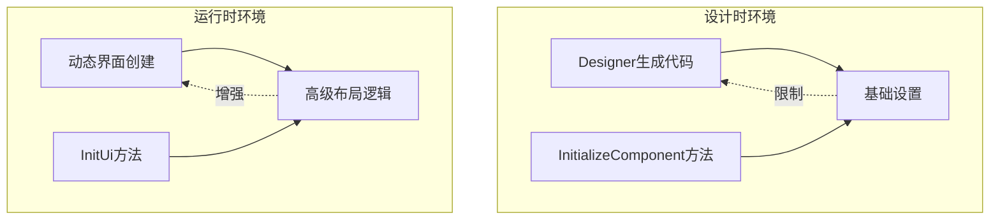
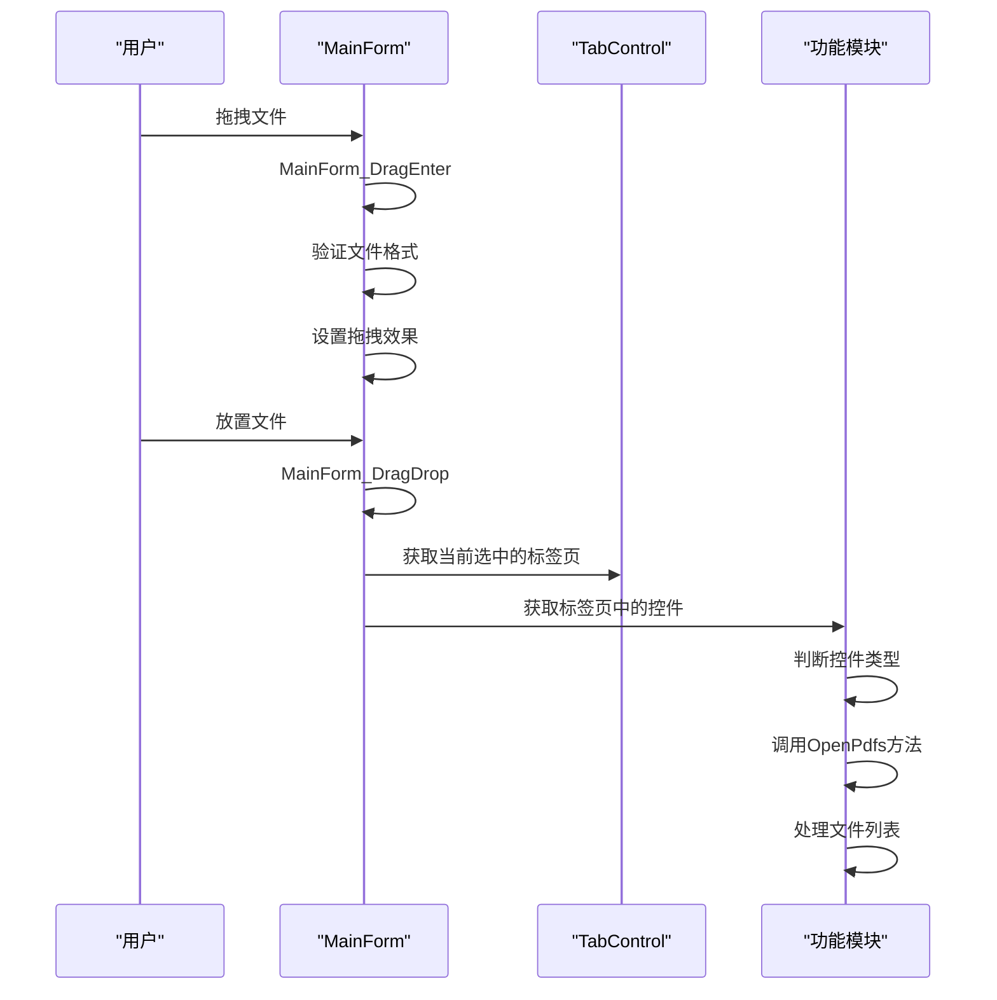
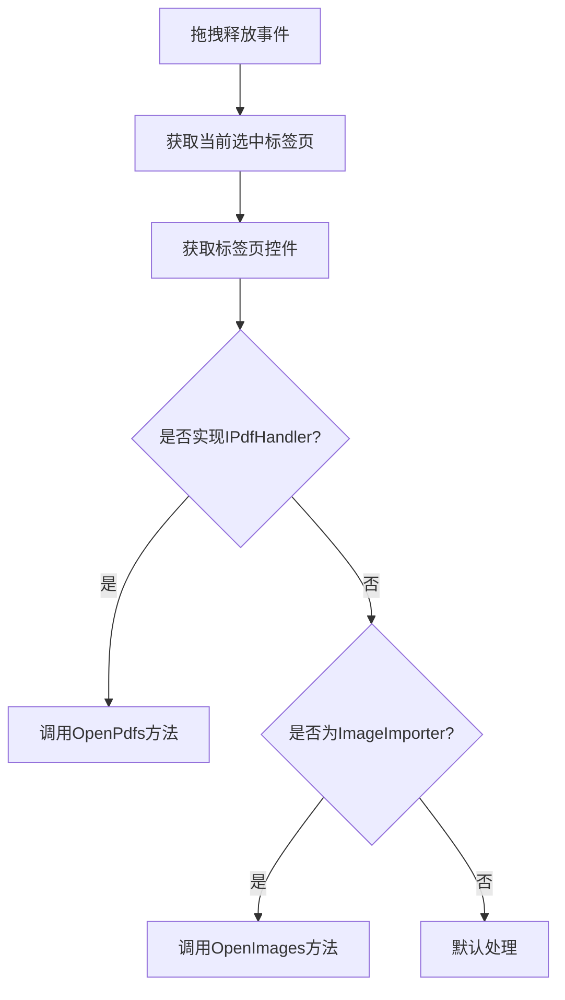

# 主界面

<cite>
**本文档引用的文件**
- [MainForm.cs](file://PdfTool/MainForm.cs)
- [MainForm.Designer.cs](file://PdfTool/MainForm.Designer.cs)
- [Program.cs](file://PdfTool/Program.cs)
- [PdfSplitter.cs](file://PdfTool/PdfSplitter.cs)
- [PdfMerger.cs](file://PdfTool/PdfMerger.cs)
- [ImageImporter.cs](file://PdfTool/ImageImporter.cs)
- [PdfPreviewer.cs](file://PdfTool/PdfPreviewer.cs)
- [Resources.Designer.cs](file://PdfTool/Properties/Resources.Designer.cs)
- [Config.cs](file://PdfTool/Config.cs)
- [Common.cs](file://PdfTool/Common.cs)
</cite>

## 目录
1. [简介](#简介)
2. [项目结构概述](#项目结构概述)
3. [MainForm类核心架构](#mainform类核心架构)
4. [界面初始化流程](#界面初始化流程)
5. [TabControl布局设计](#tabcontrol布局设计)
6. [功能模块标签页](#功能模块标签页)
7. [底部状态栏实现](#底部状态栏实现)
8. [窗体属性配置](#窗体属性配置)
9. [界面资源管理](#界面资源管理)
10. [设计时vs运行时差异](#设计时vs运行时差异)
11. [拖拽功能实现](#拖拽功能实现)
12. [总结](#总结)

## 简介

PdfTool主应用程序采用WinForms技术构建，提供了一个功能丰富的PDF处理工具集。主窗体作为整个应用程序的核心界面，采用了现代化的标签页布局设计，集成了12个专业化的PDF处理功能模块。本文档将深入分析主界面的设计与实现，重点探讨WinForms主窗体的架构设计、界面布局策略以及动态UI创建的技术细节。

## 项目结构概述

PdfTool项目采用模块化架构设计，每个功能模块都封装在独立的用户控件中。主窗体通过动态加载这些用户控件来实现功能的模块化组织。



**图表来源**
- [Program.cs](file://PdfTool/Program.cs#L1-L23)
- [MainForm.cs](file://PdfTool/MainForm.cs#L1-L194)

## MainForm类核心架构

MainForm类是整个应用程序的主控制器，继承自Windows Forms的Form基类。该类采用了清晰的职责分离模式，将界面初始化、事件处理和业务逻辑分别封装在不同的代码段中。



**图表来源**
- [MainForm.cs](file://PdfTool/MainForm.cs#L12-L194)
- [Common.cs](file://PdfTool/Common.cs#L13-L16)

**章节来源**
- [MainForm.cs](file://PdfTool/MainForm.cs#L12-L194)
- [Common.cs](file://PdfTool/Common.cs#L13-L16)

## 界面初始化流程

MainForm的界面初始化遵循严格的生命周期管理，通过构造函数中的InitUi方法实现完整的界面创建过程。



**图表来源**
- [MainForm.cs](file://PdfTool/MainForm.cs#L15-L23)
- [MainForm.cs](file://PdfTool/MainForm.cs#L79-L190)

### 构造函数调用链

构造函数的执行顺序体现了WinForms的最佳实践：

1. **InitializeComponent()**：调用设计器生成的基础设置
2. **InitUi()**：执行自定义的界面初始化逻辑
3. **事件绑定**：注册拖拽和链接点击事件处理器

**章节来源**
- [MainForm.cs](file://PdfTool/MainForm.cs#L15-L23)

## TabControl布局设计

TabControl是主界面的核心布局容器，采用了DockStyle.Fill策略确保占据主窗体的大部分可用空间。

### 布局策略分析

| 布局属性 | 值 | 作用 | 实现方式 |
|---------|-----|------|----------|
| Dock | Fill | 填充父容器 | `Parent = this` |
| TabBorderStyle | None | 移除边框 | `BorderStyle = BorderStyle.None` |
| Z-Order | 前置 | 确保可见性 | `BringToFront()` |

### 标签页配置

TabControl包含12个精心设计的功能标签页，每个标签页都具有明确的名称标识和边界样式配置：

| 标签名 | 功能模块 | 控件类型 | Dock策略 |
|--------|----------|----------|----------|
| tpPdfSplitter | PDF拆分 | PdfSplitter | DockStyle.Fill |
| tpPdfMerger | PDF合并 | PdfMerger | DockStyle.Fill |
| tpPdfImager | PDF转图像 | PdfImager | DockStyle.Fill |
| tpPdfImageExtracter | PDF图片提取 | PdfImageExtracter | DockStyle.Fill |
| tpPdfTableExtracter | PDF表格提取 | PdfTableExtracter | DockStyle.Fill |
| tpPdfTextExtracter | PDF文本提取 | PdfTextExtracter | DockStyle.Fill |
| tpPdfPageRotator | PDF页面旋转 | PageRotator | DockStyle.Fill |
| tpImageImporter | 图片导入PDF | ImageImporter | DockStyle.Fill |
| tpPdfPrinter | 批量打印 | PdfPrinter | DockStyle.Fill |
| tpPdfProtector | PDF保护 | PdfProtector | DockStyle.Fill |
| tpPdfRepairer | PDF修复 | PdfRepairer | DockStyle.Fill |
| tpPdfPreviewer | PDF预览 | PdfPreviewer | DockStyle.Fill |

**章节来源**
- [MainForm.cs](file://PdfTool/MainForm.cs#L128-L163)

## 功能模块标签页

每个功能模块都是一个实现了IPdfHandler接口的UserControl，这种设计模式确保了统一的文件处理能力。

### IPdfHandler接口设计



**图表来源**
- [Common.cs](file://PdfTool/Common.cs#L13-L16)
- [PdfSplitter.cs](file://PdfTool/PdfSplitter.cs#L12)
- [PdfMerger.cs](file://PdfTool/PdfMerger.cs#L12)
- [ImageImporter.cs](file://PdfTool/ImageImporter.cs#L12)
- [PdfPreviewer.cs](file://PdfTool/PdfPreviewer.cs#L13)

### 模块加载机制

每个标签页通过以下模式加载对应的用户控件：



**图表来源**
- [MainForm.cs](file://PdfTool/MainForm.cs#L151-L163)

**章节来源**
- [MainForm.cs](file://PdfTool/MainForm.cs#L151-L163)
- [PdfSplitter.cs](file://PdfTool/PdfSplitter.cs#L12)
- [PdfMerger.cs](file://PdfTool/PdfMerger.cs#L12)
- [ImageImporter.cs](file://PdfTool/ImageImporter.cs#L12)
- [PdfPreviewer.cs](file://PdfTool/PdfPreviewer.cs#L13)

## 底部状态栏实现

底部状态栏采用了Panel容器配合多个LinkLabel和PictureBox的组合设计，提供了完整的用户交互功能。

### 状态栏组件布局



**图表来源**
- [MainForm.cs](file://PdfTool/MainForm.cs#L87-L126)

### 组件配置详解

| 组件类型 | 属性配置 | 功能描述 | 事件处理 |
|----------|----------|----------|----------|
| Panel | Dock=Bottom, Height=25 | 底部容器 | 容器面板 |
| LinkLabel | Anchor=Right, Text=问题反馈 | 用户反馈链接 | Lbl_LinkClicked1 |
| LinkLabel | Anchor=Right, Text=使用说明 | 帮助文档链接 | Lbl_LinkClicked2 |
| PictureBox | Cursor=Hand, Image=redheart | 赞赏图标 | Pic_Click |
| ToolTip | 显示提示信息 | 点击进行赞赏 | 自动创建 |

### 布局定位策略

状态栏组件采用了锚定(AutoSize)和手动定位相结合的方式：

1. **动态计算位置**：根据容器尺寸动态调整组件位置
2. **右对齐布局**：所有链接标签采用右对齐排列
3. **垂直居中对齐**：组件在容器高度上垂直居中

**章节来源**
- [MainForm.cs](file://PdfTool/MainForm.cs#L87-L126)

## 窗体属性配置

MainForm的窗体属性配置体现了用户体验优先的设计理念，确保应用程序启动时呈现最佳的视觉效果。

### 核心属性配置

| 属性名称 | 配置值 | 作用说明 | 实现位置 |
|----------|--------|----------|----------|
| AllowDrop | true | 启用拖拽功能 | InitUi方法 |
| ClientSize | 1000x800 | 窗口初始尺寸 | InitUi方法 |
| Icon | ExtractAssociatedIcon | 从可执行文件提取图标 | InitUi方法 |
| StartPosition | CenterScreen | 居中启动 | InitUi方法 |
| Text | "PDF工具 + 版本号" | 窗口标题 | InitUi方法 |

### 版本信息动态获取

窗体标题包含了动态获取的应用程序版本信息：

```csharp
Text = $"PDF工具 {System.Reflection.Assembly.GetExecutingAssembly().GetName().Version}";
```

这种方式确保了版本信息的准确性和维护性，避免了硬编码版本号带来的维护成本。

### 图标提取机制

```csharp
Icon = Icon.ExtractAssociatedIcon(Application.ExecutablePath);
```

这种实现方式充分利用了Windows系统的图标关联机制，确保应用程序图标的一致性和专业性。

**章节来源**
- [MainForm.cs](file://PdfTool/MainForm.cs#L81-L85)

## 界面资源管理

PdfTool采用了嵌入式资源管理模式来管理界面所需的图像资源，特别是赞赏图标的处理展现了现代WinForms应用的最佳实践。

### 赞赏图标资源处理



**图表来源**
- [Resources.Designer.cs](file://PdfTool/Properties/Resources.Designer.cs#L66-L71)

### 资源访问模式

不同项目采用了略有差异的资源访问模式：

| 项目类型 | 资源类型 | 访问方式 | 示例 |
|----------|----------|----------|------|
| PdfTool | byte[] | MemoryStream转换 | `Image.FromStream(new MemoryStream(Resources.redheart))` |
| PdfEditor | Bitmap | 直接访问 | `Image = Resources.redheart` |
| 其他项目 | Bitmap | 直接访问 | `Image = Resources.appreciatesmall` |

### 资源管理优势

1. **部署简化**：无需额外的资源文件
2. **版本控制**：资源随代码一起管理
3. **编译检查**：编译时验证资源存在性
4. **内存优化**：按需加载和缓存

**章节来源**
- [Resources.Designer.cs](file://PdfTool/Properties/Resources.Designer.cs#L66-L71)
- [MainForm.cs](file://PdfTool/MainForm.cs#L118)

## 设计时vs运行时差异

PdfTool项目展示了WinForms开发中设计时与运行时界面创建的重要区别，这种理解对于维护和扩展应用程序至关重要。

### 设计时限制



**图表来源**
- [MainForm.Designer.cs](file://PdfTool/MainForm.Designer.cs#L29-L35)
- [MainForm.cs](file://PdfTool/MainForm.cs#L79-L190)

### InitializeComponent方法的作用

InitializeComponent方法仅包含基础的窗体设置，这是WinForms设计器的固有限制：

```csharp
private void InitializeComponent()
{
    this.components = new System.ComponentModel.Container();
    this.AutoScaleMode = System.Windows.Forms.AutoScaleMode.Font;
    this.ClientSize = new System.Drawing.Size(800, 450);
    this.Text = "Form1";
}
```

这种设计的原因包括：
1. **设计器兼容性**：确保设计器能够正确解析和编辑界面
2. **代码生成安全**：避免用户代码干扰设计器生成的代码
3. **维护性**：分离用户自定义逻辑和框架生成代码

### InitUi方法的优势

InitUi方法实现了真正的运行时界面创建，具备以下优势：

1. **动态布局**：可以根据运行时条件调整界面布局
2. **复杂逻辑**：支持复杂的界面初始化逻辑
3. **资源管理**：集中管理界面资源的创建和配置
4. **事件绑定**：灵活绑定各种事件处理器

**章节来源**
- [MainForm.Designer.cs](file://PdfTool/MainForm.Designer.cs#L29-L35)
- [MainForm.cs](file://PdfTool/MainForm.cs#L79-L190)

## 拖拽功能实现

PdfTool实现了强大的拖拽功能，支持直接将PDF文件或图片文件拖拽到相应的功能模块中进行处理。

### 拖拽事件处理流程



**图表来源**
- [MainForm.cs](file://PdfTool/MainForm.cs#L33-L59)

### 文件类型识别机制

拖拽功能支持多种文件类型的智能识别：

| 文件类型 | 识别规则 | 处理方式 |
|----------|----------|----------|
| PDF文件 | `.pdf`后缀匹配 | 调用IPdfHandler.OpenPdfs |
| 图片文件 | BMP、JPG、TIF、PNG后缀 | 调用ImageImporter.OpenImages |
| 文本文件 | 无特殊处理 | 默认行为 |

### 智能路由机制



**图表来源**
- [MainForm.cs](file://PdfTool/MainForm.cs#L46-L58)

**章节来源**
- [MainForm.cs](file://PdfTool/MainForm.cs#L33-L59)

## 总结

PdfTool主界面的设计体现了现代WinForms应用的最佳实践，通过以下关键设计原则实现了优秀的用户体验：

### 架构设计亮点

1. **模块化组织**：每个功能模块都是独立的UserControl，实现了良好的代码复用和维护性
2. **接口驱动**：通过IPdfHandler接口统一了文件处理能力，增强了系统的扩展性
3. **动态布局**：采用运行时界面创建，支持复杂的布局需求和条件渲染
4. **资源优化**：嵌入式资源管理确保了部署的简洁性和一致性

### 用户体验优化

1. **直观的标签页布局**：12个功能模块清晰分类，便于用户快速定位所需功能
2. **拖拽操作支持**：直观的拖拽界面提升了操作效率
3. **状态栏信息**：提供反馈渠道和帮助链接，增强了用户粘性
4. **版本信息显示**：动态显示版本号，体现了专业性

### 技术实现特色

1. **设计时vs运行时分离**：合理利用WinForms的特性，平衡了设计器友好性和功能灵活性
2. **智能文件处理**：根据上下文自动选择合适的处理方式
3. **资源管理优化**：统一的资源访问模式确保了代码的一致性
4. **事件处理机制**：灵活的事件绑定支持了复杂的用户交互场景

这种设计模式不仅适用于PDF工具这类专业应用，也为其他WinForms应用程序的界面设计提供了宝贵的参考价值。通过合理的架构设计和用户体验优化，PdfTool成功地将复杂的功能整合到了一个简洁而高效的用户界面中。