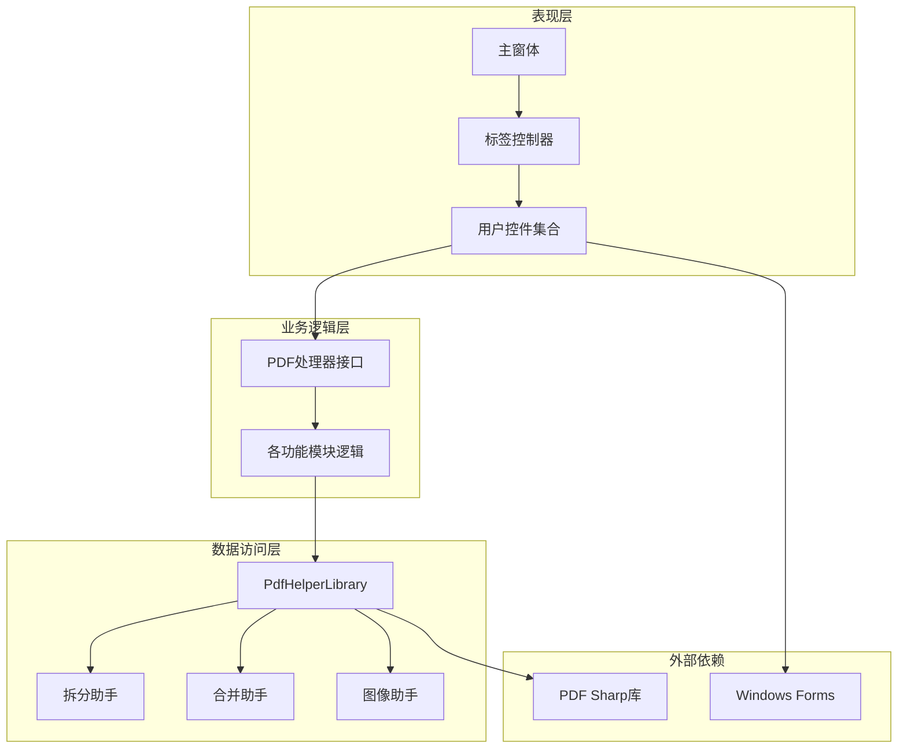
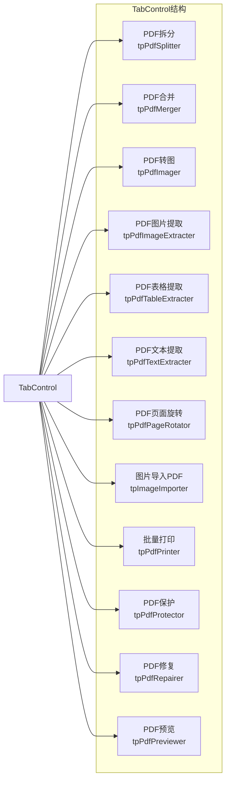
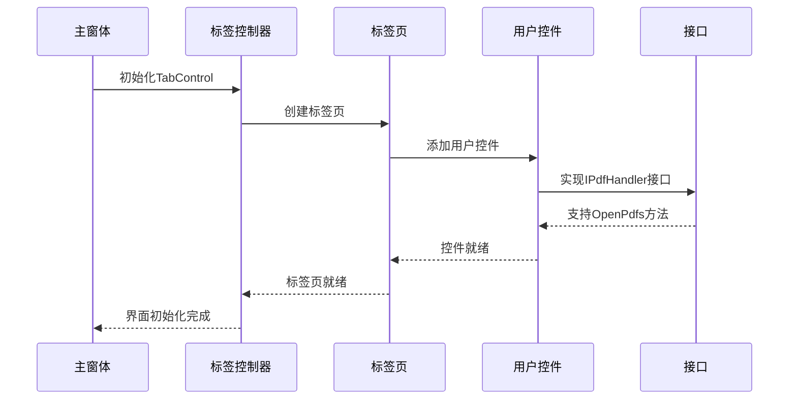
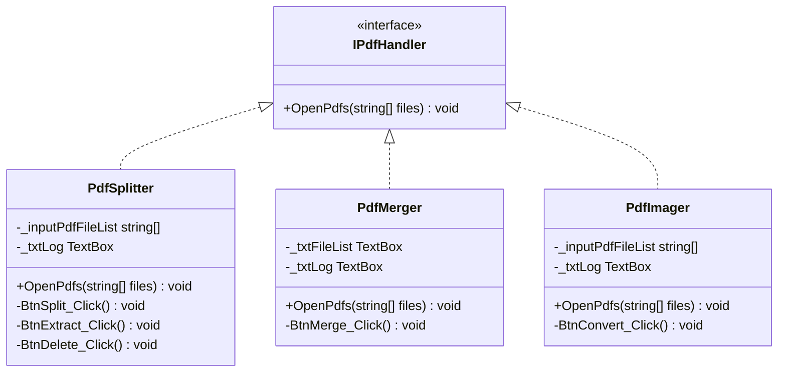
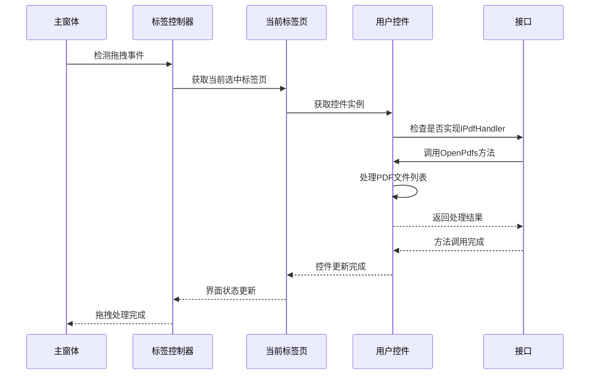
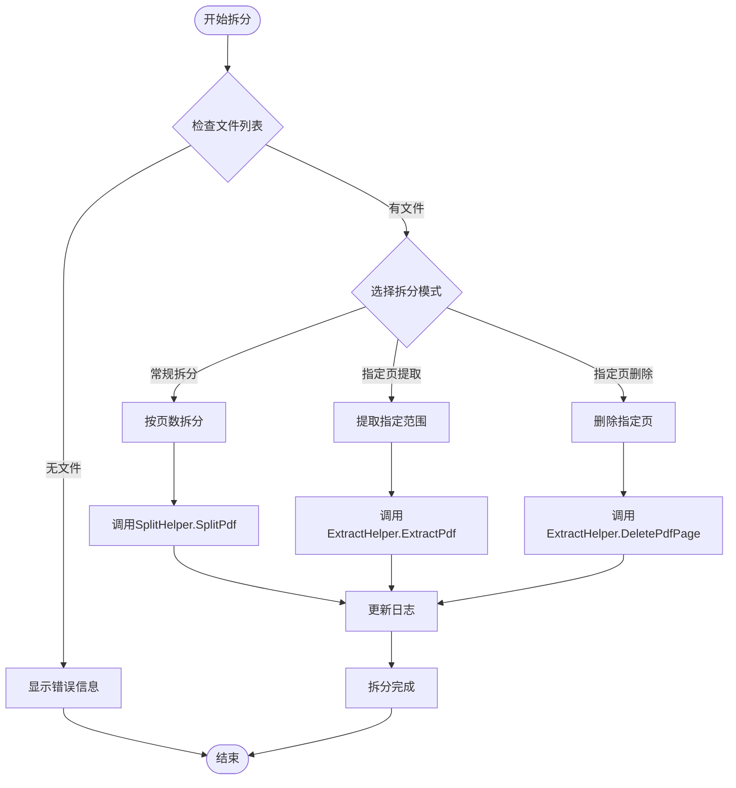
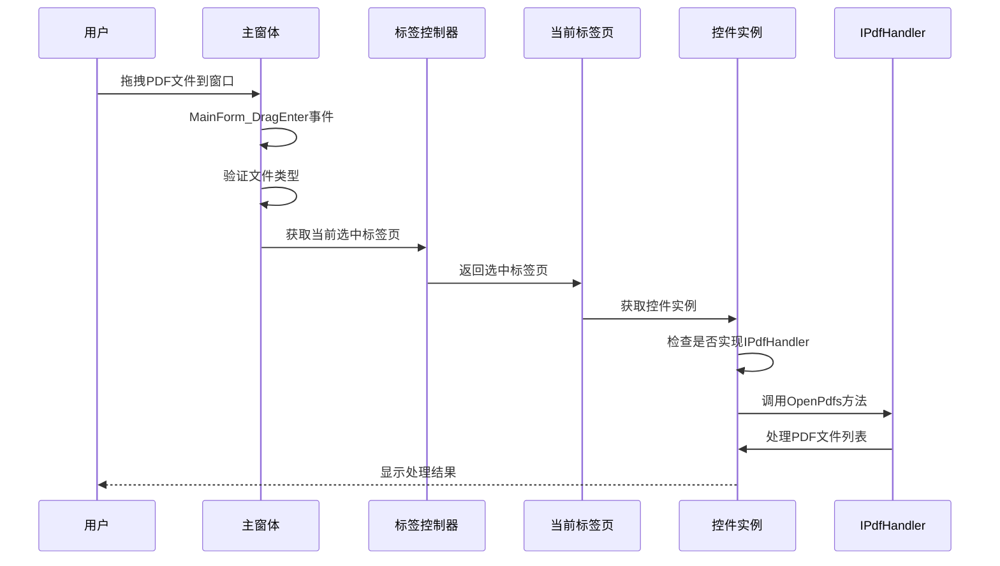
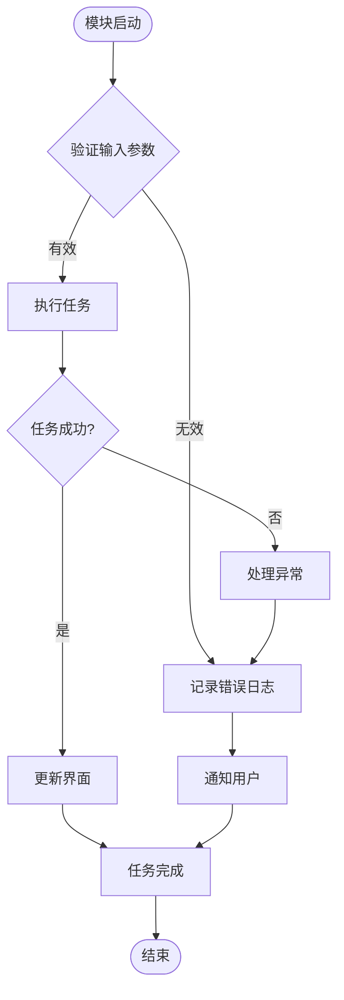

# 功能模块集成

<cite>
**本文档引用的文件**
- [MainForm.cs](file://PdfTool/MainForm.cs)
- [Common.cs](file://PdfTool/Common.cs)
- [PdfSplitter.cs](file://PdfTool/PdfSplitter.cs)
- [PdfMerger.cs](file://PdfTool/PdfMerger.cs)
- [PdfImager.cs](file://PdfTool/PdfImager.cs)
- [PdfImageExtracter.cs](file://PdfTool/PdfImageExtracter.cs)
- [PdfTableExtracter.cs](file://PdfTool/PdfTableExtracter.cs)
- [PdfTextExtracter.cs](file://PdfTool/PdfTextExtracter.cs)
- [PageRotator.cs](file://PdfTool/PageRotator.cs)
- [ImageImporter.cs](file://PdfTool/ImageImporter.cs)
- [PdfPrinter.cs](file://PdfTool/PdfPrinter.cs)
- [PdfProtector.cs](file://PdfTool/PdfProtector.cs)
- [PdfRepairer.cs](file://PdfTool/PdfRepairer.cs)
- [SplitHelper.cs](file://PdfHelperLibrary/SplitHelper.cs)
- [MergeHelper.cs](file://PdfHelperLibrary/MergeHelper.cs)
</cite>

## 目录
1. [概述](#概述)
2. [系统架构](#系统架构)
3. [主界面设计](#主界面设计)
4. [模块集成机制](#模块集成机制)
5. [IPdfHandler接口设计](#ipdfhandler接口设计)
6. [功能模块详解](#功能模块详解)
7. [通信模式分析](#通信模式分析)
8. [组件化设计优势](#组件化设计优势)
9. [调试策略](#调试策略)
10. [总结](#总结)

## 概述

PdfTool是一个基于.NET WinForms开发的PDF处理工具集，采用模块化架构设计，通过松耦合的方式将不同的PDF处理功能集成到统一的主界面中。该系统的核心设计理念是通过TabControl的标签页机制实现功能模块的动态加载和管理，每个功能模块都实现了统一的IPdfHandler接口，支持拖拽文件操作和统一的OpenPdfs方法调用。

## 系统架构

PdfTool采用了分层架构设计，主要包含以下几个层次：

**图表来源**
- [MainForm.cs](file://PdfTool/MainForm.cs#L128-L163)
- [Common.cs](file://PdfTool/Common.cs#L13-L16)

## 主界面设计

### TabControl布局结构

主界面采用TabControl作为容器，每个标签页代表一个独立的功能模块。TabControl的设计遵循以下原则：

1. **模块化组织**：每个功能模块占据独立的标签页
2. **动态加载**：运行时根据需要创建和销毁控件实例
3. **统一接口**：所有模块都实现相同的IPdfHandler接口

**图表来源**
- [MainForm.cs](file://PdfTool/MainForm.cs#L135-L148)

### 界面初始化流程

主界面的初始化过程包括以下关键步骤：

1. **控件创建**：动态创建TabControl和所有标签页
2. **模块绑定**：为每个标签页添加对应的用户控件
3. **事件注册**：设置拖拽事件处理程序
4. **样式配置**：应用统一的界面风格

**章节来源**
- [MainForm.cs](file://PdfTool/MainForm.cs#L78-L190)

## 模块集成机制

### 动态控件添加

PdfTool通过在TabControl的各个TabPage中动态添加用户控件来实现功能集成。这种设计具有以下特点：

1. **延迟加载**：控件只在首次访问标签页时创建
2. **内存优化**：未使用的模块不会占用内存
3. **扩展性强**：新增模块只需添加新的标签页和控件

**图表来源**
- [MainForm.cs](file://PdfTool/MainForm.cs#L151-L163)

### 模块职责划分

每个功能模块都有明确的职责分工：

| 模块名称 | 主要职责 | 核心功能 |
|---------|---------|---------|
| PdfSplitter | PDF拆分处理 | 按页数拆分、指定范围提取、删除指定页 |
| PdfMerger | PDF合并处理 | 多文件合并、书签添加、输出路径控制 |
| PdfImager | PDF转图像 | 全页转换、指定页转换、多种格式支持 |
| PdfImageExtracter | 图片提取 | 从PDF中提取所有图片 |
| PdfTableExtracter | 表格提取 | 提取PDF表格内容并导出为Excel |
| PdfTextExtracter | 文本提取 | 提取PDF纯文本内容 |
| PageRotator | 页面旋转 | 批量旋转PDF页面 |
| ImageImporter | 图片导入 | 将图片转换为PDF文档 |
| PdfPrinter | 打印功能 | 将PDF发送到默认打印机 |
| PdfProtector | 安全保护 | 设置/移除PDF密码保护 |
| PdfRepairer | 文件修复 | 修复损坏的PDF文件 |

**章节来源**
- [PdfSplitter.cs](file://PdfTool/PdfSplitter.cs#L12)
- [PdfMerger.cs](file://PdfTool/PdfMerger.cs#L12)
- [PdfImager.cs](file://PdfTool/PdfImager.cs#L13)

## IPdfHandler接口设计

### 接口定义

IPdfHandler接口是整个模块集成系统的核心抽象，它定义了所有PDF处理模块必须实现的标准方法：

**图表来源**
- [Common.cs](file://PdfTool/Common.cs#L13-L16)
- [PdfSplitter.cs](file://PdfTool/PdfSplitter.cs#L12)
- [PdfMerger.cs](file://PdfTool/PdfMerger.cs#L12)
- [PdfImager.cs](file://PdfTool/PdfImager.cs#L13)

### 统一方法调用

通过IPdfHandler接口，主界面可以对所有PDF处理模块执行统一的操作：

**图表来源**
- [MainForm.cs](file://PdfTool/MainForm.cs#L46-L52)

**章节来源**
- [Common.cs](file://PdfTool/Common.cs#L13-L16)
- [MainForm.cs](file://PdfTool/MainForm.cs#L46-L52)

## 功能模块详解

### PdfSplitter - PDF拆分器

PdfSplitter模块负责PDF文档的拆分处理，提供三种主要功能：

1. **常规拆分**：按指定页数拆分子文档
2. **指定页提取**：提取指定范围的页面
3. **指定页删除**：删除指定的页面

**图表来源**
- [PdfSplitter.cs](file://PdfTool/PdfSplitter.cs#L54-L105)
- [SplitHelper.cs](file://PdfHelperLibrary/SplitHelper.cs#L37-L67)

### PdfMerger - PDF合并器

PdfMerger模块专注于PDF文档的合并处理，支持以下特性：

1. **多文件合并**：将多个PDF文件合并为单个文件
2. **书签添加**：为每个合并的文件添加书签导航
3. **输出控制**：自定义输出文件名和自动打开选项

**章节来源**
- [PdfSplitter.cs](file://PdfTool/PdfSplitter.cs#L12-L230)
- [PdfMerger.cs](file://PdfTool/PdfMerger.cs#L12-L154)

### PdfImager - PDF转图像器

PdfImager模块提供PDF到图像格式的转换功能：

1. **DPI设置**：支持多种分辨率设置
2. **格式选择**：支持PNG、JPG、BMP等多种格式
3. **页面范围**：支持全页转换和指定页面转换

**章节来源**
- [PdfImager.cs](file://PdfTool/PdfImager.cs#L13-L218)

## 通信模式分析

### 拖拽事件处理

PdfTool采用拖拽事件作为主要的文件输入方式，实现了智能的模块识别和处理：

**图表来源**
- [MainForm.cs](file://PdfTool/MainForm.cs#L33-L59)

### 文件类型检测

系统能够智能识别不同类型的文件并分配给相应的模块：

| 文件类型 | 目标模块 | 处理方法 |
|---------|---------|---------|
| .pdf文件 | IPdfHandler实现的模块 | OpenPdfs方法 |
| .bmp/.jpg/.tif/.png文件 | ImageImporter模块 | OpenImages方法 |

**章节来源**
- [MainForm.cs](file://PdfTool/MainForm.cs#L46-L58)

## 组件化设计优势

### 可维护性优势

1. **职责分离**：每个模块专注于特定功能领域
2. **接口标准化**：统一的IPdfHandler接口简化了模块集成
3. **低耦合设计**：模块间通过接口通信，减少依赖关系
4. **易于扩展**：新增功能模块只需实现IPdfHandler接口

### 性能优化

1. **按需加载**：未使用的模块不会占用内存资源
2. **异步处理**：长时间运行的操作使用BackgroundWorker
3. **资源管理**：及时释放不再需要的控件实例

### 错误处理

## 调试策略

### 日志记录机制

每个功能模块都内置了详细的日志记录功能：

1. **操作日志**：记录所有用户操作和系统响应
2. **错误追踪**：捕获并记录异常信息
3. **进度报告**：长时间操作的进度反馈

### 调试模式支持

系统提供了专门的调试模式，允许开发者：

1. **动态重载**：双击标签页可重新加载对应模块
2. **状态监控**：实时查看模块状态和参数
3. **性能分析**：监控模块的内存和CPU使用情况

**章节来源**
- [MainForm.cs](file://PdfTool/MainForm.cs#L165-L188)

## 总结

PdfTool的功能模块集成系统展现了优秀的软件架构设计：

1. **松耦合架构**：通过IPdfHandler接口实现模块间的松耦合
2. **统一接口设计**：标准化的方法调用简化了系统集成
3. **动态加载机制**：按需创建控件实例优化了资源使用
4. **智能通信模式**：拖拽事件处理实现了直观的用户交互
5. **模块化职责**：清晰的功能划分提高了系统的可维护性

这种设计不仅满足了当前的功能需求，还为未来的功能扩展提供了良好的基础。通过组件化的设计理念，PdfTool实现了高度的灵活性和可扩展性，为用户提供了一个强大而易用的PDF处理工具集。