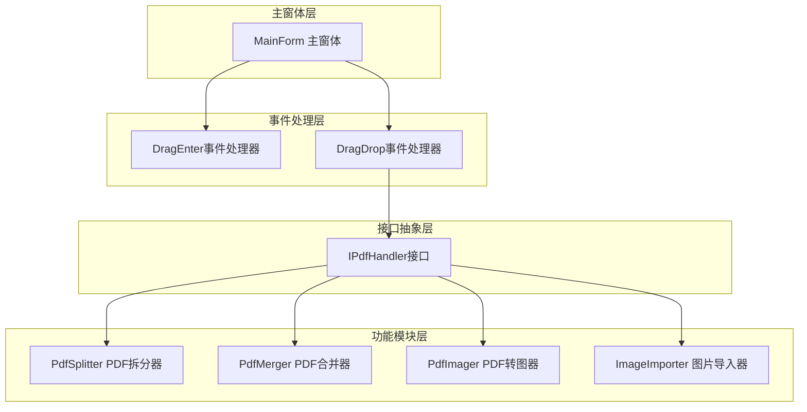
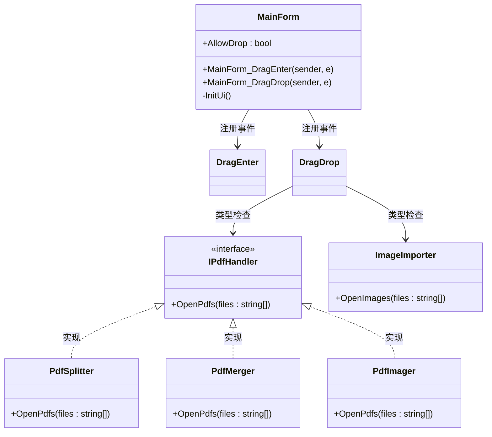
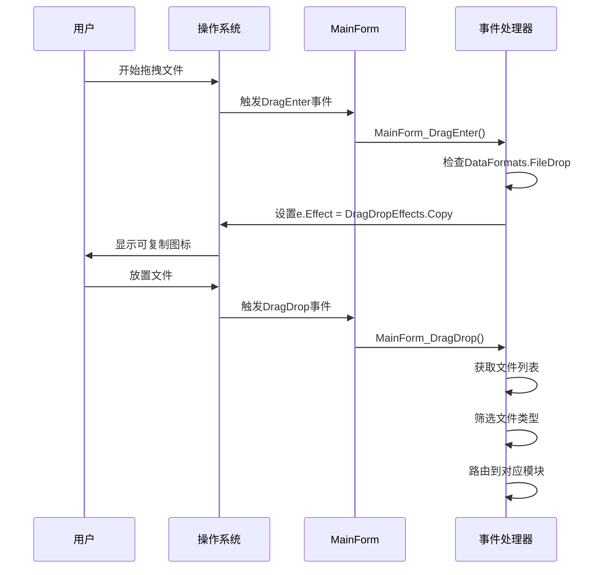
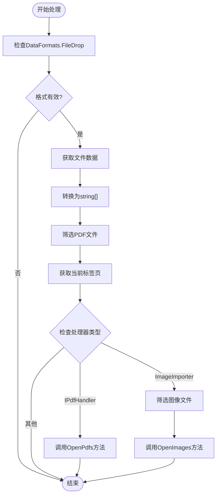
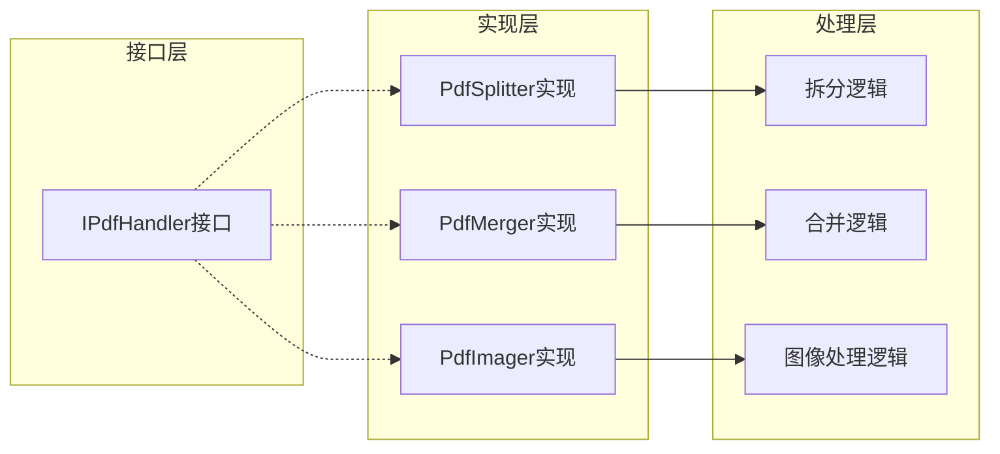
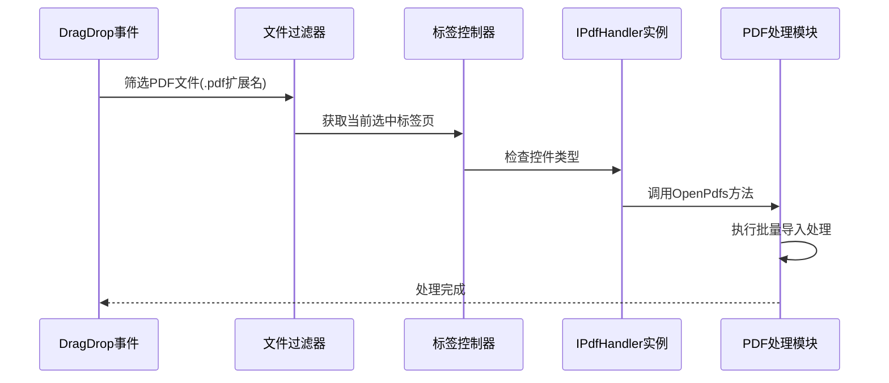
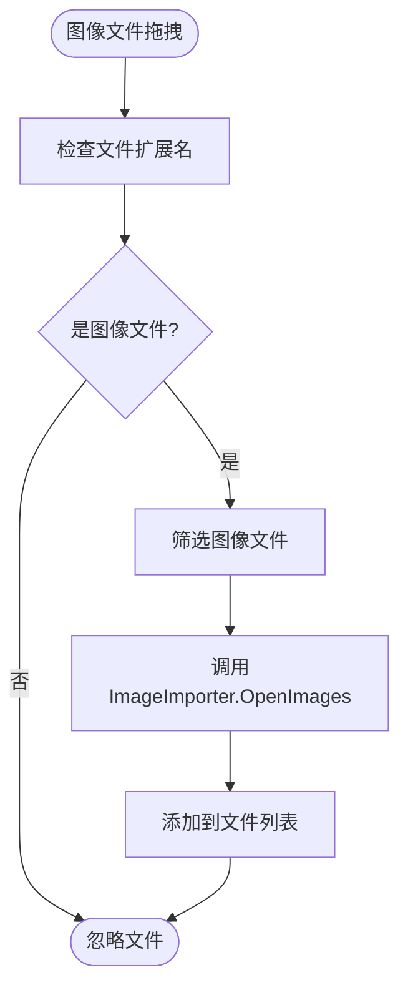
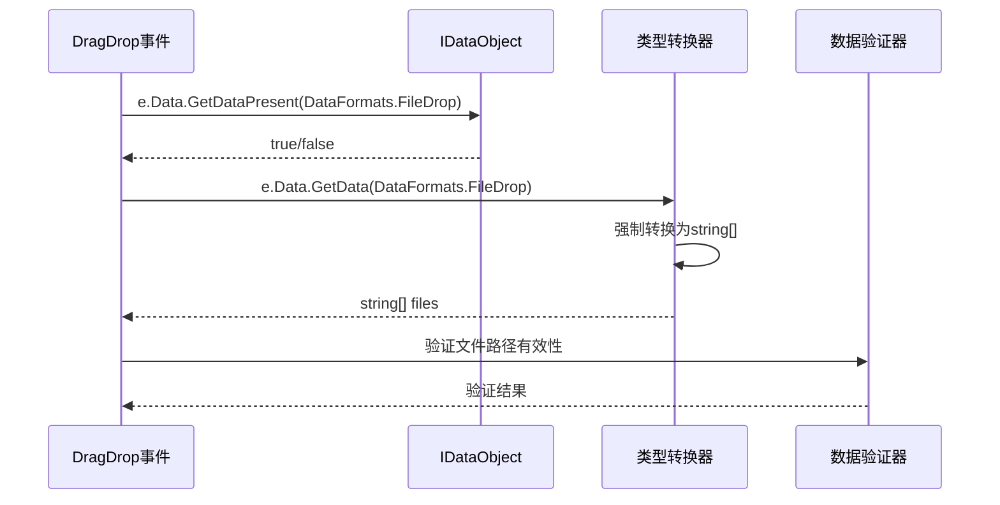
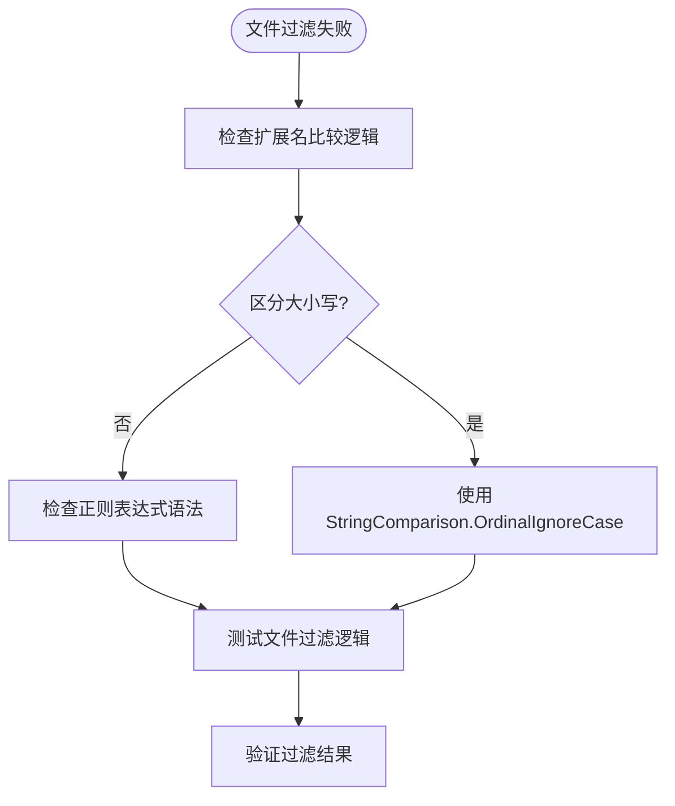

# 拖拽操作

<cite>
**本文档引用的文件**
- [MainForm.cs](file://PdfTool/MainForm.cs)
- [MainForm.Designer.cs](file://PdfTool/MainForm.Designer.cs)
- [Common.cs](file://PdfTool/Common.cs)
- [ImageImporter.cs](file://PdfTool/ImageImporter.cs)
- [PdfSplitter.cs](file://PdfTool/PdfSplitter.cs)
- [PdfMerger.cs](file://PdfTool/PdfMerger.cs)
- [PdfImager.cs](file://PdfTool/PdfImager.cs)
</cite>

## 目录
1. [简介](#简介)
2. [项目结构概述](#项目结构概述)
3. [拖拽功能核心架构](#拖拽功能核心架构)
4. [MainForm拖拽机制详解](#mainform拖拽机制详解)
5. [IPdfHandler接口设计](#ipdfhandler接口设计)
6. [模块化处理流程](#模块化处理流程)
7. [数据类型转换与安全处理](#数据类型转换与安全处理)
8. [常见问题解决方案](#常见问题解决方案)
9. [性能优化建议](#性能优化建议)
10. [总结](#总结)

## 简介

PdfTool拖拽操作机制是一个高度模块化的文件处理系统，通过Windows Forms的拖拽事件框架实现了灵活的文件导入功能。该系统采用事件驱动的设计模式，支持多种文件类型的智能识别和路由处理，为用户提供了直观便捷的文件操作体验。

## 项目结构概述

PdfTool项目采用模块化架构设计，主要包含以下核心组件：

**图表来源**
- [MainForm.cs](file://PdfTool/MainForm.cs#L15-L23)
- [Common.cs](file://PdfTool/Common.cs#L13-L16)

## 拖拽功能核心架构

### 核心组件关系图

**图表来源**
- [MainForm.cs](file://PdfTool/MainForm.cs#L33-L60)
- [Common.cs](file://PdfTool/Common.cs#L13-L16)
- [ImageImporter.cs](file://PdfTool/ImageImporter.cs#L29-L35)

**章节来源**
- [MainForm.cs](file://PdfTool/MainForm.cs#L12-L60)
- [Common.cs](file://PdfTool/Common.cs#L13-L16)

## MainForm拖拽机制详解

### AllowDrop属性启用

MainForm通过设置`AllowDrop = true`启用拖拽支持，这是Windows Forms拖拽功能的基础配置。

**图表来源**
- [MainForm.cs](file://PdfTool/MainForm.cs#L33-L60)

### DragEnter事件处理机制

DragEnter事件负责验证拖拽数据格式并设置拖拽效果：

| 处理步骤 | 功能描述 | 实现细节 |
|---------|---------|---------|
| 数据格式检查 | 验证是否支持文件拖拽 | `e.Data.GetDataPresent(DataFormats.FileDrop)` |
| 效果设置 | 设置拖拽操作效果 | `e.Effect = DragDropEffects.Copy` |
| 用户反馈 | 提供视觉反馈 | 系统自动显示可复制图标 |

**章节来源**
- [MainForm.cs](file://PdfTool/MainForm.cs#L33-L38)

### DragDrop事件处理流程

DragDrop事件是整个拖拽机制的核心，负责文件处理的完整流程：

**图表来源**
- [MainForm.cs](file://PdfTool/MainForm.cs#L41-L58)

**章节来源**
- [MainForm.cs](file://PdfTool/MainForm.cs#L41-L60)

## IPdfHandler接口设计

### 接口定义与职责

IPdfHandler接口作为PDF处理模块的统一契约，定义了标准的文件处理方法：

| 方法名称 | 参数类型 | 返回类型 | 功能描述 |
|---------|---------|---------|---------|
| OpenPdfs | List<string> | void | 批量导入PDF文件到处理模块 |

### 模块化设计优势

**图表来源**
- [Common.cs](file://PdfTool/Common.cs#L13-L16)
- [PdfSplitter.cs](file://PdfTool/PdfSplitter.cs#L12)
- [PdfMerger.cs](file://PdfTool/PdfMerger.cs#L12)
- [PdfImager.cs](file://PdfTool/PdfImager.cs#L13)

**章节来源**
- [Common.cs](file://PdfTool/Common.cs#L13-L16)

## 模块化处理流程

### PDF文件处理流程

当拖拽的文件包含PDF格式时，系统会自动识别并路由到相应的处理模块：

**图表来源**
- [MainForm.cs](file://PdfTool/MainForm.cs#L46-L51)

### 图像文件处理流程

对于图片导入场景，系统会识别特定的图像格式并交由ImageImporter处理：

| 支持的图像格式 | 扩展名 | 处理方式 |
|---------------|--------|---------|
| 位图文件 | .bmp | 直接导入 |
| JPEG文件 | .jpg | 直接导入 |
| TIFF文件 | .tif | 直接导入 |
| PNG文件 | .png | 直接导入 |

**图表来源**
- [MainForm.cs](file://PdfTool/MainForm.cs#L53-L57)
- [ImageImporter.cs](file://PdfTool/ImageImporter.cs#L29-L35)

**章节来源**
- [MainForm.cs](file://PdfTool/MainForm.cs#L46-L58)
- [ImageImporter.cs](file://PdfTool/ImageImporter.cs#L29-L35)

## 数据类型转换与安全处理

### DataFormats.FileDrop数据处理

拖拽操作中涉及的关键数据类型转换过程：

**图表来源**
- [MainForm.cs](file://PdfTool/MainForm.cs#L43-L45)

### 安全处理机制

| 安全检查点 | 检查内容 | 处理策略 |
|-----------|---------|---------|
| 数据格式验证 | 检查DataFormats.FileDrop支持 | `GetDataPresent()`方法 |
| 类型转换安全 | 确保强制转换成功 | 显式类型转换 |
| 文件路径验证 | 验证文件路径有效性 | 后续模块处理 |
| 内存管理 | 及时释放临时对象 | 自动垃圾回收 |

**章节来源**
- [MainForm.cs](file://PdfTool/MainForm.cs#L43-L45)

## 常见问题解决方案

### 拖拽无响应问题

**问题症状**: 文件拖拽到程序窗口无任何反应

**可能原因与解决方案**:

| 问题原因 | 解决方案 | 实现位置 |
|---------|---------|---------|
| AllowDrop属性未设置 | 确保AllowDrop = true | MainForm构造函数 |
| 事件处理器未注册 | 检查DragEnter/DragDrop事件绑定 | MainForm构造函数 |
| 文件格式不支持 | 验证DataFormats.FileDrop支持 | DragEnter事件处理 |
| 权限不足 | 检查应用程序权限 | 系统级配置 |

### 文件过滤失败问题

**问题症状**: 应该过滤掉的文件仍然被处理

**排查步骤**:

**图表来源**
- [MainForm.cs](file://PdfTool/MainForm.cs#L46)

### 性能优化问题

**问题症状**: 大量文件拖拽时响应缓慢

**优化策略**:

| 优化方面 | 具体措施 | 预期效果 |
|---------|---------|---------|
| 文件数量限制 | 设置最大文件数量阈值 | 减少内存占用 |
| 异步处理 | 使用BackgroundWorker | 保持UI响应性 |
| 批量处理 | 分批处理大文件集 | 提高处理效率 |
| 缓存机制 | 缓存文件信息 | 减少重复计算 |

**章节来源**
- [MainForm.cs](file://PdfTool/MainForm.cs#L46-L58)

## 性能优化建议

### 内存管理优化

1. **及时释放资源**: 在文件处理完成后立即清理临时对象
2. **批量操作**: 对大量文件采用分批处理策略
3. **内存监控**: 监控内存使用情况，避免内存泄漏

### 用户体验优化

1. **进度反馈**: 对于耗时操作提供进度指示
2. **错误提示**: 友好的错误信息和恢复建议
3. **操作确认**: 对重要操作提供确认对话框

### 代码维护性优化

1. **接口抽象**: 通过IPdfHandler接口实现模块解耦
2. **异常处理**: 完善的异常捕获和处理机制
3. **日志记录**: 记录关键操作和错误信息

## 总结

PdfTool的拖拽操作机制展现了现代Windows Forms应用的最佳实践，通过以下关键技术实现了高效、稳定的文件处理功能：

### 核心技术特点

1. **事件驱动架构**: 基于Windows Forms事件模型的响应式设计
2. **模块化接口**: IPdfHandler接口实现的功能模块解耦
3. **智能路由**: 基于文件类型的自动路由机制
4. **类型安全**: 完善的数据类型转换和验证机制

### 设计优势

- **可扩展性**: 新增处理模块只需实现IPdfHandler接口
- **可维护性**: 清晰的职责分离和接口抽象
- **用户体验**: 直观的拖拽操作和即时反馈
- **稳定性**: 完善的错误处理和异常恢复机制

该拖拽操作机制不仅满足了当前的功能需求，更为系统的未来发展奠定了坚实的技术基础，体现了良好的软件工程实践和架构设计理念。