# 界面层

<cite>
**本文档引用的文件**
- [MainForm.cs](file://PdfTool/MainForm.cs)
- [MainForm.Designer.cs](file://PdfTool/MainForm.Designer.cs)
- [Common.cs](file://PdfTool/Common.cs)
- [Config.cs](file://PdfTool/Config.cs)
- [PdfMerger.cs](file://PdfTool/PdfMerger.cs)
- [PdfSplitter.cs](file://PdfTool/PdfSplitter.cs)
- [ImageImporter.cs](file://PdfTool/ImageImporter.cs)
- [PdfImager.cs](file://PdfTool/PdfImager.cs)
- [PdfPreviewer.cs](file://PdfTool/PdfPreviewer.cs)
- [PdfPreviewPanel.cs](file://PdfTool/PdfPreviewPanel.cs)
- [MergeHelper.cs](file://PdfHelperLibrary/MergeHelper.cs)
</cite>

## 目录
1. [概述](#概述)
2. [项目架构](#项目架构)
3. [MainForm核心设计](#mainform核心设计)
4. [标签页管理系统](#标签页管理系统)
5. [拖拽操作实现](#拖拽操作实现)
6. [界面初始化流程](#界面初始化流程)
7. [IPdfHandler接口设计](#ipdfhandler接口设计)
8. [功能模块集成](#功能模块集成)
9. [WinForms设计器协作](#winforms设计器协作)
10. [性能优化策略](#性能优化策略)
11. [总结](#总结)

## 概述

PdfTool的界面层采用WinForms技术栈，通过模块化设计实现了12个PDF处理功能的统一管理。界面层的核心设计理念是通过标签页TabControl实现功能模块的隔离与复用，同时通过IPdfHandler接口实现松耦合的模块间通信。

## 项目架构

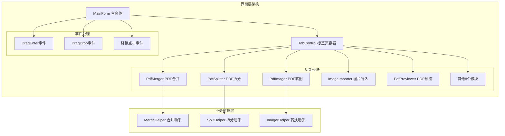

**图表来源**
- [MainForm.cs](file://PdfTool/MainForm.cs#L12-L194)
- [PdfMerger.cs](file://PdfTool/PdfMerger.cs#L12-L154)
- [PdfSplitter.cs](file://PdfTool/PdfSplitter.cs#L12-L230)

## MainForm核心设计

MainForm作为整个应用的主窗体，承担着界面初始化、事件处理和模块管理的核心职责。

### 构造函数设计

MainForm的构造函数采用了简洁的设计模式，通过依赖注入的方式初始化各个组件：

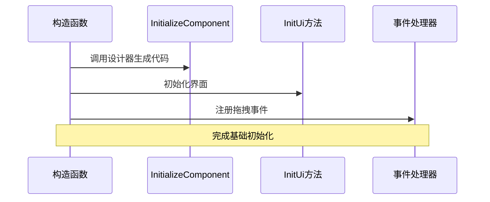

**图表来源**
- [MainForm.cs](file://PdfTool/MainForm.cs#L15-L23)

### 常量配置管理

界面层定义了三个重要的URL常量，用于用户反馈、使用说明和赞赏功能：

| 功能模块 | URL地址 | 用途 |
|---------|---------|------|
| 赞赏链接 | https://www.yuque.com/lengda/eq8cm6/rylia4 | 用户赞赏开发者 |
| 反馈链接 | https://www.yuque.com/lengda/eq8cm6/ezwik4 | 用户问题反馈 |
| 使用说明 | https://www.yuque.com/lengda/eq8cm6/fgfthhr3e53qkszl | 功能使用指南 |

**节来源**
- [MainForm.cs](file://PdfTool/MainForm.cs#L27-L29)

## 标签页管理系统

### 动态标签页创建

MainForm通过InitUi方法动态创建包含12个功能模块的标签页系统：

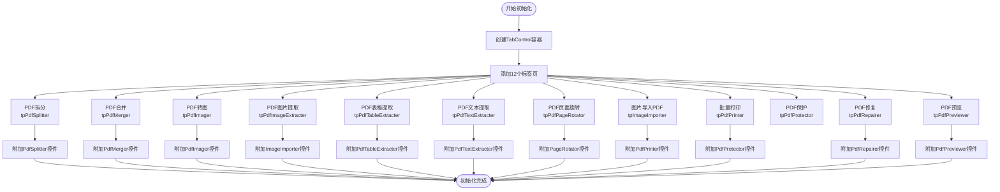

**图表来源**
- [MainForm.cs](file://PdfTool/MainForm.cs#L128-L163)

### 标签页布局配置

每个标签页都采用了统一的BorderNone样式，确保界面的一致性：

| 标签页名称 | 功能模块 | 控件类型 | 布局方式 |
|-----------|----------|----------|----------|
| tpPdfSplitter | PDF拆分 | PdfSplitter | DockStyle.Fill |
| tpPdfMerger | PDF合并 | PdfMerger | DockStyle.Fill |
| tpPdfImager | PDF转图 | PdfImager | DockStyle.Fill |
| tpImageImporter | 图片导入 | ImageImporter | DockStyle.Fill |
| tpPdfPreviewer | PDF预览 | PdfPreviewer | DockStyle.Fill |
| ... | ... | ... | ... |

**节来源**
- [MainForm.cs](file://PdfTool/MainForm.cs#L135-L148)

## 拖拽操作实现

### DragEnter事件处理

拖拽操作的实现采用了类型识别和路由机制，确保不同类型的文件能够正确分配到相应的功能模块：

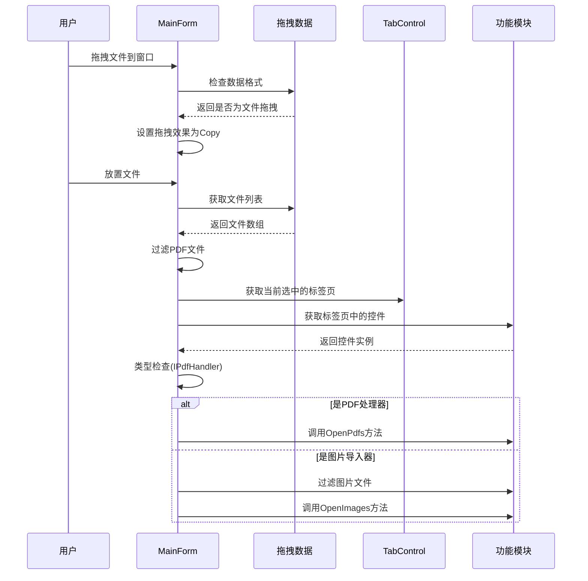

**图表来源**
- [MainForm.cs](file://PdfTool/MainForm.cs#L33-L58)

### 文件类型识别机制

系统通过严格的文件扩展名检查来确保正确的文件分类：

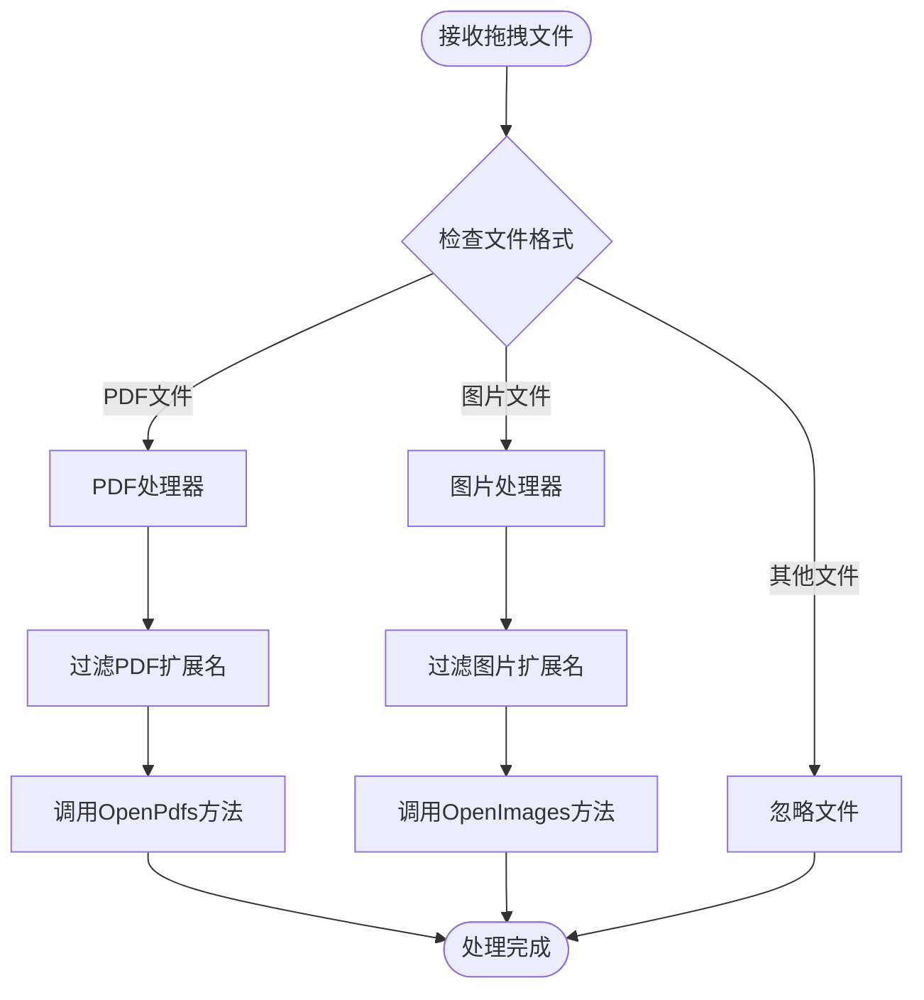

**图表来源**
- [MainForm.cs](file://PdfTool/MainForm.cs#L43-L58)

**节来源**
- [MainForm.cs](file://PdfTool/MainForm.cs#L33-L58)

## 界面初始化流程

### InitUi方法详解

InitUi方法是界面初始化的核心，负责创建和配置所有UI元素：

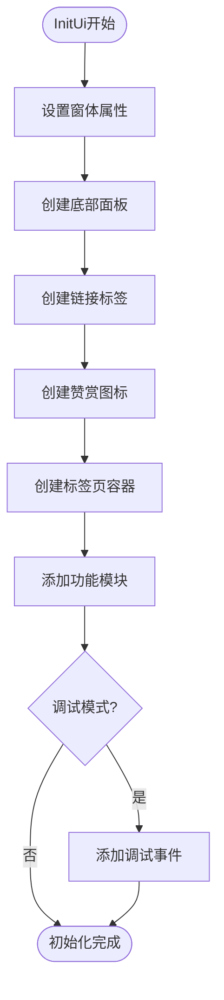

**图表来源**
- [MainForm.cs](file://PdfTool/MainForm.cs#L79-L190)

### 底部状态栏设计

底部状态栏包含了三个重要的用户交互元素：

| 元素类型 | 功能 | 位置 | 触发行为 |
|---------|------|------|----------|
| 链接标签1 | 问题反馈 | 右侧 | 打开反馈页面 |
| 链接标签2 | 使用说明 | 右侧 | 打开使用指南 |
| 图标 | 赞赏 | 左侧 | 打开赞赏页面 |
| Tooltip | 提示信息 | 图标 | "点击进行赞赏" |

**节来源**
- [MainForm.cs](file://PdfTool/MainForm.cs#L79-L127)

### 配置参数管理

界面层采用了集中式的配置管理，通过Config类统一管理控件间距：

| 参数名称 | 默认值 | 用途 |
|---------|--------|------|
| ControlMargin | 20 | 控件外边距 |
| ControlPadding | 12 | 控件内边距 |

**节来源**
- [Config.cs](file://PdfTool/Config.cs#L1-L9)

## IPdfHandler接口设计

### 接口定义与实现

IPdfHandler接口是界面层与业务逻辑层解耦的关键设计：

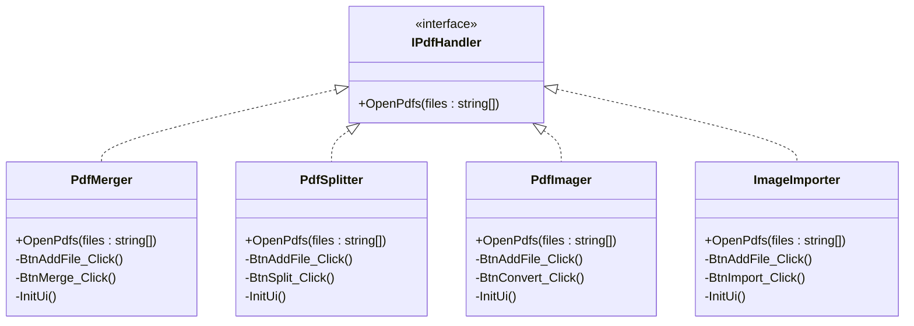

**图表来源**
- [Common.cs](file://PdfTool/Common.cs#L13-L16)
- [PdfMerger.cs](file://PdfTool/PdfMerger.cs#L12)
- [PdfSplitter.cs](file://PdfTool/PdfSplitter.cs#L12)
- [PdfImager.cs](file://PdfTool/PdfImager.cs#L13)
- [ImageImporter.cs](file://PdfTool/ImageImporter.cs#L12)

### 松耦合集成机制

通过IPdfHandler接口，界面层与具体的功能实现完全解耦：

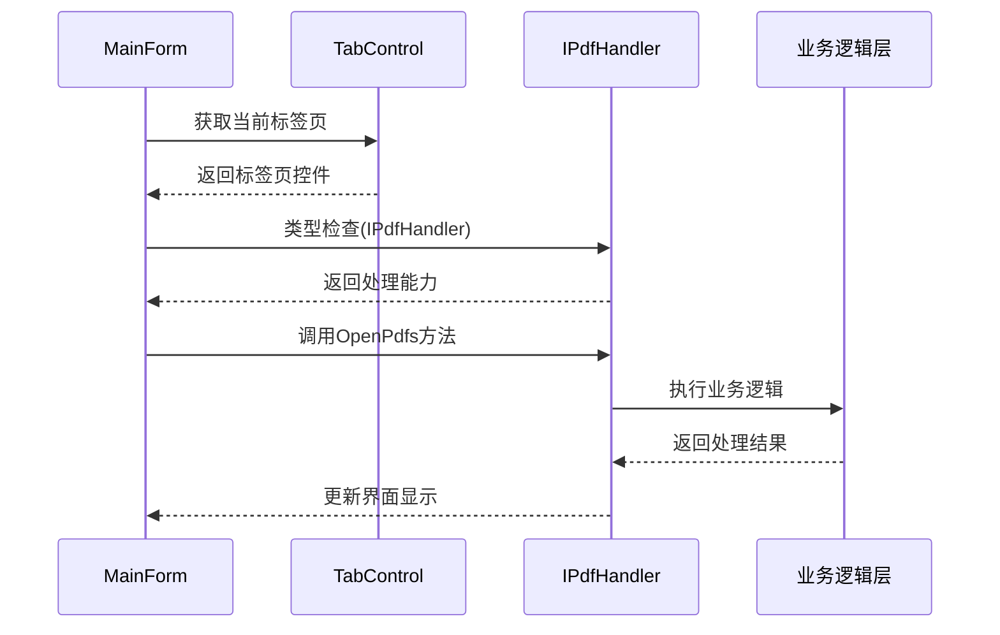

**图表来源**
- [MainForm.cs](file://PdfTool/MainForm.cs#L48-L52)

**节来源**
- [Common.cs](file://PdfTool/Common.cs#L13-L16)

## 功能模块集成

### PdfMerger模块集成

PdfMerger作为PDF合并功能的典型代表，展示了界面层与业务逻辑层的集成模式：

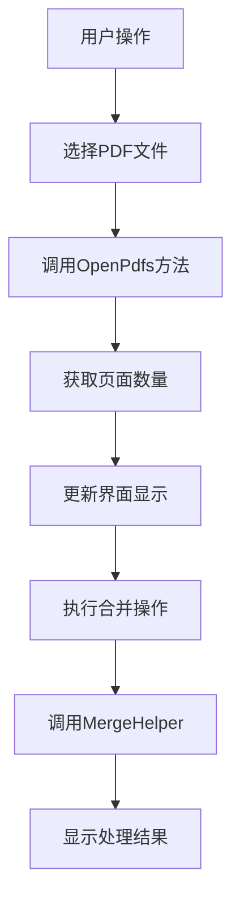

**图表来源**
- [PdfMerger.cs](file://PdfTool/PdfMerger.cs#L33-L40)
- [PdfMerger.cs](file://PdfTool/PdfMerger.cs#L61-L70)

### MergeHelper调用关系

PdfMerger通过MergeHelper执行实际的合并操作，体现了清晰的分层架构：

| 调用层级 | 组件名称 | 职责 | 输入参数 |
|---------|----------|------|----------|
| 界面层 | PdfMerger | 用户界面控制 | 文件列表、配置选项 |
| 业务层 | MergeHelper | 合并逻辑实现 | 输入文件列表、自动打开、添加书签 |
| 数据层 | PdfSharp | PDF文档操作 | PDF文档对象 |

**节来源**
- [PdfMerger.cs](file://PdfTool/PdfMerger.cs#L61-L70)
- [MergeHelper.cs](file://PdfHelperLibrary/MergeHelper.cs#L11-L37)

### 其他模块集成模式

除了PdfMerger，其他功能模块也遵循相同的集成模式：

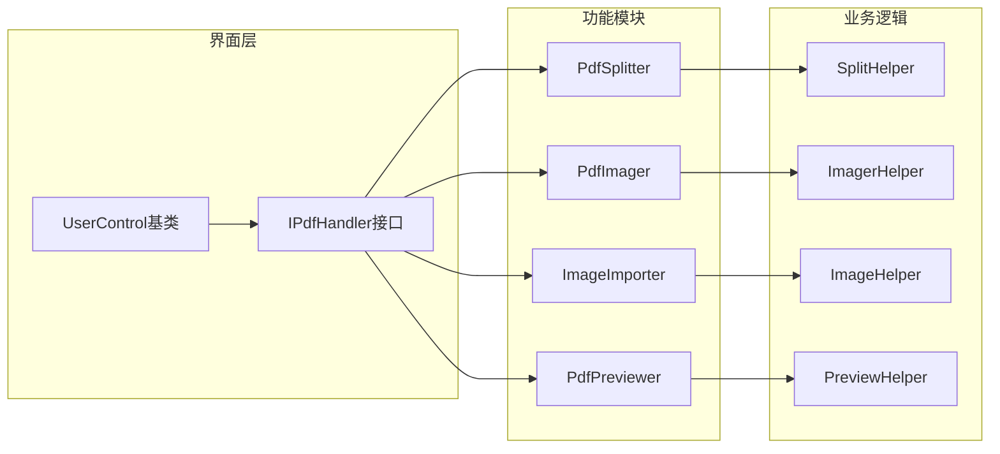

**图表来源**
- [PdfSplitter.cs](file://PdfTool/PdfSplitter.cs#L12)
- [PdfImager.cs](file://PdfTool/PdfImager.cs#L13)
- [ImageImporter.cs](file://PdfTool/ImageImporter.cs#L12)
- [PdfPreviewer.cs](file://PdfTool/PdfPreviewer.cs#L13)

## WinForms设计器协作

### 手动代码与设计器代码的协作模式

PdfTool的界面层采用了混合开发模式，合理利用WinForms设计器和手动代码：

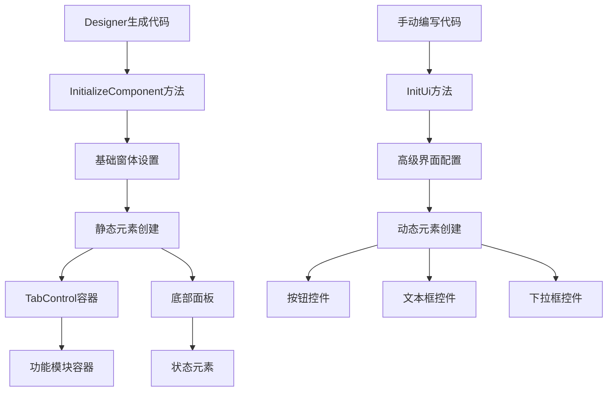

**图表来源**
- [MainForm.cs](file://PdfTool/MainForm.cs#L15-L23)
- [MainForm.Designer.cs](file://PdfTool/MainForm.Designer.cs#L29-L35)

### 代码分离原则

界面层严格遵循代码分离原则：

| 分离原则 | 设计器代码 | 手动代码 | 优势 |
|---------|-----------|----------|------|
| 基础布局 | ✓ | ✗ | 设计器可视化编辑 |
| 事件绑定 | ✗ | ✓ | 灵活的事件处理 |
| 动态创建 | ✗ | ✓ | 运行时动态生成 |
| 复杂逻辑 | ✗ | ✓ | 便于维护和测试 |

**节来源**
- [MainForm.Designer.cs](file://PdfTool/MainForm.Designer.cs#L29-L35)
- [MainForm.cs](file://PdfTool/MainForm.cs#L79-L190)

## 性能优化策略

### 内存管理优化

界面层采用了多种内存管理策略来提升性能：

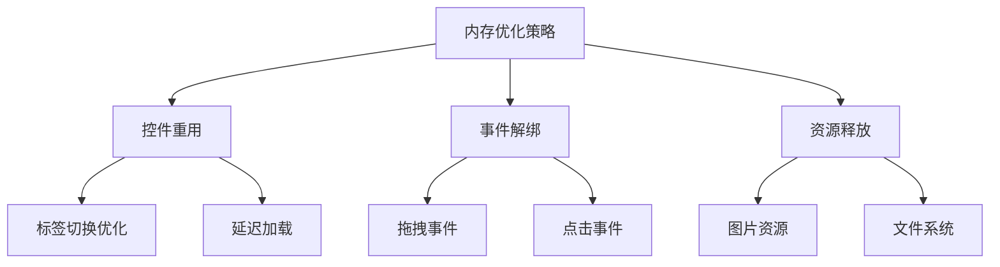

### 界面响应性优化

为了确保界面的流畅响应，采用了以下优化措施：

| 优化策略 | 实现方式 | 效果 |
|---------|----------|------|
| 异步处理 | BackgroundWorker | 防止界面冻结 |
| 延迟加载 | 按需创建控件 | 减少启动时间 |
| 缓存机制 | 图片预览缓存 | 提升浏览速度 |
| 事件节流 | 防止重复触发 | 减少系统负担 |

### 调试模式下的开发辅助

在调试模式下，界面层提供了额外的开发辅助功能：

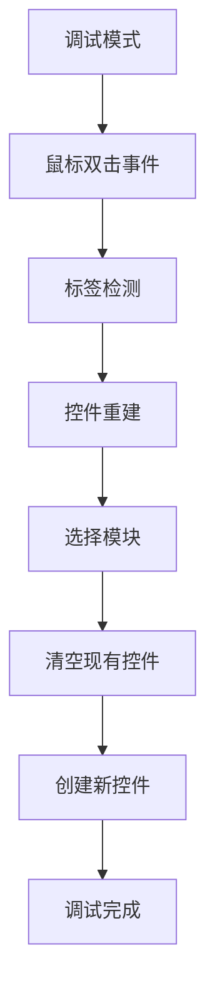

**图表来源**
- [MainForm.cs](file://PdfTool/MainForm.cs#L166-L188)

**节来源**
- [MainForm.cs](file://PdfTool/MainForm.cs#L165-L189)

## 总结

PdfTool的界面层设计体现了现代WinForms应用的最佳实践，通过以下关键特性实现了高效、可维护的用户界面：

### 核心优势

1. **模块化设计**：通过TabControl实现功能模块的隔离，每个模块独立开发和维护
2. **接口驱动**：IPdfHandler接口确保了界面层与业务逻辑层的松耦合
3. **拖拽集成**：智能的拖拽处理机制提升了用户体验
4. **灵活配置**：统一的配置参数管理简化了界面定制
5. **性能优化**：异步处理和资源管理确保了良好的响应性能

### 技术亮点

- **动态标签页系统**：支持12个功能模块的无缝切换
- **智能文件路由**：根据文件类型自动分配到相应功能模块
- **混合开发模式**：合理利用WinForms设计器和手动代码
- **调试友好**：提供丰富的开发辅助功能

### 扩展性考虑

界面层的设计充分考虑了未来的功能扩展需求，新的PDF处理功能可以轻松集成到现有的标签页系统中，无需修改核心界面逻辑。

这种设计不仅保证了当前功能的稳定运行，也为系统的持续发展奠定了坚实的基础。