# PDFsharp库在PdfTool项目中的应用文档

<cite>
**本文档中引用的文件**
- [MergeHelper.cs](file://PdfHelperLibrary/MergeHelper.cs)
- [SplitHelper.cs](file://PdfHelperLibrary/SplitHelper.cs)
- [Builder.cs](file://PdfHelperLibrary/Builder.cs)
- [CommonHelper.cs](file://PdfHelperLibrary/CommonHelper.cs)
- [ExtractHelper.cs](file://PdfHelperLibrary/ExtractHelper.cs)
- [ImageExtractHelper.cs](file://PdfHelperLibrary/ImageExtractHelper.cs)
- [TableExtractHelper.cs](file://PdfHelperLibrary/TableExtractHelper.cs)
- [TextExtractHelper.cs](file://PdfHelperLibrary/TextExtractHelper.cs)
- [PdfMerger.cs](file://PdfTool/PdfMerger.cs)
- [PdfSplitter.cs](file://PdfTool/PdfSplitter.cs)
- [PdfHelperLibrary.csproj](file://PdfHelperLibrary/PdfHelperLibrary.csproj)
</cite>

## 目录
1. [简介](#简介)
2. [项目结构概述](#项目结构概述)
3. [PDFsharp核心组件](#pdfsharp核心组件)
4. [架构概览](#架构概览)
5. [详细组件分析](#详细组件分析)
6. [PDF文档操作详解](#pdf文档操作详解)
7. [内存管理与性能优化](#内存管理与性能优化)
8. [与其他库的协作关系](#与其他库的协作关系)
9. [最佳实践与建议](#最佳实践与建议)
10. [总结](#总结)

## 简介

PDFsharp是PdfTool项目中的核心PDF处理引擎，为整个PDF工具套件提供了强大的文档操作能力。作为一个开源的.NET PDF库，PDFsharp实现了PDF文档的创建、修改、保存和读取功能，支持PDF 1.4规范，并提供了丰富的API接口来处理各种PDF操作需求。

在PdfTool项目中，PDFsharp被广泛应用于PDF合并、拆分、页面提取、图像提取、文本提取等核心功能模块，为用户提供了一个完整而高效的PDF处理解决方案。

## 项目结构概述

PdfTool项目采用模块化架构设计，将PDF处理功能划分为多个专门的库和应用程序：

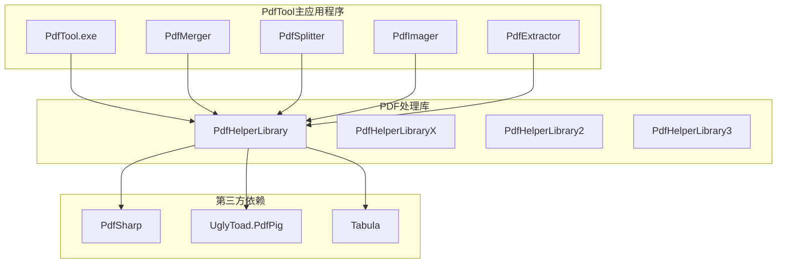

**图表来源**
- [PdfHelperLibrary.csproj](file://PdfHelperLibrary/PdfHelperLibrary.csproj#L43-L45)
- [PdfTool.csproj](file://PdfTool/PdfTool.csproj)

**章节来源**
- [PdfHelperLibrary.csproj](file://PdfHelperLibrary/PdfHelperLibrary.csproj#L1-L127)

## PDFsharp核心组件

### 核心命名空间

PDFsharp在PdfTool项目中主要使用以下核心命名空间：

- `PdfSharp.Pdf` - 提供PDF文档对象模型的核心类
- `PdfSharp.Pdf.IO` - 提供PDF文件读写功能
- `PdfSharp.Pdf.Advanced` - 提供高级PDF功能
- `PdfSharp.Drawing` - 提供绘图功能

### 主要类和接口

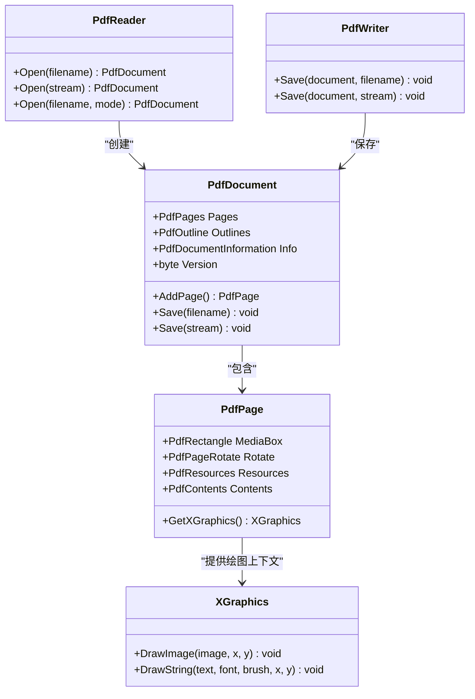

**图表来源**
- [MergeHelper.cs](file://PdfHelperLibrary/MergeHelper.cs#L20-L30)
- [SplitHelper.cs](file://PdfHelperLibrary/SplitHelper.cs#L23-L28)
- [Builder.cs](file://PdfHelperLibrary/Builder.cs#L19-L32)

**章节来源**
- [MergeHelper.cs](file://PdfHelperLibrary/MergeHelper.cs#L1-L75)
- [SplitHelper.cs](file://PdfHelperLibrary/SplitHelper.cs#L1-L70)

## 架构概览

PdfTool项目采用分层架构设计，将PDF处理功能抽象为多个层次：

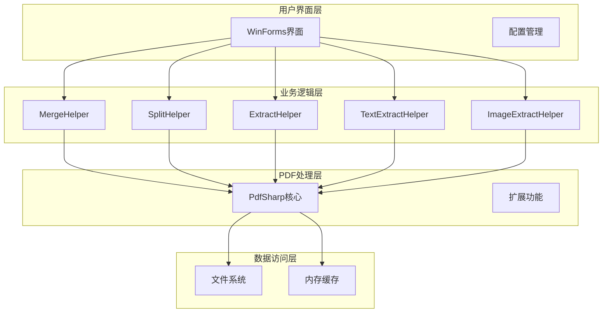

**图表来源**
- [PdfMerger.cs](file://PdfTool/PdfMerger.cs#L1-L154)
- [PdfSplitter.cs](file://PdfTool/PdfSplitter.cs#L1-L230)

## 详细组件分析

### MergeHelper - PDF合并功能

MergeHelper类是PDF合并功能的核心实现，展示了PDFsharp在文档合并方面的强大能力：

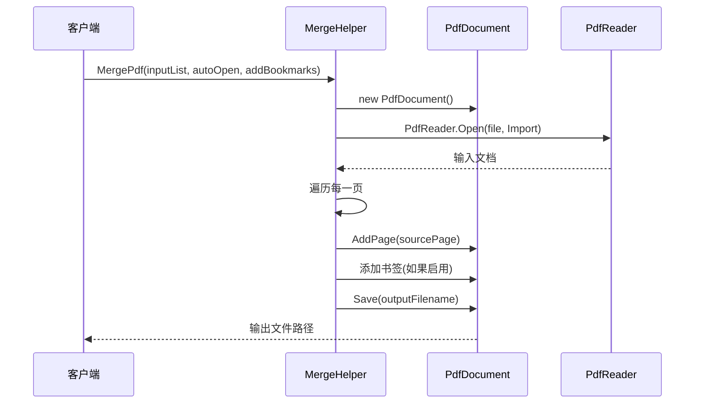

**图表来源**
- [MergeHelper.cs](file://PdfHelperLibrary/MergeHelper.cs#L20-L30)

#### 核心实现特点

1. **文档版本兼容性** - 保持源文档的PDF版本信息
2. **书签功能** - 可选地为每个合并的文档添加书签
3. **内存效率** - 逐页处理，避免大量内存占用
4. **错误处理** - 完善的异常捕获和错误返回

**章节来源**
- [MergeHelper.cs](file://PdfHelperLibrary/MergeHelper.cs#L16-L75)

### SplitHelper - PDF拆分功能

SplitHelper类提供了灵活的PDF拆分功能，支持多种拆分模式：

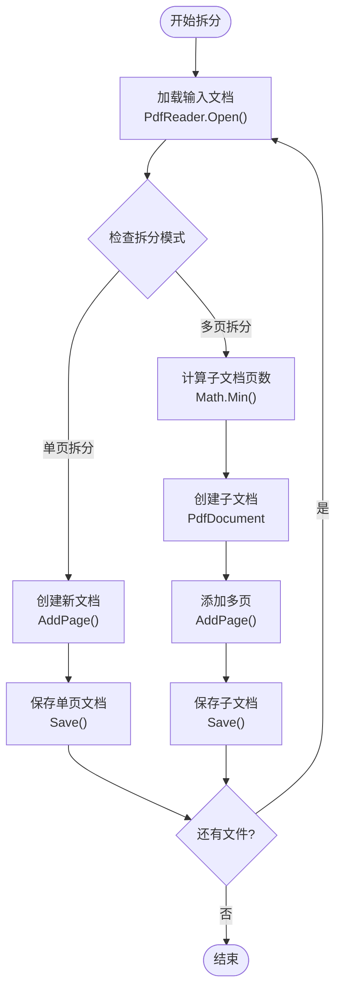

**图表来源**
- [SplitHelper.cs](file://PdfHelperLibrary/SplitHelper.cs#L42-L59)

#### 拆分功能特性

1. **单页拆分** - 将每个页面保存为独立的PDF文件
2. **多页拆分** - 按指定页数将文档拆分为多个子文档
3. **元数据保留** - 保持原始文档的标题和创建者信息
4. **版本一致性** - 确保输出文档与输入文档的PDF版本一致

**章节来源**
- [SplitHelper.cs](file://PdfHelperLibrary/SplitHelper.cs#L13-L70)

### Builder - PDF生成功能

Builder类展示了PDFsharp在文档生成方面的灵活性：

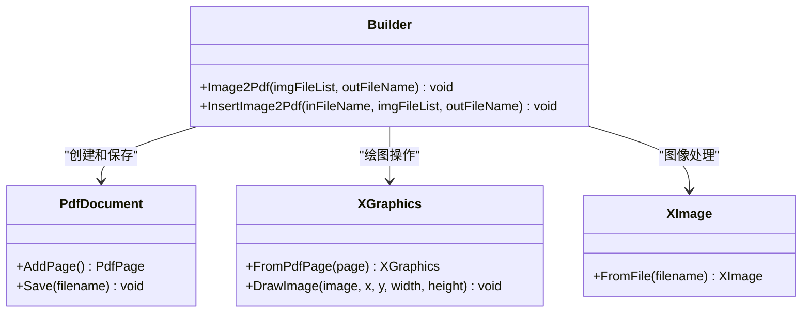

**图表来源**
- [Builder.cs](file://PdfHelperLibrary/Builder.cs#L17-L52)

**章节来源**
- [Builder.cs](file://PdfHelperLibrary/Builder.cs#L1-L56)

### ImageExtractHelper - 图像提取功能

ImageExtractHelper展示了PDFsharp在图像提取方面的深度功能：

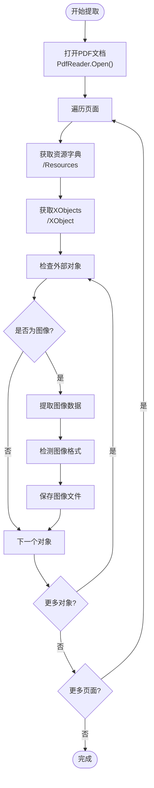

**图表来源**
- [ImageExtractHelper.cs](file://PdfHelperLibrary/ImageExtractHelper.cs#L24-L39)

**章节来源**
- [ImageExtractHelper.cs](file://PdfHelperLibrary/ImageExtractHelper.cs#L1-L182)

## PDF文档操作详解

### 文档对象模型构建

PDFsharp通过PdfDocument类构建完整的PDF文档对象模型：

#### 基本文档结构

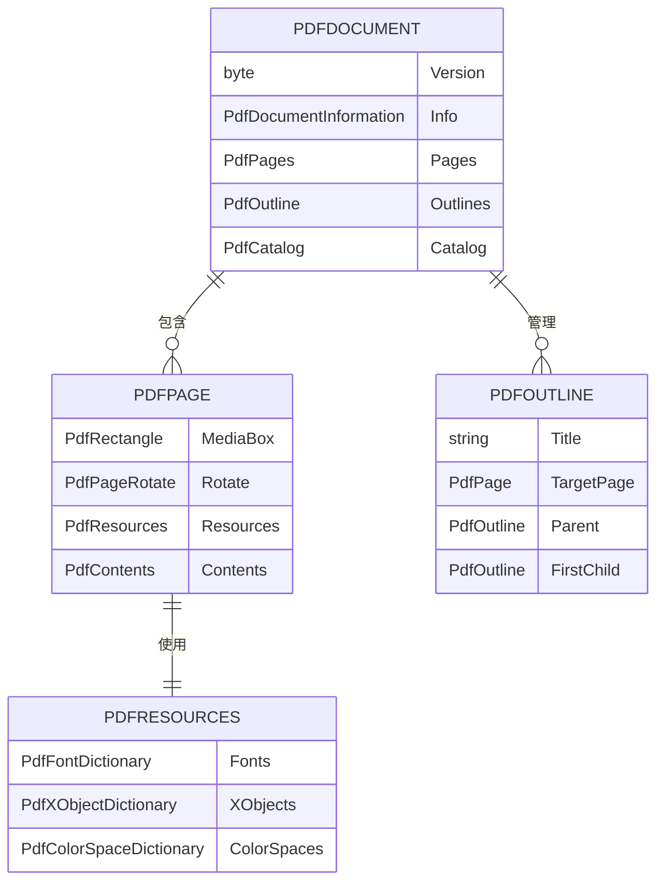

**图表来源**
- [MergeHelper.cs](file://PdfHelperLibrary/MergeHelper.cs#L20-L30)
- [SplitHelper.cs](file://PdfHelperLibrary/SplitHelper.cs#L23-L28)

#### 版本兼容性设置

PDFsharp支持多种PDF版本，确保与不同PDF阅读器的兼容性：

| 版本号 | PDF标准 | 支持特性 | 兼容性 |
|--------|---------|----------|--------|
| 1.4 | PDF 1.4 | 基础功能 | 广泛兼容 |
| 1.5 | PDF 1.5 | 压缩和加密 | 良好兼容 |
| 1.6 | PDF 1.6 | XMP元数据 | 现代兼容 |

**章节来源**
- [SplitHelper.cs](file://PdfHelperLibrary/SplitHelper.cs#L23-L28)
- [ExtractHelper.cs](file://PdfHelperLibrary/ExtractHelper.cs#L31-L34)

### 文档元数据维护

PDFsharp提供了完整的文档元数据管理功能：

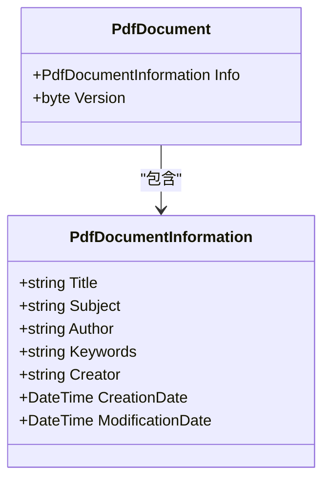

**图表来源**
- [SplitHelper.cs](file://PdfHelperLibrary/SplitHelper.cs#L24-L25)
- [ExtractHelper.cs](file://PdfHelperLibrary/ExtractHelper.cs#L32-L33)

**章节来源**
- [SplitHelper.cs](file://PdfHelperLibrary/SplitHelper.cs#L24-L25)
- [ExtractHelper.cs](file://PdfHelperLibrary/ExtractHelper.cs#L32-L33)

## 内存管理与性能优化

### 内存管理机制

PDFsharp采用了多种内存管理策略来优化大型PDF文件的处理：

#### 资源管理模式

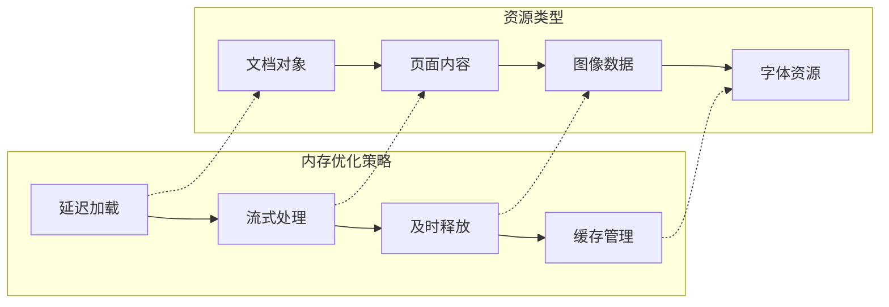

#### 性能优化策略

1. **流式处理** - 对大型文件采用流式读取，避免一次性加载到内存
2. **按需加载** - 只在需要时加载特定页面或资源
3. **资源复用** - 在可能的情况下复用已加载的资源
4. **及时释放** - 使用using语句确保资源及时释放

### 大型PDF文件处理最佳实践

针对大型PDF文件，PDFsharp提供了以下优化建议：

| 处理类型 | 内存策略 | 性能建议 | 注意事项 |
|----------|----------|----------|----------|
| 合并操作 | 逐页复制 | 使用AddPage()方法 | 控制同时打开的文件数量 |
| 拆分操作 | 流式写入 | 分批处理大文档 | 监控磁盘空间使用 |
| 图像提取 | 按需解码 | 批量处理相似格式 | 避免重复解码相同图像 |
| 文本提取 | 字符串缓冲 | 分段处理长文档 | 控制内存峰值 |

**章节来源**
- [CommonHelper.cs](file://PdfHelperLibrary/CommonHelper.cs#L11-L26)
- [ImageExtractHelper.cs](file://PdfHelperLibrary/ImageExtractHelper.cs#L48-L86)

## 与其他库的协作关系

### UglyToad.PdfPig的互补关系

PdfTool项目巧妙地结合了PDFsharp和UglyToad.PdfPig两个库的优势：

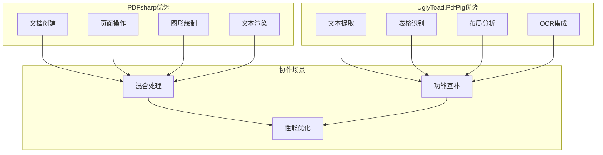

**图表来源**
- [TableExtractHelper.cs](file://PdfHelperLibrary/TableExtractHelper.cs#L1-L106)
- [TextExtractHelper.cs](file://PdfHelperLibrary/TextExtractHelper.cs#L1-L35)

### 功能对比分析

| 功能领域 | PDFsharp | UglyToad.PdfPig | 推荐使用场景 |
|----------|----------|-----------------|--------------|
| 文档创建 | ✅ 强大 | ❌ 不支持 | 新建PDF文档 |
| 页面操作 | ✅ 完整 | ❌ 有限 | PDF页面处理 |
| 图形绘制 | ✅ 专业 | ❌ 基础 | 图像插入和绘制 |
| 文本提取 | ⚠️ 基础 | ✅ 强大 | 纯文本内容提取 |
| 表格识别 | ❌ 不支持 | ✅ 优秀 | 结构化数据提取 |
| 布局分析 | ❌ 不支持 | ✅ 专业 | 复杂文档解析 |

**章节来源**
- [TableExtractHelper.cs](file://PdfHelperLibrary/TableExtractHelper.cs#L1-L106)
- [TextExtractHelper.cs](file://PdfHelperLibrary/TextExtractHelper.cs#L1-L35)

## 最佳实践与建议

### 开发最佳实践

1. **异常处理** - 始终包装PDF操作在try-catch块中
2. **资源管理** - 使用using语句确保资源正确释放
3. **版本兼容性** - 保持输出文档与输入文档的版本一致
4. **性能监控** - 对大型文件操作实施进度报告

### 性能优化建议

1. **批量操作** - 尽可能批量处理多个文件
2. **内存监控** - 监控内存使用情况，避免内存泄漏
3. **并发控制** - 限制同时处理的文件数量
4. **缓存策略** - 对重复使用的资源实施缓存

### 错误处理策略

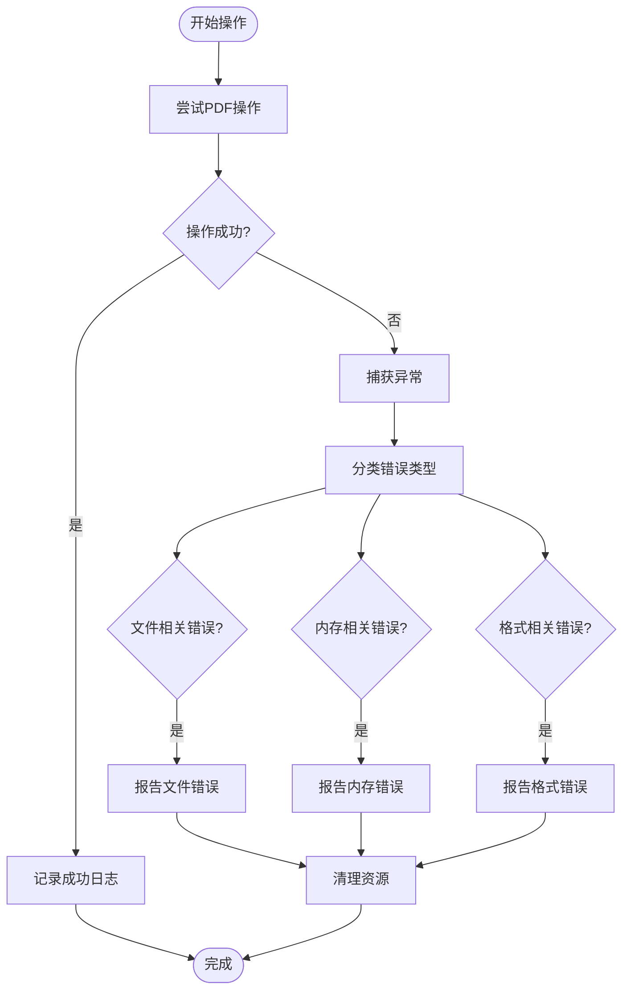

**章节来源**
- [MergeHelper.cs](file://PdfHelperLibrary/MergeHelper.cs#L37-L41)
- [SplitHelper.cs](file://PdfHelperLibrary/SplitHelper.cs#L63-L66)

## 总结

PDFsharp作为PdfTool项目的核心PDF处理引擎，展现了其在PDF文档操作方面的强大能力和灵活性。通过深入分析MergeHelper、SplitHelper等核心组件的实现，我们可以看到PDFsharp在以下方面表现出色：

1. **功能完整性** - 提供了PDF文档创建、修改、保存的完整生命周期管理
2. **性能优化** - 通过流式处理和资源管理策略，有效处理大型PDF文件
3. **易用性** - 简洁的API设计使得复杂的PDF操作变得简单直观
4. **兼容性** - 支持多种PDF版本和标准，确保广泛的兼容性

与其他第三方库（如UglyToad.PdfPig）的协作进一步增强了PdfTool项目的功能完整性，形成了一个既强大又灵活的PDF处理生态系统。这种组合使用的方式为开发者提供了最佳的选择，既保证了功能的完整性，又维持了良好的性能表现。

对于希望在.NET环境中开发PDF处理功能的开发者来说，PDFsharp提供了一个可靠、高效且易于使用的解决方案，值得在类似项目中借鉴和应用。