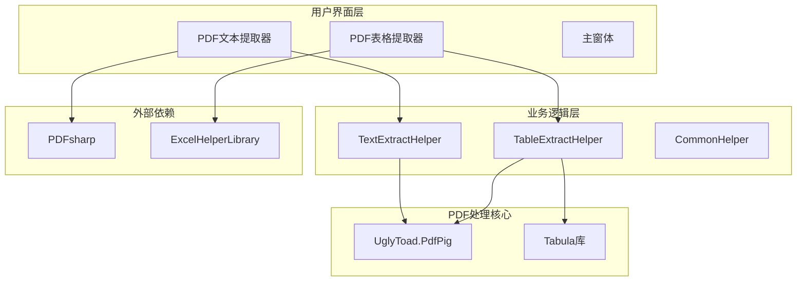
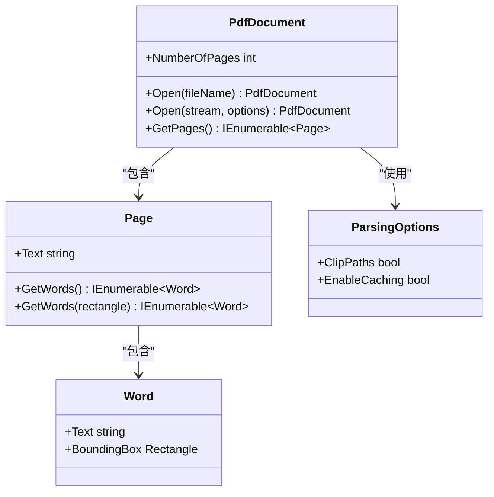
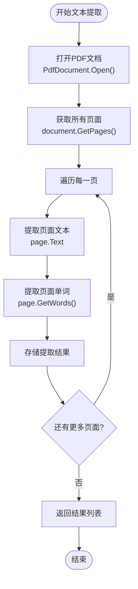
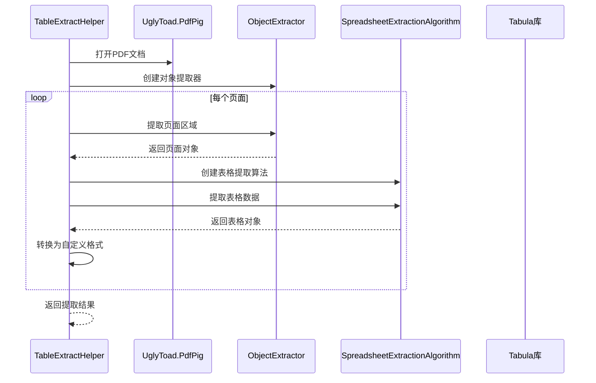
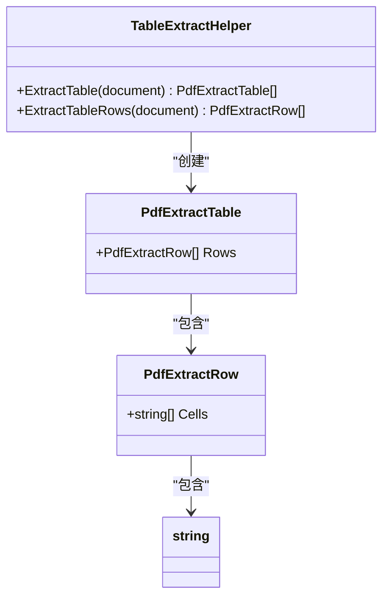
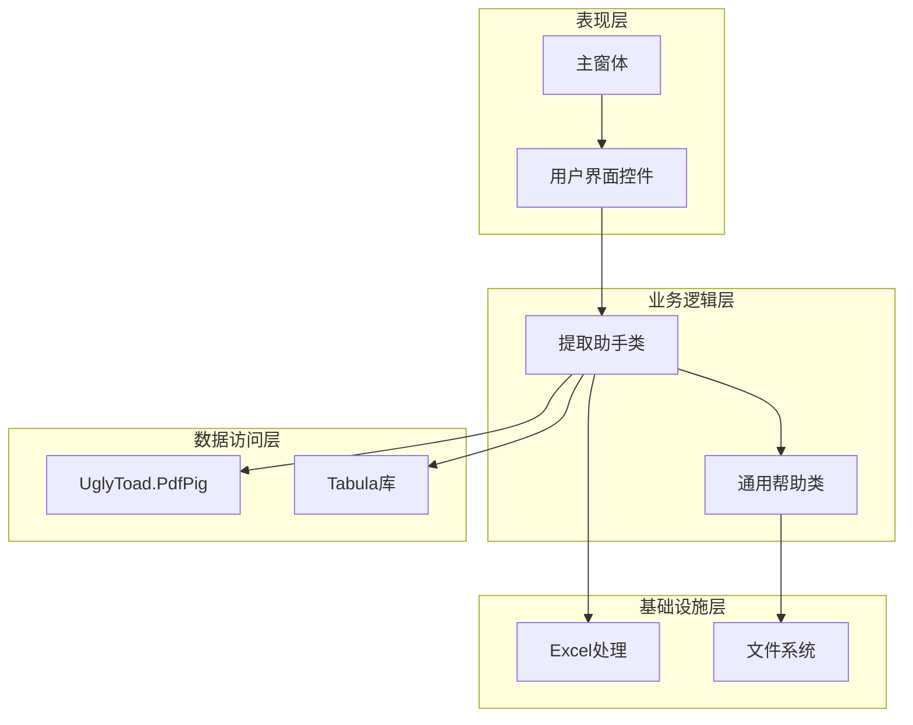
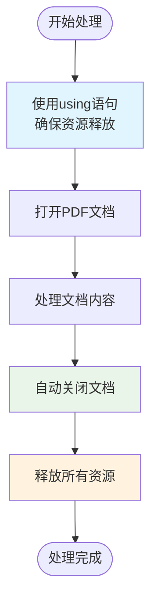

# UglyToad.PdfPig库在PdfTool项目中的应用文档

<cite>
**本文档中引用的文件**
- [TextExtractHelper.cs](file://PdfHelperLibrary/TextExtractHelper.cs)
- [TableExtractHelper.cs](file://PdfHelperLibrary/TableExtractHelper.cs)
- [PdfTextExtracter.cs](file://PdfTool/PdfTextExtracter.cs)
- [PdfTableExtracter.cs](file://PdfTool/PdfTableExtracter.cs)
- [CommonHelper.cs](file://PdfHelperLibrary/CommonHelper.cs)
- [Config.cs](file://PdfTool/Config.cs)
- [MainForm.cs](file://PdfTool/MainForm.cs)
- [PdfHelperLibrary.csproj](file://PdfHelperLibrary/PdfHelperLibrary.csproj)
- [TextExtractHelper.cs](file://PdfHelperLibraryX/TextExtractHelper.cs)
- [TableExtractHelper.cs](file://PdfHelperLibraryX/TableExtractHelper.cs)
</cite>

## 目录
1. [简介](#简介)
2. [项目结构概述](#项目结构概述)
3. [UglyToad.PdfPig库的核心作用](#uglytoadpdfpig库的核心作用)
4. [文本提取功能详解](#文本提取功能详解)
5. [表格提取功能详解](#表格提取功能详解)
6. [架构设计与组件分析](#架构设计与组件分析)
7. [流式处理与资源管理](#流式处理与资源管理)
8. [与其他PDF处理库的对比](#与其他pdf处理库的对比)
9. [最佳实践与性能优化](#最佳实践与性能优化)
10. [故障排除指南](#故障排除指南)
11. [总结](#总结)

## 简介

UglyToad.PdfPig是一个高性能的.NET PDF处理库，在PdfTool项目中扮演着核心角色。该项目采用模块化架构，将PDF处理功能分解为多个专门的组件，其中UglyToad.PdfPig主要负责底层的PDF文档解析和内容提取。

PdfTool项目提供了丰富的PDF处理功能，包括文本提取、表格提取、页面操作、图像处理等。在这些功能中，UglyToad.PdfPig库通过提供底层的PDF文档解析能力，支撑了整个系统的文本和表格提取功能。

## 项目结构概述

PdfTool项目采用分层架构设计，主要包含以下核心模块：



**图表来源**
- [MainForm.cs](file://PdfTool/MainForm.cs#L130-L163)
- [PdfTextExtracter.cs](file://PdfTool/PdfTextExtracter.cs#L13-L14)
- [PdfTableExtracter.cs](file://PdfTool/PdfTableExtracter.cs#L14-L15)

**章节来源**
- [MainForm.cs](file://PdfTool/MainForm.cs#L130-L163)
- [PdfHelperLibrary.csproj](file://PdfHelperLibrary/PdfHelperLibrary.cs#L74-L94)

## UglyToad.PdfPig库的核心作用

### 底层PDF文档解析

UglyToad.PdfPig在PdfTool项目中承担着PDF文档解析的核心职责。它提供了以下关键功能：

1. **PDF文档打开与加载**：通过`PdfDocument.Open()`方法实现PDF文件的解析和内存加载
2. **页面内容访问**：提供对PDF页面内容的直接访问接口
3. **文本内容提取**：支持按页面或按单词级别的文本提取
4. **布局分析**：提供文档布局分析能力，支持表格识别

### 核心接口与方法

在PdfTool项目中，UglyToad.PdfPig的核心接口主要体现在以下几个方面：



**图表来源**
- [TextExtractHelper.cs](file://PdfHelperLibrary/TextExtractHelper.cs#L13-L30)
- [TableExtractHelper.cs](file://PdfHelperLibrary/TableExtractHelper.cs#L17-L29)

**章节来源**
- [TextExtractHelper.cs](file://PdfHelperLibrary/TextExtractHelper.cs#L11-L30)
- [TableExtractHelper.cs](file://PdfHelperLibrary/TableExtractHelper.cs#L15-L29)

## 文本提取功能详解

### TextExtractHelper实现原理

TextExtractHelper类是PdfTool项目中文本提取功能的核心实现，它封装了UglyToad.PdfPig库的使用细节，提供了简洁的API接口。

#### 核心提取流程

文本提取过程遵循以下步骤：



**图表来源**
- [TextExtractHelper.cs](file://PdfHelperLibrary/TextExtractHelper.cs#L13-L30)

#### 关键实现特点

1. **资源管理**：使用`using`语句确保PDF文档资源的正确释放
2. **多级提取**：同时提取页面级别和单词级别的文本内容
3. **调试支持**：在调试模式下输出单词内容，便于开发调试

### 文本提取的具体实现

TextExtractHelper的实现展示了UglyToad.PdfPig库的典型使用模式：

- **文档打开**：`PdfDocument.Open(inputPdfFileName)`自动处理文件路径和编码
- **页面遍历**：通过`document.GetPages()`获取所有页面的枚举器
- **文本提取**：使用`page.Text`属性获取完整的页面文本
- **单词提取**：通过`page.GetWords()`获取页面中的独立单词对象

**章节来源**
- [TextExtractHelper.cs](file://PdfHelperLibrary/TextExtractHelper.cs#L11-L30)
- [PdfTextExtracter.cs](file://PdfTool/PdfTextExtracter.cs#L61-L64)

## 表格提取功能详解

### TableExtractHelper架构设计

TableExtractHelper结合了UglyToad.PdfPig和Tabula库的优势，实现了强大的表格识别功能。这种组合使用体现了现代PDF处理的最佳实践。

#### 双库协作机制



**图表来源**
- [TableExtractHelper.cs](file://PdfHelperLibrary/TableExtractHelper.cs#L51-L71)
- [TableExtractHelper.cs](file://PdfHelperLibrary/TableExtractHelper.cs#L73-L93)

#### 表格提取算法流程

表格提取过程包含以下关键步骤：

1. **文档解析**：使用UglyToad.PdfPig解析PDF文档结构
2. **页面对象提取**：通过ObjectExtractor提取每个页面的对象信息
3. **表格识别**：使用SpreadsheetExtractionAlgorithm识别表格结构
4. **数据转换**：将识别结果转换为项目特定的数据格式

### 数据模型设计

TableExtractHelper定义了清晰的数据模型来表示提取的表格数据：



**图表来源**
- [TableExtractHelper.cs](file://PdfHelperLibrary/TableExtractHelper.cs#L96-L104)

**章节来源**
- [TableExtractHelper.cs](file://PdfHelperLibrary/TableExtractHelper.cs#L51-L93)
- [PdfTableExtracter.cs](file://PdfTool/PdfTableExtracter.cs#L62-L84)

## 架构设计与组件分析

### 分层架构设计

PdfTool项目采用了清晰的分层架构，每一层都有明确的职责分工：



**图表来源**
- [MainForm.cs](file://PdfTool/MainForm.cs#L130-L163)
- [PdfTextExtracter.cs](file://PdfTool/PdfTextExtracter.cs#L13-L14)
- [PdfTableExtracter.cs](file://PdfTool/PdfTableExtracter.cs#L14-L15)

### 组件间通信机制

项目中的组件通过以下方式实现通信：

1. **接口契约**：IPdfHandler接口定义了PDF处理组件的标准行为
2. **事件驱动**：使用BackgroundWorker实现异步处理和进度报告
3. **数据传递**：通过值元组和列表进行数据传递

**章节来源**
- [MainForm.cs](file://PdfTool/MainForm.cs#L48-L52)
- [PdfTextExtracter.cs](file://PdfTool/PdfTextExtracter.cs#L30-L80)
- [PdfTableExtracter.cs](file://PdfTool/PdfTableExtracter.cs#L31-L90)

## 流式处理与资源管理

### 资源管理模式

PdfTool项目在使用UglyToad.PdfPig时严格遵循资源管理模式，确保内存使用的高效性：



**图表来源**
- [TextExtractHelper.cs](file://PdfHelperLibrary/TextExtractHelper.cs#L13-L30)
- [TableExtractHelper.cs](file://PdfHelperLibrary/TableExtractHelper.cs#L17-L29)

### 异常处理策略

项目实现了完善的异常处理机制：

1. **文档打开异常**：捕获文件不存在、权限不足等问题
2. **解析异常**：处理损坏或加密的PDF文件
3. **内存异常**：防止大文件导致的内存溢出

### 性能优化措施

1. **延迟加载**：只在需要时才加载PDF内容
2. **缓存机制**：合理使用ParsingOptions中的缓存选项
3. **异步处理**：使用BackgroundWorker避免UI阻塞

**章节来源**
- [TextExtractHelper.cs](file://PdfHelperLibrary/TextExtractHelper.cs#L13-L30)
- [TableExtractHelper.cs](file://PdfHelperLibrary/TableExtractHelper.cs#L17-L29)
- [PdfTextExtracter.cs](file://PdfTool/PdfTextExtracter.cs#L57-L80)

## 与其他PDF处理库的对比

### UglyToad.PdfPig vs PDFsharp

在PdfTool项目中，UglyToad.PdfPig与PDFsharp形成了互补关系：

| 特性 | UglyToad.PdfPig | PDFsharp |
|------|----------------|----------|
| **主要用途** | PDF内容解析和提取 | PDF文档创建和修改 |
| **文本提取** | 高质量文本提取，支持布局分析 | 基础文本提取，主要用于渲染 |
| **表格识别** | 通过与Tabula协作实现 | 不支持原生表格识别 |
| **性能** | 内存占用低，解析速度快 | 功能丰富但内存消耗较大 |
| **复杂度** | 专注于内容提取，API简洁 | 功能全面，API较为复杂 |

### 技术优势对比

1. **文本提取准确性**
   - UglyToad.PdfPig：提供精确的字符定位和文本顺序保持
   - PDFsharp：文本提取功能有限，主要用于渲染

2. **表格识别能力**
   - UglyToad.PdfPig + Tabula：结合两者优势，实现高精度表格识别
   - PDFsharp：无原生表格识别能力

3. **性能表现**
   - UglyToad.PdfPig：轻量级，启动快，内存占用小
   - PDFsharp：功能强大但资源消耗较高

4. **易用性**
   - UglyToad.PdfPig：API设计简洁，学习曲线平缓
   - PDFsharp：功能丰富但API复杂度较高

**章节来源**
- [CommonHelper.cs](file://PdfHelperLibrary/CommonHelper.cs#L11-L26)
- [PdfHelperLibrary.csproj](file://PdfHelperLibrary/PdfHelperLibrary.cs#L43-L48)

## 最佳实践与性能优化

### 流式处理最佳实践

1. **文档预处理**
   ```csharp
   // 推荐：使用ParsingOptions优化性能
   var options = new ParsingOptions { ClipPaths = true };
   using (var document = PdfDocument.Open(filePath, options))
   {
       // 处理逻辑
   }
   ```

2. **内存管理**
   - 使用using语句确保资源及时释放
   - 避免长时间持有大型PDF文档的引用
   - 对于大批量处理，考虑分批处理策略

3. **并发处理**
   - 使用BackgroundWorker避免UI线程阻塞
   - 实现进度报告机制
   - 支持取消操作

### 性能优化建议

1. **解析选项优化**
   - 启用`ClipPaths`选项提高表格识别准确性
   - 根据实际需求调整解析精度

2. **缓存策略**
   - 对重复访问的内容实施缓存
   - 合理使用ParsingOptions中的缓存机制

3. **错误恢复**
   - 实现优雅的错误处理和恢复机制
   - 提供详细的错误信息以便调试

**章节来源**
- [TableExtractHelper.cs](file://PdfHelperLibrary/TableExtractHelper.cs#L17-L29)
- [PdfTextExtracter.cs](file://PdfTool/PdfTextExtracter.cs#L57-L80)

## 故障排除指南

### 常见问题及解决方案

1. **文档无法打开**
   - 检查文件是否存在且可读
   - 验证PDF文件格式是否正确
   - 确认没有文件被其他进程锁定

2. **文本提取不完整**
   - 尝试调整ParsingOptions参数
   - 检查PDF文件是否加密或受保护
   - 验证字体嵌入情况

3. **表格识别失败**
   - 确保Tabula库正确安装
   - 检查PDF文件中的表格结构是否清晰
   - 调整表格识别算法参数

### 调试技巧

1. **启用调试输出**
   ```csharp
   #if DEBUG
   System.Diagnostics.Debug.WriteLine(word.Text);
   #endif
   ```

2. **使用日志记录**
   - 记录处理进度和状态
   - 记录异常信息和堆栈跟踪
   - 监控内存使用情况

3. **单元测试**
   - 为关键功能编写单元测试
   - 使用测试用例验证边界条件
   - 进行性能基准测试

**章节来源**
- [TextExtractHelper.cs](file://PdfHelperLibrary/TextExtractHelper.cs#L25-L28)
- [PdfTextExtracter.cs](file://PdfTool/PdfTextExtracter.cs#L61-L64)

## 总结

UglyToad.PdfPig库在PdfTool项目中发挥了核心作用，通过其高效的PDF文档解析能力和简洁的API设计，为项目提供了可靠的文本和表格提取基础。项目采用的双库协作模式（UglyToad.PdfPig + Tabula）展现了现代PDF处理的最佳实践。

### 主要优势

1. **技术先进性**：采用最新的PDF处理技术和算法
2. **架构合理性**：清晰的分层架构和模块化设计
3. **性能优异**：高效的资源管理和处理性能
4. **扩展性强**：良好的接口设计支持功能扩展

### 应用价值

PdfTool项目展示了UglyToad.PdfPig在实际应用中的强大能力，为开发者提供了完整的PDF处理解决方案参考。通过合理的架构设计和最佳实践的应用，该项目成功地将复杂的PDF处理功能转化为易于使用的产品。

这种设计模式不仅适用于PDF处理场景，也为其他需要处理复杂文档格式的项目提供了有价值的参考。