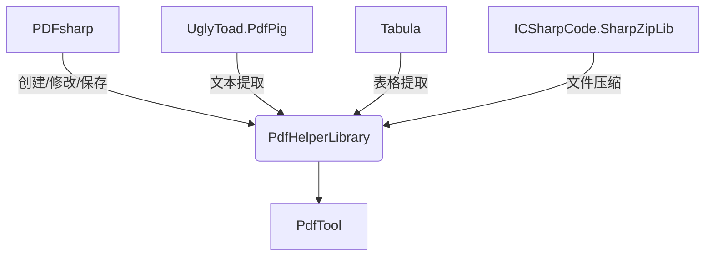
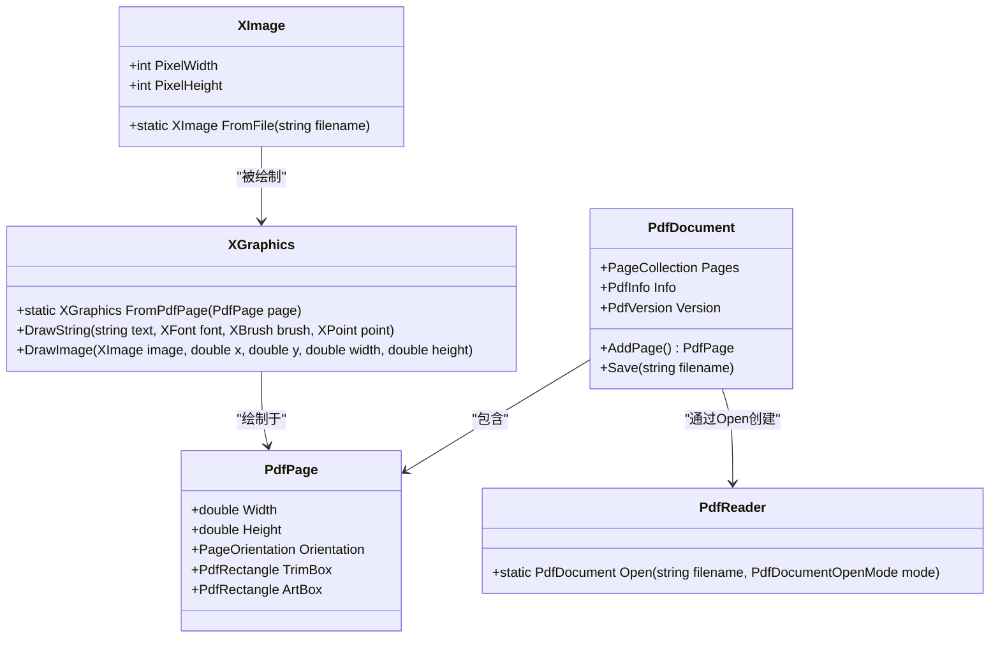
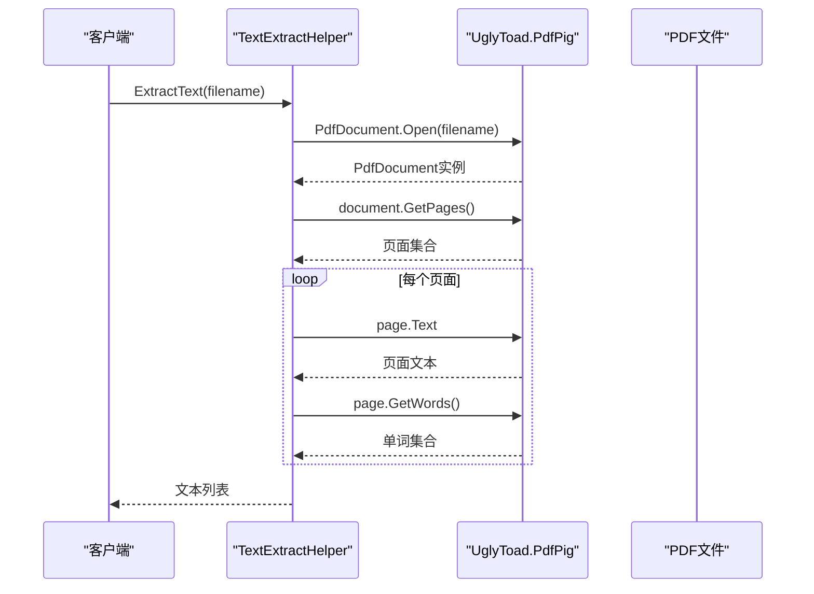
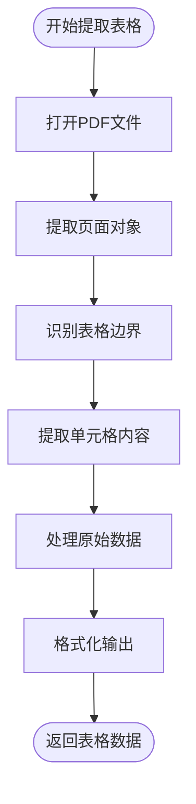
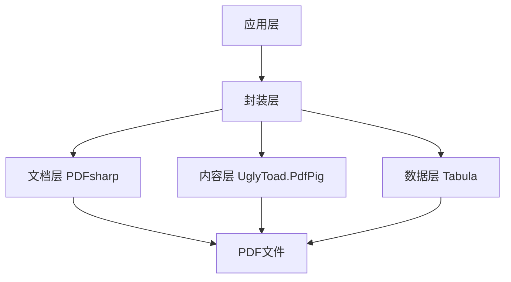

# 第三方依赖层

<cite>
**本文档引用的文件**
- [PdfHelperLibrary.csproj](file://PdfHelperLibrary/PdfHelperLibrary.csproj)
- [PdfHelperLibraryX.csproj](file://PdfHelperLibraryX/PdfHelperLibraryX.csproj)
- [CommonHelper.cs](file://PdfHelperLibrary/CommonHelper.cs)
- [TextExtractHelper.cs](file://PdfHelperLibrary/TextExtractHelper.cs)
- [TableExtractHelper.cs](file://PdfHelperLibrary/TableExtractHelper.cs)
- [ImageExtractHelper.cs](file://PdfHelperLibrary/ImageExtractHelper.cs)
- [Builder.cs](file://PdfHelperLibrary/Builder.cs)
- [MergeHelper.cs](file://PdfHelperLibrary/MergeHelper.cs)
- [SplitHelper.cs](file://PdfHelperLibrary/SplitHelper.cs)
- [CompressHelper.cs](file://PdfHelperLibrary/CompressHelper.cs)
- [WatermarkHelper.cs](file://PdfHelperLibrary/WatermarkHelper.cs)
</cite>

## 目录
1. [引言](#引言)
2. [核心第三方库概览](#核心第三方库概览)
3. [PDFsharp库在PDF处理中的应用](#pdfsharp库在pdf处理中的应用)
4. [UglyToad.PdfPig库在文本提取中的角色](#uglytoadpdfpig库在文本提取中的角色)
5. [Tabula库在表格提取中的应用](#tabula库在表格提取中的应用)
6. [ICSharpCode.SharpZipLib在文件压缩中的集成](#icsharpodesharpziplib在文件压缩中的集成)
7. [依赖库的协同工作模式](#依赖库的协同工作模式)
8. [版本兼容性与许可证要求](#版本兼容性与许可证要求)
9. [安全更新策略](#安全更新策略)
10. [依赖管理最佳实践](#依赖管理最佳实践)
11. [结论](#结论)

## 引言
PdfTool项目是一个功能丰富的PDF处理工具集，其核心功能依赖于多个精心选择的第三方库。这些库共同构成了项目的PDF处理能力基础，涵盖了从文档创建、修改、文本提取到表格识别和文件压缩等各个方面。本文档深入分析了这些第三方依赖库的集成方式、使用模式和相互关系，为开发者提供了全面的依赖层技术文档。

**本节不分析具体源文件**

## 核心第三方库概览
PdfTool项目主要依赖于三个核心第三方库：PDFsharp、UglyToad.PdfPig和Tabula。这些库分别负责PDF文档的创建与修改、文本内容提取和表格数据识别。此外，项目还利用了ICSharpCode.SharpZipLib进行文件压缩操作。这些库通过PdfHelperLibrary等封装层被集成到主应用程序中，为主应用提供了统一的API接口。

**Diagram sources**
- [PdfHelperLibrary.csproj](file://PdfHelperLibrary/PdfHelperLibrary.csproj)
- [PdfHelperLibraryX.csproj](file://PdfHelperLibraryX/PdfHelperLibraryX.csproj)

**Section sources**
- [PdfHelperLibrary.csproj](file://PdfHelperLibrary/PdfHelperLibrary.csproj)
- [PdfHelperLibraryX.csproj](file://PdfHelperLibraryX/PdfHelperLibraryX.csproj)

## PDFsharp库在PDF处理中的应用
PDFsharp库是PdfTool项目中用于PDF文档创建、修改和保存的核心库。它提供了完整的文档对象模型（DOM），包括PdfDocument和PdfPage等关键类，使开发者能够以编程方式操作PDF文件。

### 文档对象模型的使用
PDFsharp的文档对象模型提供了对PDF文件结构的全面控制。在PdfTool中，通过PdfReader.Open方法打开现有PDF文档，通过PdfDocument类创建新文档，通过Pages集合访问和操作页面。例如，在CommonHelper.cs中，GetPageCount方法使用PdfReader.Open打开文档并访问PageCount属性来获取页数。

**Diagram sources**
- [CommonHelper.cs](file://PdfHelperLibrary/CommonHelper.cs)
- [Builder.cs](file://PdfHelperLibrary/Builder.cs)
- [WatermarkHelper.cs](file://PdfHelperLibrary/WatermarkHelper.cs)

**Section sources**
- [CommonHelper.cs](file://PdfHelperLibrary/CommonHelper.cs)
- [Builder.cs](file://PdfHelperLibrary/Builder.cs)
- [WatermarkHelper.cs](file://PdfHelperLibrary/WatermarkHelper.cs)

### PDF文档的创建与修改
在Builder.cs文件中，Image2Pdf方法展示了如何使用PDFsharp创建新的PDF文档。该方法创建一个PdfDocument实例，为每个图像文件添加新页面，并使用XGraphics将图像绘制到页面上。这种方法允许将多个图像文件合并成一个PDF文档，同时根据图像的宽高比自动设置页面方向。

在WatermarkHelper.cs中，WatermarkPdf方法展示了如何修改现有PDF文档。该方法首先复制输入文件，然后使用XGraphics.FromPdfPage在每一页上绘制水印文本。通过使用Prepend选项，水印被绘制在现有内容之下，确保不会遮挡原始内容。

### 保存与导出机制
PDFsharp提供了灵活的保存机制。在MergeHelper.cs中，MergePdf方法将多个PDF文档合并为一个新文档，并使用Save方法将其保存到指定文件。在SplitHelper.cs中，SplitPdf方法将单个PDF文档拆分为多个单页文档，每个文档都通过Save方法保存为独立文件。这些操作都利用了PDFsharp的文档操作能力和高效的保存机制。

**Section sources**
- [Builder.cs](file://PdfHelperLibrary/Builder.cs)
- [MergeHelper.cs](file://PdfHelperLibrary/MergeHelper.cs)
- [SplitHelper.cs](file://PdfHelperLibrary/SplitHelper.cs)
- [WatermarkHelper.cs](file://PdfHelperLibrary/WatermarkHelper.cs)

## UglyToad.PdfPig库在文本提取中的角色
UglyToad.PdfPig库在PdfTool项目中专门负责文本提取功能，与PDFsharp库形成了互补关系。PDFsharp主要用于文档的创建和修改，而UglyToad.PdfPig则专注于从现有PDF文档中提取文本内容。

### 文本提取实现
在TextExtractHelper.cs文件中，ExtractText方法展示了UglyToad.PdfPig的典型使用模式。该方法使用PdfDocument.Open打开PDF文件，获取页面集合，然后遍历每个页面提取文本。与PDFsharp不同，UglyToad.PdfPig提供了更高级的文本提取功能，包括按单词提取（GetWords方法），这使得文本分析更加精确。

**Diagram sources**
- [TextExtractHelper.cs](file://PdfHelperLibrary/TextExtractHelper.cs)

**Section sources**
- [TextExtractHelper.cs](file://PdfHelperLibrary/TextExtractHelper.cs)

### 与PDFsharp的互补关系
UglyToad.PdfPig和PDFsharp在功能上形成了完美的互补。PDFsharp擅长创建和修改PDF文档，但在文本提取方面功能有限，主要通过解析内容流来提取文本，这可能导致格式信息丢失。而UglyToad.PdfPig专注于文本内容的精确提取，能够保持文本的布局和格式信息。在PdfTool项目中，这种分工使得每个库都能在其擅长的领域发挥最大效能。

## Tabula库在表格提取中的应用
Tabula库在PdfTool项目中负责表格提取功能，能够识别和提取PDF文档中的表格数据。它与UglyToad.PdfPig协同工作，利用后者提供的页面内容分析能力来识别表格结构。

### 表格识别算法
在TableExtractHelper.cs文件中，ExtractTable方法展示了Tabula库的使用。该方法首先使用UglyToad.PdfPig的PdfDocument.Open打开PDF文件，然后创建ObjectExtractor实例来提取页面对象。接着，使用SpreadsheetExtractionAlgorithm算法来识别表格。这个算法能够检测表格的边框和单元格，将非结构化的PDF内容转换为结构化的表格数据。

**Diagram sources**
- [TableExtractHelper.cs](file://PdfHelperLibrary/TableExtractHelper.cs)

**Section sources**
- [TableExtractHelper.cs](file://PdfHelperLibrary/TableExtractHelper.cs)

### 数据导出机制
Tabula库提取的表格数据被转换为PdfExtractTable和PdfExtractRow对象，形成层次化的数据结构。每个PdfExtractTable包含多个PdfExtractRow，每个PdfExtractRow包含多个单元格文本。这种结构使得提取的表格数据易于处理和导出到其他格式，如CSV或Excel。

## ICSharpCode.SharpZipLib在文件压缩中的集成
ICSharpCode.SharpZipLib库在PdfTool项目中用于文件压缩功能，特别是在处理压缩的JPEG图像时。在ImageExtractHelper.cs文件中，ExportCompressedJpegImage方法展示了该库的使用。

### 压缩功能实现
当遇到使用FlateDecode压缩的JPEG图像时，代码使用DeflateStream类来解压缩数据。该方法首先读取压缩的图像流，然后创建DeflateStream实例进行解压缩，最后将解压缩的数据保存为JPEG文件。这种集成方式使得PdfTool能够处理各种压缩格式的PDF图像。

**Section sources**
- [ImageExtractHelper.cs](file://PdfHelperLibrary/ImageExtractHelper.cs)

## 依赖库的协同工作模式
PdfTool项目中的各个第三方库通过精心设计的协作模式共同完成复杂的PDF处理任务。这种协同工作模式体现了分层架构的设计思想，每个库负责特定的功能领域，通过封装层提供统一的API。

### 功能分层架构
项目采用了清晰的功能分层架构：PDFsharp负责文档层操作，UglyToad.PdfPig负责内容层分析，Tabula负责数据层提取。这种分层使得每个库都能专注于其核心功能，同时通过PdfHelperLibrary等封装层实现功能的整合。

**Diagram sources**
- [PdfHelperLibrary.csproj](file://PdfHelperLibrary/PdfHelperLibrary.csproj)
- [PdfHelperLibraryX.csproj](file://PdfHelperLibraryX/PdfHelperLibraryX.csproj)

**Section sources**
- [PdfHelperLibrary.csproj](file://PdfHelperLibrary/PdfHelperLibrary.csproj)
- [PdfHelperLibraryX.csproj](file://PdfHelperLibraryX/PdfHelperLibraryX.csproj)

## 版本兼容性与许可证要求
PdfTool项目中的第三方库具有明确的版本要求和许可证条款。PDFsharp库使用MIT许可证，允许在商业项目中自由使用。UglyToad.PdfPig和Tabula库也采用宽松的开源许可证，使得PdfTool项目能够合法地集成和分发这些库。

在PdfHelperLibrary.csproj文件中，明确指定了各个库的版本：PDFsharp 1.50.5147、UglyToad.PdfPig 0.1.8.0和Tabula 0.1.3.0。这些版本经过测试，确保了功能的稳定性和兼容性。

**Section sources**
- [PdfHelperLibrary.csproj](file://PdfHelperLibrary/PdfHelperLibrary.csproj)
- [PdfHelperLibraryX.csproj](file://PdfHelperLibraryX/PdfHelperLibraryX.csproj)

## 安全更新策略
为了确保项目的长期安全性和稳定性，PdfTool项目需要定期更新其第三方依赖库。这包括监控各个库的安全公告，及时应用安全补丁，以及测试新版本的兼容性。通过使用NuGet包管理器，可以方便地更新库版本并管理依赖关系。

**本节不分析具体源文件**

## 依赖管理最佳实践
PdfTool项目遵循了依赖管理的最佳实践，包括使用NuGet包管理器进行依赖管理，明确指定依赖版本以确保构建的可重现性，以及通过封装层隔离第三方库的API变化。

### NuGet包版本控制
项目使用packages.config文件来管理NuGet包的版本，确保所有开发者使用相同的依赖版本。这种做法避免了因版本差异导致的构建问题和运行时错误。

### 冲突解决策略
当出现依赖冲突时，项目通过绑定重定向（binding redirects）来解决版本冲突。在app.config文件中配置程序集绑定，确保运行时加载正确的库版本。

**Section sources**
- [PdfHelperLibrary.csproj](file://PdfHelperLibrary/PdfHelperLibrary.csproj)
- [packages.config](file://PdfHelperLibrary/packages.config)

## 结论
PdfTool项目通过精心集成和协调多个第三方库，构建了一个功能强大且灵活的PDF处理平台。PDFsharp、UglyToad.PdfPig和Tabula等库各司其职，通过清晰的分层架构和封装设计，实现了复杂PDF处理功能的模块化和可维护性。这种依赖管理策略不仅提高了开发效率，也为项目的长期维护和扩展奠定了坚实的基础。

**本节不分析具体源文件**