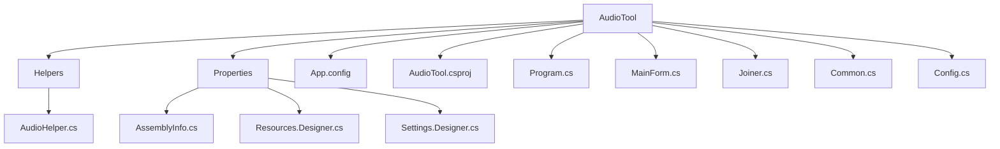
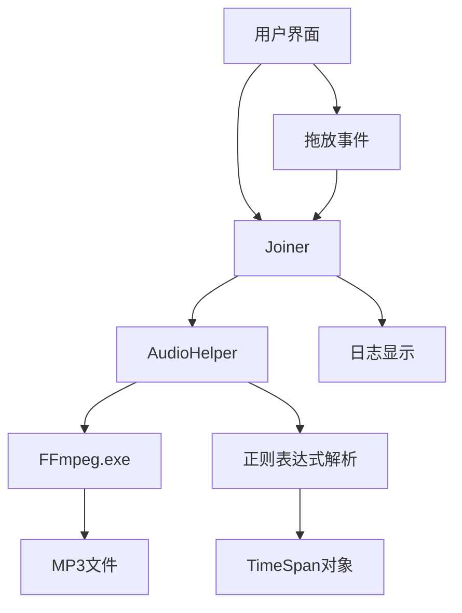
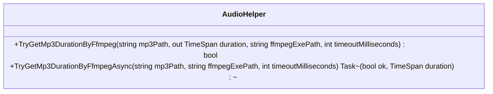
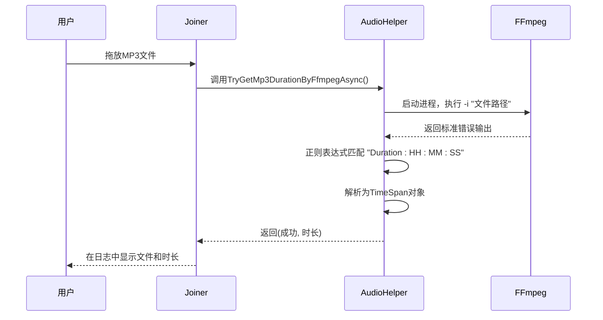
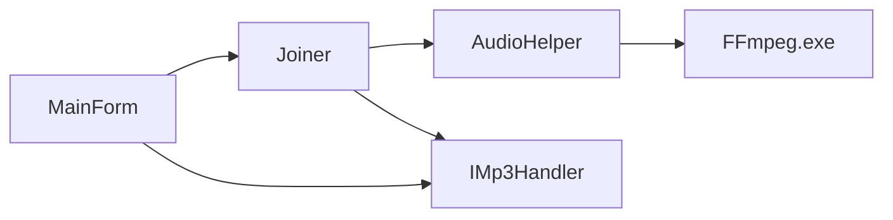

# 音频MP3时长获取

<cite>
**本文档引用的文件**   
- [AudioHelper.cs](file://AudioTool/Helpers/AudioHelper.cs)
- [Joiner.cs](file://AudioTool/Joiner.cs)
- [MainForm.cs](file://AudioTool/MainForm.cs)
- [Common.cs](file://AudioTool/Common.cs)
- [Config.cs](file://AudioTool/Config.cs)
- [AudioTool.csproj](file://AudioTool/AudioTool.csproj)
</cite>

## 目录
1. [简介](#简介)
2. [项目结构](#项目结构)
3. [核心组件](#核心组件)
4. [架构概述](#架构概述)
5. [详细组件分析](#详细组件分析)
6. [依赖分析](#依赖分析)
7. [性能考虑](#性能考虑)
8. [故障排除指南](#故障排除指南)
9. [结论](#结论)

## 简介
本项目是一个音频处理工具，专注于MP3文件的时长获取功能。该工具利用FFmpeg命令行工具来解析音频文件的元数据，从而准确获取MP3文件的播放时长。系统设计为无额外依赖，通过调用本地FFmpeg可执行文件实现核心功能。用户可以通过拖放操作将MP3文件添加到应用程序中，系统会自动并发地获取每个文件的时长信息并显示在日志中。整个实现采用了异步编程模型，确保用户界面的响应性，同时通过正则表达式解析FFmpeg输出，提取Duration字段来计算精确的播放时长。

## 项目结构
音频工具项目采用分层的目录结构，将功能模块、辅助类和UI组件清晰地组织在一起。核心功能集中在AudioTool主项目中，其中Helpers目录包含音频处理的核心逻辑，特别是使用FFmpeg获取MP3时长的实现。UI组件如MainForm和Joiner分别负责主窗口和音频拼接功能的界面展示。项目还包含配置文件、资源文件和程序入口点，形成了一个完整的Windows桌面应用程序结构。

**图示来源**
- [AudioTool.csproj](file://AudioTool/AudioTool.csproj)
- [MainForm.cs](file://AudioTool/MainForm.cs)
- [Joiner.cs](file://AudioTool/Joiner.cs)

**本节来源**
- [AudioTool.csproj](file://AudioTool/AudioTool.csproj)
- [MainForm.cs](file://AudioTool/MainForm.cs)

## 核心组件
音频工具的核心组件包括AudioHelper类，它提供了使用FFmpeg获取MP3时长的同步和异步方法；Joiner类，作为UI组件处理用户交互和文件列表管理；以及MainForm类，作为应用程序的主窗口和入口点。这些组件通过IMp3Handler接口进行松耦合连接，实现了功能的模块化。AudioHelper是核心功能的实现者，它通过启动FFmpeg进程并解析其标准错误输出来提取音频时长信息。Joiner组件则负责接收用户拖放的MP3文件，并并发地调用AudioHelper来获取每个文件的时长，确保了良好的用户体验。

**本节来源**
- [AudioHelper.cs](file://AudioTool/Helpers/AudioHelper.cs#L14-L112)
- [Joiner.cs](file://AudioTool/Joiner.cs#L16-L264)
- [MainForm.cs](file://AudioTool/MainForm.cs#L10-L124)

## 架构概述
音频MP3时长获取功能的架构基于一个清晰的分层设计，将用户界面、业务逻辑和外部工具调用分离。应用程序启动后，用户可以通过拖放操作将MP3文件添加到Joiner界面。系统通过IMp3Handler接口将文件列表传递给Joiner组件，后者使用Task.WhenAny模式并发地调用AudioHelper的异步方法来获取每个文件的时长。这种并发处理策略确保了即使处理大量文件，用户界面也能保持响应。核心的时长获取逻辑封装在AudioHelper类中，该类通过Process类启动FFmpeg进程，重定向其标准错误输出，并使用正则表达式解析包含Duration信息的文本行。

**图示来源**
- [AudioHelper.cs](file://AudioTool/Helpers/AudioHelper.cs#L14-L112)
- [Joiner.cs](file://AudioTool/Joiner.cs#L16-L264)

## 详细组件分析

### AudioHelper分析
AudioHelper类是音频时长获取功能的核心实现，提供了同步和异步两种接口。同步方法TryGetMp3DurationByFfmpeg负责实际的FFmpeg调用和结果解析，而异步方法TryGetMp3DurationByFfmpegAsync则通过Task.Run包装同步调用，避免阻塞UI线程。该类的设计考虑了多种异常情况，包括文件路径验证、FFmpeg可执行文件存在性检查以及进程超时处理。时长解析采用了双重策略：首先尝试使用TimeSpan.Parse直接解析，如果失败则采用手动字符串分割的备用方案，确保了对不同格式Duration输出的兼容性。

#### 类图

**图示来源**
- [AudioHelper.cs](file://AudioTool/Helpers/AudioHelper.cs#L14-L112)

#### 时长获取流程

**图示来源**
- [AudioHelper.cs](file://AudioTool/Helpers/AudioHelper.cs#L21-L110)
- [Joiner.cs](file://AudioTool/Joiner.cs#L34-L74)

**本节来源**
- [AudioHelper.cs](file://AudioTool/Helpers/AudioHelper.cs#L14-L112)
- [Joiner.cs](file://AudioTool/Joiner.cs#L34-L74)

### Joiner组件分析
Joiner组件作为UI控制器，实现了IMp3Handler接口，负责处理用户添加的MP3文件列表。其核心方法OpenMp3s采用高效的并发策略，为每个文件启动独立的时长获取任务，并使用Task.WhenAny模式按完成顺序更新UI，提供了即时的用户反馈。这种方法避免了按顺序处理文件可能造成的长时间等待，显著提升了用户体验。组件还包含了适当的错误处理机制，当FFmpeg调用失败时，会在日志中给出明确的提示，指导用户检查FFmpeg可执行文件的存在性。

**本节来源**
- [Joiner.cs](file://AudioTool/Joiner.cs#L16-L74)
- [Common.cs](file://AudioTool/Common.cs#L9-L13)

## 依赖分析
音频工具的主要外部依赖是FFmpeg可执行文件，该工具必须存在于应用程序目录下的ffmpeg子目录中。项目内部依赖关系清晰，Joiner组件依赖于AudioHelper提供的时长获取功能，而两者通过IMp3Handler接口与主窗体进行通信。这种设计实现了关注点分离，使得核心功能与用户界面解耦。项目还依赖于.NET Framework的System.Diagnostics.Process类来启动外部进程，以及System.Text.RegularExpressions命名空间中的类来进行输出解析。

**图示来源**
- [AudioHelper.cs](file://AudioTool/Helpers/AudioHelper.cs)
- [Joiner.cs](file://AudioTool/Joiner.cs)
- [MainForm.cs](file://AudioTool/MainForm.cs)

**本节来源**
- [AudioHelper.cs](file://AudioTool/Helpers/AudioHelper.cs#L21-L35)
- [Joiner.cs](file://AudioTool/Joiner.cs#L45-L47)
- [MainForm.cs](file://AudioTool/MainForm.cs#L47-L49)

## 性能考虑
音频时长获取功能在性能方面进行了精心设计。通过并发执行多个时长获取任务，系统能够充分利用多核处理器的优势，显著缩短处理多个文件的总时间。异步编程模型确保了UI线程不会被阻塞，保持了应用程序的响应性。FFmpeg进程设置了5秒的超时限制，防止因损坏文件或系统问题导致的无限等待。正则表达式解析效率高，且采用了双重解析策略，既保证了兼容性又确保了性能。对于大量文件的处理，建议用户分批操作，以避免系统资源过度消耗。

## 故障排除指南
当音频时长获取功能无法正常工作时，最常见的原因是FFmpeg可执行文件缺失。请确保在应用程序目录下存在ffmpeg\ffmpeg.exe文件。如果文件存在但仍无法获取时长，可能是FFmpeg版本不兼容或MP3文件损坏。检查日志输出中的错误信息，确认FFmpeg是否能够正常启动。对于网络驱动器上的文件，可能存在权限或路径访问问题，建议将文件复制到本地磁盘再进行处理。如果遇到解析错误，可以尝试更新到最新版本的FFmpeg，以支持更多音频编码格式。

**本节来源**
- [AudioHelper.cs](file://AudioTool/Helpers/AudioHelper.cs#L37-L39)
- [Joiner.cs](file://AudioTool/Joiner.cs#L63-L65)

## 结论
音频MP3时长获取功能通过巧妙地结合FFmpeg命令行工具和.NET异步编程模型，实现了一个高效、可靠的解决方案。系统设计注重用户体验，通过并发处理和即时反馈，使得即使处理大量音频文件也能保持流畅的操作体验。代码结构清晰，职责分离明确，便于维护和扩展。未来可以考虑添加对更多音频格式的支持，或实现缓存机制避免重复解析相同文件，进一步提升性能和用户体验。