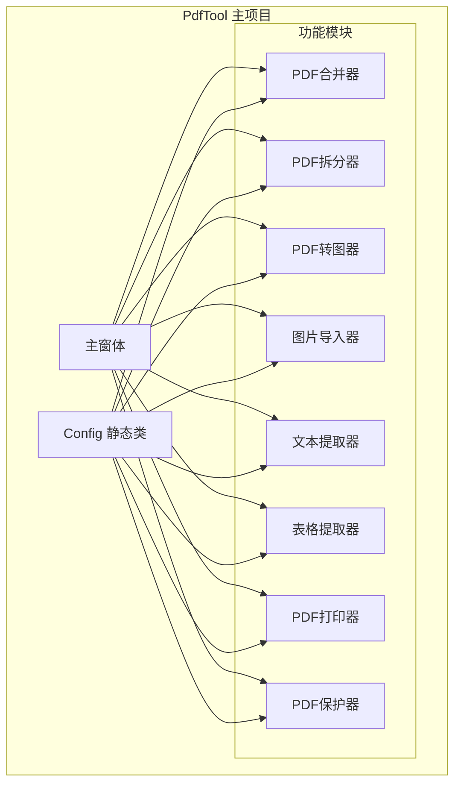
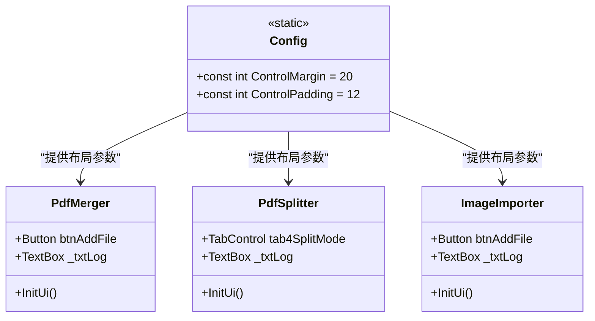
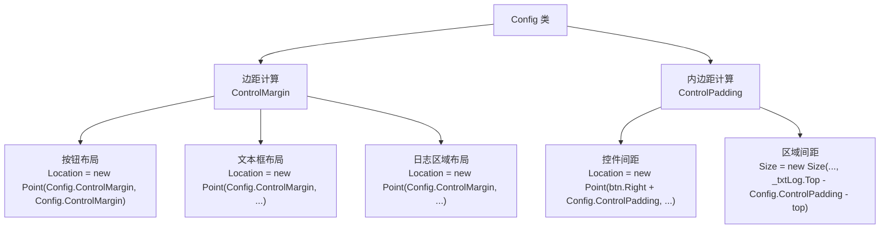
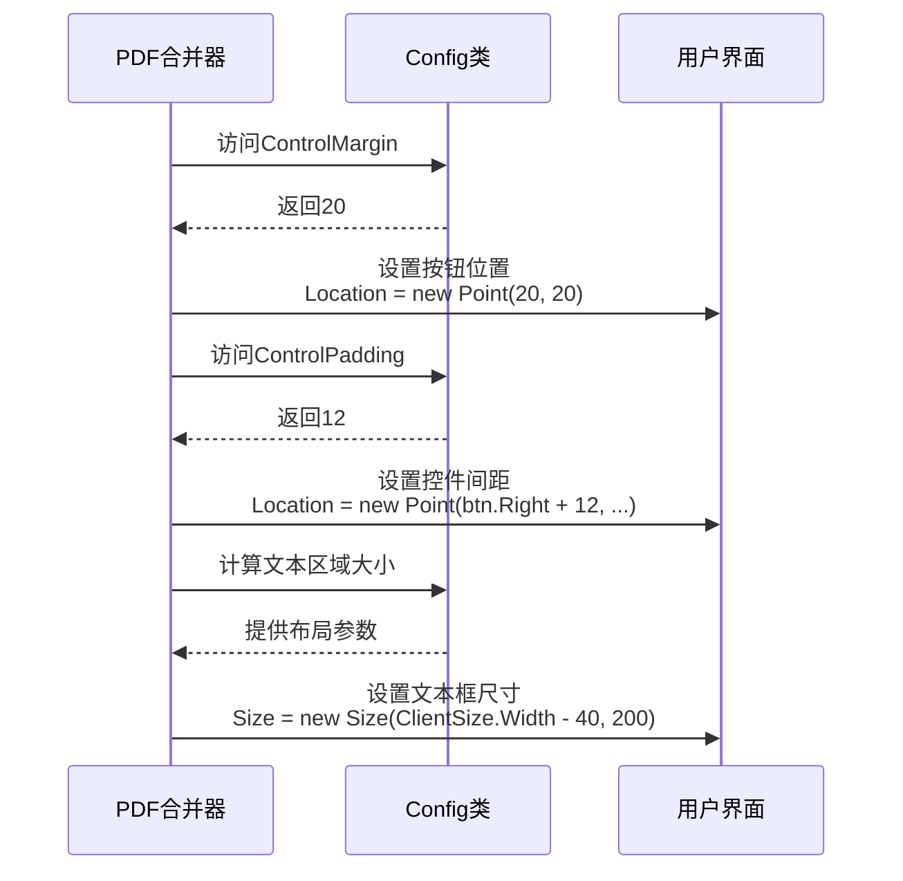
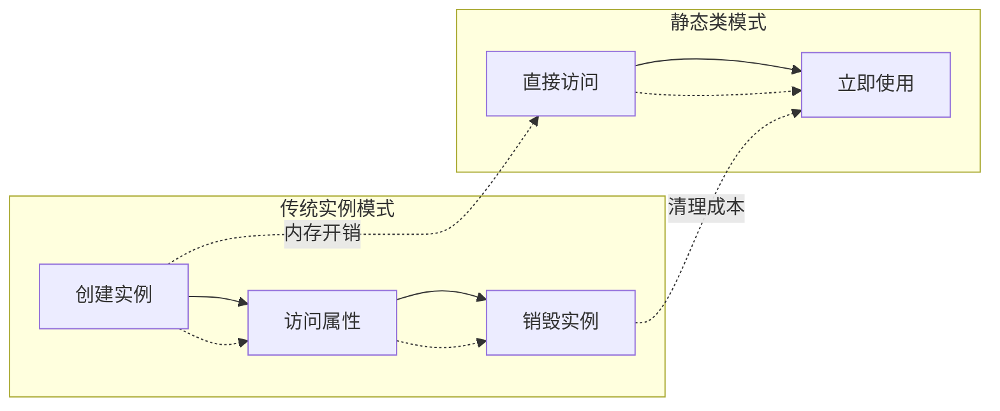
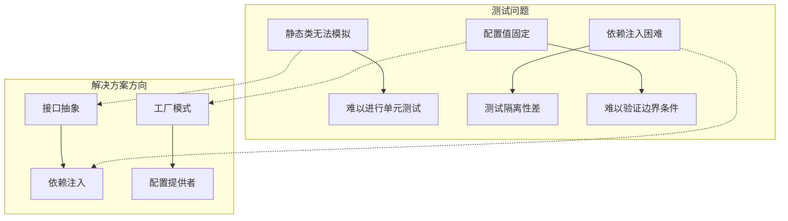
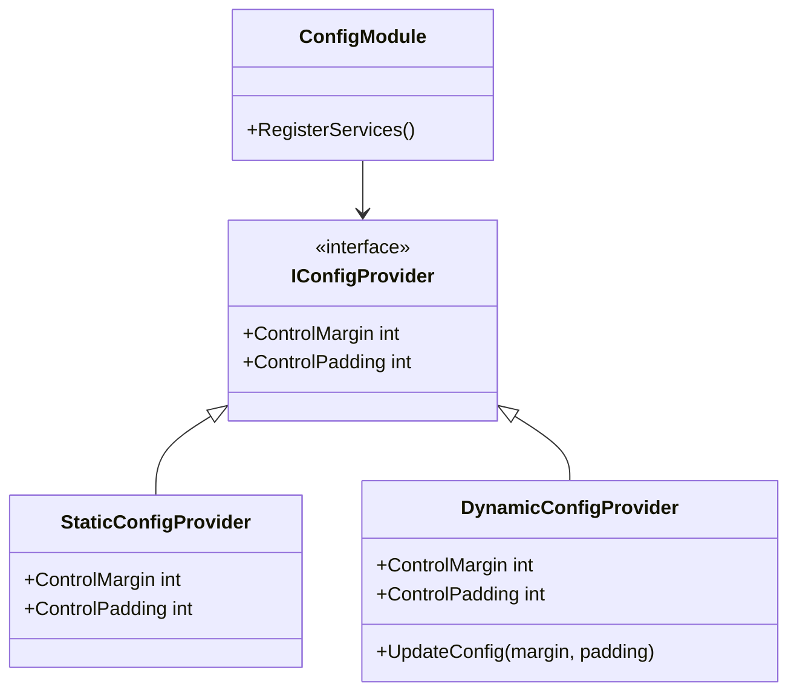
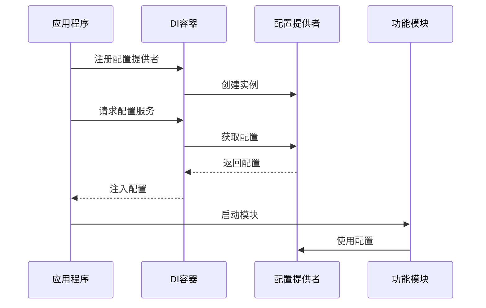
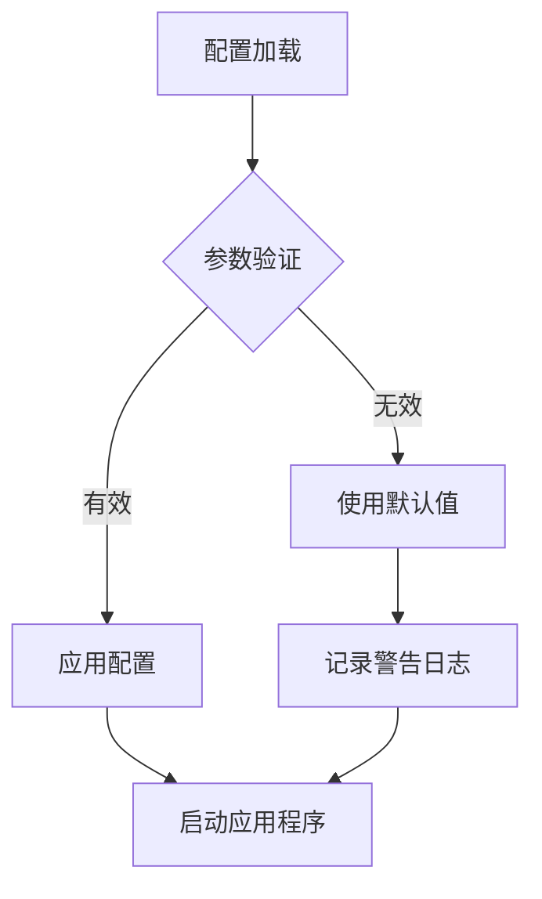

# 单例模式应用

<cite>
**本文档中引用的文件**
- [PdfTool/Config.cs](file://PdfTool/Config.cs)
- [PdfTool/MainForm.cs](file://PdfTool/MainForm.cs)
- [PdfTool/PdfMerger.cs](file://PdfTool/PdfMerger.cs)
- [PdfTool/PdfSplitter.cs](file://PdfTool/PdfSplitter.cs)
- [PdfTool/ImageImporter.cs](file://PdfTool/ImageImporter.cs)
- [PdfTool/PdfImager.cs](file://PdfTool/PdfImager.cs)
- [PdfTool/PdfTextExtracter.cs](file://PdfTool/PdfTextExtracter.cs)
- [PdfTool/PdfTableExtracter.cs](file://PdfTool/PdfTableExtracter.cs)
- [PdfTool/PdfPrinter.cs](file://PdfTool/PdfPrinter.cs)
- [PdfTool/PdfProtector.cs](file://PdfTool/PdfProtector.cs)
- [PdfTool/Common.cs](file://PdfTool/Common.cs)
- [PdfTool/Program.cs](file://PdfTool/Program.cs)
</cite>

## 目录
1. [引言](#引言)
2. [项目结构概述](#项目结构概述)
3. [Config类的单例模式实现](#config类的单例模式实现)
4. [常量定义与全局配置管理](#常量定义与全局配置管理)
5. [UI模块中的统一布局应用](#ui模块中的统一布局应用)
6. [单例模式的优势分析](#单例模式的优势分析)
7. [局限性与潜在问题](#局限性与潜在问题)
8. [改进建议与最佳实践](#改进建议与最佳实践)
9. [总结](#总结)

## 引言

在PdfTool项目中，单例模式通过Config类的静态类实现，为整个应用程序提供了全局配置管理机制。这种设计模式确保了界面布局参数的一致性，简化了开发过程，提高了代码的可维护性。本文档将深入分析Config类的实现方式、应用场景以及单例模式在该架构中的具体体现。

## 项目结构概述

PdfTool项目采用模块化架构设计，包含多个功能模块，每个模块都使用统一的布局配置参数。项目的主要特点包括：

- **模块化设计**：每个功能模块（如PDF合并、拆分、转换等）都是独立的UserControl
- **统一布局标准**：所有模块使用相同的边距和内边距配置
- **静态配置管理**：通过单一Config类集中管理界面布局参数



**图表来源**
- [PdfTool/MainForm.cs](file://PdfTool/MainForm.cs#L1-L194)
- [PdfTool/Config.cs](file://PdfTool/Config.cs#L1-L9)

## Config类的单例模式实现

### 静态类实现方式

Config类采用了C#中的静态类（static class）来实现单例模式，这是.NET框架中实现单例模式的一种经典方式。



**图表来源**
- [PdfTool/Config.cs](file://PdfTool/Config.cs#L3-L8)
- [PdfTool/PdfMerger.cs](file://PdfTool/PdfMerger.cs#L75-L150)
- [PdfTool/PdfSplitter.cs](file://PdfTool/PdfSplitter.cs#L109-L227)
- [PdfTool/ImageImporter.cs](file://PdfTool/ImageImporter.cs#L63-L125)

### 实现特点分析

1. **编译时保证唯一性**：静态类在编译时就确定了实例的唯一性
2. **延迟初始化**：静态类的字段在首次访问时才初始化
3. **线程安全**：静态类的字段初始化是线程安全的
4. **内存效率**：不需要额外的内存开销来维护实例

**章节来源**
- [PdfTool/Config.cs](file://PdfTool/Config.cs#L1-L9)

## 常量定义与全局配置管理

### 核心配置参数

Config类定义了两个关键的布局常量：

| 参数名称 | 默认值 | 用途描述 |
|---------|--------|----------|
| ControlMargin | 20 | 控件与父容器边缘的外边距 |
| ControlPadding | 12 | 控件内部元素之间的内边距 |

### 配置参数的作用范围

这些配置参数被广泛应用于各个功能模块的UI布局中，确保了界面风格的一致性：



**图表来源**
- [PdfTool/PdfMerger.cs](file://PdfTool/PdfMerger.cs#L78-L150)
- [PdfTool/PdfSplitter.cs](file://PdfTool/PdfSplitter.cs#L111-L227)
- [PdfTool/ImageImporter.cs](file://PdfTool/ImageImporter.cs#L65-L125)

**章节来源**
- [PdfTool/Config.cs](file://PdfTool/Config.cs#L5-L6)

## UI模块中的统一布局应用

### PDF合并器中的布局应用

在PdfMerger模块中，Config类的配置参数被用于精确控制控件的位置和大小：



**图表来源**
- [PdfTool/PdfMerger.cs](file://PdfTool/PdfMerger.cs#L78-L150)

### PDF拆分器的复杂布局应用

PdfSplitter模块展示了Config类在更复杂界面布局中的应用：

```mermaid
graph LR
subgraph "PDF拆分器布局"
A[添加文件按钮<br/>Location: (20, 20)] --> B[选项卡控件<br/>Location: (20, 40)]
B --> C[日志文本框<br/>Location: (20, 190)<br/>Size: (Width-40, Height-190)]
D[常规拆分标签页] --> E[页数设置<br/>Location: (20, 20)]
E --> F[开始拆分按钮<br/>Location: (20, Bottom-50)]
G[指定页提取标签页] --> H[起始页码<br/>Location: (20, 20)]
H --> I[结束页码<br/>Location: (120, 20)]
I --> J[开始提取按钮<br/>Location: (20, Bottom-50)]
end
```

**图表来源**
- [PdfTool/PdfSplitter.cs](file://PdfTool/PdfSplitter.cs#L109-L227)

### 图片导入器的简洁布局应用

ImageImporter模块展示了Config类在简洁界面设计中的应用：

| 控件类型 | 位置计算 | 尺寸计算 |
|---------|----------|----------|
| 添加文件按钮 | `Location = new Point(Config.ControlMargin, Config.ControlMargin)` | 自动调整 |
| 开始导入按钮 | `Location = new Point(btnAddFile.Right + Config.ControlPadding, btnAddFile.Top)` | 自动调整 |
| 日志文本框 | `Location = new Point(Config.ControlMargin, ClientSize.Height - Config.ControlMargin - 200)` | `Size = new Size(ClientSize.Width - Config.ControlMargin * 2, 200)` |
| 文件列表 | `Location = new Point(btnAddFile.Left, btnAddFile.Bottom + Config.ControlPadding)` | 动态计算高度 |

**章节来源**
- [PdfTool/PdfMerger.cs](file://PdfTool/PdfMerger.cs#L75-L154)
- [PdfTool/PdfSplitter.cs](file://PdfTool/PdfSplitter.cs#L109-L230)
- [PdfTool/ImageImporter.cs](file://PdfTool/ImageImporter.cs#L63-L129)

## 单例模式的优势分析

### 简单易用性

Config类作为静态类，具有以下优势：

1. **声明式访问**：无需实例化即可直接访问配置参数
2. **编译时检查**：类型安全，避免运行时错误
3. **性能优化**：静态访问比实例访问更快



### 延迟初始化特性

静态类的字段在首次访问时才初始化，这提供了以下好处：

- **启动性能**：应用程序启动时不会加载不必要的配置数据
- **按需加载**：只有在真正需要配置参数时才会进行初始化
- **内存效率**：避免了不必要的内存占用

### 线程安全保证

静态类的初始化是线程安全的，这意味着：

- **并发访问**：多线程环境下可以安全地访问配置参数
- **不可变性**：常量值一旦初始化就不会改变，避免了竞态条件
- **一致性**：所有线程看到的配置值始终一致

**章节来源**
- [PdfTool/Config.cs](file://PdfTool/Config.cs#L1-L9)

## 局限性与潜在问题

### 测试困难性

静态类的使用带来了测试方面的挑战：



### 全局状态污染

静态类可能导致以下问题：

1. **隐式依赖**：模块间的依赖关系不明确
2. **耦合度高**：所有模块都直接依赖Config类
3. **维护困难**：一处修改可能影响多个模块

### 生命周期管理困难

静态类的生命周期与应用程序相同，这带来以下限制：

- **配置变更困难**：运行时无法修改配置参数
- **环境适配不足**：无法根据不同环境提供不同的配置
- **资源管理复杂**：静态类不能很好地处理资源释放

**章节来源**
- [PdfTool/Config.cs](file://PdfTool/Config.cs#L1-L9)

## 改进建议与最佳实践

### 引入依赖注入容器

推荐使用依赖注入容器来管理配置对象：



### 配置提供者模式

实现一个灵活的配置提供者模式：



### 分层配置管理

建议采用分层的配置管理模式：

1. **基础配置层**：硬编码的默认值
2. **用户配置层**：用户自定义的偏好设置
3. **环境配置层**：针对不同环境的配置
4. **运行时配置层**：动态调整的配置参数

### 配置验证机制

实现配置参数的验证机制：



**章节来源**
- [PdfTool/Config.cs](file://PdfTool/Config.cs#L1-L9)

## 总结

PdfTool项目中的Config类通过静态类实现了单例模式，为整个应用程序提供了简单而有效的全局配置管理。这种设计在界面布局一致性方面表现出色，但在测试性和灵活性方面存在局限性。

### 关键优势

1. **界面一致性**：确保所有功能模块使用统一的布局参数
2. **开发效率**：简化了UI布局的开发过程
3. **性能表现**：静态访问提供了良好的性能特征
4. **线程安全**：内置的线程安全保障

### 改进方向

虽然当前的单例模式实现满足了基本需求，但为了提高系统的可测试性和灵活性，建议采用依赖注入容器和配置提供者模式。这种改进方案能够更好地支持单元测试、环境适配和运行时配置调整。

通过合理的架构设计和持续的重构改进，PdfTool项目可以在保持现有优势的同时，获得更好的可维护性和扩展性。