# PdfTool中设计模式的应用分析

<cite>
**本文档中引用的文件**
- [MergeHelper.cs](file://PdfHelperLibrary/MergeHelper.cs)
- [SplitHelper.cs](file://PdfHelperLibrary/SplitHelper.cs)
- [ExtractHelper.cs](file://PdfHelperLibrary/ExtractHelper.cs)
- [ImageExtractHelper.cs](file://PdfHelperLibrary/ImageExtractHelper.cs)
- [TableExtractHelper.cs](file://PdfHelperLibrary/TableExtractHelper.cs)
- [CommonHelper.cs](file://PdfHelperLibrary/CommonHelper.cs)
- [Config.cs](file://PdfTool/Config.cs)
- [PdfMerger.cs](file://PdfTool/PdfMerger.cs)
- [PdfSplitter.cs](file://PdfTool/PdfSplitter.cs)
- [MainForm.cs](file://PdfTool/MainForm.cs)
</cite>

## 目录
1. [引言](#引言)
2. [项目结构概述](#项目结构概述)
3. [门面模式在PdfHelperLibrary中的应用](#门面模式在pdfhelperlibrary中的应用)
4. [单例模式在Config类中的实现](#单例模式在config类中的实现)
5. [设计模式的实际应用场景](#设计模式的实际应用场景)
6. [代码质量分析与改进建议](#代码质量分析与改进建议)
7. [总结](#总结)

## 引言

PdfTool是一个基于.NET开发的PDF处理工具集，采用了多种经典设计模式来提升代码的可读性、可维护性和复用性。本文档重点分析其中门面模式和单例模式的应用，通过具体代码示例展示这些设计模式如何简化复杂的PDF操作，并提供统一的配置管理接口。

## 项目结构概述

PdfTool采用模块化架构，主要包含以下核心组件：

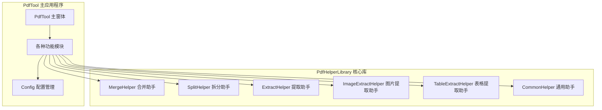

**图表来源**
- [MainForm.cs](file://PdfTool/MainForm.cs#L1-L194)
- [Config.cs](file://PdfTool/Config.cs#L1-L9)

## 门面模式在PdfHelperLibrary中的应用

### 门面模式的核心概念

门面模式（Facade Pattern）为子系统中的一组接口提供一个统一的高层接口，使得子系统更容易使用。在PdfHelperLibrary中，各个Helper类都采用了这种模式。

### 具体实现分析

#### 1. MergeHelper - PDF合并功能门面

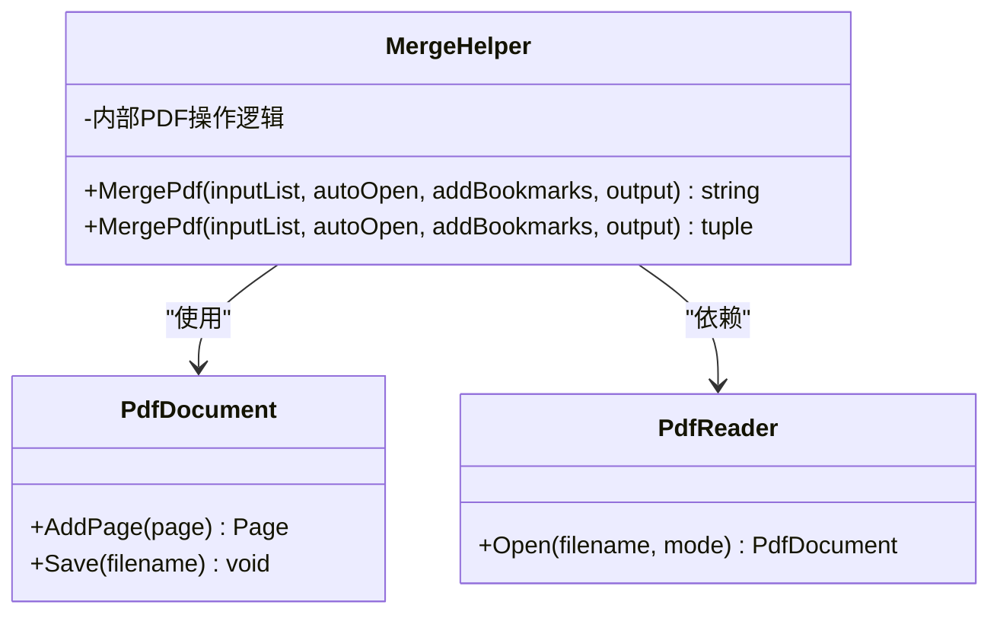

**图表来源**
- [MergeHelper.cs](file://PdfHelperLibrary/MergeHelper.cs#L14-L74)

MergeHelper提供了两个重载的静态方法，隐藏了底层PDF库的复杂性：

- **第一个重载**：返回错误消息字符串，适合简单的错误处理场景
- **第二个重载**：返回元组，包含错误消息和输出文件路径，提供更丰富的上下文信息

#### 2. SplitHelper - PDF拆分功能门面

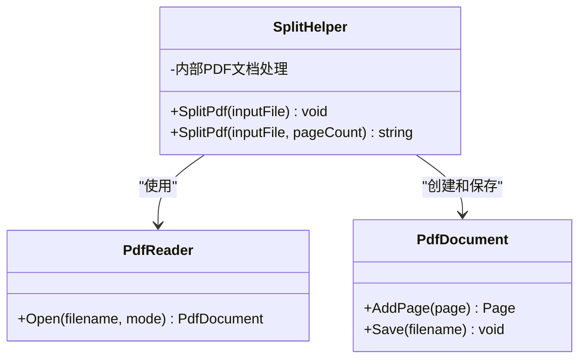

**图表来源**
- [SplitHelper.cs](file://PdfHelperLibrary/SplitHelper.cs#L11-L69)

SplitHelper展示了两种不同的拆分策略：
- **无参数拆分**：将PDF的每一页拆分为单独的文件
- **指定页数拆分**：按指定的页数组合成新的PDF文件

#### 3. ExtractHelper - PDF内容提取门面

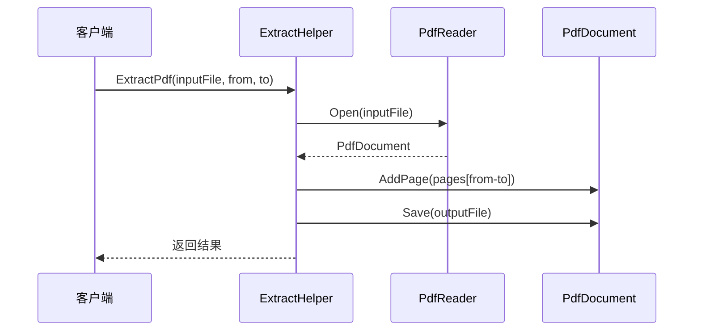

**图表来源**
- [ExtractHelper.cs](file://PdfHelperLibrary/ExtractHelper.cs#L14-L76)

ExtractHelper提供了两个核心功能：
- **页面范围提取**：从指定起始页到结束页提取PDF内容
- **指定页面删除**：删除指定的页面编号列表

#### 4. ImageExtractHelper - 图片提取门面

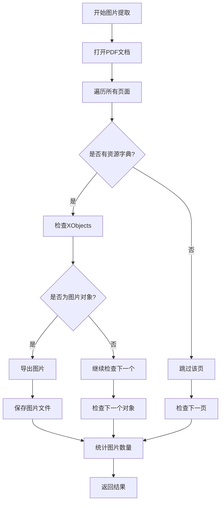

**图表来源**
- [ImageExtractHelper.cs](file://PdfHelperLibrary/ImageExtractHelper.cs#L17-L181)

ImageExtractHelper实现了复杂的图片提取逻辑，支持多种图片格式：
- JPEG格式直接导出
- PNG格式转换处理
- 压缩JPEG格式解码
- CCITT Fax格式处理

### 门面模式的优势

1. **简化接口**：客户端只需调用静态方法，无需了解底层PDF库的复杂性
2. **统一错误处理**：所有Helper类都采用一致的错误返回机制
3. **提高可维护性**：当底层PDF库升级时，只需修改Helper类，不影响客户端代码
4. **增强可测试性**：静态方法便于单元测试

**章节来源**
- [MergeHelper.cs](file://PdfHelperLibrary/MergeHelper.cs#L1-L75)
- [SplitHelper.cs](file://PdfHelperLibrary/SplitHelper.cs#L1-L70)
- [ExtractHelper.cs](file://PdfHelperLibrary/ExtractHelper.cs#L1-L77)
- [ImageExtractHelper.cs](file://PdfHelperLibrary/ImageExtractHelper.cs#L1-L182)

## 单例模式在Config类中的实现

### 单例模式的核心概念

单例模式确保一个类只有一个实例，并提供全局访问点。在PdfTool中，Config类采用了静态类的形式实现单例模式。

### Config类的实现分析

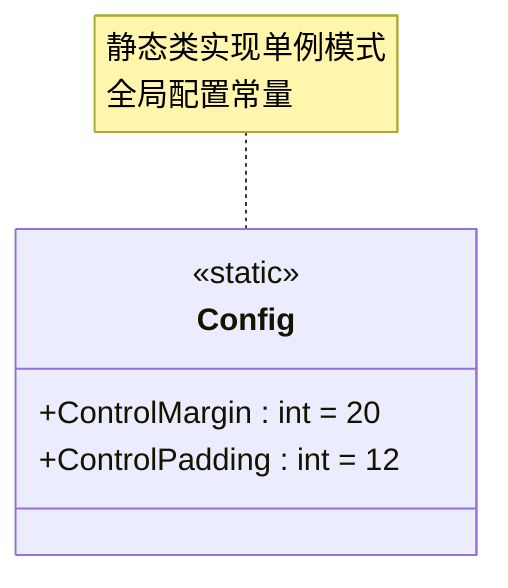

**图表来源**
- [Config.cs](file://PdfTool/Config.cs#L3-L7)

Config类的特点：
- **静态类**：使用`internal static class`声明，确保只能有一个实例
- **常量定义**：使用`const`关键字定义UI布局常量
- **命名空间隔离**：每个模块都有独立的Config类，避免命名冲突

### Config类在UI中的应用

#### 1. PdfMerger中的Config使用

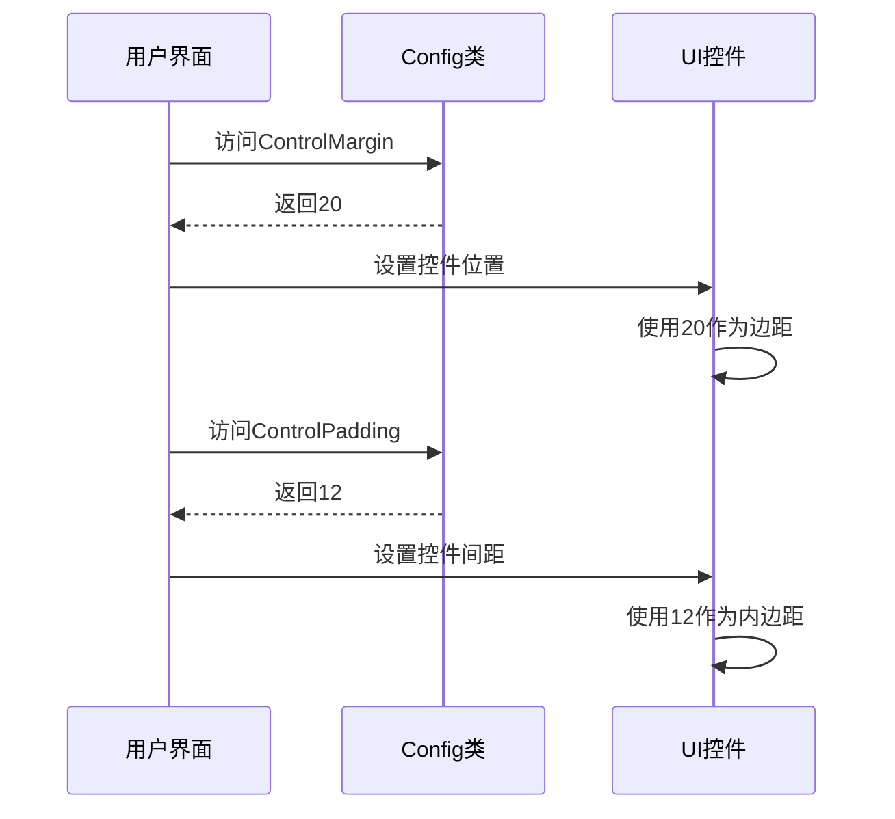

**图表来源**
- [PdfMerger.cs](file://PdfTool/PdfMerger.cs#L77-L150)

在PdfMerger中，Config类被广泛用于：
- **控件定位**：`Location = new Point(Config.ControlMargin, Config.ControlMargin)`
- **控件间距**：`Location = new Point(btnAddFile.Right + Config.ControlPadding, btnAddFile.Top + 2)`
- **容器尺寸**：`Size = new Size(ClientSize.Width - Config.ControlMargin * 2, 200)`

#### 2. PdfSplitter中的Config使用

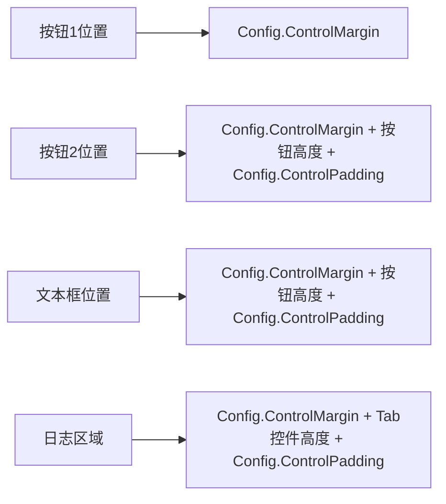

**图表来源**
- [PdfSplitter.cs](file://PdfTool/PdfSplitter.cs#L111-L226)

### 单例模式的优势

1. **全局一致性**：确保整个应用程序使用相同的UI布局标准
2. **易于维护**：修改布局参数只需更改一处
3. **类型安全**：编译时检查常量值的有效性
4. **性能优化**：静态类加载时初始化，运行时无额外开销

**章节来源**
- [Config.cs](file://PdfTool/Config.cs#L1-L9)
- [PdfMerger.cs](file://PdfTool/PdfMerger.cs#L77-L150)
- [PdfSplitter.cs](file://PdfTool/PdfSplitter.cs#L111-L226)

## 设计模式的实际应用场景

### 门面模式的应用场景

#### 1. PDF合并场景

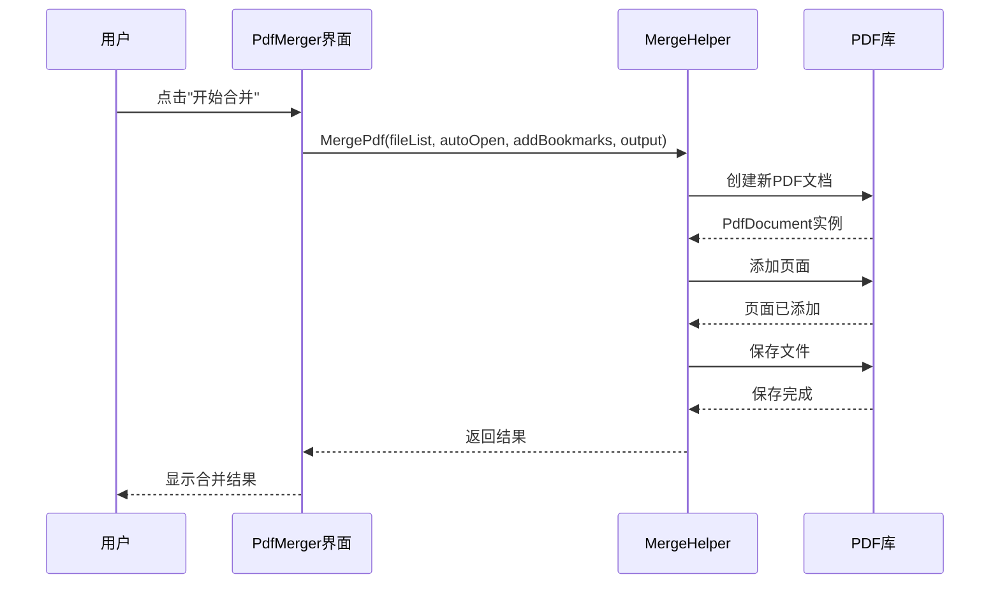

**图表来源**
- [PdfMerger.cs](file://PdfTool/PdfMerger.cs#L68-L70)
- [MergeHelper.cs](file://PdfHelperLibrary/MergeHelper.cs#L16-L41)

#### 2. PDF拆分场景

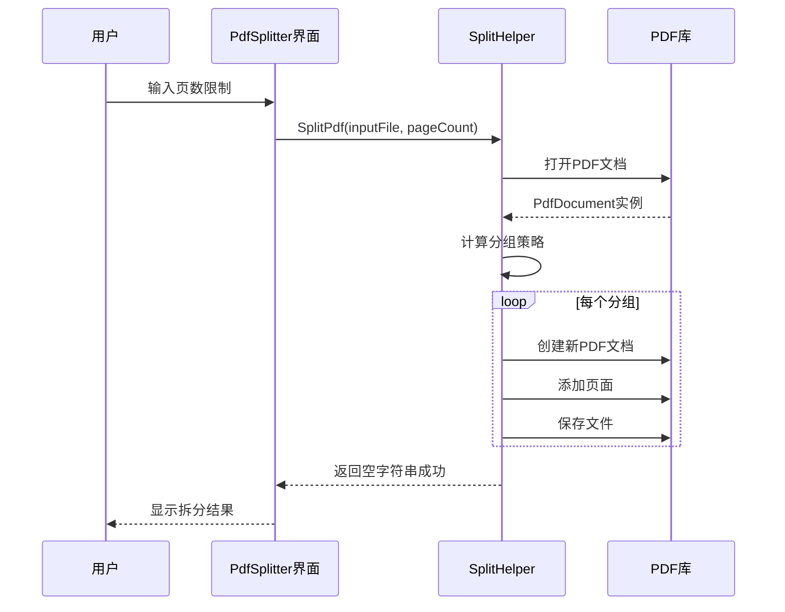

**图表来源**
- [PdfSplitter.cs](file://PdfTool/PdfSplitter.cs#L61-L65)
- [SplitHelper.cs](file://PdfHelperLibrary/SplitHelper.cs#L37-L61)

### 单例模式的应用场景

#### 1. UI布局标准化

Config类确保了整个应用程序的UI布局一致性：

| 应用场景 | ControlMargin | ControlPadding | 作用 |
|---------|---------------|----------------|------|
| 主窗体布局 | 20 | 12 | 控制主面板的外边距和内边距 |
| 功能模块布局 | 20 | 12 | 确保各功能模块的布局风格一致 |
| 对话框布局 | 20 | 12 | 保持对话框的视觉一致性 |

#### 2. 配置管理

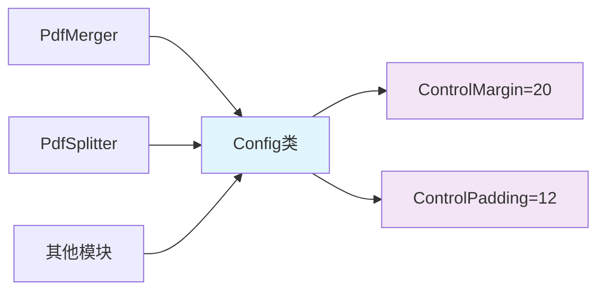

**图表来源**
- [Config.cs](file://PdfTool/Config.cs#L5-L6)

**章节来源**
- [PdfMerger.cs](file://PdfTool/PdfMerger.cs#L68-L70)
- [PdfSplitter.cs](file://PdfTool/PdfSplitter.cs#L61-L65)

## 代码质量分析与改进建议

### 当前实现的优点

1. **清晰的职责分离**：Helper类专注于特定的PDF操作，UI层负责界面展示
2. **一致的错误处理**：所有Helper类采用相同的错误返回模式
3. **易于扩展**：新增功能只需添加新的Helper类或扩展现有类
4. **良好的命名约定**：类名和方法名清晰表达其用途

### 存在的问题

#### 1. 静态类带来的测试困难

**问题描述**：
- 静态类难以进行单元测试
- 缺乏依赖注入支持
- 难以模拟或替换实现

**改进建议**：
```csharp
// 改进后的接口设计
public interface IPdfHelper
{
    string ProcessPdf(string inputFile, string outputFile);
}

// 可测试的实现
public class MergeHelper : IPdfHelper
{
    private readonly IPdfLibrary _pdfLibrary;
    
    public MergeHelper(IPdfLibrary pdfLibrary)
    {
        _pdfLibrary = pdfLibrary;
    }
    
    public string ProcessPdf(string inputFile, string outputFile)
    {
        // 实现逻辑
    }
}
```

#### 2. 缺乏异常处理的层次性

**问题描述**：
- 所有Helper类都直接抛出异常，缺乏统一的异常处理策略
- 错误信息不够用户友好

**改进建议**：
```csharp
// 统一的异常处理策略
public class PdfOperationException : Exception
{
    public PdfOperationException(string message, Exception innerException) 
        : base(message, innerException) { }
}

// 在Helper类中使用
catch (Exception ex)
{
    throw new PdfOperationException(
        $"PDF操作失败: {ex.Message}", 
        ex);
}
```

#### 3. 配置管理的局限性

**问题描述**：
- Config类只包含UI布局常量，缺乏业务配置
- 静态类无法动态修改配置

**改进建议**：
```csharp
// 可配置的配置管理器
public interface IConfiguration
{
    int ControlMargin { get; }
    int ControlPadding { get; }
    string ApplicationName { get; }
    string Version { get; }
}

public class AppConfig : IConfiguration
{
    public int ControlMargin => 20;
    public int ControlPadding => 12;
    public string ApplicationName => "PDF工具";
    public string Version => "1.0.0";
}
```

### 性能优化建议

1. **缓存机制**：对于重复的PDF操作，可以添加内存缓存
2. **异步处理**：对于耗时的PDF操作，提供异步版本
3. **资源管理**：确保PDF文档和流的正确释放

## 总结

PdfTool项目通过巧妙运用门面模式和单例模式，成功地简化了复杂的PDF操作，提升了代码的可读性和可维护性。

### 关键收获

1. **门面模式的价值**：
   - 为复杂的PDF库操作提供简洁的接口
   - 隐藏底层实现细节，降低客户端复杂度
   - 提供统一的错误处理机制

2. **单例模式的作用**：
   - 确保全局配置的一致性
   - 简化UI布局管理
   - 提高代码的可维护性

3. **设计模式的最佳实践**：
   - 选择合适的设计模式解决特定问题
   - 平衡简单性和功能性
   - 考虑未来的扩展需求

### 未来发展方向

1. **引入依赖注入**：提高代码的可测试性和灵活性
2. **增强异常处理**：提供更友好的错误信息和恢复机制
3. **配置管理现代化**：支持动态配置和多环境配置
4. **性能监控**：添加操作时间和资源使用情况的监控

通过持续改进设计模式的应用，PdfTool项目能够更好地满足用户需求，为PDF处理领域提供更加优秀的解决方案。