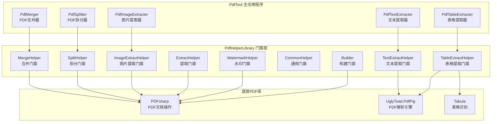
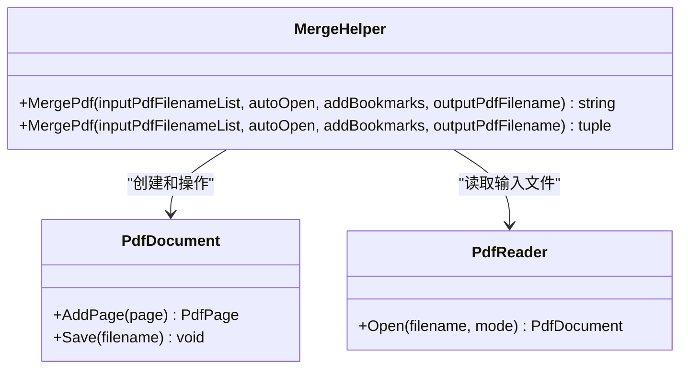
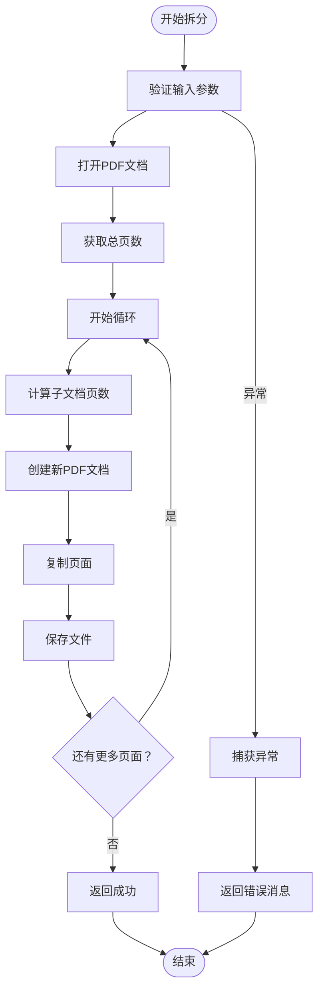
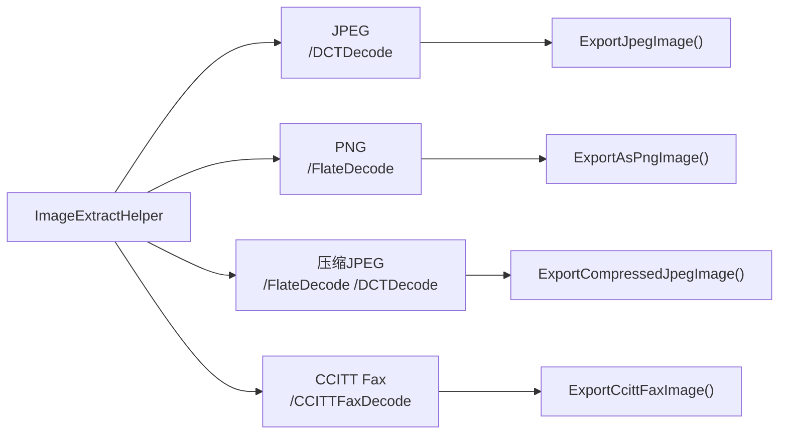
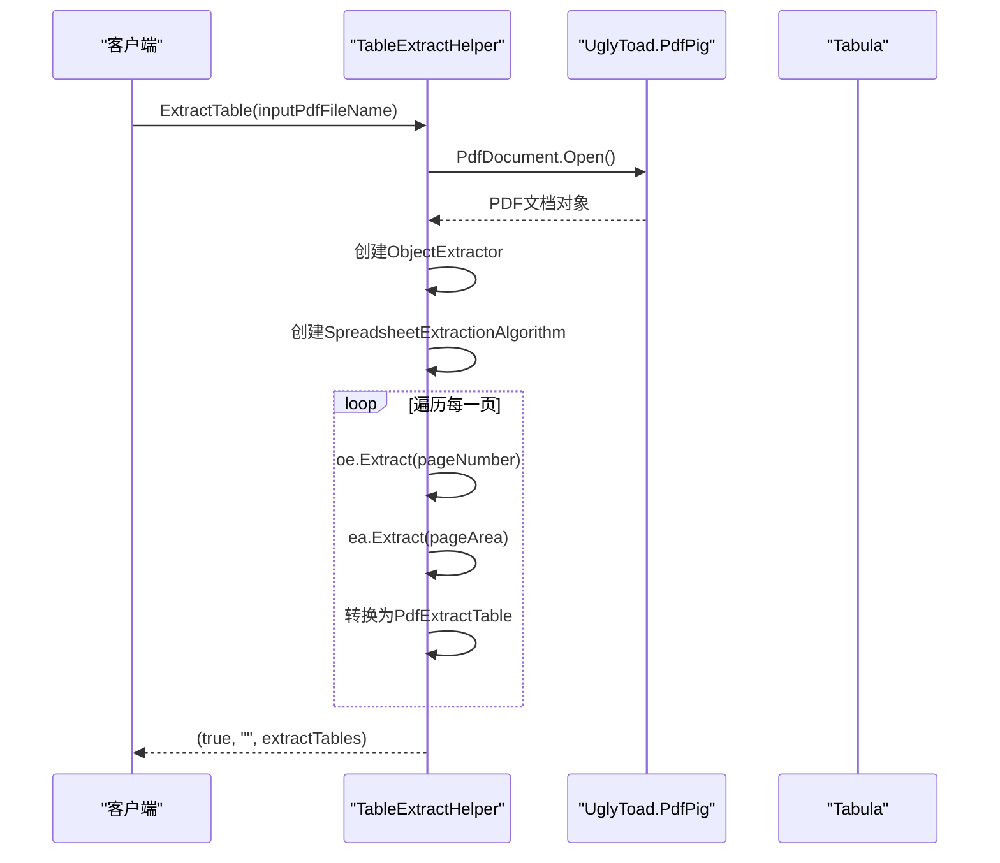
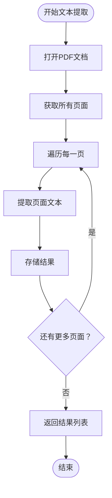
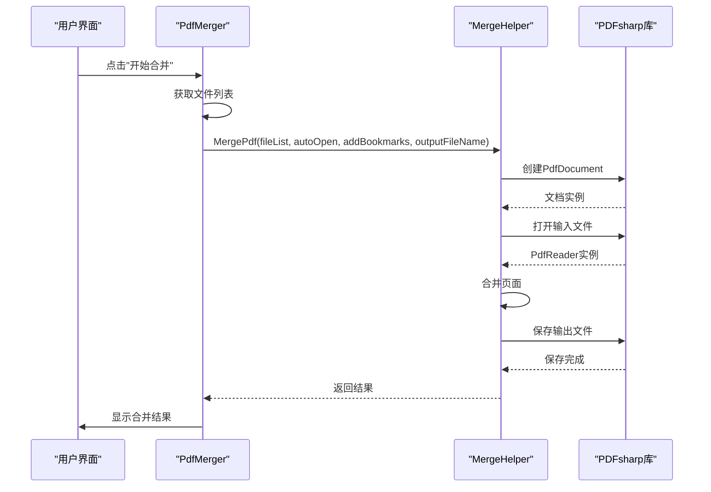
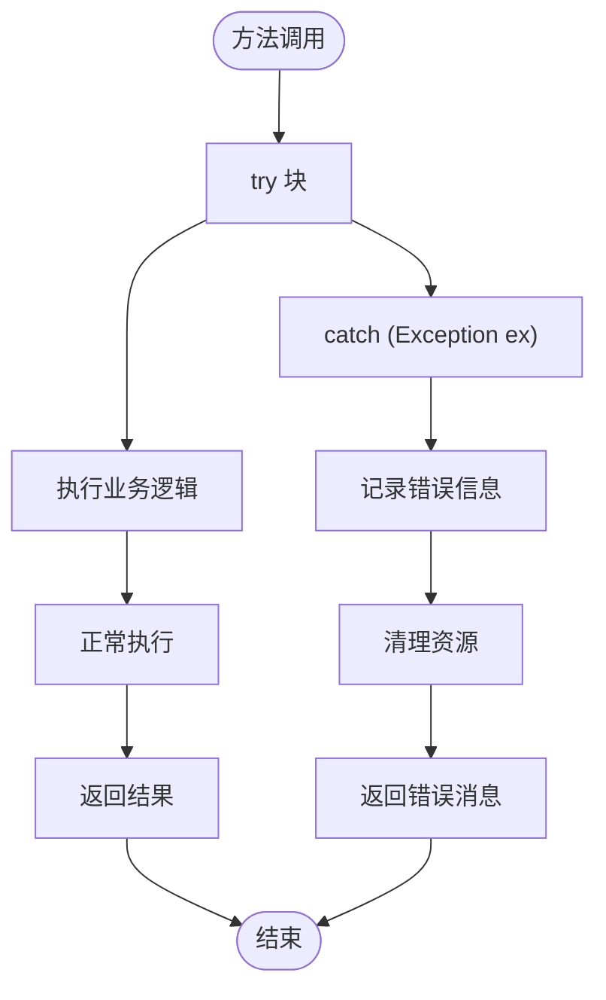
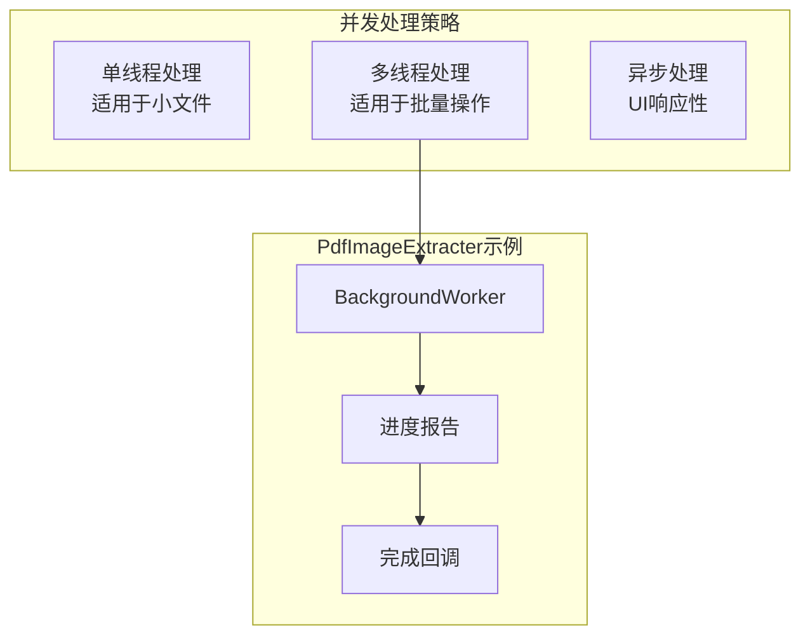
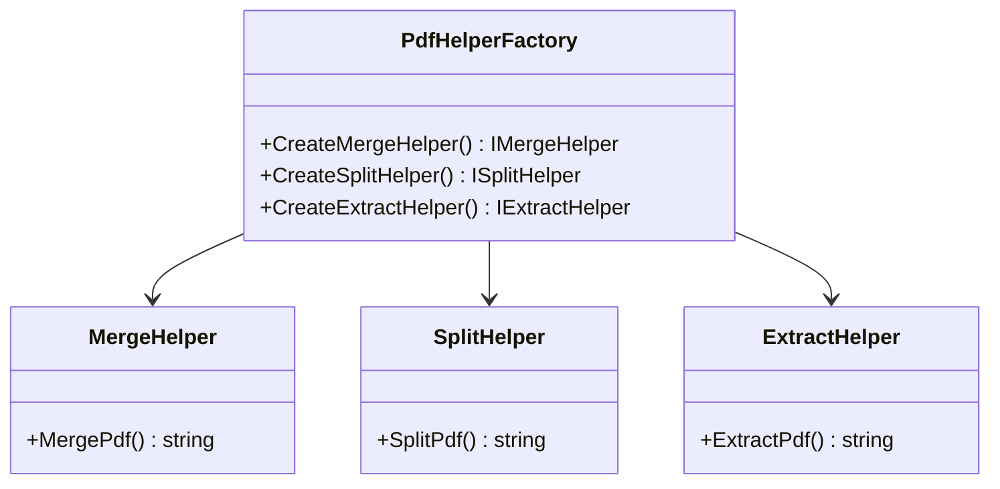

# PdfTool中门面模式的应用分析

<cite>
**本文档中引用的文件**
- [MergeHelper.cs](file://PdfHelperLibrary/MergeHelper.cs)
- [SplitHelper.cs](file://PdfHelperLibrary/SplitHelper.cs)
- [ImageExtractHelper.cs](file://PdfHelperLibrary/ImageExtractHelper.cs)
- [TableExtractHelper.cs](file://PdfHelperLibrary/TableExtractHelper.cs)
- [TextExtractHelper.cs](file://PdfHelperLibrary/TextExtractHelper.cs)
- [CommonHelper.cs](file://PdfHelperLibrary/CommonHelper.cs)
- [Builder.cs](file://PdfHelperLibrary/Builder.cs)
- [ExtractHelper.cs](file://PdfHelperLibrary/ExtractHelper.cs)
- [WatermarkHelper.cs](file://PdfHelperLibrary/WatermarkHelper.cs)
- [PdfMerger.cs](file://PdfTool/PdfMerger.cs)
- [PdfSplitter.cs](file://PdfTool/PdfSplitter.cs)
- [PdfImageExtracter.cs](file://PdfTool/PdfImageExtracter.cs)
</cite>

## 目录
1. [引言](#引言)
2. [门面模式概述](#门面模式概述)
3. [PdfHelperLibrary架构分析](#pdfhelperlibrary架构分析)
4. [核心Helper类详细分析](#核心helper类详细分析)
5. [门面模式在PdfTool中的应用](#门面模式在pdftool中的应用)
6. [错误处理与日志管理](#错误处理与日志管理)
7. [性能优化与最佳实践](#性能优化与最佳实践)
8. [潜在问题与改进建议](#潜在问题与改进建议)
9. [总结](#总结)

## 引言

PdfTool是一个基于.NET开发的PDF处理工具集，其核心功能通过PdfHelperLibrary库实现。该库采用了经典的门面模式设计，为复杂的PDF操作提供了简洁统一的接口。门面模式在这里扮演着重要的角色，它不仅简化了客户端代码的复杂度，还有效地封装了底层PDF库的复杂性，包括PDFsharp、UglyToad.PdfPig和Tabula等第三方组件。

本文档将深入分析PdfHelperLibrary中各个Helper类如何作为门面，为复杂的PDF操作提供简洁的静态方法接口，并探讨这种设计模式对代码可读性、可维护性和复用性的提升作用。

## 门面模式概述

门面模式（Facade Pattern）是一种结构型设计模式，它为子系统中的一组接口提供一个统一的接口。门面模式定义了一个高层接口，让子系统更容易使用。在PdfTool项目中，PdfHelperLibrary就是一系列门面类的集合，它们为不同的PDF操作提供了统一的访问点。

### 门面模式的核心特征

1. **简化接口**：为复杂的子系统提供简化的接口
2. **解耦合**：客户端与子系统之间实现松耦合
3. **层次化**：支持系统的分层架构
4. **关注分离**：将复杂性封装在门面后面

## PdfHelperLibrary架构分析

PdfHelperLibrary采用模块化设计，每个Helper类专注于特定的PDF操作功能。整个库的设计体现了门面模式的核心理念：通过静态类提供统一的操作接口，隐藏底层实现的复杂性。



**图表来源**
- [PdfMerger.cs](file://PdfTool/PdfMerger.cs#L1-L154)
- [MergeHelper.cs](file://PdfHelperLibrary/MergeHelper.cs#L1-L75)
- [SplitHelper.cs](file://PdfHelperLibrary/SplitHelper.cs#L1-L70)

**章节来源**
- [PdfMerger.cs](file://PdfTool/PdfMerger.cs#L1-L154)
- [PdfSplitter.cs](file://PdfTool/PdfSplitter.cs#L1-L230)
- [PdfImageExtracter.cs](file://PdfTool/PdfImageExtracter.cs#L1-L119)

## 核心Helper类详细分析

### MergeHelper - PDF合并门面

MergeHelper是PdfHelperLibrary中最典型的门面类，它为PDF合并操作提供了两个重载的静态方法，分别处理不同的输出需求。

#### 方法签名分析



**图表来源**
- [MergeHelper.cs](file://PdfHelperLibrary/MergeHelper.cs#L16-L72)

#### 门面设计特点

1. **双重返回值设计**：提供字符串消息和输出文件名两种返回方式
2. **自动命名机制**：自动生成时间戳格式的输出文件名
3. **书签集成**：支持为每个合并的PDF添加书签导航
4. **进程启动**：可选的自动打开功能

**章节来源**
- [MergeHelper.cs](file://PdfHelperLibrary/MergeHelper.cs#L16-L72)

### SplitHelper - PDF拆分门面

SplitHelper提供了两种PDF拆分功能：按单页拆分和按指定页数拆分。

#### 功能对比表

| 方法 | 输入参数 | 输出特性 | 错误处理 |
|------|----------|----------|----------|
| SplitPdf(string) | 单个PDF文件名 | 按单页拆分，生成多个文件 | 返回空字符串表示成功 |
| SplitPdf(string, int) | PDF文件名和页数 | 按指定页数组织，支持范围标签 | 返回错误消息 |

#### 拆分流程图



**图表来源**
- [SplitHelper.cs](file://PdfHelperLibrary/SplitHelper.cs#L37-L61)

**章节来源**
- [SplitHelper.cs](file://PdfHelperLibrary/SplitHelper.cs#L13-L61)

### ImageExtractHelper - 图片提取门面

ImageExtractHelper是最复杂的门面类之一，它需要处理不同类型的图像格式和编码方式。

#### 支持的图像格式



**图表来源**
- [ImageExtractHelper.cs](file://PdfHelperLibrary/ImageExtractHelper.cs#L89-L180)

#### 图像提取算法

门面类实现了复杂的图像提取逻辑，包括：
- 资源字典解析
- XObject外部对象识别
- 图像类型检测
- 多格式支持

**章节来源**
- [ImageExtractHelper.cs](file://PdfHelperLibrary/ImageExtractHelper.cs#L17-L182)

### TableExtractHelper - 表格提取门面

TableExtractHelper结合了UglyToad.PdfPig和Tabula两个库的功能，为表格数据提取提供了统一接口。

#### 数据流分析



**图表来源**
- [TableExtractHelper.cs](file://PdfHelperLibrary/TableExtractHelper.cs#L51-L93)

**章节来源**
- [TableExtractHelper.cs](file://PdfHelperLibrary/TableExtractHelper.cs#L15-L106)

### TextExtractHelper - 文本提取门面

TextExtractHelper相对简单，但体现了门面模式的简洁性。

#### 提取流程



**图表来源**
- [TextExtractHelper.cs](file://PdfHelperLibrary/TextExtractHelper.cs#L11-L31)

**章节来源**
- [TextExtractHelper.cs](file://PdfHelperLibrary/TextExtractHelper.cs#L11-L35)

## 门面模式在PdfTool中的应用

### 客户端调用流程

以PdfMerger为例，展示门面模式在实际应用中的效果：



**图表来源**
- [PdfMerger.cs](file://PdfTool/PdfMerger.cs#L68-L70)
- [MergeHelper.cs](file://PdfHelperLibrary/MergeHelper.cs#L16-L41)

### 优势分析

1. **简化客户端代码**：主应用程序只需调用静态方法即可完成复杂操作
2. **统一错误处理**：所有Helper类都采用一致的异常处理策略
3. **参数验证**：门面类负责输入参数的验证和预处理
4. **资源管理**：自动处理文件流和PDF文档的生命周期

**章节来源**
- [PdfMerger.cs](file://PdfTool/PdfMerger.cs#L68-L70)
- [PdfSplitter.cs](file://PdfTool/PdfSplitter.cs#L61-L65)

## 错误处理与日志管理

### 统一的异常处理策略

所有Helper类都遵循相同的异常处理模式：



### 错误消息标准化

| Helper类 | 错误前缀 | 示例消息 |
|----------|----------|----------|
| MergeHelper | "合并失败，原因：" | "合并失败，原因：文件不存在" |
| SplitHelper | "拆分失败，原因：" | "拆分失败，原因：权限不足" |
| ImageExtractHelper | "提取失败，原因：" | "提取失败，原因：格式不支持" |
| TextExtractHelper | "提取失败，原因：" | "提取失败，原因：内存不足" |

**章节来源**
- [MergeHelper.cs](file://PdfHelperLibrary/MergeHelper.cs#L37-L41)
- [SplitHelper.cs](file://PdfHelperLibrary/SplitHelper.cs#L63-L67)
- [ImageExtractHelper.cs](file://PdfHelperLibrary/ImageExtractHelper.cs#L42-L46)

## 性能优化与最佳实践

### 内存管理策略

1. **using语句**：确保PDF文档和文件流的及时释放
2. **流式处理**：对于大文件，采用流式处理避免内存溢出
3. **延迟加载**：只在需要时才加载PDF内容

### 并发处理



**图表来源**
- [PdfImageExtracter.cs](file://PdfTool/PdfImageExtracter.cs#L57-L77)

**章节来源**
- [PdfImageExtracter.cs](file://PdfTool/PdfImageExtracter.cs#L57-L77)

## 潜在问题与改进建议

### 过度封装的问题

1. **灵活性降低**：静态方法限制了配置选项的动态调整
2. **测试困难**：难以模拟或替换底层依赖
3. **扩展性受限**：新增功能需要修改现有接口

### 改进建议

#### 1. 接口抽象

```csharp
// 建议的接口设计
public interface IPdfOperation
{
    OperationResult Execute(OperationContext context);
}

public interface IMergeOperation : IPdfOperation
{
    MergeResult Merge(MergeContext context);
}

public interface ISplitOperation : IPdfOperation
{
    SplitResult Split(SplitContext context);
}
```

#### 2. 工厂模式结合



#### 3. 配置驱动

```csharp
// 配置驱动的门面设计
public class ConfigurablePdfHelper
{
    private readonly PdfHelperConfiguration _config;
    
    public ConfigurablePdfHelper(PdfHelperConfiguration config)
    {
        _config = config;
    }
    
    public string MergePdf(List<string> files)
    {
        // 使用配置进行个性化处理
        return MergeHelper.MergePdf(files, _config.AutoOpen, _config.AddBookmarks);
    }
}
```

### 渐进式重构建议

1. **渐进式改进**：逐步引入接口和工厂模式
2. **向后兼容**：保持现有静态方法的兼容性
3. **性能监控**：监控重构后的性能变化
4. **测试覆盖**：确保所有功能都有充分的单元测试

## 总结

PdfTool中的PdfHelperLibrary通过门面模式成功地将复杂的PDF操作封装起来，为上层应用提供了简洁统一的接口。这种设计带来了以下显著优势：

### 主要优势

1. **代码简洁性**：客户端代码变得极其简单，只需调用静态方法
2. **维护便利性**：底层PDF库的变更不会影响上层应用
3. **错误处理一致性**：统一的异常处理和错误消息格式
4. **学习曲线降低**：开发者无需了解复杂的PDF库细节

### 设计亮点

- **单一职责**：每个Helper类专注特定功能
- **接口统一**：相似功能采用相似的参数和返回值设计
- **资源管理**：自动处理PDF文档和文件流的生命周期
- **错误恢复**：完善的异常捕获和错误消息传递

### 应用价值

门面模式在PdfTool中的成功应用证明了它在处理复杂第三方库集成时的有效性。通过这种方式，PdfTool能够在保持代码简洁的同时，充分利用各种PDF处理库的强大功能，为用户提供稳定可靠的PDF处理解决方案。

这种设计模式不仅提升了代码质量，也为项目的长期维护和发展奠定了坚实的基础。对于类似的复杂系统集成项目，PdfTool的门面模式应用提供了一个优秀的参考范例。