# 故障排除与常见问题

<cite>
**本文档中引用的文件**
- [MainForm.cs](file://PdfTool/MainForm.cs)
- [TableExtractHelper.cs](file://PdfHelperLibrary/TableExtractHelper.cs)
- [ImageExtractHelper.cs](file://PdfHelperLibrary/ImageExtractHelper.cs)
- [ExtractHelper.cs](file://PdfHelperLibrary/ExtractHelper.cs)
- [CommonHelper.cs](file://PdfHelperLibrary/CommonHelper.cs)
- [TextExtractHelper.cs](file://PdfHelperLibrary/TextExtractHelper.cs)
- [ProtectHelper.cs](file://PdfHelperLibrary/ProtectHelper.cs)
- [RepairHelper.cs](file://PdfHelperLibrary2/RepairHelper.cs)
- [CompressHelper.cs](file://PdfHelperLibrary/CompressHelper.cs)
- [PdfTableExtracter.cs](file://PdfTool/PdfTableExtracter.cs)
- [PdfImageExtracter.cs](file://PdfTool/PdfImageExtracter.cs)
- [PdfRepairer.cs](file://PdfTool/PdfRepairer.cs)
- [PdfProtector.cs](file://PdfTool/PdfProtector.cs)
- [PdfCompressor.cs](file://PdfTool/PdfCompressor.cs)
- [Config.cs](file://PdfTool/Config.cs)
</cite>

## 目录
1. [简介](#简介)
2. [常见错误场景](#常见错误场景)
3. [PDF文件无法打开](#pdf文件无法打开)
4. [表格提取结果错乱](#表格提取结果错乱)
5. [图片提取为空](#图片提取为空)
6. [合并后文件异常增大](#合并后文件异常增大)
7. [性能优化建议](#性能优化建议)
8. [日志记录与调试](#日志记录与调试)
9. [问题报告与样本文件](#问题报告与样本文件)
10. [总结](#总结)

## 简介

本文档旨在帮助用户识别、诊断和解决在使用PDF工具库过程中可能遇到的各种问题。该工具库提供了完整的PDF处理功能，包括拆分、合并、转换、提取等操作。通过系统化的故障排除方法，用户可以快速定位问题根源并获得有效的解决方案。

## 常见错误场景

### 错误分类概览

| 错误类型 | 影响模块 | 主要症状 | 根本原因 |
|---------|---------|---------|---------|
| 文件访问错误 | 所有模块 | 无法打开文件、读取失败 | 文件被占用、权限不足、文件损坏 |
| 提取精度问题 | 表格提取、图片提取 | 数据错乱、格式丢失 | 算法限制、布局复杂度 |
| 性能问题 | 大文件处理 | 内存溢出、处理缓慢 | 资源管理不当、算法效率低 |
| 兼容性问题 | 特定功能 | 功能失效、异常崩溃 | 格式标准差异、版本兼容 |

## PDF文件无法打开

### 问题描述

用户在尝试打开PDF文件时遇到各种错误，包括但不限于：
- 文件无法打开提示
- 访问被拒绝错误
- 文件已损坏警告
- 加密文件无法读取

### 根本原因分析

#### 1. 文件加密保护
PDF文件可能设置了用户密码或所有者密码，导致无法正常读取。

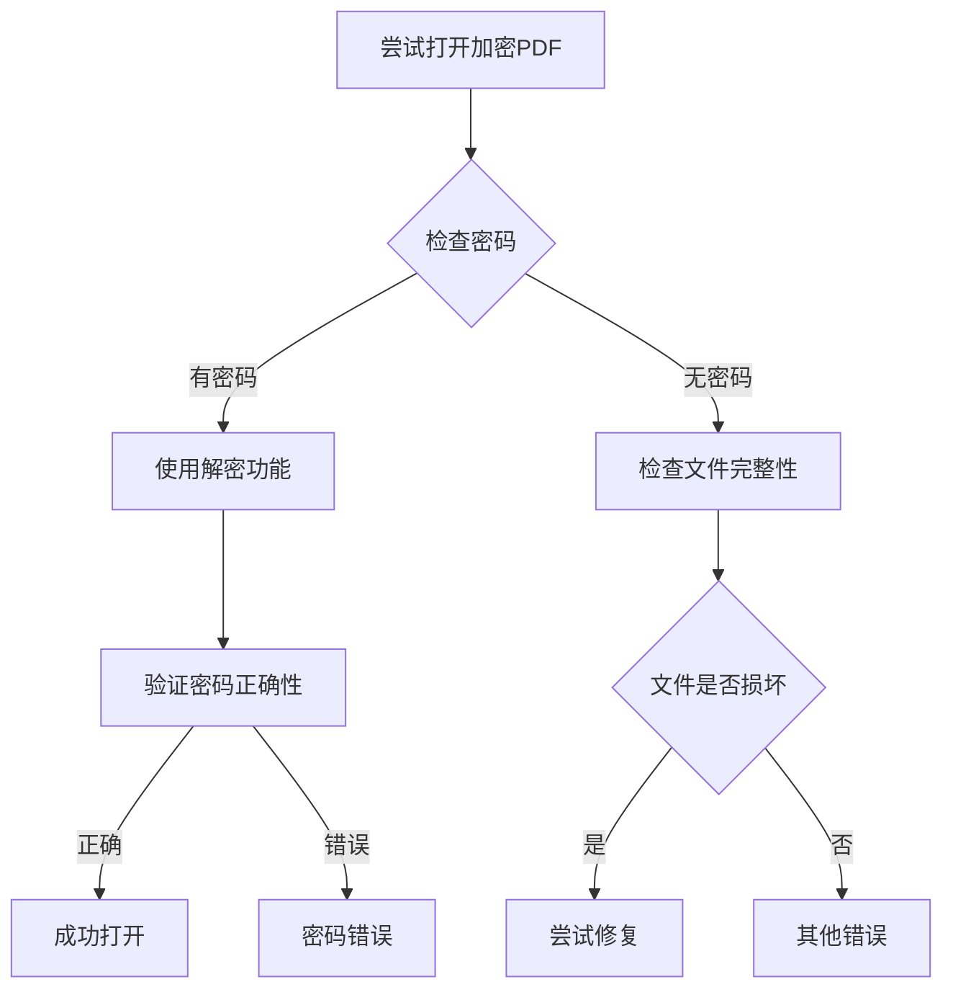

**图表来源**
- [ProtectHelper.cs](file://PdfHelperLibrary/ProtectHelper.cs#L45-L67)
- [RepairHelper.cs](file://PdfHelperLibrary2/RepairHelper.cs#L12-L36)

#### 2. 文件损坏或不完整
PDF文件可能在传输、存储或创建过程中损坏。

#### 3. 权限限制
文件可能设置了严格的权限控制，阻止了程序的正常访问。

### 解决方案

#### 步骤1：检查文件状态
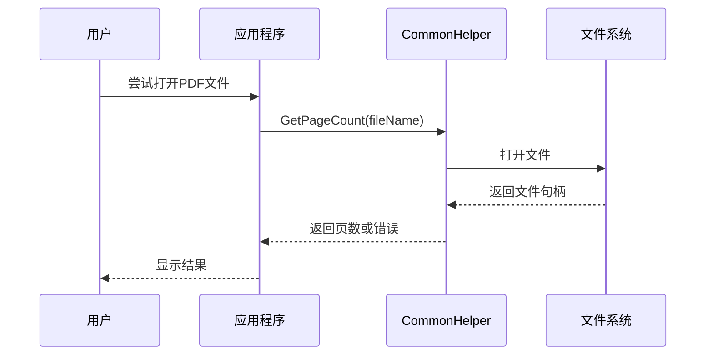

**图表来源**
- [CommonHelper.cs](file://PdfHelperLibrary/CommonHelper.cs#L11-L25)

#### 步骤2：尝试修复损坏文件
对于损坏的PDF文件，可以使用内置的修复功能：

1. **自动修复流程**：
   - 检测文件完整性
   - 尝试重建文件结构
   - 保存修复后的副本

2. **手动修复步骤**：
   - 使用Adobe Acrobat等专业软件打开
   - 导出为新的PDF格式
   - 重新导入到工具库

#### 步骤3：处理加密文件
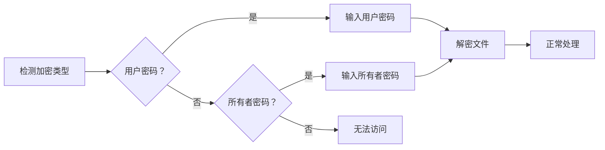

**图表来源**
- [ProtectHelper.cs](file://PdfHelperLibrary/ProtectHelper.cs#L45-L67)

### 预防措施

1. **定期备份重要文件**
2. **使用可靠的PDF创建工具**
3. **避免在网络传输中损坏文件**
4. **设置适当的文件权限**

**章节来源**
- [CommonHelper.cs](file://PdfHelperLibrary/CommonHelper.cs#L11-L25)
- [ProtectHelper.cs](file://PdfHelperLibrary/ProtectHelper.cs#L12-L67)
- [RepairHelper.cs](file://PdfHelperLibrary2/RepairHelper.cs#L12-L36)

## 表格提取结果错乱

### 问题描述

用户发现从PDF中提取的表格数据出现错位、缺失或格式混乱的情况，特别是在处理复杂布局的表格时。

### 根本原因分析

#### 1. Tabula算法限制
当前表格提取使用的是Tabula库的SpreadsheetExtractionAlgorithm，该算法存在以下局限性：

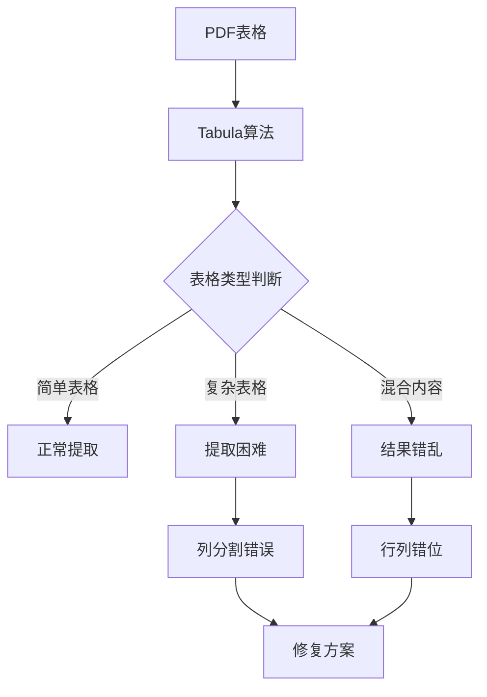

**图表来源**
- [TableExtractHelper.cs](file://PdfHelperLibrary/TableExtractHelper.cs#L51-L70)

#### 2. PDF内部结构复杂性
现代PDF文件可能包含：
- 合并单元格
- 不规则边框
- 文本旋转
- 图形元素干扰

#### 3. 字体和编码问题
不同字体和编码方式可能导致文本识别错误。

### 解决方案

#### 方案1：尝试多种提取模式
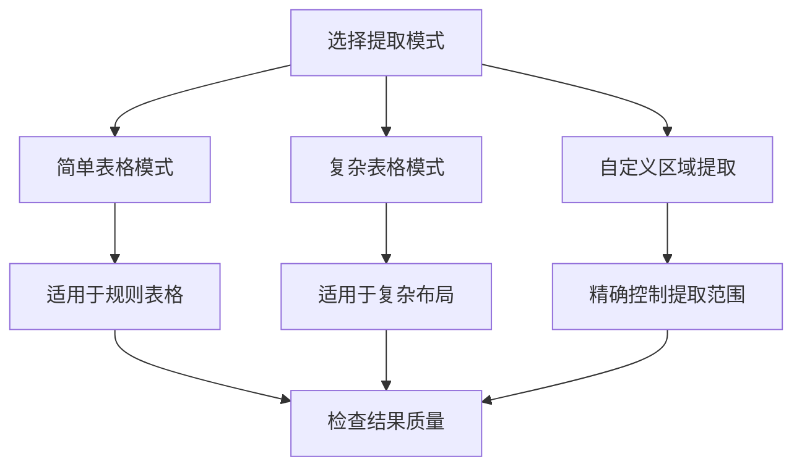

#### 方案2：预处理PDF文件
1. **转换为更友好的格式**：
   - 使用OCR识别扫描件
   - 转换为Word格式再提取

2. **清理PDF内容**：
   - 移除不必要的图形元素
   - 规范化字体和样式

#### 方案3：手动调整提取参数
- 调整表格边界检测阈值
- 自定义列分割规则
- 手动标记合并单元格

### 高级修复技术

对于特别复杂的表格，可以考虑以下方法：

1. **分页提取**：将大表格拆分为多个小表格分别提取
2. **多算法对比**：同时使用多种提取算法，对比结果后人工修正
3. **机器学习辅助**：训练模型识别特定类型的表格布局

**章节来源**
- [TableExtractHelper.cs](file://PdfHelperLibrary/TableExtractHelper.cs#L51-L105)
- [PdfTableExtracter.cs](file://PdfTool/PdfTableExtracter.cs#L60-L85)

## 图片提取为空

### 问题描述

用户发现PDF中的图片无法被提取出来，或者提取出来的图片数量与预期不符。

### 根本原因分析

#### 1. 图像嵌入方式特殊
PDF中的图像可能采用特殊的编码方式：

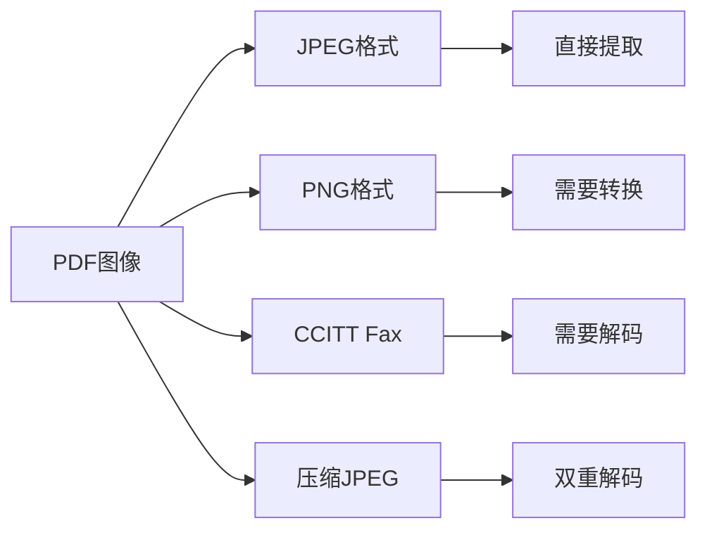

**图表来源**
- [ImageExtractHelper.cs](file://PdfHelperLibrary/ImageExtractHelper.cs#L89-L104)

#### 2. 图像过滤器不支持
不同的PDF创建工具使用不同的图像压缩算法，部分算法可能不被当前实现支持。

#### 3. 资源引用问题
PDF中的图像可能作为外部对象引用，而不是直接嵌入。

### 解决方案

#### 方案1：识别和处理不同格式
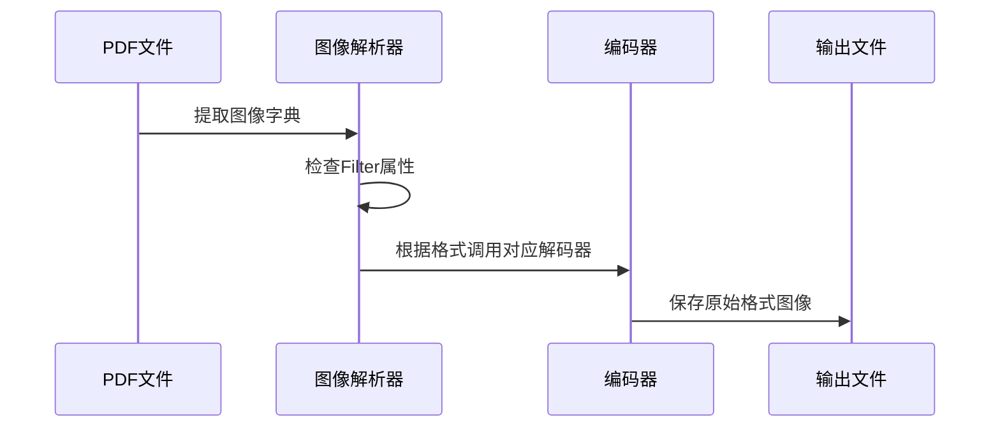

**图表来源**
- [ImageExtractHelper.cs](file://PdfHelperLibrary/ImageExtractHelper.cs#L89-L104)

#### 方案2：批量处理不同格式
1. **JPEG图像**：直接写入流即可
2. **PNG图像**：需要转换为Windows位图格式
3. **CCITT Fax**：使用GDI+处理二值图像
4. **压缩JPEG**：先解压再保存

#### 方案3：增强错误处理
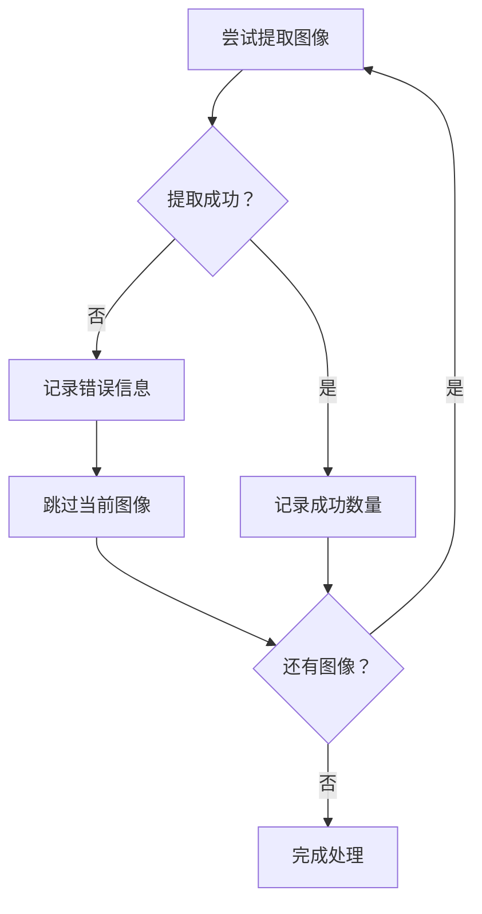

### 预防和优化

1. **格式兼容性测试**：建立不同PDF创建工具的兼容性列表
2. **渐进式支持**：逐步增加对新格式的支持
3. **用户反馈机制**：收集无法提取的图像格式案例

**章节来源**
- [ImageExtractHelper.cs](file://PdfHelperLibrary/ImageExtractHelper.cs#L17-L181)
- [PdfImageExtracter.cs](file://PdfTool/PdfImageExtracter.cs#L58-L64)

## 合并后文件异常增大

### 问题描述

用户发现将多个PDF文件合并后，输出文件的大小明显大于各个输入文件大小之和。

### 根本原因分析

#### 1. 缺少压缩处理
默认情况下，PDF合并操作不会对内容流进行压缩。

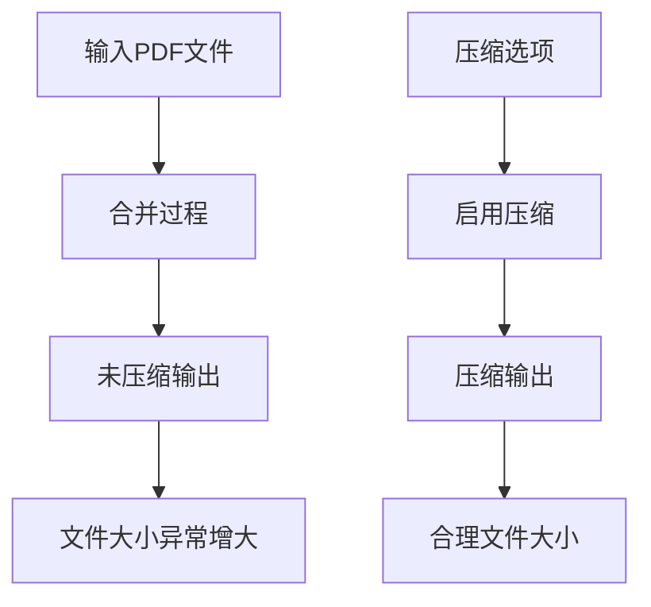

**图表来源**
- [CompressHelper.cs](file://PdfHelperLibrary/CompressHelper.cs#L15-L30)

#### 2. 重复资源保留
合并过程中可能保留了重复的字体、图像等资源。

#### 3. 高质量设置
某些PDF可能包含高分辨率图像或矢量图形，导致文件体积增大。

### 解决方案

#### 方案1：启用自动压缩
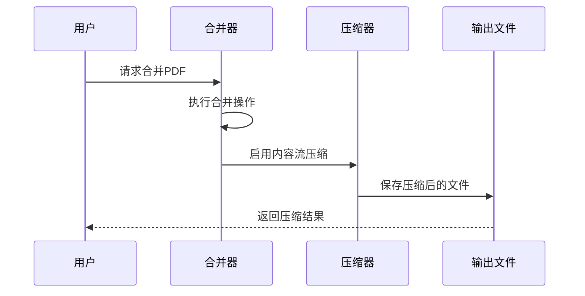

**图表来源**
- [CompressHelper.cs](file://PdfHelperLibrary/CompressHelper.cs#L15-L30)

#### 方案2：优化合并策略
1. **去重处理**：移除重复的资源引用
2. **质量调整**：根据用途调整图像质量
3. **增量合并**：支持增量添加页面

#### 方案3：手动压缩流程
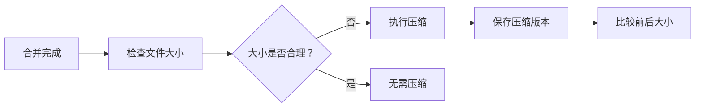

### 性能优化建议

1. **分批处理**：对于大量文件，分批次进行合并
2. **内存管理**：及时释放不再需要的PDF对象
3. **异步处理**：使用后台线程进行压缩操作

**章节来源**
- [CompressHelper.cs](file://PdfHelperLibrary/CompressHelper.cs#L15-L30)
- [PdfCompressor.cs](file://PdfTool/PdfCompressor.cs#L60-L72)

## 性能优化建议

### 大文件处理策略

当处理超大PDF文件时，需要采取特殊的策略来确保程序稳定运行：

#### 1. 分块处理策略
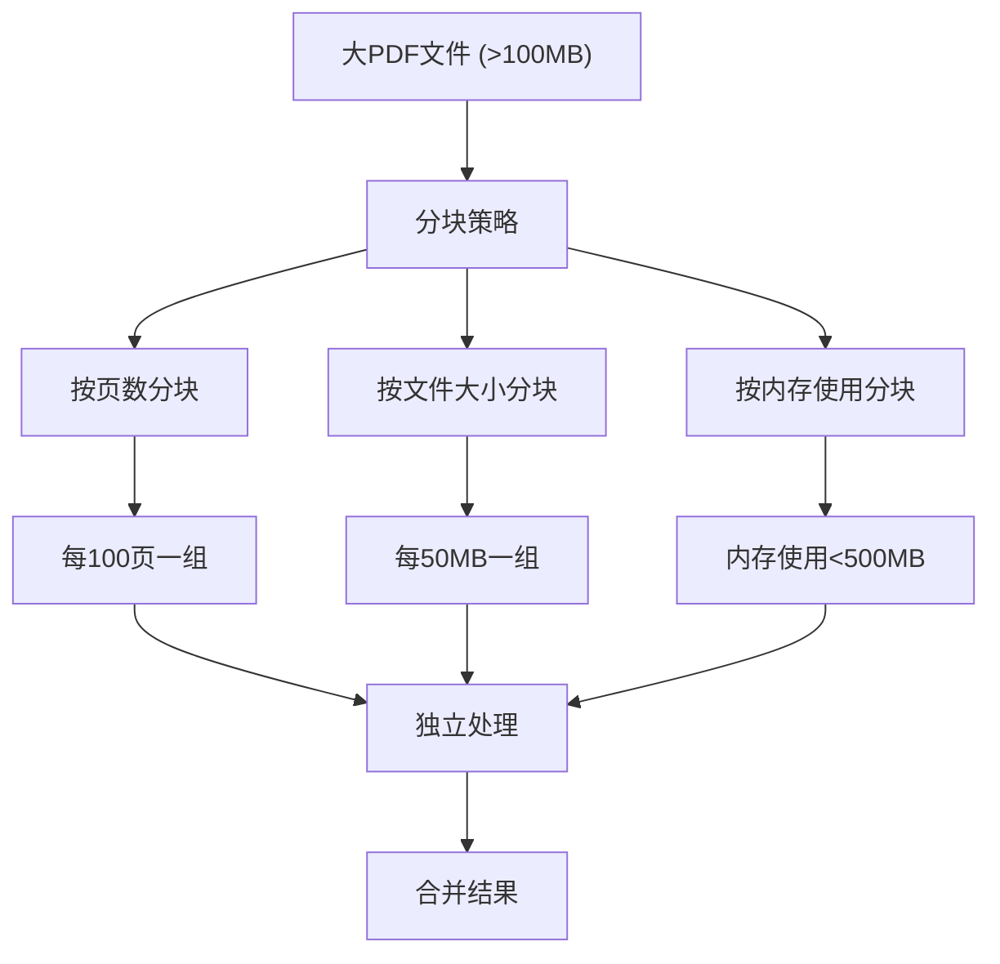

#### 2. 内存管理最佳实践
- 及时释放PDF文档对象
- 使用using语句确保资源释放
- 避免同时加载过多文件

#### 3. 并发处理优化
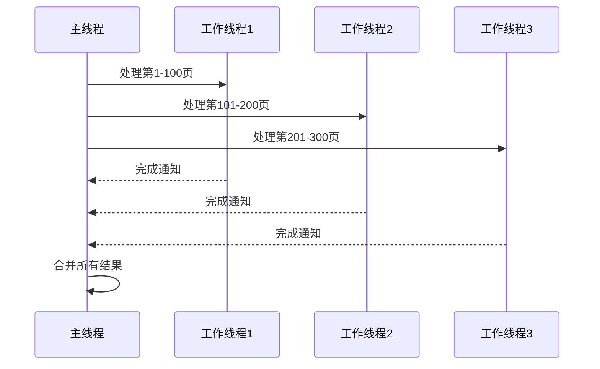

### 性能监控指标

| 指标 | 正常范围 | 警告阈值 | 优化建议 |
|------|---------|---------|---------|
| 内存使用率 | <80% | >90% | 减少并发数量 |
| 处理时间 | <1分钟/100页 | >5分钟/100页 | 优化算法 |
| CPU使用率 | <70% | >90% | 并行处理 |
| 磁盘I/O | <50MB/s | >100MB/s | 使用SSD |

### 缓存策略

1. **页面缓存**：缓存频繁访问的页面内容
2. **元数据缓存**：缓存文件结构信息
3. **结果缓存**：缓存计算结果避免重复处理

## 日志记录与调试

### 日志系统架构

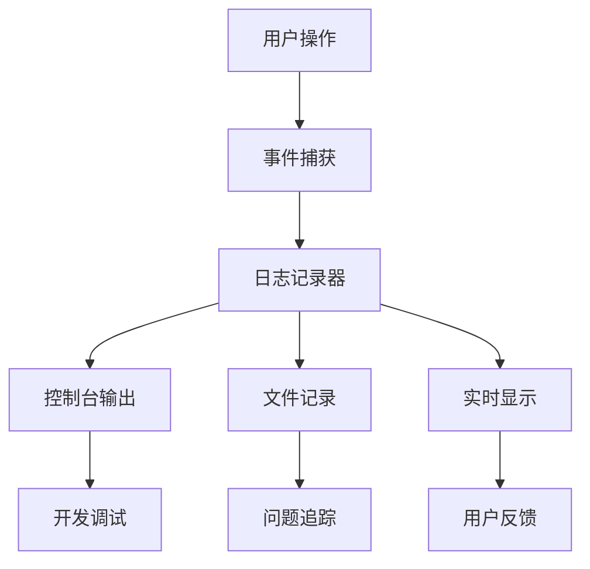

### 调试模式配置

#### 开发环境设置
- 启用详细错误信息
- 记录堆栈跟踪
- 输出中间处理结果

#### 生产环境配置
- 过滤敏感信息
- 控制日志级别
- 限制日志文件大小

### 常用调试技巧

1. **分步验证**：逐个验证每个处理步骤
2. **边界测试**：测试极端情况下的行为
3. **性能分析**：使用性能计数器监控瓶颈

**章节来源**
- [MainForm.cs](file://PdfTool/MainForm.cs#L165-L188)
- [PdfRepairer.cs](file://PdfTool/PdfRepairer.cs#L32-L70)

## 问题报告与样本文件

### 报告模板

当遇到无法解决的问题时，请提供以下信息：

#### 基本信息
- 软件版本：[版本号]
- 操作系统：[Windows版本]
- .NET版本：[框架版本]

#### 问题详情
- PDF文件特征：[文件大小、页数、创建工具]
- 操作步骤：[重现问题的具体步骤]
- 错误信息：[完整的错误消息]

#### 样本文件要求
为了更好地复现和解决问题，请提供：
1. **最小可重现样本**：问题最明显的PDF文件
2. **相关文件**：相关的配置文件或依赖项
3. **预期结果**：期望得到的正确输出

### 收集样本文件的最佳实践

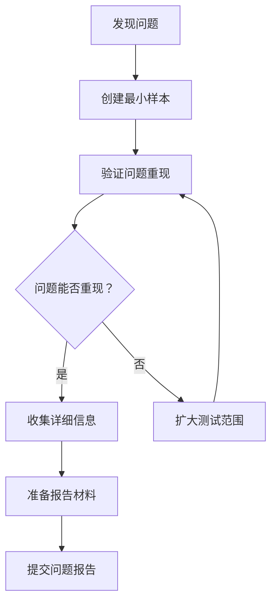

### 社区支持渠道

- **官方文档**：[使用说明链接](https://www.yuque.com/lengda/eq8cm6/fgfthhr3e53qkszl)
- **问题反馈**：[反馈链接](https://www.yuque.com/lengda/eq8cm6/ezwik4)
- **赞赏支持**：[赞赏链接](https://www.yuque.com/lengda/eq8cm6/rylia4)

## 总结

通过本文档提供的系统化故障排除方法，用户可以有效地识别和解决在使用PDF工具库过程中遇到的各种问题。主要要点包括：

1. **预防为主**：了解常见问题的根本原因，采取预防措施
2. **系统诊断**：按照文档提供的步骤逐一排查问题
3. **灵活应对**：根据具体情况选择最适合的解决方案
4. **持续改进**：通过反馈帮助完善工具的功能和稳定性

记住，大多数问题都可以通过正确的配置和适当的处理策略来解决。如果遇到文档中未涵盖的问题，请及时提供详细的样本文件和问题描述，以便我们能够更好地帮助您解决问题。