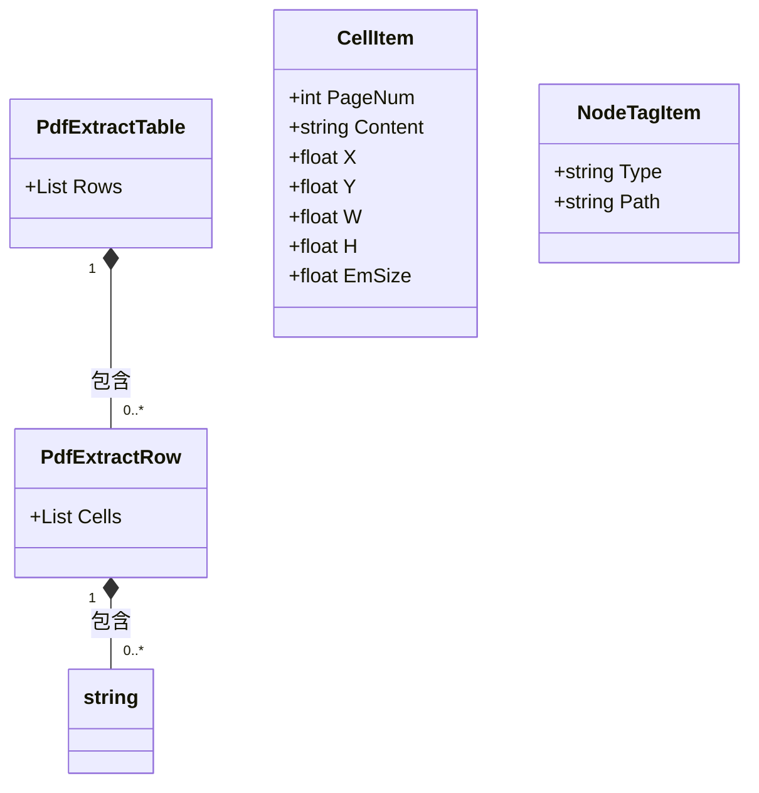

# 数据模型与实体

<cite>
**本文档引用的文件**   
- [TableExtractHelper.cs](file://PdfHelperLibrary/TableExtractHelper.cs)
- [NodeTagItem.cs](file://PdfEditor/Entities/NodeTagItem.cs)
- [CellItem.cs](file://PdfDesignHelper/CellItem.cs)
- [DataViewer.cs](file://ExcelTool/Modules/DataViewer.cs)
- [MainForm.cs](file://PdfDesignHelper/MainForm.cs)
</cite>

## 目录
1. [引言](#引言)
2. [核心数据模型](#核心数据模型)
3. [表格提取模型](#表格提取模型)
4. [页面元素定位模型](#页面元素定位模型)
5. [元数据容器模型](#元数据容器模型)
6. [UI数据绑定](#ui数据绑定)
7. [JSON序列化示例](#json序列化示例)
8. [设计考量](#设计考量)
9. [类图](#类图)

## 引言
本文档深入解析PDF工具项目中的关键数据结构定义，重点关注表格提取相关的域模型。文档详细描述了PdfExtractTable、PdfExtractRow等核心实体及其字段含义，分析这些模型如何从PDF底层内容流中构建，以及在UI层中的绑定方式。同时，文档还探讨了NodeTagItem在PdfEditor中的作用，以及为何采用平面坐标系来定位文本元素的设计决策。

## 核心数据模型
项目中的核心数据模型围绕PDF内容提取和页面元素操作构建。主要包含三类模型：表格提取模型用于解析PDF中的表格数据，页面元素定位模型用于精确描述文本和图形元素的位置，以及元数据容器模型用于存储页面元素的附加信息。

**Section sources**
- [TableExtractHelper.cs](file://PdfHelperLibrary/TableExtractHelper.cs#L75-L105)
- [CellItem.cs](file://PdfDesignHelper/CellItem.cs#L5-L26)
- [NodeTagItem.cs](file://PdfEditor/Entities/NodeTagItem.cs#L3-L10)

## 表格提取模型
表格提取模型是项目中用于解析PDF文档表格结构的核心数据结构。该模型通过第三方库Tabula和UglyToad.PdfPig实现，能够准确识别PDF中的表格边界和单元格内容。

### PdfExtractTable 类
PdfExtractTable类代表一个完整的PDF表格，包含表格的所有行数据。该类是表格提取的顶层容器，通过Rows属性组织表格的层次结构。

**字段说明**
- `Rows`: List<PdfExtractRow>类型，存储表格的所有行对象，按从上到下的顺序排列

### PdfExtractRow 类
PdfExtractRow类代表表格中的一行，包含该行所有单元格的文本内容。该类作为表格和单元格之间的中间层，实现了表格数据的层次化组织。

**字段说明**
- `Cells`: List<string>类型，存储该行所有单元格的文本内容，按从左到右的顺序排列

这些模型通过TableExtractHelper类中的ExtractTable方法从PDF文档中提取。提取过程首先使用ObjectExtractor从PDF页面中提取内容区域，然后通过SpreadsheetExtractionAlgorithm算法识别表格结构，最后将识别结果映射到PdfExtractTable和PdfExtractRow对象中。

**Section sources**
- [TableExtractHelper.cs](file://PdfHelperLibrary/TableExtractHelper.cs#L75-L105)

## 页面元素定位模型
页面元素定位模型用于精确描述PDF文档中各种元素（如文本、图形）的位置和尺寸信息。该模型采用平面坐标系来定位元素，确保能够准确还原PDF的视觉布局。

### CellItem 类
CellItem类是页面元素定位的核心数据结构，用于描述单个页面元素的完整信息，包括其位置、尺寸和内容。

**字段说明**
- `PageNum`: int类型，表示元素所在的页码，从0开始计数
- `Content`: string类型，表示元素的文本内容
- `X`: float类型，表示元素左上角的X坐标（水平位置）
- `Y`: float类型，表示元素左上角的Y坐标（垂直位置）
- `W`: float类型，表示元素的宽度
- `H`: float类型，表示元素的高度
- `EmSize`: float类型，表示文本的字号大小

该模型在PdfDesignHelper项目中被广泛使用，通过图形界面控件CellControl进行可视化编辑。用户可以通过数值输入框精确调整每个元素的属性值。

**Section sources**
- [CellItem.cs](file://PdfDesignHelper/CellItem.cs#L5-L26)
- [MainForm.cs](file://PdfDesignHelper/MainForm.cs#L68-L79)

## 元数据容器模型
元数据容器模型用于存储PDF文档中页面元素的附加信息或标记，为文档处理提供额外的上下文数据。

### NodeTagItem 类
NodeTagItem类是PdfEditor中的元数据容器，用于标记页面元素的类型和路径信息。该类作为轻量级的数据容器，不包含复杂的业务逻辑，仅用于存储和传递基本信息。

**字段说明**
- `Type`: string类型，表示节点类型，可能的值包括"DIR"（目录）或"PDF"（PDF文件）
- `Path`: string类型，表示节点的文件系统路径

该模型在文件浏览器和文档管理功能中发挥重要作用，帮助区分不同类型的文档节点，并提供快速访问路径。

**Section sources**
- [NodeTagItem.cs](file://PdfEditor/Entities/NodeTagItem.cs#L3-L10)

## UI数据绑定
数据模型在UI层的绑定方式体现了MVC（Model-View-Controller）设计模式的应用。不同的数据模型通过特定的UI组件进行展示和编辑，实现了数据与界面的分离。

### DataViewer 组件
DataViewer组件是ExcelTool模块中的数据预览器，负责展示从Excel或PDF提取的表格数据。该组件通过DataGridView控件实现数据的可视化展示。

**绑定机制**
- 使用ComboBox控件(_cmbSheets)选择工作表
- 使用DataGridView控件(_dataGridView)展示选中工作表的数据
- 数据源通过ReadExcelToDataTable方法从文件读取，并存储在_sheetsTables字典中
- 当用户选择不同的工作表时，通过CmbSheets_SelectedIndexChanged事件处理程序更新DataGridView的数据源

这种绑定方式实现了数据的动态加载和切换，用户可以方便地浏览多个工作表的内容。

**Section sources**
- [DataViewer.cs](file://ExcelTool/Modules/DataViewer.cs#L13-L120)

## JSON序列化示例
为了便于理解数据格式和进行系统间的数据交换，以下是核心数据模型的JSON序列化示例。

### PdfExtractTable JSON 示例
```json
{
  "Rows": [
    {
      "Cells": ["姓名", "年龄", "城市"]
    },
    {
      "Cells": ["张三", "25", "北京"]
    },
    {
      "Cells": ["李四", "30", "上海"]
    }
  ]
}
```

### CellItem JSON 示例
```json
{
  "PageNum": 0,
  "Content": "示例文本",
  "X": 100.5,
  "Y": 200.3,
  "W": 150.0,
  "H": 30.0,
  "EmSize": 12.0
}
```

### NodeTagItem JSON 示例
```json
{
  "Type": "PDF",
  "Path": "C:\\Documents\\example.pdf"
}
```

这些JSON示例展示了数据模型在序列化后的实际格式，有助于开发者理解数据结构和进行API设计。

## 设计考量
数据模型的设计体现了多个重要的技术决策和架构考量。

### 平面坐标系的选择
采用平面坐标系(X, Y, Width, Height)来定位文本元素是PDF处理领域的标准做法。这种设计选择基于以下原因：
1. **精确性**: PDF文档本质上是基于矢量的页面描述，使用坐标系可以精确还原元素的位置和尺寸
2. **兼容性**: 与PDF规范中的页面坐标系保持一致，便于与底层PDF处理库交互
3. **灵活性**: 支持非结构化布局的文档，能够处理复杂的页面设计
4. **可计算性**: 坐标值支持数学运算，便于实现元素对齐、间距计算等高级功能

### 分层数据结构
表格模型采用分层结构（PdfExtractTable → PdfExtractRow → Cells），这种设计具有以下优势：
1. **清晰的层次关系**: 明确表达了表格、行、单元格之间的包含关系
2. **易于遍历**: 支持按行或按列的顺序遍历，便于数据处理
3. **扩展性**: 可以在不同层次添加元数据，如行高、列宽等属性
4. **序列化友好**: 层次结构天然适合JSON等树形数据格式

### 轻量级元数据容器
NodeTagItem类的设计体现了关注点分离的原则，仅包含最基本的类型和路径信息，避免了过度设计。这种轻量级容器便于在不同组件间传递，同时降低了耦合度。

## 类图
以下类图展示了项目中核心数据模型之间的关系。



**Diagram sources**
- [TableExtractHelper.cs](file://PdfHelperLibrary/TableExtractHelper.cs#L75-L105)
- [CellItem.cs](file://PdfDesignHelper/CellItem.cs#L5-L26)
- [NodeTagItem.cs](file://PdfEditor/Entities/NodeTagItem.cs#L3-L10)