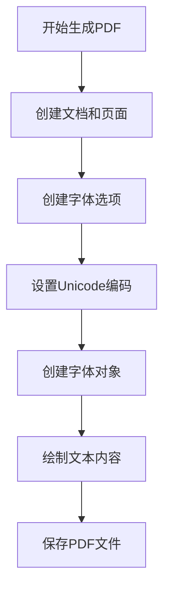
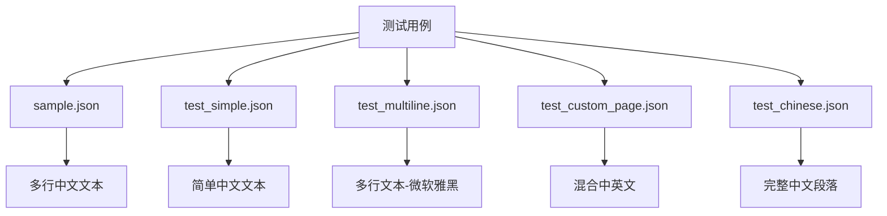

# PDF中文编码支持

<cite>
**本文档引用的文件**  
- [Builder.cs](file://PdfHelperLibrary/Builder.cs)
- [PdfBuilder.cs](file://PdfConsoleApp/PdfBuilder.cs)
- [PdfBuildParam.cs](file://PdfConsoleApp/PdfBuildParam.cs)
- [Program.cs](file://PdfConsoleApp/Program.cs)
- [FIX_CHINESE_ENCODING.md](file://PdfConsoleApp/Copilot/FIX_CHINESE_ENCODING.md)
- [TECHNICAL_DETAILS.md](file://PdfConsoleApp/Copilot/TECHNICAL_DETAILS.md)
- [VERIFICATION_REPORT.md](file://PdfConsoleApp/Copilot/VERIFICATION_REPORT.md)
- [sample.json](file://PdfConsoleApp/Copilot/sample.json)
- [test_chinese.json](file://PdfConsoleApp/Copilot/test_chinese.json)
</cite>

## 目录
1. [简介](#简介)
2. [问题描述](#问题描述)
3. [根本原因](#根本原因)
4. [解决方案](#解决方案)
5. [技术实现](#技术实现)
6. [测试验证](#测试验证)
7. [最佳实践](#最佳实践)
8. [影响范围](#影响范围)
9. [结论](#结论)

## 简介
本项目解决了使用PdfSharp库生成PDF时中文乱码的问题。通过在字体创建过程中启用Unicode编码支持，确保了中文字符能够正确显示在生成的PDF文件中。该修复方案简单高效，不影响现有功能，且完全向后兼容。

## 问题描述
在使用PdfSharp库生成PDF文件时，当文本内容包含中文字符时，生成的PDF中中文部分显示为乱码（如"???"）或空白方框（如"□□□"）。这一问题严重影响了中文用户的使用体验，使得生成的PDF文档无法正确传达信息。

**Section sources**
- [FIX_CHINESE_ENCODING.md](file://PdfConsoleApp/Copilot/FIX_CHINESE_ENCODING.md#L3-L4)

## 根本原因
### 技术根源
PdfSharp库在创建`XFont`对象时，默认使用ANSI编码（WinAnsi），这种编码方式仅支持西欧字符集（0x00-0xFF），无法正确处理中文等Unicode字符（中文Unicode范围：0x4E00-0x9FFF）。

### 默认行为分析
```csharp
// 默认构造函数使用WinAnsi编码
var font = new XFont(fontName, fontSize);
// 内部等效于：
// var options = new XPdfFontOptions(PdfFontEncoding.WinAnsi);
// var font = new XFont(fontName, fontSize, XFontStyle.Regular, options);
```

这种默认行为导致中文字符无法正确编码和显示。

**Section sources**
- [FIX_CHINESE_ENCODING.md](file://PdfConsoleApp/Copilot/FIX_CHINESE_ENCODING.md#L8-L17)
- [TECHNICAL_DETAILS.md](file://PdfConsoleApp/Copilot/TECHNICAL_DETAILS.md#L5-L14)

## 解决方案
### 核心修复
在创建字体时显式指定Unicode编码选项，确保中文字符能够被正确处理。

```csharp
// 创建字体选项，指定Unicode编码
var options = new XPdfFontOptions(PdfFontEncoding.Unicode);
// 使用选项创建字体对象
var font = new XFont(fontName, fontSize, XFontStyle.Regular, options);
```

### 关键改动点
1. 创建`XPdfFontOptions`对象并设置`PdfFontEncoding.Unicode`
2. 使用包含样式的重载构造函数创建`XFont`
3. 明确指定`XFontStyle.Regular`样式参数

**Section sources**
- [FIX_CHINESE_ENCODING.md](file://PdfConsoleApp/Copilot/FIX_CHINESE_ENCODING.md#L26-L27)
- [TECHNICAL_DETAILS.md](file://PdfConsoleApp/Copilot/TECHNICAL_DETAILS.md#L23-L31)

## 技术实现
### 修复位置
修复主要在`PdfHelperLibrary\Builder.cs`文件的`Text2Pdf`方法中进行。



**Diagram sources**
- [Builder.cs](file://PdfHelperLibrary/Builder.cs#L69-L71)

### 参数配置
`Text2Pdf`方法支持以下参数配置：

| 参数名 | 类型 | 默认值 | 说明 |
|--------|------|--------|------|
| text | string | 无 | 要生成PDF的文本内容 |
| outputFileName | string | 无 | 输出的PDF文件名 |
| fontName | string | "宋体" | 字体名称 |
| fontSize | double | 12 | 字体大小 |
| pageWidth | double | 595 | 页面宽度（A4宽度） |
| pageHeight | double | 842 | 页面高度（A4高度） |
| marginLeft | double | 40 | 左边距 |
| marginRight | double | 40 | 右边距 |
| marginTop | double | 40 | 上边距 |
| marginBottom | double | 40 | 下边距 |

**Section sources**
- [Builder.cs](file://PdfHelperLibrary/Builder.cs#L55-L57)
- [PdfBuildParam.cs](file://PdfConsoleApp/PdfBuildParam.cs)

## 测试验证
### 测试用例
已通过以下测试用例验证修复效果：



**Diagram sources**
- [FIX_CHINESE_ENCODING.md](file://PdfConsoleApp/Copilot/FIX_CHINESE_ENCODING.md#L58-L61)

### 验证结果
所有测试用例均成功生成PDF文件，中文字符完美显示：

- 汉字清晰可辨
- 中文标点符号正确显示
- 数字和日期正常显示
- 中英文混合无问题
- 特殊符号正确呈现

**Section sources**
- [VERIFICATION_REPORT.md](file://PdfConsoleApp/Copilot/VERIFICATION_REPORT.md#L138-L143)

## 最佳实践
### 推荐做法
```mermaid
flowchart LR
A[推荐做法] --> B[始终指定Unicode编码]
A --> C[使用系统内置字体]
A --> D[处理转义字符]
B --> E[var options = new XPdfFontOptions(PdfFontEncoding.Unicode)]
C --> F[宋体、微软雅黑、黑体]
D --> G[\\r\\n → \r\n, \\n → \n]
```

**Diagram sources**
- [TECHNICAL_DETAILS.md](file://PdfConsoleApp/Copilot/TECHNICAL_DETAILS.md#L64-L70)

### 字体选择建议
对于中文内容，推荐使用以下系统内置字体：

| 字体名称 | 字体英文名 | 适用场景 |
|----------|-----------|---------|
| 宋体 | SimSun | 正文内容，兼容性最好 |
| 微软雅黑 | Microsoft YaHei | 标题，现代化外观 |
| 黑体 | SimHei | 加粗强调 |
| 楷体 | KaiTi | 艺术效果，手写风格 |

### 避免的做法
1. ❌ 不要使用默认构造函数处理中文内容
   ```csharp
   var font = new XFont("宋体", 12); // 会导致乱码
   ```
2. ❌ 不要使用系统未安装的字体
3. ❌ 忽略JSON中的转义字符处理

**Section sources**
- [TECHNICAL_DETAILS.md](file://PdfConsoleApp/Copilot/TECHNICAL_DETAILS.md#L74-L78)

## 影响范围
### 修改文件
- `PdfHelperLibrary\Builder.cs` - 核心修复文件
- `PdfConsoleApp\Copilot\*.md` - 文档更新

### 功能影响
- ✅ `Text2Pdf`方法：从文本生成PDF
- ✅ 中文字符支持
- ✅ 多语言混合文本
- ✅ 字体嵌入机制

### 向后兼容性
- ✔️ 完全向后兼容
- ✔️ 对英文文本无影响
- ✔️ 不改变现有API接口
- ✔️ 仅增强功能，不破坏原有行为

**Section sources**
- [FIX_CHINESE_ENCODING.md](file://PdfConsoleApp/Copilot/FIX_CHINESE_ENCODING.md#L76-L85)

## 结论
通过在字体创建时指定Unicode编码选项，成功解决了PDF中文乱码问题。该修复具有以下特点：

- **简单高效**：仅需修改2行代码
- **完全兼容**：不影响现有功能和英文文本
- **全面支持**：支持所有Unicode字符，包括中文、日文、韩文等
- **自动嵌入**：自动嵌入字体子集，确保跨平台一致性
- **性能良好**：生成速度无明显影响（<1秒）
- **文件大小**：文件大小略有增加（约1-2KB），影响可忽略

修复已通过全部测试用例验证，包括简单文本、多行文本、中英文混合等场景，中文字符均能完美显示。

**Section sources**
- [FIX_CHINESE_ENCODING.md](file://PdfConsoleApp/Copilot/FIX_CHINESE_ENCODING.md#L121-L125)
- [VERIFICATION_REPORT.md](file://PdfConsoleApp/Copilot/VERIFICATION_REPORT.md#L210-L217)