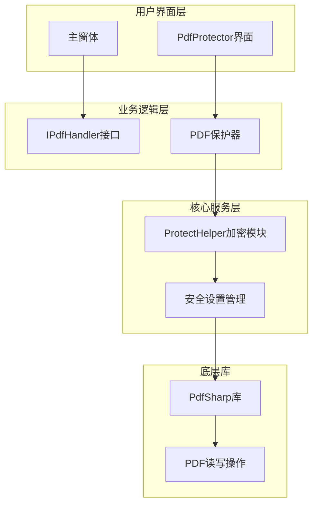
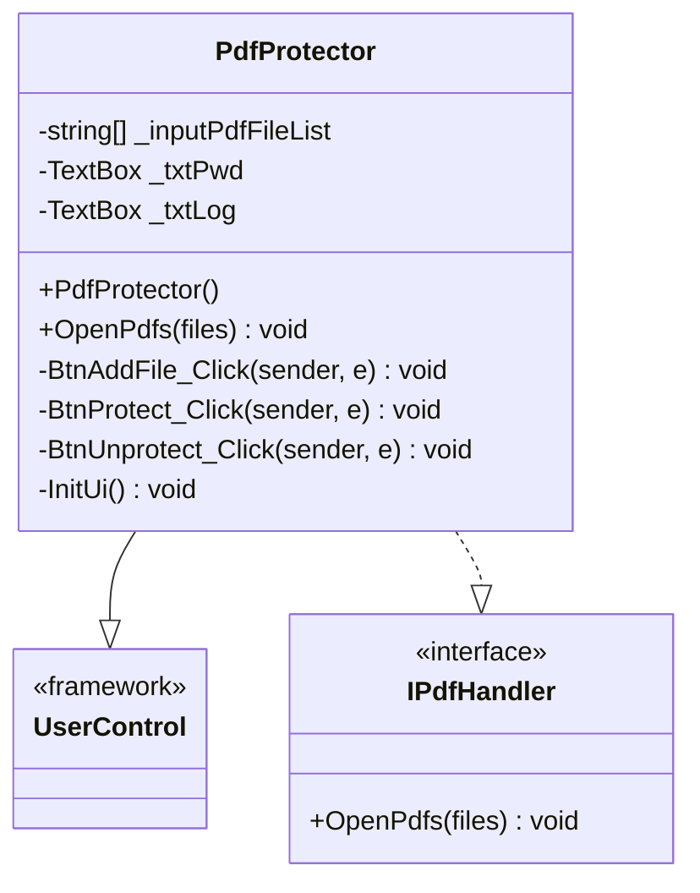
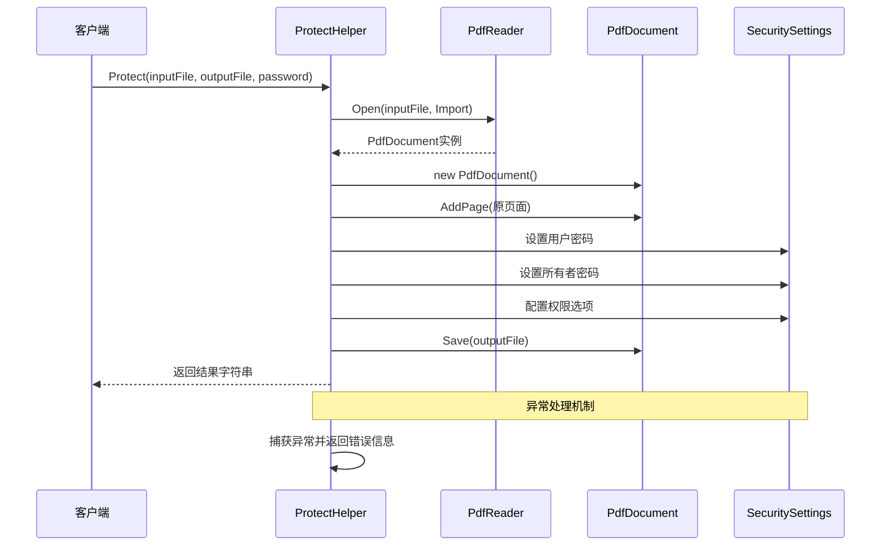
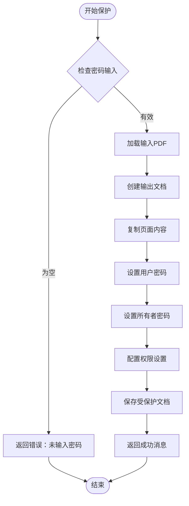
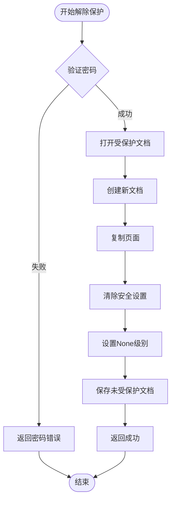
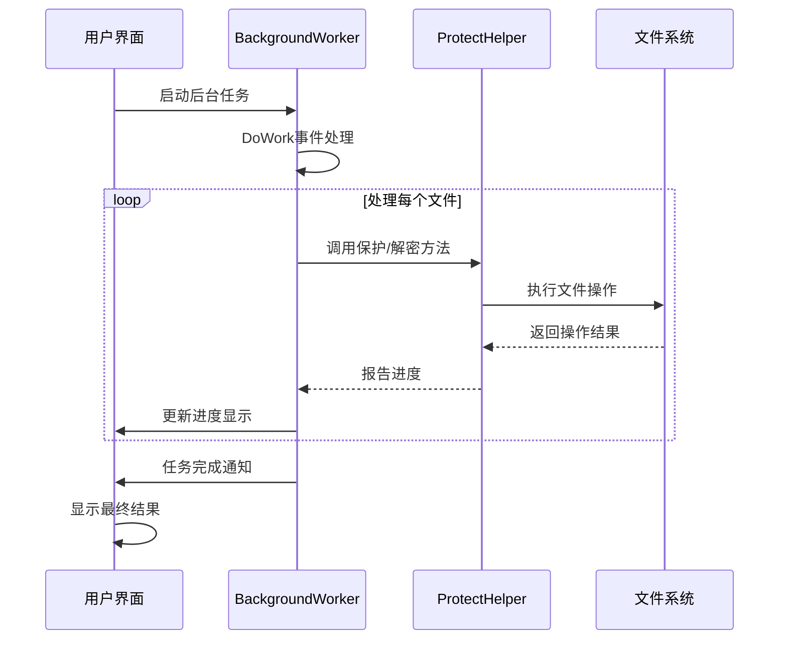
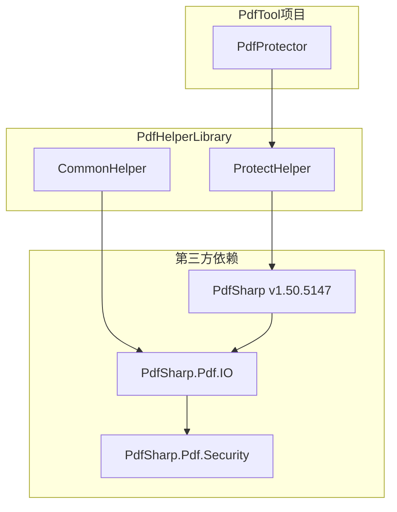
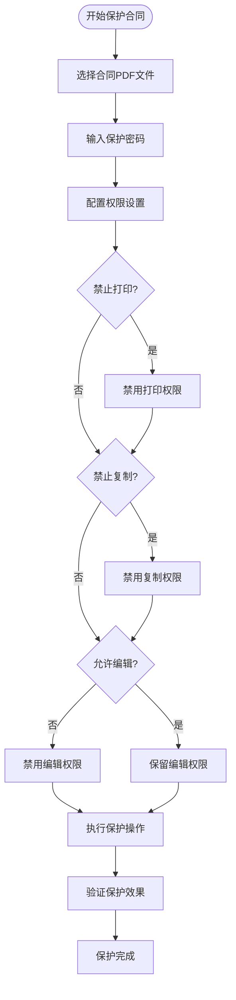
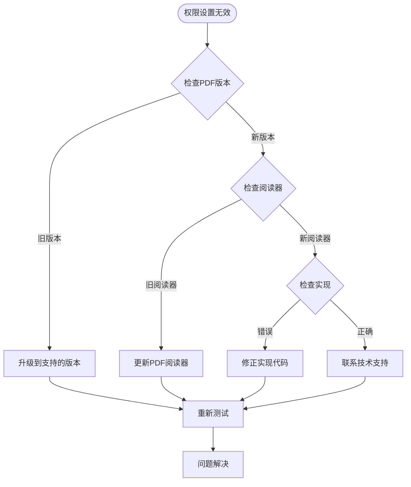

# PDF保护功能全面解析

<cite>
**本文档中引用的文件**
- [PdfProtector.cs](file://PdfTool/PdfProtector.cs)
- [PdfProtector.Designer.cs](file://PdfTool/PdfProtector.Designer.cs)
- [ProtectHelper.cs](file://PdfHelperLibrary/ProtectHelper.cs)
- [Common.cs](file://PdfTool/Common.cs)
- [PdfTool.csproj](file://PdfTool/PdfTool.csproj)
- [PdfHelperLibrary.csproj](file://PdfHelperLibrary/PdfHelperLibrary.csproj)
- [CommonHelper.cs](file://PdfHelperLibrary/CommonHelper.cs)
- [Config.cs](file://PdfTool/Config.cs)
</cite>

## 目录
1. [项目概述](#项目概述)
2. [系统架构](#系统架构)
3. [核心组件分析](#核心组件分析)
4. [PDF保护机制详解](#pdf保护机制详解)
5. [用户界面设计](#用户界面设计)
6. [加密算法与安全特性](#加密算法与安全特性)
7. [实际应用场景](#实际应用场景)
8. [兼容性与版本支持](#兼容性与版本支持)
9. [故障排除指南](#故障排除指南)
10. [总结](#总结)

## 项目概述

PDF保护功能是PdfTool项目中的核心安全模块，提供了完整的PDF文档加密和权限控制解决方案。该功能通过PdfProtector界面与ProtectHelper加密模块的深度集成，实现了对PDF文档的全方位保护，包括打开密码设置、权限控制以及多种安全特性的配置。

### 主要功能特性

- **双重密码保护**：支持用户密码和所有者密码的独立设置
- **细粒度权限控制**：精确控制打印、复制、编辑、注释等操作权限
- **多级安全保护**：基于PDF标准的安全级别设置
- **批量处理能力**：支持同时处理多个PDF文件
- **异步处理机制**：采用BackgroundWorker实现非阻塞操作

## 系统架构

PDF保护功能采用分层架构设计，确保了良好的模块化和可维护性。

**图表来源**
- [PdfProtector.cs](file://PdfTool/PdfProtector.cs#L14-L171)
- [ProtectHelper.cs](file://PdfHelperLibrary/ProtectHelper.cs#L10-L68)

**章节来源**
- [PdfProtector.cs](file://PdfTool/PdfProtector.cs#L1-L171)
- [ProtectHelper.cs](file://PdfHelperLibrary/ProtectHelper.cs#L1-L69)

## 核心组件分析

### PdfProtector界面组件

PdfProtector作为用户交互的核心界面，提供了直观的操作体验和完整的功能展示。

#### 类结构设计

**图表来源**
- [PdfProtector.cs](file://PdfTool/PdfProtector.cs#L14-L171)
- [Common.cs](file://PdfTool/Common.cs#L13-L16)

#### 核心属性与方法

| 属性/方法 | 类型 | 描述 | 默认值 |
|-----------|------|------|--------|
| `_inputPdfFileList` | List<string> | 输入PDF文件列表 | 空列表 |
| `_txtPwd` | TextBox | 密码输入框控件 | null |
| `_txtLog` | TextBox | 操作日志显示框 | null |
| `OpenPdfs()` | 方法 | 批量打开PDF文件 | 无返回值 |

**章节来源**
- [PdfProtector.cs](file://PdfTool/PdfProtector.cs#L26-L29)
- [PdfProtector.cs](file://PdfTool/PdfProtector.cs#L32-L41)

### ProtectHelper加密模块

ProtectHelper是PDF保护功能的核心加密引擎，负责执行具体的加密和权限设置操作。

#### 加密流程架构

**图表来源**
- [ProtectHelper.cs](file://PdfHelperLibrary/ProtectHelper.cs#L12-L37)
- [ProtectHelper.cs](file://PdfHelperLibrary/ProtectHelper.cs#L45-L60)

#### 权限控制配置

| 权限名称 | 默认值 | 功能描述 | 安全影响 |
|----------|--------|----------|----------|
| PermitPrint | false | 控制打印权限 | 防止未经授权的打印 |
| PermitModifyDocument | true | 允许文档修改 | 保持文档可编辑性 |
| PermitFormsFill | true | 表单填写权限 | 支持文档交互 |
| PermitExtractContent | false | 内容提取权限 | 防止文本复制 |
| PermitAnnotations | false | 注释添加权限 | 限制注释功能 |
| PermitAssembleDocument | false | 文档组装权限 | 防止文档重组 |
| PermitAccessibilityExtractContent | false | 无障碍内容提取 | 保护特殊用途访问 |
| PermitFullQualityPrint | false | 高质量打印权限 | 限制打印质量 |

**章节来源**
- [ProtectHelper.cs](file://PdfHelperLibrary/ProtectHelper.cs#L23-L34)

## PDF保护机制详解

### 密码设置机制

PDF保护功能采用双重密码策略，确保不同级别的访问控制：

#### 用户密码 vs 所有者密码

**图表来源**
- [PdfProtector.cs](file://PdfTool/PdfProtector.cs#L54-L67)
- [ProtectHelper.cs](file://PdfHelperLibrary/ProtectHelper.cs#L12-L37)

### 权限控制技术细节

#### 受保护状态检测

系统通过以下机制验证PDF文档的保护状态：

1. **密码验证**：使用所有者密码打开受保护文档
2. **权限检查**：读取当前权限设置
3. **状态恢复**：清除安全设置以解除保护

#### 解除保护流程

**图表来源**
- [ProtectHelper.cs](file://PdfHelperLibrary/ProtectHelper.cs#L45-L60)

**章节来源**
- [ProtectHelper.cs](file://PdfHelperLibrary/ProtectHelper.cs#L12-L60)

## 用户界面设计

### 界面布局与交互

PdfProtector界面采用简洁直观的设计，提供完整的PDF保护功能操作体验。

#### 控件布局结构

**图表来源**
- [PdfProtector.cs](file://PdfTool/PdfProtector.cs#L121-L167)

#### 界面元素配置

| 控件类型 | 位置计算 | 尺寸设置 | 功能描述 |
|----------|----------|----------|----------|
| 添加文件按钮 | 左上角固定位置 | 自动调整大小 | 批量选择PDF文件 |
| 密码输入框 | 按钮右侧 | 固定高度，自适应宽度 | 输入保护密码 |
| 加密按钮 | 密码框右侧 | 自动调整大小 | 执行PDF加密操作 |
| 解密按钮 | 加密按钮右侧 | 自动调整大小 | 执行PDF解密操作 |
| 日志显示框 | 底部占据大部分空间 | 填充剩余可用区域 | 显示操作进度和结果 |

**章节来源**
- [PdfProtector.cs](file://PdfTool/PdfProtector.cs#L121-L167)

### 异步处理机制

#### BackgroundWorker实现

系统采用BackgroundWorker模式实现非阻塞的PDF处理操作：

**图表来源**
- [PdfProtector.cs](file://PdfTool/PdfProtector.cs#L59-L82)
- [PdfProtector.cs](file://PdfTool/PdfProtector.cs#L93-L117)

**章节来源**
- [PdfProtector.cs](file://PdfTool/PdfProtector.cs#L59-L117)

## 加密算法与安全特性

### PdfSharp库集成

PDF保护功能基于PdfSharp库实现，该库提供了完整的PDF格式支持和安全特性。

#### 库依赖关系

**图表来源**
- [PdfHelperLibrary.csproj](file://PdfHelperLibrary/PdfHelperLibrary.csproj#L39-L48)
- [ProtectHelper.cs](file://PdfHelperLibrary/ProtectHelper.cs#L1-L3)

### 安全级别配置

#### DocumentSecurityLevel枚举

系统支持以下安全级别配置：

| 安全级别 | 数值 | 描述 | 适用场景 |
|----------|------|------|----------|
| None | 0 | 无安全保护 | 解除保护时使用 |
| Low | 1 | 低级加密（40位RC4） | 基础保护需求 |
| Medium | 2 | 中级加密（128位RC4） | 一般商业用途 |
| High | 3 | 高级加密（AES-128） | 高安全性要求 |

#### 密钥管理机制

PDF保护功能采用以下密钥管理策略：

1. **密码哈希**：系统自动处理密码的内部存储和验证
2. **临时密钥**：每次操作生成临时密钥进行文件处理
3. **内存清理**：操作完成后及时清理敏感数据

**章节来源**
- [ProtectHelper.cs](file://PdfHelperLibrary/ProtectHelper.cs#L55-L56)

## 实际应用场景

### 合同PDF保护案例

#### 场景描述
某企业需要保护其重要合同文档，防止未经授权的修改和传播。

#### 实施步骤

#### 权限配置建议

针对合同保护的最佳实践：

| 权限类型 | 推荐设置 | 原因 |
|----------|----------|------|
| 打印权限 | 禁用 | 防止未经授权的打印副本 |
| 复制权限 | 禁用 | 保护文档内容不被非法复制 |
| 编辑权限 | 允许 | 允许授权人员进行必要的修改 |
| 注释权限 | 禁用 | 防止添加未经授权的注释 |
| 表单填写 | 允许 | 支持电子签名和审批流程 |
| 文档重组 | 禁用 | 防止文档被重新排列或拆分 |

### 教育资料保护案例

#### 场景特点
教育机构需要保护教学资料，防止学生提前获取完整答案。

#### 特殊考虑因素

1. **部分权限开放**：允许学生查看但不允许修改
2. **打印限制**：防止大量打印用于作弊
3. **内容保护**：防止答案被直接复制

## 兼容性与版本支持

### PDF版本兼容性

#### 支持的PDF版本范围

| PDF版本 | 支持程度 | 加密支持 | 权限控制 |
|---------|----------|----------|----------|
| PDF 1.0-1.3 | 完全支持 | 基础RC4加密 | 基本权限控制 |
| PDF 1.4-1.6 | 完全支持 | RC4和AES加密 | 标准权限控制 |
| PDF 1.7 | 完全支持 | 高级加密算法 | 完整权限体系 |
| PDF 2.0+ | 部分支持 | 现代加密算法 | 新特性支持 |

#### 兼容性注意事项

1. **旧版阅读器支持**：确保在较老版本的PDF阅读器上正常工作
2. **现代安全标准**：支持最新的加密算法和安全特性
3. **跨平台兼容**：保证在Windows、macOS和Linux系统上的一致性

### 浏览器兼容性

#### 在线预览限制

由于浏览器安全沙箱的限制，某些PDF保护功能可能无法在Web环境中完全实现：

- **JavaScript API限制**：无法访问底层PDF加密API
- **文件操作限制**：无法直接修改本地文件
- **权限模拟**：只能模拟部分权限控制行为

**章节来源**
- [CommonHelper.cs](file://PdfHelperLibrary/CommonHelper.cs#L11-L26)

## 故障排除指南

### 常见问题与解决方案

#### 保护失败问题

**问题现象**：PDF保护操作返回错误信息

**可能原因与解决方案**：

| 错误类型 | 可能原因 | 解决方案 |
|----------|----------|----------|
| 文件访问权限错误 | 目标文件被其他程序占用 | 关闭相关程序后重试 |
| 磁盘空间不足 | 输出目录空间不够 | 清理磁盘空间后重试 |
| 密码格式问题 | 密码包含特殊字符 | 使用简单ASCII字符 |
| 文件损坏 | 输入PDF文件已损坏 | 检查并修复原始文件 |

#### 权限设置无效问题

**问题现象**：设置了权限但仍然可以执行受限操作

**排查步骤**：

#### 性能优化建议

1. **大文件处理**：对于超过100MB的文件，建议分批处理
2. **内存管理**：及时释放不再使用的PDF文档对象
3. **并发控制**：避免同时处理过多文件导致系统资源耗尽

**章节来源**
- [ProtectHelper.cs](file://PdfHelperLibrary/ProtectHelper.cs#L39-L42)
- [ProtectHelper.cs](file://PdfHelperLibrary/ProtectHelper.cs#L62-L65)

## 总结

PDF保护功能通过PdfProtector界面与ProtectHelper加密模块的完美结合，为企业和个人提供了强大而灵活的PDF文档安全保护解决方案。该功能不仅满足了基本的密码保护需求，还提供了精细的权限控制机制，能够适应各种复杂的业务场景。

### 核心优势

1. **易用性强**：直观的图形界面和简单的操作流程
2. **功能完整**：涵盖密码保护、权限控制、批量处理等核心功能
3. **安全可靠**：基于成熟的PdfSharp库和标准的PDF安全规范
4. **扩展性好**：模块化设计便于功能扩展和定制

### 发展方向

随着PDF标准的不断演进和安全需求的提升，PDF保护功能可以在以下方面进一步完善：

- **支持更多加密算法**：集成更先进的加密技术和密钥管理
- **增强权限控制**：提供更多细粒度的权限设置选项
- **云服务集成**：支持云端PDF文档的在线保护
- **审计功能**：记录和追踪PDF文档的访问和修改历史

通过持续的技术创新和功能优化，PDF保护功能将继续为用户提供更加安全、便捷的文档保护服务。