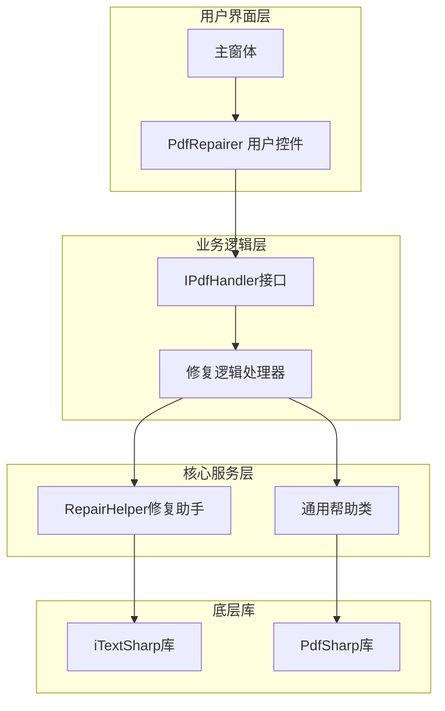
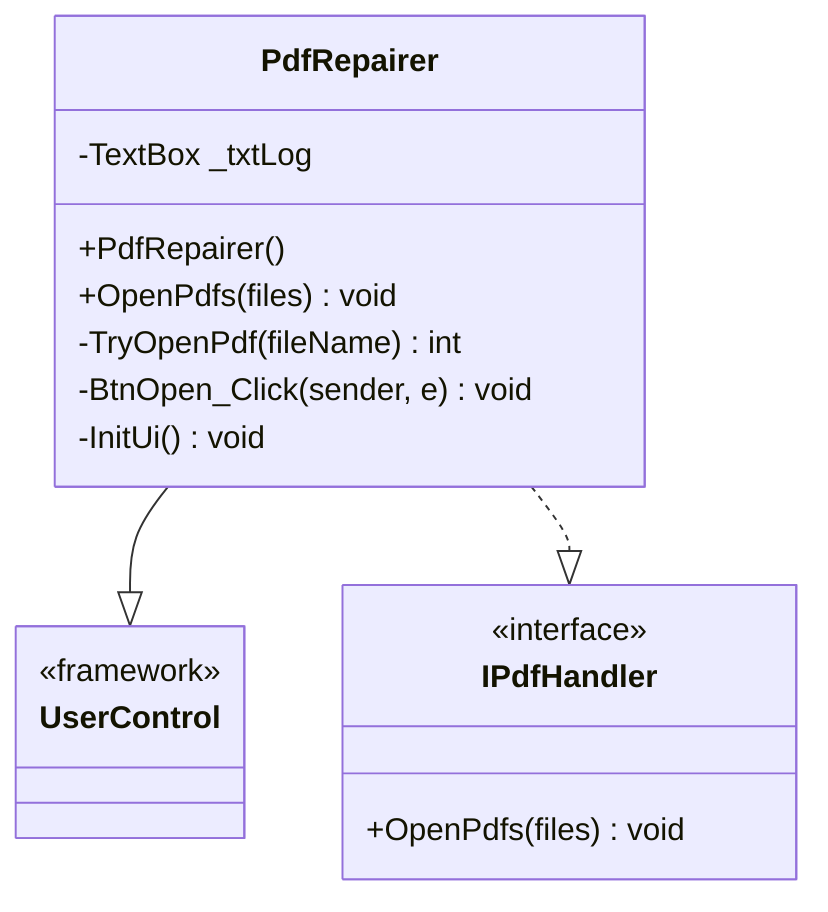
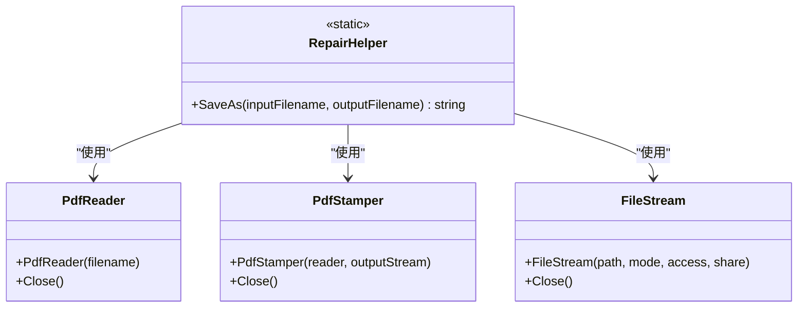
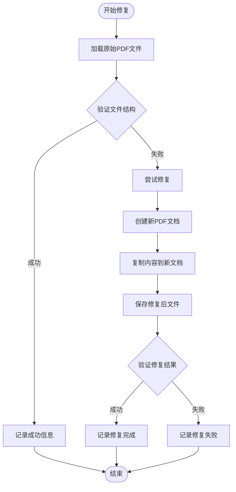
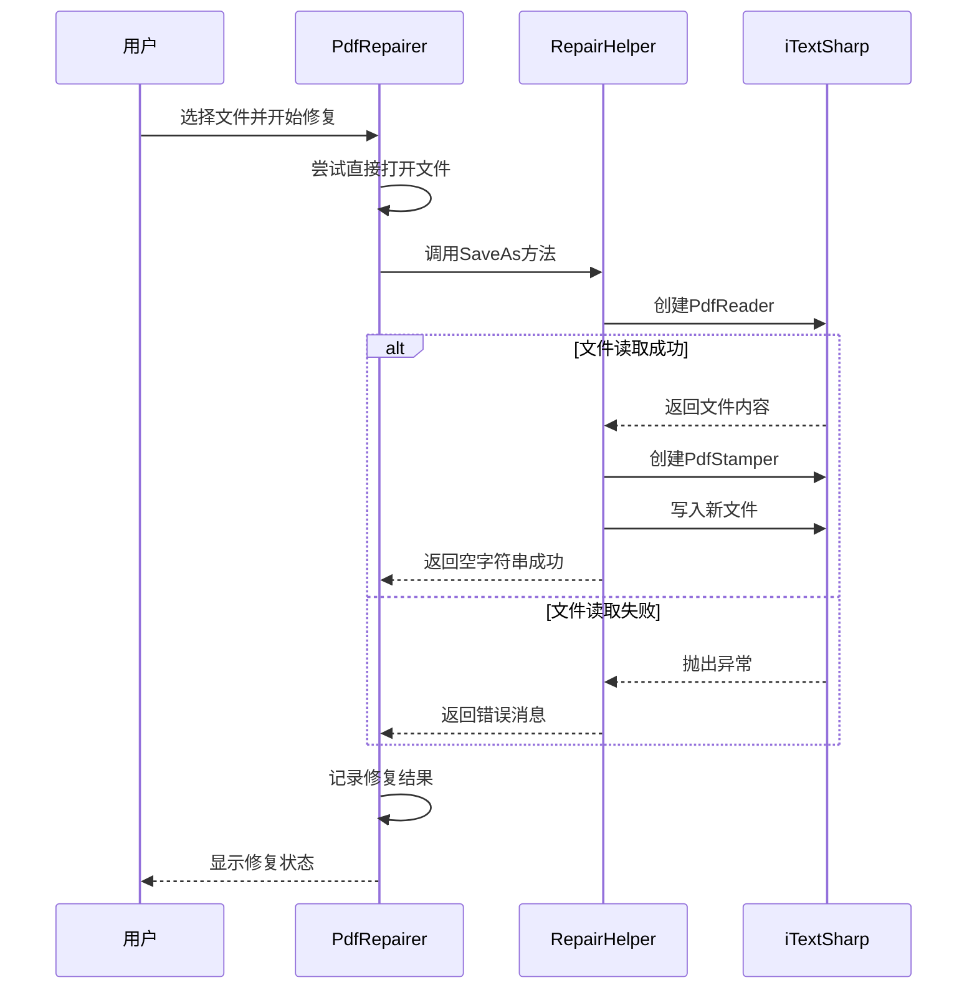
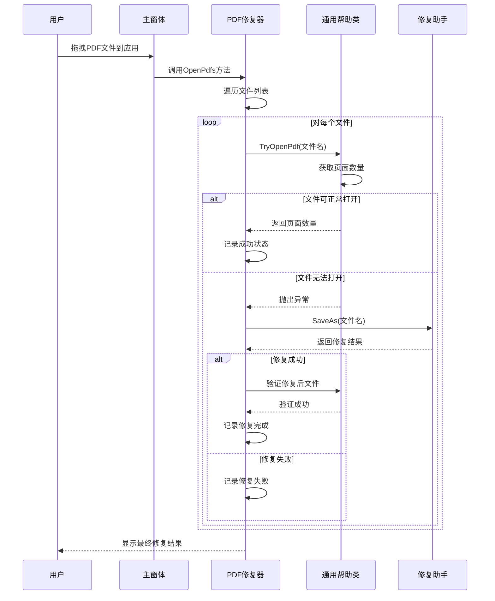
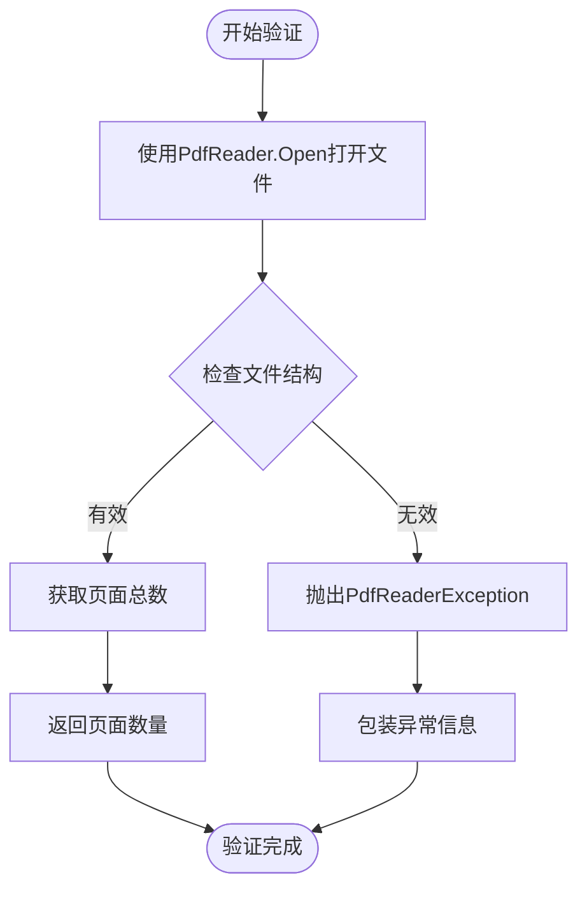

# PDF修复功能实现机制深度解析

<cite>
**本文档引用的文件**
- [PdfRepairer.cs](file://PdfTool/PdfRepairer.cs)
- [PdfRepairer.Designer.cs](file://PdfTool/PdfRepairer.Designer.cs)
- [RepairHelper.cs](file://PdfHelperLibrary2/RepairHelper.cs)
- [CommonHelper.cs](file://PdfHelperLibrary/CommonHelper.cs)
- [Common.cs](file://PdfTool/Common.cs)
- [MainForm.cs](file://PdfTool/MainForm.cs)
- [PdfHelperLibrary2.csproj](file://PdfHelperLibrary2/PdfHelperLibrary2.csproj)
- [PdfTool.csproj](file://PdfTool/PdfTool.csproj)
- [Config.cs](file://PdfTool/Config.cs)
</cite>

## 目录
1. [引言](#引言)
2. [系统架构概览](#系统架构概览)
3. [核心组件分析](#核心组件分析)
4. [修复机制详解](#修复机制详解)
5. [用户交互流程](#用户交互流程)
6. [文件完整性验证](#文件完整性验证)
7. [适用场景与限制](#适用场景与限制)
8. [性能考虑](#性能考虑)
9. [故障排除指南](#故障排除指南)
10. [总结](#总结)

## 引言

PDF修复功能是PDF工具库中的重要组成部分，专门用于处理因各种原因导致损坏或无法正常读取的PDF文件。该功能通过智能检测和重建PDF文件结构，特别是修复损坏的交叉引用表（Cross-Reference Table），为用户提供可靠的文件恢复解决方案。

本文档深入分析了PDF修复功能的实现机制，包括RepairHelper的核心算法、PdfRepairer界面的用户交互流程，以及整个修复过程的技术细节和应用场景。

## 系统架构概览

PDF修复功能采用分层架构设计，主要包含以下核心层次：

**图表来源**
- [PdfRepairer.cs](file://PdfTool/PdfRepairer.cs#L16-L17)
- [Common.cs](file://PdfTool/Common.cs#L13-L16)
- [RepairHelper.cs](file://PdfHelperLibrary2/RepairHelper.cs#L10-L11)

**章节来源**
- [PdfRepairer.cs](file://PdfTool/PdfRepairer.cs#L1-L111)
- [Common.cs](file://PdfTool/Common.cs#L1-L17)

## 核心组件分析

### PdfRepairer用户控件

PdfRepairer是PDF修复功能的主要用户界面组件，实现了IPdfHandler接口，提供直观的文件修复体验。

**图表来源**
- [PdfRepairer.cs](file://PdfTool/PdfRepairer.cs#L16-L17)
- [Common.cs](file://PdfTool/Common.cs#L13-L16)

#### 主要功能特性

1. **多文件批量处理**：支持同时选择多个PDF文件进行修复
2. **实时日志记录**：详细记录每个文件的修复状态和结果
3. **智能重试机制**：对修复失败的文件自动尝试重新处理
4. **用户友好的界面**：简洁直观的操作界面

**章节来源**
- [PdfRepairer.cs](file://PdfTool/PdfRepairer.cs#L18-L111)

### RepairHelper修复助手

RepairHelper是修复功能的核心算法实现，基于iTextSharp库提供的PDF处理能力。

**图表来源**
- [RepairHelper.cs](file://PdfHelperLibrary2/RepairHelper.cs#L10-L39)

**章节来源**
- [RepairHelper.cs](file://PdfHelperLibrary2/RepairHelper.cs#L1-L40)

## 修复机制详解

### 检测与验证流程

PDF修复过程采用双重验证机制，确保修复前后的文件完整性：

**图表来源**
- [PdfRepairer.cs](file://PdfTool/PdfRepairer.cs#L32-L54)
- [RepairHelper.cs](file://PdfHelperLibrary2/RepairHelper.cs#L12-L36)

### 修复算法原理

RepairHelper采用"重建"策略而非"修复"策略，其核心原理是：

1. **文件重建**：通过iTextSharp的PdfReader读取损坏的PDF文件
2. **内容重构**：使用PdfStamper创建全新的PDF文档
3. **结构重写**：自动重建正确的交叉引用表和对象索引
4. **完整性验证**：确保新生成的PDF文件结构完整

**章节来源**
- [RepairHelper.cs](file://PdfHelperLibrary2/RepairHelper.cs#L18-L30)

### 错误处理机制

修复过程包含完善的错误处理和异常捕获机制：

**图表来源**
- [PdfRepairer.cs](file://PdfTool/PdfRepairer.cs#L32-L54)
- [RepairHelper.cs](file://PdfHelperLibrary2/RepairHelper.cs#L18-L36)

**章节来源**
- [PdfRepairer.cs](file://PdfTool/PdfRepairer.cs#L57-L70)
- [RepairHelper.cs](file://PdfHelperLibrary2/RepairHelper.cs#L33-L36)

## 用户交互流程

### 完整修复工作流

用户通过PdfRepairer界面触发修复操作的完整流程如下：

**图表来源**
- [MainForm.cs](file://PdfTool/MainForm.cs#L41-L58)
- [PdfRepairer.cs](file://PdfTool/PdfRepairer.cs#L32-L54)

### 界面交互设计

PdfRepairer界面采用简洁的设计原则：

1. **文件选择**：通过OpenFileDialog支持多选模式
2. **进度显示**：实时更新的文本框显示修复过程
3. **状态反馈**：清晰的状态信息帮助用户了解修复进展
4. **错误提示**：详细的错误信息便于问题诊断

**章节来源**
- [PdfRepairer.cs](file://PdfTool/PdfRepairer.cs#L74-L79)
- [PdfRepairer.cs](file://PdfTool/PdfRepairer.cs#L83-L106)

## 文件完整性验证

### 页面计数验证

系统通过CommonHelper的GetPageCount方法进行基础的文件完整性验证：

**图表来源**
- [CommonHelper.cs](file://PdfHelperLibrary/CommonHelper.cs#L11-L25)

### 验证机制特点

1. **结构完整性检查**：验证PDF文件的基本结构是否完整
2. **异常信息增强**：提供包含文件名的详细错误信息
3. **多层异常处理**：区分不同类型的异常进行针对性处理
4. **性能优化**：仅读取必要的元数据，避免全文件扫描

**章节来源**
- [CommonHelper.cs](file://PdfHelperLibrary/CommonHelper.cs#L1-L29)

## 适用场景与限制

### 适用场景

PDF修复功能特别适用于以下场景：

1. **传输中断修复**：网络传输过程中断导致的文件损坏
2. **存储介质故障**：硬盘坏道、闪存损坏等硬件问题
3. **软件兼容性问题**：不同PDF阅读器之间的格式差异
4. **意外关闭处理**：应用程序崩溃导致的文件不完整
5. **病毒攻击防护**：恶意软件破坏的PDF文件恢复

### 修复成功率影响因素

| 因素类别 | 具体因素 | 影响程度 | 解决方案 |
|---------|---------|---------|---------|
| 文件损坏类型 | 交叉引用表损坏 | 高 | 重建交叉引用表 |
| 文件损坏程度 | 部分数据丢失 | 中 | 智能数据恢复 |
| 存储格式复杂度 | 包含大量嵌套对象 | 中 | 分步处理策略 |
| 硬件环境稳定性 | 磁盘读写错误 | 高 | 增强错误检测 |
| 软件版本兼容性 | iTextSharp版本差异 | 低 | 版本适配处理 |

### 功能局限性

1. **完全损坏文件**：文件头严重损坏时可能无法识别
2. **加密文件**：受密码保护的文件需要额外处理
3. **数字签名**：签名信息可能在修复过程中丢失
4. **大文件处理**：超大文件可能需要更多内存和时间
5. **特殊格式**：某些专业PDF格式可能不完全兼容

## 性能考虑

### 内存使用优化

修复过程采用流式处理和及时释放资源的策略：

1. **流式读取**：使用using语句确保资源及时释放
2. **内存管理**：避免长时间持有大型PDF对象
3. **垃圾回收**：主动触发GC减少内存占用
4. **并发控制**：单线程处理避免资源竞争

### 处理速度优化

1. **增量处理**：只处理损坏的部分而非整个文件
2. **缓存机制**：对重复操作的结果进行缓存
3. **异步处理**：支持后台处理不阻塞UI
4. **进度反馈**：实时更新处理进度提高用户体验

## 故障排除指南

### 常见问题及解决方案

#### 修复失败问题

**问题描述**：修复后文件仍然无法打开

**可能原因**：
- 原始文件结构过于严重损坏
- 系统资源不足
- iTextSharp版本不兼容

**解决步骤**：
1. 检查系统可用内存
2. 尝试使用不同版本的iTextSharp
3. 分析原始文件的损坏程度
4. 考虑使用专业的PDF修复工具

#### 性能问题

**问题描述**：修复过程耗时过长

**优化建议**：
- 减少同时处理的文件数量
- 增加系统内存容量
- 关闭不必要的后台程序
- 使用SSD存储设备

**章节来源**
- [PdfRepairer.cs](file://PdfTool/PdfRepairer.cs#L41-L53)
- [RepairHelper.cs](file://PdfHelperLibrary2/RepairHelper.cs#L33-L36)

## 总结

PDF修复功能通过RepairHelper的智能重建算法和PdfRepairer的用户友好界面，为用户提供了可靠且易用的文件恢复解决方案。该功能的核心优势包括：

1. **技术可靠性**：基于成熟的iTextSharp库，具有良好的稳定性和兼容性
2. **用户友好性**：直观的界面设计和详细的进度反馈
3. **处理效率**：智能的错误检测和快速的修复响应
4. **扩展性强**：模块化设计便于功能扩展和维护

尽管存在一定的局限性，但该修复功能在大多数常见场景下都能提供有效的解决方案，特别是在处理因传输中断导致的PDF文件损坏方面表现出色。随着技术的不断发展，该功能将继续演进以应对更复杂的文件修复需求。