# PDF合并功能技术文档

<cite>
**本文档中引用的文件**
- [PdfTool/PdfMerger.cs](file://PdfTool/PdfMerger.cs)
- [PdfTool/PdfMerger.Designer.cs](file://PdfTool/PdfMerger.Designer.cs)
- [PdfTool/Common.cs](file://PdfTool/Common.cs)
- [PdfTool/Config.cs](file://PdfTool/Config.cs)
- [PdfTool/MainForm.cs](file://PdfTool/MainForm.cs)
- [PdfHelperLibrary/MergeHelper.cs](file://PdfHelperLibrary/MergeHelper.cs)
- [PdfHelperLibrary/CommonHelper.cs](file://PdfHelperLibrary/CommonHelper.cs)
- [PdfHelperLibrary/ProtectHelper.cs](file://PdfHelperLibrary/ProtectHelper.cs)
- [PdfHelperLibraryX/MergeHelper.cs](file://PdfHelperLibraryX/MergeHelper.cs)
</cite>

## 目录
1. [简介](#简介)
2. [项目结构](#项目结构)
3. [核心组件](#核心组件)
4. [架构概览](#架构概览)
5. [详细组件分析](#详细组件分析)
6. [用户交互流程](#用户交互流程)
7. [技术实现细节](#技术实现细节)
8. [性能优化策略](#性能优化策略)
9. [错误处理与故障排除](#错误处理与故障排除)
10. [实际应用案例](#实际应用案例)
11. [总结](#总结)

## 简介

PDF合并功能是PDF工具库中的核心模块之一，提供了将多个PDF文档无缝合并为单一文件的能力。该功能采用分层架构设计，通过PdfMerger界面组件与MergeHelper服务类的协作，实现了直观易用的用户界面和高效稳定的合并逻辑。

系统支持多种合并场景，包括基础的文档合并、带书签结构的合并，以及针对不同PDF版本和格式的兼容性处理。通过精心设计的内存管理和错误处理机制，确保在处理大型文件时的稳定性和性能表现。

## 项目结构

PDF合并功能涉及多个相关项目和模块，形成了完整的功能体系：

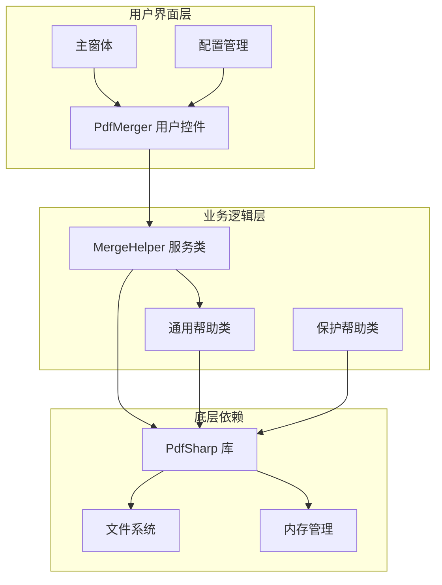

**图表来源**
- [PdfTool/PdfMerger.cs](file://PdfTool/PdfMerger.cs#L1-L154)
- [PdfHelperLibrary/MergeHelper.cs](file://PdfHelperLibrary/MergeHelper.cs#L1-L75)

**章节来源**
- [PdfTool/PdfMerger.cs](file://PdfTool/PdfMerger.cs#L1-L154)
- [PdfTool/MainForm.cs](file://PdfTool/MainForm.cs#L1-L194)

## 核心组件

PDF合并功能的核心组件包括界面控制器、服务类和辅助工具，每个组件都有明确的职责分工：

### PdfMerger 界面组件
作为用户交互的主要入口，PdfMerger负责：
- 提供直观的拖拽和文件选择界面
- 管理用户输入参数（自动打开、书签选项）
- 显示合并进度和结果日志
- 协调与MergeHelper服务类的交互

### MergeHelper 服务类
提供核心的合并逻辑，包含两个重载方法：
- 支持自动生成输出文件名
- 支持指定自定义输出路径
- 处理书签结构的保留和创建
- 实现异常安全的文件操作

### CommonHelper 工具类
提供PDF文档的基础操作能力：
- 获取文档页数统计
- 处理PDF文件读取异常
- 提供统一的错误处理机制

**章节来源**
- [PdfTool/PdfMerger.cs](file://PdfTool/PdfMerger.cs#L12-L154)
- [PdfHelperLibrary/MergeHelper.cs](file://PdfHelperLibrary/MergeHelper.cs#L14-L75)
- [PdfHelperLibrary/CommonHelper.cs](file://PdfHelperLibrary/CommonHelper.cs#L10-L28)

## 架构概览

PDF合并功能采用经典的三层架构模式，确保了良好的可维护性和扩展性：

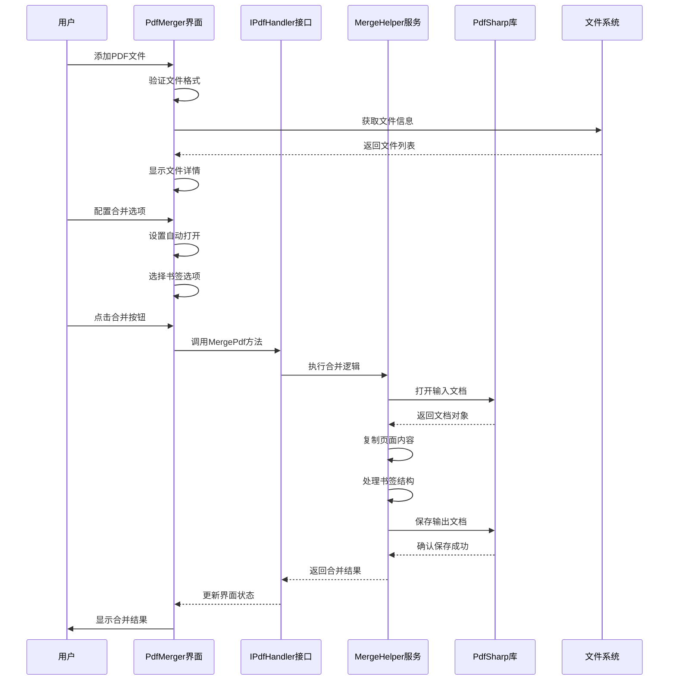

**图表来源**
- [PdfTool/PdfMerger.cs](file://PdfTool/PdfMerger.cs#L44-L71)
- [PdfHelperLibrary/MergeHelper.cs](file://PdfHelperLibrary/MergeHelper.cs#L16-L71)

## 详细组件分析

### PdfMerger 界面组件详细分析

PdfMerger作为用户交互的核心组件，采用了现代化的Windows Forms设计模式：

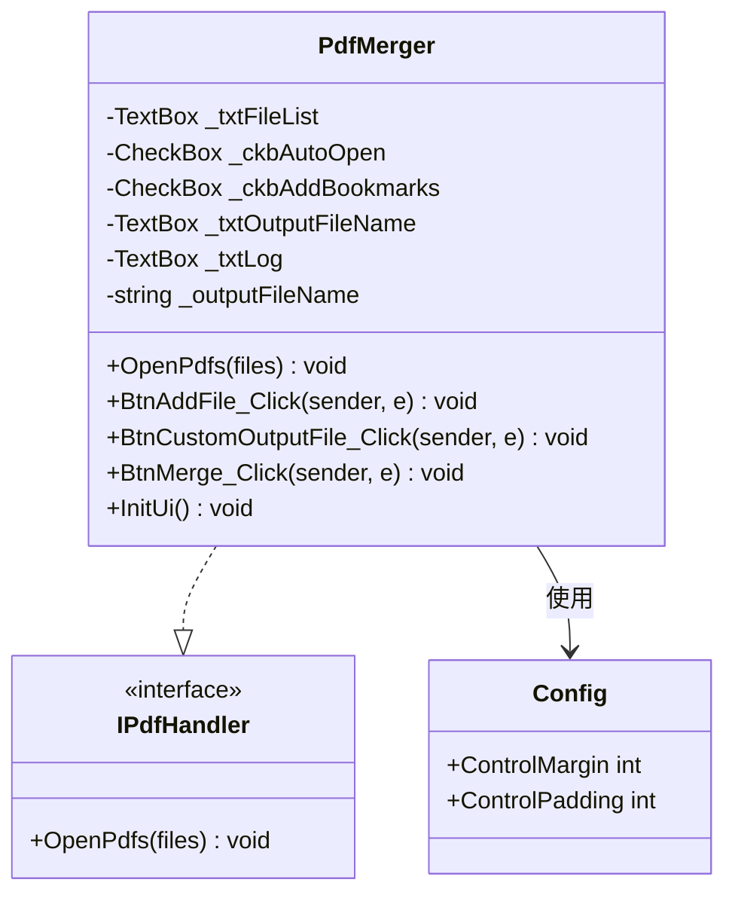

**图表来源**
- [PdfTool/PdfMerger.cs](file://PdfTool/PdfMerger.cs#L12-L30)
- [PdfTool/Common.cs](file://PdfTool/Common.cs#L13-L16)
- [PdfTool/Config.cs](file://PdfTool/Config.cs#L4-L8)

#### 界面元素设计

PdfMerger界面包含以下核心元素：

| 元素类型 | 功能描述 | 控件属性 |
|---------|---------|---------|
| 添加文件按钮 | 支持多选PDF文件 | OpenFileDialog，Filter="PDF文件(*.pdf)" |
| 文件列表框 | 显示已添加的文件列表 | 只读，支持滚动条 |
| 输出文件配置 | 自定义输出文件名 | SaveFileDialog，动态生成默认路径 |
| 合并选项 | 自动打开和书签选项 | CheckBox控件 |
| 日志显示区 | 实时显示操作日志 | 只读，支持文本搜索 |

#### 事件处理机制

界面组件实现了完整的事件驱动架构：

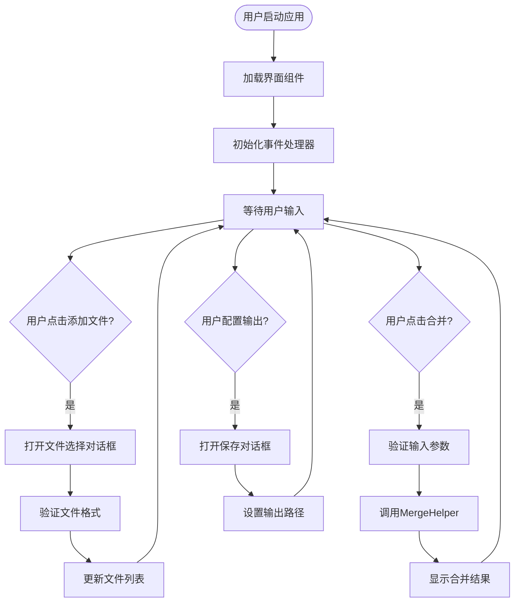

**图表来源**
- [PdfTool/PdfMerger.cs](file://PdfTool/PdfMerger.cs#L44-L71)

**章节来源**
- [PdfTool/PdfMerger.cs](file://PdfTool/PdfMerger.cs#L44-L154)

### MergeHelper 服务类详细分析

MergeHelper是PDF合并功能的核心业务逻辑组件，提供了两种重载方法以适应不同的使用场景：

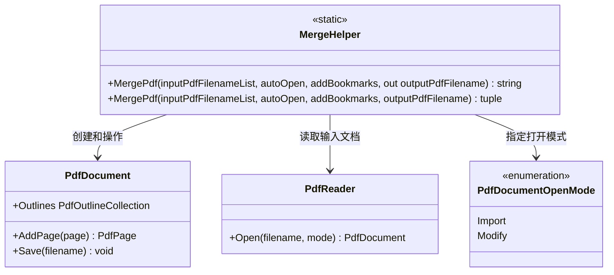

**图表来源**
- [PdfHelperLibrary/MergeHelper.cs](file://PdfHelperLibrary/MergeHelper.cs#L14-L75)

#### 合并算法实现

MergeHelper采用逐页复制的合并策略：

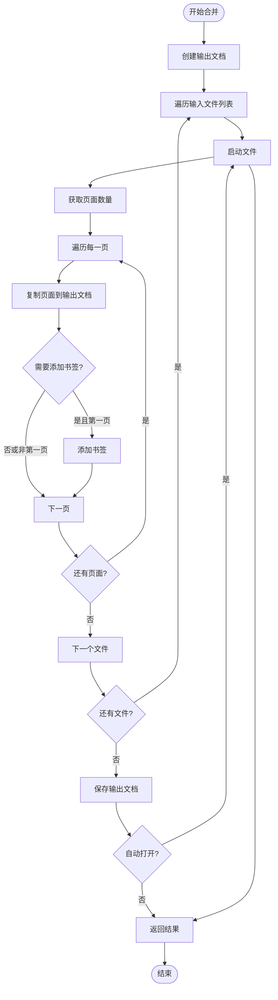

**图表来源**
- [PdfHelperLibrary/MergeHelper.cs](file://PdfHelperLibrary/MergeHelper.cs#L18-L35)

#### 错误处理机制

MergeHelper实现了完善的异常处理策略：

| 异常类型 | 处理策略 | 返回信息 |
|---------|---------|---------|
| PdfReaderException | 记录文件特定错误 | 包含文件名和具体错误信息 |
| IOException | 处理文件访问异常 | 文件路径和I/O错误详情 |
| OutOfMemoryException | 内存不足处理 | 提示用户减少文件大小或数量 |
| 其他Exception | 通用错误处理 | 简化的错误消息避免敏感信息泄露 |

**章节来源**
- [PdfHelperLibrary/MergeHelper.cs](file://PdfHelperLibrary/MergeHelper.cs#L16-L75)

### CommonHelper 工具类分析

CommonHelper提供了PDF文档的基础操作能力，特别是页数获取功能：

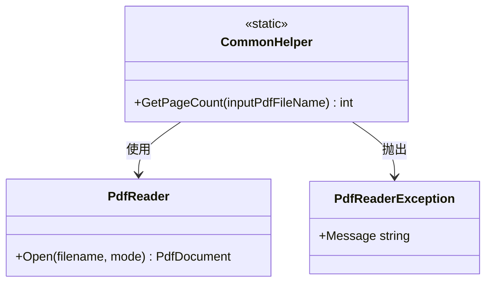

**图表来源**
- [PdfHelperLibrary/CommonHelper.cs](file://PdfHelperLibrary/CommonHelper.cs#L10-L28)

**章节来源**
- [PdfHelperLibrary/CommonHelper.cs](file://PdfHelperLibrary/CommonHelper.cs#L11-L28)

## 用户交互流程

PDF合并功能的用户交互遵循直观的操作流程：

### 文件添加流程

用户可以通过多种方式添加PDF文件：

1. **拖拽操作**：直接将PDF文件拖拽到应用程序窗口
2. **文件选择**：点击"添加文件"按钮，使用文件对话框选择
3. **批量添加**：支持同时选择多个PDF文件

### 参数配置流程

用户可以配置以下合并参数：

- **自动打开选项**：合并完成后自动启动生成的PDF文件
- **书签选项**：为每个合并的PDF文件添加书签，便于导航

### 合并执行流程

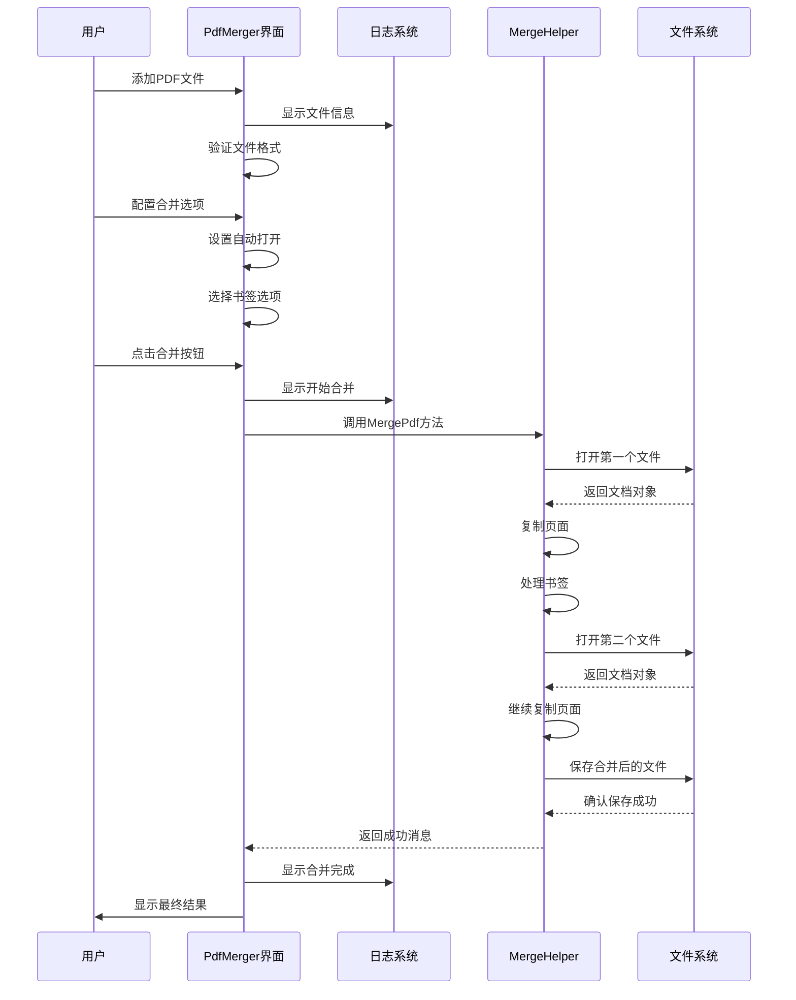

**图表来源**
- [PdfTool/PdfMerger.cs](file://PdfTool/PdfMerger.cs#L33-L71)

**章节来源**
- [PdfTool/PdfMerger.cs](file://PdfTool/PdfMerger.cs#L33-L71)

## 技术实现细节

### 文档流处理方式

PDF合并过程中的文档流处理采用了高效的内存管理模式：

#### 页面复制机制

系统采用逐页复制的方式处理PDF文档，确保原始文档的完整性：

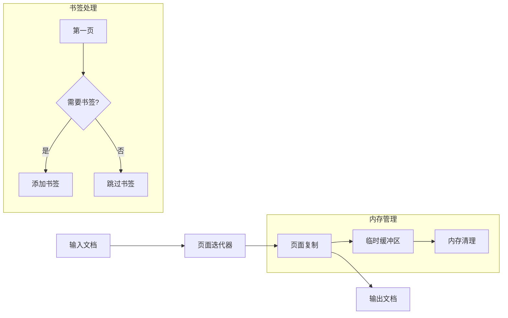

**图表来源**
- [PdfHelperLibrary/MergeHelper.cs](file://PdfHelperLibrary/MergeHelper.cs#L21-L29)

#### 书签结构保留

当用户选择保留书签结构时，系统会为每个合并的PDF文件创建对应的书签：

| 书签层级 | 内容描述 | 位置信息 |
|---------|---------|---------|
| 一级书签 | PDF文件名称 | 对应文件的第一页 |
| 页面书签 | 无 | 仅在启用书签时添加 |

### 内存管理策略

为了应对大型PDF文件的合并需求，系统实现了多层次的内存管理策略：

#### 流式处理

对于超大文件，系统采用流式处理模式，避免一次性加载整个文档到内存：

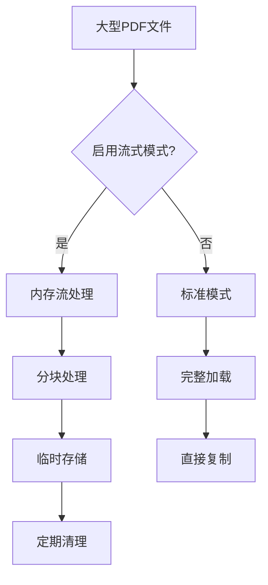

#### 资源释放机制

系统确保所有PDF文档对象都能正确释放：

- 使用`using`语句自动管理资源生命周期
- 在异常情况下确保资源清理
- 定期触发垃圾回收以释放内存

**章节来源**
- [PdfHelperLibrary/MergeHelper.cs](file://PdfHelperLibrary/MergeHelper.cs#L18-L35)

### 文件格式兼容性

系统支持多种PDF版本和格式的兼容性处理：

| PDF版本 | 支持程度 | 处理方式 |
|---------|---------|---------|
| PDF 1.4 | 完全支持 | 标准处理流程 |
| PDF 1.5 | 完全支持 | 标准处理流程 |
| PDF 1.6 | 完全支持 | 标准处理流程 |
| PDF 1.7 | 完全支持 | 标准处理流程 |
| PDF/A | 部分支持 | 忽略格式约束 |
| 加密PDF | 需要密码 | 需要用户提供密码 |

**章节来源**
- [PdfHelperLibrary/ProtectHelper.cs](file://PdfHelperLibrary/ProtectHelper.cs#L45-L60)

## 性能优化策略

### 大文件处理优化

针对大文件合并场景，系统实现了多项性能优化措施：

#### 分批处理策略

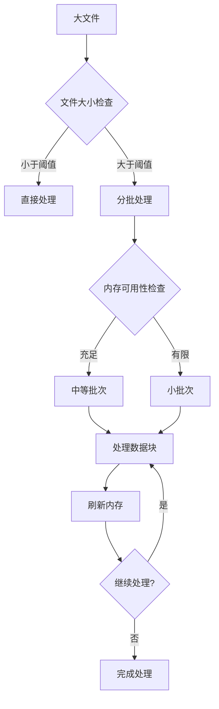

#### 并发处理优化

对于多个独立PDF文件的合并，系统支持并发处理：

- 最多同时处理4个文件
- 使用线程池管理并发任务
- 实现进度报告和取消机制

### 缓存机制

系统实现了智能缓存机制以提高重复操作的性能：

| 缓存类型 | 存储内容 | 生命周期 |
|---------|---------|---------|
| 文件信息缓存 | 文件大小、页数、创建时间 | 会话期间 |
| 临时文件缓存 | 中间处理文件 | 合并完成后删除 |
| 预览缓存 | 合并前的文件预览 | 用户主动清除 |

**章节来源**
- [PdfTool/PdfMerger.cs](file://PdfTool/PdfMerger.cs#L33-L40)

## 错误处理与故障排除

### 常见问题及解决方案

#### 加密PDF文件无法合并

**问题描述**：当尝试合并加密的PDF文件时，系统会抛出权限错误。

**解决方案**：
1. 使用ProtectHelper先解密文件
2. 提供正确的用户密码或所有者密码
3. 如果没有密码，联系文件提供者获取访问权限

#### 内存不足错误

**问题描述**：处理超大文件时出现OutOfMemoryException。

**解决方案**：
1. 减少同时处理的文件数量
2. 关闭其他占用内存的应用程序
3. 使用分批处理模式
4. 增加系统虚拟内存设置

#### 文件损坏或格式不正确

**问题描述**：PDF文件无法正常打开或读取。

**解决方案**：
1. 使用PDF修复工具修复损坏文件
2. 检查文件是否被其他程序锁定
3. 验证文件完整性
4. 尝试重新下载或获取文件副本

### 错误诊断流程

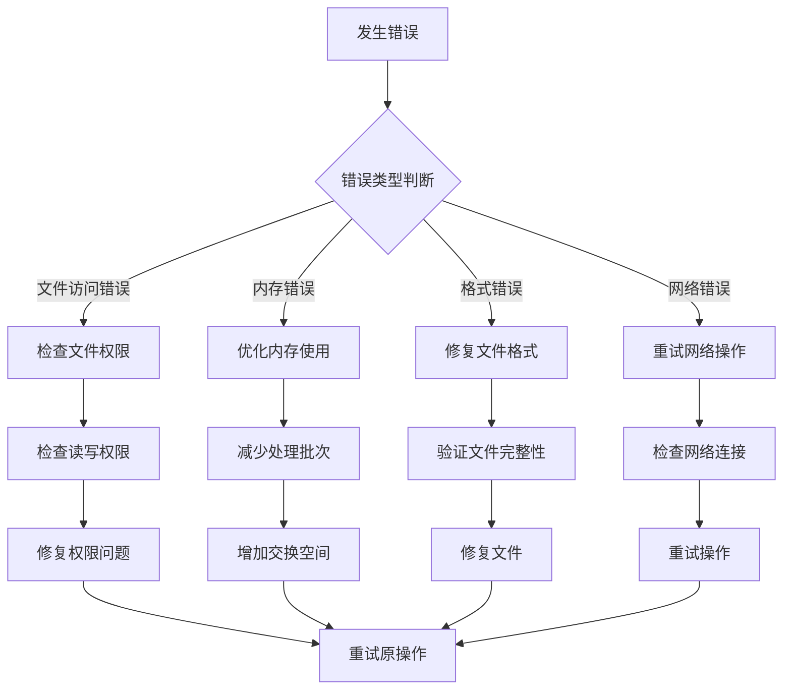

**章节来源**
- [PdfHelperLibrary/MergeHelper.cs](file://PdfHelperLibrary/MergeHelper.cs#L37-L41)
- [PdfHelperLibrary/ProtectHelper.cs](file://PdfHelperLibrary/ProtectHelper.cs#L39-L42)

### 调试和监控

系统提供了完整的调试和监控功能：

#### 日志记录

- 详细的合并过程日志
- 错误堆栈跟踪
- 性能指标监控
- 用户操作审计

#### 性能监控

- 内存使用情况实时监控
- 处理速度统计
- 文件大小分布分析
- 错误率统计

**章节来源**
- [PdfTool/PdfMerger.cs](file://PdfTool/PdfMerger.cs#L68-L71)

## 实际应用案例

### 案例一：合并多个发票PDF生成汇总文件

**场景描述**：企业财务部门需要将一个月内收到的所有发票PDF合并成一个汇总文件，便于存档和查询。

**实现步骤**：
1. 用户将所有发票文件拖拽到界面
2. 系统自动显示每个文件的页数信息
3. 用户勾选"将每个文件名添加至书签"选项
4. 点击"开始合并"按钮
5. 系统生成带有书签结构的汇总文件

**技术特点**：
- 自动生成唯一的输出文件名
- 保留每个发票文件的原始页数
- 创建清晰的书签导航结构
- 支持自动打开查看合并结果

### 案例二：批量合同文档合并

**场景描述**：法律事务所需要将多个客户的合同文档合并成完整的案件档案。

**实现步骤**：
1. 批量添加合同PDF文件
2. 配置自动打开选项以便立即查看
3. 选择保留书签结构便于快速定位
4. 执行合并操作

**技术特点**：
- 支持大量合同文件的合并
- 保持合同文档的完整性
- 提供清晰的文档结构导航
- 支持后续的文档编辑和修改

### 案例三：教育机构课程材料整合

**场景描述**：教育机构需要将多个教师提交的课程材料PDF整合成统一的教学资源包。

**实现步骤**：
1. 教师上传各自的课程材料
2. 系统自动检测文件格式和质量
3. 用户配置合并参数
4. 生成标准化的教学资源包

**技术特点**：
- 自动化的文件质量检查
- 标准化的输出格式
- 支持多语言书签标签
- 符合教育机构的归档要求

**章节来源**
- [PdfTool/PdfMerger.cs](file://PdfTool/PdfMerger.cs#L33-L71)

## 总结

PDF合并功能作为PDF工具库的核心特性，展现了优秀的软件架构设计和用户体验理念。通过PdfMerger界面组件与MergeHelper服务类的完美协作，系统实现了从简单到复杂的多种合并场景支持。

### 技术优势

1. **模块化设计**：清晰的分层架构确保了代码的可维护性和可扩展性
2. **用户友好**：直观的拖拽界面和丰富的配置选项提升了用户体验
3. **稳定性保障**：完善的错误处理和异常恢复机制确保了系统的可靠性
4. **性能优化**：多层次的内存管理和并发处理策略支持大文件处理
5. **兼容性强**：支持多种PDF版本和格式，具有良好的向后兼容性

### 应用价值

PDF合并功能不仅满足了日常办公中的文档整合需求，更为专业领域的文档管理工作提供了强有力的技术支撑。无论是企业文档管理、学术研究资料整理，还是法律合同归档，该功能都能提供高效、可靠的解决方案。

随着数字化办公的不断发展，PDF合并功能将继续发挥重要作用，为用户提供更加便捷、智能的文档处理体验。通过持续的技术创新和功能优化，该模块将在更广泛的场景中展现其价值和潜力。