# PDF拆分功能详细开发文档

<cite>
**本文档引用的文件**
- [PdfTool/PdfSplitter.cs](file://PdfTool/PdfSplitter.cs)
- [PdfTool/PdfSplitter.Designer.cs](file://PdfTool/PdfSplitter.Designer.cs)
- [PdfTool/MainForm.cs](file://PdfTool/MainForm.cs)
- [PdfTool/Common.cs](file://PdfTool/Common.cs)
- [PdfHelperLibrary/SplitHelper.cs](file://PdfHelperLibrary/SplitHelper.cs)
- [PdfHelperLibrary/ExtractHelper.cs](file://PdfHelperLibrary/ExtractHelper.cs)
- [PdfHelperLibrary/CommonHelper.cs](file://PdfHelperLibrary/CommonHelper.cs)
- [PdfTool/Config.cs](file://PdfTool/Config.cs)
</cite>

## 目录
1. [概述](#概述)
2. [项目结构分析](#项目结构分析)
3. [核心组件架构](#核心组件架构)
4. [PdfSplitter模块详细分析](#pdfsplitter模块详细分析)
5. [拖拽集成机制](#拖拽集成机制)
6. [拆分模式与技术实现](#拆分模式与技术实现)
7. [后台线程处理机制](#后台线程处理机制)
8. [典型使用场景](#典型使用场景)
9. [性能优化建议](#性能优化建议)
10. [错误处理与故障排除](#错误处理与故障排除)
11. [总结](#总结)

## 概述

PDF拆分功能是PdfTool应用程序中的核心模块之一，提供了灵活的PDF文档分割能力。该功能通过PdfSplitter模块实现，支持多种拆分模式，包括按页数拆分、按页码范围提取和指定页码删除等操作。系统采用模块化架构设计，通过IPdfHandler接口实现统一的文件处理标准，确保与其他功能模块的无缝集成。

## 项目结构分析

PdfTool项目采用分层架构设计，主要包含以下核心模块：

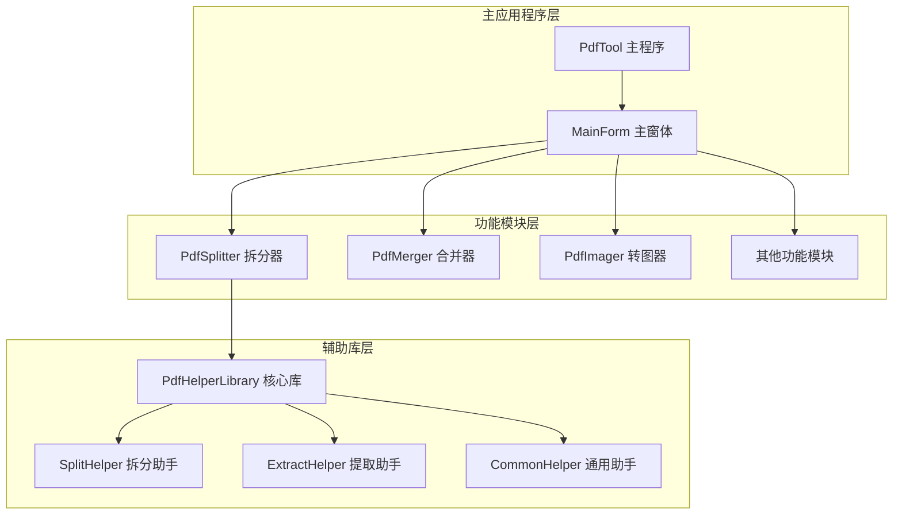

**图表来源**
- [PdfTool/MainForm.cs](file://PdfTool/MainForm.cs#L135-L150)
- [PdfTool/PdfSplitter.cs](file://PdfTool/PdfSplitter.cs#L12-L13)

**章节来源**
- [PdfTool/MainForm.cs](file://PdfTool/MainForm.cs#L135-L150)
- [PdfTool/PdfSplitter.cs](file://PdfTool/PdfSplitter.cs#L1-L230)

## 核心组件架构

### IPdfHandler接口设计

系统通过IPdfHandler接口实现模块化架构的核心抽象，定义了所有PDF处理模块必须实现的标准接口契约：

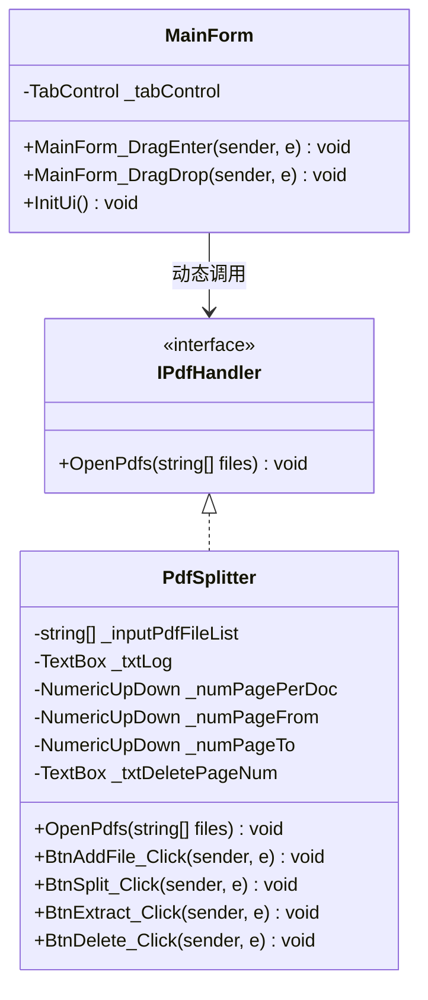

**图表来源**
- [PdfTool/Common.cs](file://PdfTool/Common.cs#L13-L16)
- [PdfTool/PdfSplitter.cs](file://PdfTool/PdfSplitter.cs#L12-L30)

### 模块通信机制

系统采用基于事件驱动的通信机制，通过拖拽操作实现文件的自动处理：

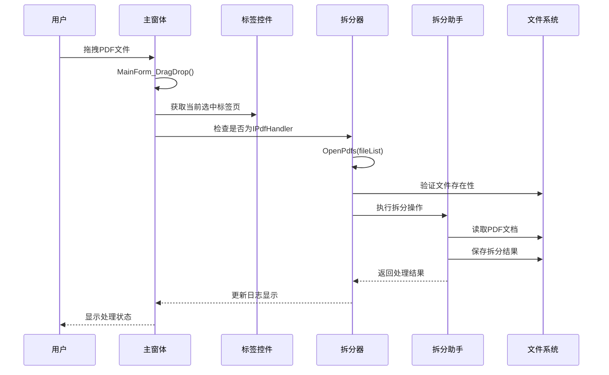

**图表来源**
- [PdfTool/MainForm.cs](file://PdfTool/MainForm.cs#L41-L58)
- [PdfTool/PdfSplitter.cs](file://PdfTool/PdfSplitter.cs#L33-L42)

**章节来源**
- [PdfTool/Common.cs](file://PdfTool/Common.cs#L13-L16)
- [PdfTool/MainForm.cs](file://PdfTool/MainForm.cs#L41-L58)

## PdfSplitter模块详细分析

### 类结构与属性

PdfSplitter类继承自UserControl并实现IPdfHandler接口，包含以下核心属性：

| 属性名称 | 类型 | 描述 | 默认值 |
|---------|------|------|--------|
| _inputPdfFileList | List<string> | 输入PDF文件列表 | 空列表 |
| _txtLog | TextBox | 日志输出控件 | 未初始化 |
| _numPagePerDoc | NumericUpDown | 每文档页数设置 | 1 |
| _numPageFrom | NumericUpDown | 提取起始页码 | 1 |
| _numPageTo | NumericUpDown | 提取结束页码 | 1 |
| _txtDeletePageNum | TextBox | 删除页码字符串 | 空字符串 |

### 初始化机制

PdfSplitter采用延迟初始化策略，在构造函数中完成基本初始化：

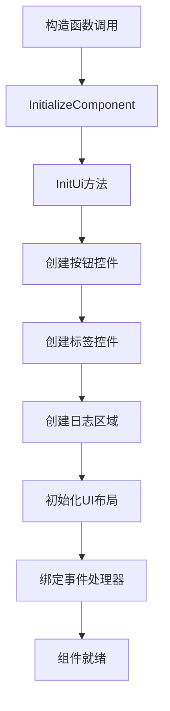

**图表来源**
- [PdfTool/PdfSplitter.cs](file://PdfTool/PdfSplitter.cs#L15-L20)
- [PdfTool/PdfSplitter.cs](file://PdfTool/PdfSplitter.cs#L109-L152)

### 核心业务方法

#### OpenPdfs方法
该方法是IPdfHandler接口的核心实现，负责处理传入的PDF文件列表：

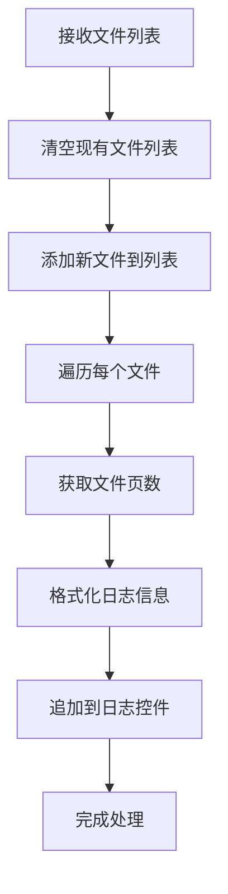

**图表来源**
- [PdfTool/PdfSplitter.cs](file://PdfTool/PdfSplitter.cs#L33-L42)

#### 按页数拆分方法
BtnSplit_Click方法实现了按指定页数拆分PDF的功能：

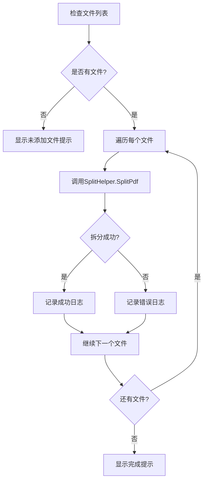

**图表来源**
- [PdfTool/PdfSplitter.cs](file://PdfTool/PdfSplitter.cs#L54-L67)

**章节来源**
- [PdfTool/PdfSplitter.cs](file://PdfTool/PdfSplitter.cs#L33-L67)

## 拖拽集成机制

### MainForm拖拽处理

MainForm通过重写DragEnter和DragDrop事件实现拖拽功能集成：

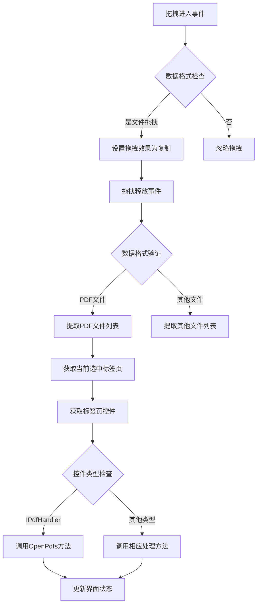

**图表来源**
- [PdfTool/MainForm.cs](file://PdfTool/MainForm.cs#L33-L58)

### 标签页集成方式

PdfSplitter通过tpPdfSplitter标签页与主界面集成：

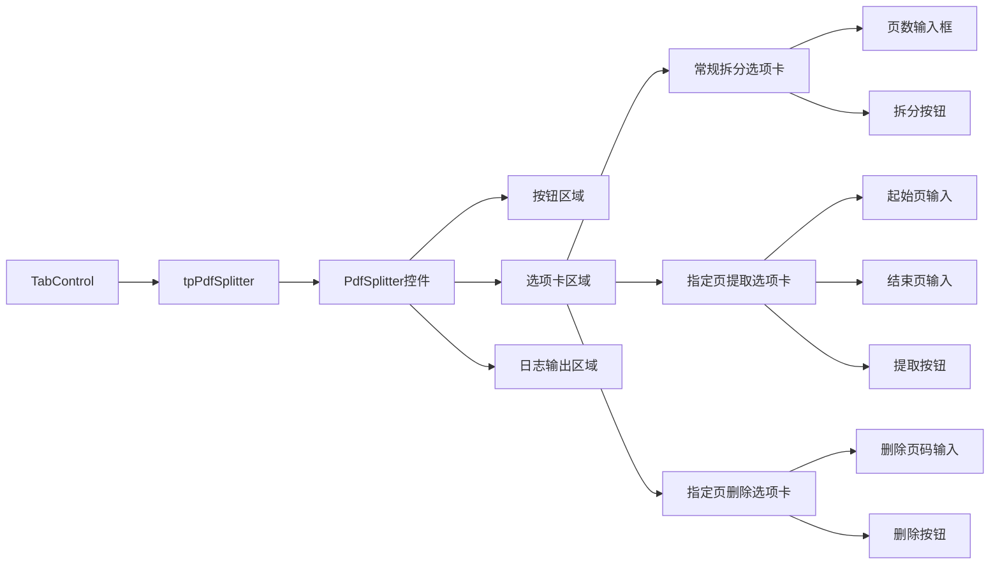

**图表来源**
- [PdfTool/MainForm.cs](file://PdfTool/MainForm.cs#L151)
- [PdfTool/PdfSplitter.cs](file://PdfTool/PdfSplitter.cs#L120-L132)

**章节来源**
- [PdfTool/MainForm.cs](file://PdfTool/MainForm.cs#L33-L58)
- [PdfTool/MainForm.cs](file://PdfTool/MainForm.cs#L151)

## 拆分模式与技术实现

### 支持的拆分模式

系统提供三种主要的拆分模式：

#### 1. 常规拆分（按页数）
通过SplitHelper类的SplitPdf方法实现，支持按指定页数将PDF拆分为多个独立文档。

#### 2. 指定页提取
通过ExtractHelper.ExtractPdf方法实现，可以从PDF中提取指定页码范围的内容。

#### 3. 指定页删除
通过ExtractHelper.DeletePdfPage方法实现，可以删除PDF中的指定页码。

### SplitHelper底层实现机制

#### 按页数拆分算法

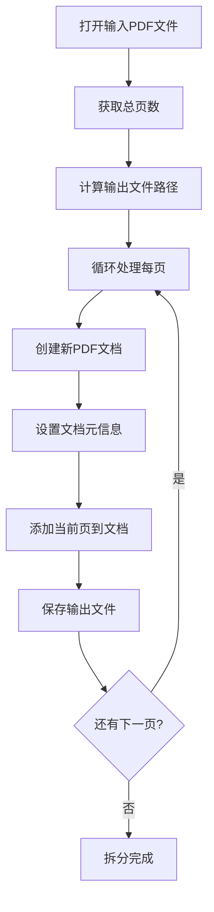

**图表来源**
- [PdfHelperLibrary/SplitHelper.cs](file://PdfHelperLibrary/SplitHelper.cs#L13-L29)

#### 按页数拆分优化算法

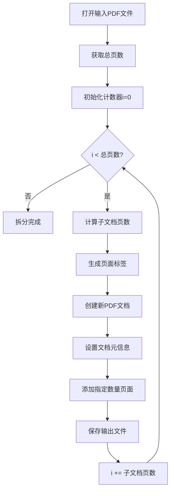

**图表来源**
- [PdfHelperLibrary/SplitHelper.cs](file://PdfHelperLibrary/SplitHelper.cs#L38-L60)

### 提取和删除功能实现

#### 页面提取逻辑

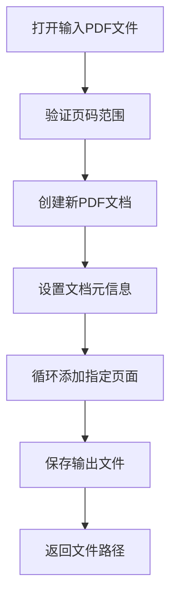

**图表来源**
- [PdfHelperLibrary/ExtractHelper.cs](file://PdfHelperLibrary/ExtractHelper.cs#L22-L37)

#### 页面删除逻辑

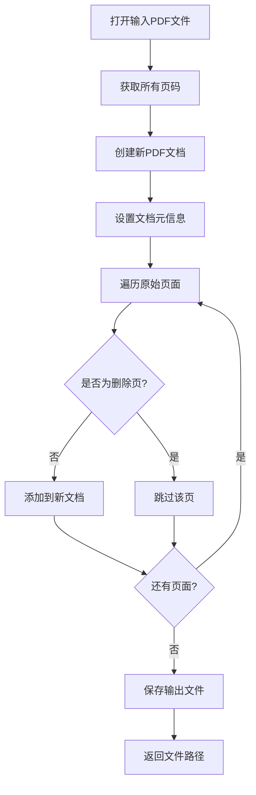

**图表来源**
- [PdfHelperLibrary/ExtractHelper.cs](file://PdfHelperLibrary/ExtractHelper.cs#L47-L66)

**章节来源**
- [PdfHelperLibrary/SplitHelper.cs](file://PdfHelperLibrary/SplitHelper.cs#L13-L70)
- [PdfHelperLibrary/ExtractHelper.cs](file://PdfHelperLibrary/ExtractHelper.cs#L14-L77)

## 后台线程处理机制

### 异步处理架构

虽然当前实现中没有显式的异步处理，但系统设计考虑了大文件处理的性能需求。对于大型PDF文件，建议采用以下异步处理策略：

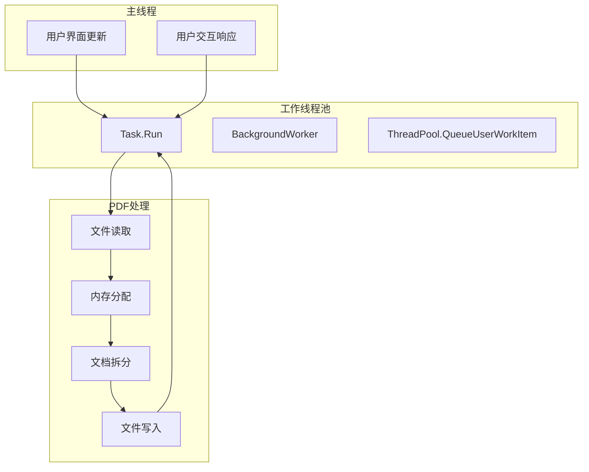

### 性能优化策略

#### 内存管理优化
- 使用using语句确保资源及时释放
- 对大文件采用流式处理
- 及时清理中间临时文件

#### 并发处理优化
- 批量处理多个文件时考虑并发执行
- 使用Progress报告处理进度
- 实现取消操作机制

**章节来源**
- [PdfHelperLibrary/SplitHelper.cs](file://PdfHelperLibrary/SplitHelper.cs#L38-L67)
- [PdfHelperLibrary/ExtractHelper.cs](file://PdfHelperLibrary/ExtractHelper.cs#L22-L44)

## 典型使用场景

### 场景一：学术论文拆分

**需求描述**：将一篇包含多个章节的学术论文拆分为独立的章节文档。

**解决方案**：
1. 用户拖拽完整的论文PDF文件到tpPdfSplitter标签页
2. 在"常规拆分"选项卡中设置"页/文档"为1
3. 点击"开始拆分"按钮
4. 系统将生成每个章节的独立PDF文件

**预期结果**：
- 输入：Chapter1.pdf（100页）
- 输出：Chapter1 - Page 1.pdf, Chapter1 - Page 2.pdf, ..., Chapter1 - Page 100.pdf

### 场景二：报告文档分割

**需求描述**：将一个多章节的年度报告按章节拆分为独立文档。

**解决方案**：
1. 用户选择"指定页提取"选项卡
2. 设置起始页为1，结束页为30（假设第一章30页）
3. 点击"开始提取"按钮
4. 重复上述步骤处理其他章节

**预期结果**：
- 第一章：YearReport - Page 1 to 30.pdf
- 第二章：YearReport - Page 31 to 60.pdf
- 第三章：YearReport - Page 61 to 90.pdf

### 场景三：会议材料整理

**需求描述**：从完整的会议资料中删除不需要的附录部分。

**解决方案**：
1. 用户选择"指定页删除"选项卡
2. 在"删除页码"输入框中输入"101,102,103"（假设附录在第101-103页）
3. 点击"开始删除"按钮
4. 系统生成不含附录的新文档

**预期结果**：
- 原始文件：ConferenceMaterials.pdf（103页）
- 新文件：ConferenceMaterials - DeletePageFile - 202401011200000.pdf（100页）

### 场景四：批量文档处理

**需求描述**：同时处理多个PDF文件，每个文件按固定页数拆分。

**解决方案**：
1. 使用"添加文件"按钮选择多个PDF文件
2. 在"常规拆分"选项卡中设置合适的页数
3. 点击"开始拆分"按钮
4. 系统依次处理所有选中的文件

**预期结果**：
- 批量处理多个文件，每个文件按设定规则拆分

**章节来源**
- [PdfTool/PdfSplitter.cs](file://PdfTool/PdfSplitter.cs#L54-L105)

## 性能优化建议

### 大文件处理优化

#### 内存使用优化
1. **流式处理**：对于超大文件，考虑使用流式处理而非一次性加载整个文档
2. **内存监控**：实时监控内存使用情况，及时释放不需要的资源
3. **分块处理**：将大文件分成小块处理，避免内存溢出

#### 处理速度优化
1. **并行处理**：对多个独立文件采用并行处理
2. **缓存机制**：缓存常用的PDF元数据信息
3. **预分配空间**：预先估算输出文件大小，减少磁盘I/O

### 用户体验优化

#### 界面响应性
1. **进度指示器**：为长时间操作提供进度条
2. **取消机制**：允许用户中断长时间运行的操作
3. **状态反馈**：实时显示处理状态和预计时间

#### 错误恢复
1. **断点续传**：支持处理中断后的恢复
2. **备份机制**：重要操作前自动备份原始文件
3. **回滚功能**：提供撤销操作的能力

### 系统资源优化

#### CPU使用优化
1. **优先级调整**：根据系统负载动态调整处理优先级
2. **算法优化**：选择更高效的PDF处理算法
3. **硬件加速**：利用GPU加速图形处理操作

#### 磁盘I/O优化
1. **临时文件管理**：合理管理临时文件的创建和清理
2. **批量写入**：将多个小文件写入合并为批量操作
3. **存储位置选择**：支持选择高性能存储设备

## 错误处理与故障排除

### 常见错误类型

#### 文件访问错误

| 错误类型 | 症状 | 解决方案 |
|---------|------|----------|
| 文件被占用 | "文件正在使用中"错误 | 关闭相关程序，重新尝试 |
| 权限不足 | "访问被拒绝"错误 | 以管理员身份运行或更改文件权限 |
| 文件损坏 | "PDF格式无效"错误 | 使用PDF修复工具修复文件 |
| 路径过长 | "路径太长"错误 | 移动文件到较短路径 |

#### 内存相关错误

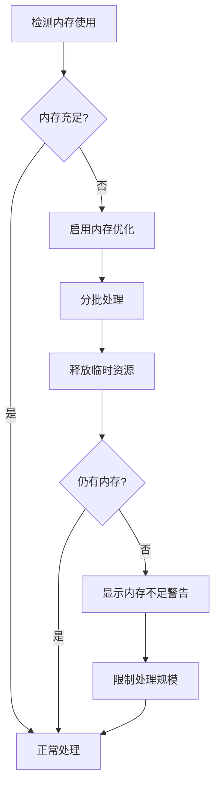

#### 磁盘空间错误
1. **空间不足**：检查可用磁盘空间，清理临时文件
2. **写入权限**：确认目标目录有写入权限
3. **网络存储**：处理网络驱动器连接稳定性

### 错误处理机制

#### 异常捕获策略

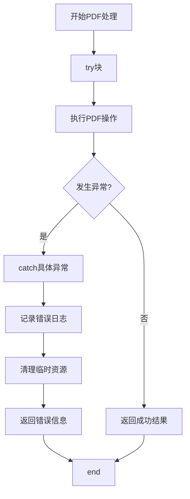

#### 错误恢复策略

1. **自动重试**：对于临时性错误（如网络中断）自动重试
2. **降级处理**：当高级功能不可用时使用基础功能
3. **用户选择**：提供多种错误处理选项供用户选择

### 故障排除指南

#### 诊断步骤
1. **检查文件完整性**：使用PDF查看器验证文件是否可正常打开
2. **验证路径有效性**：确认文件路径不存在特殊字符或过长
3. **检查系统资源**：监控CPU、内存、磁盘使用情况
4. **查看系统日志**：检查Windows事件日志中的相关错误

#### 解决方案库

| 问题 | 可能原因 | 解决方法 |
|------|----------|----------|
| 处理缓慢 | 文件过大或系统资源不足 | 分批处理或升级硬件 |
| 内存溢出 | 处理超大文件 | 使用流式处理或增加虚拟内存 |
| 文件丢失 | 磁盘空间不足 | 清理磁盘空间或更换存储位置 |
| 权限错误 | 文件权限设置不当 | 修改文件权限或以管理员身份运行 |

**章节来源**
- [PdfHelperLibrary/SplitHelper.cs](file://PdfHelperLibrary/SplitHelper.cs#L63-L67)
- [PdfHelperLibrary/ExtractHelper.cs](file://PdfHelperLibrary/ExtractHelper.cs#L40-L44)

## 总结

PDF拆分功能通过PdfSplitter模块实现了灵活而强大的文档分割能力。系统采用模块化架构设计，通过IPdfHandler接口实现统一的文件处理标准，确保了良好的可扩展性和维护性。

### 核心优势

1. **多样化拆分模式**：支持按页数、页码范围和指定页码的多种拆分方式
2. **直观的用户界面**：通过标签页组织不同功能，提供清晰的操作流程
3. **无缝集成机制**：通过拖拽操作实现与主界面的完美集成
4. **健壮的错误处理**：完善的异常捕获和错误恢复机制
5. **良好的用户体验**：实时日志反馈和进度指示

### 技术特色

1. **模块化设计**：清晰的职责分离和接口定义
2. **资源管理**：有效的内存和文件资源管理
3. **扩展性**：基于接口的设计便于功能扩展
4. **性能优化**：针对大文件处理的优化策略

### 应用价值

该功能模块不仅满足了日常PDF文档处理的需求，更为复杂的文档管理工作提供了强有力的技术支撑。通过合理的架构设计和完善的错误处理机制，确保了系统的稳定性和可靠性，为用户提供高效、便捷的PDF处理体验。