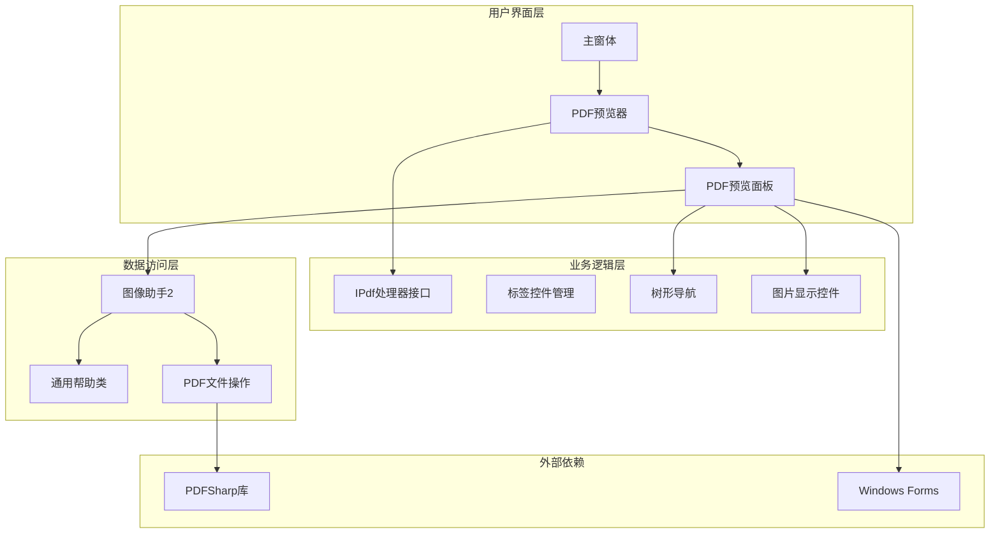
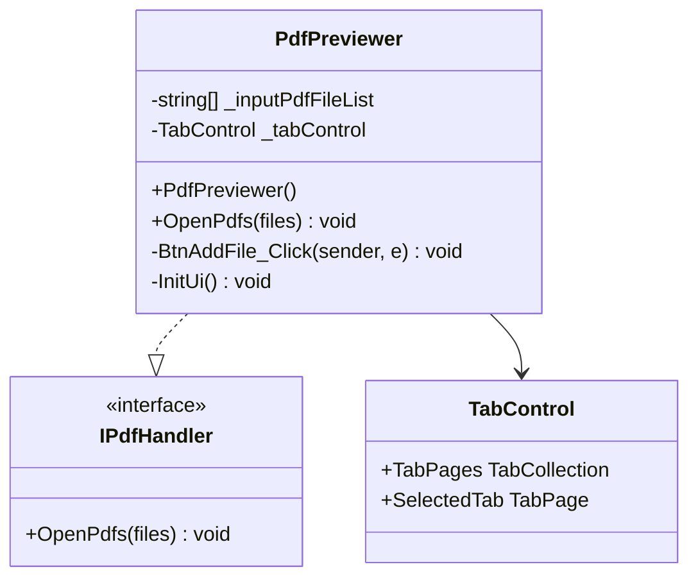
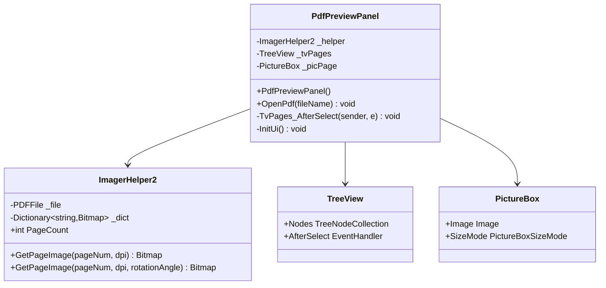
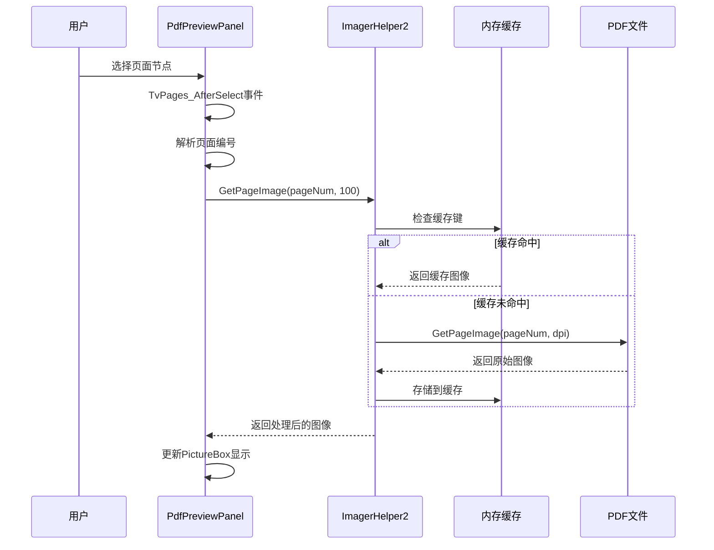
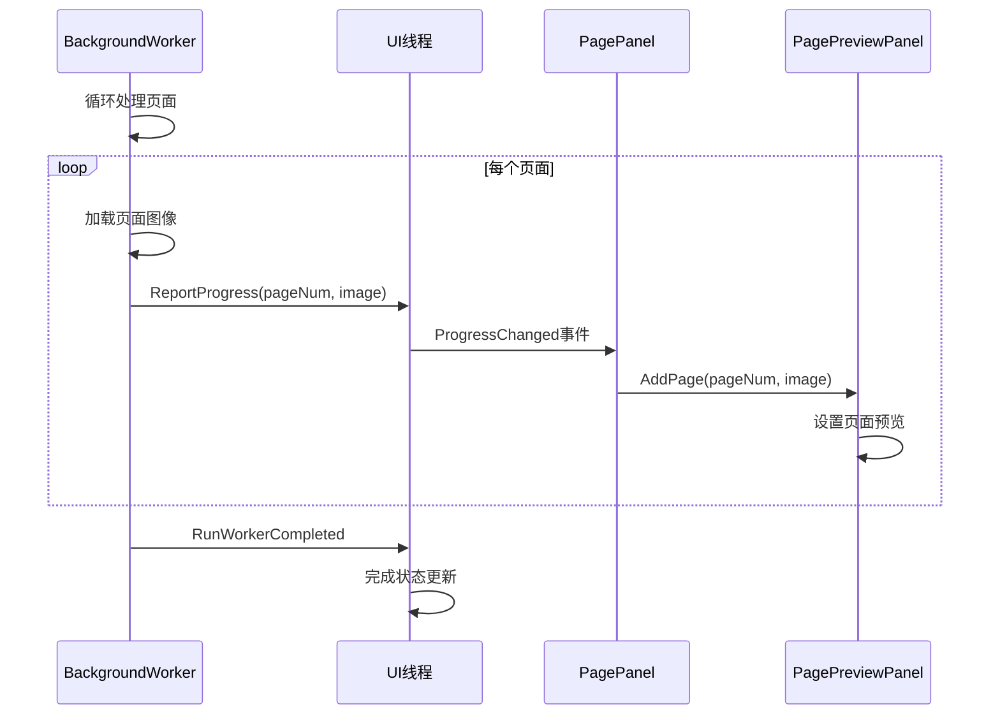
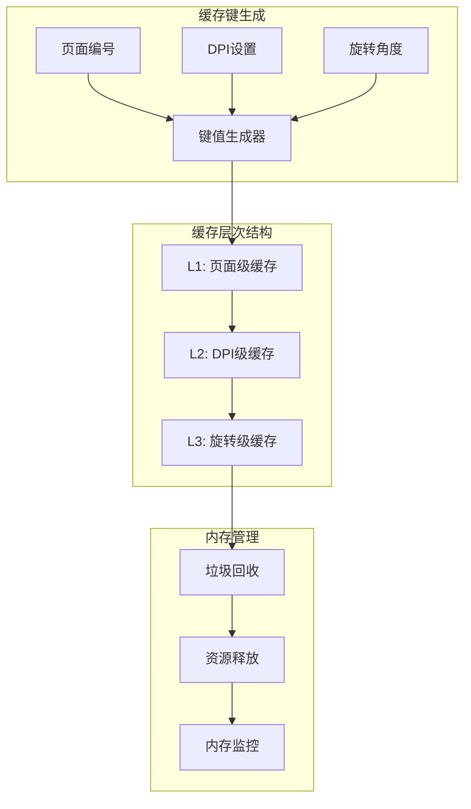

# PDF预览功能架构设计文档

<cite>
**本文档中引用的文件**
- [PdfPreviewer.cs](file://PdfTool/PdfPreviewer.cs)
- [PdfPreviewPanel.cs](file://PdfTool/PdfPreviewPanel.cs)
- [PdfPreviewPanel.Designer.cs](file://PdfTool/PdfPreviewPanel.Designer.cs)
- [PdfPreviewer.Designer.cs](file://PdfTool/PdfPreviewer.Designer.cs)
- [Common.cs](file://PdfTool/Common.cs)
- [Config.cs](file://PdfTool/Config.cs)
- [MainForm.cs](file://PdfTool/MainForm.cs)
- [ImagerHelper.cs](file://PdfHelperLibrary/ImagerHelper.cs)
- [CommonHelper.cs](file://PdfHelperLibrary/CommonHelper.cs)
- [PageOperaBase.cs](file://PdfEditor\Modules\PageOperaBase.cs)
- [PagePreviewPanel.cs](file://PdfEditor\Controls\PagePreviewPanel.cs)
- [PagePanel.cs](file://PdfEditor\Controls\PagePanel.cs)
</cite>

## 目录
1. [引言](#引言)
2. [系统架构概述](#系统架构概述)
3. [核心组件分析](#核心组件分析)
4. [PDF预览面板实现](#pdf预览面板实现)
5. [多线程加载机制](#多线程加载机制)
6. [交互功能实现](#交互功能实现)
7. [内存管理与性能优化](#内存管理与性能优化)
8. [使用指导](#使用指导)
9. [故障排除指南](#故障排除指南)
10. [总结](#总结)

## 引言

PDF预览功能是PDF工具包中的核心组件，提供了直观、高效的PDF文档预览体验。该功能采用模块化架构设计，通过PdfPreviewer和PdfPreviewPanel两个主要组件协同工作，实现了流畅的页面渲染、缩放控制、翻页导航等交互功能。系统特别注重性能优化和内存管理，能够处理大型PDF文件而不影响用户体验。

## 系统架构概述

PDF预览功能采用分层架构设计，包含用户界面层、业务逻辑层和数据访问层：

**图表来源**
- [PdfPreviewer.cs](file://PdfTool/PdfPreviewer.cs#L13-L76)
- [PdfPreviewPanel.cs](file://PdfTool/PdfPreviewPanel.cs#L8-L75)
- [ImagerHelper.cs](file://PdfHelperLibrary/ImagerHelper.cs#L129-L191)

## 核心组件分析

### PdfPreviewer组件

PdfPreviewer是PDF预览功能的主要入口点，负责管理多个PDF文件的预览会话：

**图表来源**
- [PdfPreviewer.cs](file://PdfTool/PdfPreviewer.cs#L13-L76)
- [Common.cs](file://PdfTool/Common.cs#L13-L16)

### PdfPreviewPanel组件

PdfPreviewPanel是单个PDF文件的预览界面，提供页面导航和图像显示功能：

**图表来源**
- [PdfPreviewPanel.cs](file://PdfTool/PdfPreviewPanel.cs#L8-L75)
- [ImagerHelper.cs](file://PdfHelperLibrary/ImagerHelper.cs#L129-L191)

**章节来源**
- [PdfPreviewer.cs](file://PdfTool/PdfPreviewer.cs#L1-L76)
- [PdfPreviewPanel.cs](file://PdfTool/PdfPreviewPanel.cs#L1-L75)

## PDF预览面板实现

### 页面加载流程

PDF预览面板的页面加载采用延迟加载策略，只有在用户选择特定页面时才进行渲染：

**图表来源**
- [PdfPreviewPanel.cs](file://PdfTool/PdfPreviewPanel.cs#L40-L49)
- [ImagerHelper.cs](file://PdfHelperLibrary/ImagerHelper.cs#L149-L156)

### 图像渲染机制

系统采用高质量的图像渲染算法，支持多种DPI设置和旋转角度：

| 功能特性 | 实现方式 | 性能特点 |
|---------|---------|---------|
| DPI缩放 | 高质量双三次插值 | 支持任意DPI设置 |
| 旋转变换 | RotateFlip方法 | 零拷贝优化 |
| 内存缓存 | 字典映射缓存 | 避免重复渲染 |
| 异步加载 | 后台工作线程 | 非阻塞UI响应 |

**章节来源**
- [PdfPreviewPanel.cs](file://PdfTool/PdfPreviewPanel.cs#L40-L49)
- [ImagerHelper.cs](file://PdfHelperLibrary/ImagerHelper.cs#L149-L189)

## 多线程加载机制

### 后台工作线程实现

系统在PdfEditor模块中实现了完整的多线程加载机制，确保大文件预览的流畅性：

**图表来源**
- [PageOperaBase.cs](file://PdfEditor\Modules\PageOperaBase.cs#L45-L61)

### 进度报告机制

系统通过BackgroundWorker的ProgressChanged事件实现平滑的进度更新：

**图表来源**
- [PageOperaBase.cs](file://PdfEditor\Modules\PageOperaBase.cs#L48-L54)

**章节来源**
- [PageOperaBase.cs](file://PdfEditor\Modules\PageOperaBase.cs#L45-L97)

## 交互功能实现

### 导航控制

PDF预览功能提供了丰富的导航控制选项：

| 控制类型 | 实现方式 | 用户体验 |
|---------|---------|---------|
| 页面切换 | TreeView节点选择 | 直观的树形导航 |
| 缩放控制 | PictureBoxSizeMode.Zoom | 自适应缩放显示 |
| 文件管理 | TabControl多标签 | 并行处理多个文件 |
| 拖拽支持 | DragDrop事件处理 | 便捷的文件导入 |

### 缩放与显示

系统采用智能缩放策略，根据窗口大小自动调整显示比例：

**图表来源**
- [PdfPreviewPanel.cs](file://PdfTool\PdfPreviewPanel.cs#L65-L70)

**章节来源**
- [PdfPreviewer.cs](file://PdfTool\PdfPreviewer.cs#L46-L51)
- [PdfPreviewPanel.cs](file://PdfTool\PdfPreviewPanel.cs#L55-L72)

## 内存管理与性能优化

### 缓存策略

系统实现了智能的内存缓存机制，平衡性能和内存使用：

**图表来源**
- [ImagerHelper.cs](file://PdfHelperLibrary\ImagerHelper.cs#L149-L189)

### 性能优化策略

| 优化技术 | 应用场景 | 效果 |
|---------|---------|------|
| 延迟加载 | 页面渲染 | 减少初始加载时间 |
| 图像缓存 | 重复访问 | 避免重复计算 |
| 异步处理 | 大文件加载 | 保持UI响应性 |
| 资源池化 | 图像对象 | 减少GC压力 |

### 大文件处理

对于大型PDF文件，系统采用以下策略：

1. **分页加载**: 只加载当前需要的页面
2. **动态缓存**: 根据内存使用情况调整缓存大小
3. **渐进式渲染**: 先显示低分辨率版本，再逐步提高质量
4. **内存监控**: 实时监控内存使用，及时清理无用缓存

**章节来源**
- [ImagerHelper.cs](file://PdfHelperLibrary\ImagerHelper.cs#L129-L191)
- [CommonHelper.cs](file://PdfHelperLibrary\CommonHelper.cs#L1-L28)

## 使用指导

### 基本使用流程

1. **打开PDF文件**
   - 点击"添加文件"按钮
   - 选择PDF文件（支持多选）
   - 系统自动创建新的预览标签页

2. **浏览文档内容**
   - 在左侧树形视图中选择页面
   - 右侧区域显示对应页面的缩略图
   - 支持快速跳转到任意页面

3. **多文件管理**
   - 每个PDF文件在独立的标签页中显示
   - 支持同时预览多个文件
   - 可以在不同文件间快速切换

### 高级功能使用

#### 在合并前预览文件内容

在使用PDF合并功能之前，可以利用预览功能检查文件内容：

#### 大文件处理建议

1. **内存充足时**: 使用默认DPI设置（100）
2. **内存受限时**: 降低DPI设置或启用缓存清理
3. **长时间使用**: 定期关闭不需要的预览标签页

**章节来源**
- [PdfPreviewer.cs](file://PdfTool\PdfPreviewer.cs#L30-L41)
- [MainForm.cs](file://PdfTool\MainForm.cs#L41-L58)

## 故障排除指南

### 常见问题及解决方案

| 问题类型 | 症状 | 解决方案 |
|---------|------|---------|
| 内存不足 | 应用程序卡顿或崩溃 | 关闭其他标签页，清理缓存 |
| 加载缓慢 | 页面切换响应慢 | 降低DPI设置，减少并发预览 |
| 显示异常 | 图像显示不完整 | 检查PDF文件完整性，重新加载 |
| 文件无法打开 | 报告文件格式错误 | 使用PDF修复功能处理损坏文件 |

### 性能调优建议

1. **合理设置缓存大小**: 根据可用内存调整缓存策略
2. **优化DPI设置**: 平衡显示质量和性能需求
3. **定期清理资源**: 主动释放不再需要的图像资源
4. **监控内存使用**: 使用任务管理器监控内存占用

**章节来源**
- [CommonHelper.cs](file://PdfHelperLibrary\CommonHelper.cs#L11-L26)

## 总结

PDF预览功能通过精心设计的架构实现了高效、流畅的文档预览体验。系统采用模块化设计，通过PdfPreviewer和PdfPreviewPanel的协作，提供了完整的预览解决方案。多线程加载机制确保了大文件处理的性能，智能缓存策略平衡了内存使用和响应速度。

该功能不仅满足了基本的PDF预览需求，还为后续的功能扩展奠定了坚实的基础。通过合理的架构设计和性能优化，系统能够在各种硬件环境下提供稳定的预览服务，是PDF工具包中的重要组成部分。