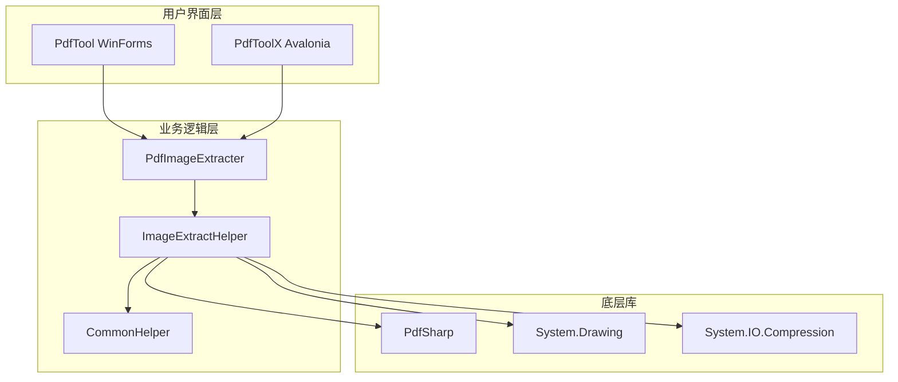
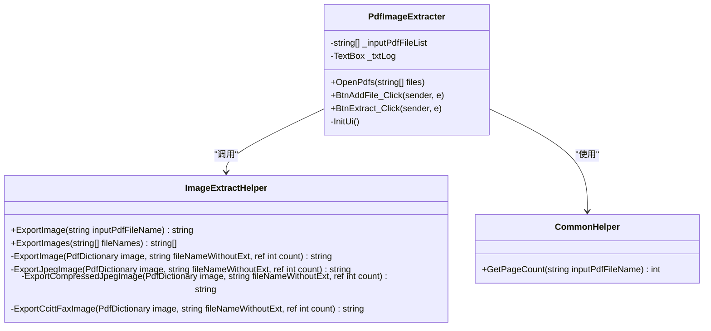
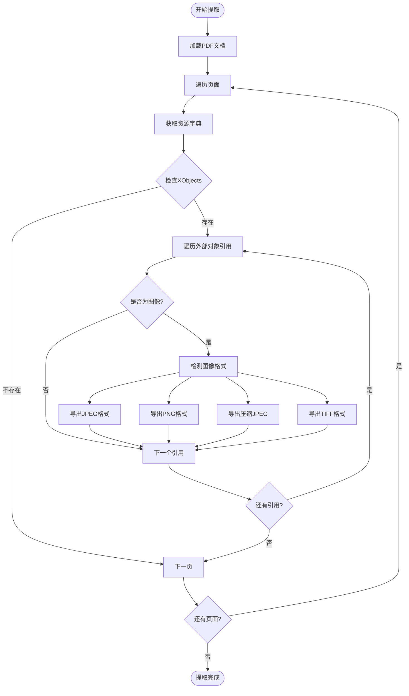
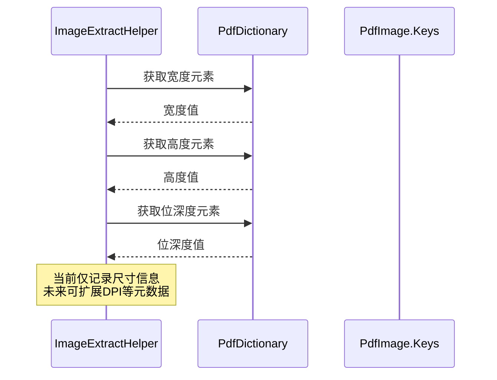
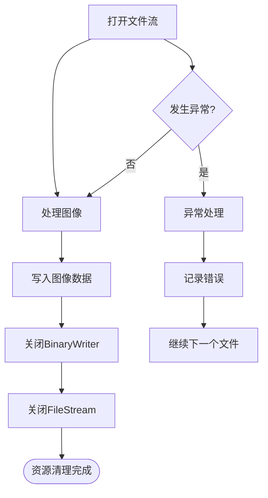

# 图片提取

<cite>
**本文档中引用的文件**
- [PdfTool/PdfImageExtracter.cs](file://PdfTool/PdfImageExtracter.cs)
- [PdfHelperLibrary/ImageExtractHelper.cs](file://PdfHelperLibrary/ImageExtractHelper.cs)
- [ExcelHelperLibrary/ImageExtractHelper.cs](file://ExcelHelperLibrary/ImageExtractHelper.cs)
- [PdfToolX/PdfImageExtracter.axaml.cs](file://PdfToolX/PdfImageExtracter.axaml.cs)
- [PdfHelperLibraryX/ImageExtractHelper.cs](file://PdfHelperLibraryX/ImageExtractHelper.cs)
- [PdfHelperLibrary/CommonHelper.cs](file://PdfHelperLibrary/CommonHelper.cs)
- [PdfHelperLibrary/ImagerHelper.cs](file://PdfHelperLibrary/ImagerHelper.cs)
- [PdfTool/PdfImageExtracter.Designer.cs](file://PdfTool/PdfImageExtracter.Designer.cs)
- [PdfTool/Config.cs](file://PdfTool/Config.cs)
- [PdfToolX/App.axaml.cs](file://PdfToolX/App.axaml.cs)
</cite>

## 目录
1. [简介](#简介)
2. [项目架构](#项目架构)
3. [核心组件分析](#核心组件分析)
4. [图像提取流程](#图像提取流程)
5. [支持的图像格式](#支持的图像格式)
6. [文件命名规则](#文件命名规则)
7. [图像元数据获取](#图像元数据获取)
8. [质量保持策略](#质量保持策略)
9. [资源释放机制](#资源释放机制)
10. [错误处理与故障排除](#错误处理与故障排除)
11. [使用示例](#使用示例)
12. [总结](#总结)

## 简介

PDF图片提取功能是PdfTool工具包中的核心组件之一，专门用于从PDF文档中识别、提取并导出嵌入的图像资源。该功能通过PdfImageExtracter类调用ImageExtractHelper类实现，支持多种图像格式的提取，并提供了完善的错误处理和资源管理机制。

## 项目架构

PdfTool项目采用模块化架构设计，主要包含以下核心模块：



**图表来源**
- [PdfTool/PdfImageExtracter.cs](file://PdfTool/PdfImageExtracter.cs#L1-L119)
- [PdfToolX/PdfImageExtracter.axaml.cs](file://PdfToolX/PdfImageExtracter.axaml.cs#L1-L62)
- [PdfHelperLibrary/ImageExtractHelper.cs](file://PdfHelperLibrary/ImageExtractHelper.cs#L1-L182)

## 核心组件分析

### PdfImageExtracter类

PdfImageExtracter是图片提取功能的主要入口点，负责用户界面交互和任务调度。



**图表来源**
- [PdfTool/PdfImageExtracter.cs](file://PdfTool/PdfImageExtracter.cs#L13-L119)
- [PdfHelperLibrary/ImageExtractHelper.cs](file://PdfHelperLibrary/ImageExtractHelper.cs#L15-L182)
- [PdfHelperLibrary/CommonHelper.cs](file://PdfHelperLibrary/CommonHelper.cs#L10-L28)

**章节来源**
- [PdfTool/PdfImageExtracter.cs](file://PdfTool/PdfImageExtracter.cs#L1-L119)
- [PdfHelperLibrary/ImageExtractHelper.cs](file://PdfHelperLibrary/ImageExtractHelper.cs#L1-L182)

### ImageExtractHelper类

ImageExtractHelper是图片提取的核心实现类，负责解析PDF文档结构并提取图像资源。

**章节来源**
- [PdfHelperLibrary/ImageExtractHelper.cs](file://PdfHelperLibrary/ImageExtractHelper.cs#L15-L182)

## 图像提取流程

图片提取过程遵循以下步骤：



**图表来源**
- [PdfHelperLibrary/ImageExtractHelper.cs](file://PdfHelperLibrary/ImageExtractHelper.cs#L17-L40)
- [PdfHelperLibrary/ImageExtractHelper.cs](file://PdfHelperLibrary/ImageExtractHelper.cs#L89-L104)

**章节来源**
- [PdfHelperLibrary/ImageExtractHelper.cs](file://PdfHelperLibrary/ImageExtractHelper.cs#L17-L40)

## 支持的图像格式

系统支持多种PDF图像格式的提取：

| 格式类型 | PDF过滤器 | 输出格式 | 处理方式 |
|---------|-----------|----------|----------|
| JPEG | `/DCTDecode` | `.jpeg` | 原生支持，直接写入流 |
| PNG | `/FlateDecode` | `.png` | 需要格式转换（待实现） |
| 压缩JPEG | `/FlateDecode /DCTDecode` | `.jpeg` | 先解压后写入 |
| CCITT Fax | `/CCITTFaxDecode` | `.tiff` | 转换为1位索引位图 |

**章节来源**
- [PdfHelperLibrary/ImageExtractHelper.cs](file://PdfHelperLibrary/ImageExtractHelper.cs#L91-L103)

## 文件命名规则

提取的图像文件遵循统一的命名模式：

```
原始文件名_序号.扩展名
```

- **原始文件名**：不带扩展名的输入PDF文件名
- **序号**：从0开始递增的数字
- **扩展名**：根据图像格式自动确定

例如：
- `document_0.jpeg`
- `manual_1.png`（待实现）
- `report_2.tiff`

**章节来源**
- [PdfHelperLibrary/ImageExtractHelper.cs](file://PdfHelperLibrary/ImageExtractHelper.cs#L111-L116)
- [PdfHelperLibrary/ImageExtractHelper.cs](file://PdfHelperLibrary/ImageExtractHelper.cs#L148-L154)
- [PdfHelperLibrary/ImageExtractHelper.cs](file://PdfHelperLibrary/ImageExtractHelper.cs#L166-L167)

## 图像元数据获取

虽然当前版本主要关注图像内容提取，但代码中包含了获取图像元数据的预留接口：



**图表来源**
- [PdfHelperLibrary/ImageExtractHelper.cs](file://PdfHelperLibrary/ImageExtractHelper.cs#L121-L123)

**章节来源**
- [PdfHelperLibrary/ImageExtractHelper.cs](file://PdfHelperLibrary/ImageExtractHelper.cs#L121-L123)

## 质量保持策略

### JPEG格式保持
对于原生JPEG格式的图像，系统采用无损提取策略：

- **直接流复制**：利用PDF中JPEG的原生支持特性
- **零压缩损失**：避免重新编码导致的质量损失
- **内存优化**：使用BinaryWriter进行高效写入

### 压缩JPEG处理
对于经过Flate压缩的JPEG图像：

- **解压缩处理**：移除前两个字节的压缩标记
- **标准JPEG输出**：确保兼容性
- **内存流管理**：使用MemoryStream进行临时存储

### PNG格式支持（待实现）
系统预留了PNG格式转换的接口，计划实现：
- PDF内部格式到Windows位图的转换
- GDI+图形库的PNG保存功能
- 保持透明度和色彩深度

**章节来源**
- [PdfHelperLibrary/ImageExtractHelper.cs](file://PdfHelperLibrary/ImageExtractHelper.cs#L107-L116)
- [PdfHelperLibrary/ImageExtractHelper.cs](file://PdfHelperLibrary/ImageExtractHelper.cs#L130-L154)
- [PdfHelperLibrary/ImageExtractHelper.cs](file://PdfHelperLibrary/ImageExtractHelper.cs#L119-L132)

## 资源释放机制

系统实现了完善的资源管理策略：



**图表来源**
- [PdfHelperLibrary/ImageExtractHelper.cs](file://PdfHelperLibrary/ImageExtractHelper.cs#L112-L116)
- [PdfHelperLibrary/ImageExtractHelper.cs](file://PdfHelperLibrary/ImageExtractHelper.cs#L149-L152)

### 关键资源管理点

1. **文件流管理**：使用using语句确保FileStream正确释放
2. **二进制写入器**：显式调用Close方法确保缓冲区刷新
3. **内存流处理**：对临时内存流进行及时清理
4. **异常安全**：在catch块中确保资源得到妥善处理

**章节来源**
- [PdfHelperLibrary/ImageExtractHelper.cs](file://PdfHelperLibrary/ImageExtractHelper.cs#L112-L116)
- [PdfHelperLibrary/ImageExtractHelper.cs](file://PdfHelperLibrary/ImageExtractHelper.cs#L149-L152)

## 错误处理与故障排除

### 主要错误类型

| 错误类型 | 可能原因 | 处理策略 |
|---------|----------|----------|
| PDF读取失败 | 文件损坏或权限问题 | 返回详细错误信息 |
| 图像格式不支持 | PDF使用特殊压缩格式 | 记录警告并跳过 |
| 内存不足 | 大型图像文件 | 分块处理或提示用户 |
| 文件写入失败 | 磁盘空间不足 | 检查磁盘空间并重试 |

### 嵌入式字体干扰处理

虽然主要针对图像提取，但系统考虑了可能的字体干扰：

- **资源隔离**：只提取/Subtype为/Image的对象
- **类型验证**：严格检查PDF对象类型
- **异常捕获**：完整捕获并报告解析异常

### 故障排除指南

1. **提取失败**：检查PDF文件完整性，确认有可用图像
2. **格式不支持**：尝试其他PDF阅读器验证图像格式
3. **性能问题**：分批处理大型PDF文件
4. **权限问题**：确保程序具有文件读写权限

**章节来源**
- [PdfHelperLibrary/ImageExtractHelper.cs](file://PdfHelperLibrary/ImageExtractHelper.cs#L42-L45)
- [PdfHelperLibrary/ImageExtractHelper.cs](file://PdfHelperLibrary/ImageExtractHelper.cs#L78-L84)

## 使用示例

### 从产品手册PDF中批量提取高清图片

```csharp
// 示例：批量处理多个PDF文件
var pdfFiles = new List<string> 
{
    "product_manual.pdf",
    "technical_guide.pdf",
    "brochure.pdf"
};

// 调用图片提取功能
var extractedImages = PdfHelperLibrary.ImageExtractHelper.ExportImages(pdfFiles);

// 处理结果
foreach (var imageFile in extractedImages)
{
    Console.WriteLine($"成功提取: {imageFile}");
}
```

### 单个PDF文件提取

```csharp
// 示例：单个PDF文件处理
try
{
    string result = PdfHelperLibrary.ImageExtractHelper.ExportImage("high_quality_manual.pdf");
    Console.WriteLine(result); // 输出: "提取 15 张图片."
}
catch (Exception ex)
{
    Console.WriteLine($"提取失败: {ex.Message}");
}
```

### 实时提取监控

```csharp
// 示例：带有进度监控的提取
var backgroundWorker = new BackgroundWorker { WorkerReportsProgress = true };
backgroundWorker.DoWork += (sender, e) =>
{
    foreach (var file in pdfFiles)
    {
        var result = PdfHelperLibrary.ImageExtractHelper.ExportImage(file);
        backgroundWorker.ReportProgress(0, result);
    }
};
```

**章节来源**
- [PdfTool/PdfImageExtracter.cs](file://PdfTool/PdfImageExtracter.cs#L57-L78)
- [PdfToolX/PdfImageExtracter.axaml.cs](file://PdfToolX/PdfImageExtracter.axaml.cs#L46-L59)

## 总结

PdfTool的图片提取功能提供了完整而可靠的PDF图像提取解决方案。通过PdfImageExtracter和ImageExtractHelper的协作，系统能够：

- **高效提取**：支持多种PDF图像格式的快速提取
- **质量保证**：采用无损提取策略保持图像质量
- **资源管理**：完善的资源释放和异常处理机制
- **扩展性强**：预留接口支持未来功能扩展
- **易于使用**：简洁的API设计便于集成和使用

该功能特别适用于需要批量处理PDF文档、制作高质量印刷品或进行文档数字化的工作场景。随着PNG格式支持的完善和元数据提取功能的增强，该工具将在文档处理领域发挥更大的作用。